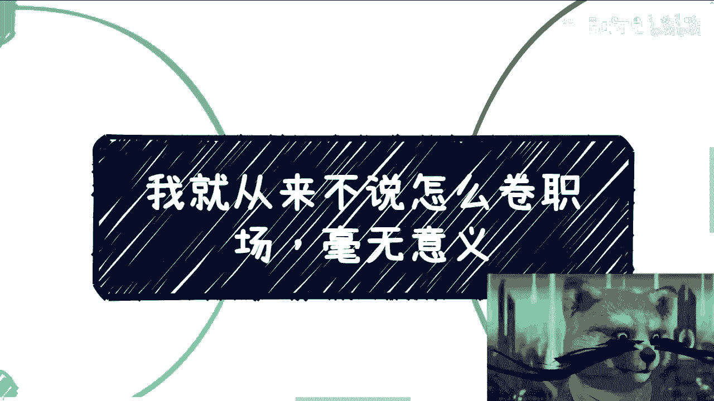
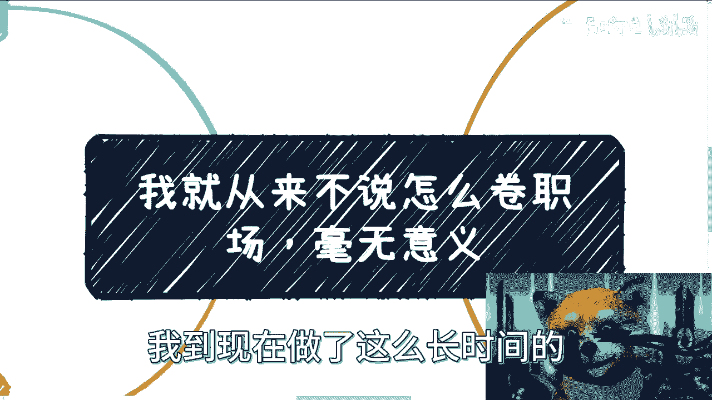
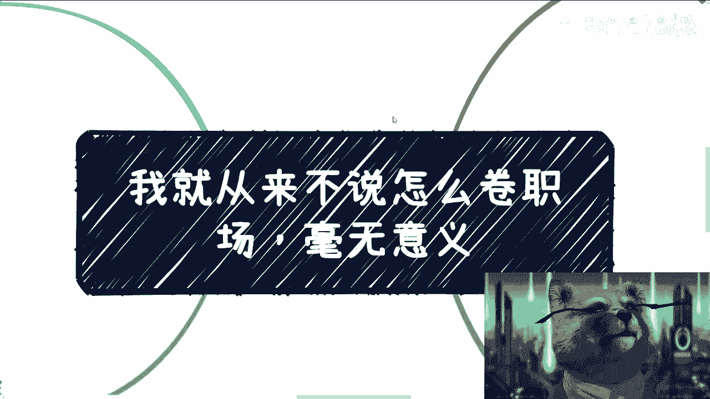
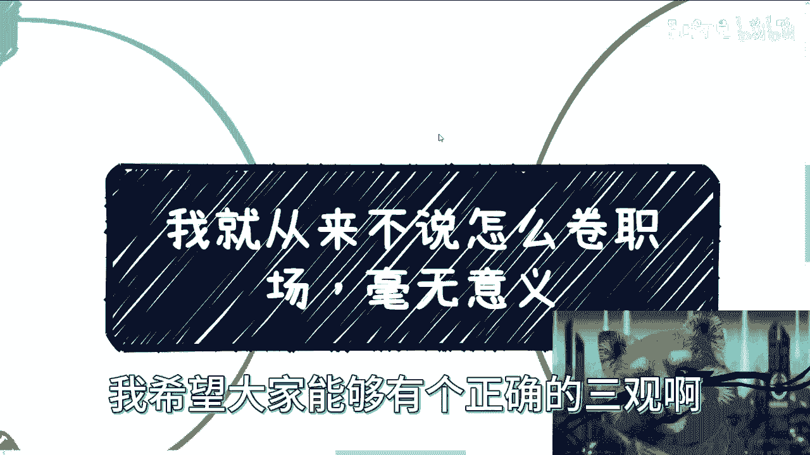
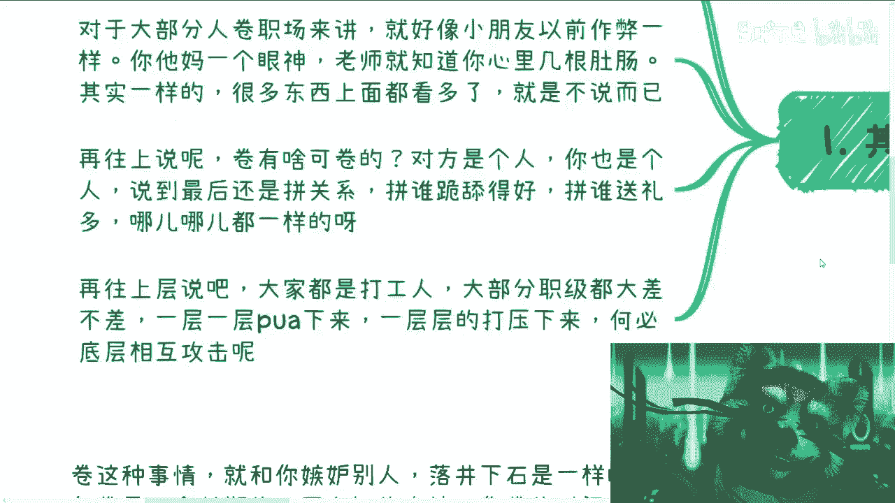
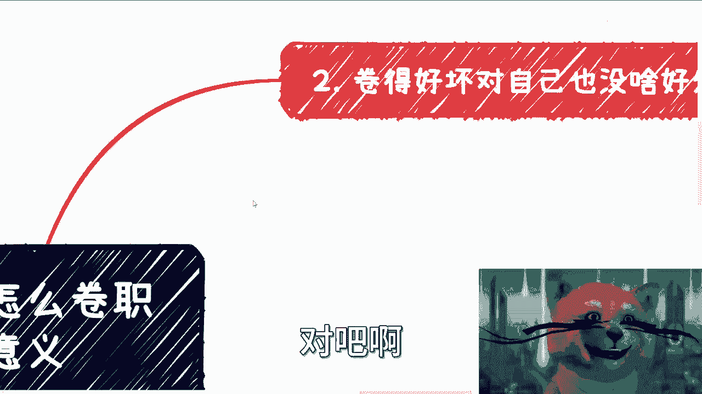
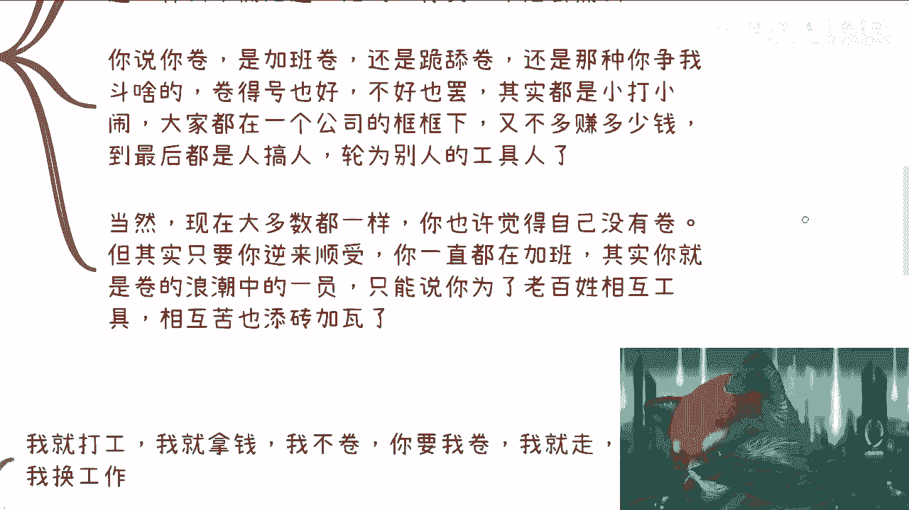
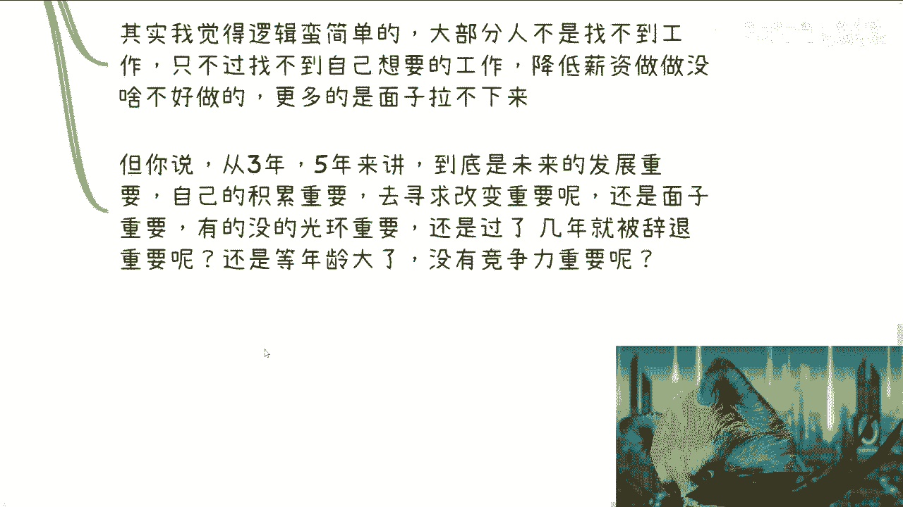
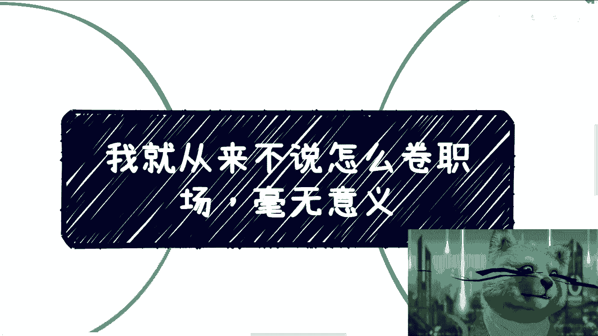

# 我就从来不说怎么卷职场，毕竟都是劳动人民相互伤害 - P1 - 赏味不足 - BV1FM411X7zE

好大家好，因为这两天翻B站是吧。

好多都是这个职场好啊，然后播放量还很高，我到现在做了这么长时间了。

这个内容啊，我包括在直播，包括在其他地方我也说了，我从来不跟大家说怎么去卷职场，因为为什么呢，嗯这么说吧。

就是说创业公司大公司我也都待过啊，然后外企的话呢。

我朋友也很多，总体来讲呢，我觉得综合下来呢，他没有什么意义啊，虽然啊我相信每个人啊，大家面临的问题啊，面临的细节，面临的压力也都不一样，但是我希望就是大众啊，这个看到这个视频的。

或者说未来希望能有所改变的，我希望大家能够有个正确的三观。

去看待这么一个东西，呃，首先第一点啊。

呃卷职场他就是个过家家的行为啊，呃我们一层层来讲啊，对于大部分人来讲，卷职场呢他就更像一个小朋友，以前作弊就是你读小学，你说我想作弊啊，你觉得很牛逼啊，然而你一个眼神老师就知道你心里面几个都长。

你明白这个道理吗，就说职场这个东西说的嗯，我就拿它跟AI来相比啊，就是很多东西它的本质是不变的，只不过是市场上面或者营销层面，都不停的不停的不停的在换概念，但是你真的时间长了。

比如说你现在已经是个30多岁，40多岁啊，已经是一个经验丰富老道的一个人了，或者你已经是一个senior manager对吧，或者怎么样，那其实你就会明白，其实无非就是那些东西，他没有什么花花头对吧。

要么就是职场斗争，要么就是男女之事没了，那还能有什么花头呢，没花头的无非都是如此，为什么，因为职场本身就是个很单纯的地方，就是它相对社会相对这个商业来讲，他单纯的不能再单纯。

就我为什么一直比喻成幼儿园是真的有道理的，因为他跟幼儿园没什么区别啊，那么所以说呢本质上是一样的，就很多东西呢你在上面，或者你在一个稍微上层的地方看多了，也就那样，然后呢上面的人比如说你的mental。

对你的leader他只是不去说而已啊，那么再往上讲卷呢，有啥可卷的，你想想看，对方也是个人，你也是个人啊，大家还都在一个这个非常小的框架体系下，面对吧，我不管今天你是在小公司，大公司还是外企。

说到最后还是凭关系拼谁跪舔的好，拼谁送礼多，当然你在国企央企，你在别的地方可能这个手段不一样啊，但是无非就是那么些手段，没什么东西了，也就那样对啊，就像我们以前这个说啊，中国这个各省市区啊，各个地方。

比如说北方南方，我跟大家说这个商业不一样，那不一样在什么地方呢对吧，那不一样无非就在于说啊，你这个请客吃饭，应该请大概什么价位的，应该送多少钱的红包对吧，吃完饭要不要去KTV，去KTV。

要不要有各种各样的service，就这些东西，当然你们也别觉得哎呀2023年了，你吕老师怎么还在讲这个东西，那不好意思，我告诉你这些东西不会改变啊，永远都是存在的，怎么办对吧。

哎呀那么再往上说啊，大家都是打工人啊，大部分的职级，比如说VP或以下，或者说你是一个股东，call founder一下的，大部分的职级大差不差，无非就是一层层PUA下来，没有区别点。

一层一层PU为一层一层打压对吧，那你在我看来。

我为什么从来不说这个东西，就是因为在我看来，无论大家技巧多么的熟练，也无论大家的心思多么的缜密，你其实还是底层相互攻击，何必呢对吧，就是你从这个叫什么，就是呃低一点的角度来看，你就是底层相互攻击。

你从宏观角度来看，你就是别人的工具人，就被别人当枪使，对吧啊。

那么第二点啊，卷的好坏呢，我觉得对自己也没啥好处，为什么呢，因为你看啊，如果你要考试，你要考学历，你考证书，那没问题对吧，该怎么考怎么考啊，先我先不去说他考出来有没有多大作用啊。

这件事总体来讲你还算投资自己，虽然在我看来并没什么卵用对吧，但总有总比没有好吧，但是很多卷呐，你看啊，很多视频教大家职场内啊，这个什么不加班啊，怎么跟领导汇报啊，怎么样怎么样啊，说的是怎么卷向上管理。

怎么卷向下管理，怎么去卷PUA知道啊，怎么平衡之道啊，怎么怎么好像什么的，好像就就就他妈都能扯到那么古代帝王之术啊，我只想说就是大家都是老百姓，大家都是拿份死工资的，你就是你明明都在一个阶层。

你还要搞这些，有的没的，你良心不会痛吗，对啊，你说你卷对吧，你比如说你加班卷还是跪舔去卷，还是那种你争我斗啊，你卷的好也好不好也好，其实都是小打小闹，大家在一个框框下面，你卷得好，你又不是多几百万。

觉得不好，你也不会亏几百万啊，又不是多赚多少钱，少赚多少钱，你要拼个你死我活对吧，到最后都是人搞人，底层搞底层沦为编程工具人，你图什么呢。

啊当然现在大部分大多数都一样啊，你很多人可能觉得自己没有卷，但其实你要明白对吧，就是当我们说雪崩的时候。

没有一片雪花是无辜的，什么意思，就是说其实很多时候我们每一个人的逆来顺受，每一个人的加班，每一个人的这种这种这种跪舔，它都是卷的浪潮当中的一员啊，只能说啊，我只能说你为了老百姓相互成为工具啊。

相互去攻击啊，最终比较比如说很苦对吧，或者说最终被辞退也是添砖加瓦。

明白这个道理吗，那么第三啊。

我就像我今天核心说的，我说我还是想说一个正确的态度啊，做不做得到看每个人都无所谓啊，呃我觉得正确的态度是什么，就是我就是打工，我就是拿钱，我不觉没什么好卷的，你要我卷我就走，我换工作怎么了啊。

世界这么大，没我容身之处吗，对吧，我可以平穷，我也可以节约，我也可以忍受，但我不卷，我为什么要卷，对吧啊，我要去找我就是要去找不卷的，然后什么叫不卷呢，就是那些能看到能认可我价值的地方，对吧。

哦每个人就活一次，我为啥要委屈自己，我去卷呢，哦难道说你比如说我去做商业也是的对吧，你有一个比如说政府，或者来说有个高校，有个什么地方，我们谈不拢，那谈不拢就谈不拢，们换呀，怎么了呢。

我为什么要跪舔你啊，对位了哦，世界这么大，难道就没有人懂我的价值吗，我不信了，我觉得还有个态度是什么，就是你作为资本家，你可以觉得你给我钱，我就该给你干活，随便什么时候干，你可以这么觉得。

但是我可以不这么觉得对吧，哦你你怎么觉得是你的事情啊对吧，我就觉得我就是你比如说给我1万块钱，我就干这点活，对吧，哦你双休就不应该来打扰我，你打扰我干什么，你给我加班工资不啦，对不啦。

你认为人你你你不给我也可以，你你给我调休，你要记我这个人情啊，你别觉得好像理所当然，我他妈跟你签劳务合同，好像就卖给你了对吧，我觉得就是说不是说大家一定要叫什么什么，什么刚对吧。

或者说怎么怎么去对互怼对吧，或者怎么样，我觉得就是正常的态度平起平坐啊，凭什么，凭什么你高我低呢，是吧啊，其实我觉得逻辑蛮简单的，就大部分人不是找不到工作，他只不过找不到自己想要的工作。

降低薪资做做也没啥不好，而且更多的人呢他主要是面子拉不下来啊，你比如说父母觉得这工作没不体面对吧，自己觉得我的，我我本科硕士出来怎么做这种工作，对吧啊，这都是面子问题。

但是你但凡空下来动动脑子想想看对吧，人总要老的，你总有3年后，5年后10年后的问题，那么你想想看，你往5年后10年后看，你觉得到底是未来的发展重要，自己的积累重要，自己的关系重要，去寻求这种改变重要呢。

还是说你的这些莫名其妙的面子重要，有的没的光环重要，还是说过了几年就被辞退重要，你要自己去想的，因为每个人都会走到这一步的对吧，还是说等你年龄大了，没有竞争力的重要，你要去思考这个问题啊。

因为大部分人因为我们说真的不管卷也好，还是直接发展也好，金字塔的上层上去的永远都是少数人对吧，那么我们就说啊，虽然我们我们说每个人都是博概率，但是你在这个地方博概率的概率比例。

你你你的整个基本的盘子的这个量，以及你能赚到的钱的这个量，跟你在外面博概率的量完全不是一个量级啊。

好那么说第四点你还要明白一点，就是卷出来的他也不是战友啊，更多的也是敌人。

而且这种敌人呢很low啊，这种敌人很弱，他们会通过各种下三滥的手段来攻击你啊，那么卷各种事情呢，就是和啊你嫉妒别人落井下石期一个道理，因为卷这件事情，你一旦开始走这条路，它是一个长期的。

而且是一个不自知的事情，就是你一直在卷，但是你不自知啊，你卷的时间长了，其实你身边的人，你的合作伙伴，自然而然就会明白你是什么样的人和属性，他越能明白你是怎么样的人和属性，你懂吗。

就是因为人和人的价值是相互的啊，你就打比方说你是一个很卷的对吧，你是个你是一个就是说在公司里面对吧，然后怎么样怎么样怎么样的一个人，但是你要是真的想要去赚钱，你对于那些能够四两拨千斤。

能够高性高性价比赚钱人来讲，你就是nobody，为什么，而且而且你是个high risk nobody，为什么，因为你会卷吗，你卷就说明你你你你这种心里小九九特别多啊，而你一直在一些公司里面做。

就说明你的格局很低，那你说那当然了，我就可以告诉你们，当你们某一天能够高性价比的去赚钱，或者说你们接触的人的圈子，能够有一定的这个跃进的时候，你就会发现所有的人真的就是说能够去赚，有能力赚钱的人。

他只关心一点，那就是稳定，那就是安全，别的不重要，真的不重要，就是我可以告诉你们，我在web3这几年每天打电话给我，说，就是说这个资金兑换的吧，包括资金出境的量很大很大，就起步都是十个亿，20个亿的。

你有没有有没有吸引力，当然有啊，但是安不安全不安全啊，对不了，就是赚钱的手段很多，但是安全和稳定永远是第一位的对吧，但是你相对一个卷会很会卷的人，同时他又没做过商业，只是在公司里面来讲。

这就是个定时炸弹啊，那么很多时候你卷跟你嗜血变疯狂，其实是一个道理，就是你认为你在前进，但其实你就在原地打转，因为你永远在一个level，而且在攻击自己的这个同level的那些人对吧。

因为你本身卷这种卷，你既不带来财富的增长，也带也带不了圈子的跃进，没有意义的啊，我们说商业上合作要积累的是占有对吧，要积累的是背靠背的一起赚钱的伙伴哦，并且是可信任的，安全的稳定的伙伴。

但是卷尤其是职场中的卷，你更多的只会留下来，敌人为什么，因为没有底线啊，所有卷的人其实都是没有底线的，尤其是主动卷的那些人没有底线的，因为他们当他们杀红眼的时候，他们根本就不知道自己其实什么都没得到。

只不过是沦为了别人的工具而已对吧，所以说你相互卷的时候，你只是不知道什么时候成，相互成为下一个目标罢了。

因为你要明白啊，所有的东西我们说公司内的卷也好，包括自媒体来说卷也好对吧，包括就是说很多人来教你们怎么卷也好，就是它是一环套一环的一个生态，就像我们说割韭菜，它是一个一上层割下层，第一层割第二层。

第二层割第三层，第三层割第四层的这么一个环节对吧，而每一层最终会形成一场大的雪崩，只不过只不过说白了就是说这个雪崩，有的时候是小的对吧，大家可能爱看看，唉蛮漂亮的，老还能欣赏一下，有的人会叫造成。

比如说整个村村子的没落，或者整个家破人亡，但只不过他血不能程度不一样，但是他都在崩，而我们每一个人其实都是里面的一个环节对吧，不管你承不承认，都是里面有嗯。

说个题外话吧，就像之前广州有个小姑娘，当时问过我这么一个问题，她说是不是赚钱的人，或者说是不是赚性价比高的人，都是没有底线的，或者说都是多多少少有灰色地带，我当时回答是这么说的，我说在我的认知里面。

本身只要赚钱这件事情，他就有灰色地带，但是并不代表他自己知道，因为有的人赚性价比高的钱，它的业务非常干净，没有任何问题，但是问题是所有的业务它不是单个节点，它是一个链路对吧，就像我们说蝴蝶效应。

什么叫蝴蝶效应，就是你今天赚了一笔干净钱，但是问题是那笔钱哪里来的呢，他们又是问谁要的呢，而那些钱来了之后又会造成多大的影响呢，所以你通过蝴蝶效应，在我看来所有的性价比高的钱。

因为它已经打破了整个金融的平衡对吧，那么也就意味着你赚多多出来的这笔钱，总有人亏掉这笔钱，那么这些人就是我们说的，就是如果反反映到你身上，那就是我们说的你不要脸对吧，你可能底线比较低。

但是你单纯从他业务来讲没有问题对吧，当然你不能说哦，哦这个这个按照你这个说法，那每个人都有罪对吧，每个人都都你要去指责他啊，这个倒不是，我只是觉得就是说大家得要去明白这个道理啊，不要就是说太圣母对吧。

太就是就是就是道德观很高，但也不要说走到另外极端啊，每个人都他妈啊，每个人都是不要脸对吧，那也不是，就是因为本身人类社会它就是这么个运作方式，你何必去，就是说一定要去拥护它，或者一定要去指责他。

没有必要的，对了我，我说不好听点，我们你也好我也好啊，我们在那边讨论哎这个东西怎么样啊，那个东西怎么样浪费时间啊，我又赚不到钱，讨论这些东西干什么，对吧好吧行吧，那就这么着吧啊呃好吧。

大家反正有什么这个这个呃职场对吧，或者说商业或者说副业，或者是赚钱，或者说你们想要去知道各种更多的高性价比，赚钱方式，嗯你们可以整理好问题好吧，然后我们再来做咨询，随缘啊。

随缘啊。