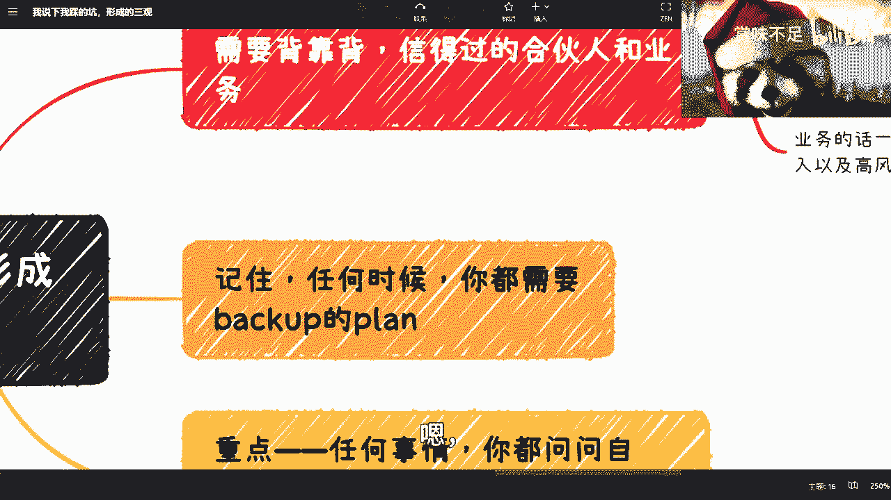

# 课程名称：避坑指南与个人成长策略 - P1 🧭

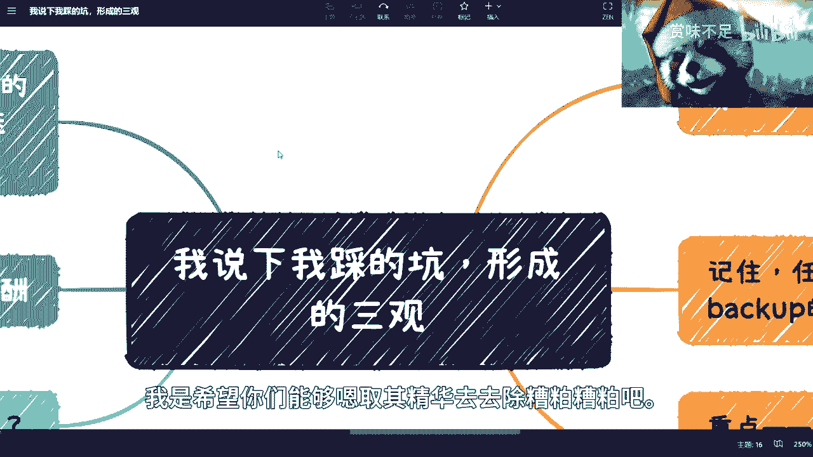

在本节课中，我们将学习如何识别并规避在职业发展、商业合作与个人成长中常见的“坑”。课程内容基于实践总结，旨在帮助初学者建立务实、高效的思维与行动模式。

---

## 概述

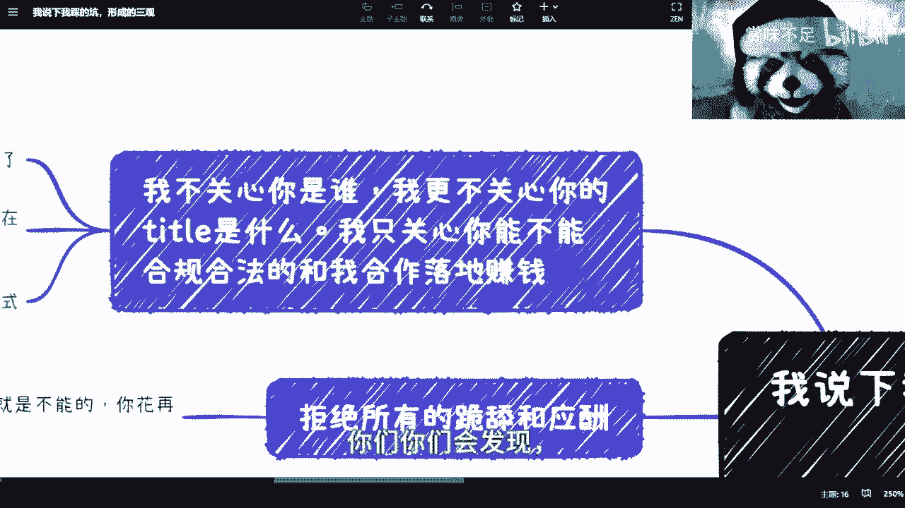

本节课程将分享一系列关键原则，涵盖如何评估合作价值、管理个人时间、建立商业思维以及规划收入结构。核心目标是帮助你聚焦于实际能力与产出，避免被虚名和无效社交所累，从而更稳健地实现个人发展。

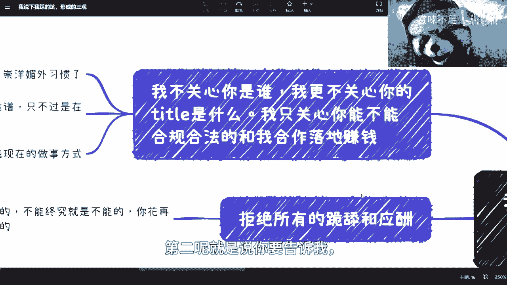

---

## 核心原则一：关注实际能力，而非虚名 🎯

上一节我们介绍了课程的整体目标，本节中我们来看看第一个核心原则。在合作与工作中，对方是谁、有什么头衔或学历并不重要。唯一重要的是对方能具体做什么，以及能否将事情落地。

**核心公式**可以概括为：
**有效合作 = 可验证的执行力 + 可落地的成果**

以下是基于此原则的具体行动建议：

*   **以结果为导向**：在沟通中，直接关注对方能提供的具体价值与合作落地方案。
*   **设立验证期**：对于潜在合作者，可以提供一个短期（例如三个月）的具体业务任务。通过其执行过程和结果，来判断其真实能力和资源整合水平。
*   **拒绝空谈**：如果对方在验证期内无法产出任何实际成果，应果断停止合作，无需进行额外的无效社交。

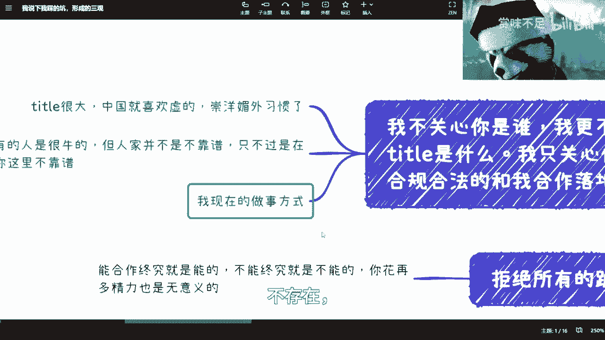

---

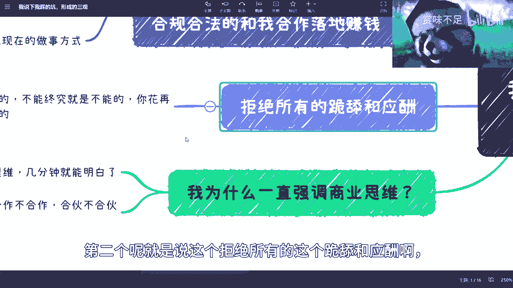

## 核心原则二：拒绝无效社交与“跪舔” 🤝

上一节我们强调了以能力为核心，本节我们来探讨与之相关的社交原则。许多传统观念认为应酬和迎合是必要的，但这往往是一种误区。

你需要明白一个根本逻辑：**能合作的基础是双方价值的匹配，而非社交频率的多少**。形式上的交往（如吃饭、喝酒）无法改变合作的本质。如果价值不匹配，再多的应酬也毫无意义；如果因“花钱”而达成合作，那本质是消费行为，而非能力认可。

因此，应将时间和精力专注于提升自身价值和寻找真正的价值互换，而非用于无效的社交活动。

---

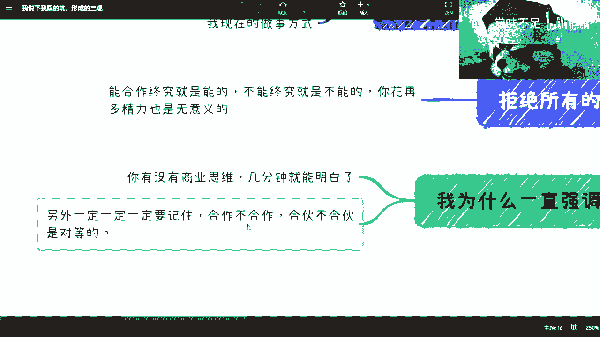

## 核心原则三：建立并坚持对等原则 ⚖️

上一节我们讨论了社交的有效性，本节我们深入探讨关系中的对等性。无论是在合作、聊天甚至日常回复消息中，对等原则都至关重要。

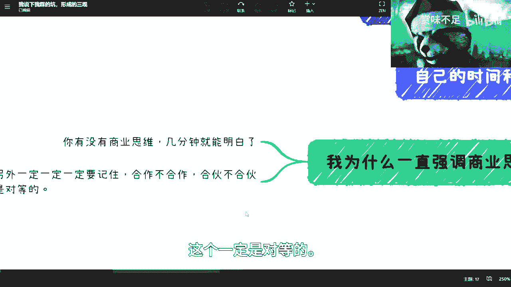

**核心逻辑**是：**关系的健康度取决于双方的相互尊重与价值认可**。

这要求你首先必须尊重自己的时间与付出。如果你自己都认为自己的时间和劳动不值钱，别人自然不会尊重你。例如，在职场中选择接受不合理的待遇（如无意义的996加班），有时可能源于对自己价值评估的不足或努力方向有误。

**关键点**：问题的根源往往不在于别人是否尊重你，而在于你是否从一开始就足够尊重自己。

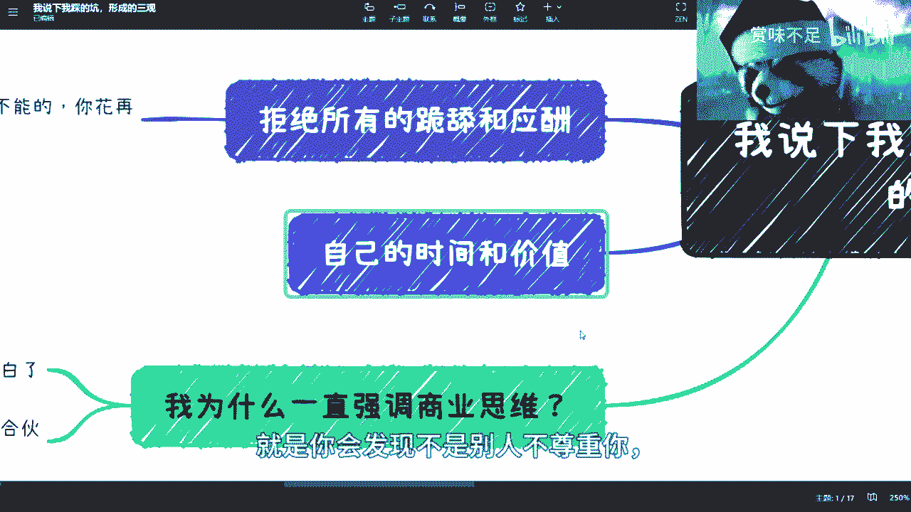

---

## 核心原则四：主动积累，拓宽信息渠道 📈

上一节我们谈了对内要自我尊重，本节我们看看对外如何主动构建资源。个人发展需要持续积累，主要包括两方面：**可行的商业模式/业务** 和 **可靠的合伙人/合作伙伴**。

以下是获取这些积累的方法：

*   **主动社交与实践**：不要停留在空想或被动接收信息。应主动走出去与人交流，接触不同的项目和圈子。
*   **多渠道验证信息**：对于任何信息（如行业前景），不要依赖单一渠道（如某个博主或平台）。必须通过多个渠道进行交叉验证，并尽可能亲自了解实际情况。
*   **明确可靠关系**：需要清醒认识到，单份工作、甚至家人都未必是永远的依靠。最可靠的通常是你自己，以及那些曾与你并肩作战、共同创造过价值的伙伴。

---

## 核心原则五：构建多元化的收入结构 🏗️

上一节我们讨论了资源的积累，本节我们将其落实到具体的收入规划上。依赖单一收入来源（如一份工作）是高风险的行为，因为个人的能力难以始终对抗时代的变迁。

稳健的策略是构建一个多元化的收入组合：

**收入组合 = 稳定收入 + 持续性收入 + 短期项目收入 + 高风险高回报收入**

你需要在能力范围内，让这几种类型的收入并存。如果在一个行业内无法实现，就需要考虑开拓其他行业或领域。

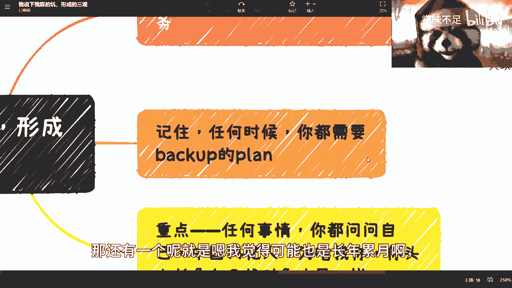

---

## 核心原则六：永远保持怀疑，准备备选方案 🛡️

上一节我们规划了收入结构，本节我们来建立最后的防御思维。在任何时候，面对任何看似诱人的机会（如“做了就能赚钱”的建议），都必须保持警惕。

**核心逻辑**：一个对你一无所知的人，却向你承诺确定的成功，这本身就是一个危险信号。

因此，你需要养成以下习惯：

1.  **顺境时备荒**：即使在业务顺利、收入可观的时候，也要开始规划和尝试备选方案。顺境不可能永久持续。
2.  **逆境时并行**：在开拓新业务时，不要只做一个计划。应同时构思和尝试多个切入点，并行推进，而非串行等待。
3.  **长期视角**：以整个人生和工作周期来看待收入与发展，不要满足于“比上不足，比下有余”的短暂安逸。

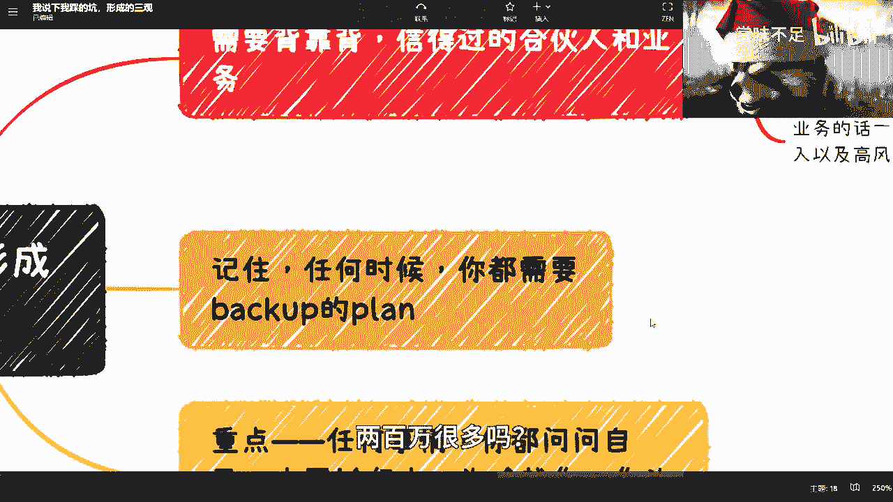

---

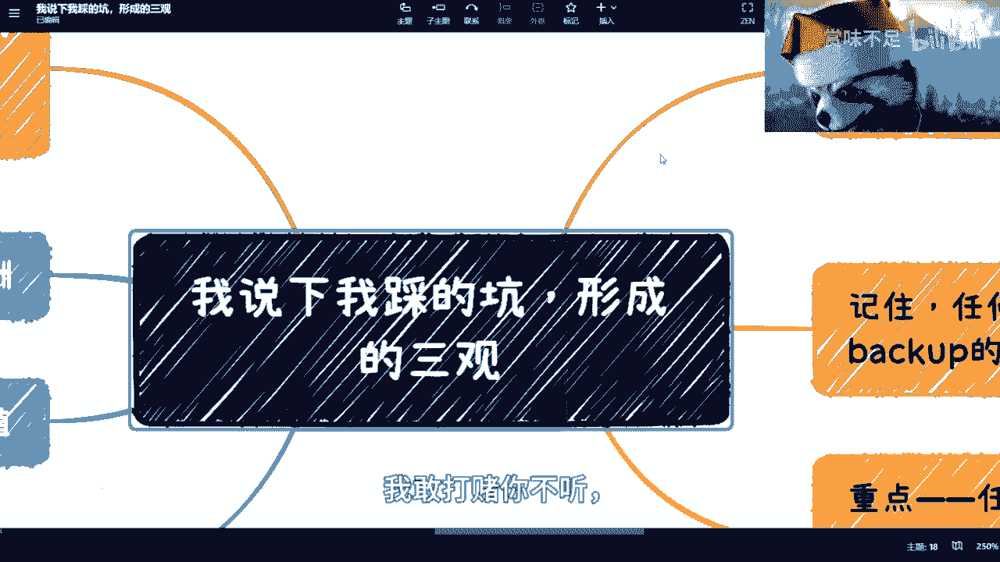

## 总结

本节课中，我们一起学习了六条关键的避坑与发展原则：
1.  **聚焦实际能力与产出**，用结果验证人。
2.  **拒绝无效社交**，相信价值匹配而非形式主义。
3.  **坚持对等原则**，从自我尊重开始。
4.  **主动积累资源**，通过实践和多渠道验证获取信息。
5.  **构建多元化收入结构**，降低单一风险。
6.  **始终保持怀疑精神**，并为顺境和逆境都准备好备选方案。

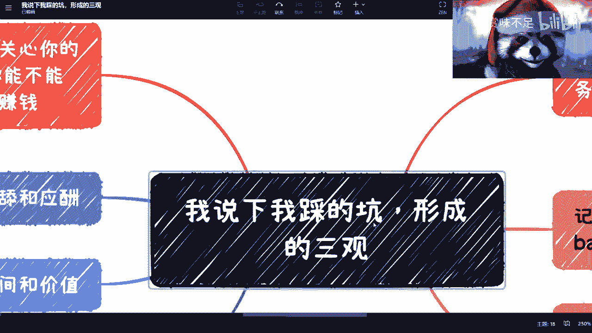

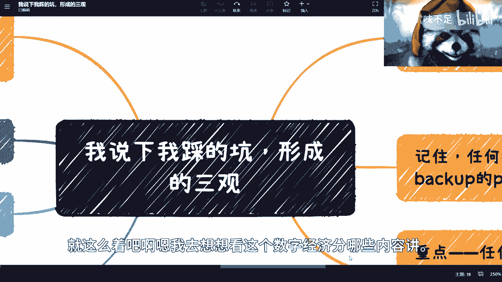

希望这些基于实践经验的总结，能帮助你在未来的道路上更清晰地辨识方向，更稳健地前行。