# 我总结下这几年的坑，帮大家避险 - P1 - 赏味不足 - BV1Ac411E7LK

好大家好啊，我又回来了。

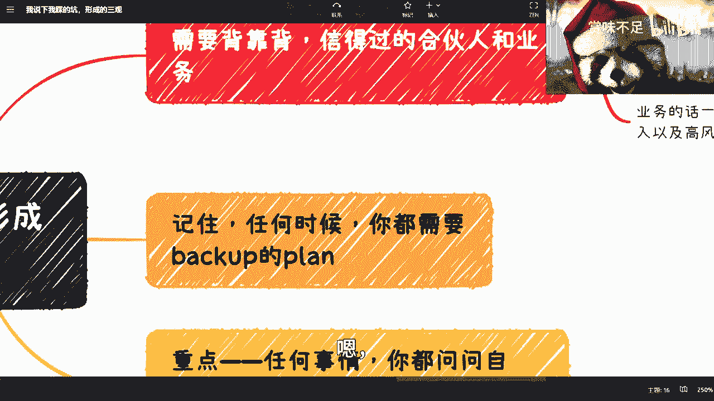

那个之前有很多小伙伴问我，就说说一下踩过的坑对吧，我呢还是想了一下，说呢我想说一下啊，然后就是说把一些具体的我会隐掉，然后我会跟大家说一下，我现在这个做实验方式对大家可以参考一下，就是咱不说一定对啊。

但是呢我可以告诉你们，你们如果想要在未来做得好，或者在未来能够赚到钱，或者来说想在未来不那么卷啊，我是希望你们能够嗯取其精华。

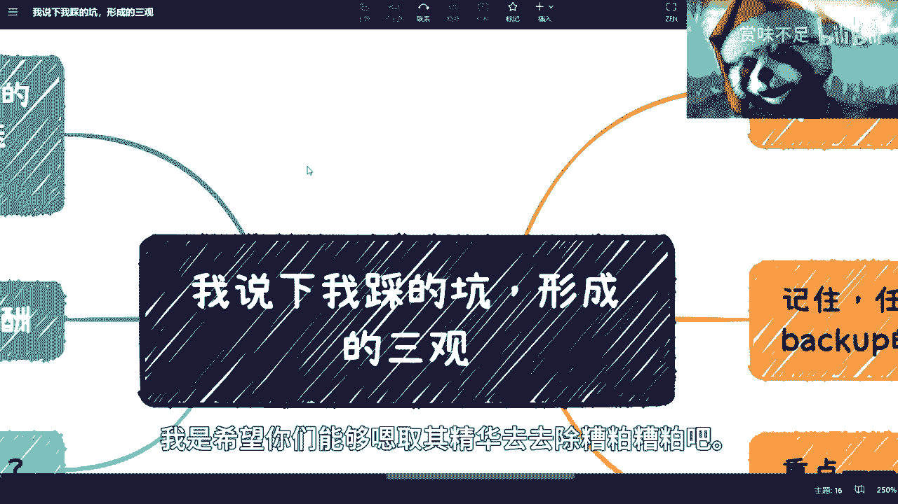

去除糟粕，糟粕吧，好吧。

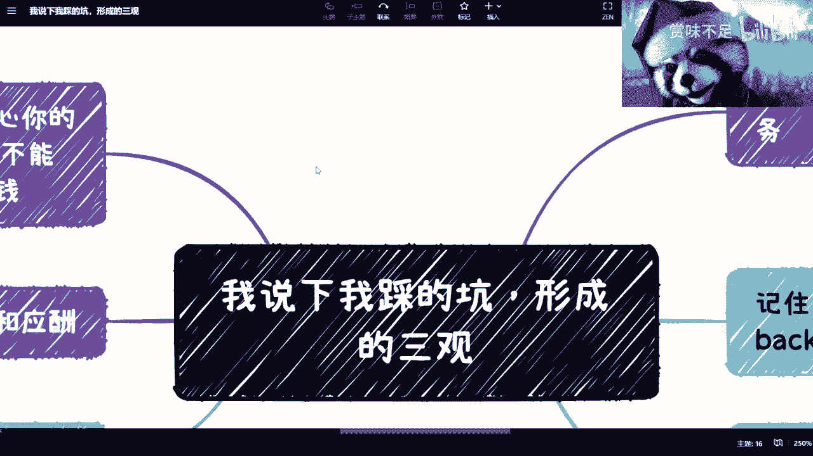

我觉得是这样子的几点，第一点我觉得最大的就是什么呢，就是我不关心啊，你是谁，我也不关心你的title，对方你的头衔，我也不关心你的学历，我什么都不关心啊，我只关心是什么呢，就是你就告诉我你能做什么对吧。

我只关心你能跟我合作落地做什么对吧，我觉得所有人应该都是一样的，就是说其实你们看啊工作也好对吧，你们未来出去创业也好，合作也好，不一定要创业啊，就是说副业也好，对吧你们你们会发现其实本质上做很多东西啊。

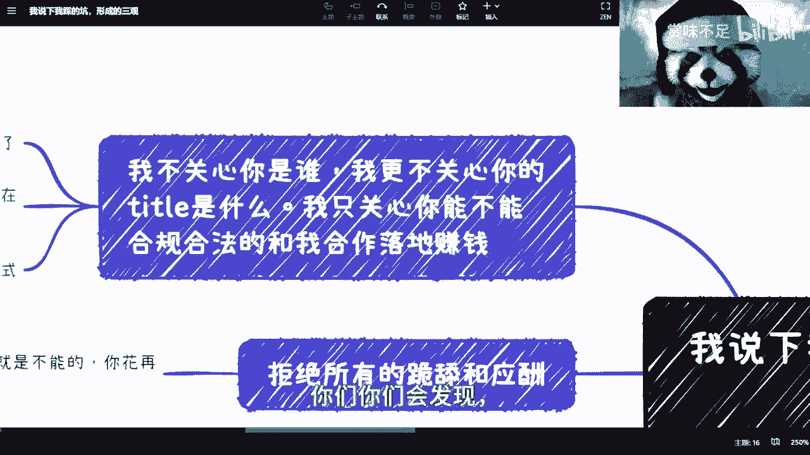

做很多东西，他关心的就是他会花里胡哨的来问你，对方，比如说绕着圈子来问你，对方问你各种各样的问题，但是本质上就是这一点对吧，就是两点，第一点就是说你能做什么，你告诉我，你别告你。

别花里胡哨的告诉我一大堆，对方有的没的，第二呢就是说你要告诉我。

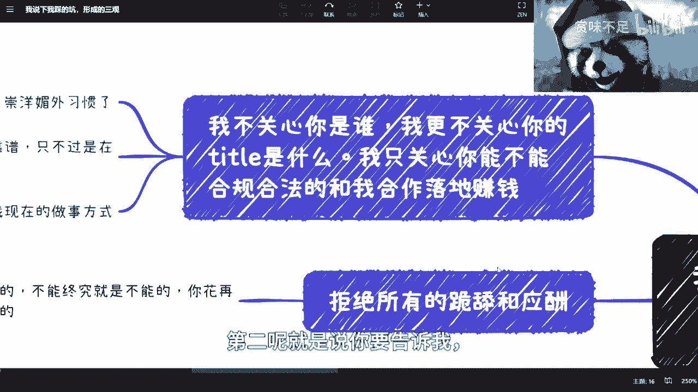

你能不能给我赚钱，当然可能你说没有用，对方沟通当中他自然能够去明白啊，然后呢我觉得这个事儿呢也是国内，现在很多人也不是国内吧，国内外都有啊，就是喜欢虚的啊，然后给你说啊，这个你你我就这么跟你们讲吧。

你们知道为什么传销啊，在一开始的时候，很多人都是什么套路啊，就是你看啊，我以前这个赚了几个亿对吧，然后呢这个突然之间啊，一下子就欠债负债几百万几千万啊，然后呢又白手起家，对方又怎么样怎么样。

为什么很多人愿意吃这一套，就是因为他觉得卧槽你牛逼，但是问题是本质上这人强不强，牛不牛逼，你是听他一句话的吗，那这个话中国14亿人都能讲啊对吧，那凭什么他能讲呢，对吧，啊这是第一点啊。

那么第二点是什么呢，就是说呃我们也要明白一点，就是说有很多人呢他的确是有能力的啊，但是呢你可能会觉得人家不靠谱呃，但你们一定要明白有有异性啊，你们当然我不是说全部啊，这种可能占比较少啊，也比较少。

就是说呃人家不是不靠谱，人家只不过是跟你不靠谱哦，或者说或者说换句话来讲，你并没有别人觉得，能够愿意跟你合作的价值对吧，所以你会觉得人家不靠谱对吧，这第二点第三点呢，我觉得我现在做信心方式是这样子的。

很简单啊，呃我不管他是谁啊，他他跟我说，他什么什么什么抬头再高，对方怎么样，无所谓的，我不care我不care你，但凡愿意要跟我合作的对吧，那么我就我现在所有的人我都一视同仁，就是我会告诉你一个业务。

我给你三个月，你去做对吧，你做得好不好，我觉得我不关心啊，但是呢我只关心那些关心的是你能不能落地，因为我我要我要看的是这个人有没有执行力，以及这个人在执行过程当中所拿到的资源对吧。

如果三个月里面他什么都做不了，那OK拜拜，我不管你是谁，我也不跟他废话啊，什么还要吃个饭啊，喝个茶没有的啊，不存在。

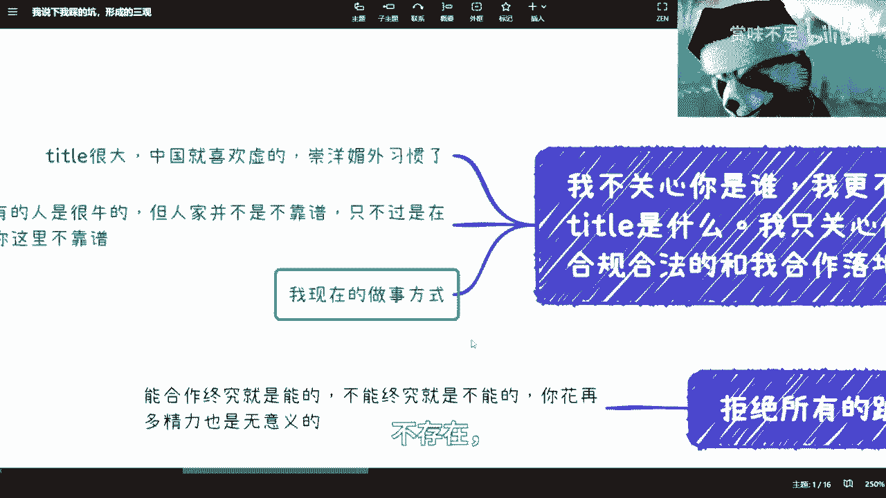

我就我就10分钟跟你说清楚业务，你爱做不做拉倒啊，这第一个。

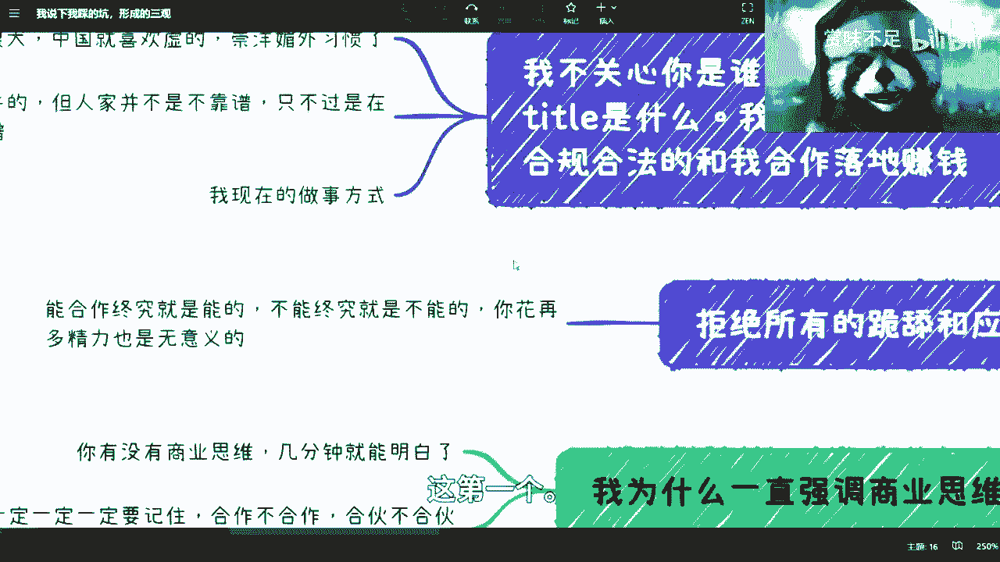

第二个呢，就是说这个拒绝所有的这个跪舔和应酬啊。

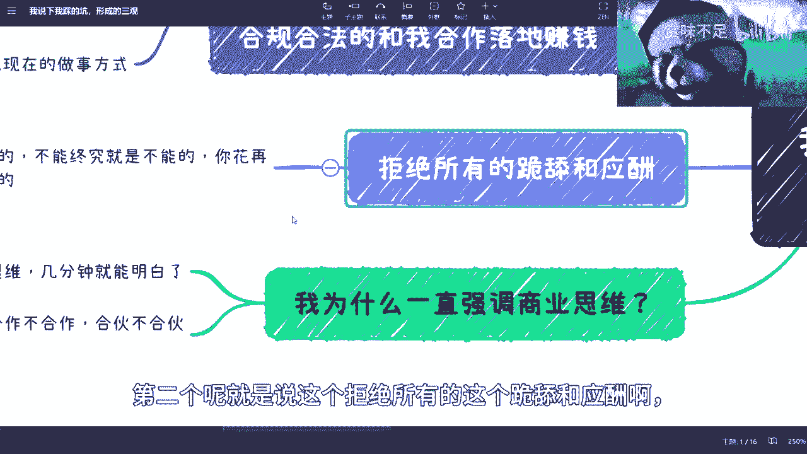

这点我一我跟你们真的要强调一下啊，就是说啊因为我以前也有这个想法啊，就是说你们会觉得有些应酬是必要的，这是因为你们被灌输的三观是这样的啊，你们也会觉得有一些这个这个人是需要去，就是银河的。

这其实也没有必要，因为你们被关注的三观也是这样子的，但我可以告诉你们，终究终究终究你们踩过无数的坑之后，终究一定会明白一个道理是什么，就是一切的一切都是没有意义的，什么意思呢，就是说你们但凡能合作。

早就会合作，不会因为你多吃几顿饭才合作的，不会的啊，这只是个形式问题啊，你们如果不能合作，你陪她吃100顿饭，你茅台喝一百一百平都没有用，一切都是无意义的啊，一定要明白这一点啊，这个就是就怎么说呢。

就说有很多人也会说啊，对方是一个叫做叫做，叫做叫做什么形式上的东西，但是你们一定要明白这个形式它不会改变本质，你知道吗，就是他没有因果关系啊，不会因为你不行啊，你吃了100，对方好，你行了，不会的啊。

但是话又说回来，也有很多人会觉得哎也没有啊，对方有有时候就是行啊，但是你要明白行，因为什么，因为你可能花了足够多的钱，而不是因为你行对吧，当然了，你花了足够多的钱也代表你行。

但是并不代表本身就有能力让对方来跟你合作，或者去做这件事情，这还是有区别的啊，你知道吧好吧，那么这个是第二点啊，稍等，对吧，这是第二点，第三点是什么呢，就是说我为什么一直强调商业思维啊。

是因为你们看到所有的视频里面，我都会跟你们强调商业闭环，为什么呢，是因为你有没有商业思维，其实我们跟你聊几分钟，所有人都会明白啊，只不过他不一，他不一定像我一样说破，对吧，这一点第二点是什么。

你一定一定一定要记住对吧，就是说合不合伙，合不合作，大家赚不赚钱，或者说聊不聊，甚至现在我们说微信回不回。

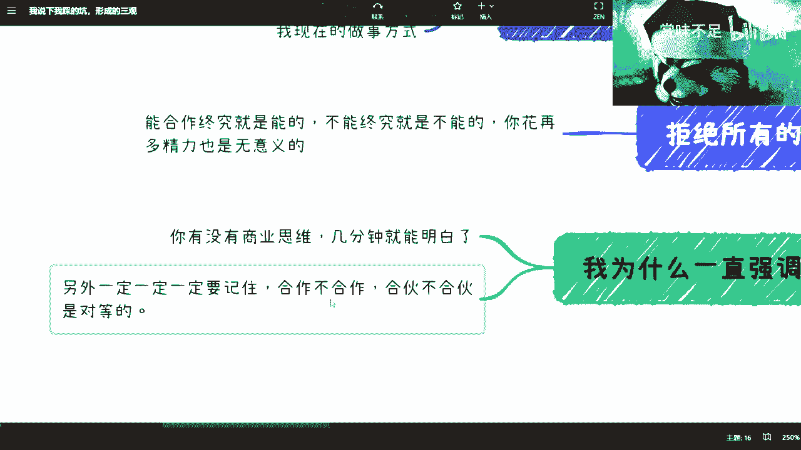

你一定要记住，这是对等的哦，这是对等的，哎哟我我这个地方可能还得说一嘴。

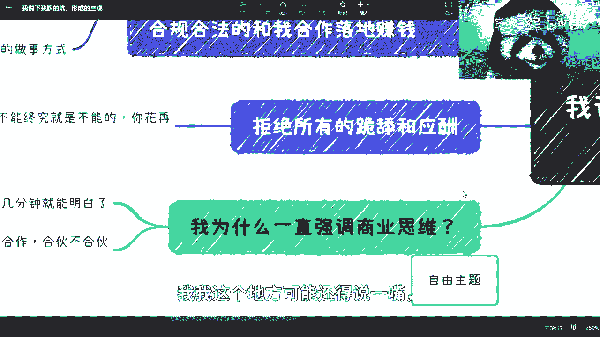

就之前说那个996的事情。

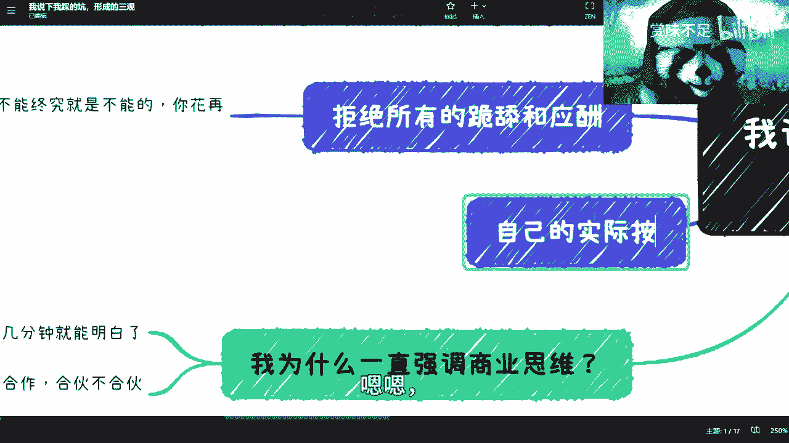

嗯好啊，这个一定是对等的。

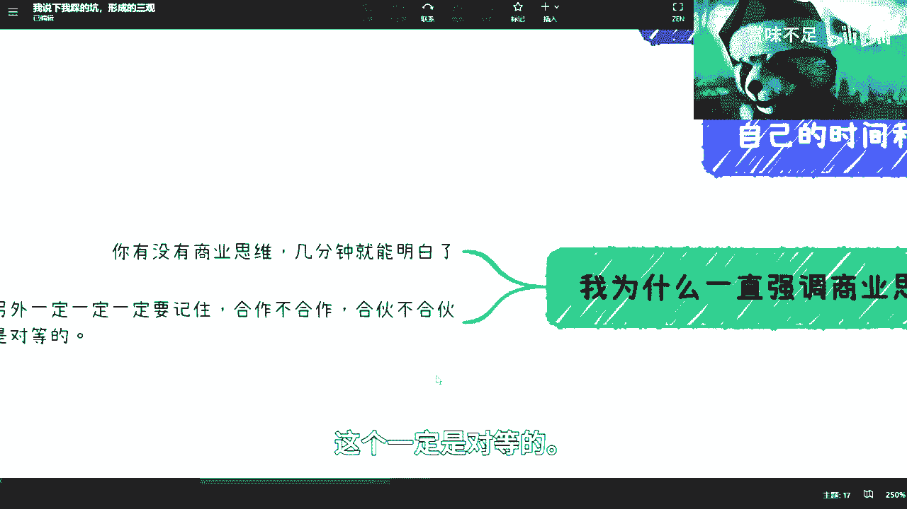

所以说呢我刚刚衍生出来这个点是什么呢，就是你们一定要对自己的时间和付出，需要有评估的或者有尊重的，什么意思呢，就是说你们自己如果都觉得哎呀，我的时间不值钱，我的价值。

我的我的我的这个这个这个付出也不值钱，那你自己都不尊重你自己，别人怎么会来尊重你们对吧，那有很多人也会说，他说他说哎呀这个996对方加班对吧，这个怎么样，这是这是被迫无奈的对吧，我得找份工作。

对没有错啊，没有错，但是我还是那句话对吧，现在找工作是难啊，中国这么多人这么多岗位，你我就问嘛，你你你做了多大的努力对吧，第二就是说你到底付出了多少，你是因为你不够努力，付出不够多，所以才退而求其次。

无奈呢还是因为你已经足够努力了，足够足够的付出，最后是没有办法，对方你们想看是哪一种，对方因为这个事情，不单单是影响你们工作的问题，影响你们以后所有的事情啊，就是你会发现不是别人不尊重你。

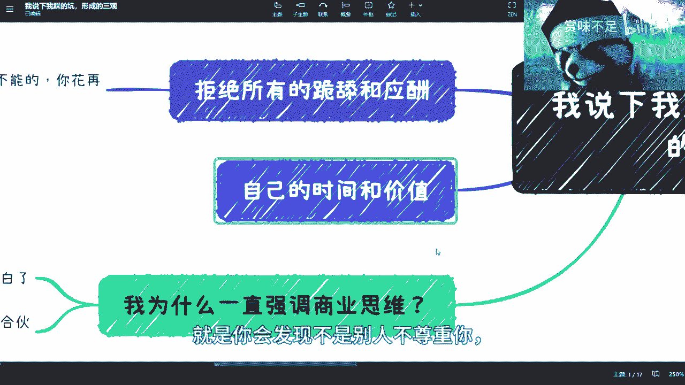

是你自己本来就没有尊重你自己过哦好吧。

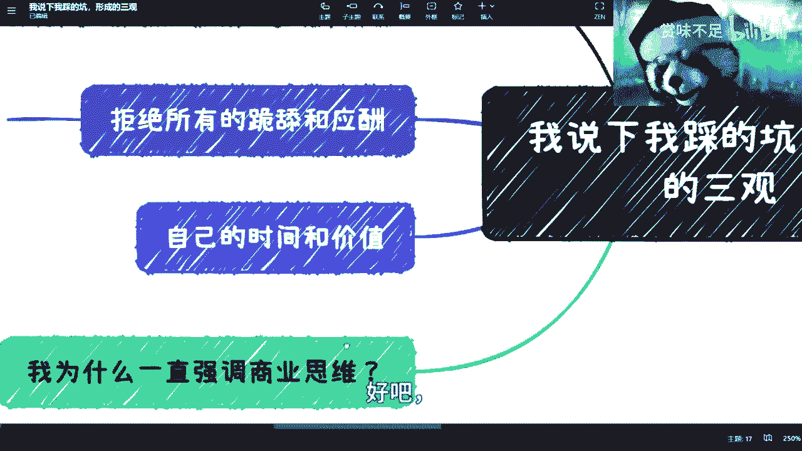

然后这是一个，那还有一个呢，就是说呃我一直说我们要积累嘛，对方积累的是什么呢，其实是一个是你的这个商业业务啊，商业模式，第二呢是你的合伙人，跟这个跟跟跟这个合作伙伴啊，那么这个里面呢我觉得是这样子的啊。

有的人要问了，怎么获取对吧，我跟你讲，你别问这这怎么获取，你问了有什么用呢，我跟你讲，你就从现在开始干什么叫干呢，出去social对吧，出去出去出去出去这个聊，对方找人聊，哎我跟你们讲。

你们别老是就是获取信息啊，就跟我说什么说哎呀，我这个看到的信息对吧，哎呀那我给你们举个例子，就说有很多人说哎呀，我觉得我看到计算机人家都说啊，薪资高，对方什么什么岗位多，对方怎么怎么对我说人家都说的。

那你看到你就人家都说什么，那中国那那整个全球舆论说说你就信什么，这就是我美，就是你们这么想，你们跟别人讨论舆论的时候，你们的脑子可能会告诉你们这个东西是假的，但是你们自己去看的时候呢。

你们的脑子就不知道了，就没有分辨能力了啊，就觉得嗯这个东西就真的对吧啊，你要去获取你所有东西，你得亲自去了解，你知道吗，而且你得找不同的渠道，你别老是说啊，我就喜欢看抖音，我就喜欢看B站对吧。

我就喜欢看这个人啊，这个人说的就是对的啊，我你看我都给你们讲了，我讲的都不一定是对的对吧，你们多看看是吧啊，这是第一个，第二个是什么呢，你们一定要明白，单份工作是不靠谱的，对方靠得住的就是你自己啊。

还有就是跟你战斗过，我们说直白点就是就赚过钱的小伙伴，对方还有一点就家人是靠不住的，一定要明白啊，当然我不是说这是一个结论啊，我只是说你要有一个意识，就是说靠得住的只有你自己啊。

以及给你赚赚过钱的小伙伴，当然这个可能也，你也得有一定的这种叫做判断能力，但是家人这件事情我觉得你就算了啊，就算了，就想好你自己就好了啊，然后第三点是第三点是什么呢，就是这个这个业务啊，我跟你们说了。

单份工作绝对不靠谱的，随便怎么样，你能力再强也是不靠谱的，因为你单个人的能力是无法去抗衡整个时代的，你业务的话一定要分稳定收入，持续性收入，短期收入以及高高收入啊，高风险高收入啊，高回报的这种几个类型。

这几个类型你要你一定要想办法去并存啊，这个并存当然不是说你要分分成不同行业，你可以在一个行业里面，如果你能力够的话，你像我现在就不行对吧，那我不行我不行，怎么办呢，我只能去开拓别的行业对吧。

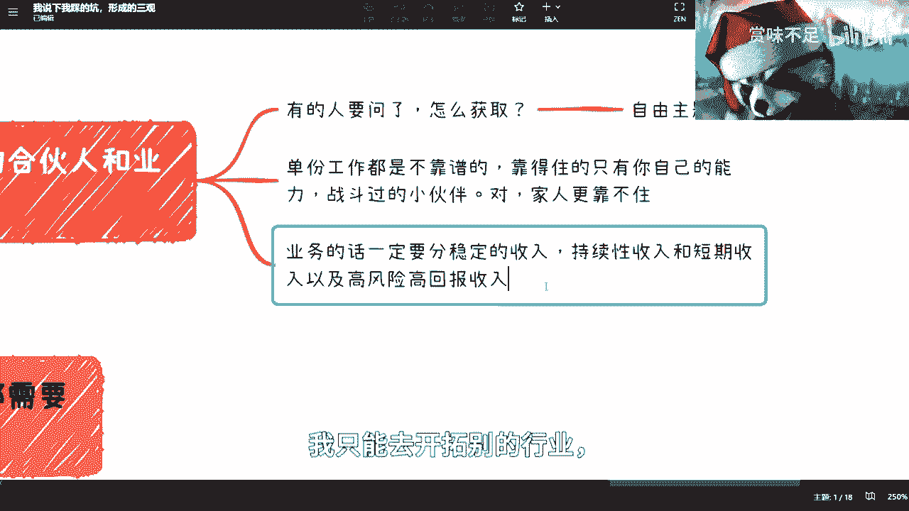

重点记住啊，你碰到任何事情，我不管你今天碰到什么事情啊，就像我在B站上面跟小伙伴说，我说如果但凡今天有人给你个建议，告诉你，你这么做以后就是发展好的，能赚钱的，一定就是个骗子，为什么，因为任何人啊。

你就问问你自己，中国14亿人，人家为什么跟你讲，人家对你一无所知，哎呦我去对吧，人家对你一无所知，对方对你家人也无一无所知，对你祖上一无所知，对你能做什么一无所知，甚至都没见过你哦，就告诉你说啊。

你能做什么，你还信啊，我也是绝了，那我也没办法了对吧，韭菜就是你了是吧，那你就问你头上长角了嘛对吧，你找不是对象也是一样的对吧，你找对象也是一样的，对方你做任何东西都是一样的，就是我知道你今天有一个。

你们比如说你很想赚钱，突然有个机会放你面前，你就心动了对吧，你就觉得我，我要财富自由了对吧，那你想想看吧是吧，想想看你何德何能嘛是吧。

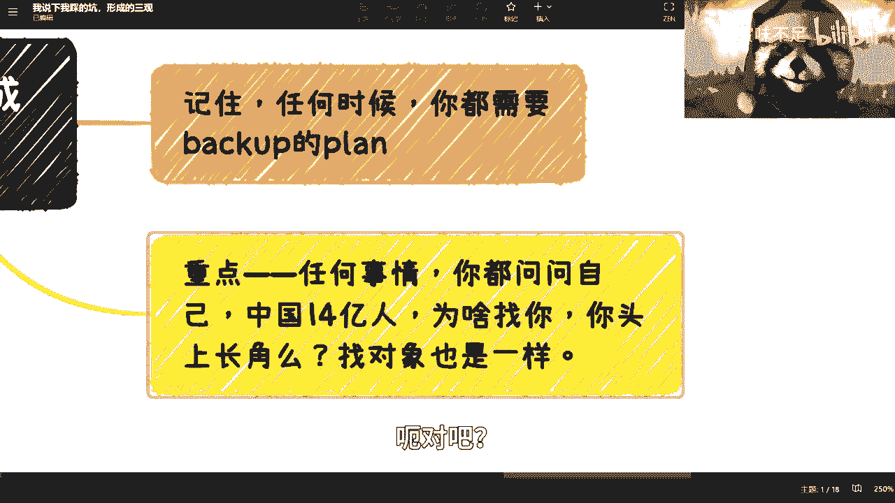

对吧，那还有一个呢，就是嗯我觉得可能也是长年累月啊。

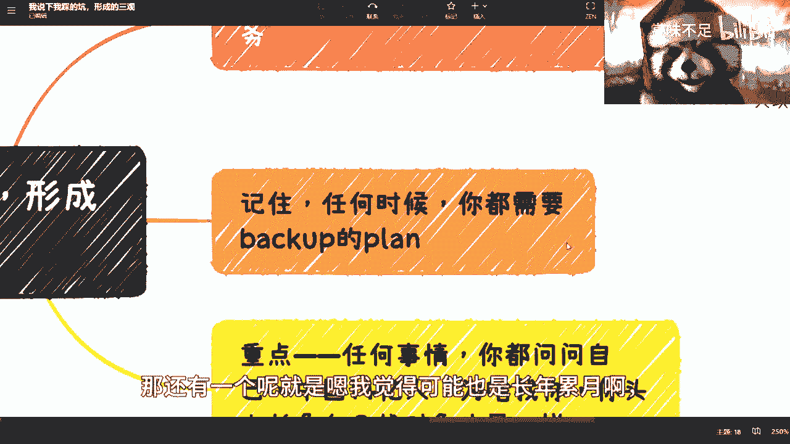

我最终形成的这么一个观点，就是你记住你任何时候什么叫任何事，做任何时候呢，就是你顺的时候也好，不顺的时候也好，你都需要有备选方案啊，甚至你不止一个备选方案，什么叫备选方案呢，就是你当下不顺对吧。

没问题啊，但是你开拓新的业务，开拓新的方向时。

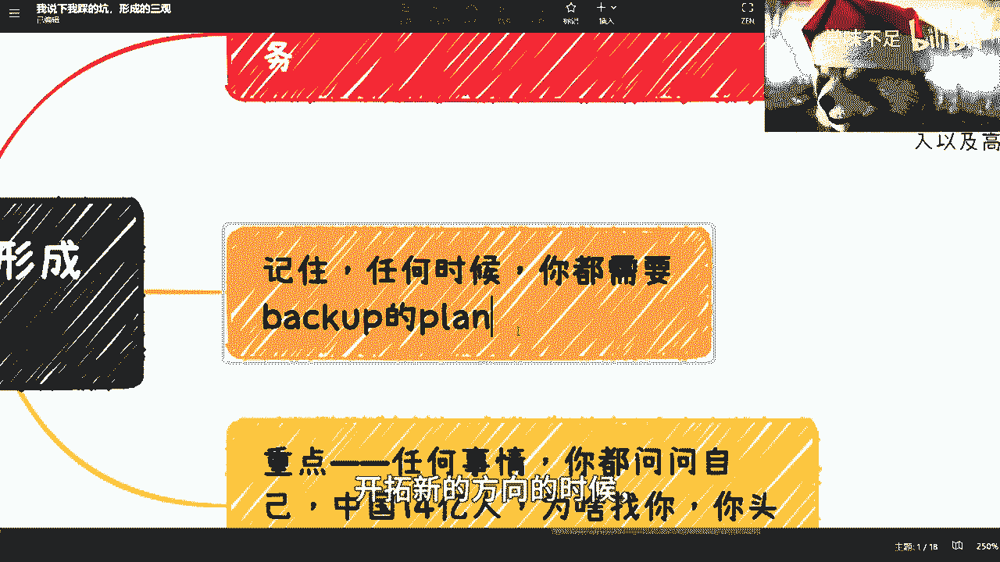

你一定要去想，就是说这几个方式，这几个母任何切入点。

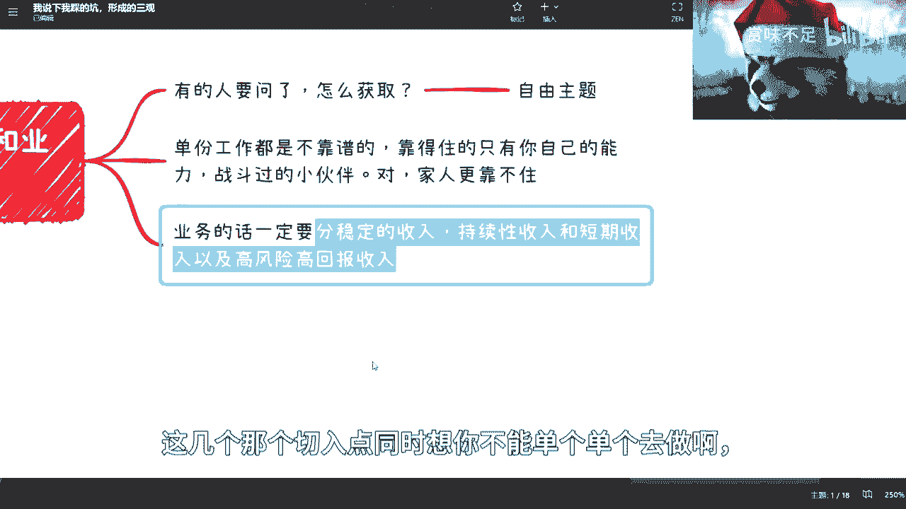

同时想你不能单个单个去做啊，串行去做是没有用的。

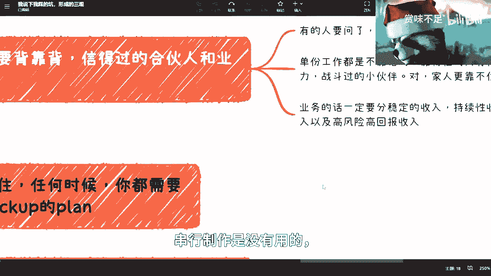

这是第一点，第二点是你当时顺的时候，你可能就没有这个意识，你觉得哎呦，我今天这个业务做的很牛逼对吧，我一年200万对吧，我怎么样，但是你要记住啊，你这个事情顺的时候。

你也得去做那个那个去开始准备你的备选方案，因为你顺只是一时的，不可能是一世的啊，你早晚就会肯定都会有坑，肯定都会因为各种各样的问题，而而慢慢慢慢缓下来对吧，然后又有人我跟你们讲啊。

妈的这两天真的很多人又来杠就杠什么呢，他说啊，你看他又说了吧，这普通人年薪200万对吧，怎么了呢，普通人不能年薪200万吗，啊怎么了，那200万很多吗啊2023年了，同学们对吧，而且我跟你们说了。

我所说的所有问题都不是说一年两年的，我是说从你们整个人生时间的，这个这个周期来讲，从你们整个拉长工作周期来讲，200万很多吗啊。

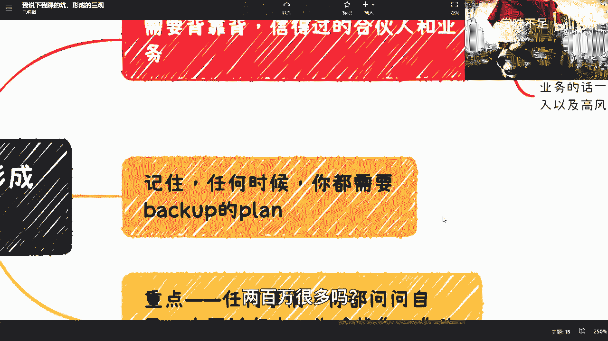

唉我也真的是绝了。

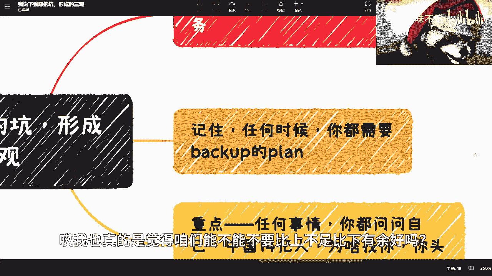

咱们能不能不要比上不足，比下有余好吗。

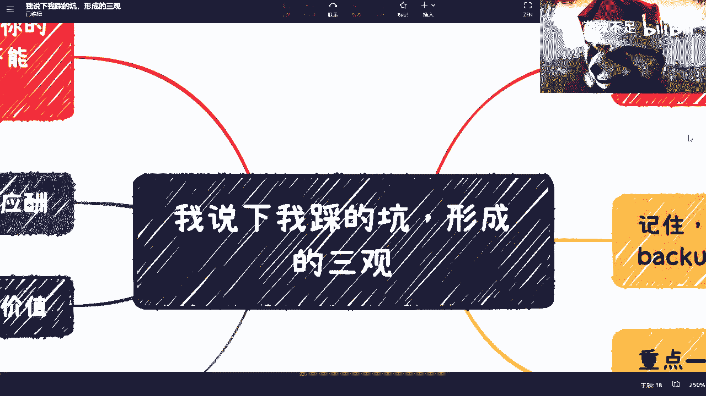

对吧啊，我跟你们说啊，我还是那句话，B站只要不把我的视频和谐掉啊，我这话就扔在这了，今天这个话就这么说啊，过两三年你们再回来看，我不管你们说不说，我敢打赌，你不听。

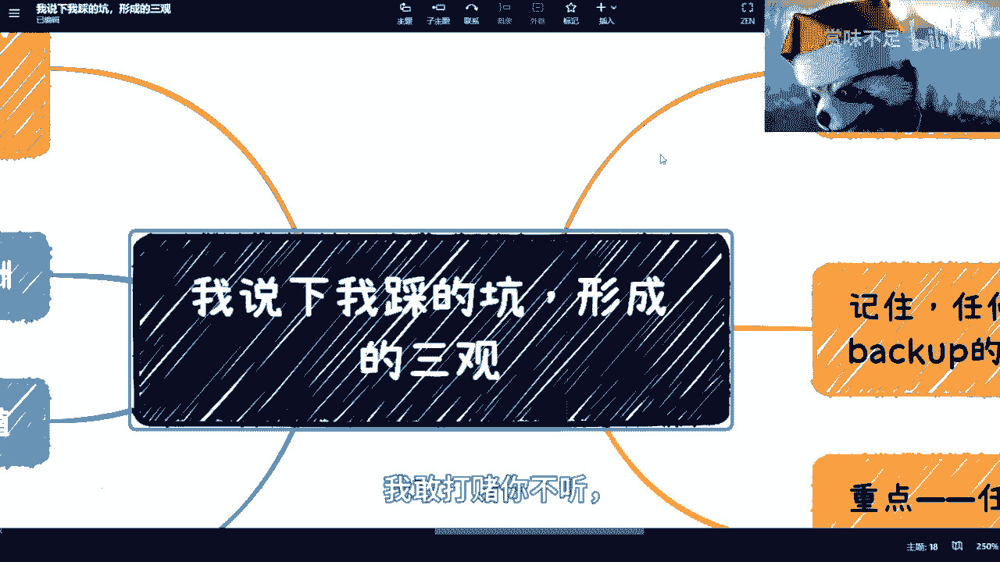

那你肯定就后悔，就这么回事对吧，而且我也我也说了，我也就这么，我我是就放在这个地方，我又不是说啊，你们必须交个一两万对吧，我再跟你们讲是吧。

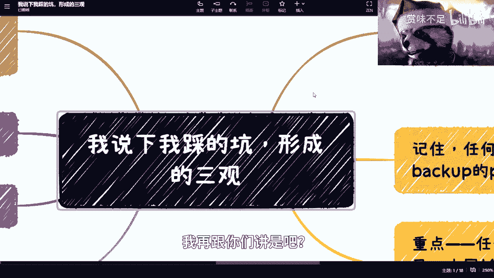

唉操心真操心啊行吧。

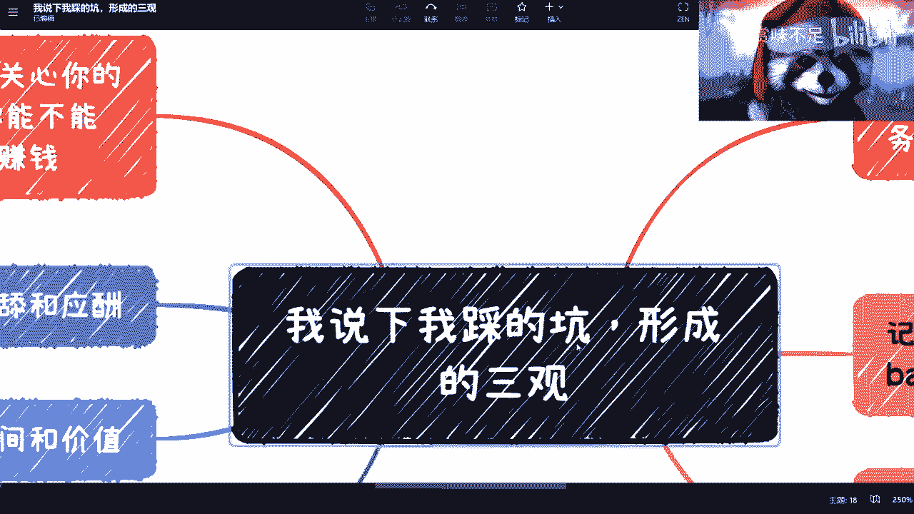

就这么着吧。

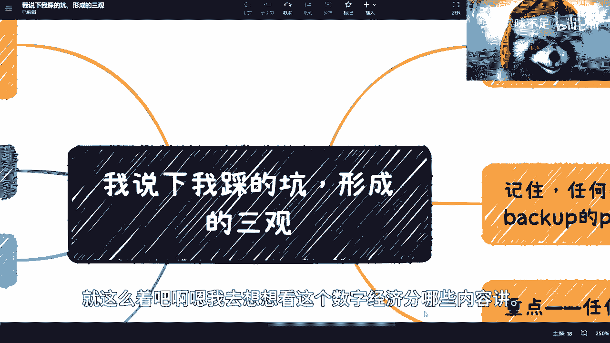