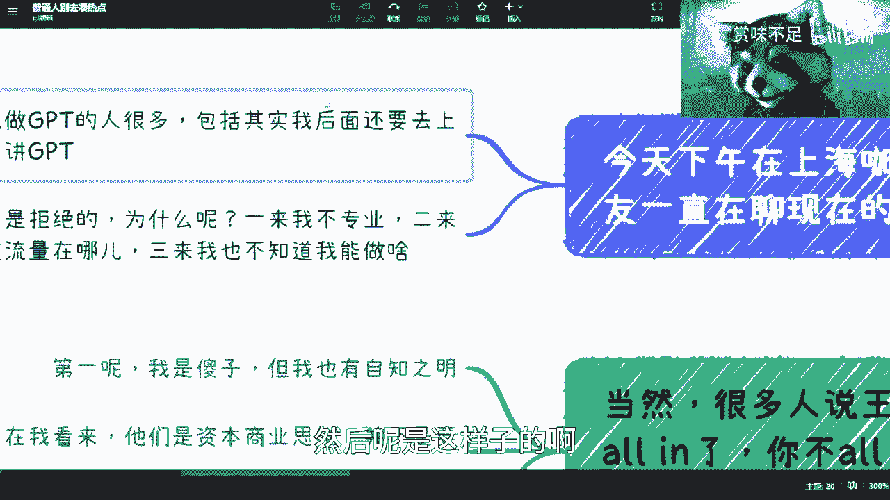
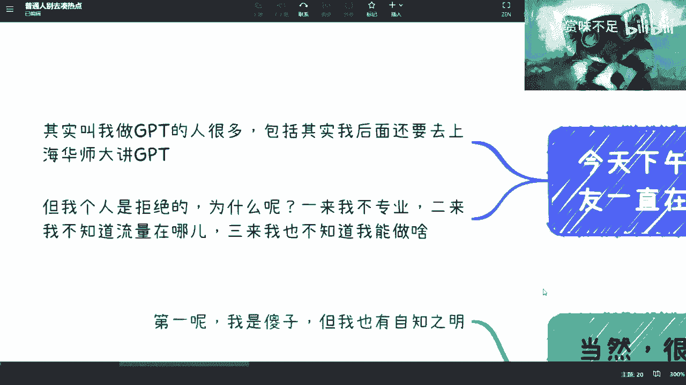
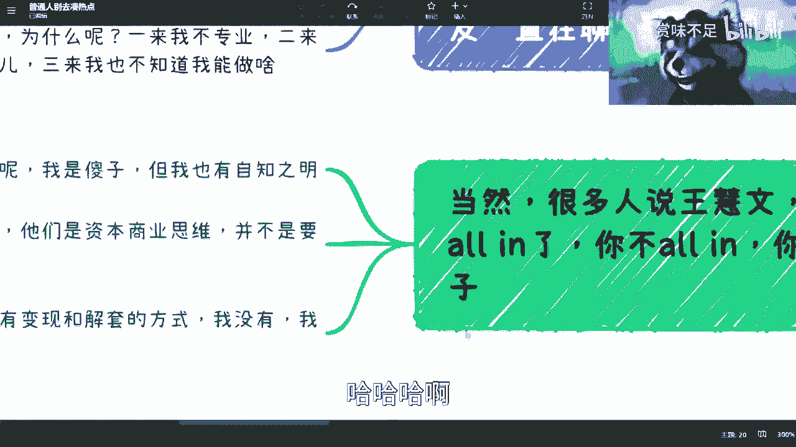
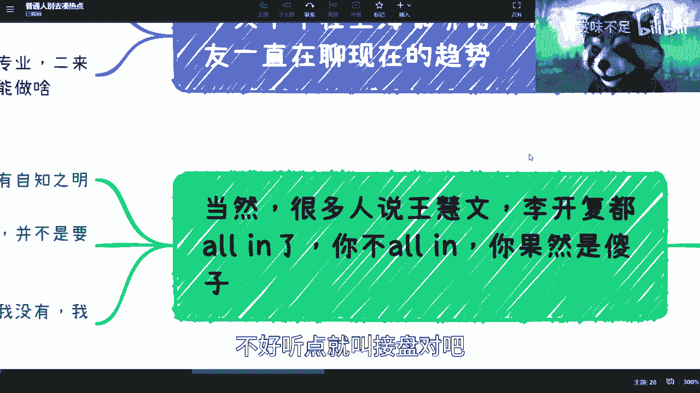
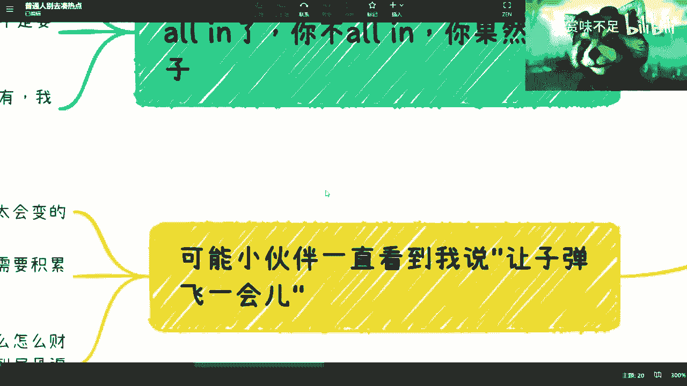
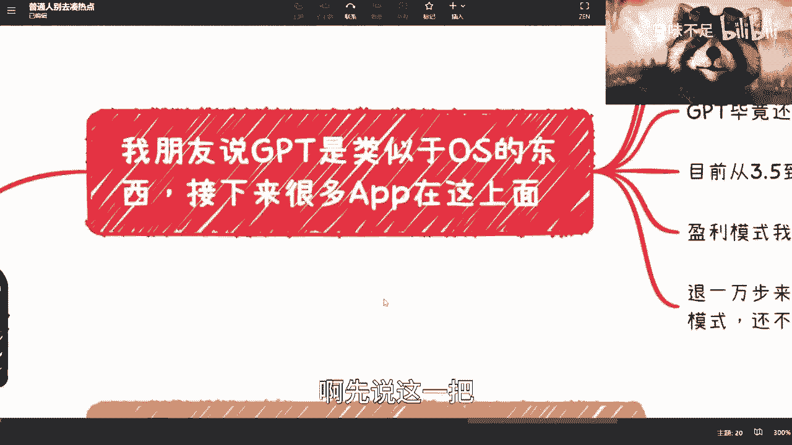
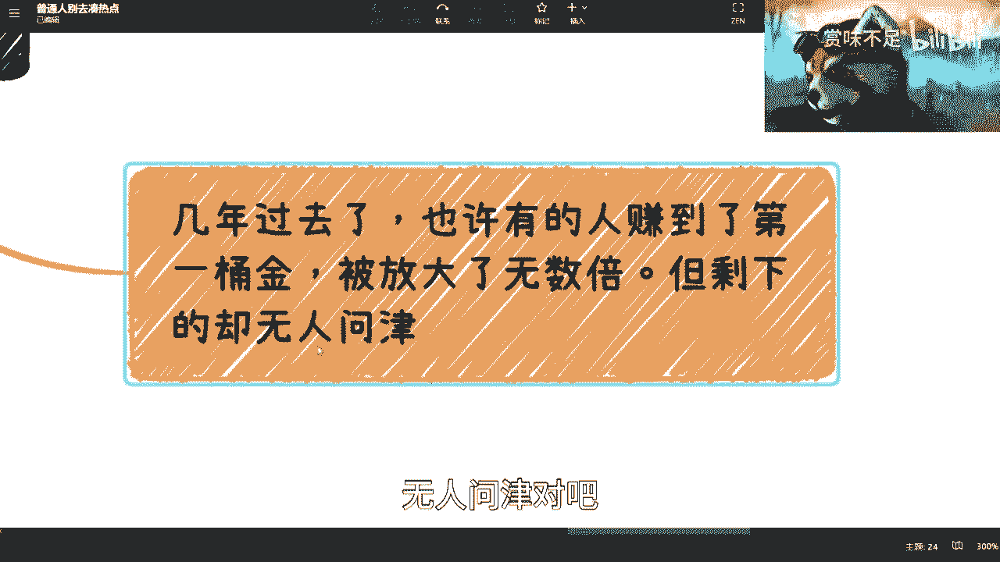
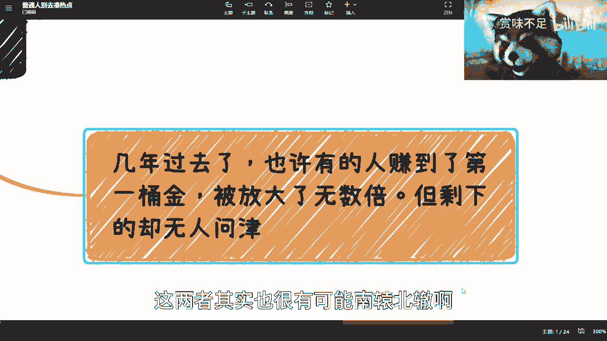
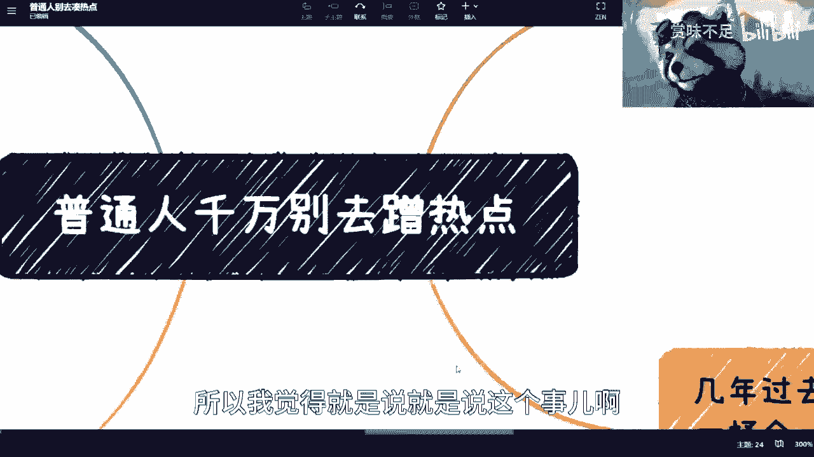
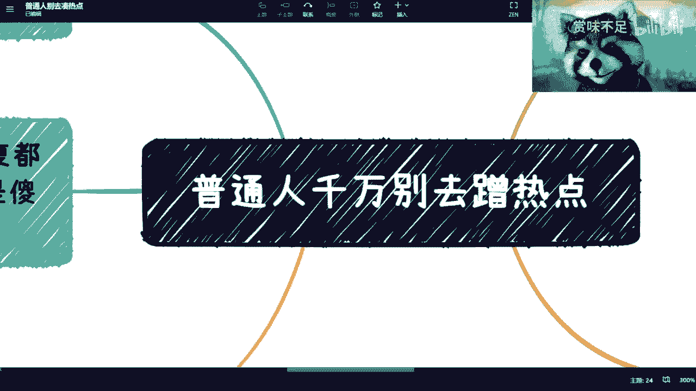

# 我是一个普通人，普通人千万别蹭热点 - P1 - 赏味不足 - BV1NV4y1R75q

好今天是因为下午在喝咖啡啊，所以呢其实跟我朋友就聊到这个问题，我想着就是回来正好跟大家分享一下啊，哎呀我这个麦克风能不能离我近一点，等一下啊。

啊对然后呢是这样子的，就是今天呢跟我那个朋友下午喝咖啡嘛，然后呢就聊到这个现在的趋势嗯。

然后那聊到现在趋势，就一定会聊到GPTT嘛对吧，然后呢是这样子的啊。

就是嗯，首先呢其实目前来教我做GPTT的人也很多啊，包括今天早上我还这个，我朋友还在让我给他转USDT，在那个买那个GPTT4对吧，然后呢包括我大概这周日吧20我看一下，20。

26号我还得去那个上海华师大，给他们讲GPTT嗯，但是呢我觉得我更多的只是跟大家讲一下，我的一个理解，但是我不太会去做这个东西，就是说我跟他讲了，我说为什么呢，一一我不专业对吧。

我这个要有自知之明嘛对吧，我不专业，二呢就是说我就算做了呢，我也不知道这个流量去哪里来对吧，我说的直白一点，你要割韭菜，那韭菜都要有流量流量啊，是不是，那从哪里来呢是吧，我觉得是这样子的啊。

就是流量有呢总归是有的，但是问题在哪，问题是我不觉得现在的韭菜很少，我也不觉得现在的韭菜有钱对吧，就是说现在大家花钱还是要花在刀刃上了是吧，然后我觉得这第二点第三点呢。

就是你我我我也不知道到底应该做啥对吧，你你你比如说今天我那个朋友跟我说，你咋你怎么不去做这个东西创业呢对吧，我我想不出来是吧啊，因为就是我觉得所有的逻辑，待会我会给你们分析的，就所有的逻辑我都知道对吧。

我也都想过对吧，我就没觉得我想通啊，你们也可以反驳我对吧，欢迎大家讨论。

这是第一点，第二点呢今天也提到了，就说那个王慧文对吧，你开复啊都已经all in了啊，他他就跟我说，你播in对吧。

然后这个也有朋友跟我说，那你报应你是吧，哈哈哈啊。

然后我觉得是这样子的，第一呢对吧，我承认我是傻是吧，呃但是这个问题并不在于我傻不傻，而在于我有自知之明对吧，我承认我嗯这个我跟他们不一样对吧，我做不了啊，第二呢我觉得在我看来呢，人家是商业资本。

就资本的一个商业模式，不是说要去做什么。

因为为什么呢，因为我也跟他们说了，我说我说说直白一点，就是在我看来，王慧文也好，李开复也好，其实做这件事情，我当然啊，我不管他们最终是怎么这个逻辑啊，但是他们的逻本大致上的逻辑就是我要硬了啊。

我要all in了啊，你们反正后面的人你们来接盘吧对吧，这个我们说好听点叫投资。

不好听点就叫接盘对吧，那简单来讲是什么呢，就是说简单而言是什么呢，就是所有朋友叫我做GPTT，他们的逻辑是希望我去做事情，而我要去做事，GPTT呢我可能也会去做事情对吧。

但是真正会让他们产生这种想法的人，反而不是为了去做事情的，人家只是一个商业操作，而叫做资本操作对吧，那那这两者怎么能比呢是吧，那我就在下面说了，我说直白一点，人家是有变现对吧，和解套的方式呢。

那我没有对吧，我就算去做的，我也是辛苦钱，而且我可以告诉你们，不是我的问题，你们所有人去做也是一样的对吧，那那这个我不是说贬低你们啊，就是我不认为说有商业思维的人啊，或者有这种商业思维这个本质的人。

会这个看到我这个视频，我觉得不太可能啊，不太可能就是或者说他有这个思维，但是他跟我一样，没有这个操作能力。

原来那可能的啊，然后这是第二点，第三点呢。

哎我看一下我第三点写的啥，啊先说这个吧。

啊先先说这一把，第三点对吧，我说就是最近你们看我评论区对吧，就能看到，我说我一直会说让子弹飞一会，为什么呢，因为首先这样子的你AI再怎么搞对吧，你你整个大战略上方大方向是不会变的。

对或者说不会这么快变对吧，你不可能说哦，因为GPTT来了好，然后美国把整个大战略改掉对吧，中国把大战略改掉，不可能的，你知道吧，就是你要去看历史，整个历史上变化的东西多了，黑天使和黑黑天使也多了。

是黑天使，我就觉得抢的不对，黑天鹅也多了是吧，就是就是东西多了，你看到过哪个东西来了，马上大战略会变的啊，没有这么变的，这样变是做不好的，你知道吗，这第一点第二点是我们是普通人对吧，什么叫普通人。

普通人是需要积累的对吧，就积累和沉淀是很重要的，那第三个呢我跟你们讲啊，我每次讲到这个地方，我跟你们说，你们回头去跟你们的朋友聊，你们朋友但凡受到这种，他一定会告诉你的，他说扯淡对吧，我告诉你。

我有一个朋友就是做GPTT的，我有一个朋友就是做web3的，然后人家有第一桶金，现在已经财务资料了，一定是这么说的，我跟你们说，我后面一定要出一期啊，一定要出去叫什么叫做你别永远去看到幸存。

幸存者偏差偏差，而不看到尸骨遍野，你知道吗，为什么，因为你但凡看不到，你就是这个尸骨，你知道吗对吧，就这么简单对吧，你不能因为说哦你朋友给你看到什么，你不能因为说网络上看到什么，你就看到了幸存者偏差。

你就看到所有人都这样子的，可能吗，可能吗，我就问可能吗对吧，或者我们退1万步来讲，一个GPTT4的一个GBT3。5的plus，也就20刀一个月对吧，20刀多少钱，140块钱嗯嗯嗯对，差不多140块钱。

对不对，好你140块钱你能用别人也能用，有什么不能用的哦，你我是差这140嘛对吧，这么肯定不是啊，就我为什么这么说呢，是因为这件事情不是这么简单的，不是表面上看到这个样子的。

你明白吧啊那么这个是一点好，那我们继续来讲啊。

继续往这边看啊，我说嗯我朋友还跟我说，他说GPTT呢类似于一个OS，就比如说android iOS和windows，对不对，那接下来呢会有会有很多app在这上面啊。

首先呢我依然是不认同啊，当然这个逻辑我认同啊，就GBD类似一个OS我是认同的啊，然后很多应用接在它API上面，会变成了一个LICATION，这个我也是认同的，但是本质上呢就是整个就是说这个技术逻辑。

我是认同的，但这个商业逻辑我不认同啊，为什么呢，因为首先第一点，安卓也好，IOS也好，windows也好对吧，在当时发展的时候都是经济好的一个时期，包括互联网鼎盛时期，现在不一样。

现在是整个经济完全下行，以及互联网要破掉的这么一个前兆啊，当然记住啊，我告诉你们现在还没有到底还远远没有到底啊，你们不要觉得现在也很难了，不好意思，还没有到最难的时候啊，这是第二呃，这是第二点。

第三点呢就是那个GPTT，目前服务毕竟还是有他的，比如说microsoft cloud以及它的数据的安全性，就这个问题依然是解决不了的，这个我之前已经说过了，对不对，第四点呢就是说目前从3。5到四。

整个披露的信息已经越来越少了啊，已经越来越少了，就是，那个就就原来还披露一些这个论文啊，现在就是连论文都不披露了啊，只有一些什么什么research report了对吧。

那下面一点就是我觉得从我的思路来讲，我没有看到太多的盈利模式哦，我没有看到太多盈利模式好，那说到这一点啊，那有很多人又要说了，他说你扯淡啊，我告诉你有很多引力模式，比如说对吧，AGC对吧。

哎我我直接写好吧啊，他说哎你看啊AHC啊，AIGC对吧啊，然后呢，最近还有我还看到一些什么叫做跨境电商，对吧啊，跨境电商好，然后呢还说什么还说那个叫什么，就是翻译啊，多国翻译啊。

多国翻译诶啊读过翻译对不对好，然后呢还有说什么呢，就是那个就是嗯别人用不了啊，我能用啊，我能用，我卖服务啊，我卖服务好好好诶，诶诶诶对吧，好好可以啊，可以我一个跟你们讲啊，我一个给你们讲。

首先啊这三个对吧，AIPC图片啊，跨境电商呃，这个产品可以让GPTT来做这种自己的，这种叫什么呃介绍对吧，或者来说一些这个总结啊，这就省不少力气啊，多国语言也是啊，好先说这三个或者点点点啊。

其他都可以复制啊，好我跟你们说啊，这个东西要做人家自己不会接吗，就是就是这些做这些平台的，或者做这些企业的呃，服务的企业，人家是自己不会接GPTT4嘛对吧，就但凡要做一定会去接GPD4。

而不是说今天有一个app对吧，或者有一个服务说我接了API，然后呢，这些人来采购你的一片，为什么呢，人家脑子是坏掉了吗，啊正常的商业逻辑，人家不会自己直接接吗，为什么要找你借呢对吧。

首先这个是最大的问题，第二点是什么，就是从AI整个的卷的诶，我看看对从AI整个卷的角度来讲，其实你会发现不久的未来，国内一定会推出一些类似的啊，可能没有GPTT这么强上下文的一些接口。

而这些接口很便宜对吧，那么你说他能不能他能解决哪些痛点，它能提供效率是对的，但他不足，我不认为他能解决痛点，你知道吧啊好，那么最后你说这个在我看来他是一个投机行为，他不是个商业行为，之前已经说过了哦。

当然不是说我看不上这种行为，而是说我不觉得我去做这个行为，我能赚多少钱啊，对不对啊，好那么我觉得对我来讲核心是什么，退1万步来说，我觉得这个不能叫创业，这个也不能叫去做应用，这个也没有商业模式。

千万别问啊。

千万别问啊，千万别问问了，这视频就没了啊，好吧啊。

然后最后我觉得是这样子的，就点一下题对吧，就是我的核心是啊。

普通人千万不要去蹭热点，包括你们现在读研啊对吧，读书啊，本科啊啊或者说工作了对吧。

千万不要去蹭热点，为什么呢，因为我告诉你结论是什么，就是几年之后，我不排除有的人赚到了第一桶金，我也不排除有的人财务自由了，然后很可能赚了1万块钱，最终被说赚了1万100万都是有可能的。

但是你们记住一点，99。9999999%的人，都是尸骨无存的，而我们就可能是那90%，9。999里面的人，而且这些人到底何去何从，无人问津对吧。

你一定要记住这一点，而且你很惨的是什么，你不但无人问津。

如果你一直去蹭热点，你是没有积累的，你没有积累，你如何去跟别人去竞争对吧，所以呢就是说我觉得啊，其实这个世界到现在为止是很有趣的，扭曲的地方就在于大家太容易相信，就你真的跟他讲什么呢，他有时候不信你。

但是他又很容易去相信网上那些，就是说啊这突然什么一个新闻跳出来，突然一个一行一个notification迫使出来了，或者怎么样呢，就感觉哎他就信了，我也不知道为什么你知道吗。

但是大部分你们一定要一定要明白啊，就是从商业和资本角度来讲，pr是pr，就宣传是宣传事情是事情，这两者其实也很有可能南辕北辙啊。

所以我觉得就是说就是说这个事儿啊。

我今天是的确是想说一下嗯。

我也跟可以跟，就是我也给大家结论，就是说我是不太会去做这个东西的，就哪怕今天我吃不上饭了对吧，我就只是就是没有生意，没有业务走了，我也不会做，为什么，因为我的确不懂啊，我也的确不专业啊对吧。

我去做这个东西，除了被人喷还能干嘛呢对吧。

