# 课程：普通人如何理性看待技术热点（GPT）🚫

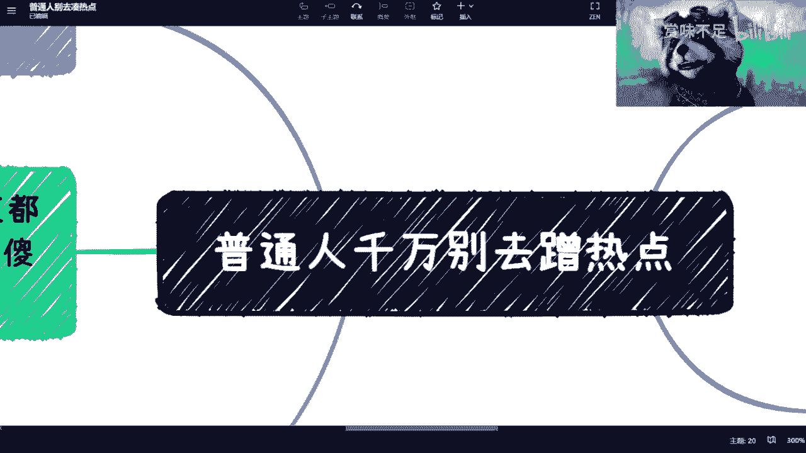

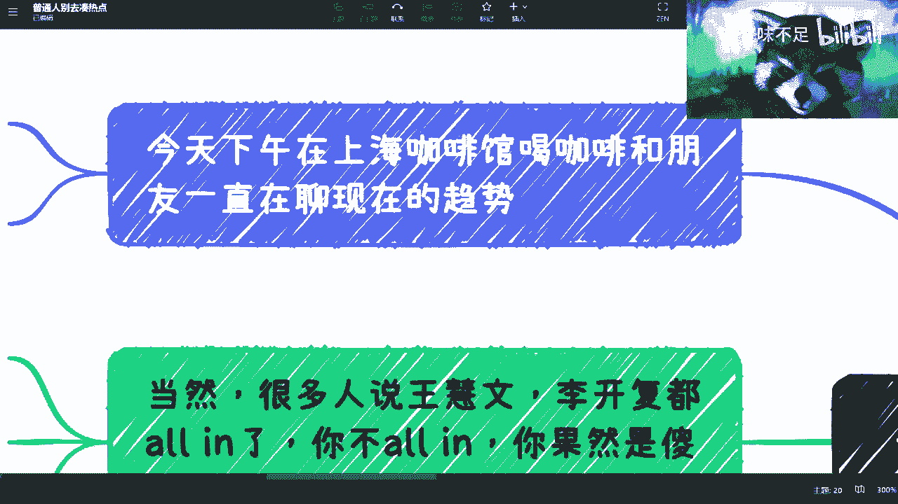

在本节课中，我们将一起探讨一个常见现象：普通人面对技术热潮（如GPT）时应持有的态度。我们将分析盲目追逐热点的潜在风险，并讨论为何对于大多数人而言，专注于自身积累比追逐风口更为重要。

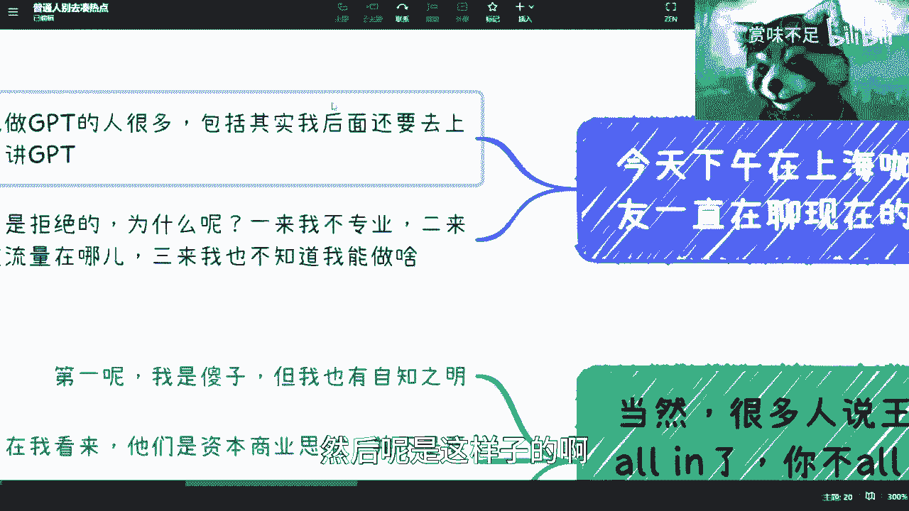

## 与朋友的咖啡闲聊 ☕

今天下午和朋友喝咖啡时，我们聊到了当前的技术趋势。

谈到当前趋势，就必然会聊到GPT。

## 为何我不选择投身GPT浪潮 🤔

首先，目前有很多人建议我去做GPT相关的事情。例如，今天早上还有朋友让我帮忙转USDT购买GPT-4。此外，我本周日（26号）还要去上海华东师范大学讲解GPT。

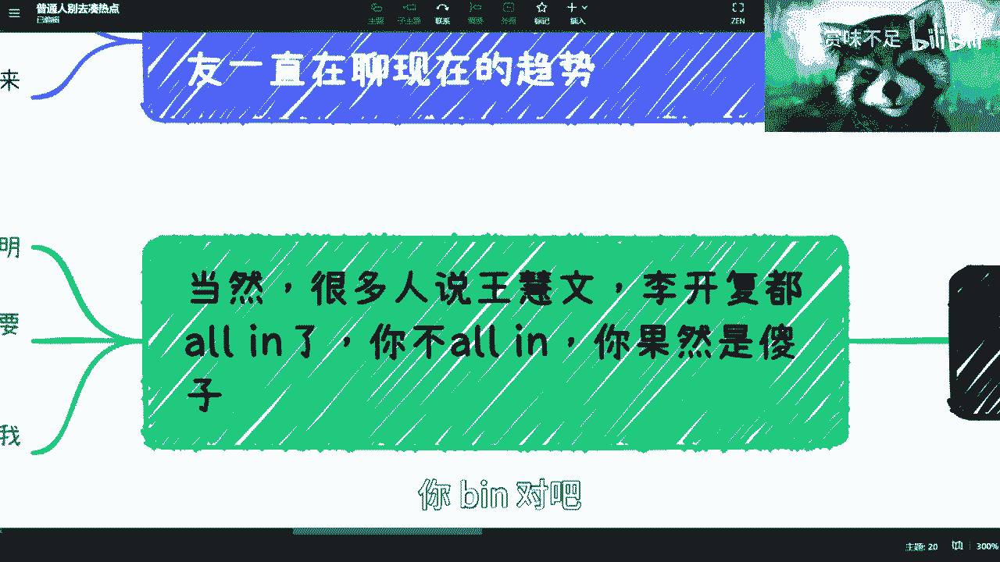

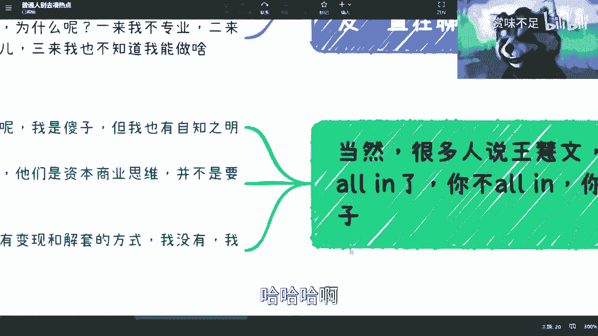

但我更多是分享自己的理解，而不会亲自去做这件事。原因如下：

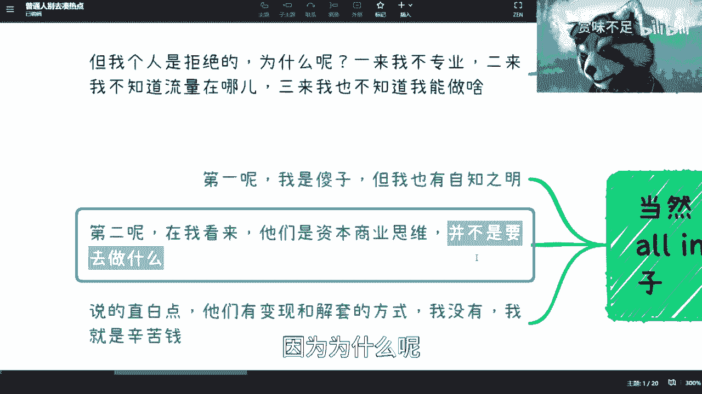

以下是我不选择投身GPT领域的三个主要原因：

1.  **我不专业，也缺乏流量**。我对此有自知之明。即便去做，我也不知道流量从何而来。说得直白些，要“割韭菜”也需要有“韭菜”（流量），而我不具备这个条件。
2.  **当前的商业环境并不理想**。我不认为现在的“韭菜”很多，也不认为他们很有钱。现在大家花钱都更谨慎了。
3.  **我尚未想清楚具体要做什么**。朋友问我为何不借此创业，但我没有想通具体的商业模式。我了解所有相关的逻辑，但并未找到清晰的路径。

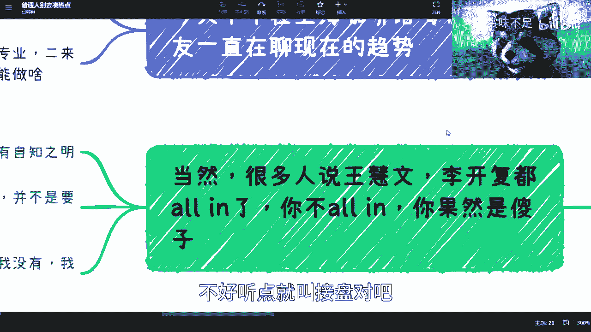

## 如何看待行业大佬的“All in” 💼

第二点，今天也提到了王慧文、李开复等行业大佬宣布“All in”AI。

对此，我的看法是：

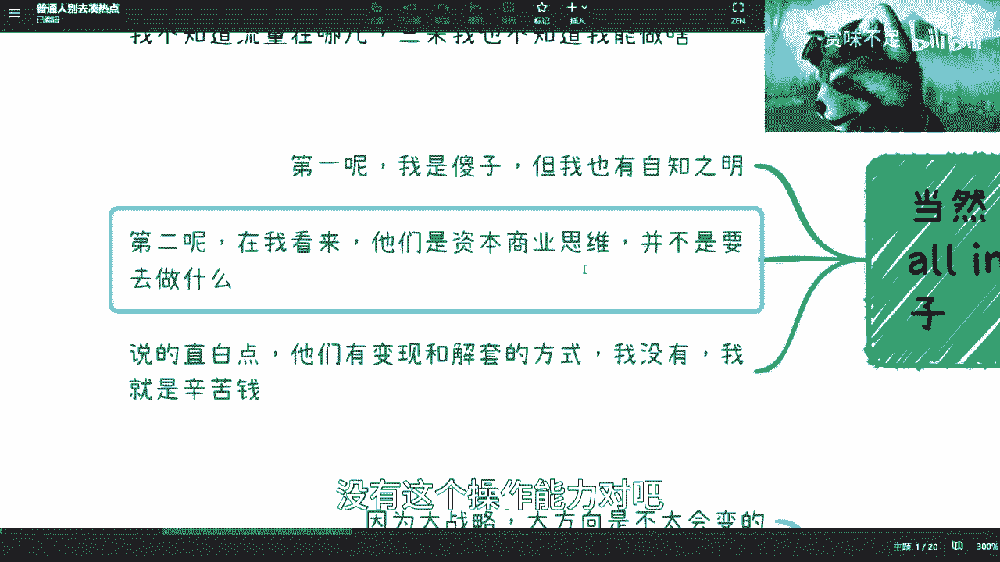

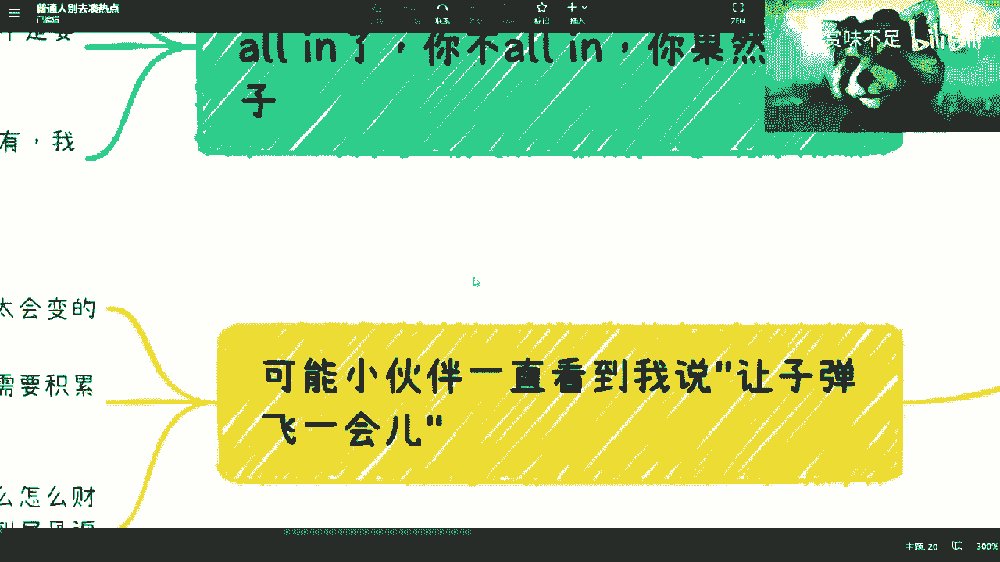

以下是两点关键分析：

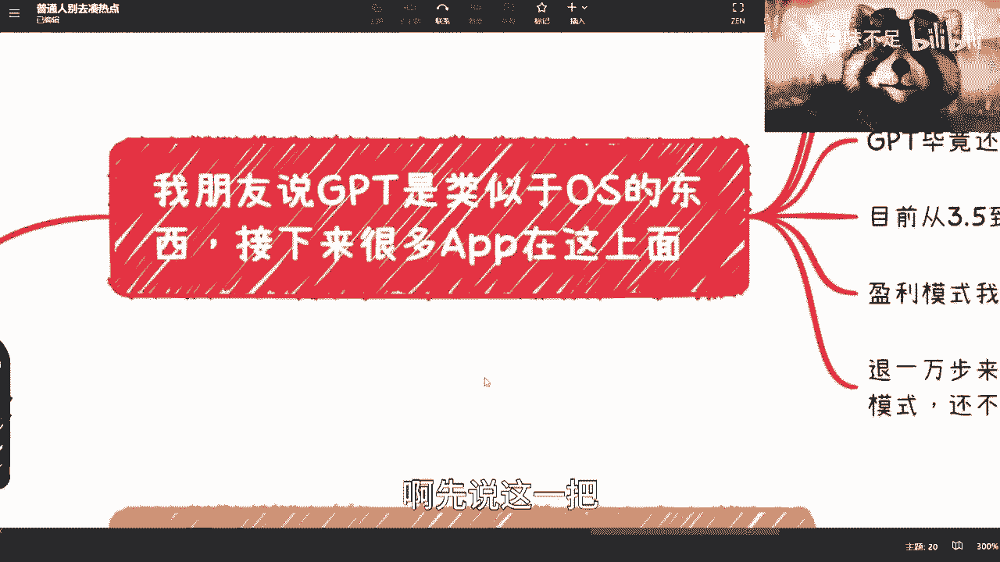

1.  **我有自知之明**。我承认自己与他们不同，我做不了他们那样的事。
2.  **两者的本质不同**。在我看来，大佬们的“All in”更多是一种资本商业模式。他们的逻辑可能是宣布入场，吸引后续资金“接盘”。说得好听是投资，说得直白就是找人接盘。

叫我做GPT的朋友，是希望我去“做事”。而真正引发这种热潮的大佬们，其行为本质是资本操作，他们有成熟的变现和解套方式。我没有这些方式，即便去做也是赚辛苦钱。我认为，具备这种顶级商业思维和操作能力的人，大概率不会看我的视频，或者他们和我一样，缺乏相应的操作能力。

## 让子弹飞一会：时间与积累的重要性 ⏳

第三点，我经常在评论区说“让子弹飞一会”。

原因如下：

以下是三个支撑“让子弹飞一会”的理由：

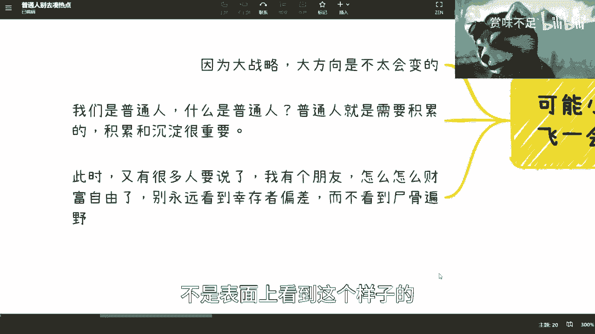

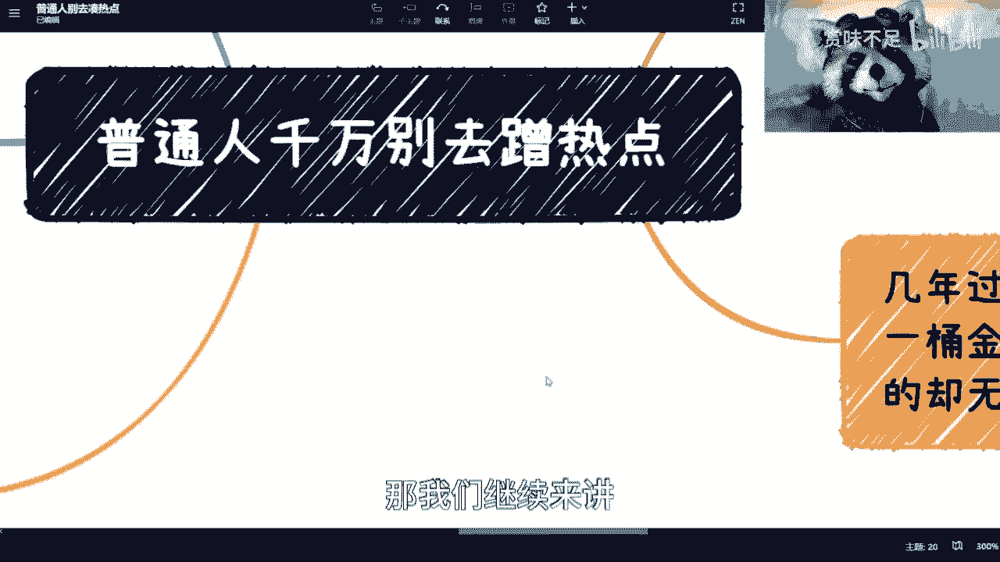

1.  **大战略不会轻易改变**。AI再火热，国家或行业层面的宏观大战略也不会因此迅速改变。历史上黑天鹅事件很多，但从未有哪个技术能立刻扭转大方向。
2.  **普通人需要积累**。对普通人而言，积累和沉淀至关重要。
3.  **警惕幸存者偏差**。每当讨论此事，总会有人说“我有个朋友做GPT/Web3赚了第一桶金，财务自由了”。我们必须警惕这种“幸存者偏差”，不能只看到成功的极少数，而忽视了失败的大多数。GPT-4的Plus会员每月20美元（约140元人民币），很多人用得起。问题远非表面那么简单。

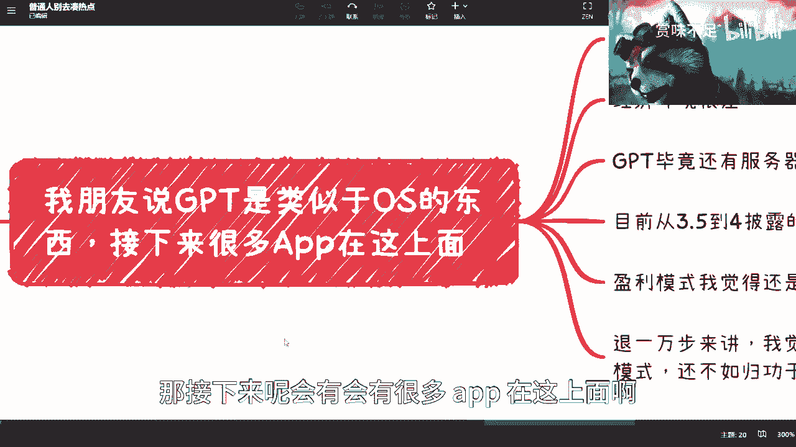

## 对“GPT是新时代操作系统”观点的商榷 💻

朋友还提出，GPT类似于Android、iOS或Windows这样的操作系统（OS），未来会有大量应用（App）构建其上。

我认同这个技术逻辑，但不认同其当前的商业逻辑。

以下是四点商业层面的考量：

1.  **时代背景不同**。安卓、iOS、Windows崛起于经济上行和互联网鼎盛时期。而现在是经济下行、互联网面临变革的前夜，且远未触底。
2.  **服务与数据安全**。GPT服务依托于微软云，其数据安全性问题依然存在。
3.  **技术透明度降低**。从GPT-3.5到GPT-4，披露的技术信息越来越少，现在连论文都不再公布。
4.  **盈利模式不清晰**。从我的视角来看，目前并未看到太多清晰的盈利模式。

## 剖析常见的“盈利模式”设想 🧐

有人会反驳，并提出一些设想的盈利模式，例如：AIGC（人工智能生成内容）、跨境电商、多语言翻译，或者提供“别人用不了，我能用”的代理服务。

针对这些设想，我的分析如下：

以下是两点核心反驳：

1.  **大企业为何要经过你？** 做跨境电商、翻译服务的平台或企业，如果他们需要接入GPT，为何不直接对接GPT-4的API，而要采购你的中间服务？正常的商业逻辑下，他们不会多此一举。
2.  **国内竞争即将到来**。不久之后，国内很可能推出类似但更便宜的API接口。这些接口能提升效率，但我不认为它们能解决根本性的商业痛点。

在我看来，上述行为更像投机，而非扎实的商业创业。退一步说，我认为这不能称之为创业或真正的应用开发，因为它缺乏可持续的商业模式。

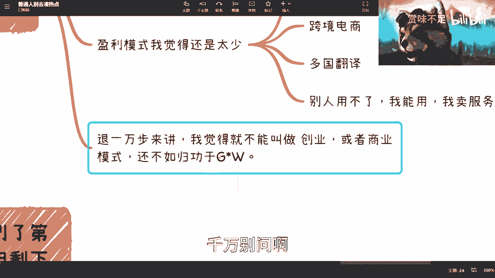

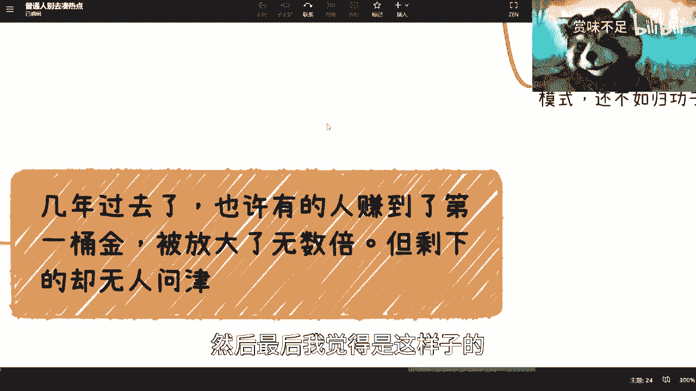

## 核心结论：普通人切勿盲目蹭热点 🎯

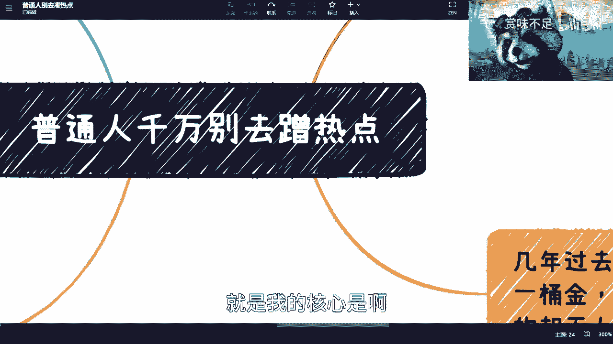

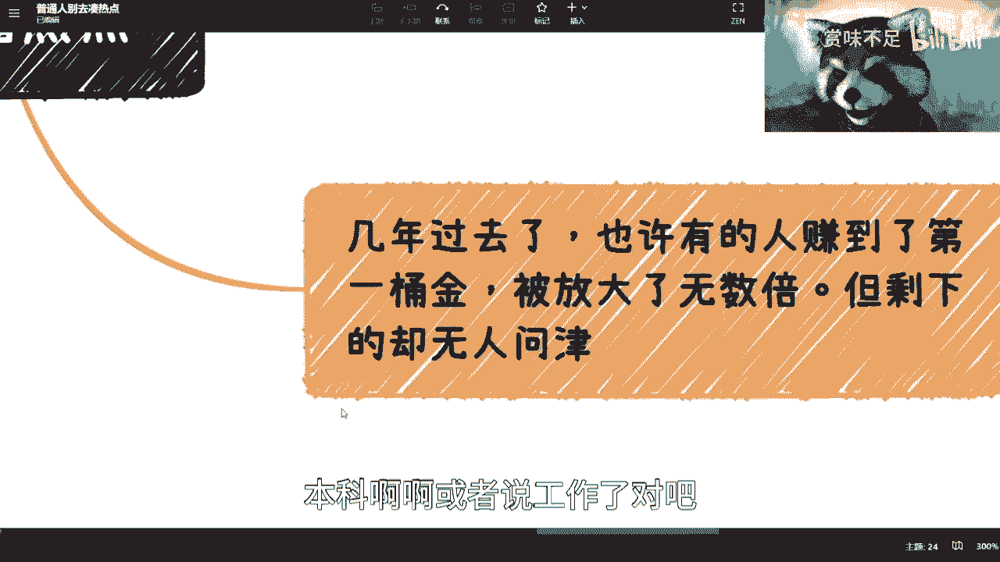

最后，点明核心主题：**普通人千万不要去蹭热点**。这适用于正在读书、考研或工作的所有人。

原因在于：

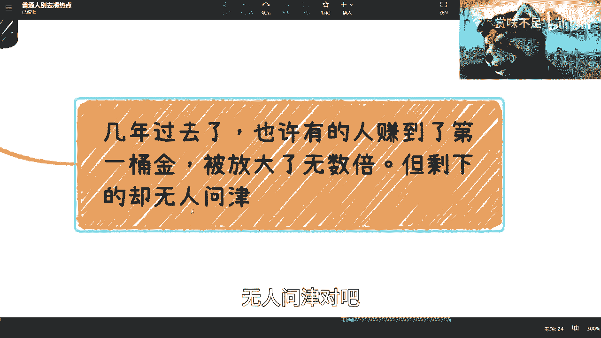

以下是最终的结论与警示：

*   几年后，不排除极少数人通过蹭热点赚到第一桶金甚至财务自由。
*   但请记住，**99.999...%的人将会“尸骨无存”**，而我们很可能就是其中的一员。这些失败者将何去何从？无人关心。
*   更严重的是，如果你一直追逐热点，你将**没有积累**。没有积累，你如何与他人进行长期竞争？

这个世界有时很扭曲：你认真讲道理，别人未必信；但网上突然弹出一条热点新闻或通知，他们却很容易相信。大家必须明白，从商业和资本角度，**宣传（PR）和事实（Reality）很可能是南辕北辙的两件事**。

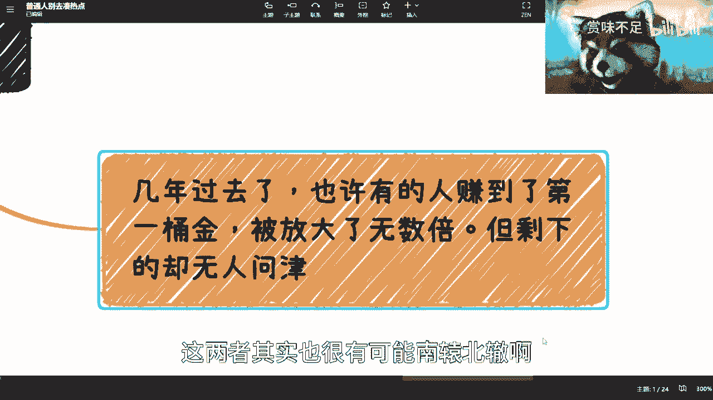

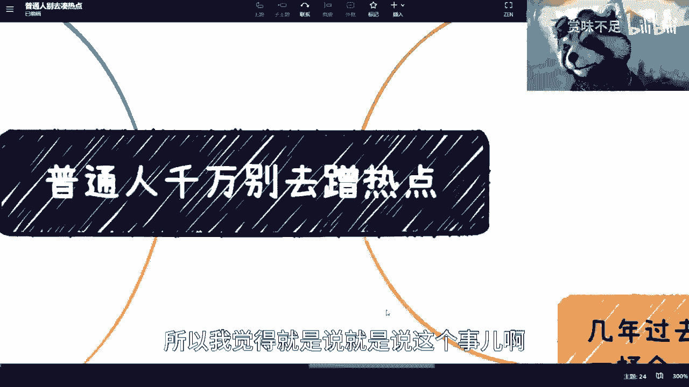

因此，我的结论是：我个人不太会去做GPT相关的事情。即便有一天我生意失败、没有业务了，我也不会做。因为我的确不懂、不专业。去做自己不专业的事，除了招致批评，还能得到什么呢？

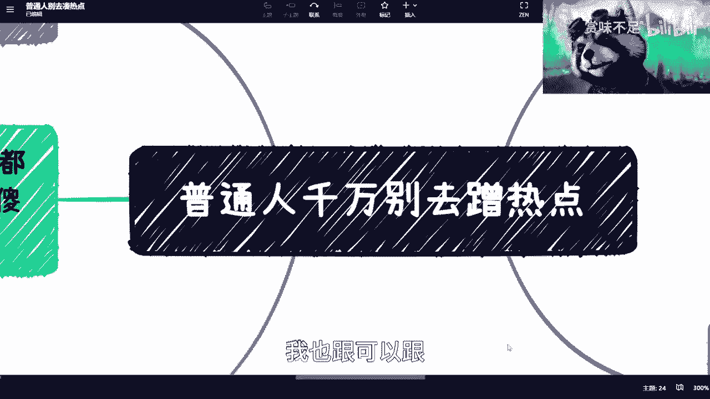

---

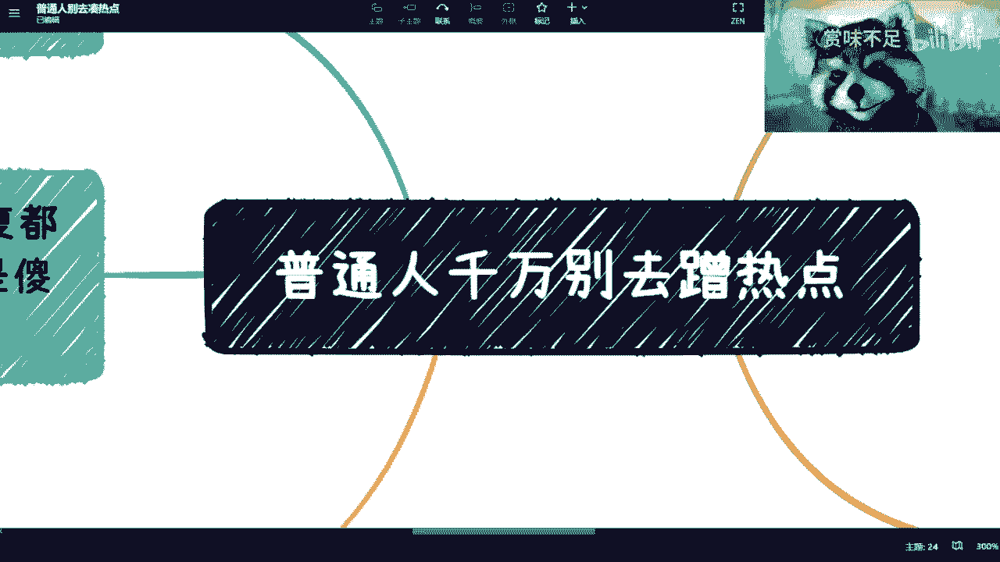

本节课中，我们一起学习了理性看待技术热点的重要性。我们分析了普通人盲目追逐GPT等热潮的多个风险点，包括自身条件不足、商业环境考量、幸存者偏差以及缺乏长期积累等。核心在于认识到，对于绝大多数普通人而言，**专注于自身领域的深耕与积累，远比追逐一个自己并不理解的风口更为稳健和重要**。在信息爆炸的时代，保持独立思考，区分宣传与事实，是每个人都需要练习的能力。