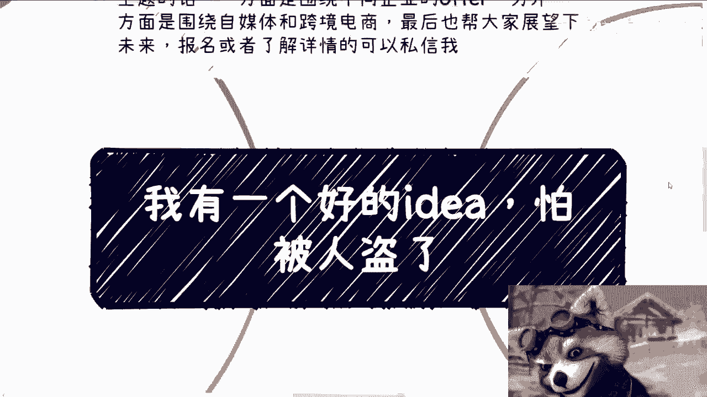

# 我有一个好的idea，怕被别人盗了 - P1 - 赏味不足 - BV1er421M77d

好大家好，这个我今天黑马搂了一天啊，今天是黑马路节，对吧啊，哎呀你妈的还是抽出个时间给你们干点正事啊。

不能老是黑马路，你妈真的麻了，麻了一天马路。

我头都晕了啊，呃今天我们讲的这个主题呢叫我有个好的idea啊。

但是怕被人盗来啊，那么首先我先说一下啊，本周日啊，下周呃，下一期的这个活动啊，定了在8月25号西安啊，场地我也订好了，在西安建筑科技大学李家村附近啊，那么大概主题的话呢，一个是围绕不同的，比如说名额。

私企啊，民企啊啊叫什么，就是国央企啊，外企啊，大厂啊，这些企业的offer啊，呃一方面呢就是说呃说一下各个人，从个人的切入点来讲，围绕自媒体跟跨境电商啊，最后也帮大家展望一下这个未来啊。

报名跟了解详情的可以私信我，我跟你们讲啊，我待会讲完，我他妈这就去马路了，首先啊这事很多，大概从去年到现在啊，不下大概十几个人跟我说过这个话啊，就做啥的都有，有的要做AAAPLICATION啊。

有的呢要融资，有的呢想做那种实体产品啊，还有的呢就是说哎甚至跟我保保密，我说什么都保密，你让我怎么给你分析，对不对，卧槽就感觉他妈的叫什么呃，全程谜语人对吧嗯哦说到谜语人啊。

我想想想想到了他妈的过两天哦，不是过两天过两个月，过两个月，那个叫什么基金岭的那个重制版要出来了，而且吧都会有这么几个共同特点啊，一个就是觉得自己的idea啊独一无二，那另外一个呢就觉得很有市场啊。

再者呢就是说啊他们也都会觉得啊，如果被抄袭了，基本上就没戏了，那么自己当下最缺的是什么呢，就问下来也都一样啊，钱和团队，当然啊钱和团队这个东西其实都是工具啊，这也没毛病对吧，你就缺什么呢，我缺工具啊。

这就像我们以前一直说的一个梗啊，就是在北京中关村3W咖啡啊，就以前呃我估计你们因为还年轻嘛，就以前啊在北京那种中关村那个创业街啊，是这样子的啊，就你坐在里面随便喝喝喝咖啡啊。

你身边的人就基本上都是创业者啊，动不动就是那那种什么几千万几个亿的对吧，这种融资啊，然后呢啊以前就有个梗啊，就说你在那个3W咖啡啊，说你只要跟对方说我有个idea啊，然后你跟对方说我还差个程序员啊。

你愿不愿意跟我一起干啊，其实有些idea呢还是不错的啊，就是说的确呢，它可能市面上也的确没这种产品啊，或者服务，同时呢它也的确能解决一部分的问题啊，也许未来它也可能会出现啊，但是往往解决问题的这个事啊。

你们记住一点啊，你们记住一点啊，就是解决问题这个事情不是我们说了算的，你能明白吗，不是说你今天做一个事能解决问题啊，你就真的能解决这个问题，你明白吗，解决问题以及解决什么问题，这不是我们说了算的。

而不是说你今天这个东西能否满足需求，说了算的，都不是的，懂吗啊，好那么第二啊怕被盗啊。

怕被盗，那就说明你这个id不行啊，或者我就跟你讲你不行啊，其实这个逻辑很简单，这就好像今天你做个事，我随便举个例子啊，比如说你今天做自媒体或者做跨境电商，或者做一些政政企的业务啊。

我随便你做什么无所谓啊，只要只要能赚钱的啊，然后呢可能你也做了一些比较新的领域啊，当当然什么领域也无所谓啊，或者说你今天呢跟一个合作方一起合作啊，比如说你打个比方跟我啊合作做事情对吧。

然后呢你出现了这种这么几种情况，一种是啊别人来抄袭你，甚至呢他直接来搬运啊，直接就他妈的印钞啊，那么或者做个账号跟你一模一样啊，或者说呢呃另外一种可能性呢，就是出于一些原原因啊。

比如说你觉得他妈陈老师啊，那么你不愿意跟这个合作，或者说我觉得你是个啊，我不愿意跟你合作对吧好，那么不管出于什么原因，你都会发现就是以上这些情况，但凡只要出现，你是控制不住的，对不对。

就你说别人抄你也好，或者我不愿意跟你合作也好，或者你不愿意跟我合作也好，这种事情你控制的了吗，你控制不了，对不对，那么如果啊我们就假设啊，如果你从一开始做这件事情的时候，或者说从某一天。

你觉得出现上述我说的这种情况，你就很难继续做下去，或者说你认为出现上述这种情况，对你来讲就是一个决定性的转折点的话，那就说明这件事情本身这个业务逻辑，商业闭环就是走不通的，你能明白吗，啊就是走不通的。

你要觉得能走通，或者事实上你也走通了，那也只不过是一时的幸运哦，就像我们刚说的，你有可能根本还没有人来抄你，亦或者来说啊，我可能要比如说你的一些核心合作方，跟你还没有撕破脸，但问题是分久必和，合久必分。

你早晚是要撕破脸的，能懂吗，对不对啊，所以说我不是要让你们去PUA你们自己，比如说啊陈老师觉啊，陈老师说的对吧，有问题他妈都找自己的原因，而是什么事情呢，而是说我们做任何事情，你要明白一点。

如果你想得到结果对吧，要么你就是有能力，要么你就是有自己积累的合作关系哦，或者说你有自己积累的若干个合作关系，这个人你觉得他，你不愿意跟他合作，OK没关系，你可以继续去跟另外一个你觉得能能合作的。

不是的人合作对吧，而不是说你在这当中由于有人来抄你了，或者说你跟一个一个一个和合作方的这个，relationship破裂了，然后导致就是说哎我这个业务做不下去了，那说明什么，那说明你护城河一点都不成熟。

那就说明你整个商业闭环就没有闭起来对吧，那那不是你的问题，谁的问题呢，啊啊难难道你说卧槽他妈的，我跟陈老师合作，我最终发现陈老师是个，我没法跟他合作哦，我的问题了哦，我的问题啊。

哦你觉得别人是别人的问题，哎那那我就回到刚刚那个问题上面，你要是觉得比如说跟这个不合作了，会影响你的业务，你把这个锅甩给别人，对你有意义吗，没有意义啊，对不对，你给我甩给谁都甩，但甩给谁都可以啊。

但是你要是觉得对你的业务，产生了决定性的影响，那那最终赚不到钱的是你自己了，对吧嗯三我一般都会问这么一个问题啊，我说我说行啊，我先不来考虑你这个idea到底靠不靠谱对吧，我说如果给你足够的钱或者团队。

然后呢对吧，然后他们一般都会这么跟我讲，他说啊，我们可以先招人做技术功课啊，然后卖出自己的产品或服务好好，然后呢每次说到这里，我都会打断他们，我就会跟他们说，我说OK可以了可以了，后面我不想知道。

我说你们所有说的话都是虚的，都是空的，没有一句话落到实处的，为什么，因为我们就这么讲啊，无论我们做什么，你的受众一共就五方，政府所谓的技方企业，所谓的大弊端，高高效端对吧，然后就是那个资本。

然后是个人就没了，你总归逃不出这五方，对不对，那么啊那么问题来了，你现在有一个id，你打的是哪个客户呢，你知道吗，我觉得大概率你不知道，以及你打的是这个客户的什么需求呢。

以及为什么这个客户会为你这个需求，为为了你他的这个需求买单呢对吧，那我再说直白一点，现在大家经济都不好，都很缺钱，那为什么会愿意为了你这个所谓的idea去付钱呢。

对不对，好第四啊，记住啊，商业中都只看直接收益。

不看间接收益的啊，什么意思啊，就是很多人会提到降本增效这个词，我以前其实提到过啊，记住你画给别人画饼，可以，你吹牛可以，你别自己真的把降本增效这回事当回事，因为什么。

因为几乎没有一个既得利益者或者资本家，会为降本增效买单呢，为什么，很简单啊，我们就就任何事情就怕落到实处嘛对吧，那我们就这么问吧，你说降本降多少，你能知道吗，你说得出来吗，降多少数据怎么来的。

以及降完之后跟不降的时候，产出的产品逻辑或者团队效率，或者其他各个方面一样吗，对不对，你不要到最后啊，本本是降了，降到最后，他妈的整个产品都都都我那个运行不起来了，那你那个降本他妈降的什么玩意儿对吧。

那我就问嘛有多少人说的准，第二增效增效就更不好说了，怎么叫增效增效，这就好像我们用护肤品，尼玛说他妈的啊，缓解衰老啊，说抗痘对吧，说说说什么各种各样的啊，那请问数据有用吗。

或者说这些数据如果用户真的去关心这些数据，能抗住质疑吗，那不可能的呀对吧，那那说明什么，说明就是这些数据所谓降本增效都是画饼，都是用来吹吹逼的，可以的对吧，那但是问题是你有很多人就觉得哎。

那那你缓解衰老或者抗痘，的确有很多人愿意买单，但是你要明白他们愿意买单，一定是出于别的原因，一定不是因为你说的降本增效，懂吗啊，所以本质来讲商业就是说只看投入产出比的，你单纯的降本增营销其实就是零产出。

为什么，因为你所谓投入产出比你得有一个产出，所谓产出就是你得给我带来利益嘛，对吧哦，你告诉我单纯的降本增效，那我我我就只问一个问题，我我怎么赚钱，我我我我用了你这个东西，我值我是一年多赚了多少钱嘛。

对不对，你但凡没有多赚了多少钱，你跟我说说投入产出比不就是零吗啊，所以说反正呢我觉得核心点还是那句话，这个社会能赚钱的，绝对不是因为你的idea或者你的团队是谁啊。

为什么，因为他不是这么公平啊，如果他是一个这么公平公开公正的环境，我就这么说，至少现在很多人都能够拥有，比你们现在更多的财富，你懂吗啊，而不是说在那边做一个真正解决问题的，一个创业的时候。

背几百万几千万的贷对吧，就事实上他就不是这么工整，所以我我觉得就是就是就是你们但凡就觉得，好像一个idea或者一个团队，就能改变一个什么东西，不现实啊，不现实的哦。

那么你说到这个呢，那那可能有人问我了，哎黑马路对吧，那那黑马路你们仔细去看看，黑马路到现在哼，我妈说说这个事情我都说笑了，2024年，整个中国走出国家，走入国际的第一个3A大作。

你拿这么一个东西来跟我谈，有什么好谈的诶，有什么好谈的呢，对不对，这幸存者偏差，这把不偏的，他妈家都不认识了，已经对吧啊，这我还是那句话，切实际一点对吧，你你你就像大家说赚钱，大家说大家说要财务自由啊。

你上来就跟我跟跟我聊，马云哎，你上来就就跟我聊这个elo mask，那那那那还聊什么东西啊，对不对，没有意义的好吧行啊，就这么着啊，然后8月25号本周日好吧，下午活动在西安呃，要报名或者咨询呃。

咨询详情的你们可以私信我，然后另外一方面就是你们自己的工作啊，职业规划，包括你们自己做些副业或者跟别人合作，在商业上面呃，涉及到一些合同啊，额分红啊，分润啊，股权啊，期权啊啊商业计划书啊，白皮书啊。

你们要是觉得希望通过我的一些呃认知和见解，给你们一些更接地气的建议或者规划的话啊，同时让你们少走少少走点弯路的话，那么你们可以整理好对应的问题跟个人背景，我们再来走咨询马路。

