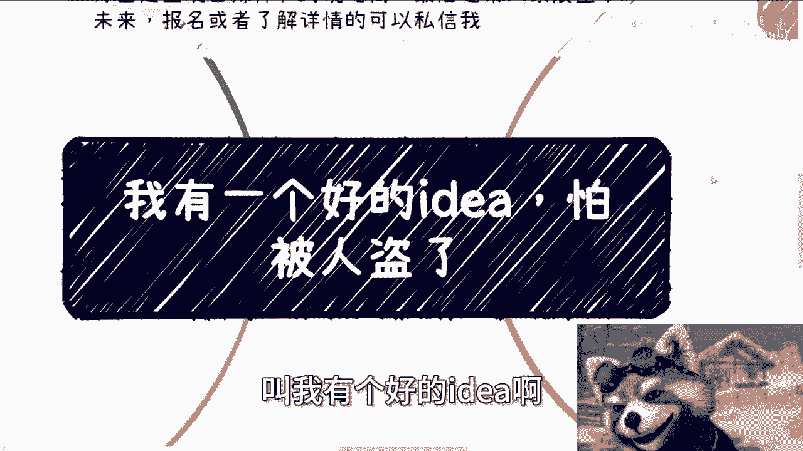
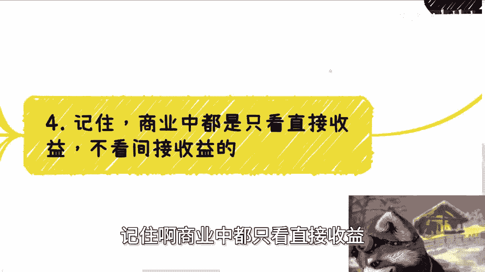

# 我有一个好的idea-怕被别人盗了---P1---赏味不足---BV1er421M77d


在本节课中，我们将探讨一个常见但充满误解的创业心态：“我有一个绝佳的创意，但害怕被别人抄袭”。我们将分析这种担忧背后的逻辑，并揭示在商业世界中，真正决定成败的关键因素并非一个简单的“想法”。



---

## 概述：为什么“怕被盗”的想法本身就有问题？

很多人向我表达过类似的担忧。他们拥有自认为独一无二的创意，认为市场潜力巨大，并担心一旦被抄袭，一切就完了。他们普遍认为自己最缺的是**钱**和**团队**。

然而，这种思维方式存在根本性的误区。解决问题与否，并非由创意提出者单方面决定。一个创意能否成功，远不止于“它能否满足需求”。

---

## 核心逻辑分析

### 1. “怕被盗”意味着商业闭环不成熟

上一节我们提到了对“创意被盗”的普遍恐惧，本节中我们来看看这种恐惧背后的商业逻辑。

如果你认为业务成功与否，取决于是否有人抄袭你，或者是否与某个特定合作方维持关系，那么这本身就说明你的商业模式存在缺陷。


*   **逻辑公式**：`业务可持续性 ≠ 防止抄袭 或 依赖单一合作方`
*   **核心代码**：
    ```python
    # 伪代码：脆弱的业务逻辑
    if 被抄袭 == True or 关键合作破裂 == True:
        业务失败()
    else:
        业务继续()
    # 健康的业务逻辑应有更深的护城河
    if 拥有核心技术 or 拥有多元合作关系 or 拥有品牌壁垒:
        业务可持续()
    ```

商业的本质是应对不确定性。如果你的计划无法承受竞争或合作关系的变化，那么它就不是一个稳固的商业闭环。将失败归咎于他人（如抄袭者或背叛的合作方）无济于事，最终承受损失的是你自己。

---

### 2. 你的“受众”和“需求”明确吗？

当我们抛开对创意本身的迷恋，需要问的第一个问题是：你的创意究竟为谁服务？

在商业世界中，所有客户可以归纳为五方：**政府（G端）、企业（B端）、资本、个人（C端）**。你的创意瞄准了哪一方？

以下是需要理清的核心问题列表：
*   你的目标客户是谁？（G端/B端/资本/C端？）
*   你解决了他们的什么具体需求？
*   为什么他们会愿意为这个需求付费？尤其是在经济下行、大家捂紧钱包的时期。

许多人的计划停留在“招人、做产品、卖出去”的层面，这过于空泛。没有明确的客户和付费动机，一切皆是空中楼阁。

---

### 3. 商业只看直接收益，而非“降本增效”

很多人喜欢用“降本增效”来描绘其创意的价值。但请注意，这是一个对外的“话术”，而非内在的商业逻辑。

资本家或决策者几乎不会为单纯的“降本增效”概念买单。原因如下：

*   **降本**：你能说清楚具体降低多少成本吗？数据从何而来？降本后是否会影响产品或服务质量？
*   **增效**：如何衡量“效”？就像护肤品宣传“抗衰老”，但具体数据往往经不起深究。


商业的核心是**投入产出比（ROI）**。单纯的“降本增效”如果没有转化为可量化的、额外的**利润增长**，那么其产出就是零。



**核心公式**：`商业价值 = 可量化的直接收益（利润增长）`

因此，你的创意必须能明确回答一个问题：**使用了我的产品或服务后，客户能多赚多少钱？**

---

### 4. 成功不取决于“公平”的创意竞争

我们需要认清一个现实：商业世界并非一个绝对公平、仅凭好创意就能获胜的竞技场。

如果成功仅依赖于创意和团队，那么社会上将有远比现在更多的人获得财富。现实是，许多真正解决问题的创业者，可能正背负着沉重的债务。


将成功寄托于一个“不被抄袭的完美创意”或一个“梦幻团队”，是不切实际的。这就像谈论财务自由时，只盯着马云或埃隆·马斯克——这是**幸存者偏差**，对绝大多数人没有参考意义。

---


## 总结

本节课我们一起学习了如何正确看待“害怕创意被盗”这一心态。

1.  **“怕被盗”是商业脆弱的信号**：它表明你的业务缺乏真正的护城河和可持续的闭环。
2.  **明确受众与需求是起点**：必须清晰定义谁为你付费，以及为什么付费。
3.  **商业追求直接收益**：忘掉虚的“降本增效”，聚焦于能为客户带来多少可量化的利润增长。
4.  **接受商业的不完美**：成功是资源、时机、执行力和运气的复杂结合，而非一个创意的“孤注一掷”。

记住，一个真正有价值的业务，其核心优势应深植于执行细节、资源网络、品牌积累或持续迭代的能力中，这些远比一个最初的“想法”更难被复制。放下对“创意保密”的执念，转而思考如何构建无法被轻易抄袭的商业系统，才是更务实的路径。


---
*（注：文中提到的线下活动信息已省略，聚焦于课程内容本身。）*