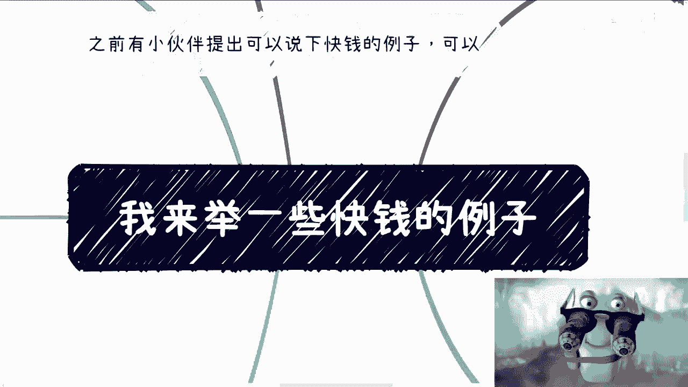
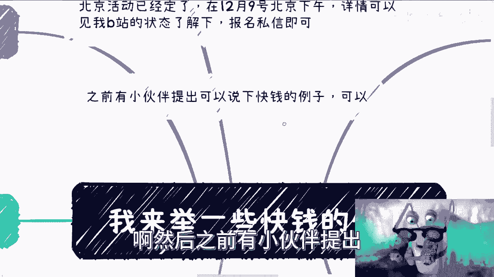
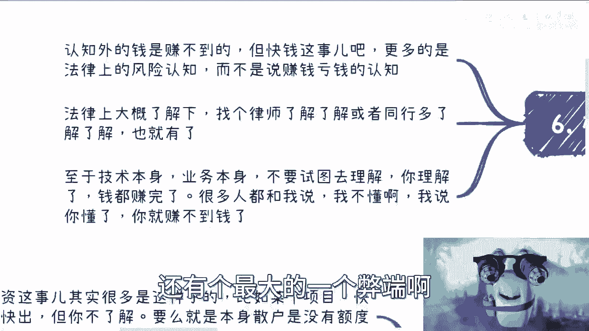
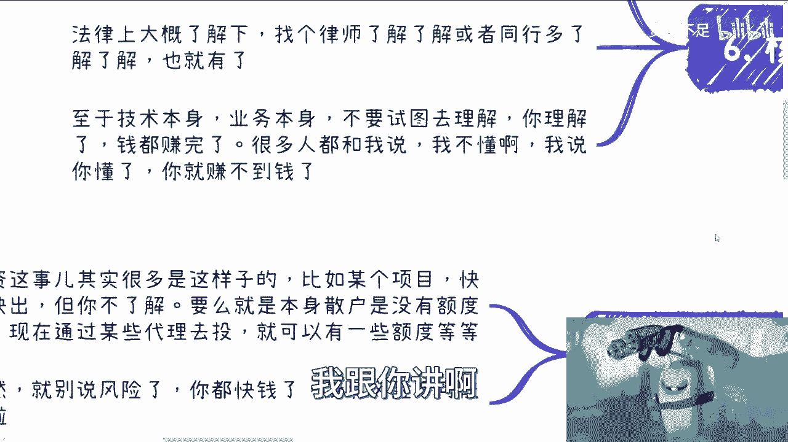
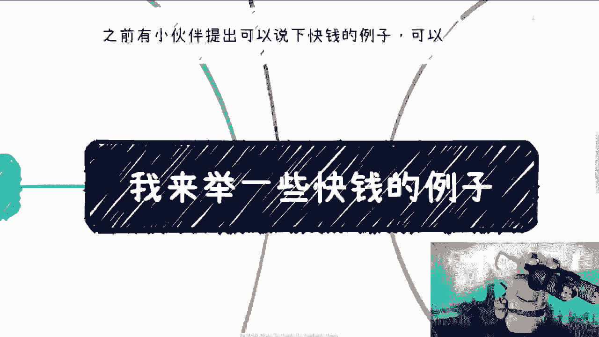

# 我来举一些快钱的例子 - P1 - 赏味不足 - BV1Ye411Z7tV

啊大家好啊，呃啊对几个事，一个是北京活动已经定了啊，12月9号在北京下午啊，在那个微软这边，微软赞助的场地，我靠我刚吸到什么东西，详情可以见我B站的状态了解一下好吧，要报名的话私信我。

然后之前有小伙伴提出。

可以说一下快钱的例子对吧，可以啊，我来举一下快钱的例子呃，首先啊快钱这个东西啊。

我觉得本质上分成这么几类，一类呢是你要做服务方，项目方短平快的收割对吧，也就是说你做镰刀这个事情就比较简单，哎我靠怎么这么热，啧，我发现这个上海现在的天气啊，这穿的热不穿那冷哎是吧，然后一种是投资对吧。

就是短线进出，一种呢是可以长期去赚的钱啊，或者说投入固定啊，可以流水化的业务，那当然啊我觉得这一点可能有点争议，因为很多人觉得短那个快钱都是短线的嗯，我觉得也并不尽然啊，然后还有一个就是说和某些风口啊。

关键点这个这个这个叫什么，就是热点技术啊，有关系的啊，那么我觉得快钱的核心呢，核心中的核心呢就是你不要去了解它，你不要去认知它啊，不要你不要试图去学习，不要试图去理解，不要试图去看风险啊。

就是你要看的其实更多的只是法律层面的东西，如果法律层面你比如说了解下来，我觉得问题不大对吧，或者说有一定的小风险对吧，那说白了这个也OK啊，那么为什么，因为你都是快钱了。

你就告诉我你快钱这个东西如果严谨的去说，哪个没有风险对吧，它只不过就这个风险是多是少的问题啊。

那么第二个我们就拿AI跟数字藏品来说啊。

因为这两个离职两年，最近最近嘛对吧，那么首先啊很多人会觉得需要很多内部消息啊，或者信息差去赚这个快钱，但其实呢并不尽然，呃就现在互联网来讲呢，你说能有什么信息差对吧，就是我这么跟你讲啊。

现在的互联网是什么概念啊，就是你要有信息差，你就这辈子都有信息差啊，除非是别人愿意告诉你，你要没有信息差，互联网上面也就一两天一两周的事情，能有啥信息差，对不对。

本质上我觉得这个信息下并不影响你去赚钱啊，这是第一点，第二点是大部分人赚不到这个快钱的，主要原因无非就两点，一觉得自己不懂，二觉得风险太高，但是说白了你都是觉得你自己懂不懂，你其实没有依据。

第二就是说你风险高不高，你也没有依据，而且更何况你懂不懂，跟你能不能赚到这个钱也没有任何因果关系啊，那么你比如说AIGCGBT对吧，你说啊你比打个比方，今年年初的时候，你做账号售卖，你做课程。

你做科普啊，或者说呃这个和设计相关，你说啊结合GBT对吧，能帮助设计干嘛干嘛啊，贩卖焦虑，说说啊，你现在不学习啊，明年就要被AI替代了，怎么样怎么样怎么样，当然了，就像我就像我说的。

这他妈都是bullshit啊，都是BUSHIT，那么其实当初开天铺天盖地的信息出来的时候，你也可以弄个知识星球啊对吧，你也可以弄个小额通啊，你也可以搞啊对吧，我我跟你们讲，我以前说过一个方案。

哎呀就是就你只要不要脸有什么关系啊，我跟你说啊，你到淘宝上买套课啊，淘宝上买套课才多少钱啊，对不对，你把这套课马赛克码掉对吧，然后放到小额通，你说你去售卖，每每每每个人涨个二三十块钱怎么了。

那这不叫赚钱吗，哎呀只是不愿意做，你知道吗啊，那还有人跟我说了，哎呀陈老师啊，这个东西有没有版权呐，版你个蛋啊啊版权一年赚几个亿呀，跟我谈版权，对不对，就是我跟你讲啊，你要赚快钱有很大的前提是什么。

就是你别去care这些有的没的，你但凡care这些有的没的，你妈的别去赚这个钱啊，那么好，那么我们再来说为什么只能做做知识变现啊，因为AI本身的属性注定了这个逻辑对吧，你说你AI做个产品。

那总归不可能吧对吧，而且另外一方面培训本身呢它没有太大的风险，他整个逻辑很通，而且他的现金流比较健康，那么还有呢你比如说数字藏品，藏品我跟你就不一样了啊，藏品的风口呢是在于赚钱呢，是在于发行方，IP方。

以及交易平台方，你要真的赚这个钱呢，你就发啊，你就说我我就发数字藏品对吧，你甚至因为有很多人知道嘛，就是发数字藏品跟区块链有关嘛对吧，但是我告诉你们，当时发出的藏品很多，甚至连连链都没有，你知道吧。

就很多平台都是纯中心化的，他所谓的哈希值所谓的链的信息，所谓的什么东西都是假的呀，那我就问吧，他妈的老百姓懂了不懂呀，他妈割了就完了呀，是不是这叫快钱呀，对吧，那么你看啊整个周期其实也比较长。

就说你AI周期持续了整个大半年啊，收藏甚至持续了有一年一年多，那你说这个时间你还赚不到快钱吗对吧，那你连这个钱都赚多快钱都赚不到，你还指望赚到什么别的快钱更快的钱对啊，第三个呢就是服务方项目方。

我觉得这事呢就很有趣，就是所有进入web3的呢，我基本上都会问你怎么赚钱对吧，你比如说你做营销方或者服务方，你做一些这个第三方卖水的，其实你再怎么做，你都没有项目方赚钱啊，当然啊呃从逻辑上来讲。

有很多人也会说啊，项目方其实也不赚钱，就项目方其实也会被资方啊，被交易所所所收割，唉也没毛病啊，也没毛病，但是你再赚不到快钱，我们就说赚快钱的方式方法上面来讲的话，还是做项目方靠谱对吧。

那当然这个时候就有很多人说的风险啊，我这样说web3这个东西呢肯定是有风险的，但是呢你又要赚web3的这种体量的快钱，又怕风险，你还不如等着天上掉100万，掉个1000万，掉一个亿，对不对，那你做啥啦。

做啥业务呢，对不对，你做任何业务，做生意要赚钱，就是要果断的啊，那照你这么说吧，你跟我说啊，我每天很羡慕他们赚快钱的，我跟你说，给你个方案，给你个人对吧，你去做，你就跟我说上海话怎么说。

乌里玛丽乌里玛丽对吧啊，这个瞻前顾后对吧，就跟我说哎这个不行那个不行，那你装个屁对啊，其实web3每个时期都有快捷，你们去看吧，当时的比如说ICOIEOIXO啊，II各种O对吧，其实都是快钱。

但这个当中你说有没有风险有的，但这个东西就是就是看你执行力多强，而不是在那边，就是说比如说你跟我合作，你说啊每天晚上我们讨论的是哎，这个东西有没有风险，那个东西有没有风险，我跟你讲啊。

当时啊就是做任何项目，我跟你讲，我最痛恨的就是来问有没有风险诶，有没有风险，你自己去了解啊对吧，你要觉得有风险，你别做啊，是不是我就觉得很神奇，就这你别坐啊，你坐那干嘛呢是吧，就是大部分的人我就说了。

你就是就是清醒一点，对不对，你内心又渴望赚钱，然后呢又又怕有的没的，那你就别转，你知道吧啊那么还有哪一类呢，就是我们说的就是说长期的那种快钱这种呢，我觉得就可能有一定争议性啊，我说一下我的想法啊。

首先呢其实就是说是那种投入产出比高的啊，然后每一年只要是固定的，而且它能量化，其实我觉得就算长期的快钱，那当然啥叫快钱呢，因为你看啊这种钱更多的是依靠某些政策，某些大框架啊，某些就是说啊。

原本的这种这种商业逻辑而产生的，并非因为我们自己有什么护城河，或者有什么特别的能力而产生，那么但是这种快钱呢，相比比如说数字藏品啊对吧，这个AI啊，或者说微商啊，直播啊，这种快钱呢它还不一样。

因为长期的快钱呢，往往是不和行业有太大挂钩的，因为它只是整个模式每一年很固定，你能赚到一些钱，而行业的大起大落，其实时间周期比较短哦，那么而且未来可能会越来越短，那么这种快钱我觉得相对来讲。

就没有这种长期的快钱来的稳定，那么比如哪些啊，比如说我们打比方每一年的按照配比的政策，就是政府的那个配资啊，比如说人才培养达标的政策啊，比如说产业园成立的这个政策啊，比如说那个那个项目申报专业。

学校的专业申报对吧等等等，那么反过来说，我们如果能赚这个钱，往往因为关系到位，或者说有了一定的信任，或者说呃之前有了一定的合作啊，啊并不是因为自身能力或者来说怎么样，那么这种本质上其实我觉得都叫快钱啊。

呃只不过这个时间周期不一样，那么还有一些投资吧，投资这个事呢其实很多是这样子的，你比如说啊现在有个项目啊，快进快出啊，但是你不了解啊，要么呢就是说嗯那个呃呃，还有一方面就是说呃本身投资这是散户啊。

就把比给比如说给你给我啊，那么很多项目呢他对散户是没有额度的，你们但凡去了解一下，你们就知道就是大部分的那种很高精尖的项目，或者很好的项目，它是不会有额度的啊，啊。

而呃可能会通过某些比如说第三方代持啊对吧，或者代理的方式去投，那么可能会有一定的额度，那当然这种时候很多人要出来，他说啊，那这个东西呢，你看啊我万一第三方不给我钱对吧，或者说把这个钱坑了啊。

或者这个项目本身就不靠谱对吧，投你都到了投资这一步了，你就别去想了对吧，就你都到了投资这一步，你在想什么呢，你难道跟我说好啊，陈老师，我要投个东西对吧，百分之百赚的，去找啊，去找呗，什么了啊。

那么核心来讲是什么呢，就是说呃我们说啊赚不到认知外的钱没毛病啊，但是快钱这个事儿是这样子的，更多的是你要去认知的是法律上的风险啊，啊而不是说去赚钱亏钱的风险，因为赚钱亏钱的风险你根本就根本就认知不了。

你也没法把控啊，法律上的风险是可以的，比如说数字藏品，对不对，你只要不开二级市场，大概率我们说99。9999999%，你没有风险啊，我只能这么说对吧，那法律上大概了解呢，我觉得你找个律师了解了解啊。

或者同行已经做过的，上了这个船的对吧，你多了解了解啊，那也差不多了啊，啊另外一方面呢还有个最大的一个弊端啊。

我得跟你们讲啊，就是呃也不是弊端，就是最大的忌讳是什么呢，就是嗯至于技术本身，业务本身，你千万不要试图去了解，等你了解完了，钱他妈都被赚完了哦，很多人和我说啊，陈老师我不懂啊，我说你等你懂了，赚个屁。

对不对啊，我跟你讲啊。

但凡赚过快钱的人啊，最终他只会就是明白这个道理。

一定都会得出对这一个逻辑就是什么，就是你但凡懂了，你还赚个屁，你知道吧，因为你懂了这件事情之后，你会有非常多的理念，非常多的东西会阻碍你去赚这快钱，这就好像我跟很多人说的，哎你们今天做个活动对吧。

你们觉得赚不到钱是因为什么，因为你们觉得这种活动很low，但是真正买单这些活动的不是你们这种人啊，对吧，你用你们的认知去想来买单的人，那他妈的这辈子别赚钱了对吧，但快钱更是如此，为什么会有人买单啊。

不就是因为这些人不懂啊，这些人信息差，这些人抱着想要暴富的心态，对不对，那你是吗，你说我不是，那你赚个屁对不对，一个道理，你得降维打击你，不降维打击你去赚你，你今天是个博士，你说好，我今天要去赚钱了哈。

我要办个活动啊，办个什么什么东西，我要来买的那100个人都是博士，你觉得可能吗啦啊哥哥啊，姐姐是不是想想就知道了啊好啊。

我给你们大概列了一下啊，就是我跟你们说，简单来讲就是快钱这个东西没有逻辑性的啊，你千万不要去想逻辑性啊，像逻辑性你就已经方向错，好吧行，那就这么着啊啊，活动呃，要报名的私信我，然后其他的话。

咳咳就是有什么牌，或者有什么东西要咨询的好吗。

