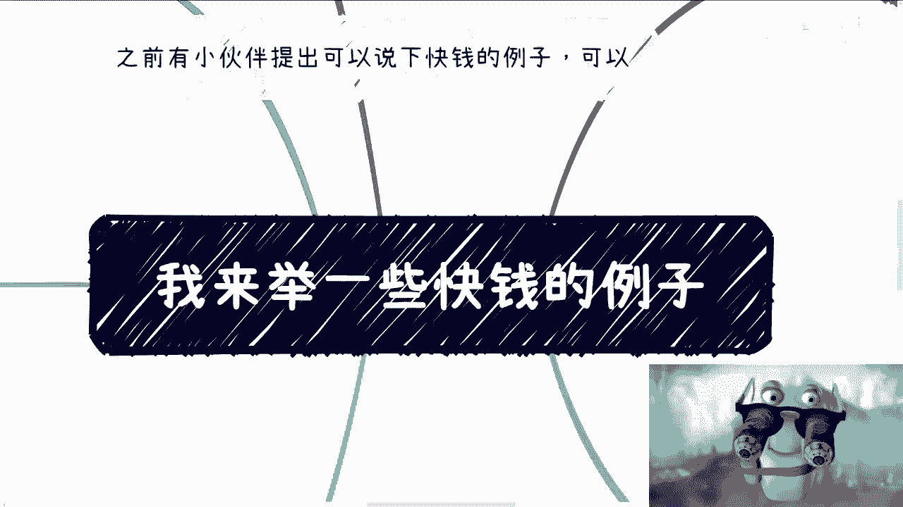

# 课程名称：快钱案例解析与核心逻辑 - P1 🚀💰

在本节课中，我们将通过分析AI、数字藏品等具体案例，深入探讨“赚快钱”的核心逻辑与分类。课程将重点阐述快钱的本质、常见误区以及实践中的关键心态，旨在为初学者提供一个清晰、直白的行动框架。

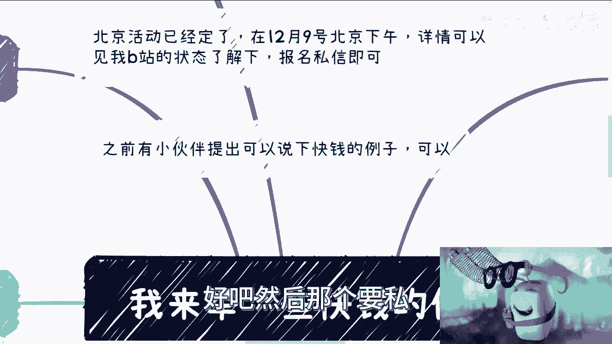

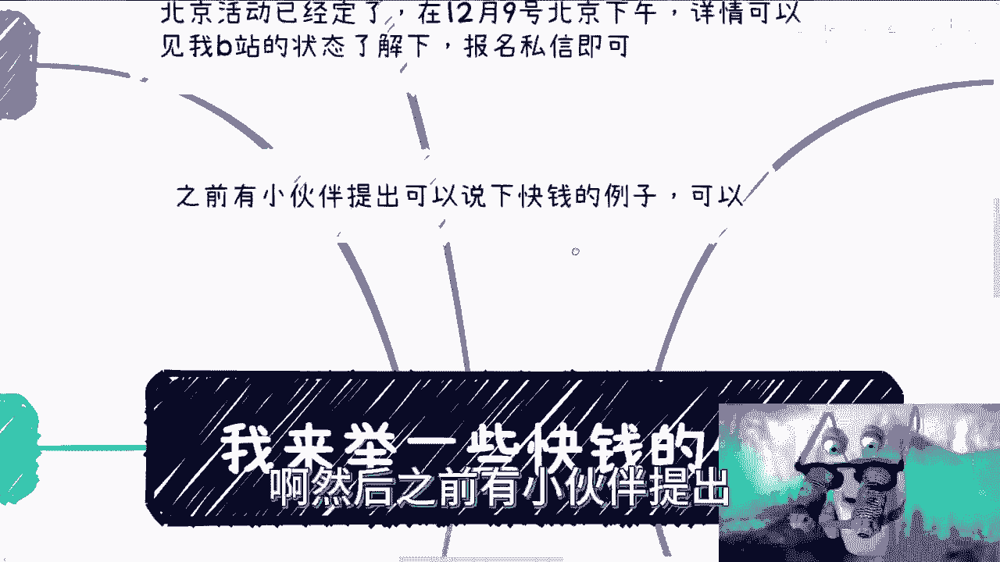

---

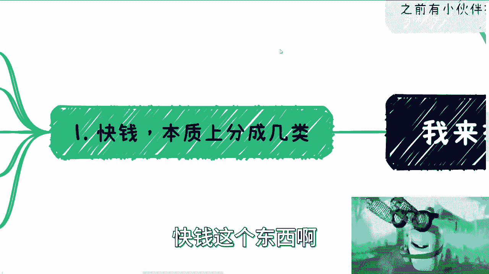

## 概述 📋

“快钱”通常指周期短、见效快的盈利方式。许多人对其既向往又困惑。本节将系统性地拆解快钱的几种类型，并通过近年的风口案例（如AIGC、数字藏品）说明其运作模式。核心在于理解：赚快钱的关键往往不是深度认知项目本身，而是识别机会并快速执行，同时把控好法律层面的风险。

---

## 快钱的本质与分类 🔍

上一节我们概述了课程内容，本节中我们来看看快钱的本质与基本分类。我认为快钱本质上可以分为以下几类：

以下是主要的三种类型：
1.  **作为服务方或项目方**：以“镰刀”身份进行短平快的收割。
2.  **进行短线投资**：追求快速的资金进出与套利。
3.  **经营可长期获取的流水化业务**：投入相对固定，能产生持续现金流的模式。这一点可能存在争议，因为许多人认为快钱一定是短线的，但事实并非完全如此。

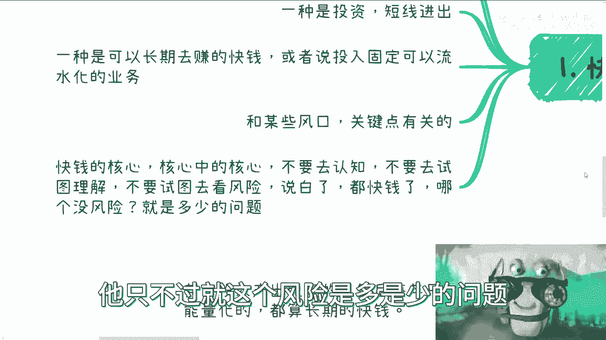

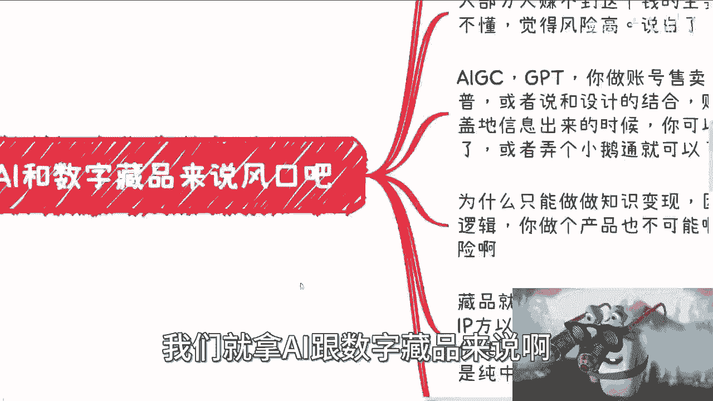

此外，还有一类与**风口技术或热点**紧密相关的机会。

---

## 赚快钱的核心心态 ⚡

理解了分类后，我们来看看实践中最重要的部分：心态。我认为快钱的核心，其核心中的核心是：**不要试图去深入了解、学习或评估其业务风险**。

你需要关注的更多是**法律层面的风险**。如果经过了解，法律风险不大或处于可接受范围，那么就可以考虑。原因在于，既然是“快钱”，如果严格来说，哪个项目没有风险？区别只是风险大小而已。

---

## 案例分析：AI与数字藏品 💡

接下来，我们以近两年的热点——AI和数字藏品为例，具体分析如何应用上述逻辑。

### 关于“信息差”的误区

许多人认为赚快钱需要内部消息或信息差，但其实不然。在当今互联网环境下，真正的信息差极少，即使有，其窗口期也非常短（一两天到一两周）。信息差本身并不构成赚钱的主要障碍。

### 大多数人赚不到快钱的原因

主要原因无非两点：一是觉得自己不懂，二是觉得风险太高。但问题在于：
*   你判断自己“懂不懂”往往没有依据。
*   你判断“风险高不高”也往往没有依据。
*   更重要的是，“懂不懂”和“能不能赚到钱”之间没有必然的因果关系。

### AI领域的快钱模式：知识变现

以AIGC/ChatGPT为例，在今年初的风口期，常见的快钱模式包括：
*   售卖账号
*   制作并售卖课程
*   进行科普宣传
*   结合设计等领域贩卖焦虑（如“不学AI明年就被淘汰”）

**核心操作公式**：
```
快钱机会 ≈ 热点风口 + 低门槛变现形式（如课程、社群）
```

例如，一个简单的方案是：从淘宝购买一套低价课程，处理后在小鹅通等平台以稍高价格转售。许多人纠结于版权等问题，但赚快钱的一个重要前提是：**不要过分在意这些细节**。如果无法接受这一点，就不适合赚这类钱。

选择知识变现的原因在于：AI本身的产品化门槛高，而培训模式风险相对较低、逻辑通畅且现金流健康。

### 数字藏品领域的快钱模式：发行与平台

数字藏品的风口红利主要在于**发行方、IP方和交易平台方**。真正的快钱方式是直接发行数字藏品。

一个关键点是：当时许多平台发行的藏品甚至没有真正上链，所谓的哈希值和区块链信息可能是假的。但这并不妨碍其作为“快钱”模式成立，因为很多购买者并不了解技术细节。

```
快钱逻辑 = 利用市场热度 + 模糊的技术细节 + 快速收割
```

AI的风口周期持续了大半年，数字藏品则持续了一年多。如果在这公长的时间内都无法赚到快钱，那么更难抓住其他转瞬即逝的机会。

---

## 项目方、投资与其他模式 💼

### 成为项目方

在Web3等领域，询问如何赚钱时，你会发现，作为营销或服务等“卖水”的第三方，其收益通常不如项目方。虽然项目方也可能被资方、交易所收割，但就赚快钱的潜力而言，做项目方更直接。

这里必然涉及风险。但想赚Web3量级的快钱又惧怕风险，无异于等待天上掉馅饼。做生意赚钱需要果断。Web3每个时期都有快钱机会（如ICO、IEO、IXO等），关键在于执行力，而非无休止地讨论风险。

### “长期”的快钱

这类模式可能存在争议，主要指那些**投入产出比高、每年收益固定且可量化**的业务。它们往往依赖特定政策、大框架或固有的商业逻辑，而非自身的核心护城河。

例如：
*   政府每年的配套政策、人才培养补贴
*   产业园成立的政策红利
*   高校专业申报等项目

能赚到这类钱，通常是因为关系到位、建立了信任或有既往合作，而非纯粹依靠个人能力。这种本质上也是快钱，只是周期更长、更稳定。它与行业风口型快钱（如数字藏品、直播）不同，后者周期短且波动大。

### 短线投资

对于散户而言，参与优质项目的早期投资往往很难，因为很多高精尖项目不对散户开放额度。可能通过第三方代持等方式参与，但这又引入了新的信任风险。

关键在于：到了投资这一步，追求百分之百赚钱是不现实的。核心在于区分两种风险：
1.  **法律风险**：这是可以且必须去了解和把控的。
2.  **商业风险（赚钱/亏钱）**：这很难完全认知和把控。

以数字藏品为例，只要不开设二级市场，法律风险就极低。这方面的了解可以通过咨询律师或询问已经上船的同行来实现。

---

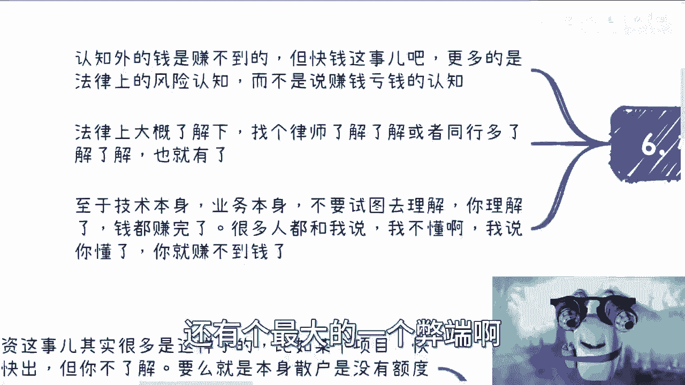

## 最大的忌讳：试图弄懂一切 🚫

最后，也是最重要的一点，赚快钱最大的忌讳就是：**试图去深入了解技术或业务本身**。

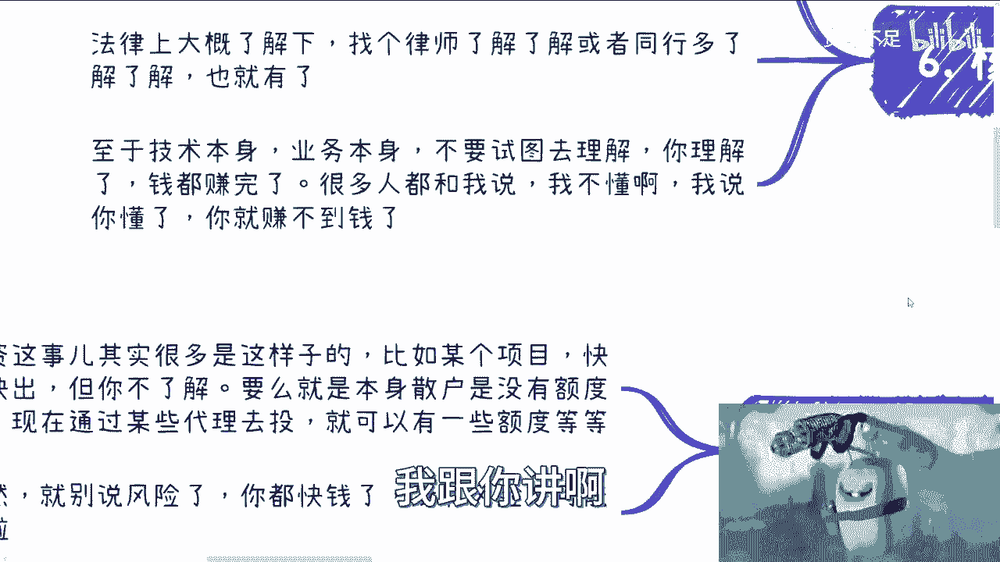

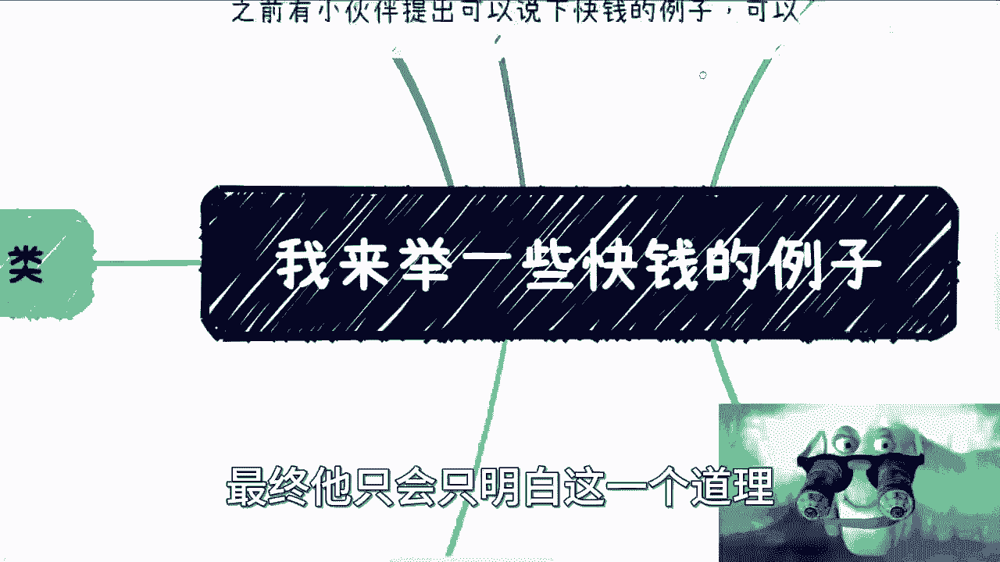

因为当你终于弄懂的时候，市场机会早已消失。很多赚过快钱的人最终都明白这个道理：**一旦你懂了，反而会因产生各种理念和顾虑而阻碍行动**。

这就像策划一场活动：如果你觉得活动很“low”，那是因为你用自身的认知去评判。但真正的买单者可能正是信息不对称、渴望机会的人群。赚快钱需要的是**降维打击**，而不是用自己已有的高认知去服务同等认知水平的人。

```
成功快钱 ≈ 对目标人群的降维打击 + 忽略非法律性细节 + 快速执行
```

简单来说，快钱本身没有严密的逻辑性，过度思考逻辑性会让你迷失方向。

---

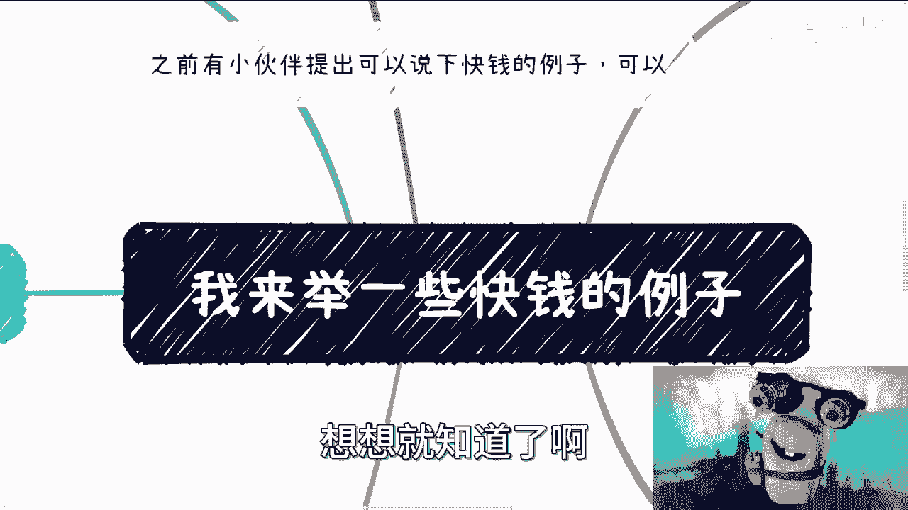

## 总结 🎯

本节课我们一起学习了：
1.  **快钱的三种主要类型**：项目方收割、短线投资、流水化业务。
2.  **核心心态**：聚焦法律风险，而非业务风险；避免陷入“必须弄懂”的误区。
3.  **案例分析**：通过AI（知识变现）和数字藏品（发行收割）了解了具体操作模式。
4.  **其他模式**：了解了成为项目方的潜力、“长期”政策快钱的特点以及投资中的风险认知。
5.  **关键行动准则**：避免过度研究，强调快速执行和降维打击。

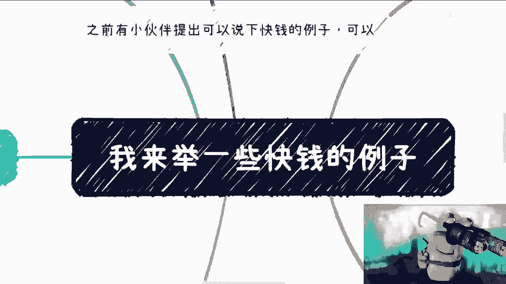

记住，赚快钱更多是关于机会识别、风险边界（法律）把控和执行力，而不是关于深度学习与技术钻研。