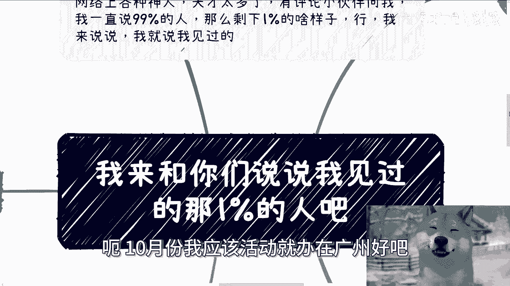
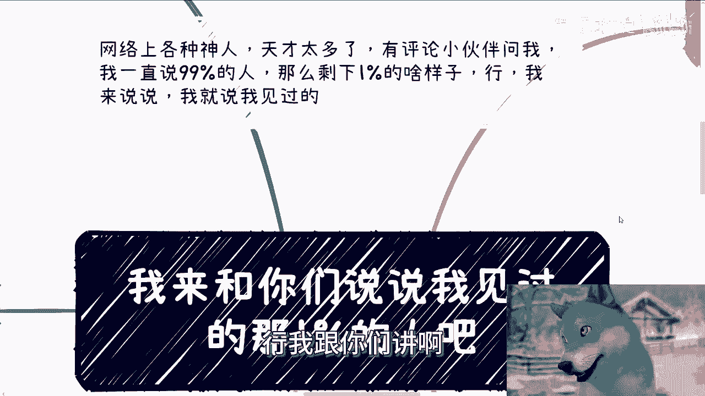
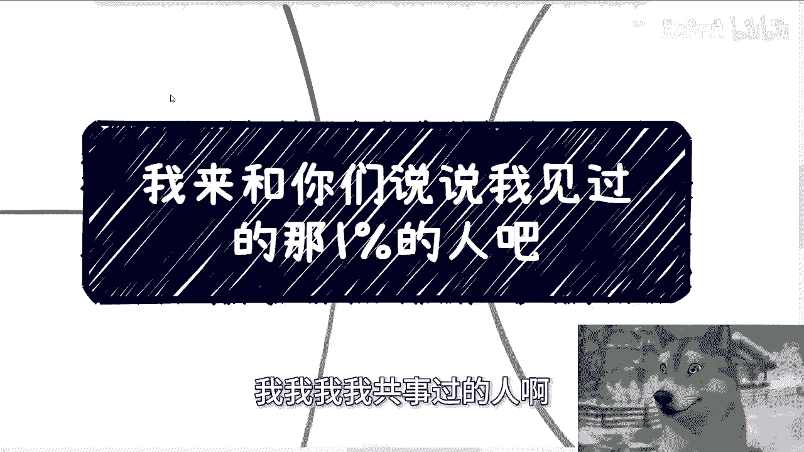
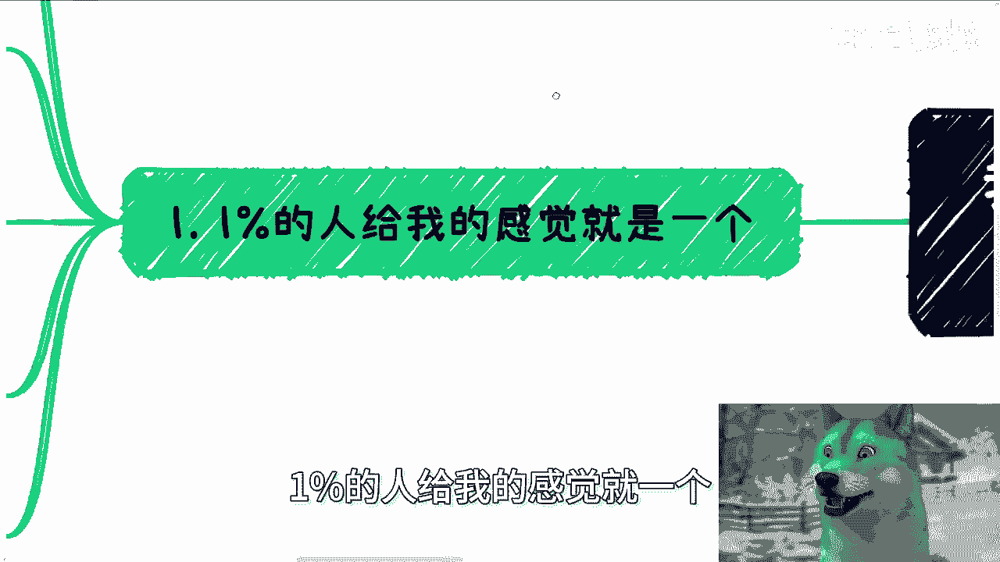
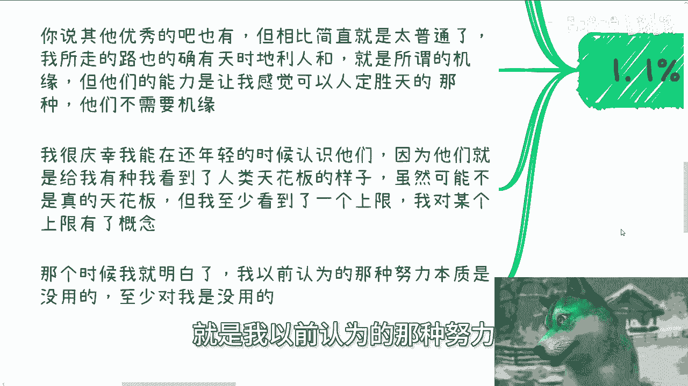
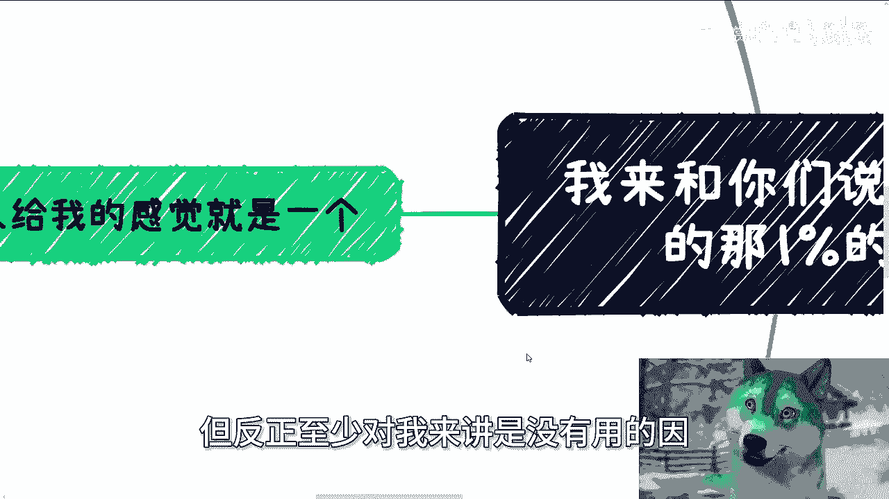
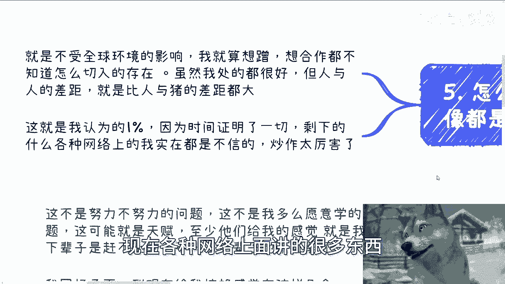
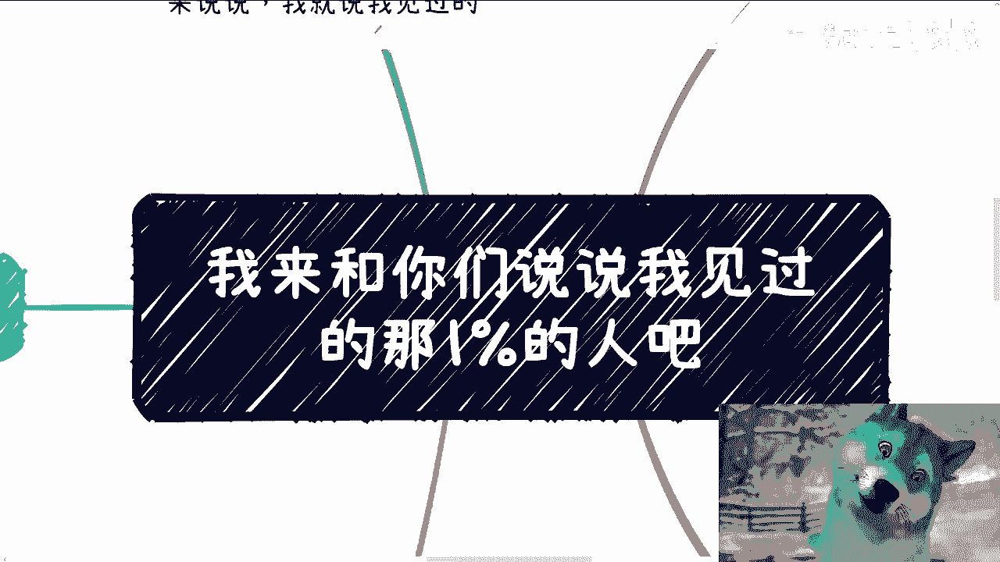

# 我来和你们说说我见过的那1%的人吧 - P1 - 赏味不足 - BV1CvxxeKEs4

啊大家好啊，这个再次提前预祝大家国庆节快乐啊，额10月份我应该活动就办在广州好吧。

但时间我还没定啊，定了我再跟你们讲啊，呃然后呢就是说今天我们说的这个主题啊，这个网络上有各种神人啊，天才太多了啊，呃我也碰不到啊，有评论小伙伴问我，他说我一直说99%的人，99%的人对吧。

那么剩下1%的人应该什么样子啊，行我跟你们讲啊。

我就来跟你们说一下我见过的啊，我还是那句话啊，神不神的我不知道啊，但是呢我只是说我接触的我认识的啊，我我我我共事过的人啊。

我认为那1%的啊，那么首先啊1%的人给我的感觉就一个。

哪个有感觉呢，就是这不是努力不努力的问题，而这也不是我愿不愿意学的问题，这不是我付出多少钱的问题，这他妈就是天赋，就至少他们敢给我感觉，就是我下辈子是赶不上的，我下下辈子也是赶不上的。

我以后啊这个未来对吧，以后投胎能不能赶上，要看投胎投得怎么样啊，我回忆了一下啊，到现在给我这种有这种经验感觉的就那么三个，一个是我小学时候的同学啊，后来也有联系，但现在也不联系了。

一个是我第一份正式工作的同事啊，一个呢就是我前两年行业当中碰到的一个朋友，你说其他优秀的吧也有，但相比简直就是太普通了啊，额你看我以前从从小走到现在的路啊，我说实话我觉得没有人比我更普通对吧。

小学在外面摆地摊卖报纸，你们有吗，没有吧对吧，这个初中在外面卖羊肉串，你们有吗，也没有吧对吧，这个大学毕业了之后，在人民广场这种高空呃，修那个天线，你们有吧，也没有吧。

我是觉得啊大部分的人其实过得都比我好啊，大部分的人呢这个基因啊各方面也都比我强啊，所以说你像我这种普通人啊，我能走的路就是只有靠天时，地利人和，就是所谓的机缘，但是他们的能力啊，我我不夸张的说啊。

他们的能力就会让我有种感觉，就是人定胜天，就是整个环环境怎么样，不不重要，要机缘吗，不要的，要他妈屁机缘，他们原本存在就是机缘，我我很庆幸啊，我在还年轻的时候，我会认识这种人，因为他们就是让我有种。

看到了人类天花板的感觉，因为毕竟嘛就是你很多东西怎么说呢，你很多东西太抽象，你没有看到过，你不认识你，对它是没有一个具象化的感觉的对吧，就虽然可能就是有很多人觉得，卧槽也不过如此嘛，不是天花板对吧。

但至少对我而言，对我而言，我看到了一个上限对吧，我对这个上限就有了概念，否则就说你跟我说天花板，天花板三个字太抽象了，我怎么知道什么是天花板，对不对，这就像这个人这个小伙伴评论区问我的。

他说他说1%的人什么样子，我就跟他说，1%的人，1%这个词也很抽象，对不对啊，那那个时候呢我就明白了，就是我以前认为的那种努力本质是没有用的啊。

当然啊你们有没有用，我不知道，但反正至少对我来讲是没有用的。

因为我就是个小学卖报纸的人，你妈我能有什么用啊，对不对啊，第二我这个小学同学啊，我觉得别的题呢其实我印象不深，但这个人呢我记得很清楚，因为太特殊了，就是他在我小时候就悟。

就是已经给我树立一种非常特立独行的感觉，就是别人都在补课啊，要么就是像我这种怕他妈不停的打游戏啊，这学校出了名批评的皮大王啊，他不是的，他早上起来打太极拳，拉着我一起打啊，然后呢学学数学啊，就是啊。

然后呢就是我们日常学数学，他已经在外面就奥数班尖子生了，但是他从来不补课，因为他家里其实很穷，就是就是也不会补啊，我跟他楼上楼下对吧，关系又很好，那那个时候呢就是在我理念里面，他就是天才，因为一样的嘛。

我又没见过天才，我怎么知道呢，对不对，那么毕竟呢很多词就像我说的，我没有具象化的理解，但是他就是让我第一次有了这种具象化理解啊，在我接触到的这个世界里面啊，那为什么印象很深呢，因为其实小学我们在一起啊。

初中就分开了，我呢当时因为一些怎么说呢啊，你们可以认为走后门也好，反正有些东西也好，就我去的这个学校呢比他好很多档次，因为我们小学对口的那个学校太他妈垃圾了啊，有一说一啊，那个时候我感觉怎么说呢。

我还有点小骄傲啊，但事实证明我是，因为什么呢，因为若干年后我我毕业了，我找不到工作啊，在呃高空就上海这边，大概中环外环吧啊楼上做维修啊，他已经在上海交大毕业之后去了美国深造，当然也有可能去了哪个大厂啊。

去了去了，当时就去了哪些大的offer吧，我也不知道，但就如我说的啊，我这种99%的人是需要机缘的，但是他不需要啊，就是你会发现把他扔到什么环境里面，他都能够展现出他的能力，根本掩盖不了啊，第三呃。

我第一份工作的同事，他在当年我毕业就是第一份正式工作，因为高空维修做了实习期，做了两个月我就走了嘛，因为当时我受伤了啊，因为唉说来话长，他妈的都是悲惨的故事啊，呃我当时第一份这个正式的工作呢。

他最多比我大个三十三四岁，那那个时候也就二十五二十六啊，每天其实在我眼睛里啊，他就是打游戏啊，要么呢就是我我跟他两个人去上海，教他打羽毛球，因为那个时候我们办公室在上海那个闵行，紫竹嘛对吧。

对面就交大嘛，那日常就溜出去打羽毛球，妈上班是不可能的，也不太上的，但是就这样一个我认为的普通人啊，因为我还是那句话嘛，我不懂嘛，这就好像一个就是怎么说呢，就好像我跟一个三体人对吧，但是由于我的无知。

我不知道对方是个三体人，对不对，那我就没办法跨次元的去理解，这个人到底多么吊啊，那么你想啊，就这么一个人全面碾压交大SM出来的人对吧，你比如说我们出去团建，我们到哪都是玩，他到哪都是参加比赛。

都是coding啊，然后最最离谱的是什么，就是全球的google code jam，你们可以去查一下cody gm是怎么样一个比赛，对吧啊，google所举办的全球的一个coding的一个比赛竞赛。

那别人团队都是三个人，他他妈一个人，然后永远一挑三，时间还比别人短，分数还比别人高，怎么办呢，怎么办呢，你想想看对吧，就对我当时这个人就对我当时20多岁，我这么一个存在来讲，卧槽这他妈无法理解啊。

这这我我我我我的智商能理解吗，对不对，我的级别能理解吗，这我理解不了啊，这人应该是我成年之后碰到的第一个天花板，也是至今我认识的人里面的天花板，无人能超越对吧，那互联网做技术的我见过很多。

但天赋达到这种高度的就没见过，那当然刘教楼楼教主除外啊，罗教主是后面就是认识的，但他除外啊除外，那罗教主已经是就就又又是另外一个事情了啊，那么后来去了美国对吧，现在在google x lab。

那当然最后一次见面，我知道在x lab后面有没有去别的地方，我就不知道了啊，那这个1%也非常清楚了吧，对不对好，然后还有一个呢就是我前两年行业认识的朋友，因为大家也都知道嘛，就是我之前在区块链嘛。

然后区块链这边的话，国内给政企做咨询嘛，然后海外的话就是就是也涉及到一些，web3的业务嘛，那这个人呢其实就一开始我知道啊，他是一个金融领域很牛逼的人，但是金融领域很牛逼的人多了，对不对，那很不起眼啊。

然后日常吃饭呢，咳咳咳，日常吃饭呢说说笑笑，而且对人呢也呃怎么说呢，都体现不出什么什么特别地方啊，主要他妈的还比我小啊，然后直到有一天我就一直很好奇，我就问他嘛，我说之前某个项目暴雷嘛。

大概他损失了100多万吧，然后他现在我我就问他嘛，我说我我也好奇，我随便问一嘴啊，我说你这个呃日常收入哪里来的，因为我说我看你年龄也不大对吧，同时也不是说就每天很焦虑的样子，就从来不焦虑。

然后他就说他说他有个技能啊，然后就周五拉拉着给我演示了一下，那自从那天之后呢，我就每天中午看他在那边在线德扑，那少的话呢赚几千多的话呢，就一天大概56555到10万，他说他教我，我说算了。

这种能力不是我学得来的，你来拉倒吧，哦然后疫情时候呢，我们还后来视频过一次啊，只不过呢就当时我们联系的时候呢，为什么视频呢，因为他已经去英国了啊，也也可能别的某个国家我忘记了啊。

他他是去参加全球的这个德普比赛的，然后他回来呢应该是在苏州宁波这边吧，反正长三角这边哎，但是我跟他也很久没见过面啊，额咳所以啊怎么说呢，就是说你会发现啊，就是这种人他都是个独立的存在。

就是他不会受全球环境影响，就说而且另外一方面，你说我作为一个怎么说呢，伪资本家对吧，或者或或者还说三界之外的人，我也很想蹭啊，我也很想合作，但是我他妈找不到切入点了对吧，虽然可能我处的都很好。

大家也共事过对吧，大家怎么样子，但哼人与人的差距就是比人与猪的差距都大，怎么办呢对吧，所以说至少这些人我刚刚回想了一下，就是这三个人是我认为的1%，因为时间证明了一切，他不是一个一个。

就是说吹嘘出来的或者怎么样的，但剩下现在各种网络上面讲的很多东西。

我实在都不信，因为炒作太厉害太厉害了，对吧，而那那你说这三个人在我看来都是硬实力啊，就是你你把他扔在一个环境不好的学校好了，你把他你你你把他就是说呃就是说亏了很多钱，好了对吧。

你你你你你看他日常就是嘻嘻哈哈啊，嘻嘻哈哈对吧，打羽毛球也好，怎么样也好，就是就是他的能力跟他的年龄和他的怎么说呢，就是说就日复一日，年复一年的这种这种啧这种磨练你挂不上钩。

就是就是你说跟心努力有没有关系，当然有关系，但是这是单纯努力的问题吗，不是对吧，所以说我才一直说就是说你们也好，我也好，大家都是普通人对吧，富二代，我也撇开对吧，那些父母辈有积累的，我也撇开。

那我们能怎么办呢，对不对，所以我在这个地方我也最后再提一点啊，就是你们仔细想想看一个问题啊，很多人会跟我说，他是小镇做题家，很多人也会跟我说，他想改变，比如说啊就是就怎么说呢，就是说啊打工的这种现状。

或者说就是想赚钱就怎么样子，但是你们有没有想过，如果你们真的想改变，你们去走这个世界，这个国家大部分人走的独木桥怎么改变，你们有没有想过改变是什么，改变就是要剑走偏锋，这才能改变，看到过随大流改变了吗。

好吧行吧，那就这么着吧啊那个职业规划好吧，工作上面商业规划啊，就是赚钱啊，副业啊，上面你们觉得反正有任何的问题啊，有任何需要就是说探讨啊，希望我给你们一些呃发展方向啊，或者说这个贴合你们个人建议的。

那么你们可以叫什么，整理好对应的问题跟个人背景好吧。

