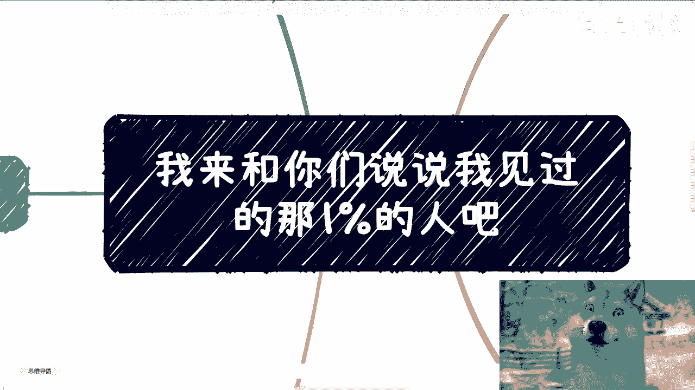
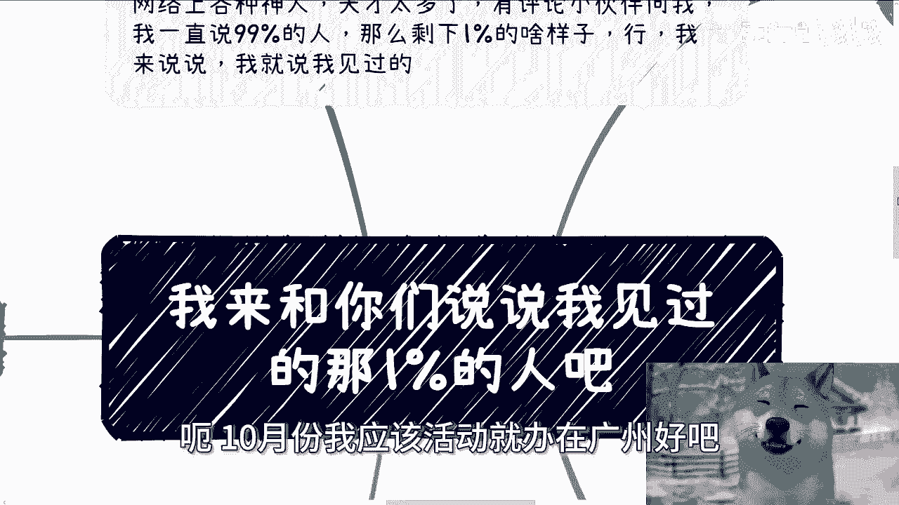
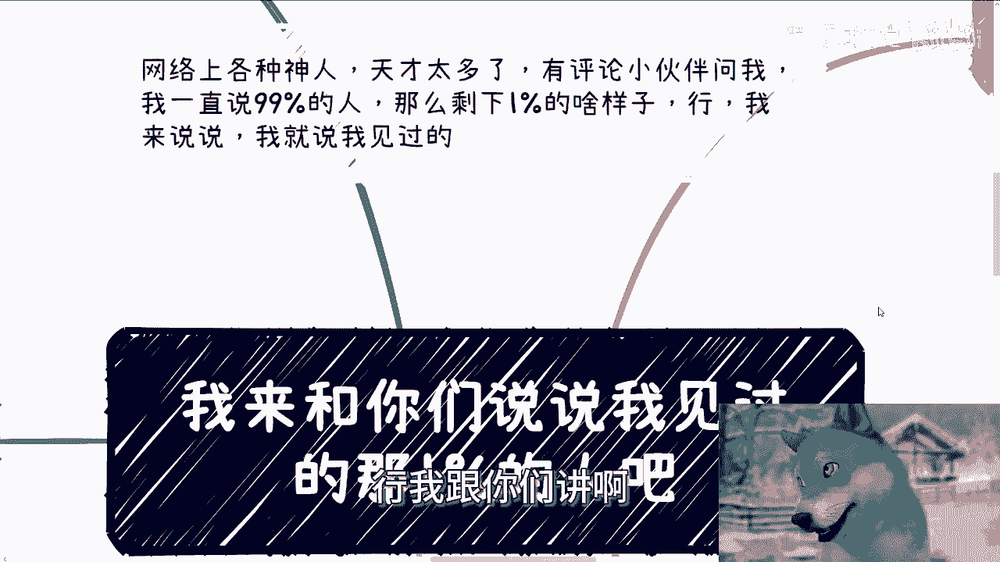
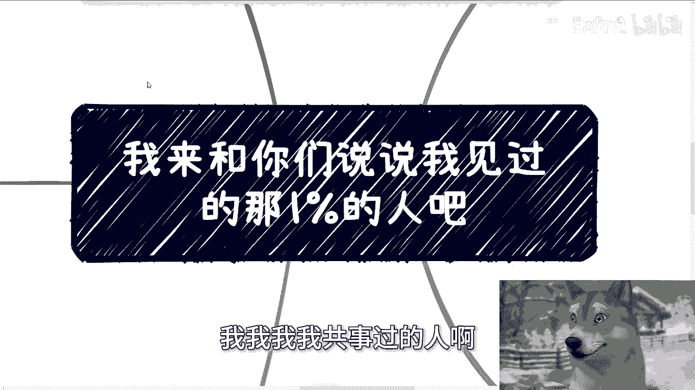
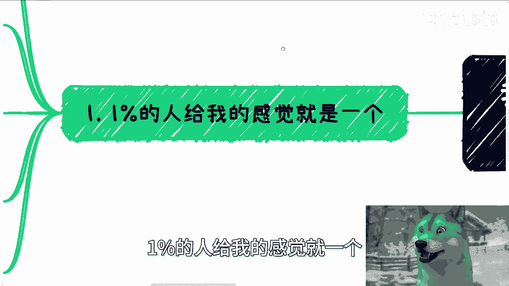
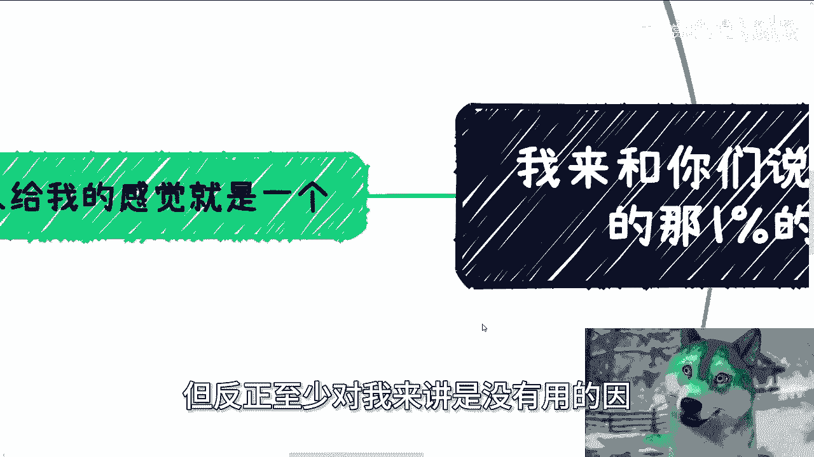
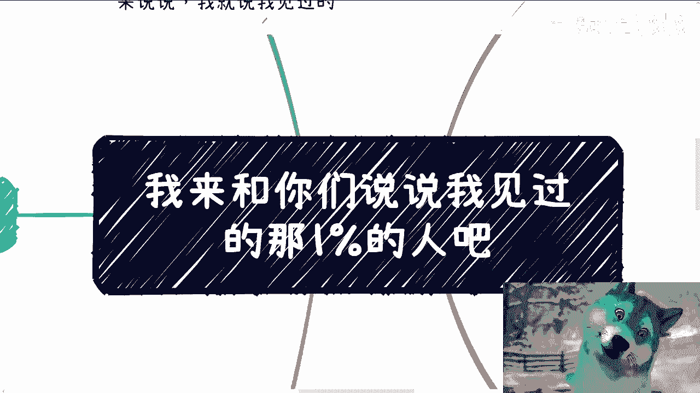

# 课程：认识那1%的人 - 第1课 🧠

在本节课中，我们将通过讲述者的亲身经历，探讨那些被其定义为“1%”的顶尖人群的共同特质。我们将分析三个具体案例，理解天赋与努力的关系，并思考其对普通人的启示。

## 概述：何为“1%”？

网络上关于天才与神人的讨论很多，但大多抽象。本节旨在通过三个真实、具体的例子，将“1%”这个概念具象化。讲述者强调，这并非关于努力或意愿，而是一种令人感到难以企及的**天赋**。

## 核心特质：超越环境的天赋

上一节我们提出了“1%”的概念，本节中我们来看看其核心特质。讲述者接触过的这类人，给他最强烈的感觉是：**他们的成功不依赖于环境、机缘或常规路径**。他们的存在本身似乎就能创造机遇，其能力公式可以概括为：

**个人天赋 >> 环境约束**

这与绝大多数人（包括讲述者自己）需要依赖“天时、地利、人和”的机缘截然不同。

## 三个具体案例

以下是三个让讲述者深刻体会到“人类天花板”的具体人物案例。

### 1. 小学同学：特立独行的早期觉醒者
*   **背景**：讲述者的小学同学，家境普通。
*   **特质**：在小学时期就表现出与众不同的习惯（如清晨打太极拳、自学奥数），且从不参加课外补习。
*   **发展**：尽管初中就读学校不如讲述者，但最终考入上海交通大学，后赴美深造或进入顶尖公司。
*   **启示**：其能力在早期就已显现，并且无论身处何种环境，都能脱颖而出。

### 2. 前同事：隐藏的“三体人”
*   **背景**：讲述者第一份正式工作的同事，年长几岁，日常看似悠闲（打游戏、打羽毛球）。
*   **特质**：拥有碾压性的技术天赋。最突出的例子是单人参加**Google Code Jam**（全球编程竞赛），通常需要三人团队协作，但他总能以一敌三，用时更短，成绩更好。
*   **发展**：后加入Google X实验室。
*   **启示**：真正的顶尖能力可能隐藏在平凡的表象之下，其高度远超常规理解范围。

### 3. 行业朋友：非典型的“技能”变现者
*   **背景**：在区块链行业认识的年轻朋友，起初只知道其在金融领域很出色。
*   **特质**：拥有一项惊人的**技能**——在线德州扑克。仅凭此技能，日常收入可观（单日数千至十万元级），并以此参加全球性比赛。
*   **启示**：顶尖能力可能以非常规的、高度专业化的形式存在，并且能完全支撑其生活与追求，不受传统职场路径束缚。

## 总结与反思

本节课我们一起学习了通过三个案例具象化理解的“1%”人群。他们的共同点在于拥有一种**不受环境限制的、压倒性的硬实力**。这种实力与单纯的“努力”关联不大，更多是一种与生俱来或早期形成的顶级天赋。

对于包括讲述者在内的99%的普通人而言，这条路径难以复制。这引出了一个关键思考：如果随大流走常规路径（如“小镇做题家”模式）难以实现根本性改变，那么“剑走偏锋”——寻找并发挥自己的独特优势，或许是更可行的破局思路。

---

**注**：如需在职业规划、商业发展或副业方面获得个性化建议，请整理好具体问题与个人背景信息。