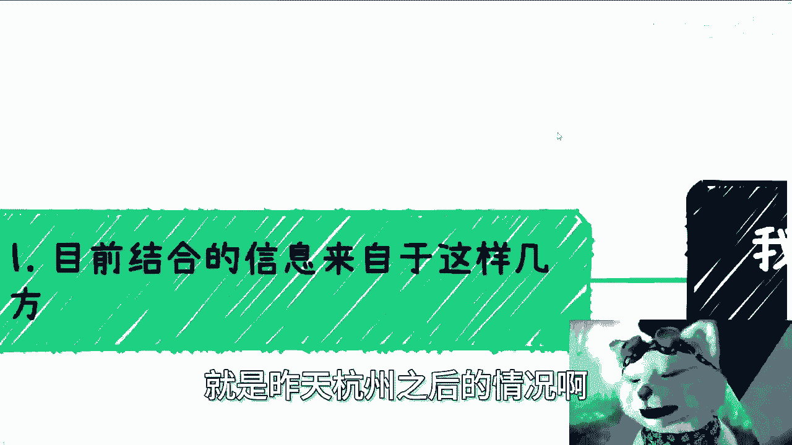
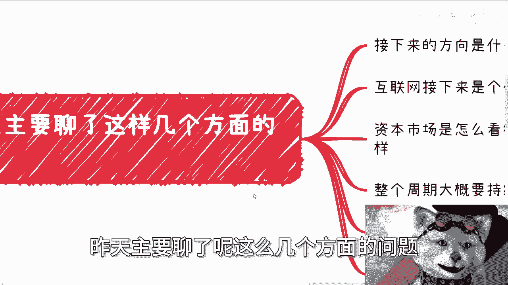
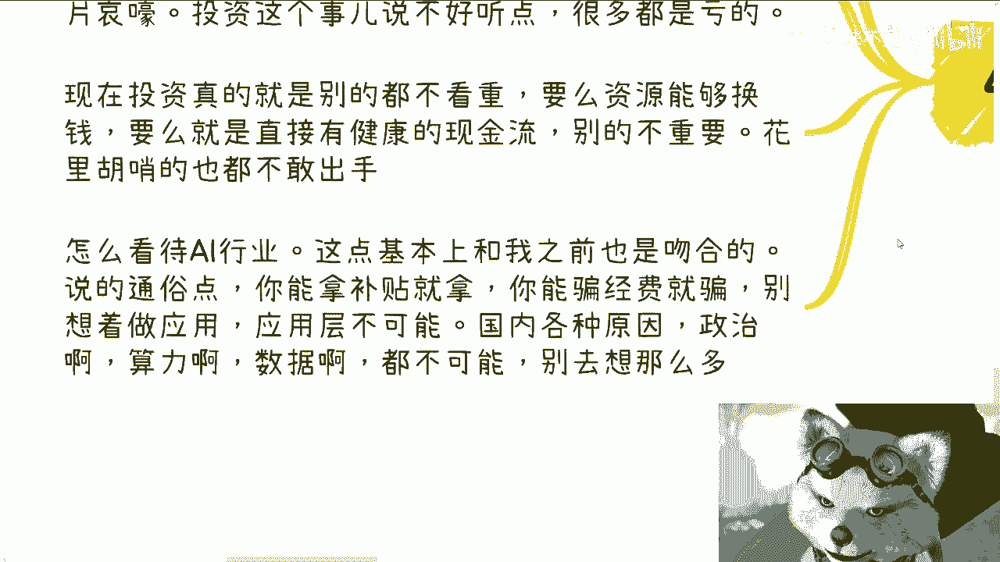

# 我来总结下综合昨天杭州信息之后的结论 - P1 - 赏味不足 - BV1KK411Y7hm

好大家好，真的我跟你讲。

今天这个情绪很差啊，火气很大，真的是啊，这一天咨询做下来，真的我感觉妈的一天到晚都在骂我，我尽量克制一下呃，放到我们来说一下啊。

就展开说一下，就是昨天杭州之后的情况啊。

嗯第一呢目前结合各个信息来自于这么几方，我给你们列一下，第一我找了个地方相关的公务员，第二资本基金包括了一级市场，二级市场，第三高校包括了高校，我们以前合作过的院长以及高校。

长期与高校长期合作的一些机构，第四协会商会协会等，第五还有部分的创业者，当然啊我自己我自己也算吧，这个创业者对吧，嗯好，我们来往下看。

首先第一点啊，昨天主要聊了这么几个方面的问题。

我给你们列一下啊，第一呢我也问了，我说下来方向是什么，有没有一些更好的方向对吧，啊等一下我把我这个调整一下好，这是第一点啊，然后第二点呢，就是互联网接下来会是个什么情况，有没有更好的机会啊。

第三就是说资本市场，怎么看待现在的整个这个局势，比如说之前的这个投资怎么样，第四呢就整个周期大概维持多久，第五怎么看待AI这个行业啊，第六就是我们接下来到底该怎么办啊，好我先一个个来说。

我就不单纯列单独列了，第一关于接下来的方向有没有更好的方向啊，答案就是多数都是没有的，就跟我昨天视频讲的一样，多数都是没有的，当然啊这个没有，只是说没有更好的方向，就就只能说是温水煮青蛙，就相对来讲。

大家可以认为就是说这根线是平的啊，嗯因为他现在已经没有这些土壤，也就是说所谓的天时地利人和他没有了啊，他没有以前这么多红利期，也没有这么多的所谓的这个政策的扶持，或者别的东西。

那么我们就很难去做一些很确定的东西，就更多的就变成了就是说我只有投入，但我不知道产出是什么对吧，当然啊不是说没有机会，而是说对于大众来讲啊，或者对于大部分人来讲，积累总归还是要的，但是对于我们来讲。

或者对于就是说有些积累的人来讲，你没有明确的方向跟目标，他是不可能出手或者往下执行的对吧，你说已经没有明确的目标跟方向，也没有明确可以赚钱的地方，那么它基本上就等于没有方向了对吧，那当然啊。

我就说从当下这个情况来讲是这个样子的啊，那么对于大众来讲呢，机会指的是什么呢，就是说机会有没有用，但是对大众来讲的意思，就是说机会会比以前小很多，也就是说它可以折腾啊，折腾出来的概率大大降低啊。

那么要说更好的方向的话呢，就是昨天视频里说的，就是说结合自己的技能，你要么就是多去找找小项目啊，能赚点是一点啊，如果有合适的技能，那么可我觉得就有些蓝领的技能，可以看看澳大利亚啊，加拿大海外的机会对吧。

就看看比如说有哪些移民的，也不是移民嘛，我觉得你只要不去美国这种地方卷就可以了啊，别的地方其实还是有有有有机会的啊，那么互联网接下来什么情况呢，有没有更好的方向啊，这个基本上现在聊下来就是定论，没有啊。

我跟你们讲就是没有，或者说该做的继续做，红利没有了，什么都没有，就是就是你完全就是回归到就是苦力活，就是你就当做是一个宁古塔里面的这个苦力，对吧，什么都没有，你别去想了，方向的话，有没有有的出海。

那说的通俗点是什么，就是把国内那些原本玩的剩下的，不管是割韭菜也好，还是说是融资也好，把国内曾经玩剩下的看看能不能去海外，东南亚啊，或者其他地方啊，复制复制看看海外的人能不能割没了。

我跟你讲互联网结束了啊，这个就是这样啊，那继续说啊，资本市场看待如何看待现在局势啊，呃我昨天聊下来，我说实话我觉得我有点震惊的，因为我没有想到，从资本这边得到的信息，是比我曾经得到的其他信息更差。

就是我综合认为是10年起步，而资本市场会认为可能要20年30年啊，那么得到的信息，就是说现在的一级市场一片哀嚎啊，投资这个事说的不好听点，基本上很多都是亏的啊，现在投资我跟你说啊，就是对方给我的说法是。

现在投资呢真的就是别的都不看重，要么你就是资源能给我花点钱，要么就是直接有健康的现金流，别的都不重要，你别给我整花里胡哨的，这都没有用啊，就是你说有没有钱，有的不敢出手，没人敢出手好。

然后我们再来说怎么看待AI行业，这一点基本上和我之前的认知已经完全吻合了，说的通俗点是什么，就是你能拿补贴的，你就拿你能骗经费的，你就骗啊，你别想着做应用，我跟你们讲应用层已经不可能了。

国内由于各种原因，政治啊，算力啊，数据啊都不可能啊，不要想这么多，要有就是骗啊，就这句话不存在。

海外可以啊，海外可以，国内不要想了，不好意思，没这个土壤好。

最后一点，我们接下来该怎么办，基本上互通信息之后呢，我也问出了灵魂问题，就接下来该怎么办，有没有更好的建议或者方法，现在几乎所有人给我的结论就是，胆要么就装死啊，那么你说等跟装死有什么区别。

有的等呢就这么说吧，庄子根等本身没什么区别，但是有一点是什么，就是大家该去盘资源的，该去聊的，该去抱团的，还是要去报，不是说坐以待毙啊，不是说哎呀，陈老师说他妈的要等要装死，就他妈不动了，不是的。

你懂吗啊，当然这些呢我觉得是对一些有积累的人来讲，我觉得对大部分年轻人来讲是什么，就瞎投资，别瞎去做风险太大的事情，别就是别该不要去搞那些有的没的啊。

就是该积累你还是要积累该社交关系，你还是要去社交关系的，就这么回事啊，对于完全没有方向的小伙伴啊，我建议的是什么呢，就是泛互联网和泛金融，为什么，因为至少这两个行业，他什么别的行业都能交叉啊，对吧。

你你你一上来你说我我我要从零开始，或者我就白手起家，我得去呃浪或者怎么样子，你不能找一个一开始他的切入，灭绝很窄的东西啊对吧，你你说我同样选我，我至少选一个，就选择面或者概率广一点的地方吧。

啊好然后我应该是下周吧，因为这周没空了，我周五还得我周六还得在微软那边上课嘛，就是我接下来还约了协会，我估计下周去好吧，反正有什么风吹风吹草动。

我会第一时间在这里跟大家讲的，能说的我肯定都会跟大家讲好吧。

就不能说的我也会跟你们讲，我不能说，然后现在我们可以讲好，就就就我觉得就只能这样子了，我说实话，昨天喝咖啡喝茶，喝到最后就是两个两个人，几个人，就已经是对天看了，你知道吗，就是但凡有方法我早就说了。

好吧，所以说我觉得你们现在要做，所有人要做的就是就包括我现在也是一样的，动就是尽可能的动不动去了解了解市场对吧，积累积累关系吧，去去怎么样，你们现在还没有，那就尽可能去0~1去做好吧。

别的我觉得先不要想这么多，静观其变啊，行啊，就这么个结论好吧，反正有啥咨询的。

