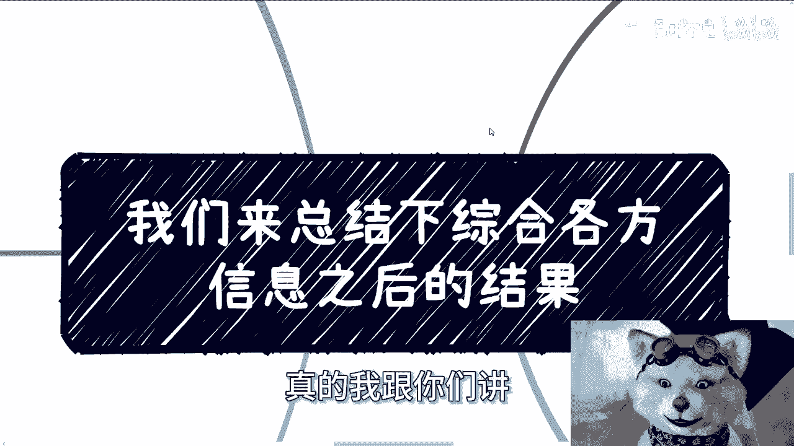
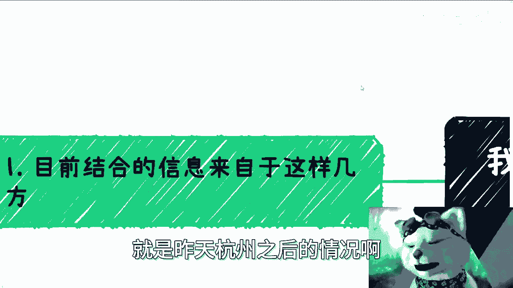
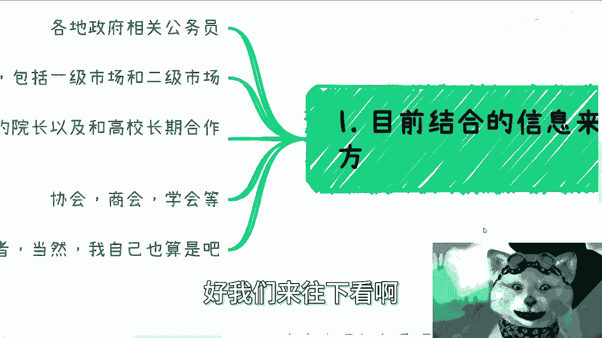
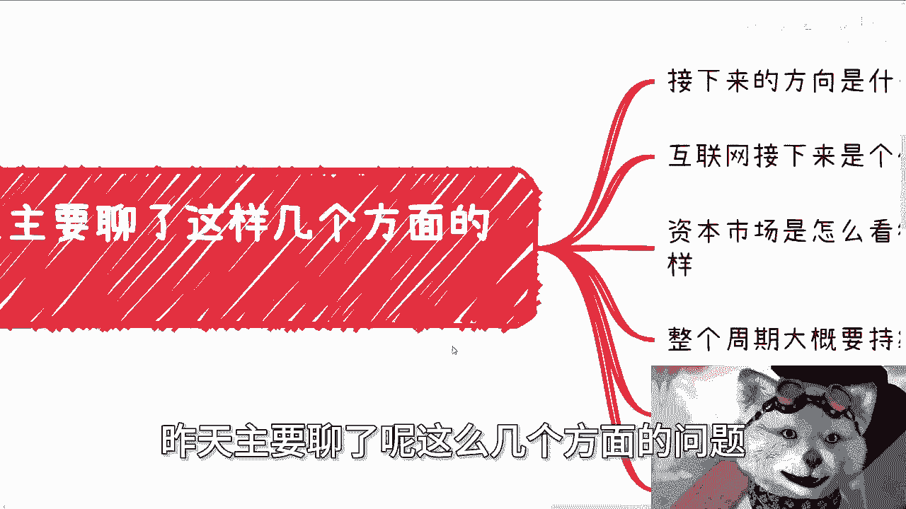
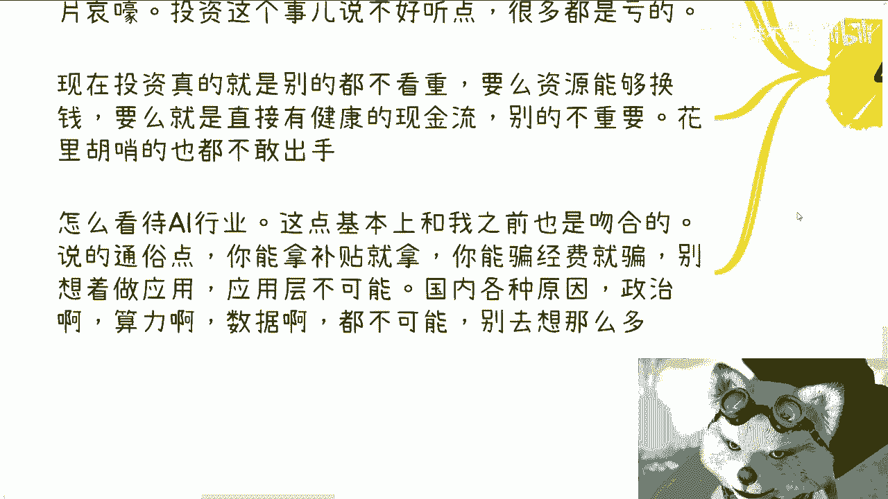
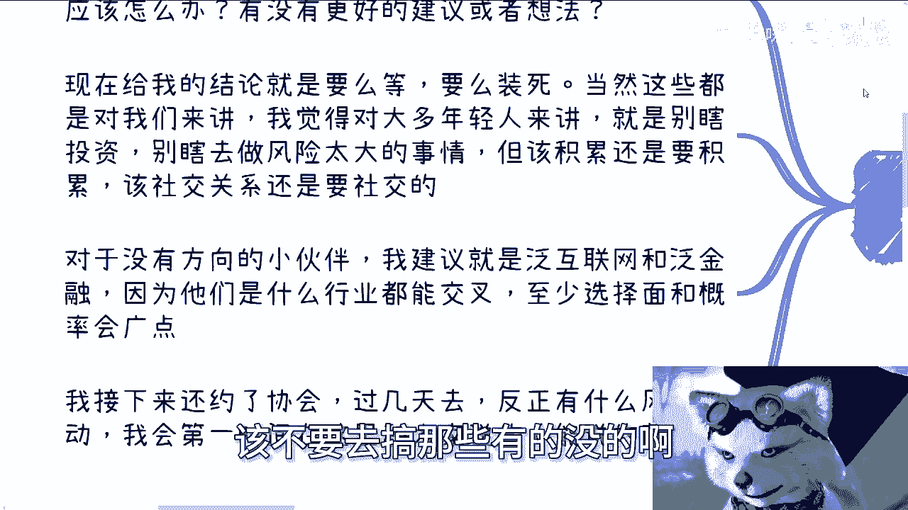
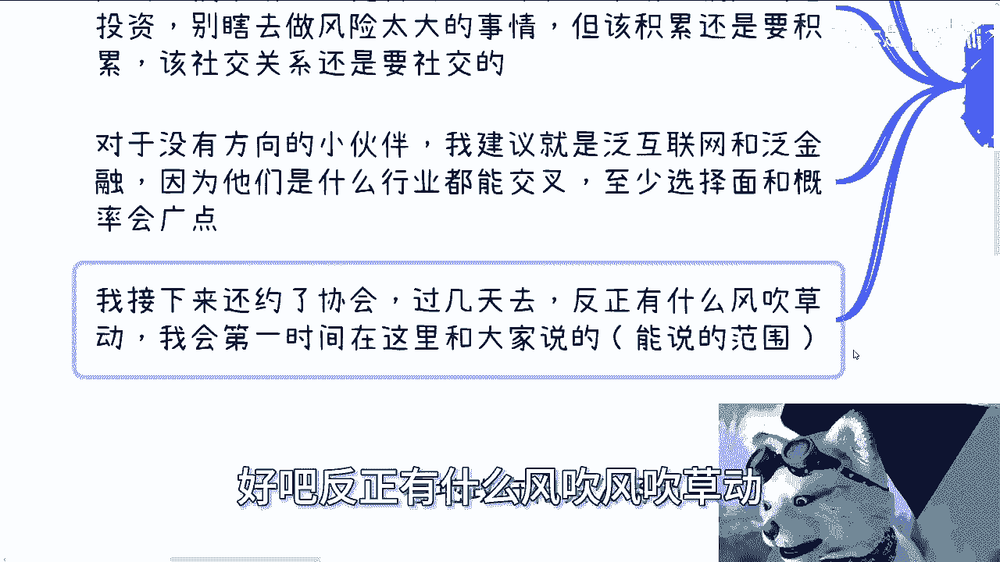

# 课程名称：杭州信息综合分析与未来方向探讨 - 课程01



## 概述




在本节课中，我们将要学习如何综合多方信息来分析当前市场环境，并探讨个人与企业在不确定时期的发展方向。课程内容基于对公务员、资本市场、高校、协会及创业者等多方信息的整合。



---



## 信息收集来源

上一节我们介绍了课程概述，本节中我们来看看信息是从哪些渠道收集的。信息主要来源于以下五个方面：

*   **政府相关部门**：与地方相关的公务员进行了交流。
*   **资本市场**：包括一级市场和二级市场的资本与基金。
*   **高校及合作机构**：包括合作过的高校院长，以及与高校长期合作的机构。
*   **协会与商会**：相关的行业协会与商会组织。
*   **创业者群体**：包括部分创业者，以及主讲人自身的创业经验。

---

## 核心议题分析

在明确了信息来源后，我们进入核心议题的分析。以下是针对几个关键问题的综合结论：

### 1. 关于未来发展方向

多数反馈认为，目前没有明确、普适性强的“更好”方向。市场环境可以概括为 **`增长曲线 ≈ 平缓线`**。这意味着过去的“红利期”和强力政策扶持已基本消失，导致确定性机会减少，投入与产出的关系变得不明确。

对于大众而言，机会依然存在，但成功概率较以往**大大降低**。可行的建议是：结合自身技能寻找小型项目，或探索海外（如澳大利亚、加拿大）对蓝领技能的需求机会。

### 2. 关于互联网行业前景

互联网行业的结论较为明确：**红利期已结束**。行业将回归基础与“苦力活”模式。一个可能的方向是“出海”，即将国内已验证过（甚至是已饱和）的商业模式，尝试复制到东南亚等海外市场。

### 3. 关于资本市场视角

从资本市场获得的信息比预期更为严峻。一级市场现状低迷，投资普遍亏损。当前资本关注的焦点极为务实，核心逻辑是：
```plaintext
投资价值 = 资源变现能力 或 健康现金流
```
许多资金处于观望状态，不敢轻易出手。综合判断，调整周期可能比预想的10年更长。



### 4. 关于AI行业


国内AI行业的发展路径与之前的认知基本吻合。在应用层进行创业已非常困难，受限于政策、算力、数据等多重因素。当前的现实策略可以概括为：
```plaintext
可行路径 = 获取补贴 或 申请科研经费
```
真正意义上的AI应用创业，在国内缺乏必要的土壤。此路径在海外市场则存在可能性。

### 5. 关于个人与企业应对策略



互通信息后，对于“接下来该怎么办”这一核心问题，形成了基本共识。

对于有一定积累的个体或企业：
*   **核心策略**：保持活跃，但避免高风险动作。可以概括为 **`行动状态 = 积极观望 + 资源整合`**。
*   **具体行动**：并非“坐以待毙”，而是应积极盘活资源、加强沟通、寻求抱团合作的机会。

对于初入职场或缺乏方向的年轻人：
*   **行业选择建议**：优先考虑**泛互联网**和**泛金融**行业。因为这两个领域与众多其他行业存在交叉，能提供更广的选择面和可能性。
*   **行动建议**：避免进行高风险投资或追逐不切实际的概念。应专注于从0到1的技能与社交关系积累。



---


## 总结

本节课中我们一起学习了如何整合多元信息来评估宏观环境。关键结论是：多个传统领域（如互联网）的增长红利正在消退，市场进入一个需要**精耕细作**和**务实生存**的周期。对于个人而言，在**避免高风险**的前提下，进行**技能与资源**的持续积累，并保持对市场的敏感度，是应对不确定性的核心策略。未来的方向将更依赖于对细微机会的把握和跨界能力的整合。


我们将持续关注市场动态，并在获得新信息后第一时间分享。