# 我来教啥都没有的普通人怎么做一个会议 - P1：我来教大家自己怎么做一个会议 - 赏味不足 - BV1Eh411E72A

好啊，各位小伙伴大家好啊，这个昨天啊，我觉得所有的小伙伴都得去看一下，我昨天说的那个走出楚门的世界啊是吧，然后我跟你们讲，我回头打算再出一期，就是得要跟大家讲述一下，我所有的观点的前提啊。

因为我发现有很多小伙伴跟我聊问题呢，大家就不在一个水平线上面，大家也不在一个这个这个叫什么，就是同样的一个这个三观下面，那其实没什么好聊的对吧，我得把我的为什么我会去讲这些东西。

为什么我会得出这些结论的这么一个点，去把它罗列出来哦，否则的话我觉得这个真的就唉太多人了，不太好弄，然后我加个灯灯呢，好好。

对吧，那首先这是第一点哈，然后第二点是什么呢，就是那个呃，这个我最近因为付这个叫什么私信也比较多哦，我能回的我都回了啊。

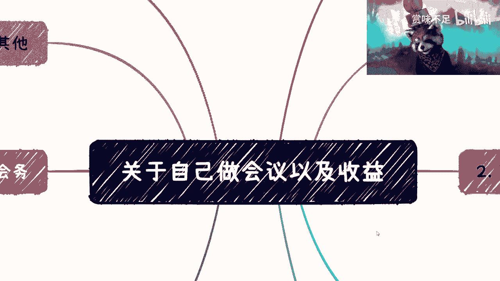

但是也有很多我不回，为什么呢，因为我回头要跟你们说什么叫伸手党啊。

我从一毕业开始，我就很讨厌伸手党啊，别别到我这边来做伸手党。

伸手党我是永远不会回复的，什么意思呢，就是比如说我今天跟你们讲一个事情，我说啊我要讲一个主题，叫做关于自己做会议以及收益对吧，你们把我我会今天讲这么一些内容嘛。

对不对，讲完之后对吧。

比如说你们有些人来问我说啊，这个陈老师这个会是什么，会对吧，会议有什么细节对吧，你这问我干嘛呢，你自己不会去google吗。

对吧啊，这个伸手党真不行。

好我们首先先来看啊，一在哪，一在这首先定一下这边的会议。

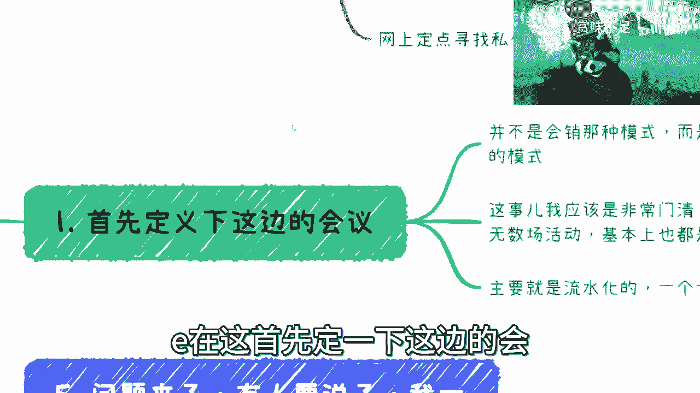

首先并不是会教这种模式啊，而是说我指的是那种多论坛分享啊，就是从上到上午到下午好吧，每个人比如说几个小时也111个小时，45分钟对吧，就是多论坛分享加这种小型展览啊，小心展览这种模式啊。

那么这种呢在这个地方会议呢，我建议大家先从技术会议切入啊，因为技术的相关会议的这个做的门槛也好，包括你们去做很多的这个左手套，右手的工作会比较好做啊，这个回头我待会会讲到的，这是第一点啊。

第二点是呢这个事儿呢我已经非常门清了，为什么呢，因为从我毕业到现在，以我个人名义办的活动无数场啊，无数场活动从小的20多人，大的1000人啊，然后这种大的基本上都是500人以上的啊。

差不多最多来了资源800多人吧，啊因为说是说1000人吧，你总不能对外说一个800人活动吗，没有的，你总会说千人活动嘛，对不对啊，这是第二点，第三点呢就是说呃这个流水化就就就就流程化，主要是流程化的。

就是一个一个往下走就可以了，就这当中不会有太复杂的什么，你说我在这个当中还是要去设设计什么抽奖啊。

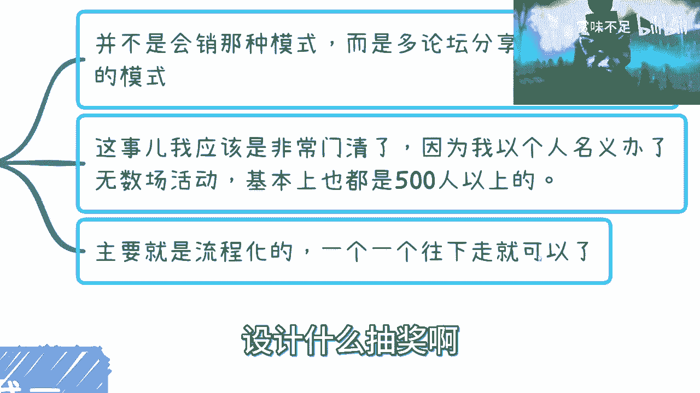

对吧，或者别的东西不用搞太复杂啊，不要搞搞太复杂，因为你去做除了你自己以外。

可能能给你搭搭手的也没几个人对吧，那我觉得你没有必要做的太复杂对吧。

这是第一点啊，第二点的嘉宾怎么来，对不对，我跟你讲这容易的很，我不是一直跟你们说出去多认识认识人嘛对吧，你自己朋友啊，行业专家能说会道的全部all in，什么意思呢，就是说专家这个比如说你的这个会啊。

有十个专家对吧，十个嘉宾啊，你一般嘉宾里面的就是虚虚实实都有的，你不可能说十个人咖位一样的，不现实的，对不对好，那我就跟你说，基本上比如说两个对吧，卡位比较牛逼的啊，然后四个差不多，我看看啊。

对四个差不多是那种就是说一线的对吧，就是这种工作经验比较强的，但是就不太会能说会道的对吧，那还有四个呢就是吹水的对吧，他可能没什么工作经验，但是呢他他很会吹水啊，那么基本上就是这个244比例。

我觉得也差不多啊，然后呢要么哪里来了，要么你就去找企业合作，因为很简单嘛，你就跟企业说，你给你给你的会起一个很牛逼的名字，对不对，什么什么国际峰会对吧，什么什么什么什么论坛对吧，高高什么高端论坛对吧。

都可以啊对吧，然后你就拿这个东西去找企业合作，我跟你讲，企业还是比较吃这一套的啊，比较吃这一套的，他还是会合作的啊，但是就是说前提，你还是得要把这个饼画画的好啊，画的好，而且得要切入一些痛点。

你明白吧啊那么一般是比较喜欢的啊，当然我这个地方说的很清楚啊，就是你事最终得要办对吧，你一开始忽悠忽悠企业，我觉得无所谓了啊，但是你不能说你忽悠了企业，最后是不办，那不行，啊那么这是一个。

那还有呢就公开招募对吧，你就做这个也不用做网站，那个网呃，活动很多平台还是有那种自动生成网站的，你知道吧，就直接给个链接，然后就单页的文配置的这种网站都有的，你就公开招募，上面给个邮箱，对不对。

肯定能找到的，我跟你讲就是就是最多就是这种叫什么，就是质量高不高的问题对吧，还有就是网上定点寻找私信，那也很简单啊对吧，微博啊，这个这个这个叫什么知乎啊对吧，都是百万收入的是吧啊你就找啊啊。

有什么找不到的是吧，这是第二点啊，三呢三呢三诶诶诶诶哦哦哦哦好好。

那又有人要问了，他说好背书怎么来了对吧。

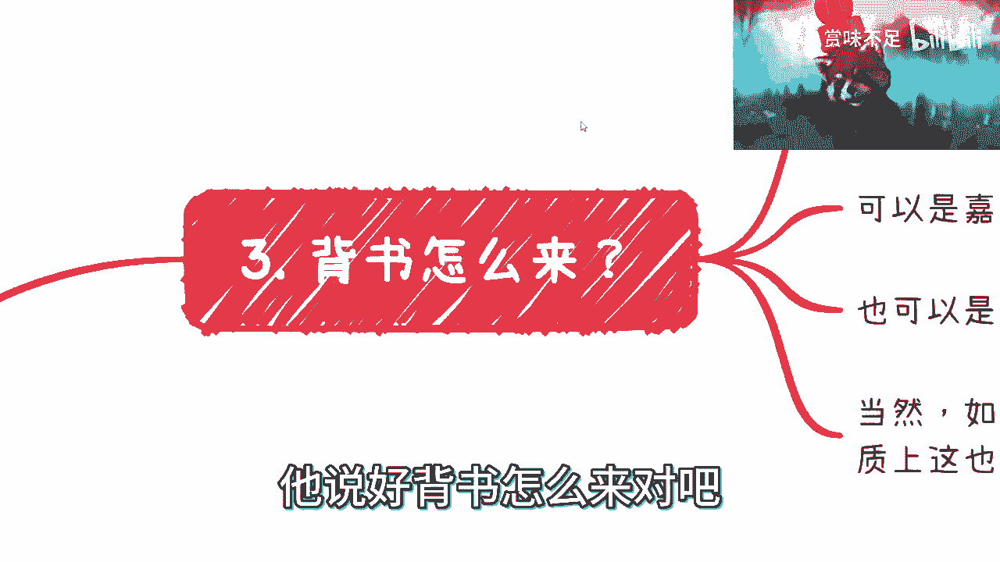

别别激动啊，别激动，慢慢来了，背书怎么来，这事也容易啊，你找政府直接背书是男的，但是找企业背书还是容易的对吧，你比如说咳咳，你下面弄一些什么战略合作对吧，弄一些什么什么呃，指导单位啊。

弄一些什么金牌赞助啊，银牌赞助啊，就很好弄的，有什么不好弄啊，就我就还是那句话嘛，你找企业被收还是容易的，就看你找什么企业对吧，你觉得你想要什么样的level对吧，这是第一点，第二点呢你实在不行的。

你就去找那些嘉宾的企业，这总归比你自己去谈好谈吧对吧，让他们让他们去谈是吧，这是第二点，第三点呢这个你也可以去找我上次提到的对吧，协会商会研究院，因为这种组织是比较一定是比较喜欢，大家来做会的啊。

尤其是你把脏活累活给他做了，你懂吗，RA减这个喜欢的很啊，然后还有一个呢，就是说其实啊你能找到一些区政府背书，那最好，而且其实区政府背书没有你们想象这么难找，为什么呢。

因为所有的地方省市所有的地方区政府，他其实每一年都是有办活动的KPI了，你明白吗，就是说这个时候呢你你的逻辑啊，并不是说你要去拿自己的会跟他合作，而是说你直接跟他说，你想办一个什么会啊，然后你就问他。

你说哎我能不能往你这个KPI上面靠，对不对，那不就也结了吗，而且在这上面我跟你讲是有经费的啊。

我给你们明确说是有经费的，OK吧好吧，然后第四个对吧。

场地怎么来啊，场地怎么来了，我跟你讲，场地一般是这样子的，场地一般你都自己去找啊啊，然后呢可以找找会小二，会小二是一个小程序，你们可以到时候上去找找看我，我一直用的还是蛮好的啊，然后找性价比较高的地方。

但是你一定要自己去看，那当然了，如果来说啊，你的嘉宾里面有一些企业说。

我自己有会议室对吧，比如说两三百人的对吧也行啊对吧，你你你要做的话。

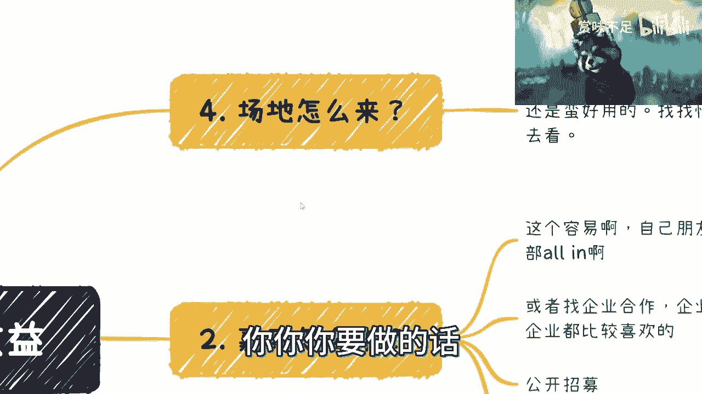

你总不可能跟我一样，一开始做个五六百，这不太现实对吧，你做个两三百人，我觉得还是可以的是吧啊五呢嗯耶啊。

我在这好呃，你看啊，我刚刚跟你们说，不要激动啊，为什么呢，因为你看这个问题不就来了嘛对吧，很多人就要问了，他说呃吕老师啊。

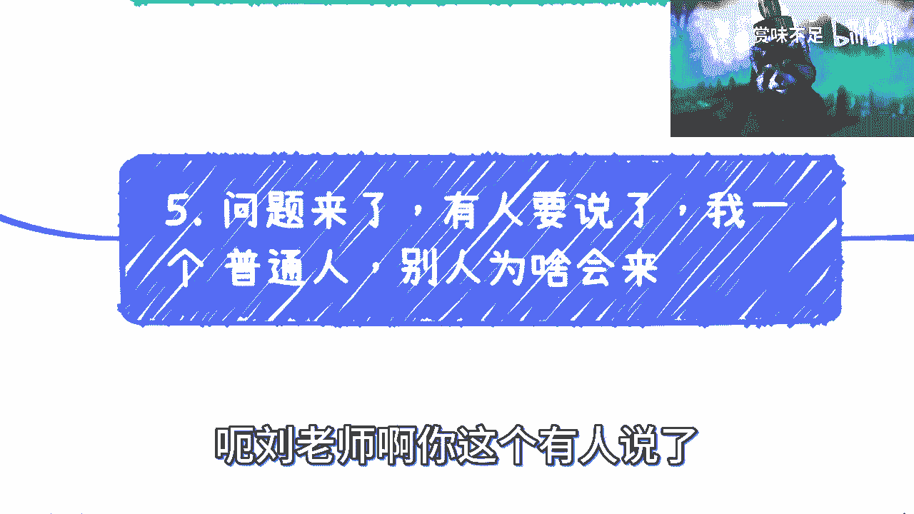

你这个有人要说了，我一个普通人对吧，别人为啥会来了，你看我们刚刚说的啊。

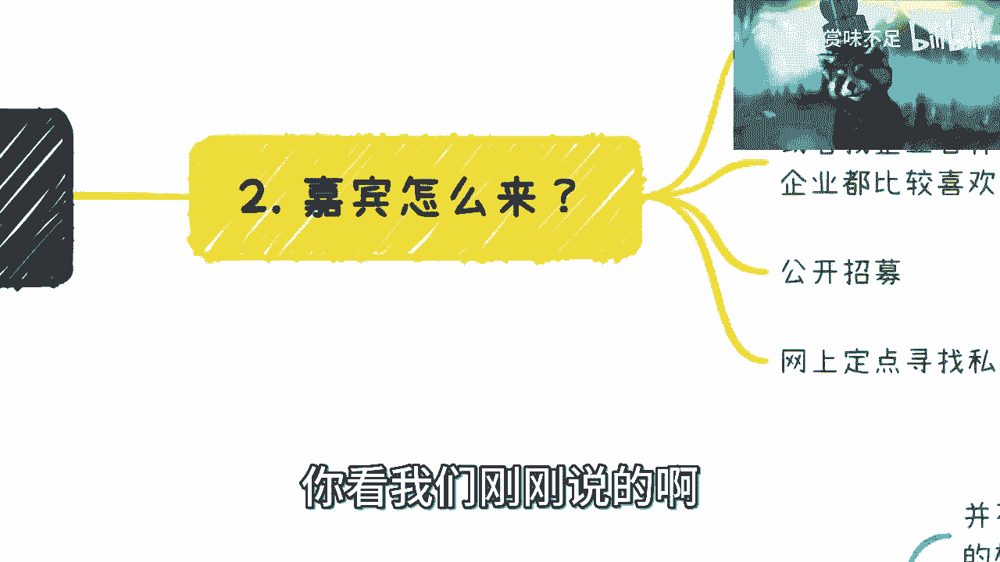

嘉宾怎么来对吧，场地怎么来啊，背书怎么来了，还有就是诶诶啊差不多我啊。

我就写这三个是吧啊对。

那么你看啊有人就要说了，他说我一个普通人，别人为啥来了。

对不对，这个就是我跟你们讲了，这个你就要很完美的运用到左手套右手来了，什么意思呢，就是你所有东西，你会发现这边所有东西其实都是个天平啊，就是你可以用四，先有了四，你去套二对吧，有了二你去套三。

如果有了三，你再去套二，你就是相互套，你这几个里面总有一个你先有的吧对吧，而且我跟你们讲有的是什么意思，不是说你今天就完全确定了，你们没看到过，很多会议上面都是你要你要你要吗对吧，就你邀对不对。

什么叫你要啊，就是我就往上写啊，你管我能不能要得到啊，对不对，对不对，那你就做呗，你就做个海报出来，然后你用这个去套三，用这个去套四对吧，然后三这边有了一些眉目了，你再用三再来回过来套二不就好了吗。

这这这这来回套吗，对不对，这就很简单的事情啊，因为很多东西你要懂啊，就是所谓我一直说左手套右手。

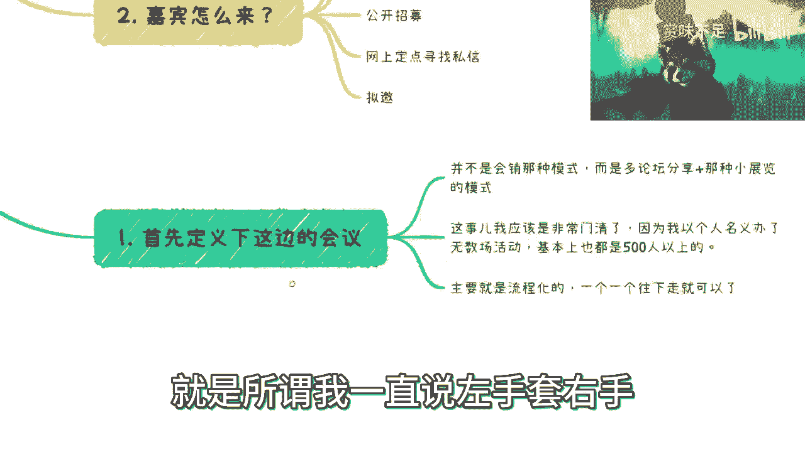

不是让你们去骗，你知道吗，还是说你们要灵活的去掌握，灵活的掌握，就是说商业运作的逻辑。

你知道吗，今天不是说单纯的会议是这样子，你有很多企业合作也是这样子的。

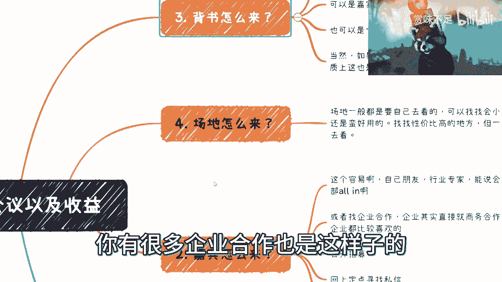

你的目的是什么，你的目的是最重要把这个会办出来，你至于过程当中怎么用。

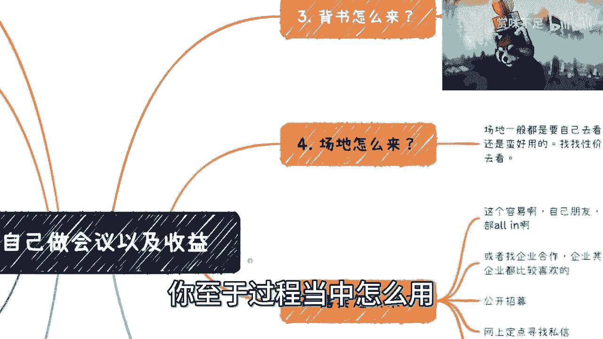

三套二也好，二套四也好，四套三也好，这个三四套二也好，你管你怎么套，我管你怎么套，对不对，你怎么操作，跟我有什么关系，跟我说难听点，跟背书，跟场地跟嘉宾方有什么关系，没有关系。

所有人只关心是你最后能不能做出来。

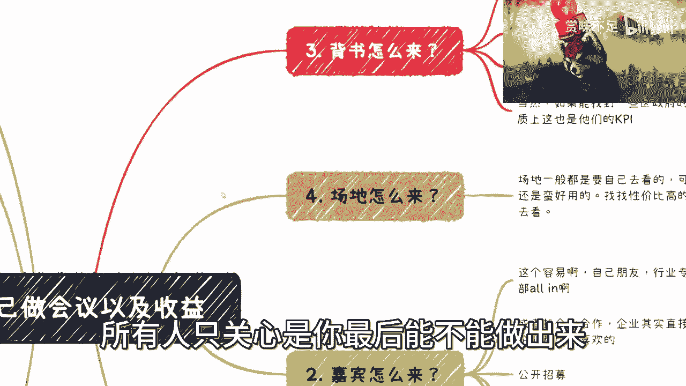

商业商业的逻辑是什么，就是结果导向结束了。

哪他妈这么多废话，对不对啊，然后啊然后是六对吧。

好有人问怎么赚钱对吧，容易啊啊多的很啊对吧，门票视频赞助对吧，门票是一部分，然后你比如说早上弄个弄个什么，因为大家等待开会嘛，等待开会时候总归有个等待时间的嘛对吧，视频赞助啊，你定个时间啊。

定个定个轮播时间，然后给个给个费用，一般的35万12万都可以，22万起步吧对吧，然后礼品在主礼品不是最多的，我跟你讲小玩意儿什么胸针啊对吧，娃娃啊，什么乱七八糟的对吧，多的是礼品赞助。

也可以分label啊，也可以分label，就是比如说有些你比如说以前腾讯赞助，有些玩偶对吧，他说我就只能赞助你五个也行啊，那五个你就抽奖对吧，就是说多的你就人手一个少的你就抽奖，你自己想办法对吧。

灵活灵活操作啊，然后就是金牌银牌铜牌赞助对吧，你给出不同的权益，一般是比如说5000块钱啊，一就一般是5000对吧，比如说2万5万对吧，要么就是1万3万5万，对不对，你这差不多嘛啊，战略合作。

那我这边还是漏了一个啊，TP商业TP看对不对，你比如说你嘉宾嘉宾一天，你比如说十个topic对吧，那你可以空出来两个，你两个呢就是商业征集对吧，你要来讲的你就付钱啊，你也不用多对吧。

你比如说按照你的这个铜牌赞助，比如说是5000的话，那你一个商业top一个差不多1万，对不对，我觉得差不多了呀啊然后如果你还想赚钱来，还可以还可以干嘛呢，颁奖啊，哎呀这个东西不要太牛逼啊。

就是你们自己随便搞个什么奖对吧，联合一些协会弄个什么奖，然后你就跟大家说，你说你们要不要颁这个奖啊对吧，我给你抬头弄大一点是吧，然后然后就比如说一个奖111，你要入围对吧，你先收个1万块钱。

你要颁奖再收个2万块钱，套路多的是是吧啊，我可没说谁这么做啊，就别回头，他妈的，来来来来来来来来喷我啊，嗯对吧，那这个呢有人还要问了，他说要不要会晤啊，我跟你讲，不需要，为什么呢。

因为我以前办个七八百人的会议，我都没要会晤，你们如果只办个两三百人，要毛会晤啊啊我跟你说，其实你可以要，你也可以不要，你要呢就是你花点小钱对吧，无所谓的，因为会晤没几个钱的。

我说的会议不是说要整个大会的会，我我就说你找一些礼仪，找些什么，没有几个钱呐，你知道吗，这第一点第二点是如果不用呢，那你可以让一些你战略合作的企业方出点人，每个企业出几个人，那加起来不就人多了嘛。

对不对，那一般这些人也就是用来卖卖票，送送礼物，那个地方需要些人呢，别的地方其实还好，没什么，你知道吧，那很多人又要说了，他说很严谨的设备要调试的，巴拉巴拉的，我跟你讲，并不是啊，我也给区长办过。

我也给技术人员办过，我什么人我都办过对吧，不同的人你办会的逻辑是不一样的啊，我跟你说，你不要说他妈的流程啊，每个人站在什么地方，几厘米我都要给他算清楚的，我跟你说啊对吧。

你我跟你讲这个东西一般人办不了的啊，然后呢我跟你们讲，就这个东西呢，你们但凡只是做一些技术会或者怎么样。

无所谓的都是可以的啊，不用太拘谨啊。

不用太严肃啊，其他呢就是说那个那个嘉宾差旅要不要报对吧，因为这个东西你就自己看一下这个成本，核算一下利润嘛，对不对啊，核算一下利润成本，那个差旅要不要报，那然后不管要不要报呢，我跟你说。

你给嘉宾的证书啊，包括一些小礼物啊，你该有的还是要有的啊，你不能这些没有这些没有，那人家他妈嘉宾跟你合作一次，第二次就不来了，对不对，谁还来了啊，人家来嘛都是捧个人场对吧，捧个捧个面子的啊。

然后呢说到这儿啊，有一些小伙伴，我相信你们脑子里面已经冒出了一个问题。

就是他说吕老师，你说了半天，我有个问题，他说我怎么知道这个钱我能不能赚得回来对吧，因为这个当中还有个左手套右手的点在哪里呢，就是你会有成本上的付出对吧，比如说这个会议那个会议厅对吧，场地。

然后嘉宾那些东西你会有成本上付出，他说你怎么知道这些东西能赚回来对吧好，我就这么跟你讲啊，会议这个东西啊，就在我的认知里面，你们只要主题切的是一个，相对来讲比较封口的东西，人听上去我不说实际怎么样。

听上去抬头还是可以对吧，然后你找这些企业，我刚刚说的所有东西，这些东西你不用花钱吧，对不对，你找这些企业还不错，那么我给你讲，你甚至都不用门票，就是什么意思呢，你甚至都在没有开门票之前，你单纯靠这些。

你啊就就就就这几个，就是这个赞助，视频赞助和商业topic，这三者你就可以知道你到底能赚多少钱，那你可以先这么做，就是你先去通过右边的我们刚刚说的。

我们刚刚说的右边的这些东西空的对吧。

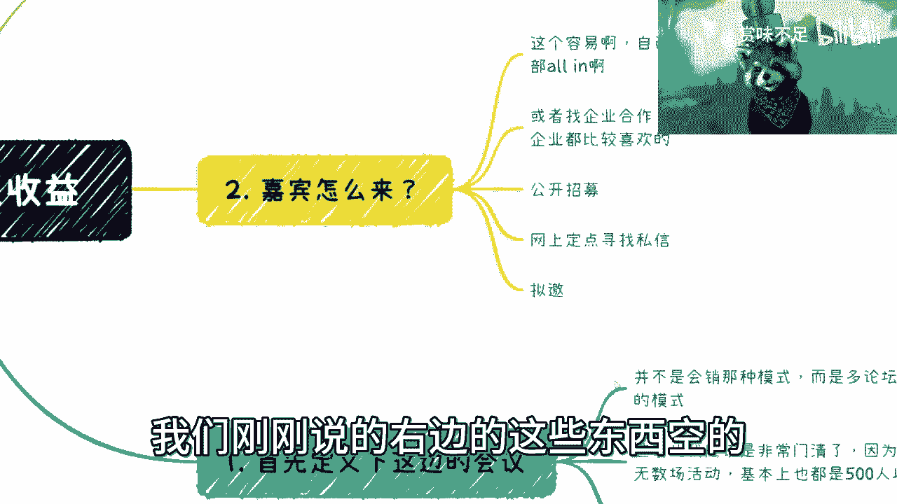

虚拟你要的东西先去套视频赞助，金牌赞助和商业topic，你先去大概估计一下，不是说别人给你打钱啊，这时候别人不会给你打钱的，我跟你讲啊，就是你去评估一下，你在这个地方可能收到多少钱，你评估下来。

你觉得你是能盈利的，好开始往后准备做门票，如果你觉得不能盈利的，OK你就cancel掉，怎么样了呢。

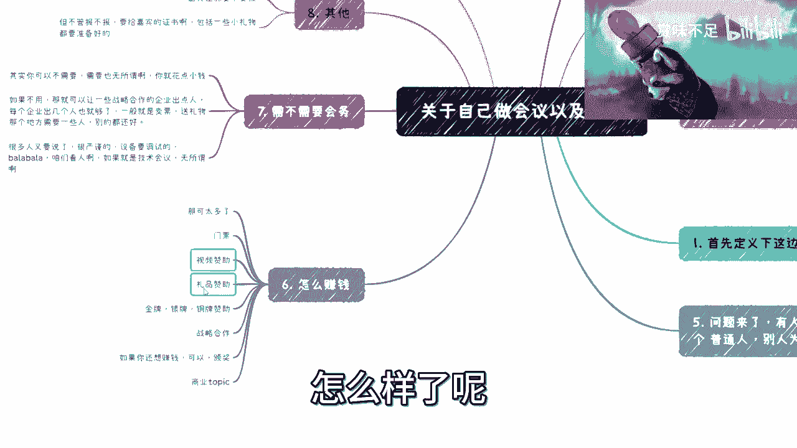

无所谓的呀，对不对，你不做没问题啊，你做了对不起，大家对吧，你你不做又没有问题的，是不是你就跟大家说我有延期，或者我换个时间都可以。

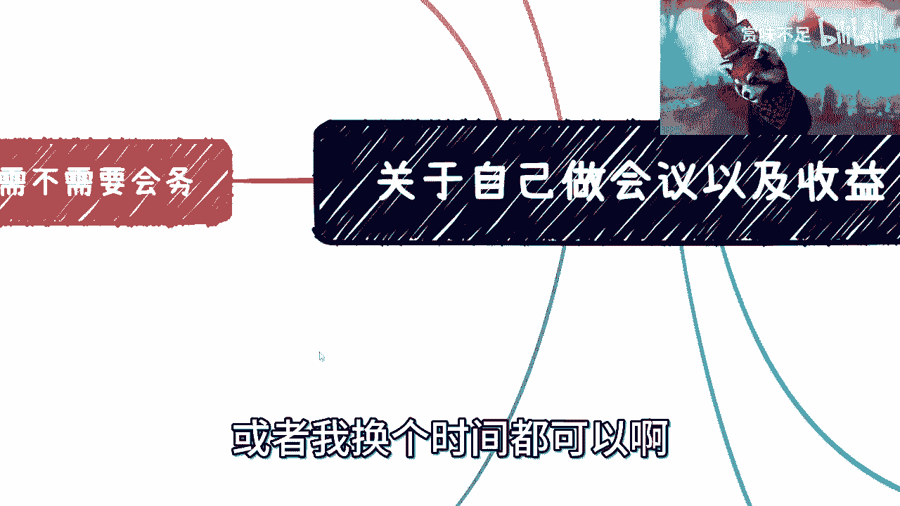

是不是啊，然后呢这个时候又有很多人要问了，他说我为啥要做是吧，我跟你们讲，我跟你们讲为什么要做啊，你们不是一天到晚在问啊，普通人怎么办啊，普通人要什么没什么啊，普通人这个这个吕老师这个视频。

听了你半天对吧，我们也不知道该做什么，我跟你们讲，你们不知道不是不知道该做什么，你们就是不想做，你知道吗啊，我跟你们讲，大部分人不是不知道要做什么，你们知道要做什么，你们只是不想踏出第一步对吧。

不想做啊，然后PV自己自己能力不行对吧，然后做还没做呢，就开始找理由，哎，这样不行，那样不行，我跟你们讲，为什么要做会呀，很简单，做会对你们来讲是一个一本万利的事情，你一可以积累资源。

二可以积累企业资源，三你还可以让很多人认识你，四你还可以把自己的定位拔高，未来是某某某会的创始人对吧，或者某某某club创始人对吧，五你还能赚，在这里面只要做得好，你其实单纯靠一个会，你就能赚很多钱。

你知道吗，六你通过之后会一般啊，我们说一个会前后就会前，会后其实都是有服务的，我给你们举个例子，比如说我以前办会会前我就做培训服务，比如说有两天的培训，我可以再收一笔钱，我会后就做资本的FA服务对吧。

就资本的撮合，那么来了企业他除了来听技术以外，他还会过来说，我想找点融资或者怎么样，一旦能成，我在这个当中就可以拿3%，或者5%的这个FA的服务，对不对，那你们想想看，你办都办了。

你不得把这个会议的利益最大化吗对吧。

所以说呢我只是随便提几点啊，所以说呢我在这个地方只要跟你们讲一下。

一呢没有什么事情是不能做的啊。

你们不要老是普通人，不普通人呢，谁不是普通人啊对吧。

我觉得普通人的点就在于你们作为普通人，就更应该要行动啊。

别老是普通人，A普通人B普通人这样普通人认养，那还搞啥呀，没啥好搞的，对不对，另外就是也别老师就说私信我跟我说啊，这个这个固定一，就是让我给你们一个固定的一个路，或者怎么样子，这我怎么给出来了对吧。

没有的，我为什么说让你们找我咨询，是因为我希望你们给我具体的每个人的背景，每个人的情况，我具体会跟你们来讲哦，你单独给我一个两句话，哎陈老师这个这个这个专业怎么走对吧，这个方向怎么走，我怎么知道。

真不知道对吧，这个我啊我就两句话，我就能给你个建议，那不得了了，那那那照这么说，那我还不如直接路边摆个摊对吧，这个算命来了，靠谱是吧，啊那个行吧，反正先这么着吧好吧，因为今天我去输交所了嘛。

数交所这边聊了很多，所以就就业比较晚啊，比较晚，反正我先给大家补这一期，回头我要给你们补一下，我的所有的这些观点的前提，前提的这个这个视频啊。

