# 课程一：普通人如何从零开始组织一场会议 🎤

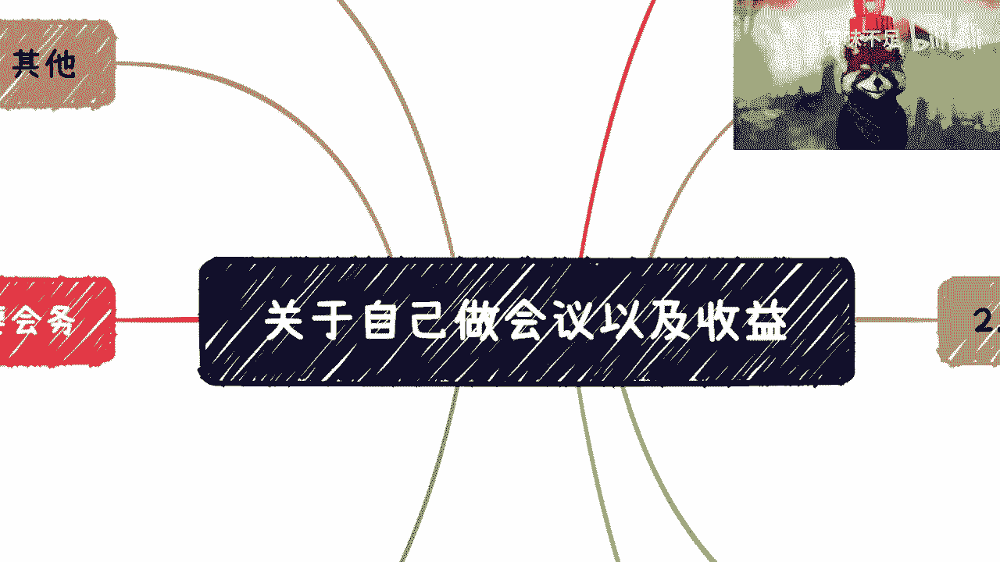

在本节课中，我们将学习如何从零开始，独立组织一场多论坛分享形式的技术会议。课程将涵盖会议的定义、嘉宾邀请、场地选择、资金筹措等核心环节，并介绍“左手套右手”的商业运作逻辑，帮助你理解如何整合资源并实现盈利。


---


## 会议定义与切入点 🎯

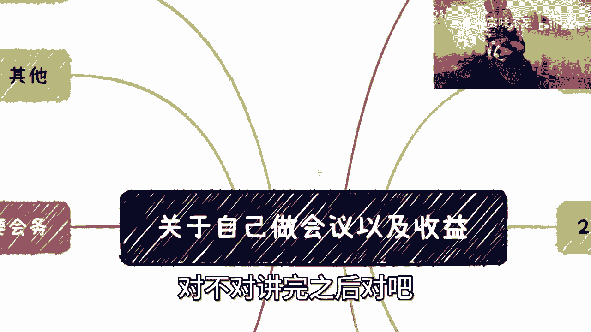


上一节我们介绍了课程概述，本节中我们来看看会议的具体定义和最佳切入点。


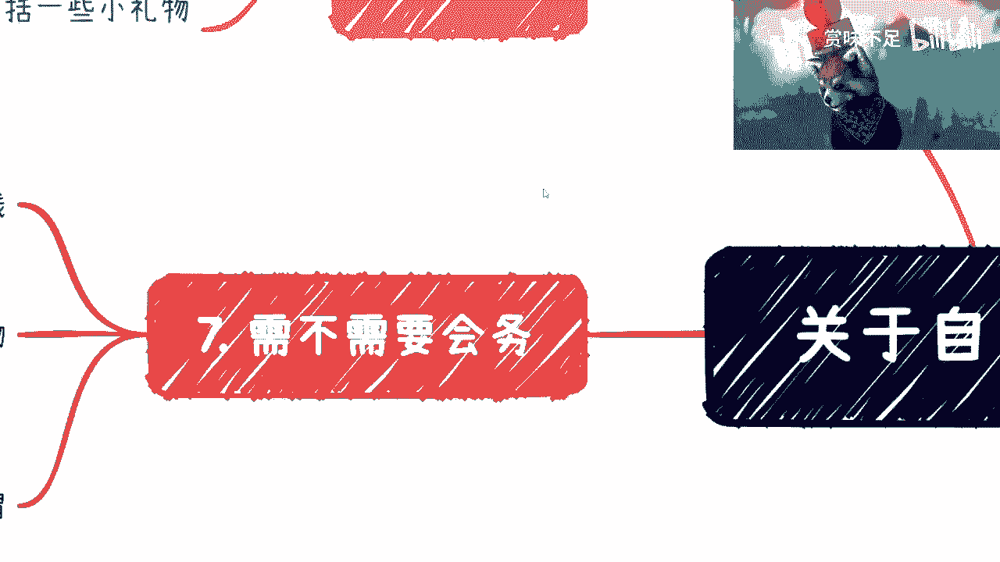


这里所指的会议，并非传统的大型集会，而是指**多论坛分享加小型展览**的模式。会议通常持续一天，从上午到下午，每位嘉宾分享45分钟到1小时。

对于初学者，建议从**技术会议**切入。因为技术会议的主题明确，受众清晰，且相关的资源对接和筹备工作相对更容易操作。

---


## 核心优势与流程化 🏗️


了解了会议的基本形式后，我们来看看组织会议的优势和基本流程。

组织会议这件事我已经非常熟悉。从毕业至今，我以个人名义举办过无数场活动，规模从20多人到上千人不等。其中，500人以上的大型活动也操办过多次。

组织会议的关键在于**流程化**。只要按照步骤一步步推进，过程中不需要设计过于复杂的环节，例如抽奖。尤其当你没有太多帮手时，保持流程简单高效至关重要。

---

## 如何邀请嘉宾 👥


流程确定后，下一个核心问题就是：嘉宾从哪里来？以下是几种有效的邀请方式。

1.  **动用个人网络**：你认识的朋友、行业专家中，肯定有能说会道的人。可以将他们全部纳入考虑范围。一个健康的嘉宾结构通常是“244比例”：2位行业大咖，4位一线实干专家，4位善于表达和分享的讲者。
2.  **寻求企业合作**：为你的会议起一个响亮的名称，例如“XX国际峰会”或“XX高端论坛”。拿着这个方案去与企业洽谈合作，他们通常对此类活动有赞助或参与的意愿。关键在于你能精准切中企业的宣传或业务痛点。
3.  **公开招募与定向邀请**：利用活动发布平台生成报名页面，公开招募讲者。同时，也可以在微博、知乎等平台，定向私信寻找合适的行业人士。

---


## 如何获取会议背书 🏛️

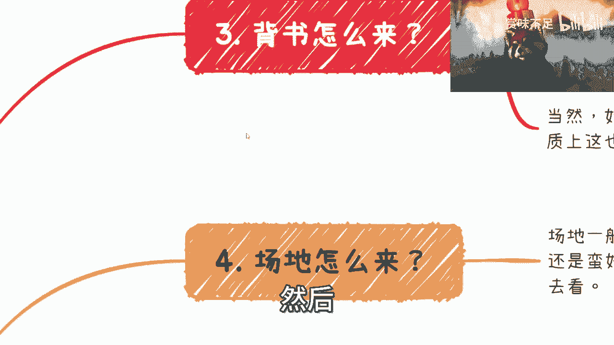

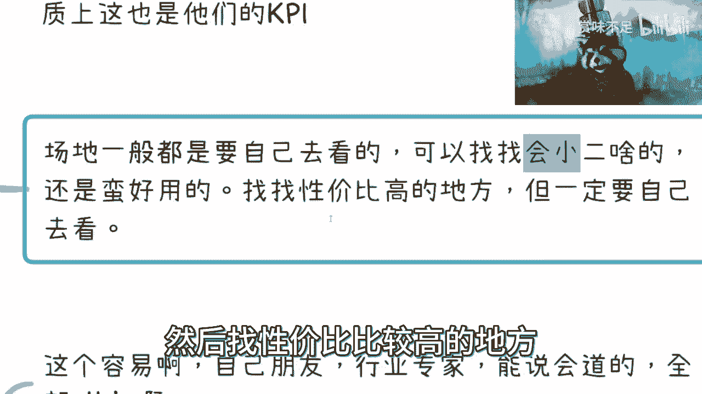

有了嘉宾意向，会议就需要权威背书来增加公信力。获取背书并不像想象中困难。

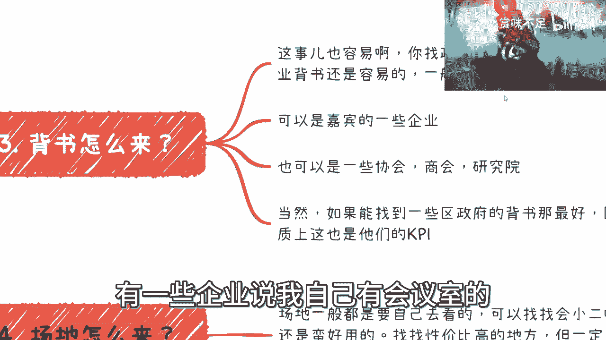


1.  **企业背书**：这是相对容易的方式。可以设置“战略合作单位”、“指导单位”、“金牌/银牌赞助商”等头衔，吸引企业参与并提供背书。
2.  **借助嘉宾资源**：让已确认的嘉宾协助联系其所在企业提供支持，这比你自己去陌生洽谈要容易得多。
3.  **联系协会与商会**：各类行业协会、商会、研究院通常乐于主办或支持行业会议，尤其是当你承担主要执行工作时。
4.  **争取政府支持**：地方区政府每年都有举办活动的KPI指标。你可以主动联系，提出举办某个主题会议，询问是否能纳入他们的工作计划。这种方式甚至可能获得一定的经费支持。


---


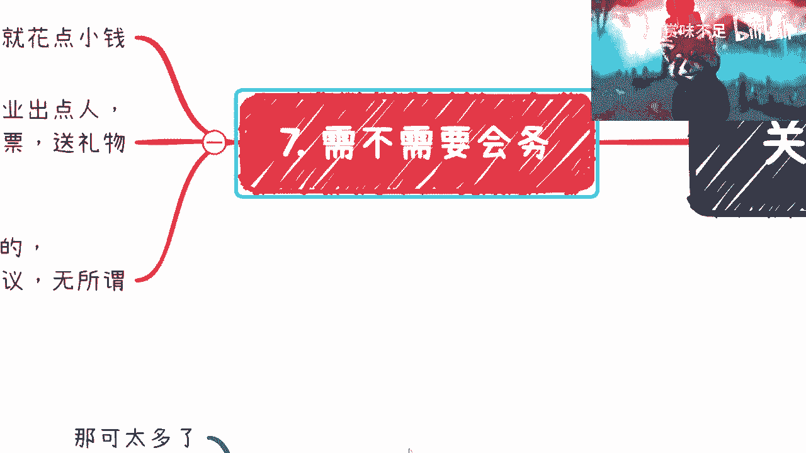

## 如何解决场地问题 📍


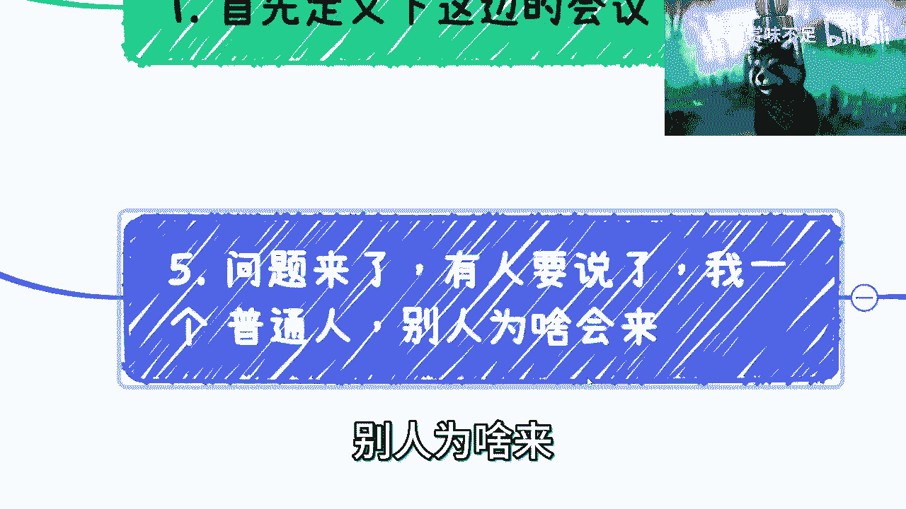

场地是会议落地的基础。寻找场地可以遵循以下方法。

场地通常需要自己寻找。可以使用“会小二”等场地预订平台小程序，寻找性价比较高的场所，但务必实地考察。


如果嘉宾或合作企业自身拥有能容纳两三百人的会议室，也可以优先考虑使用。对于初学者，先从两三百人的中型会议做起更为现实。

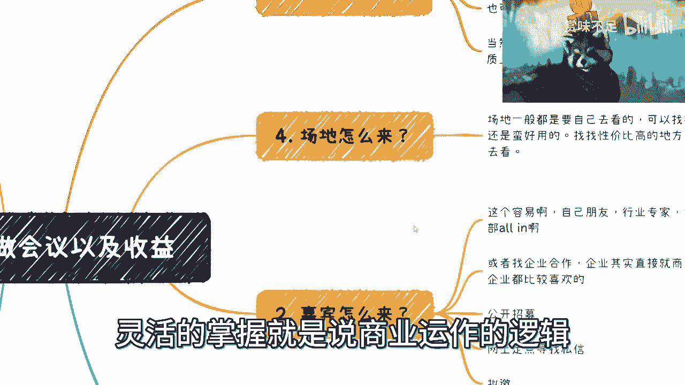


---


## “左手套右手”的资源整合逻辑 🔄


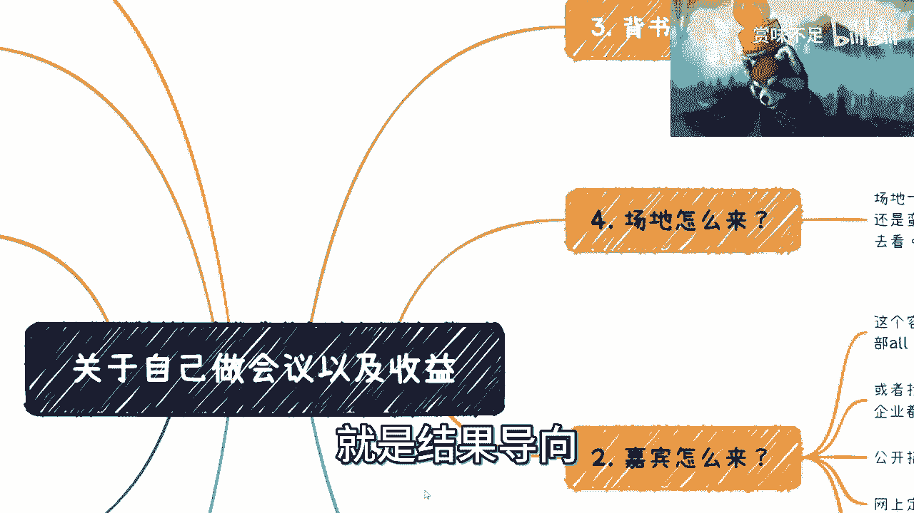

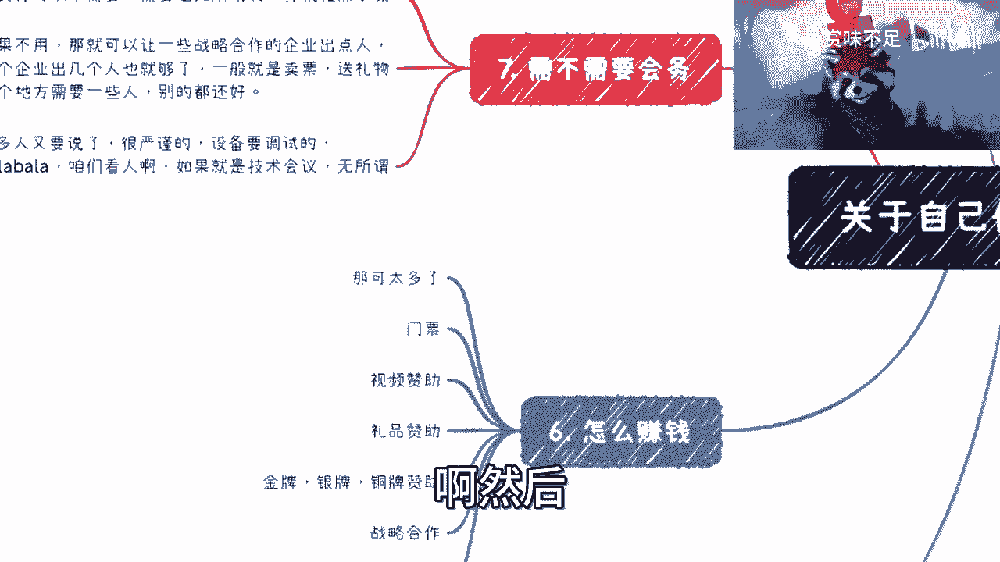

现在你可能会问：我一个普通人，凭什么能让嘉宾、背书、场地这些资源凑到一起？这就是“左手套右手”商业逻辑的应用场景。

**核心公式**：`资源A -> 换取资源B -> 强化资源A -> 获取资源C`

所有资源（嘉宾、背书、场地）构成一个动态平衡的系统。你不需要一开始就拥有全部。例如，你可以先设计一个包含“拟邀”嘉宾的海报，用这个初步方案去争取场地或背书；拿到初步背书后，再用它去吸引更优质的嘉宾。这是一个相互借力、循环推进的过程。

商业运作的本质是**结果导向**。各方最终只关心会议能否成功举办，至于过程中你如何整合资源，只要合法合规，并无限制。你的核心目标就是利用现有的一切，撬动更多的资源，最终把会议办成。

---

## 如何通过会议盈利 💰

会议不仅是资源整合，也可以创造利润。以下是几种主要的盈利方式。

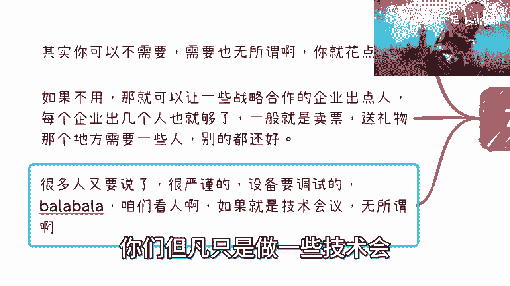

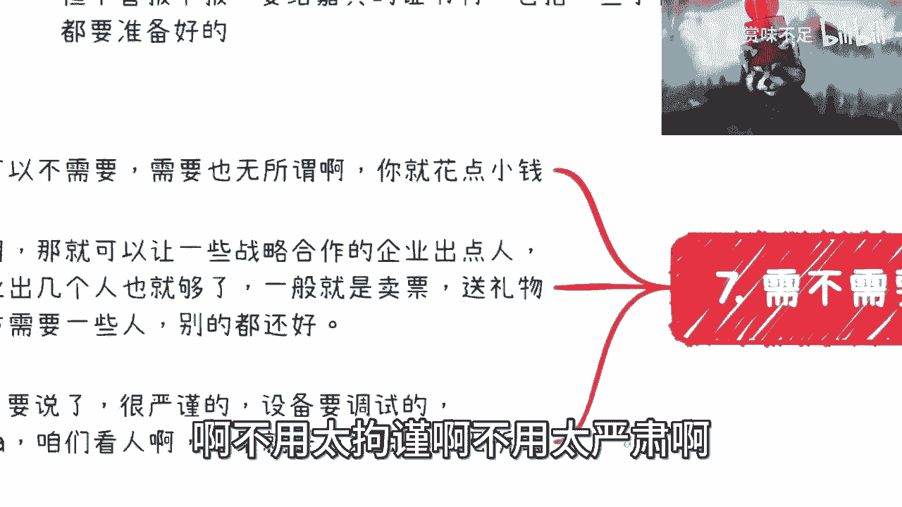

1.  **门票收入**：向参会者销售门票。
2.  **赞助收入**：这是收入的大头，主要包括：
    *   **视频/礼品赞助**：在会前等待时段轮播赞助商视频，或提供现场礼品。费用可从2万元起步。
    *   **分级赞助**：设立金牌、银牌、铜牌等不同级别的赞助商套餐，提供相应的权益（如展位、演讲、logo露出）。价格可设为1万、3万、5万等不同档次。
    *   **商业演讲位（TP）**：在嘉宾演讲日程中，预留1-2个席位进行商业征集，企业付费即可获得演讲机会。
3.  **衍生服务收入**：
    *   **颁奖活动**：联合协会设立行业奖项，向参与评选和获奖的企业收取费用。
    *   **会前培训/会后服务**：在会议前后提供深度培训或资本对接等增值服务（如FA财务顾问服务），从中抽取佣金。

**成本控制提示**：对于两三百人的会议，可以不需要专业会务团队。礼仪、签到等工作可请合作企业派出人员支援，或雇佣临时兼职人员，以控制成本。


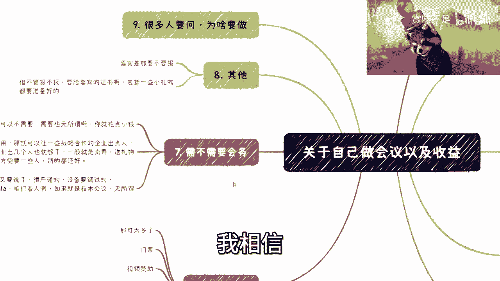

---

## 风险评估与“零成本”启动 🚦

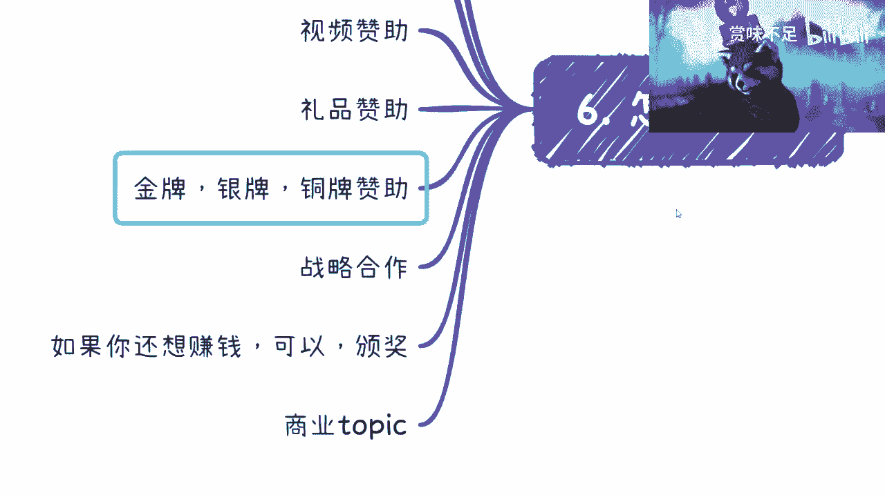

在投入前，如何评估风险并确保不亏钱？关键在于前置验证。


你可以先不预定场地和支付嘉宾费用，而是用虚拟的会议方案（包含拟邀嘉宾和响亮标题）去试探市场，重点洽谈**视频赞助、分级赞助和商业演讲位**。


**评估逻辑**：
```
潜在赞助收入 >= 预估成本（场地、嘉宾差旅等）
```
如果估算的赞助收入能覆盖成本甚至盈利，那么就可以继续推进，开放门票销售。如果估算收入无法覆盖成本，则可以随时宣布会议“延期”或“改期”，避免实际损失。这让你能在几乎零资金风险的情况下验证项目可行性。


---

## 为什么你应该尝试组织会议 ✨

最后，我们来总结一下组织会议能为你个人带来的多重价值。


组织会议是一个“一本万利”的锻炼机会：
1.  **积累人脉资源**：直接接触行业专家和企业决策者。
2.  **提升个人品牌**：“XX会议创始人”的头衔能极大提升你的行业影响力。
3.  **获得直接收益**：一场成功的会议本身就能带来可观的经济回报。
4.  **创造衍生机会**：为后续的培训、咨询、资本对接等业务打开大门。


阻碍大多数人的不是“不知道怎么做”，而是“不愿迈出第一步”。总以“普通人”自居，预设各种困难，是行动的最大障碍。商业世界看重的是结果和行动力。


---


## 总结 📝


本节课中，我们一起学习了如何从零组织一场技术会议。我们从会议的定义切入，逐步拆解了**嘉宾邀请、获取背书、场地选择、盈利模式**等关键环节，并重点阐述了**“左手套右手”** 的资源整合逻辑和**前置验证风险**的方法。记住，组织会议的核心在于流程化执行和商业化的资源运作，这不仅是举办一场活动，更是提升个人能力、积累资源和创造价值的综合实践。