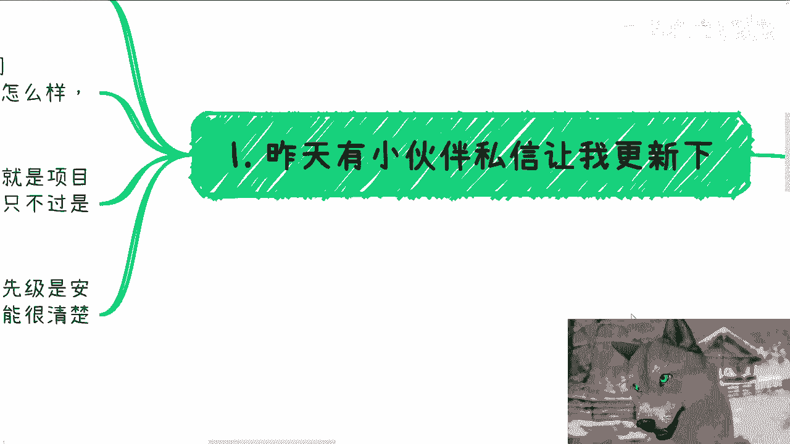
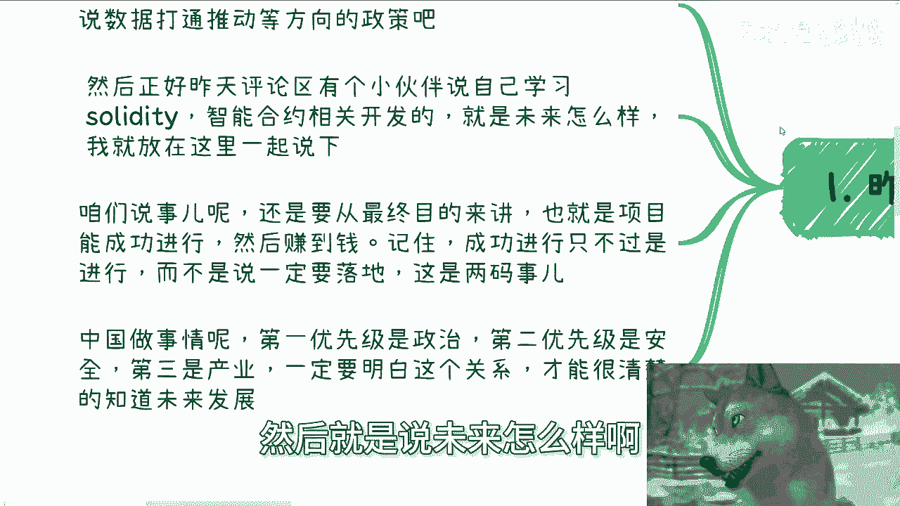
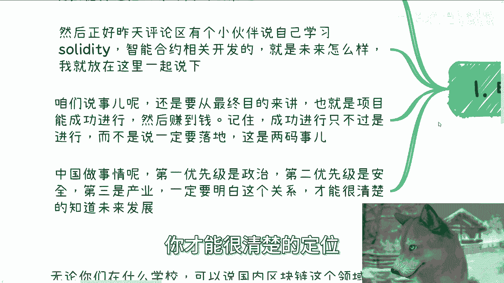

# 我来更新下区块链和web3就业和发展现状 - P1 - 赏味不足 - BV1yG2VYNEgE

好大家好咳，呃，今天呢主要是来跟大家更新一下，这个区块链和web3行业的一个现状，呃怎么说呢，因为有小伙伴提出来，包括昨天评论区也有人提到这个smart contract对吧。

就是智能合约呃，就就就正好再说一下啊，呃首先新的活动已经定了好吧，本月19号就下周六在广州好，那么本次活动呢一方面我会跟大家说一下呃，几以下这么三点啊，第一点是面向不同的企业大厂创业公司。

国央企offer的一些选择，那另外一个呢就是我会跟大家同步一下，最近沟通沟通下来的一些最新的一些信息，包括投资啊，还有一些大方向上面呃，最后呢我会给大家看一下，就是212222021吧。

那个时候跟政府还有高校合作的PPT和这个word，到时候我会直接给你们就打开，给你们看，也咱也不用截图了啊，就一边演示一边解析好吧，要报名和了解详情的，反正可以私信我，啧好。

那我们今天正式开始啊，一第一个呢就是说昨天有小伙伴啊，私信让我更新一下，就是呃他为什么会提到这个问题啊，是因为他最近看到了一些政策，跟一些数据资产相关的，或者跟数据打通啊，数据与共享相关的。

这个方一一方面的一些一些政策，或者一些怎么说呢，一些主要的呃这个推动的方向啊，那么在这里面呢我们就这么说啊，资产化的很多政策呢，目前可能是集中在香港这边，那么数据打通呢，主要还是集中在北上广深这边一线。

或者来说某些试点城市啊，那么然后呢，昨天评论区呢有个小伙伴说，自己学习solidity啊，那么呃当然可能很多人第一次听到这个词儿啊，但无所谓啊，索尼DITY是智能合约的一个这个编程语言啊。

那么智能合约相关的一个开发啊，然后就是说未来怎么样啊。

那么我就放在这边一起说啊，首先啊咱做任何一件事情，判断任何一件事情，说任何一件事情，我们都要基于呃既有的这个世界观啊，既有的社会观，既有的一些呃怎么说呢，国情啊来说问题，我们不能从我们自己角度。

或者单纯的从资本家或者嗯怎么说呢，政治家或者相关的一些角度去看都没有用啊，我们做任何的选择，得要从一个这个最基本盘去看，那基本盘是什么呢，就是首先咱要从最终目标来讲，也就是项目能成功进行，然后赚到钱啊。

记住成功项目成功进行即可啊，项目成功进行，只不过是进行，而不是说一定要落地啊，这是两码事，这就好像今天晚上有位小伙伴跟我咨询的时候，就跟我说，他说他想把事情做好做大，我说做好做大跟赚钱没有因果关系。

一点因果关系都没有啊，好那么那么第二就像我们刚刚说的这个基本盘，中国做事情啊，记住啊，第一优先级是政治，第二优先级是安全啊，那么我扩展一下，第一优先级是政治正确，第二优先级呢是安全稳定。

第三是赋能产业啊，记住永远值这三点，不会不永远不会变的啊，那么一定要明白这三点的关系，你才能很清楚的定位清楚你到底能做什么。

以及未来怎么发展啊，记住还是那句话啊，记住一点。

不管是在中国还是在别的国家呃，产业社会行业啊，包括政府就不是围着你转的，也不是围着我转的，你自己怎么想，我怎么想，以及你所谓认识一些大佬怎么想，没吊用啊，第二比如说最近啊数据要素。

还有数据这个共享这件事情啊，其实很简单啊，我们要明白两点，第一这类政策的目的是什么，然后在各个城市会怎么进行推进，第二和我们的关系又是什么，也就是说跟我们这种老百姓有什么关系，跟我们手上掌握技术。

比如说你是会写solidity，还是会写AVM对吧，那么等相关的。

那么我们的这个机会在什么地方啊，好那么这样我们看这个逻辑啊。

很简单，就是中央从来都是发号施令，讲口号的啊，而各地方政府落地的时候，面对最直接的两个问题是什么，第一钱从哪来，第二落在什么产业，对不对，你们想想看，如果你们是地方政府，你们是地方领导，也只考虑这两队。

你们考别的考虑吗，不考虑的对吧啊，第一钱从哪来，第二落什么产业，为什么落这个产业，对不对，好，那么接下来的发展就是进行相关试点，近几年各地方财政都不乏呃，都不好，大家也都知道啊，所以你指望政府给很多钱。

那是不可能的，中央会告诉你，我们就这点预算，你们自己看着办对吧，那么既然是试点，各地方一定会去寻找自己熟悉的团队，和相关产业去进行试点，对不对，那你今天这个屁股坐在这个地方，你也会这么做啊。

比如说你是做农业的，你总不可能说好，我他妈农业不做了，我去做，我去做天文，我去做他妈的那个叫什么航空，不会的呀，对不对啊，那么也就是说，至少短期内和我们作为老百姓的关系不大，那么有的人要说长期了好。

我们就来说长期啊，数据要素也好，区块链也罢，基本上业务他就没有面向个C端的，你自己跟我说说，看目前有哪个东西，区块链项目，除了他妈的诈骗啊，除了那个募资以外对吧，这两个中国都是不允许的，对不对，好。

除了这两个东西以外，哪个东西面向C端，数据要素就更别说了，没有面向最短的都是面向政务跟企业的。

咳咳也就是说嗯就算长期来讲，也跟普通老百姓关系不大啊，也就是说就算有机会也落不到你我头上啊，那么所以如果你的切入点是要从打工的话，那么不好意思，打工的人太多了，你没啥好卷的。

在区块链跟web3这个行业里面，狼更加多，肉更加少。

仅此而已，对吧啊，那么第三再说说智能合约这个技术啊，就如我一开始说的，政治正确的为第一安全稳定为第二。

产业赋能为第三，什么意思啊，意思就是说你国内要落地，你是首先需要去看是否符合中央的精神跟政策，然后是否具有安全性，以及这个安全性是否能够保障，或者这个技术能够推动我们产业的发展。

如果这三个当中只要有一个不满足，你不要指望它会发展，不会的，不可能的啊，那么在这里面，在web3里面啊，在decentralized就是去中心化里面的数据安全，往往是通过去中心化的技术。

或者说纯技术来保障的啊，而不是通过中央呃，中央这边的一些技术，或者央央国企或者国密这种东西来保障的，什么意思呢，意思就是说什么啊，我这边打错了啊，比如说意思就是说什么边缘计算啊，什么零知识证明啊。

那都是技术领域，或者说即刻权，或者说decentralized去中心化生态里面说的事情，在中国这个国情下面本质上是不存在的，为什么，因为中国不可能去中心化，对不对啊，那么中国有中国的特色。

就是我们说的联盟链，当然你们不懂联盟链是什么也无所谓啊，但是我就告诉你们，在联盟链里面保证安全的是公司主体，保证安全的是国央企。

是领导啊，是是是怎么说呢，是政治地位和和资本地位，而不是技术啊，这个就是国情，所以说你要通过技术来保障，本身是不符合国情发展啊，技术是辅助你记住啊，那么再说说这位小伙伴小呃，这位小伙伴在评论区跟我说的。

remote工作的事情啊，web3到现在为止其实也低迷了很久啊，岗位呢也远远没有以前那么多了，同时呃能做智能合约的人呢反而是暴涨了很多，这么多年啊。

所以你要单纯想做个remote呢，其实也很难，就是我们说的狼多，head account少对吧，那么再说一下国内啊，国内你就更别说了，几乎没有要用到智能合约的地方，至少现在很少。

而且在我可预见的两到3年里面，甚至四到5年里面也会很少，那么无论相关专业还是相关岗位，找工作本身就很困难，这个是客观事实，这不是说啊，你说你这个智能合约学的好不好，你学的再好没卵用啊。

咳咳对不对，好，那么这个是三啊。

那么我们接下来就说四啊，我总体说一下就业情况跟未来发展啊，呃记住啊，无论你们的老师或者身边人，跟你们说的多么的天花乱坠，国内企业基本上就是区块链这个相关的企业，或web3相关的基本上就是全面啊。

你不要跟我说哎呀某某某公司还活着啊，他妈的怎么样怎么样啊，我就这么跟你们讲啊，就是活着的这些啊，你们我我也不指名道姓了啊，活着这些做他妈什么业务的，你们自己去看看，他妈心里没点逼数吗。

啊全部基本上以前都是做他妈的海外资金盘啊，做他妈的国内国内这种就是半半诈骗，半半忽悠的项目起来的，哪来的实际落地啊，啊也就是说如果是这个专业或者相关专业的，如果你还想走就业这条路。

我可以现在就跟你说宣告死路啊，宣告死亡就这么简单啊，当然你你还有条方法，就是什么出出国国内你不要想对吧，说白了你给C端培训也好，给高校做也好，给企业做，给政府做，这都是我们以前做过的路。

我们以前走过的路，这个时期已经过掉了，这个风口已经过掉了，未来已经不可能再有这种机会了啊，但是你说完全没有吧，那也不是，但就如我说的各个地方落数据啊，落共享啊，产业赋能啊，他还是能跟区块链挂钩的。

但这个东西不是跟你们的技术，不是跟你们的学历，不是跟你们的专业有关，这是需要你们去供个关系的啊，而不是说他妈的找个工作对吧，你除此以外，除了我们说在to b to g就高校这种上面。

你你如果是相关专业的，你根本赚不到钱，你要么就是他妈的转行呃，叫什么跨赛道对吧，所以我希望大家能明白国家一些政策，有一些政策是用来喊口号的，有一些政策就是要用用来外用，用来完成KPI的。

说白了能不能落地，那是未来的事情，无论能落也好，不能落也好，政治正确跟那个叫什么安全稳定，他是不可能去to c的啊，你告诉我哪个项目政治正确，安全稳定是to c的，你怎么to c。

对吧，你政治正确跟安全稳定都是先从机构端，国药国央企先做对吧，比如说各地方产业产业园先做对吧，各地方什么呃，呃比如说ba at对吧啊阿里百度腾讯先做，你怎么先从大的去做的，你大的都还没有起来。

到现在为止，整个生态都还没有起来，你怎么to c呢，你不to c老百姓怎么赚钱啊，你你跟我说，你去Q个BQ个G那我就说了，你得去打关系，这关系没这么好打，对不对，那最后最后再来说一下web3这个发展啊。

web3本身肯定会有发展，这点我是相信的，但会逐渐小众化，为什么，因为这么多年以来web3生态就没有起来哦，就没有起来啊，我我我我个人是觉得我也不认为未来会起来哦，就算我们就退1万步来讲。

就算未来真的大面积招了，你们去看好了，也是为了资金盘，为了传销盘，为了收割而收割去找平的，而不是为了发展去找平的啊，但无论怎么说，国内本身你们记住啊，国内是没有web3的，不要他妈的再幻想了。

国内没有web3的啊，你们去看一下北京啊，北京发的白皮书上面写的很清楚，叫中国web3。0啊，跟区块链这边说的。

我F3他妈压根不是一件事啊，如果你真的要发展，我告诉你真的要赚钱，请出国，我就这三个字啊，能明白吧，好吧，所以说就是说这个东西呢，说实话就是整个的一个完整的生命周期，基本上已经过了啊。

有没有机会有，我就告诉你们上周啊，这个上海某一个区我也不好说啊，某个区的这个区政府也找我谈过啊，但是我告诉你们，项目资金很少很少比我们以前可能少，甚至少一个零哦，可能还多一点，就少少一个零还多一点。

反正你们自己看着办，就是我我不能一刀切给你们打死，说你们没机会，但是如果你们想走就业难上加难，左右为难啊，行吧啊，那这个东西我反正也跟你们同步过了，现在就这个样子。

总结来讲就是一潭死水，好吧嗯行吧，那就这么着吧，然后19号广州活动好吧，要报名的继续报名呃，然后剩下的话就直接规划啊，商业规划，职业上面就工作规划，商业上面呢就是你们自己做副业啊，赚钱啊对吧。

做些别的相关东西啊，你们希望通过跟我的沟通，能够让你们啊就是嗯嗯这个少走更多的弯路，或者说让你们能够更的规划，更接地气的话，那么你们可以整理好对应的个人问题。

跟个人背景好吧。