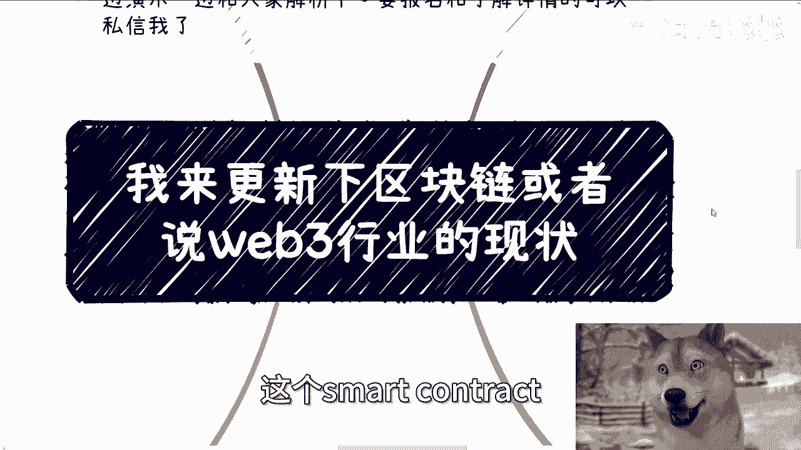

# 我来更新下区块链和web3就业和发展现状---P1---赏味不足---BV1yG2VYNEgE_no

在本节课中，我们将学习区块链与Web3行业当前的就业与发展现状。课程将基于国情与行业基本盘，分析政策、技术方向与个人机会，帮助你建立清晰的行业认知。

---

## 概述

本次更新主要回应观众关于智能合约（Smart Contract）和行业现状的疑问。课程将涵盖政策解读、技术定位、就业市场分析以及个人发展建议。

---

## 政策与数据资产现状

上一节我们介绍了课程概述，本节中我们来看看当前的政策环境。

有观众注意到近期与数据资产化、数据共享相关的政策动向。这些政策主要呈现两个方向：资产化政策目前多集中于香港；数据打通与共享则主要在北京、上海、广州、深圳等一线城市或试点城市推进。

---

## 行业基本盘：三个核心优先级

要理解行业机会，必须首先理解在中国行事的基本逻辑。这个基本盘由三个不可动摇的优先级构成：

1.  **第一优先级：政治正确**。所有行动必须符合中央精神和政策方向。
2.  **第二优先级：安全稳定**。任何发展都不能以牺牲安全与稳定为代价。
3.  **第三优先级：赋能产业**。技术最终要服务于实体产业的发展。

**记住公式：项目成功 != 项目落地**。项目能够推进并获得资金支持，与项目最终能否成功落地是两回事。做好做大与赚钱之间没有必然的因果关系。

社会与行业并非围绕个人意愿运转。个人的想法、甚至所谓“大佬”的看法，在宏观趋势面前作用有限。

---

## 政策逻辑与个人机会分析

基于上述基本盘，我们来分析数据要素等政策与普通人的关系。

政策的落地逻辑很清晰：中央定调，地方执行。地方政府面临两个最直接的问题：**钱从哪来？落在什么产业？**

近年来地方财政普遍紧张，因此试点项目预算有限。地方政府倾向于选择自己熟悉的团队和产业进行试点。这意味着，**短期内，这些国家级政策与普通技术从业者的直接关联不大**。

从长期看，区块链与数据要素业务几乎都面向机构端（B端）或政府端（G端），而非消费者端（C端）。因此，即使长期有机会，也大多与掌握特定资源或关系的群体相关，普通技术人员很难直接受益。

如果你想以“打工”身份切入，那么这个行业现状是：**岗位少，竞争激烈**。

---

## 智能合约技术的国情适配性

有观众提到正在学习Solidity（智能合约编程语言）。本节我们专门分析这项技术在中国的定位。

再次强调三个优先级：政治正确 > 安全稳定 > 产业赋能。任何技术在国内要发展，必须同时满足这三点。

在Web3的去中心化（Decentralized）生态中，数据安全往往依靠**纯技术**保障，例如零知识证明、边缘计算等。但在中国，**保证安全的核心是公司主体、国央企、政治与资本地位，技术只是辅助手段**。

因此，完全依赖技术保障安全的去中心化模式，与国情存在根本性差异。中国的特色路径是**联盟链**。

关于远程（Remote）工作机会：目前Web3行业整体低迷，岗位减少，但会智能合约开发的人才却大量增加，竞争异常激烈。

在国内市场，**几乎很少有项目需要用到智能合约**。这种状况在未来数年内可能都难以改变。因此，仅凭智能合约开发技能在国内找工作非常困难。

---

## 就业情况与未来发展总览

以下是当前区块链/Web3领域的就业与未来展望：

无论他人如何描绘前景，国内区块链相关企业现状基本是全面的收缩。现存的公司，其早期业务多与海外资金盘或带有忽悠性质的项目相关，缺乏扎实的落地应用。

**对于相关专业的应届生或求职者，如果坚持在国内走技术就业路线，前景非常黯淡**。此前面向C端培训、高校合作、企业及政府服务的机会窗口已经关闭。

未来的机会点可能在于地方的数据共享与产业赋能项目，并能与区块链概念挂钩。但这**不取决于你的技术或学历，而取决于你整合资源与疏通关系的能力**。

除了面向B端或G端的业务，相关专业者很难赚钱，出路要么是彻底转行，要么是跨赛道发展。

需要明白，有些政策用于喊口号和完成KPI，能否落地是后话。但政治正确与安全稳定这两条，决定了相关业务必然从机构端（国央企、产业园、互联网大厂）开始，而非直接面向C端。在大的生态尚未建立起来前，普通人很难从中获利。

---

## Web3的发展与个人出路

最后，我们来谈谈Web3本身。

Web3技术本身会有发展，但趋势是**逐渐小众化**。多年来，Web3的大众生态并未真正建立，我个人认为未来也难以实现。

即便未来出现招聘热潮，其目的很可能也是为了资金盘、传销盘等收割性项目，而非为了真正的技术发展。

**最关键的一点：国内没有西方语境下的Web3**。北京发布的“中国Web3.0”白皮书，与国际上的Web3概念不是一回事。

**如果真的想在这个领域寻求发展与赚钱，请考虑出国**。这是最直接的出路。

整个行业的完整生命周期高峰期已过。虽然上周仍有上海某区政府找我洽谈项目，但资金规模相比过去大幅缩水（可能少一个零甚至更多）。机会不是完全没有，但想通过就业入行，难上加难。

总结来说，当前国内区块链/Web3的就业市场可谓**一潭死水**。

---

## 总结

本节课中我们一起学习了区块链与Web3行业的现状。核心要点包括：
1.  理解中国行事的三个核心优先级：**政治正确、安全稳定、产业赋能**。
2.  认识到当前政策与个人技术从业者**直接关联度低**，且业务多面向B端/G端。
3.  明白**智能合约**等技术在国内缺乏应用土壤，就业机会稀少。
4.  看清国内Web3就业市场萎缩的现状，以及**出国**可能是更现实的发展路径。
5.  意识到未来的机会更依赖于**资源整合与关系**，而非单纯的技术能力。

希望本课程能帮助你更接地气地规划职业与商业路径，少走弯路。如有具体个人问题，可整理好个人背景后进行进一步咨询。

---
**课程预告**：本月19日（周六）将在广州举办线下活动，内容将涉及不同企业类型（大厂、创业公司、国央企）的Offer选择、行业最新信息同步，并展示以往与政府、高校合作的项目资料。详情可私信了解。