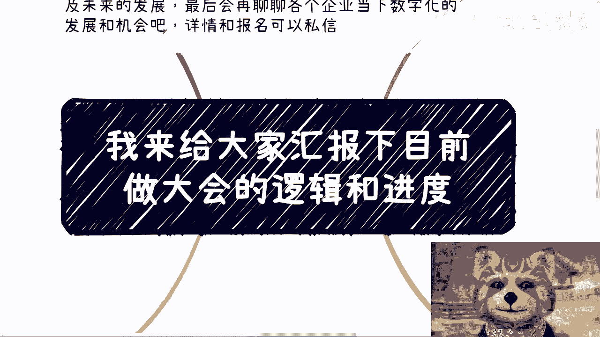
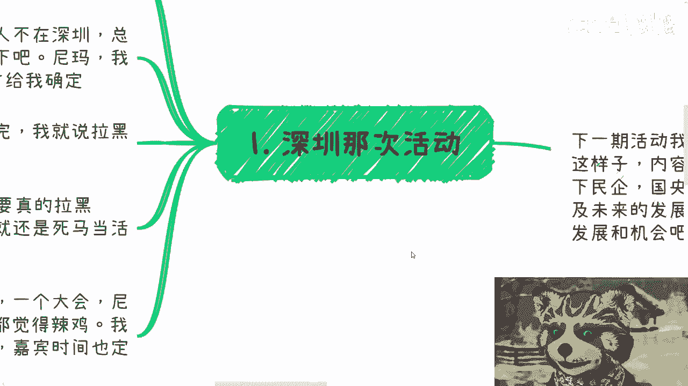
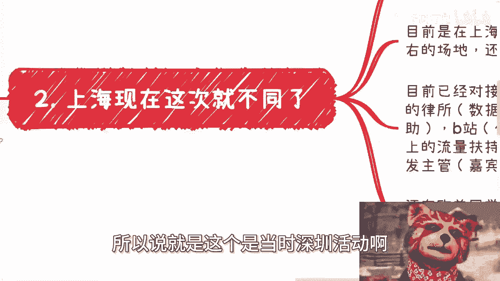
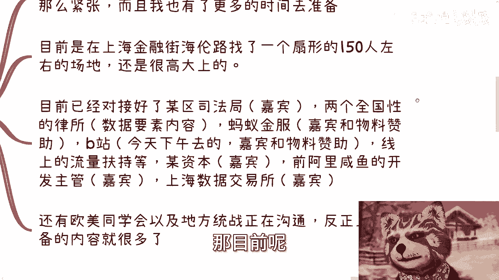
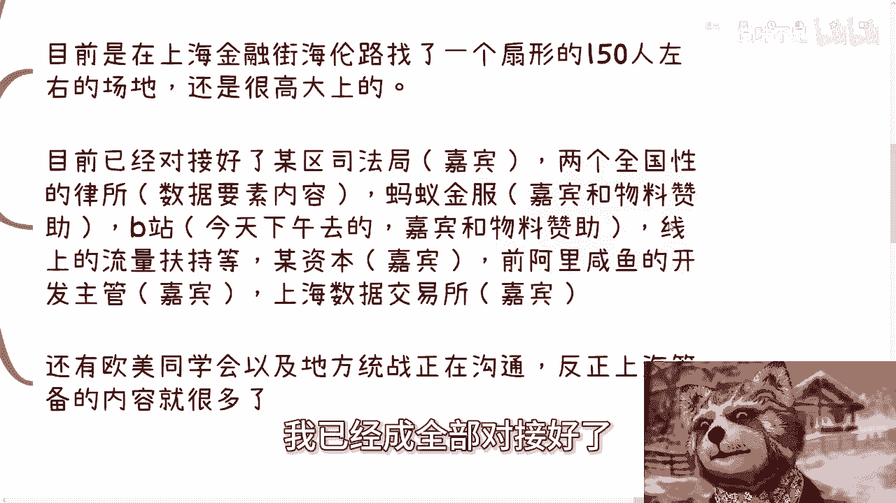
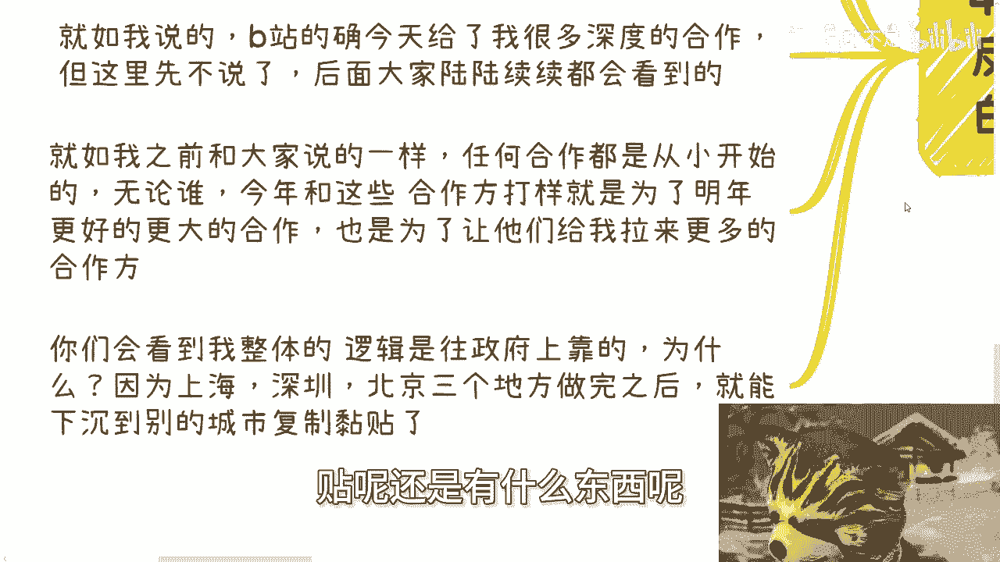
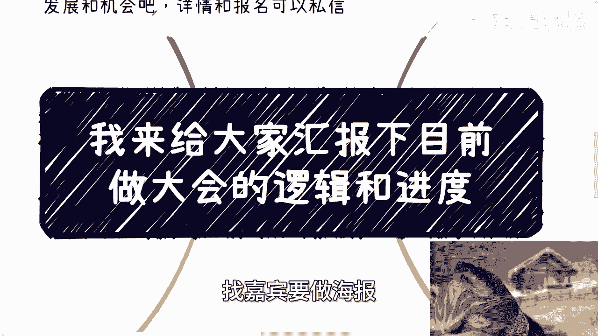
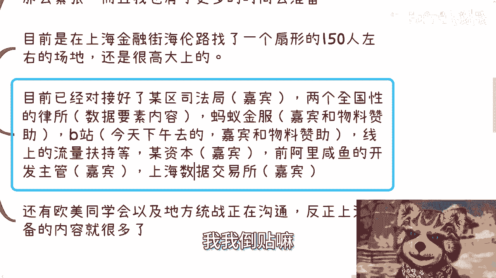

# 我来给大家汇报下目前做大会的逻辑和进度 - P1 - 赏味不足 - BV1Ai421Y7q5

哦大家好啊，各位老板好啊，我来给大家汇报一下，目前这个做大会的逻辑跟进度啊对吧，真的我跟你们讲，你们听完你们就知道了，就就跟我之前跟你们讲的一样对吧，就是就我我我跟你们讲。

就所有的这些东西我没啥好藏着掖着的对吧，就是我落地怎么执行，我以前就是跟你们怎么讲的对吧，然后我现在怎么做，就是以前跟你们怎么讲的，就就这么个东西啊，呃首先我先说一下，下期活动我已经定了对吧。

就是后天啊7月13号在南京，下午一点到六点，然后内容主题我也定了，一个是低空经济啊，一个是分析一下民企国央企，咳咳咳，那个大厂额外企当下的这个入职的优缺点，以及未来的一些发展啊。

最后会聊聊各个企业当下数字化的发展跟机会，好吧，然后详情跟报名呃，继续私信我，反正现在场地也大啊，额今天我去了一下B站对吧，给你们看一下照片对吧，这个唉反正也没啥。

首先呢我们先来讲一下啊，深圳那次活动啊对吧，深圳上一次是6月30号啊。

当时参加或者说看视频的小伙伴呢，肯定也听到我骂娘了，为什么呢，因为我当时那个合作方啊，因为我人毕竟不在深圳嘛，我在上海嘛啊，那总归要去看一下场地啊，去见一下跟场地方见一下面啊对吧，要要搞一下关系嘛对吧。

那我操，我跟你们这么讲吧，他当时跟我说4号就能够确定场地的啊，那么我说4号确定场地，那就那个交交交钱嘛对吧，怎么样啊，然后最终啊你想想看啊，6月30号开会。

就整整比我当时答应我的那个时间要晚了，将近两个礼拜啊，我跟你讲，真的不夸张，我当时电话跟他吵完，我就说他妈拉黑吧，我说我说这种人，这种人他妈的合作还怎么合作啊，啊我说一天到晚给我拖拖拖拖拖。

拖到后面怎么搞对吧，那当然了啊，话是这么说啊，但是呃就是30号那个会议，因为早就定了嘛对吧，那么你说我要真的拉黑吧，我这场地也停不下来啊，我我再去找别的，你问题也很多。

所以最后呢还是死马当活马医了啊，所以那次呢我就跟你们讲啊，就是6月30号深圳那个会啊，是真的非常的仓促，你们想想看一个大会，尼玛他妈报名他妈大概就十分十天不到，卧槽我跟你们讲。

我妈我我他妈做大会做做这么多期，从来没有这样子过啊，就我都觉得垃圾啊，我其实是很想推迟的，但是呢我那那两天我纠结了很久，为什么，因为你们想想看啊，我一旦把这个时间推了，场地要要改，嘉宾时间还得改。

卧槽那你妈往后推吗。

推到什么时候去啊，想想算了，咬咬牙对吧，就就他妈干哦，所以说就是这个是当时深圳活动啊。

那么现在上海这边不一样了啊，这次我回来呢，上海弄，反正都我自己搞啊，自然也就不用这么紧张，而且呢我也有更多的时间呃去做准备啊，那目前呢已经确定的啊。

就在上海金融街海伦路啊，我找了一个扇形的150人左右的场地，而且很高大上啊，是在整个全中国的一个知名的律所里面啊，然后两个全国性的律所啊，他们会出数据要素相关内容，然后蚂蚁金服B站会出嘉宾跟物料赞助啊。

线上的流量扶持等等啊，包括某资本，我今天也对接好了，就某资本会帮我出一个那个投资相关的，也不是不是你们理解那个投资是项目啊，从资本角度来看一些市场的这种这种topic啊。

那么包括就是说前阿里闲鱼的一个开发主管啊，来做嘉宾啊，包括上海注销所啊，我已经全部全部对接好了。

就都是我这礼拜跑的啊，就就这礼拜基本上白天我都在外面跑啊，那么都在沟通。

反正上海筹备内容量还是蛮多的，那么第三呢我跟你们讲一下我整体的逻辑啊，还是那句话，做过的人呢其实都懂啊，没做过的人呢，我也没啥藏着掖着，因为什么呢，因为活动这个东西我还是那句话。

你们可以看我之前的那个充电视频的活动，就是我但凡啊现在所有的操作逻辑，就跟我当时跟你们讲的那个逻辑是一模一样的，全部照搬，因为什么，因为因为这种东西上面它没有什么好创新的，你有啥好创新的呢，对不对啊。

所以就说就像我这边跟你讲，就是我有啥我就跟你们讲啊，为啥因为我不觉得这个东西有啥技术含量，它本质上就是关系跟执行力能有啥含量呢。

没有啥含量哦，那么我们说为什么深圳那一次如此匆忙，如此怎么样，我当时还是咬咬牙要做啊，他就是为了打样，为什么，因为你想想看啊，我虽然跟上海这些人认识了很久，但是你比如说我这周。

我就因为我跟他们也不可能每周都联系嘛，对吧我我接下来我我就啊突然间很突兀的啊，跟他们说，哎我们见个面啊，吃个饭啊，请你们喝个茶啊，然后我过去我就说哎你看啊，我在在上海要办个会啊，怎么样怎么样怎么样。

那你们想想看啊，在这种经济情况下面，在这种叫什么整个局势的情况下面啊，他毕竟而且就会议这个东西，跟我原本我个人。

因为我毕竟是做政企咨询群了嘛对吧，那会议这个东西，毕竟跟我原本业务关联度也不高，那么我们说在商言商，我跑过去啊，我我总不可能他妈的跑过去，跟人家打感情牌对吧。

我我跑过去唉，你看我们认识这么多年了对吧，你你看你帮帮我对吧，怎么样，人家很他妈觉得你吗，陈老师，你是对吧，哦那么深圳就是我在上海办之前，一要做的一个打样，就是我现在我有了深圳的策划方案，以及现场照片。

我就能去谈了，那至少我不是个空对空啊，我不是说两手一摊什么都没有啊，对不对，那你们你们有加我过我微信的，你们也看到，就是朋友圈的置顶对吧，就是至少这个照片，至少这个海报，至少这个就易拉宝。

包括那个清华大学出版社的这个赞助，我拿得出手对吧，那么这样的话，这个这周我去找找，刚刚我二里面列给你们那些合作方，聊下就很顺畅，我跟你们讲从头到尾都扯淡，就是呃聊正事差不多就10分钟，就我就跟他们说。

我要干嘛，他们要知他们也知道我要干嘛，结束了，接下来就是拿我的那个方案，到到那个公司里面去做一下，备案也结束了对吧，你否则你说我要是深圳不落地，我深圳不打烊，我就是过去空对空，我怎么做啊，对不对啊。

那么今年年底呢我会再在北京办一场，那么今年就三场，对不对好，那当然啊，大会的模式和每次的嘉宾，以及主题都是不一样的，只不过大会的这个大主题我不会改，还是数字经济赋能实体产业，我跟你们讲，为什么很简单。

因为你们只要去看中国中央的，到地方的所有政策，所有政策里面第一条是什么，就是必须赋能实体产业，你不能脱离实际产权，这就是这就像我跟你们讲，你们去赚钱，你们去打工，你们去干嘛不能不接地气是一个道理。

所以说我们做的东西一定要切中核心矛盾啊。

我们当然啊详细的，就这个会议里面到底还有哪些变现逻辑。

我这里就不说了，反正大家你们后面看我落地自然就会明白了啊，今年三个城市北上深，你们也会看到人数基本上在100人上下，或者到150人左右哦。

那么今年的三场会议全部叫要打样，那么核心逻辑就是，明年我会开始，直接上300人到500人的正式大会啊，到时候就是说包括流程啊，海报啊，嘉宾啊，主持啊，物料啊全部会正规化，跟今年还是会很不一样。

那么就如我说的，B站今天聊下来的确给了我很多深度的合作，但这里我先不说啊，我先卖个关子啊，呃后续反正大家陆陆续续也都能看得到啊，那么就如我之前跟大家讲的，任何合作都是从小的开始的，无论是谁啊。

今年和这些合作方打样，就是为了明年更好的跟他们合作，也是为了更大的合作，也是为了让他们能够给我拉来更多的合作方，为什么，因为很简单啊，就是他们就算认识我，就算大家以前相识，但是就这次的这个case。

他们也不能啊，我就是我单独去找他们聊，他们也不能百分之百说二乘，20这事一定搞得定，谁知道呀，对不对，那只有今年这三个case打样打完了，那么就像我跟你们说了，你们至少落地落完了啊。

对方才会有对你有有一个百分之百的信任我，我要是说我落地也不落地，跑过去，就妈敢打打感情牌对吧，空空对空，那他妈你还是在他妈的忽悠人家，对不对啊，所以我就跟你们讲了所有的逻辑，我之前该跟你们说的都说了。

没啥，你真的要我话来讲，没啥花头的，有什么花头呢，对不对，就像我说的毫无技术含量啊，你们看到我整体逻辑都是往政府上靠的，为什么，因为明年开始上海深圳北京三个地方做完。

我就会直接拿这些案例找到下沉市场的合作方，然后直接到下沉市场，Ctrl c ctrl v，至于CTRLV来，到底是有赞助呢，还是有政府补贴呢，还是有什么东西呢。

没关系啊，我相信都会有，只不过每个城市，大家在不同的城市打的牌不一样对吧，但是问题是我核心的牌是什么，就是我在北上深这边落的case，落得这个会就这个胆量就这么简单。

就我我跟你们汇报一下，我觉得我我真的是觉得这东西怎么说呢，就是我有种什么感觉呢吗，就是我就算啊，就是如果今天有一个人不是我啊，他跟大家讲这个会，然后我讲了半天呢，然后啊就跟你们说啊，里面有很多细节操作。

非常神奇的操作，我就会觉得他是个，为什么，那这里面没啥操作呀，不就是找场地，找嘉宾，要做海报。

找宣传方，没了呀，没了呀，你看看我这边二给你们列的对吧，嘉宾啊。

流量扶持嘉宾嘉宾物料没了呀，就这些东西啊，我还要啥呢，对不对，一个会要撑起来，不就这些东西吗，要啥呢，剩下你说晚宴我找个饭店，对不对啊，中午我给大家找一些找一些这种吃饭的地方，没了呀，还能怎么地嘛。

哎呦我真的我跟你们讲，有时候啊就是很多小伙伴之前也来问我说，哎陈老师这个地方有难度，那地方有难度，我也不知道难度在什么地方，对不对，你搞呗，而且我就退1万步来讲，你就拿那个上海这个活动来讲。

就算到时候没有人来对吧。

那我就这么说，哎哎咱咱退1万步来讲，就算没人来，我他妈司法也好，律所也好，蚂蚁也好，B站也好，包括资本和我现在创呃，那个阿里这个创业的这个人也好，包括数据交易所好，他们每个地方给我出十个人来也行吧。

对不对，我最多就是我不赚钱嘛，我我倒贴嘛。

你会怎么会办不下来呢，这他妈没有逻辑性的，简直就是对不对啊，行吧，我反正我就跟你们汇汇报完了，那就只有这么简单，反正后面你们就看我落地就可以好吧行啊，就这么着吧，然后那个呃好吧，然后后天那个活动啊。

在南京的，你们要报名的，继续报名好吧，剩下的话就是说呃股权期权，商业计划书白皮书啊，哦包括就是说是那个呃叫什么就是合同啊，啊包括呃你们手上有什么牌啊，没有什么牌啊，你们希望通过各种各啊。

你们希望通过跟我的沟通，能够给你们一些更接地气的，或者说更直接的一些啊，这个符合当下发展的一些这个建议的话，那么你们再整理好相关的问题，我们再做咨询。

好吧好啊。