# 我来说下获取信息的正确方式 - P1 - 赏味不足 - BV11s4y1171A

哈喽大家好啊，因为今天我在外面也忙了一天了，然后就就撮合了一些这个大数据的，这个政府相关的业务啊，我也蛮开心的。

嗯之前呢有很多小伙伴是吧，让我讲一下这个东西啊。

这个东西可能比较重要对吧，叫做获取信息的正确方法是吧。

呃我这并列了几个啊，我们来看一下啊，就是核心点是什么呢，第一个就是说认识人对吧，这个我会待会被你们拆分出来的，第二个呢是这个多维度。

多方多维度对吧，第三个是搜索，第四个是断舍离啊，我觉得这个就核心。

我来拆分一下啊，首先为什么一直跟你们说要去认识人对吧，所有的点我都会跟你们说，第一步去认识人对吧，但是呢我知道对吧，很多小伙伴是怎么想的呢，就是说这个驴老师，您是跟我们说认识人我也没方向对吧。

我跟你们讲没方向是对的，你们但凡一开始有方向，这就不科学了，你知道吧，而且这方向肯定大概率也是也是错的啊，嗯我们来看啊。

首先一开始我们是没有判断能力的对吧，什么叫没有判断能力，也就是说你们并不知道你们要去认识谁，你们也不知道认识的人，这人靠不靠谱，你们也不知道到底要去哪个行业认识人对吧，所以我一直跟你们说。

你们去什么活动型啊，或者其他地方啊，就是这种活动先去参加对吧，参加之后你总归是有一个办法的，对不对，那首先第一点呢，就是说你既然没有办法判断的时候，你只能以量取胜对吧，因为你要去锻炼嘛。

就跟你打怪是一样的对吧，那你说你今天这个要打，比如说你现在一级对吧，你要打个100级的boss怎么办呢，刷怪啊对吧，那就那就刷，那你先以量取胜，那么你达到一定量了之后，你总归会有一个进步吧对吧。

就只不过每个人进步快慢的问题啊对吧，这第一个第二个呢就是说你认识每个人呢，你要具有目的性的，你不能说啊，驴老师要认识人好文，这一个月去认识1万个人是吧，可以的，但是你得有目的性啊对吧，你你跑过去。

你说好，我们加个微信好，结束了，那你认识他们干什么，是不来了，你你你得一开始定好，你到底认知他们，比如说是想了解他们的商业逻辑呢，还是说想了解他们，比如说现在在做什么呢，还是说想了解。

就是就是他们跟就是比如说，就是他们有没有政府关系对吧，或者他们有没有一些某些领域的这个，特别的关系对吧，你总会抱有一定目的性去的对吧，然后你给每个人打上标签对吧，认识人之后回来，你可能晚上复个盘对吧。

总结总结，你如果要有目的性的对吧，这这是第二点，第三点呢就是说你小伙伴就问了，他说我们怎么判断一个人靠谱靠谱对吧，我跟你们讲啊，我给你们讲故事啊，很多人对吧，你们会发现不管是你们也好。

还是这个这个你们身边的朋友也好，就是很多人呢是就谈恋爱的时候呢，他什么毛病都没有对吧，好的很啊，好的很，那结婚之后呢各种毛病对吧，十恶不赦是吧，就那种这种感觉自己瞎了是吧，怎么样啊，就是我跟你们讲。

为什么是因为所有的事情啊，就是啊就是这个商业也好啊，这个谈恋爱也好也一样的，就是我们为什么说啊，我一直跟你们讲，为什么你们要去判断一个人，一定是跟他合作过之后，是因为你只有跟他合作了。

你才能知道这个人真正是什么样子的，而你在没有合作之前，就像你没有结婚之前，大家其实都是有滤镜的对吧，你比如说哈这个人学历不很高对吧，这个这个人长得很好看对吧，你对他是有一定的滤镜的，你明白吧。

那么在商业层面，可能这个人比如说让你知道哦，这个人抬头很多对吧，就头衔很多啊，然后他以前可能可能是什么什么总监，或者什么什么创始人对吧，或者什么什么领域，什么什么什么什么研究院专家对吧。

什么都有可能的啊，但是这种东西你是当不了饭吃的，你知道吗，这个东西跟你能不能合作，能不能这个就是让你能不能成长，让你能不能学习，是完全没有因果关系的对吧，你要去判怎么就是你要去判断一个人。

那么你只能跟他去合作，我不管深层才浅层次，你才知道，那么你比如说啊我们打个比方，今天你你碰到了一类人对吧，你说你说你跟他合作不靠谱啊，好假以时日对吧，你合作了两三个，你发现哦我我在同一个坑里面跌倒对吧。

那么你以后就会知道哦，这一类人是不靠谱的对吧，那么你就会有判断能力对吧，但是如果在你没有足够的精力，没有足够经验之前，你怎么去判断呢，你总不能说啊，驴老师，你跟我们讲的那些不靠谱，我跟你们讲的。

我之前有期视频讲的呀，哪些人不适合做合伙人，或者哪些人不适合合作，但是你们会发现，讲的跟你们讲的是实践是两码事，你知道吗，所以你最终还是要去实践的啊，很有用的，因为你觉得就是你懂了这个道理。

但是你在没有真正跟他合作之前，你根本就看不出这个人的本质，你知道吧啊那么这是一点，然后商业上呢我们经常也会碰到这种情况，就跟我们说谈恋爱是一样的对吧，那你得判断你，你只有锻炼自己的判断能力，只能是实践。

没有别的方式，你千万不要不要就有很多小伙伴来问啊，他说哎有没有什么书啊对吧，什么东西没有啊，真的这我去写嘛，我写的出版是让我出版嘛啊，我不不得给别人，就就就路上给别人板砖敲死。

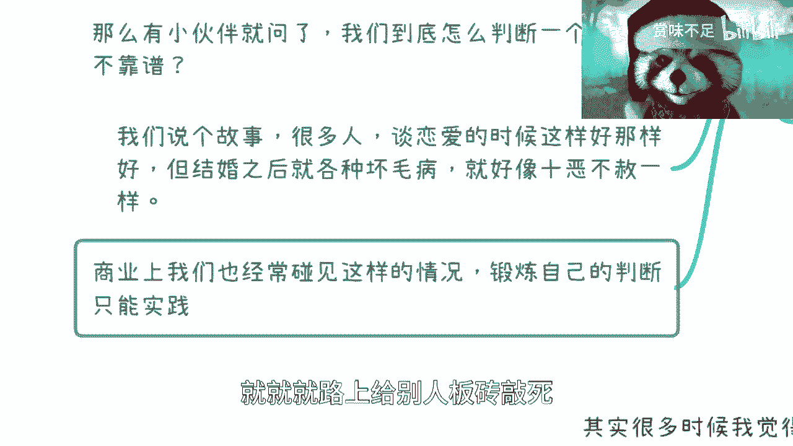

要么是吧啊，然后这个是第一个啊。

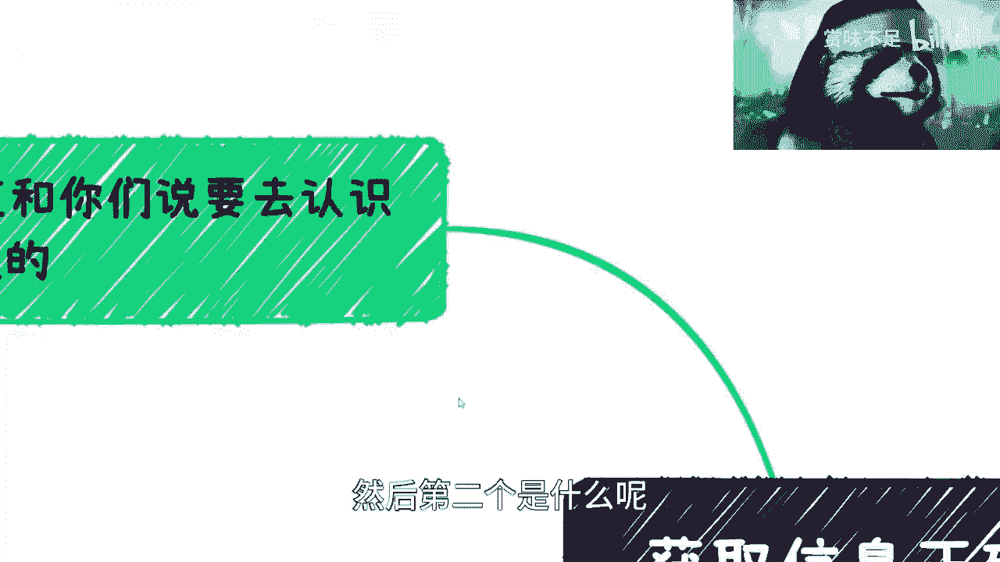

然后第二个是什么呢，那当然啊，这就是我为什么一直跟你们说，就是这个核心，因为你们但凡要去进入，就是说副业也好，创业也好，这个断裂商业思维也好对吧，包括来了解这个行业的一些就是百分之水下。

80%的一些运作模式也好，你们都是要从这一步开始的，没有这一步就没有，以后你知道吧，那当然我在这个地方这个题一卷，因为我之前可能还漏掉一点，你们其实还有一种方式啊。

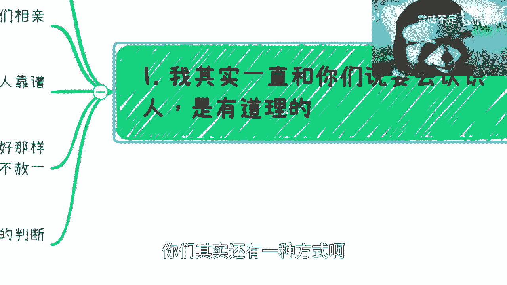

还有一种方式，但这种方式比较特殊是什么呢，就是你可以选择不去认识，让别人认识你，但是这个方式很难啊，方式很难，为什么呢，因为我给你们举几个例子，比如说写书好输出对吧，当然你要你要记住一点啊，就算你输出。

你也得有对应的营销渠道，否则你出了数别人也不认识你，对不对，这是第一点，第二点是你可以做自媒体，当然这个现在很难，你们要记住很卷，对不对，做自媒体啊，做这个私域流量啊，做IP应该说好，做IP。

但是呢你要明白一点，就是这两件事情难度都很高啊，但是这两件事情本身是可以做到，就是你不主动去认识，而别人来主动认识你，这是可以的啊，而且可能别人认识你，这些人比你主动去认识别人质量的高。

但是这个难度很高好，当然其他还有一个就是开会啊，办会这个事，回头我单独再跟你们说一期好吧，因为半会这个东西我觉得很多人误解太深了。

OK那这是第一个啊。

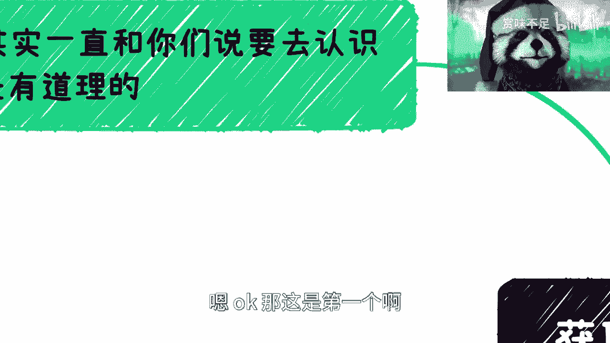

第二个是多方维度的信息，就是我给你们举例子，我是怎么去获取这些信息的，首先我对网络上所有信息一律是不信的啊，我最多就当个八卦看对吧，就是看完拉倒他，不会对我造成任何困扰对吧，这低一点，第二点呢。

就是说从刚刚的第一部里面所筛选出来的，靠谱的人啊，你要跟他们保持一个良好的关系，就不管是比如说现在因为现在网络发达嘛对吧，你们可以跟他们是也时不时的音频，大家聊聊，有或者同一个城市的就时不时出来吃个饭。

你知道吧，你一定要达成一个非常良好的关系，就是你们虽然是商业合作，但是你们要从商业合作变成一个朋友啊，变成个朋友，但是这个朋友又不是那种，就是好像我们从小到大，这个这个心里面所感觉到的那种朋友，不是啊。

那么我给你们举个例子，比如说在二零去年的时候对吧，我就觉得可能经济不好，但是我不知道我的感觉对不对对吧，那我怎么办呢，我我这个是真的啊，就是我去年在大概下下半年吧，就是呃差不多可能678月份的时候呢。

我去找了谁呢，我就去找了一大波人，就那个时候我在上海啊，杭州南京全部逛了一圈，我去干嘛呢，我去找我手上，我觉得靠谱的对吧，跟我关系很好的，创业的，做电商的，开实体店的，做开发的，然后什么呃高这个架构的。

做各种衣食住行的对吧，还有就是最最关键的，我找了一些level比我高很多的投资方啊，我综合了所有的信息，然后我自己得出个结论，你知道吧，就是就是我获取，如果我获取，就是就是就是说。

我今天是因为经济发展这件事情，对我来讲是一个很重要的事情，我才会去做如此大动干戈的行为，但是一般如果我想获取信息的话，我很有可能就是我找其中的一两个就够了，我不可能全部每一次获取信息啊，全部走一遍。

那他妈人家烦都烦死了，你说是吧，所以说呢就是说大部分啊，我是可以通过自己的一些就是说合作方啊，就日常给我的一些信息啊，反馈啊，我是能够大概就是盲人盲人摸象，我能摸出这个轮廓。

但是你说我能不能确定这个轮廓，就是一头大象呢，不一定，当我要确定的时候，我会去找这些，因为他们在不同的行业，不同的level以及不同的这种叫做啊投入产出对吧，那么各方所综合出来的东西。

我相当于最后再做个加权平均嘛对吧，那么我就能得到真正的情况是怎么样子的哦，当然这个地方还有一个很重要的是什么，就那个体制内的就政府领导啊，这个是这个不可缺的啊。

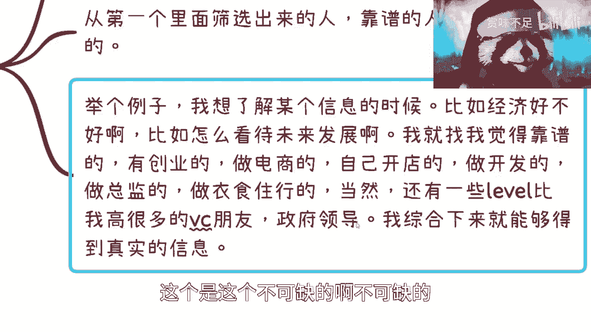

不可缺的好，那么这是第二点。

第三点呢就是搜索啊，搜索呢其实是个非常强的一件事情，但是可能对，就是我这边提一点，大家自己看就参考一下呃，第一呢就是你们一定要用这个和这个的对吧，我就不读了啊，这个这个啊，然后那个某某一个隐形不要用啊。

肯定是不行的啊，然后呢就是说第二个呢就是寻找关键词，我跟你讲啊，这个其实很重要，就是搜索的时候呢一定是什么，比如说ax s x空格，YYYZZZ这样子的就关键词，但是我为什么在这个地方写一句关键词。

很重要啊，就是呃这个就跟你们的，就我为什么一直让你们去认识人啊对吧，去看报告啊，去看很多东西啊，就是他会有很多特殊的用语啊，这个用语或者说是官方用语，但是你们想想看啊，就是当你们不知道这个特殊用语时候。

当你们不知道这个官方用语时候，你们是不可能自己YY出来，一个一个一个特殊用语和官方用语出来了，你们是根据自己的理解写的对吧，那么根据你们自己理解写的时候，那么自然这个搜索引擎是很难给你匹配到。

真正你想要的信息的，对不对，那么好，那么这种特殊用语跟官方用语，我们又不可能说坐在那边冥想就想不出来是吧，所以说这个很有可能是通过你的接触的，人的level啊，接触的不同的人群啊对吧。

接触的就不同的这个各方信息啊，你能拿到这些东西，那么你才能得到更真正的信息，很多时候你搜不到并不代表没有这个信息，而是你搜的关键词不足，你知道吗，而这个关键词不是一个，就是说大家坐在那边想就想出来的啊。

那么这是第一点，还有另外一点呢，就是你们可以寻求一些这个权威的报告，就我之前跟很多人说的什么四大啊对吧，银行啊，证证券啊对吧，其他很多很多啊都有都有，包括一些这个这个叫什么行业协会啊对吧，机构啊。

其他很多很多啊还是要看的，还是要看的，就是当然啊这个里面就是说不要只看一个啊，这个也要综合性去判断，因为一个也有失偏颇，有失偏颇，然后还有些时候就有个特殊性，还有些时候呢，很有可能你们会发现。

这个单独的文字搜索是不行的，什么意思呢，就是说单纯的搜索引擎可能不行，你们得要到视频搜索引擎或，图片搜索引擎里面去找，你明白我什么意思吧，或者社交搜索引擎里面去找，就不单单只是搜索引擎啊。

我我给你们举个例子，比如说对不对啊啊这个也不足啊，不足对吧。

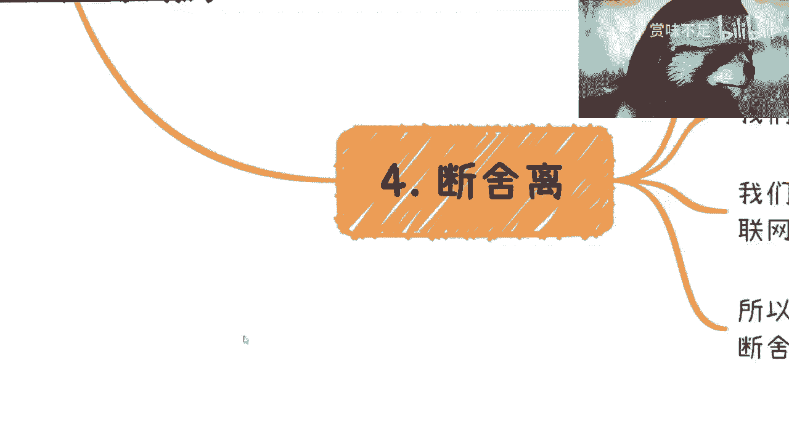

那么最后一点呢，我觉得是这样子的，就是我在写这个呃XMIND的时候呢。

我其实也在想，就是呃一个是其实本质上，一个是从你的可靠的信息源。

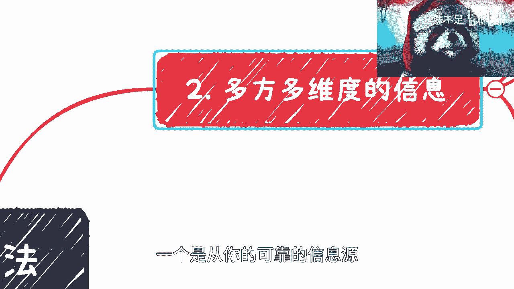

可靠的朋友，可靠的创业者，可靠的领导对吧。

一个呢是通过你自己对吧，那我其实想了想，除了这两个也没有了对吧。

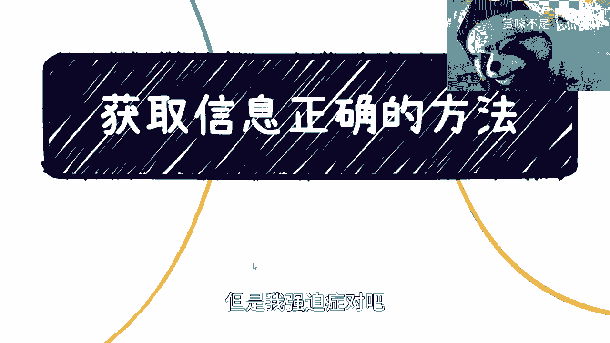

但是我强迫症对吧，我还是要弄满四个是吧，那最后我想了一个呢，就是说呃获取性正确信息的方法里面。

还有一点就是说你得要断舍离啊，因为其实是这样子的，就是你本身被困扰的时候，并不是因为信息太多，而是没用的信息太多，而且另外一方面是，你根本没法去判断哪些有没有用，你知道吗，这是第一点。

那么你会发现就算你做到了，我今天说的第一就是就是就是二和三啊，如果你不能做到这一点，其实依然你是获取不到正确性，而会获取不到正确信息的，因为怎么说呢，就是说嗯，很多时候你对你的朋友可能没这么信任。

你对你自己搜索可能也没这么信任你，你你你你因为杂音多了之后，你可能依然会就是不信任，从而去相信很多莫名其妙的信息，你知道吗，所以说这种时候呢，就是说啊你还是要学会断舍离，就是把这些就是真就是真的。

就是杂音或者垃圾信息，就不要去看它，看了也跟你没有关系，你知道吗，那第三点呢，就是说我们很多时候会觉得就是呃刷网啊对吧，沉浸在里面啊，就好像我们连接上了互联网，你知道吧。

就好像我们就是就是已经从互联网上冲浪了啊，获取信息了，但其实这些就像我说的，就是说你充了信息呢，你八卦没问题，但本质上对你没有用，你知道吧，然后我给你们举个例子啊，其实啊今天你们要断舍离并不难。

难的是什么呢，男的是你们能坚持断舍离，而且难的是你们要相信，坚信自己的信息源是正确的啊，包括自己的判断是正确的，因为我们举个例子，今天就算因为我有多少人，我有6800多联系人嘛对吧。

你比如说就算我今天朋友圈，五六十%的人都在刷一个什么ABCD，EFG的信息对吧，那么对我来讲，我依然只会有一个感觉是什么，就是你越是这样子，我越会觉得你让子弹飞一会儿对吧，为什么，因为你越是这样子。

就说明这件信息看到的人越多，但看到的人越多，意味着他很有可能背后就是资本和舆论的推动，对吧，你你但凡少的，我可能就先当八卦看，你真的越多，我真的就是越不行，你知道吧，但是呢你们就就是断舍离的时候。

一定就是说把这件事情要在自己的，就是这个认知里面得要就是根深蒂固对吧，你不能说啊，今天啊驴老师说了对吧，朋友圈怎么样怎么样，那你今天就是朋友圈吗，那你明天在一个酒会里面啊，很多人给你传输某个思维啊。

你就被洗脑了，那也不行啊，你说是吧，就是你得有一个这个自己的这个，寻求信息的方式啊，呃我只是给你们提点建议啊，不是说一定就是这种方法对吧，但是你们得形成自己的一套，就是叫做啊筛选信息的方式啊。

而且要坚持下去，那当然了，你不能说啊，这个就盲目的就是坚持自我对吧，哪怕呃明明错了，你还要这个坚持。

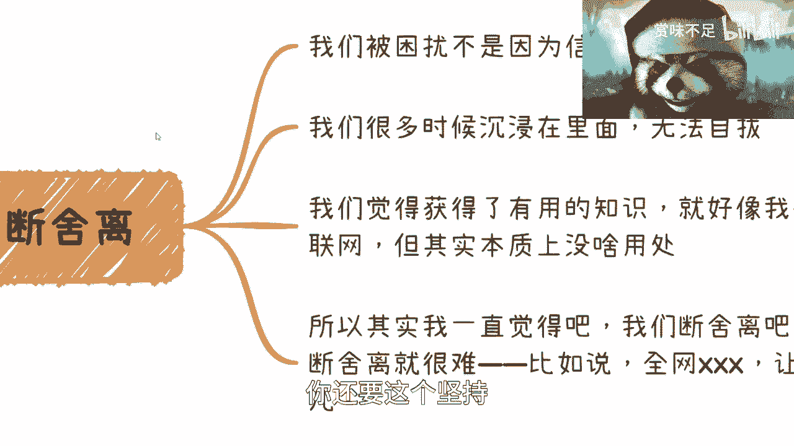

那就没意思了嘛对吧，所以我觉得就是说呃很多时候呢还是得灵活。

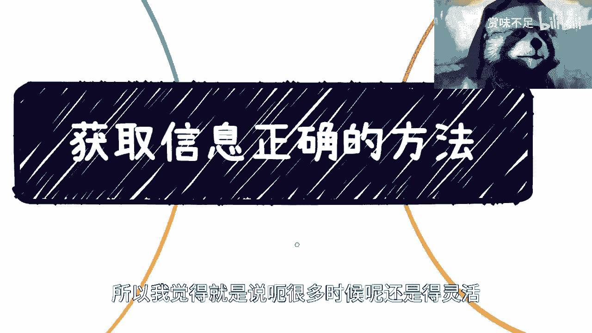

你不能太剧，你知道吗，在这视频上面行，就这么着吧好吧，然后，OK那反正就是大家同样的，因为最近呃这个学生我发现最近学生和创业者，还有那个海外的啊，其实找我咨询人还是蛮多的，就我觉得大家在这个时候。

就是了解一些就是说嗯战略层面啊，包括就是趋势层面的，还是会比较有帮助的好吧。

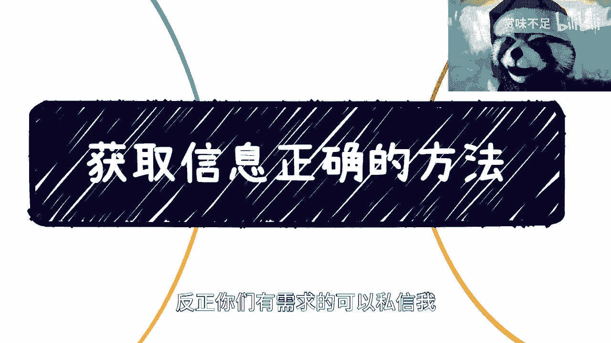