# 课程P1：获取信息的正确方式 🧭

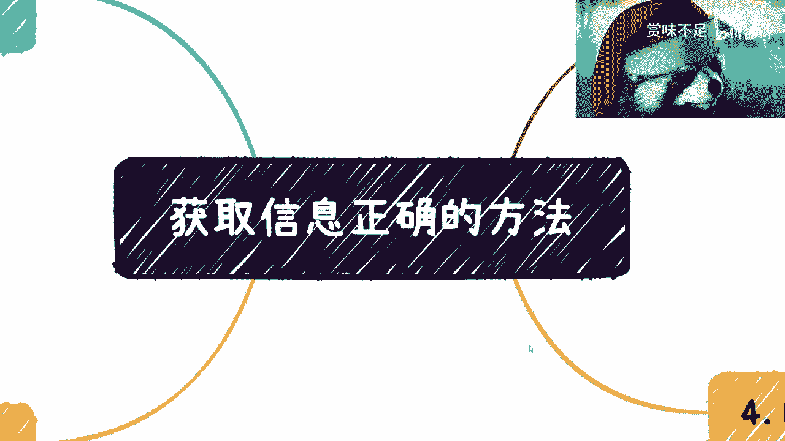

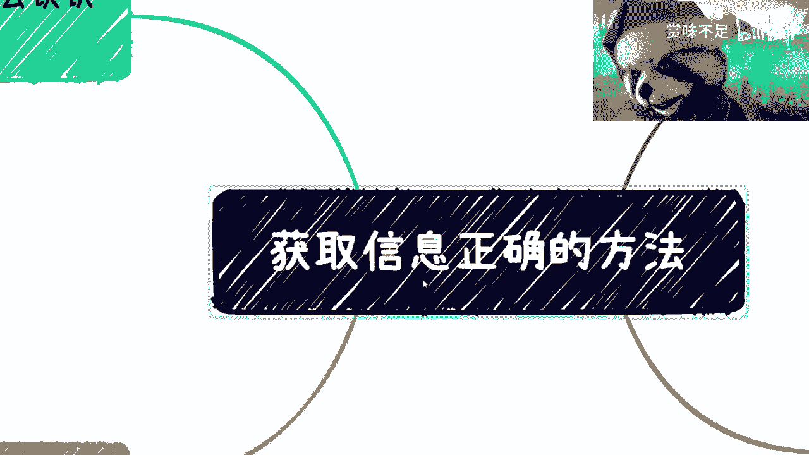

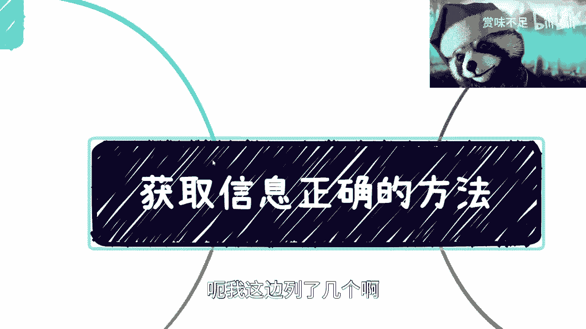

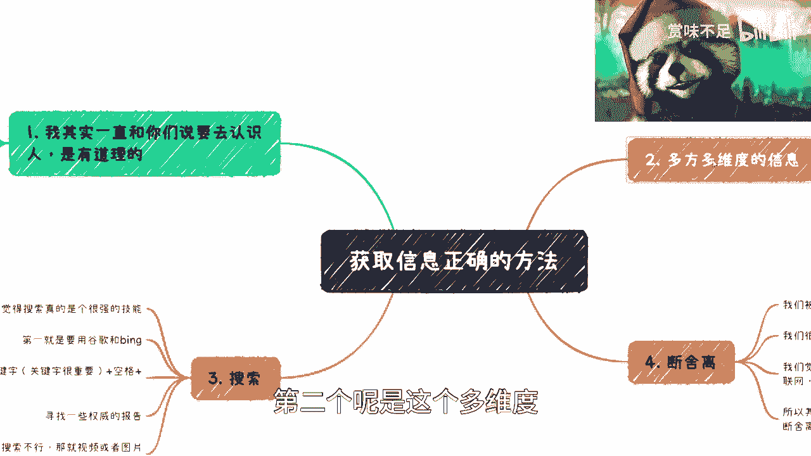

在本节课中，我们将要学习如何高效、准确地获取信息。信息是决策的基础，尤其在商业和创业领域，掌握正确的信息获取方法至关重要。我们将拆解四个核心要点，帮助你构建自己的信息筛选系统。

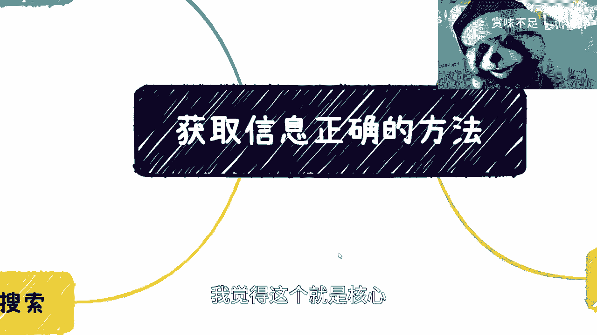

---

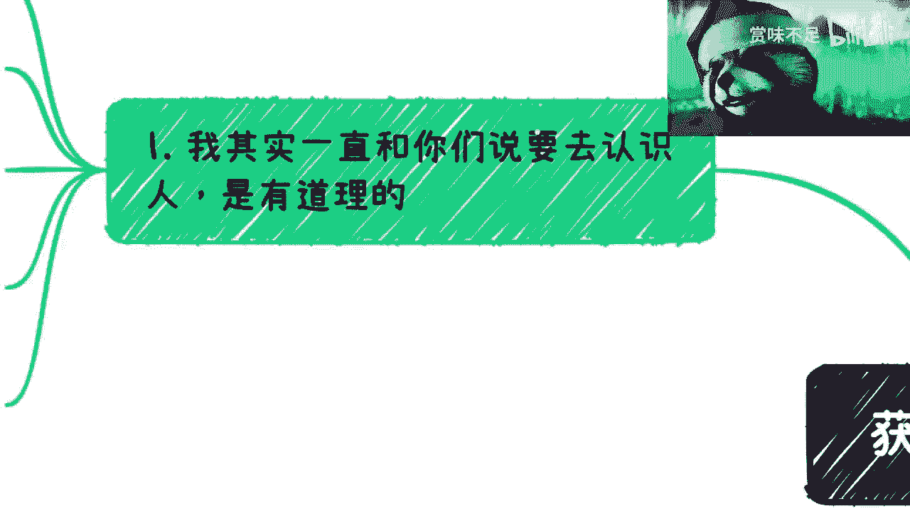

## 一、核心方法：认识人 🤝

上一节我们介绍了课程概述，本节中我们来看看第一个核心方法：认识人。这是获取高质量信息最直接、最有效的方式。

所有商业活动的起点都离不开人脉。很多初学者感到迷茫，不知道应该去认识谁，或者如何判断对方是否靠谱。这种迷茫是正常的，因为初期缺乏判断能力。

以下是关于“认识人”的三个关键步骤：

1.  **以量取胜**：在无法判断时，先通过大量接触不同的人来积累经验。这就像游戏中的“刷怪”升级过程。参加行业活动、交流会等是有效的途径。
2.  **带有目的性**：认识人必须有明确目标。例如，是想了解对方的商业模式、当前项目，还是其拥有的特定资源（如政府关系）。认识后，应为每个人打上标签，并定期复盘总结。
3.  **通过合作判断**：判断一个人是否靠谱的唯一可靠方法，是与其进行实际合作。商业合作如同婚姻，合作前双方都带有“滤镜”（如头衔、学历）。只有通过具体项目，才能看清对方的真实能力、品性和合作价值。实践是锻炼判断力的唯一途径。

此外，还有一种进阶但难度更高的方式：**让别人认识你**。例如通过写书、做自媒体、打造个人IP或举办会议来吸引他人主动连接。这种方式获取的人脉质量可能更高，但实现难度也更大。

---

## 二、多维度验证信息 🔍

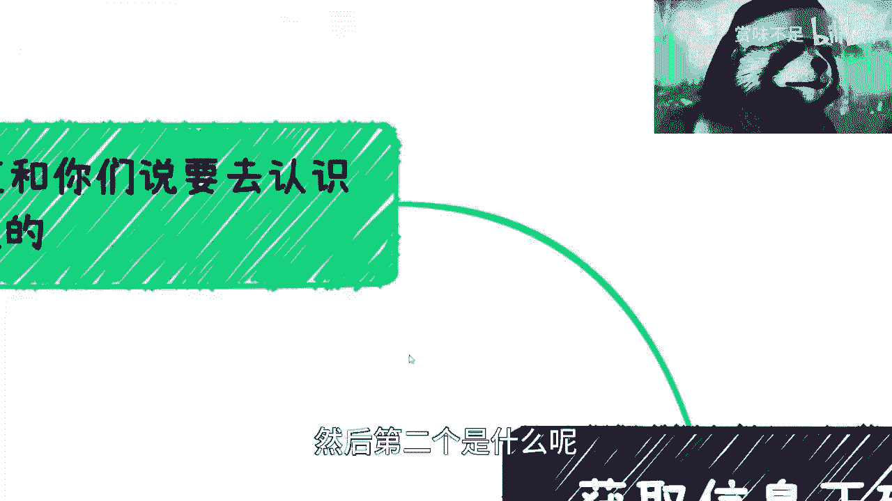

仅仅认识人还不够，获取的信息需要交叉验证。本节我们将探讨如何从多个维度核实信息的真实性。

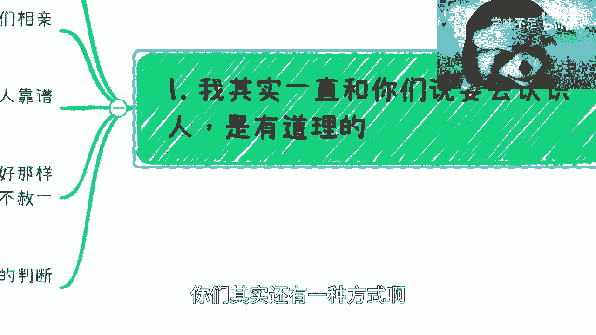

我个人对网络上的公开信息持谨慎态度，通常只将其视为参考。真正可靠的信息来自第一步中筛选出的、值得信任的伙伴。

以下是构建多维度信息验证体系的方法：

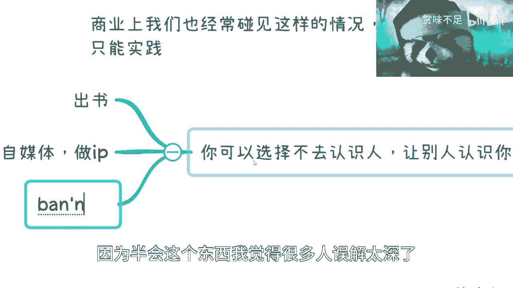

*   **维护深度关系**：与筛选出的靠谱伙伴保持良好、深度的联系。这种关系超越单纯的商业合作，更像是基于信任和共同成长的朋友。
*   **跨行业、跨层级采样**：当需要确认一个重要趋势或判断时（例如对经济形势的预判），应主动咨询不同行业、不同公司层级、不同投资规模的朋友。这包括创业者、电商从业者、实体店主、技术人员，以及**高水平的投资方和体制内的相关人士**。
*   **进行加权分析**：将来自各方的信息进行综合与交叉验证，相当于做一个“加权平均”，从而勾勒出更接近真相的全貌。日常可通过少数关键伙伴获取信息轮廓，在需要重大决策时再进行全面调研。

---

## 三、掌握高效搜索技巧 🕵️♂️

除了依靠人脉，主动搜索是另一个强大的信息获取工具。本节我们来看看如何提升搜索效率。

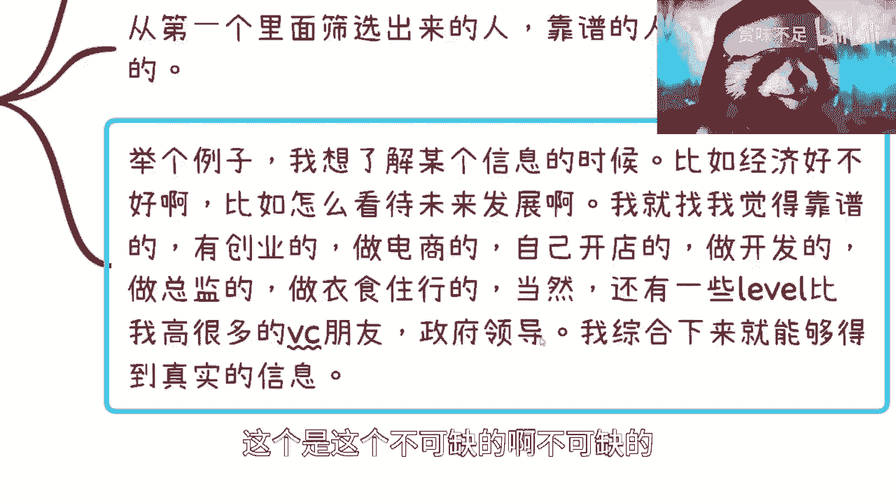

搜索的关键在于使用正确的工具和关键词。

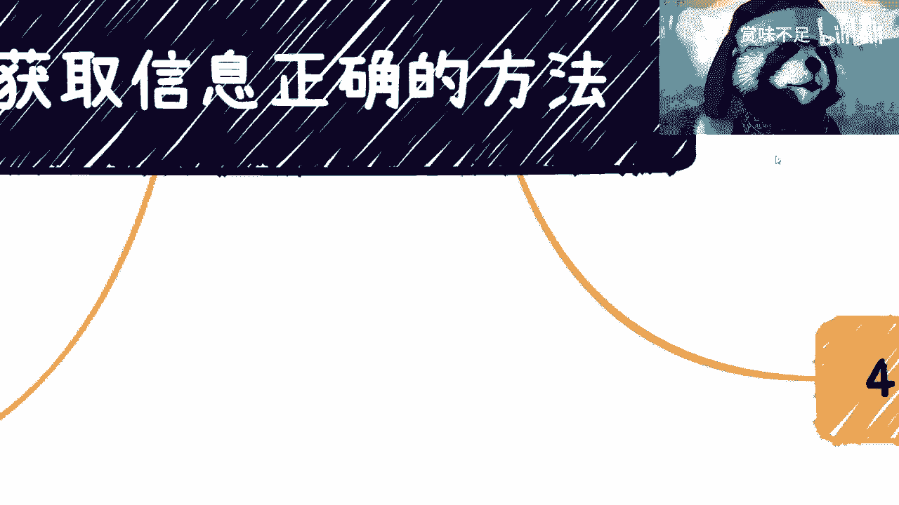

以下是提升搜索效果的具体建议：

*   **使用专业工具**：优先使用 `Google`、`Bing` 等国际搜索引擎。避免使用某些信息过滤严重的搜索引擎。
*   **精准使用关键词**：搜索时应使用 `关键词A 空格 关键词B` 的格式。**关键词本身的质量至关重要**。很多行业术语、官方用语无法靠想象得出，需要通过阅读专业报告、与人交流来学习。不知道正确的关键词，就难以搜到核心信息。
*   **查阅权威报告**：定期查看四大会计师事务所、知名投行、证券公司、行业协会等发布的权威报告。注意不要只看单一来源，要综合比较。
*   **善用多种搜索形式**：不要局限于文字搜索。有时需要在视频平台、图片库或社交媒体中进行搜索，以获取不同形态的信息。

---

## 四、践行信息断舍离 🗑️

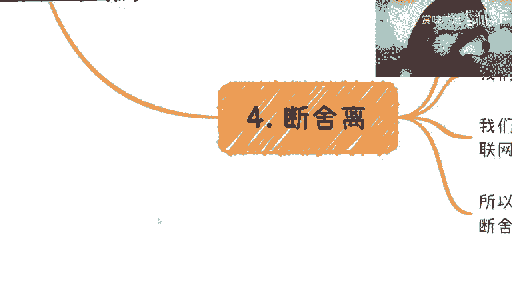

信息过载是当代人的通病。本节我们将学习最后一步：如何果断地舍弃无用信息，聚焦核心。

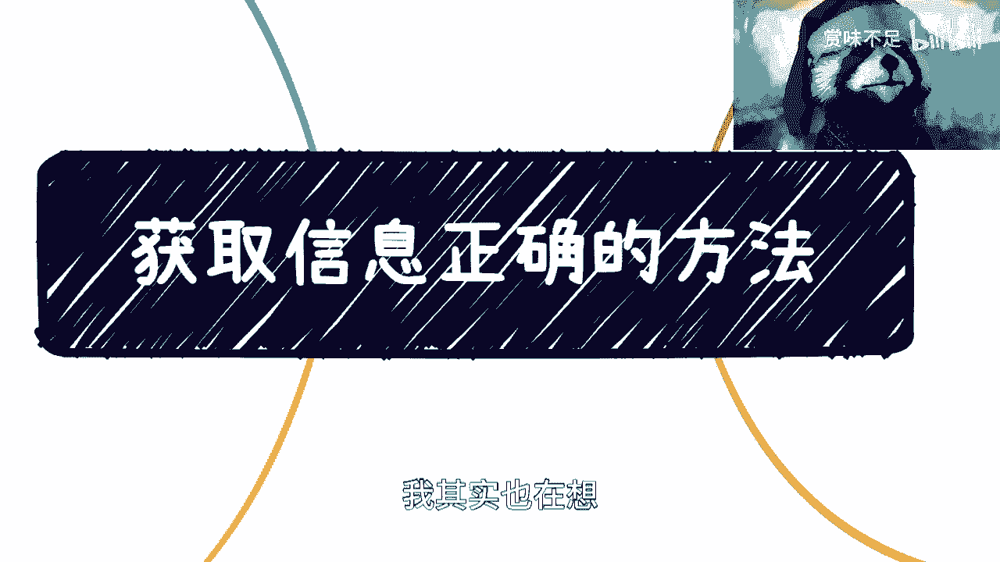

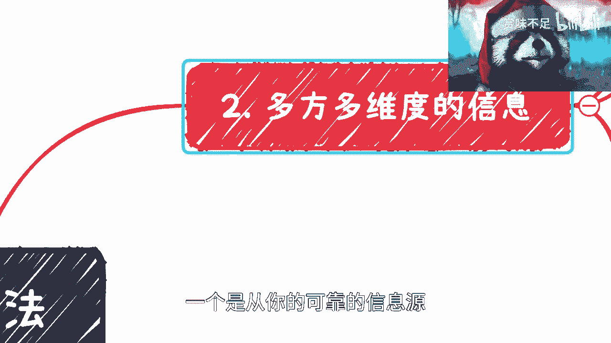

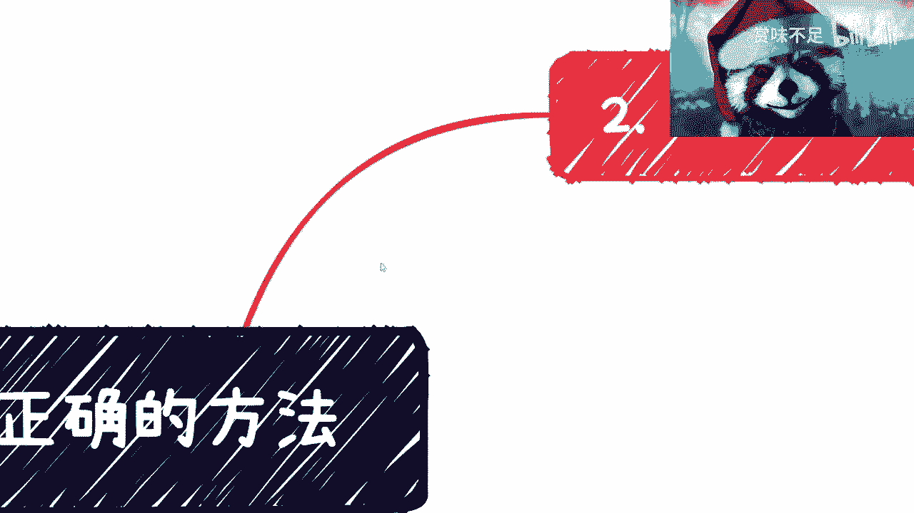

获取信息的障碍往往不是信息太少，而是垃圾信息太多，且缺乏筛选能力。即使掌握了前三种方法，若不能有效“断舍离”，依然会被噪音干扰。

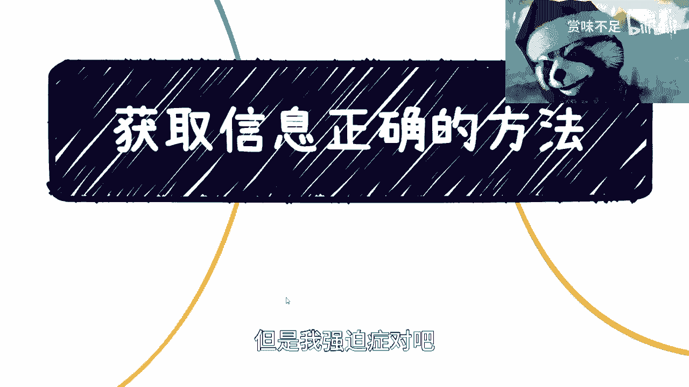

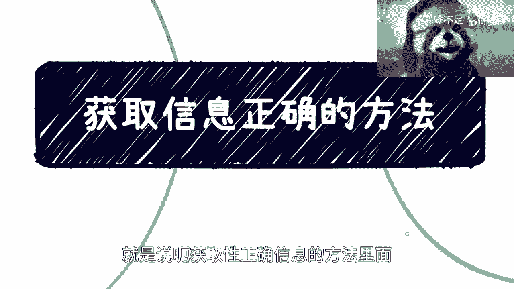

以下是践行信息断舍离的要点：

*   **主动屏蔽杂音**：明确识别并远离那些与你目标无关的八卦和垃圾信息。刷手机带来的“连接感”并不等于获取了有效信息。
*   **坚信可靠信源**：建立对自己筛选出的可靠信息源（人脉与搜索结果的信任。当某个信息在朋友圈被疯狂刷屏时，反而应保持警惕，因为这可能是资本或舆论推动的结果，要让“子弹飞一会儿”。
*   **形成个人体系**：你需要形成一套适合自己的、稳定的信息筛选逻辑，并长期坚持。同时要保持灵活，避免陷入固执己见、明知有错也不改的境地。

---

## 总结 📝

本节课中我们一起学习了获取信息的四个核心方法：

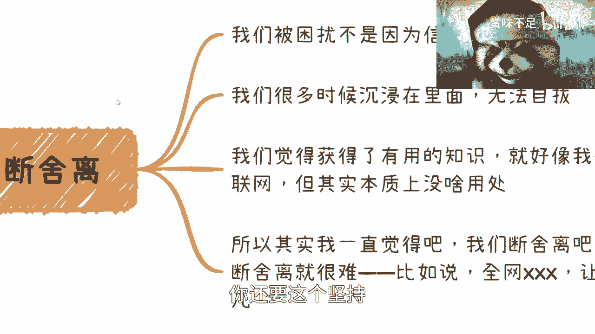

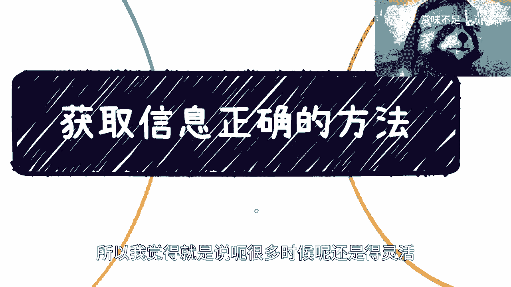

1.  **主动“认识人”**，并以实践合作作为判断依据。
2.  **进行“多维度验证”**，交叉比对来自不同行业和层级的信息。
3.  **掌握“高效搜索”**，利用正确工具和关键词挖掘深度内容。
4.  **坚持“信息断舍离”**，屏蔽噪音，坚信并优化自己的信息筛选体系。

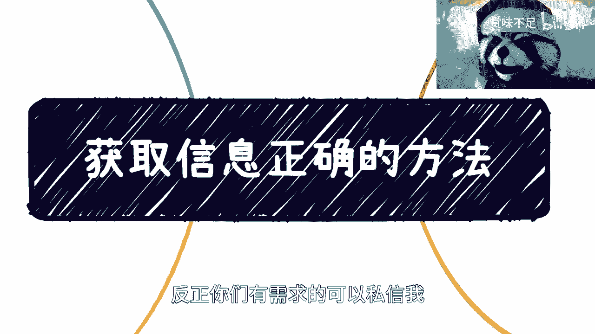

掌握这些方法，能帮助你在复杂的信息环境中保持清醒，做出更明智的决策。对于创业者、学生或任何希望提升信息素养的人，这套思维框架都具有重要的参考价值。