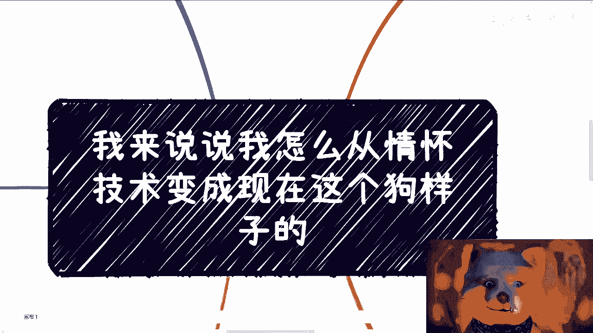
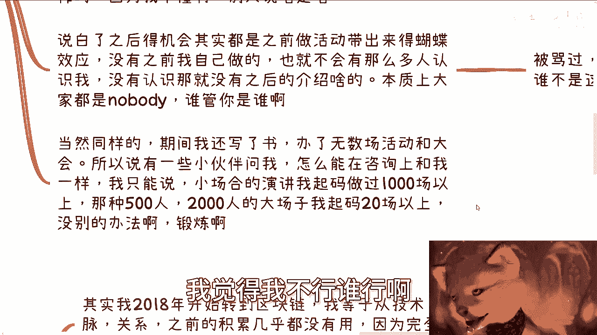
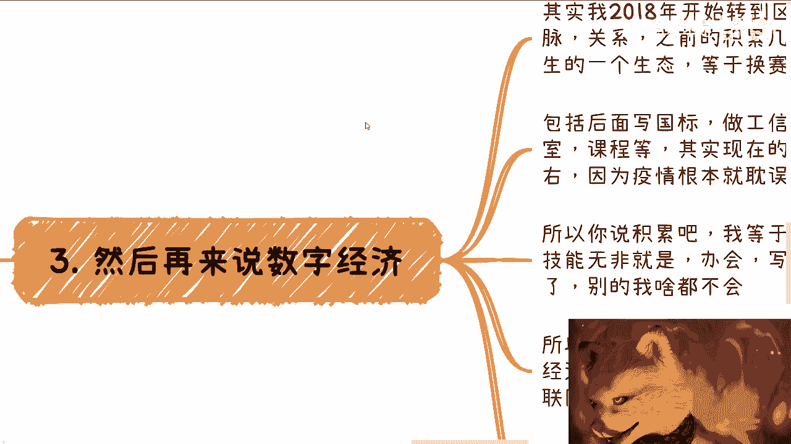
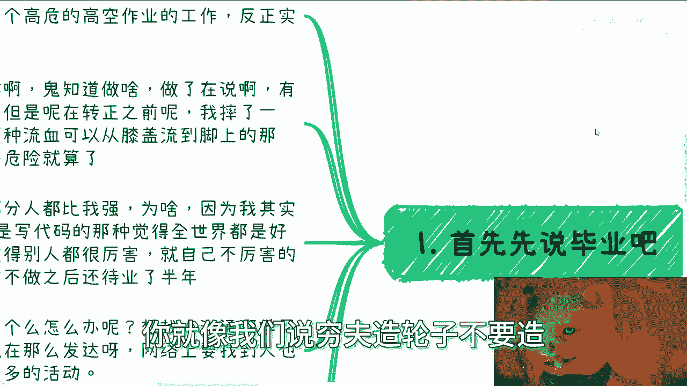

# 我来说说我怎么从傻白甜变成现在这个狗样子的 - P1 - 赏味不足 - BV1Mi4y1B7pA

啊大家好，我本来不打算把它放到充电视频。

我后来想想算了，免得节外生枝，没啥意思啊，这个既然之前有人问我，就说我怎么以前写代码是吧，现在就变成这种狗样子，是我来跟大家讲讲我是怎么变成这狗样子的啊，哎呀那怎么办呢。

对吧啊，先说毕业啊，这个我毕业的时候呢，这个当年说金融危机对吧，虽然说是说金融危机吧，我评估了一下，我觉得比现在好一点啊，有一说一真的比现在好一点，现在是真的是鬼哭狼嚎啊，一塌糊涂啊，然后呢。

那我也跟大部分人一样找不到工作，然后我第一份工作呢，找了一个高危的高空作业的工作，当然你别管我学什么的啊，我他妈能找到工作就不错了，啊啊啊，然后实习一个月500块钱，人都是这么过来的，当然了。

那些富二代，咱不说，像我们这种普通的再普通的人都这样，我跟很多人都一样啊，就是鬼知道做啥，你做了再说啊，这个家里面包括其他地方都在催对吧，因为有个工作就不错了，嗯但是呢嗯天不遂人愿啊。

这个转正之前呢摔了一下，嗯也还行啊，这个皮肉伤，但是呢是那种呃血流成河是吧，然后家里面就觉得危险就算了，本质上呢我觉得大部分人其实都比我强，为什么呢，因为我属于那种LV1天生属性是零对吧。

就是什么叫天生属性是零呢，就是我是那种比如说啊又是写代码的，又是那种觉得全世界都是好人的人，天生属性就是零了对吧，你你按我现在的说法，就是他妈的就是个关，然后套着全身都套着DEBUFF，就这种感觉啊。

然后还觉得他妈别人都很牛逼啊，就他妈自己是啊，那然后呢这份工作呢这个不做之后呢，还待业了半年，因为找不到，那根本就迷茫了呀对吧，不是跟大家一样吗啊那怎么办呢，想找人沟通啊，我也一样的嘛对吧。

那想找人沟通，想找所谓的贵人带对吧，想找人怎么样，那人都是这样子的啊，嗯当然在这个过程当中也也不叫被骗吧，就是浪费了很多时间，就感觉这个人好像能带我啊，感觉那个人带我他妈都一场空啊。

但当时呢他不像现在这么发达，你比如说网络上真的要找点人呢也容易啊，那当时找不到啊，也没有，其实本质上也没有什么太多的活动。

那我后来就想着，就是说你与其无头苍蝇一样，这边找找，那边找找，还不如说自己做个活动，让别人来找我对吧，那怎么说呢，你你没有这么花里胡哨，就这逻辑就如此朴实无华对吧，反正再差不差呢，总有人来啊。

呃我基本上在前四五期啊，甚至前大概17左右，反正每一期来呢也不超过十个人，那我也不无所谓嘛，对吧，你有人来就不错了，因为对我来讲，所有人其实都是增量市场嘛，因为对我而言，我就属于那种闭门造车。

什么人都不认识的，对不对啊，然后就要来说重要节点，这个节点呢是这样子的，对我来讲呢，你要说有没有动力，有的没钱，你别看我现在在新天地这边对吧，那我可以说你说这边的房子车子。

还有说别的所有东西都是我自己赚钱买的，你不赚钱，你怎么活啊，你怎么过啊，对吧啊，我自己办的活动，那我这么说吧，我给你们个概念啊，我们现在周边以我为圆心，大概11km到1。5km内啊。

跌完就是现在已经房价不是跌了嘛对吧，跌完啊，我这边平均差不多还有28~30，1万1平啊，你们可以自己掂量掂量啊，我自己办的活动其实就是一个很重要的事情，为什么，因为只有这些事情，他让我认识更多人。

然后才有更多的机会，有一些机构啊或者一些中介啊，找我去做企业跟政府的咨询和培训，那说难听点，一开始你你别说都是免费做的，我懂啥呀对吧，你这样你把我平移到你们现在我懂啥呀对吧，你别人找我。

我就觉得别人看找我看得起我对吧，你说当时还有人跟我说，哎这个那个小陈啊，这个有有人说白嫖，你对吧，怎么样，谁跟我讲对吧，而且我自己会觉得我有资格谈价格吗，谈个屁啊啊直到做了一段时间之后，他开始有报价啊。

当然本身我也是被压榨的啊，具体我就咳咳不说了，因为这些东西也涉及到一些这个行业的，一些东西，我就不说了对吧，那你还是被压榨，因为我不懂啊，那别人说啥是啥了对吧，你说你五块钱就五块钱。

说你十块钱就十块钱了是吧，那当然你们要明白，就是之后得到的所有机会，都是之前做活动带出来的蝴蝶效应，也就是说我没有之前自己做的这些东西，也就不会有这么多人认识我，没有这么多人认识我。

也就不会有后面的介绍，没有后面的介绍，也就没有，现在有很多事情他都是一一连串走过去的对吧，因为本质上你们也好，我也好，都是nobody，那凭什么你做呢，谁管你是谁啊对吧，那这个地方我也跟你们讲。

马怎么没骂过呢，PUA怎么没PAM过来对吧，那我不跟你们这么说吧，我以前最早出去演讲，我还记得很清楚对吧，我当时下面大概七八十号人讲完，讲完呢这么说吧，人家不会表面上说你对吧。

但是私下里开始说哎这个这个这个人啊，就说我就说我对这个PPT吗，写的不好，讲的没有，讲的不好，不知道在讲些什么东西啊，然后呢PPT上面要么就是什么都是图片，要么就是文字对吧，这个一点没有逻辑性。

我跟你们讲怎么没有啊，一路被骂过来的对吧，你包括你不但下面有人说你主办方，有人说你的客户还要说你怎么没有啊啊，谁一开始知道怎么做，没人知道怎么做的，PUA也是一样的，我跟你们这么说，我待业了半年之后。

我去了一家创业公司，我在这家创业公司整整半年一年的时间，除了我的同事以外，我的四个老板几乎每天都会跟我说，你不适合这个工作，你做的一点都不好，就是个垃圾，怎么没有PO过对吧，谁不是这样过来的啊。

当然同样的对吧。

期间啊我还写了书啊，办了无数场活动和大会，所以说呢你说之前有些人啊咨询我的时候问我，他说怎么能够在咨询上啊，能够做我到我像我现在一样，我跟他怎么说的，我说没有方法，小场合演讲。

我起码做过1000场以上那种500人，2000人的大场子，我起码做过20场以上，没了呀，这就是方法呀，你别那种什么做个一两场四五场，哎呀，陈老师，我觉得我不行。

谁行啊啊，你要打退堂鼓，那是你的事情，你要往后做，你除了一次一次的去锻炼，还有什么办法，有什么办法啊。

你也没天赋，我也没天赋，我们都不是那种有天赋的人对吧。

然后再来说数字经济，其实2018年我转到区块链，我等于是什么从技术，人脉关系以及之前的积累全部断绝了，你就等于从零开始，你就等于是一个完全陌生的生态，然后换赛道，你们想想当时我几岁啊对吧。

你其实仔细想想，你去掉疫情几年18年，离现在没多久是吧，包括后面写国标，做高校的实验室课程等等等，其实到现在我就跟你说，Totally，就是加起来一共也就花了4年时间。

你们别看我好像比如说积累了非常多的case啊，有非常多的title或者怎么样子，其实就4年，你以为他妈我进了十几年没有的呀，对了，所以你说积累啊，我跟你们讲啊，积累这个东西啊。

我等于从0~1重新开始了一遍，我手上有什么技能，无非就是什么办，会写书咨询，最多做做自媒体，我他妈自媒体我也不会对吧，没了呀，我还会啥呀，你把你把你把应用这边表情表皮扒掉。

你就说核心我不会写几个东西没了呀对吧，所以你说难吗，是难的，你说不难吧，也不难，因为你说难是为什么，因为你要从0~1去拓展你的关系，去拓展你的人脉，去拓展你的很多的市场对吧，要让大家重新认识你。

但是不难是为什么呢，因为对我来讲，我其实只要把这三件事情在这个行业重新CTRLC，CTRLV复制一遍对吧，就是说难听点行就行不行就就不行，我就换赛道了对吧，你就像我这边说的。

因为数据经济当下的发展对我来讲，跟我以前经历过的移动互联网的发展，它是翻版，因为你每一个行业都是从0~1，然后一到兴起兴起之后再发展，它整个过程其实是一样的，它就是一个循环，一个循环没有太大区别的。

所以在当下这种情况下，我知道或者说我大概率能够映射出来，我知道呃，这个相比相相相较，当时移动互联网它后面会怎么发展对吧，你说唯一有区别的是什么，就是以前我在移动互联网这边呢，其实都是做工具人。

就是我只负责干活啊，我对我跟你们讲的很多的那种什么商业逻辑啊，或者我对核心啊我都不懂的，而且我也没有这个意识去积累，因为没有人跟我讲啊，谁跟我讲啊，我都是埋头在那边干嘛啊。

我是到了数字经济这个赛道之后呢，我才通过了一系列的case才摸索到核心的啊，当然就我这个地方也给你们写了，就是冰山一角中的冰山一角啊，好，那么我们来说，核心就是我怎么变成这种狗样子的，对不对，好。

怎么从一个傻白甜变成一个狗样子啊，很简单啊，就像我刚刚说的，你怎么能够做很好的咨询，一个一个一个去做，那你怎么变成这狗样子，就是一个一个坑去踩啊对吧，我跟你们讲什么没有啊，比如说我找到合伙人。

有不会赚钱的，有羡慕你赚钱的，有眼红你赚钱的，有背后落井下石的，什么没有啊，啊有坑你钱的对吧，比如说给你画饼的，什么饼都有花，我跟你讲，真的什么病都可以给你画的哦，各种各样的什么什么。

比如说呃这个这个高高校的title啦，政府的title啦，然后什么出国了对吧，然后给你赚多少钱啊，反正每次都会让你感觉到卧槽，我他妈马上就成功了，马上就人生巅峰了，已经是白富美了。

最后他妈一个都没有落地的对吧，但是问题是你你就像我之前跟你们讲的，你们的时间跟你们的经历对吧，才是最重要的，钱反而不是最重要的，你要是真的，你说被骗了十几万二十万对吧，你说好，我已经走上正道了。

那也就算了，你要说你被骗了34年，56年的时间，你怎么办，后面对吧，然后我们还碰到过什么伪装成骗子的，不叫伪装成骗子，就是骗子做伪装的，什么伪装都有什么呢，秘书什么秘书长啊，校长啊，院长啊，科委啊。

什么都有，我跟你们讲什么，我们没碰到过啊，什么没有啊，对吧，当然最终我们说骗钱的也有，比如说我们也做过投资一级市场，二级市场的股权投资的币圈，投资的什么没有啊，还有高利贷，我们还出去救过人对吧。

那你说那些什么敌敌畏跳楼我就不说了，那他妈是后话了，对不对，那你怎么变成这种狗样子呢，没有办法呀，你怎么办呢，因为事实上就是这样子呀，你们没有经历过，不代表不是这样子，你懂吗，你们越去赚钱。

你们越深入商业，你们越会明白，就是这个样子的，没有办法呀，他大局就这样子，你怎么办呢，所以我才跟你们讲，为什么我一直建议你们要做，就尽可能高举高打，因为只有你们高举高打对吧。

你才能可能避免就是这这么多的坑。

何必呢对吧，你就像我们说重复造轮子不要造。

那你们既然要去做，你们为什么一定要把我当时走的坑都走一遍的，没有必要呀，对吧好，那么你问我为什么了解这么多，对吧好，我跟你讲啊，大概率都是我机缘巧合做case，也就是说跟别人合作做了项目。

比如说你说我写了国标，我才明白它背后的逻辑，对吧啊，然后我可能还会衍生出来找一些专家，找一些负责人去聊对吧，去喝酒去吃饭对吧，但是你单纯的搜索别人是不可能告诉你的，而且告诉你就算对原本来讲告诉你。

你没有实践其中所谓的精髓跟奥妙，你也理解不了，你明白吧。

所以说这也是我为什么跟你们讲，就是说别的国家咱不说，就拿中国来讲，你要去干，你要去打破信息差，你要去钻到有一个裂缝上面，你只能靠一个东西，那就是干对吧，因为别人可能有些人是有捷径的，富二代。

他有关系对吧，他父母可能会会跟他讲很多东西，但是我们没有啊，我们怎么办，我们只能靠干，你不干没问题，那你就做工具人，然后30岁35岁被淘汰就结束了吗，这就是当下的现状，没什么好说的，对不对，咳咳好吧。

还是那句话啊，还是那句话，记住未来的20年跟以前的20年，他不是同一个20年啊，不要拿任何以前的东西来去就说下结论啊，只有某些背后的通用规则，它是不会改变的，就像我们说市场的发展啊，市场的变化啊对吧。

他总归是从有兴起，有有有潮起潮落，只不过是时间周期不一样对吧，他也有很多的钱是必然大家赚得到的啊，这些东西不会变，但是千万不要去想着说哦，以前可能大家都创业成功率很高，我也得去创业哦。

以前这个铁饭碗大家能够什么什么，我啊我也得去去考公务员，没有这种因果关系的啊，因为以前的20年大家是跟着中国，跟着整个社会一起进步发展的，但不好意思，未来的20年大概率你也好我也好，我们没这个机会。

而且社会本身也没有这么大的发展的潜力，给大家带去发展对吧，你但凡去了解了解就能明白啊，客观的评估事实，在做出努力，做出战略上的判断好吧，不要盲目的去说啊，别人说什么我就去干了，没有用的好吧行啊。

