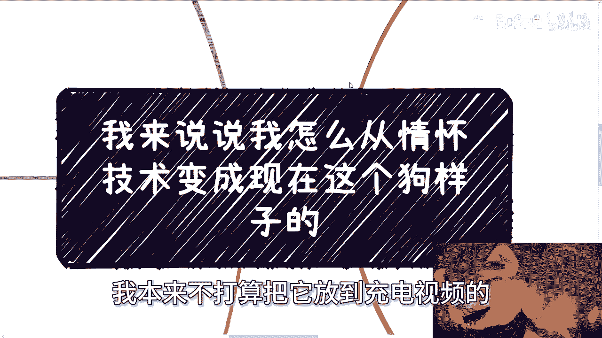
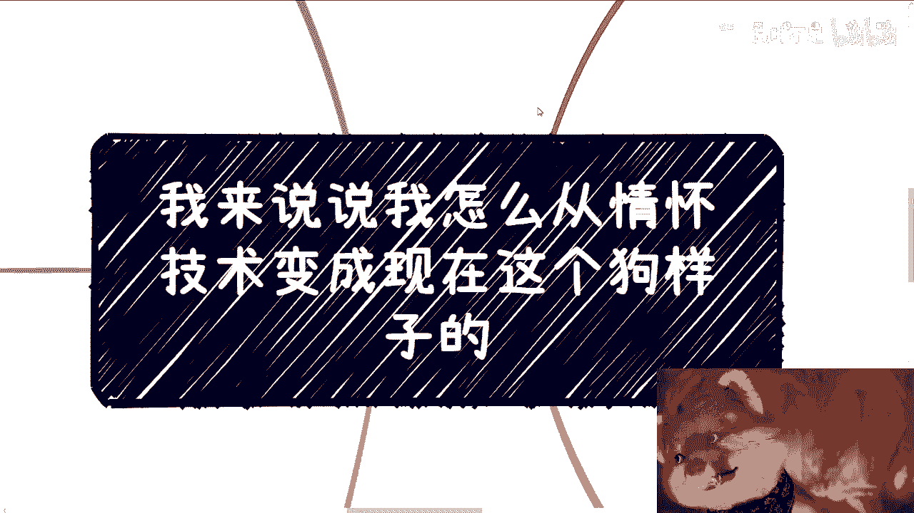
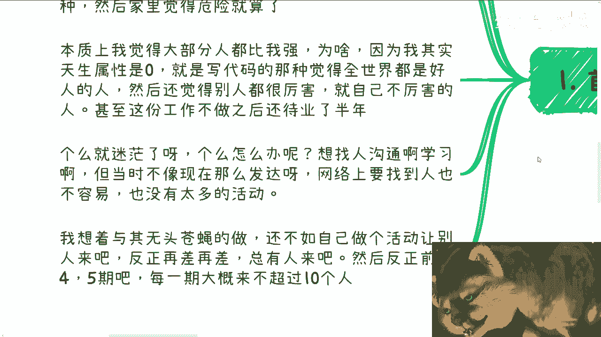
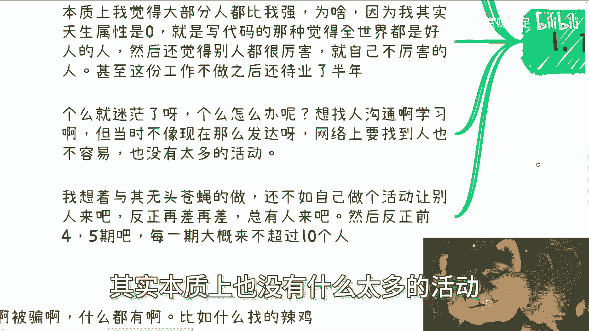
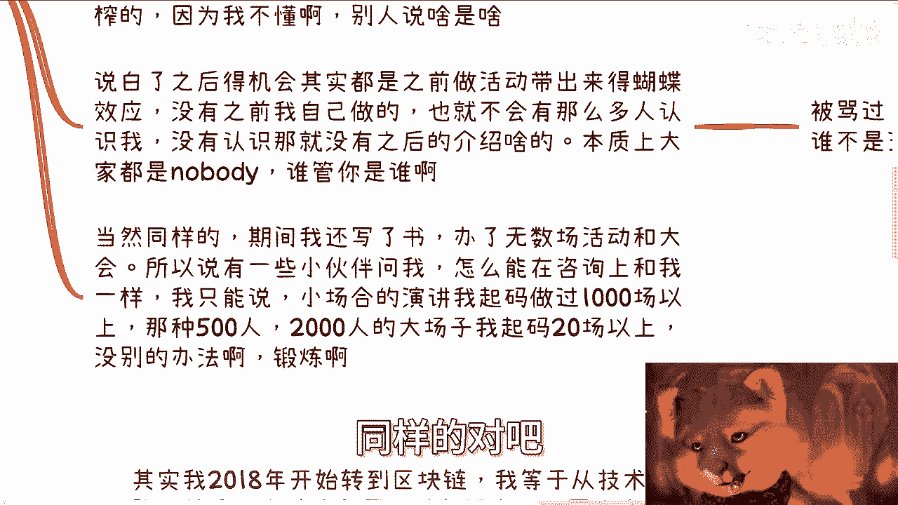
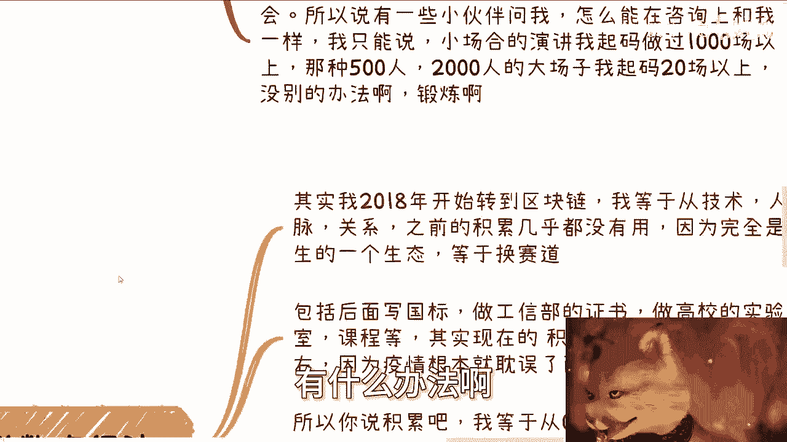
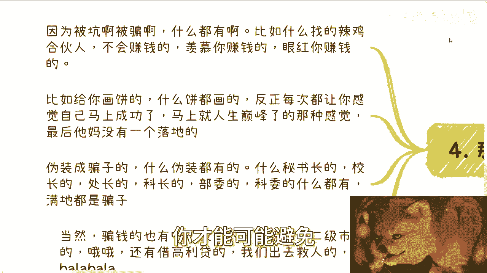
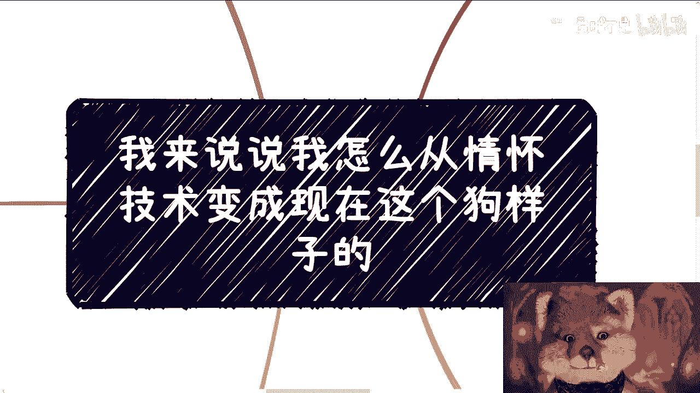

# 课程01：从零到一，我的成长路径与核心方法论 🚀




在本节课中，我们将通过一位开发者的真实经历，学习如何在职业初期克服迷茫、积累经验并实现赛道转换。课程将拆解其从“傻白甜”到经验丰富者的关键节点与核心方法，特别适合初学者了解职业发展的底层逻辑。



---

## 概述：起点与困境

我毕业时正值金融危机，虽然当时环境比现在略好，但同样很难找到工作。我的第一份工作是高空作业，实习期月薪500元。这和大多数普通人的起点一样，先有工作再谈理想。

转正前我意外受伤，虽然只是皮肉伤，但家人认为过于危险，我便离职了。随后我经历了半年的待业期，感到非常迷茫。我意识到自己的“天生属性”可能比较低：作为一名程序员，却天真地认为全世界都是好人，这相当于开局就带着一堆负面状态（Debuff）。



---

## 第一节：主动创造连接

在迷茫期，我尝试寻找所谓的“贵人”指点，但大多徒劳无功，浪费了不少时间。当时的社交渠道远不如现在发达。



我转变了思路：与其像无头苍蝇一样到处寻找机会，不如自己创造活动，吸引别人来找我。这个逻辑朴实无华：再差的情况，也总会有人来。最初几期活动，每期参与人数都不超过十人，但这对我来说都是“增量市场”，因为我原本处于闭门造车的状态，谁也不认识。

**核心行动公式**：`被动寻找机会` -> `主动创造连接点`

---

## 第二节：积累与蝴蝶效应

举办活动对我而言至关重要。它让我认识了更多人，从而带来了后续机会。一些机构和中介开始找我做企业和政府的咨询与培训。

一开始，我几乎是免费做的，因为我认为别人找我是看得起我，自己根本没资格谈价格。直到做了一段时间后，才开始有报价，当然初期也免不了被压榨。

我后来得到的所有机会，都是之前活动带来的“蝴蝶效应”。没有那些主动的积累，就不会有后续的介绍与合作。本质上，你我都是“nobody”，别人凭什么选择你？只能靠一步步积累的可见成果和人脉网络。

**核心概念**：`初始积累 (A)` -> `人脉拓展 (B)` -> `机会涌现 (C)`。即 **`A -> B -> C`**。

---

## 第三节：在批评与实践中锤炼

成长路上充满批评。我最早做演讲时，台下七八十人，讲完后私下里被人批评PPT糟糕、内容没逻辑。主办方、客户都可能提出质疑。

PUA（指职场打压）也同样经历过。待业半年后，我进入一家创业公司，在近一年的时间里，除了同事，四位老板几乎每天都对我说：你不适合这份工作，你做得不好。大家都是这样过来的。



期间，我坚持写书、举办了无数场活动和大会。后来有人问我如何在咨询领域达到现在的水平，我的回答是：没有捷径。小规模演讲我做过1000场以上，500到2000人的大型场次我也经历过20场以上。除此之外，别无他法。

**成长代码**：
```plaintext
while (skill_level < desired_level) {
    practice();
    accept_feedback();
    iterate();
}
// 没有break语句，只有持续循环
```


---




## 第四节：切换赛道与从零开始

2018年，我转向区块链领域。这意味著我从技术、人脉到原有积累全部归零，进入一个完全陌生的生态。

去掉疫情几年，从2018年到现在，我完成赛道转换、撰写国标、建设高校实验室课程等一系列事情，总共只用了**4年时间**。外人看来我积累了很多案例和头衔，但核心周期只有4年。

所谓“积累”，我等于从0到1重新开始了一遍。我拥有的核心技能无非是：办活动、写书、做咨询、做自媒体（且并不精通）。剥离表象，核心能力就那么几项。

**赛道转换逻辑**：
1.  **难处**：需要从零拓展新领域的关系、人脉和市场。
2.  **不难处**：只需将已验证的**核心方法论**（办活动、建立影响力、做咨询）在新领域复制一遍。即 **`方法论`** 的跨领域迁移。

数字经济当前的发展阶段，在我看来是移动互联网发展的翻版。每个行业都经历从0到1、兴起、发展的循环，底层规律相似。唯一不同的是，在移动互联网时代我主要扮演“工具人”角色；而在数字经济赛道，我通过大量实践案例，才真正摸索到了商业逻辑的核心。

---

## 第五节：“傻白甜”如何变成“狗样子”

如何从一个天真的人变成现在这样？答案很简单：一个一个坑去踩。

我遇到过各种问题：合伙人不会赚钱、羡慕或眼红你赚钱、背后落井下石、坑钱、画大饼（用高校、政府头衔或出国机会等诱惑），最终却无一落地。

比损失金钱更严重的是浪费时间和精力。如果被骗了几年时间，后续发展就会非常被动。

我们还遇到过各种伪装：冒充秘书长、校长、院长、科委人员的骗子。我们也涉足过一级市场、二级市场、股权投资、币圈投资，甚至处理过高利贷纠纷。

你越深入商业世界，越会明白这就是现实。因此，我始终建议：如果要做，就尽可能“高举高打”，站在更高的起点，或许能避免重复踩入那些低级的坑。

**核心原则**：`避免重复造轮子`。前人踩过的坑，后人不必再踩。

---

## 第六节：认知提升的唯一路径




我之所以了解这么多，主要机缘是参与具体项目（做case）。例如，通过撰写国家标准，我才理解其背后的深层逻辑。过程中，我会主动寻找专家、负责人交流，甚至在饭局中学习。

单纯靠搜索，别人不会告诉你核心信息；即便告诉你，没有亲身实践，你也无法理解其中的精髓与奥妙。

因此，要打破信息差，钻入行业的裂缝，只能依靠一个东西：**实干**。有些人可能有捷径（如家庭关系），但我们没有，只能靠自己去干。如果不干，就只能做“工具人”，面临在30岁或35岁被淘汰的风险。这是客观现状。


---

## 总结与展望

未来的20年与过去的20年截然不同。不要用过去的经验简单套用于未来。只有某些**通用规则**不会改变，例如市场总会经历兴起与落潮的周期，其中必然存在赚钱的机会。

但不要错误归因，认为“过去创业成功率高，所以我也要创业”或“过去铁饭碗好，所以我要考公”。过去的20年，个人发展很大程度上得益于中国社会的整体腾飞。而未来的20年，社会本身的增量红利在减小，个人很难再单纯依靠时代浪潮前进。

**本节课核心要点总结**：
1.  **主动破局**：从被动寻找转为主动创造连接。
2.  **积累效应**：微小行动能引发长期的“蝴蝶效应”。
3.  **实践至上**：核心能力源于大量重复的实践与迭代。
4.  **方法论迁移**：掌握底层方法，可加速在新领域的从零到一。
5.  **规避陷阱**：借鉴前人教训，避免重复踩坑。
6.  **认知源于实践**：深度理解只能通过亲自“做项目”获得。
7.  **理性看待时代**：未来需更依赖个人战略与努力，而非时代红利。



请务必基于客观事实进行评估，做出理性的战略判断，而非盲目跟随他人。