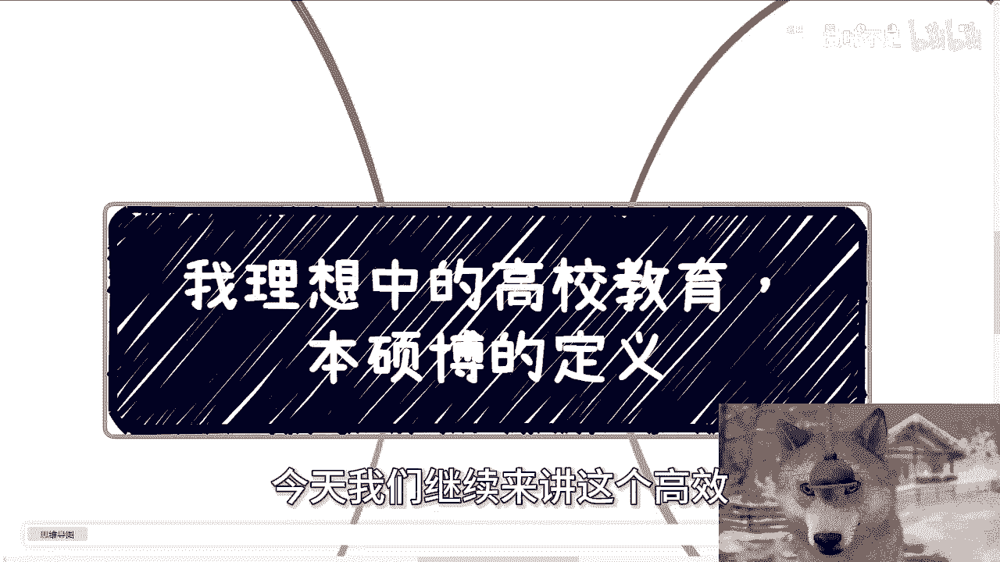

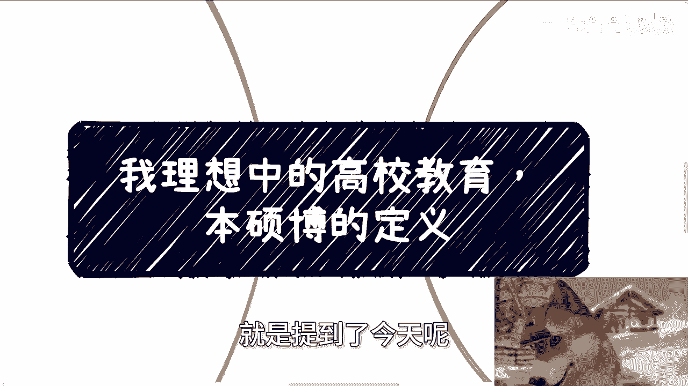

# 课程P1：理想中的高校教育体系——本硕博的定义 🎓

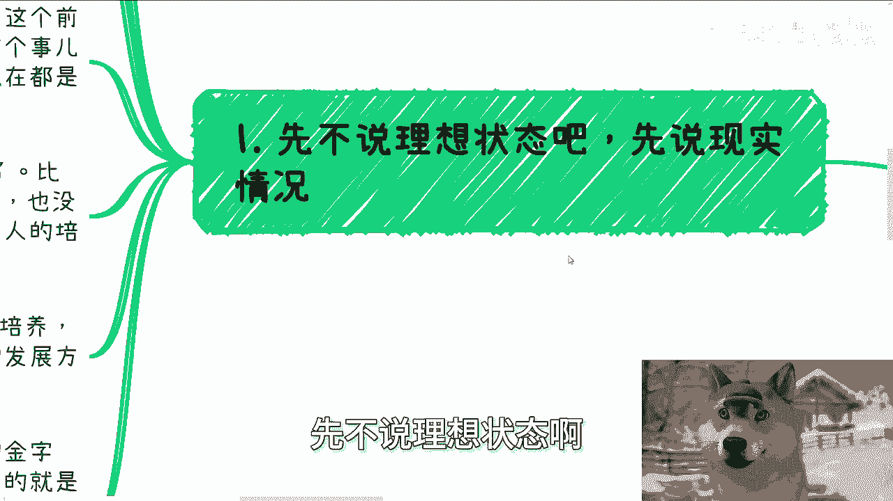

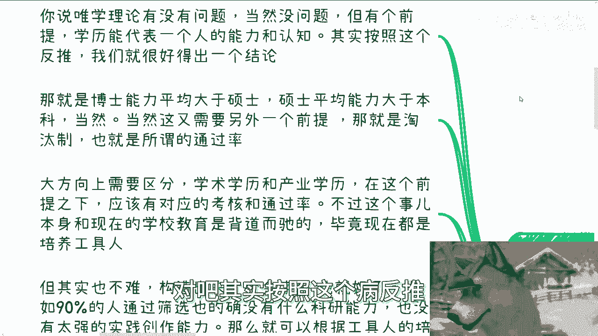

在本节课中，我们将探讨一个理想化的高等教育体系，特别是本科、硕士和博士学位的定义与定位。我们将分析当前教育体系的问题，并构想一个更合理的、基于能力与需求的金字塔式培养模型。

---

## 现实中的学历价值与前提

上一节我们讨论了教育的内因与外因。本节中，我们来看看现实中“唯学历论”的逻辑及其成立的前提。

“唯学历论”本身没有问题，但其成立需要一个核心前提：**学历必须能代表一个人的能力和认知**。由此可以反推，在理想状态下，博士的平均综合能力应大于硕士，硕士的平均综合能力应大于本科。

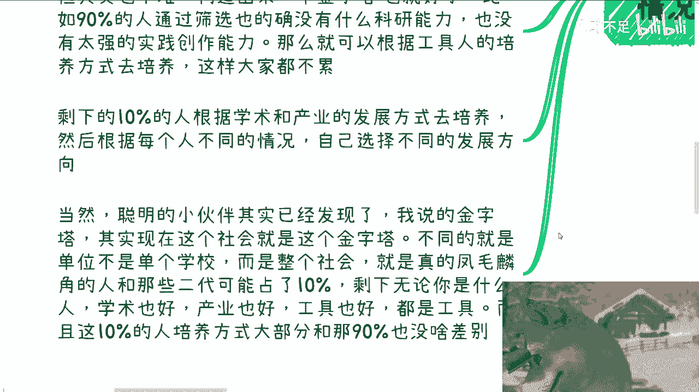

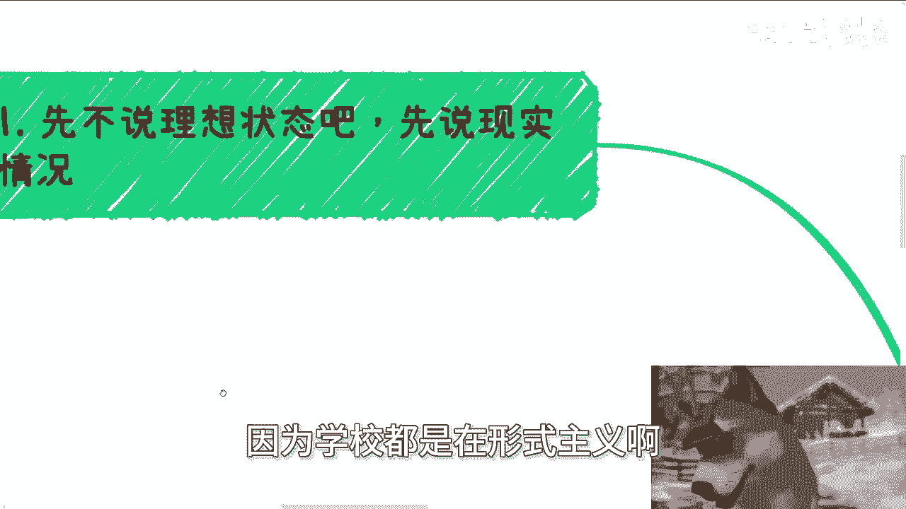

然而，这需要另一个关键前提：**有效的淘汰制**。如果毕业率或升学率接近100%，学历之间就无法体现真正的能力差异。因此，大方向上需要区分**学术学历**与**产业学历**，并各自配以相应的考核标准和通过率。

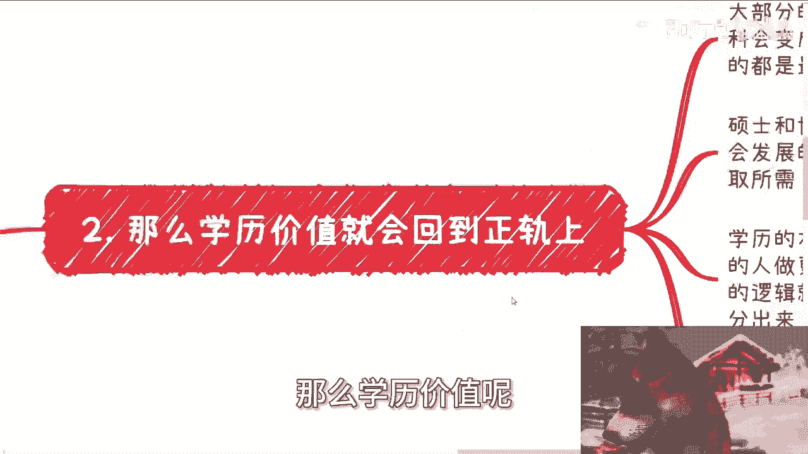

遗憾的是，这与当前学校教育的“工具人”培养目标是背道而驰的。建立严格的筛选体系对学生、家长和社会发展有利，但对追求稳定规模和收入的机构不利，因此现实中很难发生。

---

## 构想：金字塔式培养体系

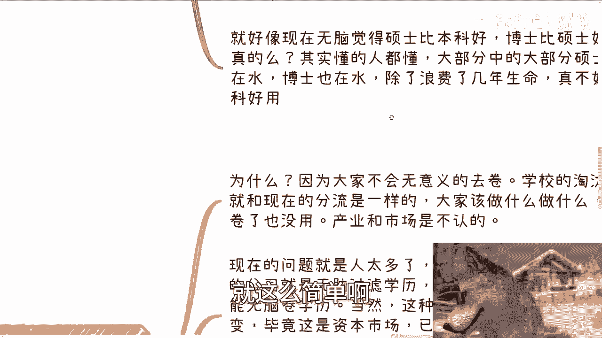

如果要对教育体系进行理想化重构，可以建立一个清晰的金字塔结构。

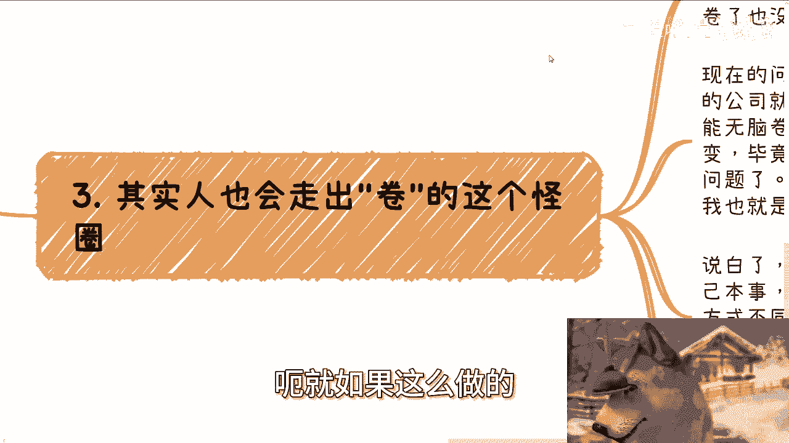

以下是该体系的核心构想：
*   **基础层（约90%）**：这部分学生可能不具备突出的科研、实践或商业能力。可以完全按照“工具人”的培养方式，专注于教授执行层面的技能。这类似于高中阶段的分流，目的是让大家各得其所，减轻不必要的内耗。
*   **精英层（约10%）**：剩下的学生根据个人禀赋和兴趣，分流进入**学术**或**产业**发展路径进行深度培养。学校应提供不同的课程和教育方法，形成一个综合的培养体系。

实际上，社会已经存在这样的金字塔，但筛选单位不是单个学校，而是整个社会。目前，能进入顶层10%的，除了极少数依靠个人努力的“凤毛麟角”，更多是依靠其他因素（如家庭背景）。而无论背景如何，大部分人都被培养成了“工具人”。更关键的是，目前对顶层10%的培养方式，与底层90%的差异并不明显。

---

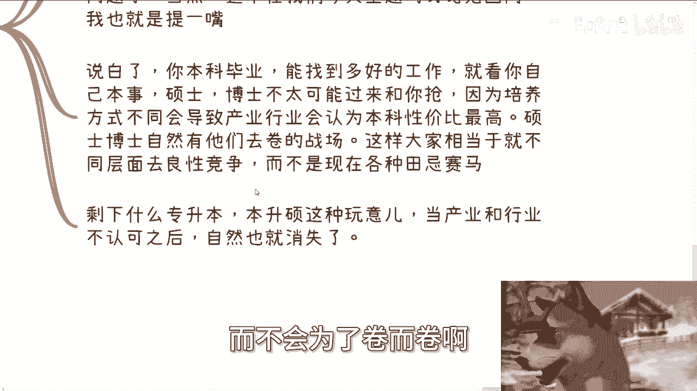

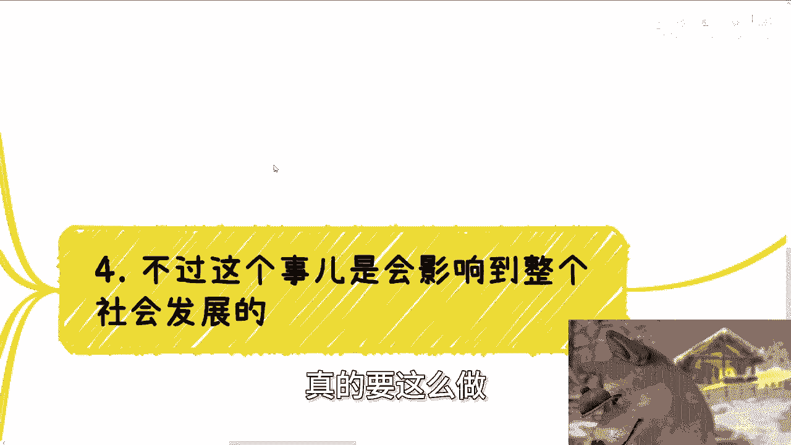

## 理想体系下的三大影响

如果上述金字塔体系得以实现，将会带来几个积极的变化。

### 1. 学历价值回归正轨
在金字塔培养逻辑下，**本科**将成为社会的中流砥柱，胜任大部分产业和行业的工作。而**硕士**和**博士**则更多进入推动国家与人类发展的前沿领域。学历的本质是 **“让合适的人做合适的事，让优秀的人做困难的事”**，而不是像现在这样，所有人都在往同一个“工具人”模子里套，再强行按学历分369等。

### 2. 缓解无意义内卷
当高校层面建立起有效的淘汰机制，并与市场认可挂钩后，学生便不会进行无意义的“内卷”。因为卷也无法改变结果，市场和产业不会认可。本科、硕士、博士因培养方式和技能点不同，将在各自的赛道和层面竞争，形成良性或至少是差异化的竞争，而非现在所有人在同一口锅里“田忌赛马”。诸如“专升本”、“本升硕”等现象，也会因产业不盲目认可而大幅减少。

### 3. 直面社会发展与就业压力
然而，推行这种体系会深刻影响社会发展。它意味着更大比例的学生会在高中或本科阶段被分流或淘汰，导致高中、大专学历或“停滞在本科”的人群比例增加。这相当于减少了通过“混学历”来被动延缓就业压力的缓冲期，让就业问题更集中地暴露出来。

当前就业难感受强烈，正是因为各种内忧外患在短期内集中爆发。理想的教育改革需要一套综合评定体系，评估学生的学术、产业、应变及市场理解等综合能力，而非单一的“做题能力”。但这在当前的惯性下几乎不可能实现，就像悬崖边的1200万应届生，明知危险却只能拼命将身边的人挤下去。

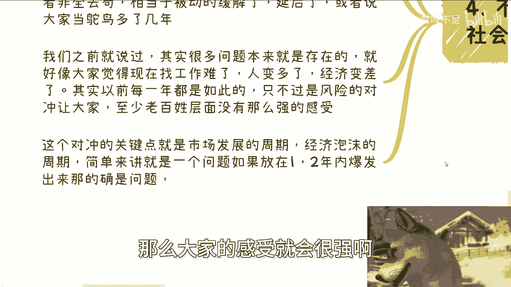

---

## 总结

本节课我们一起探讨了理想中本硕博教育的定义。核心在于建立一个有淘汰机制、区分学术与产业路径的**金字塔式培养体系**，其公式可概括为：
**理想学历价值 = 有效筛选 × 差异化培养 × 市场认可**

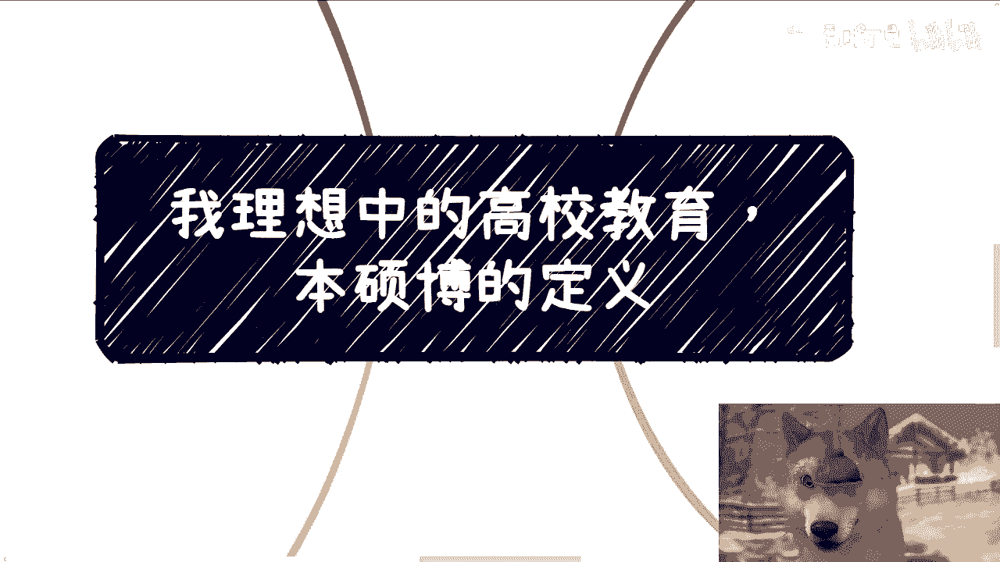

这旨在让学历真实反映能力，使人尽其才，并缓解无意义的内卷。虽然这种改变面临巨大现实阻力，但理清这一逻辑，有助于我们更清醒地看待个人在教育与职业道路上的选择。