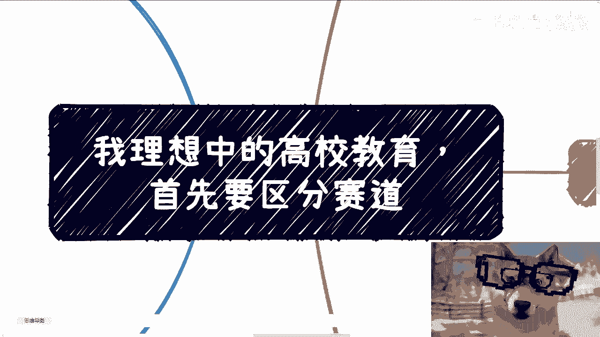

# 课程 P1：理想高校教育之赛道区分 🎯

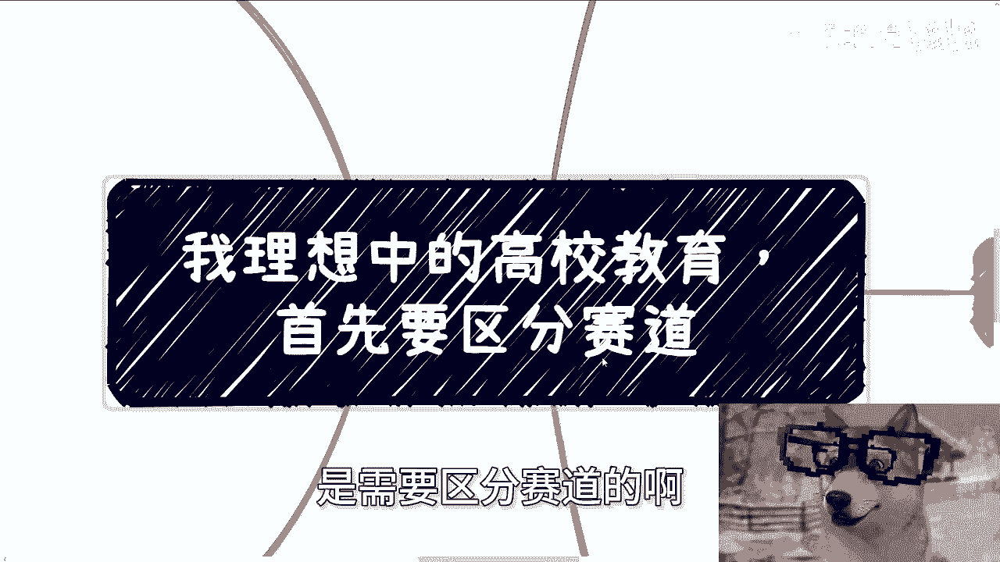

在本节课中，我们将探讨理想高校教育体系的第一步：如何根据学生的不同特质与潜力，进行合理的赛道区分。我们将分析当前教育模式的问题，并提出一个以“承上启下”为核心的过渡方案，旨在帮助学生平稳地从校园走向社会。

---

## 概述：高校教育的核心矛盾

上一节我们讨论了教育的大背景，本节中我们来看看高校教育具体应扮演的角色。我认为，高校教育的核心在于“承上启下”。这意味着它应在学生进入社会前提供一个过渡期，而非仅仅教授脱离实际的知识后就将学生推向社会任其“自生自灭”。当前的状况正是如此，这显然是不可行的。

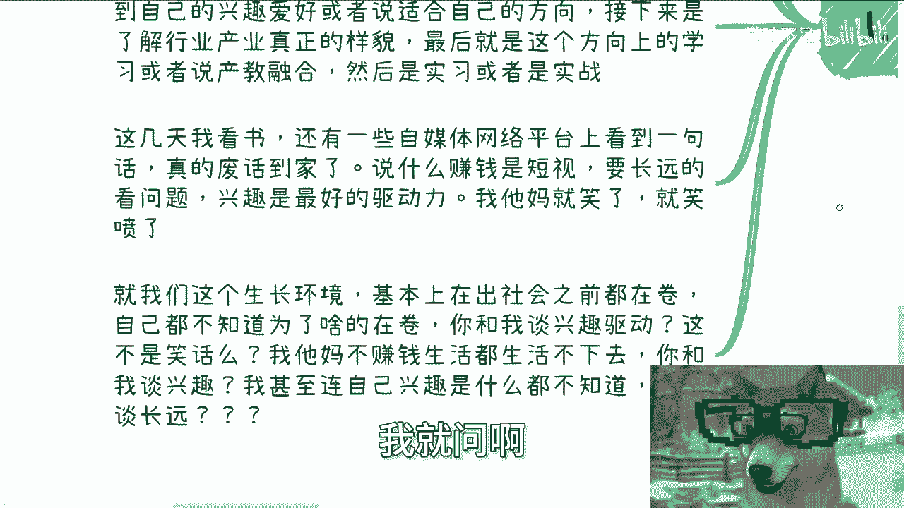

这个过渡过程需要完成几个关键任务。

以下是过渡过程需要完成的三个关键任务：
1.  **帮助学生发现兴趣与方向**：让学生找到自己的兴趣爱好或适合自身发展的方向。
2.  **揭示产业真实样貌**：让学生了解行业与产业的真实运作情况。
3.  **进行定向学习与实践**：在确定的方向上进行深入学习，并通过高比例的实习或实战实现“产教融合”。

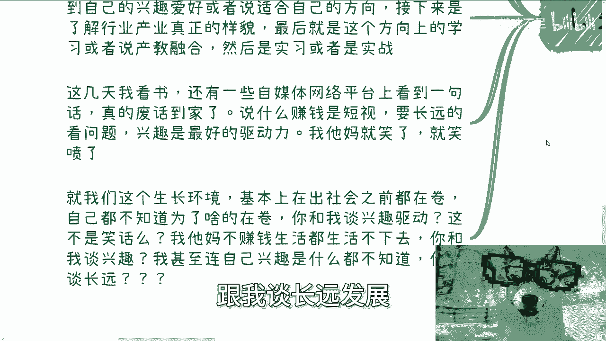

近期，我在一些平台上看到一种观点，认为“赚钱是短视的，长远发展最好的驱动力是兴趣爱好”。这种说法脱离现实。在我们当下的环境中，绝大多数学生在进入社会前都处于一种“为了卷而卷”的状态，并不清楚自己为何努力。在此背景下空谈“兴趣驱动”是不切实际的。首要问题是生存，其次才是发展。更重要的是，许多学生连自己的兴趣是什么都尚未明晰。

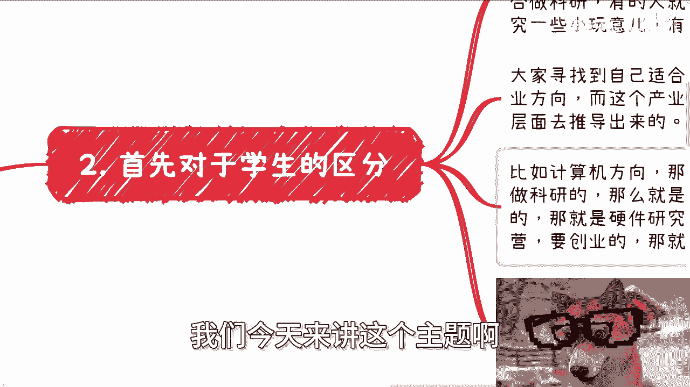

---

## 第一步：区分学生适合的赛道 🛤️

因此，高校教育的第一步是对学生进行区分。这并非指高考后依据模糊的认知或热门排行去盲目选择专业。绝大多数学生并不了解所选专业具体学什么、未来做什么。

高校应做的，是不要急于让学生定专业，而是通过系统的方法，帮助大家探索自己适合的领域。

以下是学生可能适合的不同赛道示例：
*   **科研型**：适合专注学术研究，发表论文。
*   **技术型**：适合钻研硬件、嵌入式开发等工程技术。
*   **创造型**：喜欢动手创造，类似“手工耿”的风格。
*   **商业型**：对市场、运营、创业有浓厚兴趣。

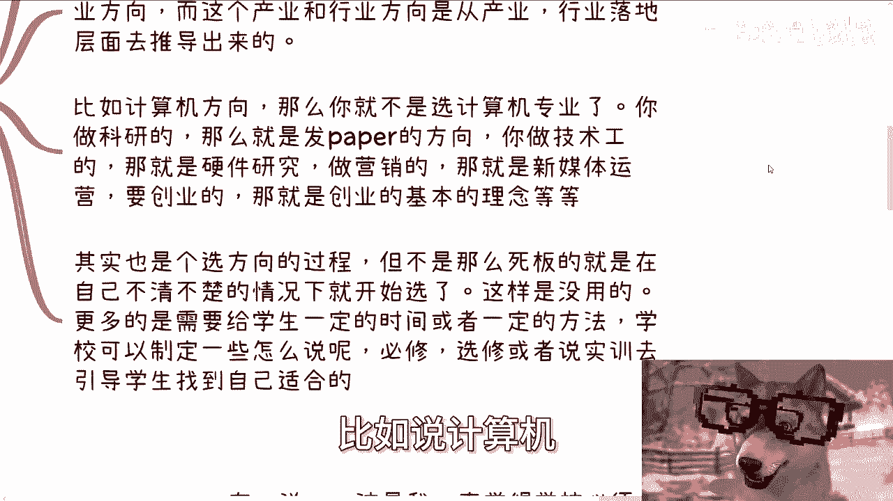

然而现状是，无论学生适合哪条赛道，最终都被一视同仁地推向就业市场成为“螺丝钉”，个人的天赋与特长在此过程中被扼杀。我认为，在学生找到适合自己的定位后，再根据产业和行业的实际需求进行细分方向培养。

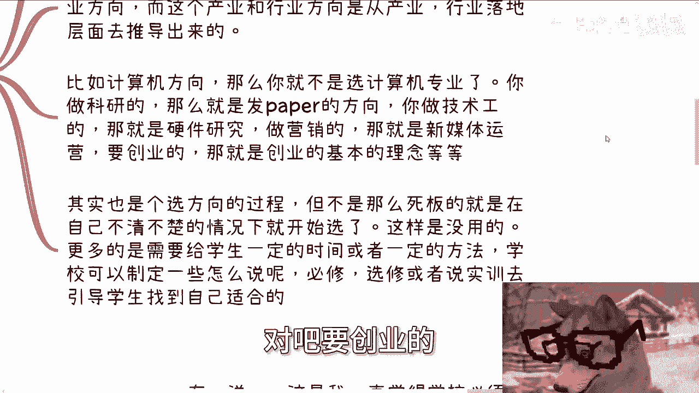

例如，以“计算机”领域为例，不应简单地统一学习“计算机专业”。

以下是基于赛道区分的课程设计思路：
*   **科研赛道**：课程与实训全部围绕**发表学术论文（publish paper）** 展开。
*   **技术赛道**：课程重点在于**硬件研究与嵌入式开发**。
*   **营销赛道**：侧重**新媒体运营**等课程。
*   **创业赛道**：学习**创业基本理念与商业实践**。

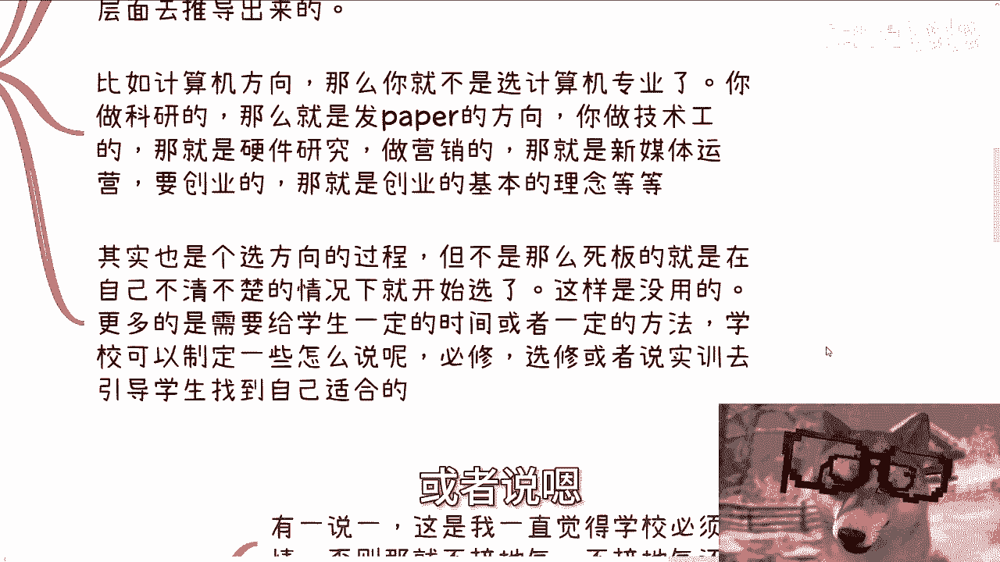

这个过程应是灵活且给予学生充分探索时间的。学校可以通过设计必修课、选修课，或进行全方位的评估，让学生在入学后的一个学期或更短时间内，初步找到自己的方向。

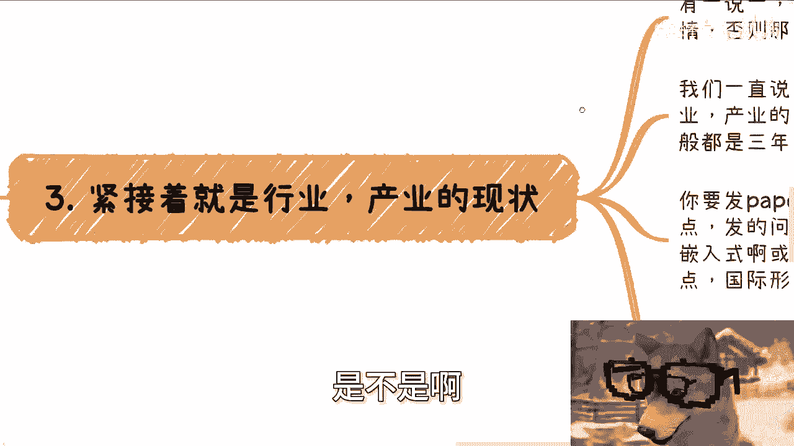

---

## 第二步：了解行业与产业现状 🏭

承接上一步，学校有责任向学生清晰地展示行业与产业的现状。否则，教育便是脱离实际的。教学应相长，我们可以根据近三年的行业发展趋势来设计教学内容。

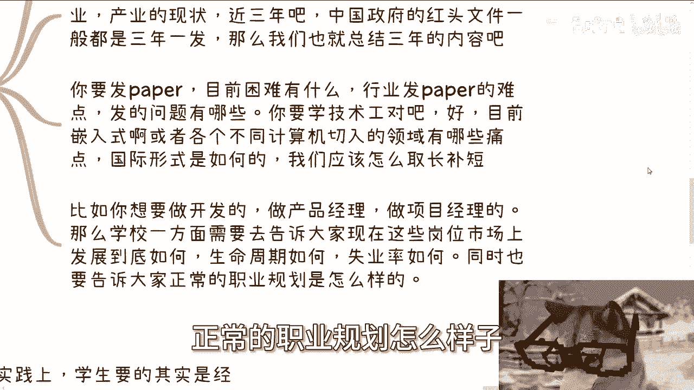

以下是针对不同赛道应了解的现实情况：
*   **科研方向**：应了解当前学术圈**发表论文的难点、热点问题及国际前沿动态**。学生几年的目标就是攻克这些领域难题。
*   **技术方向**：需知晓如**嵌入式**等领域当前的**产业痛点、待解决问题及国际竞争态势**，思考如何取长补短。
*   **应用方向（开发、产品经理等）**：学校应告知学生该领域的**职业生命周期、失业率情况以及正常的职业规划路径**。

有人可能会质疑，这样区分会导致学生基础知识缺失。确实，知识体系如同金字塔，需要坚实基础。但我们区分赛道的目的，正是为了让专业的人做专业的事。例如，一个商业天才不必为了从事航天事业而去精通所有火箭原理，他需要的是与科研人员协作。同理，适合做研究的就深耕科研，适合做应用的就专注开发，不应让所有不同发展路径的人学习完全相同的内容。

---

## 第三步：产教融合与实战经验 🤝

过渡过程的最后，大部分时间应投入实践。学生需要的是经验，尤其是“软着陆”的经验。所谓“软着陆”，是指学生仍在校时，就以学生身份大量接触社会、企业和真实岗位，从而获得直接认知。而不是等到毕业那年被突然推向社会，那是一种“硬着陆”。

当下的许多实习流于形式：学生充当廉价劳动力，企业提供一纸证明。这种“做样子”的实践毫无意义。我们需要的是让学生参与到行业和产业的真实项目中去。

当然，并非每个公司随时都有适合学生的项目。因此，**学校与企业可以联合打造符合当前产业发展的模拟或真实项目**。核心目标是让学生平稳过渡，而非一毕业就陷入“荒野求生”的境地。

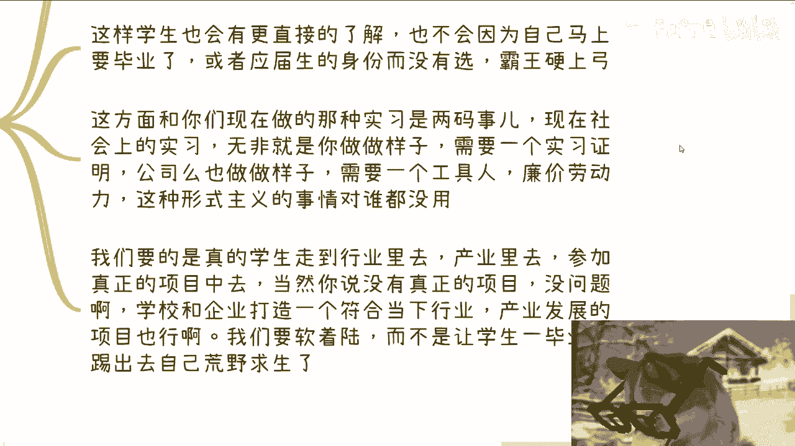

---

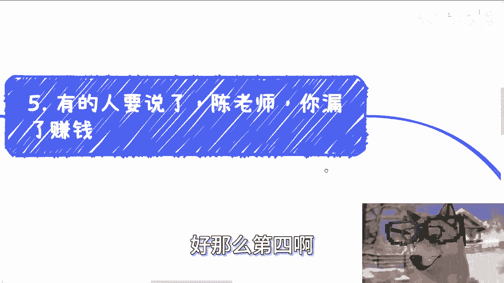

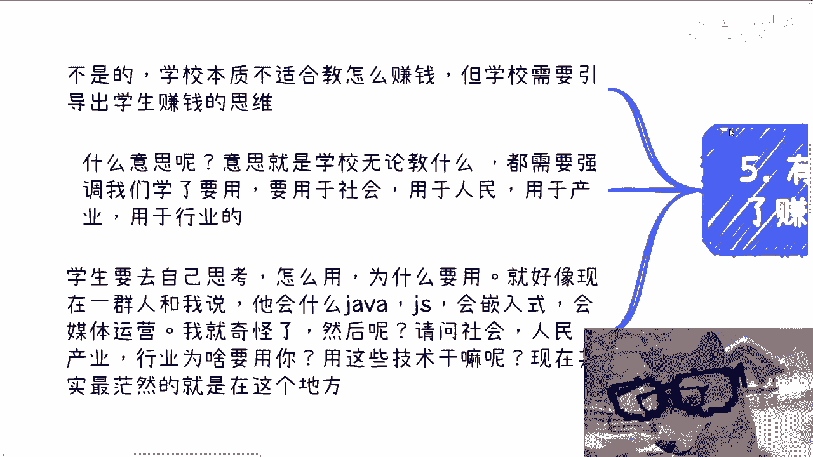

## 第四步：培养学以致用的思维 💡

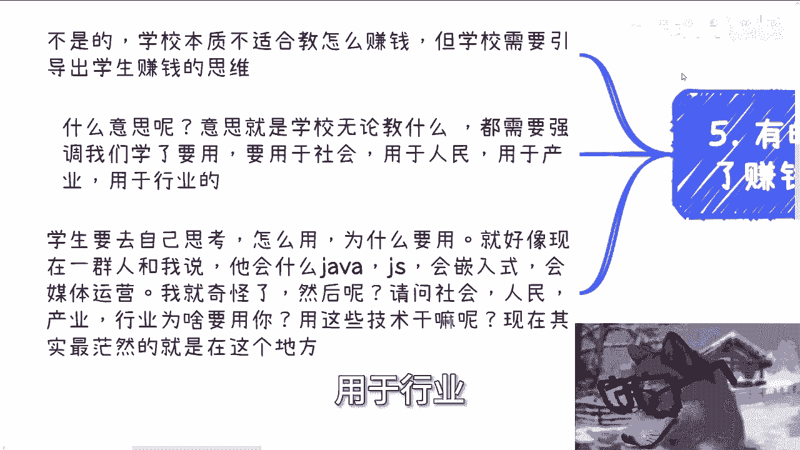

关于赚钱，我认为学校本质上不适合、也难以直接教授“如何赚钱”。但是，学校有义务引导学生建立“学以致用”的思维。这意味着，无论学习什么，都要强调如何将知识应用于社会、人民、产业和行业。

现在很多学生学习了许多技能，如Java编程、新媒体运营、金融知识等，但他们往往不知道这些技能如何具体地创造价值、造福社会，或者如何转化为产业所需的解决方案。这是当前教育导致的最大迷茫点之一。

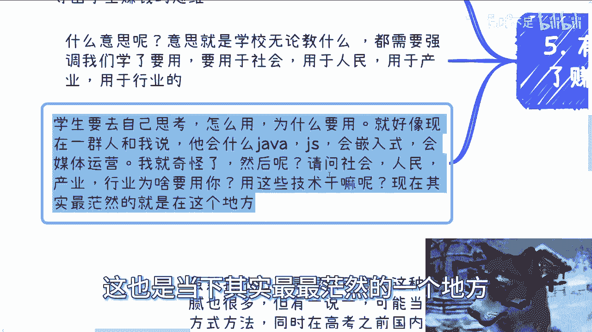

我们不应直接教授具体的赚钱方法，因为无法全面覆盖，学生也容易以偏概全。正确的做法是，呈现正与邪、善与恶的各种可能性，让学生自行判断和选择。而现状是，高校和社会在替学生做选择，一旦进入某个专业，就被绑定在一条路上，没有探索和知晓其他可能性的机会。

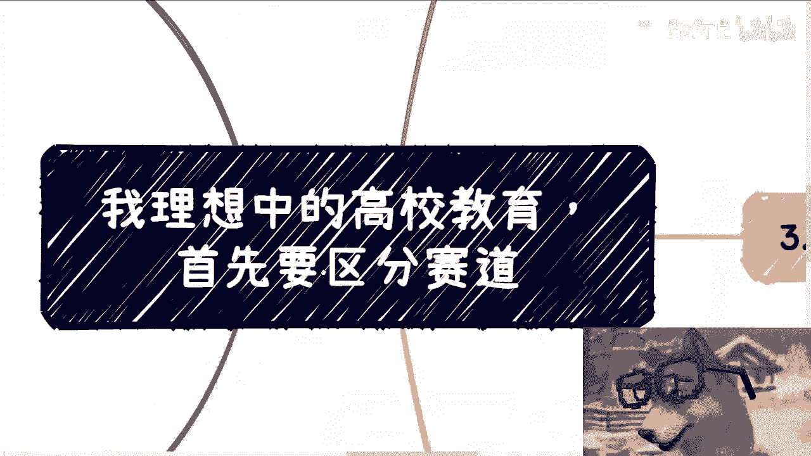

---

## 总结与核心公式

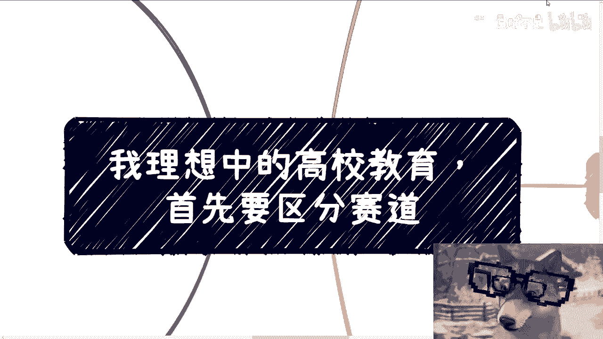

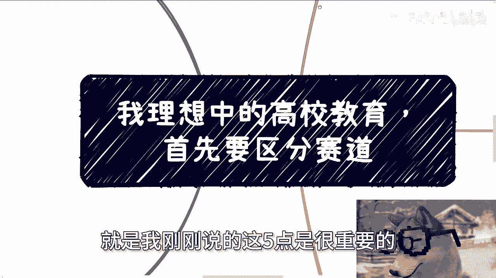

本节课中，我们一起探讨了理想高校教育体系的第一步——赛道区分。我们分析了当前“一刀切”模式的问题，并提出了一个以 **“承上启下”** 为核心的过渡框架。

这个框架的核心在于一个简单的公式：

**理想高校教育 ≈ 发现自我赛道 + 洞察行业真相 + 定向学习实践 + 学以致用思维**

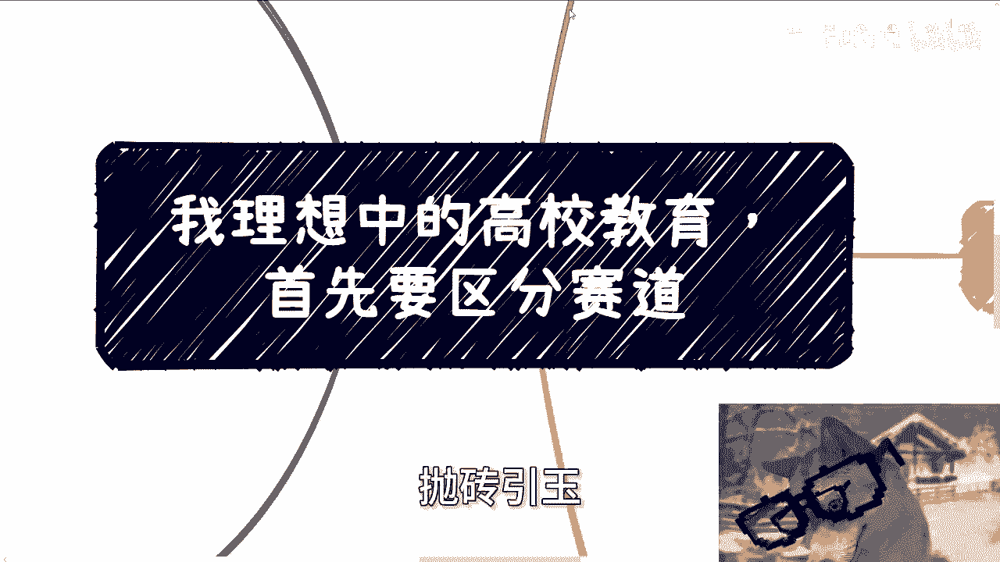

其中，**发现自我赛道**是起点，它决定了后续所有培养内容的针对性。而贯穿始终的目标，是让学生实现从校园到社会的**软着陆**，而非毕业即“荒野求生”。

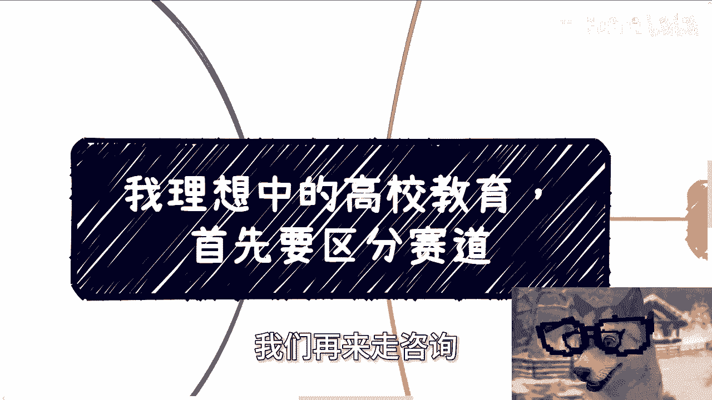

尽管教育体系的改革任重道远，但理清这些核心思路，对于学生规划个人学习、对于教育者思考教学改进，都具有重要的参考价值。