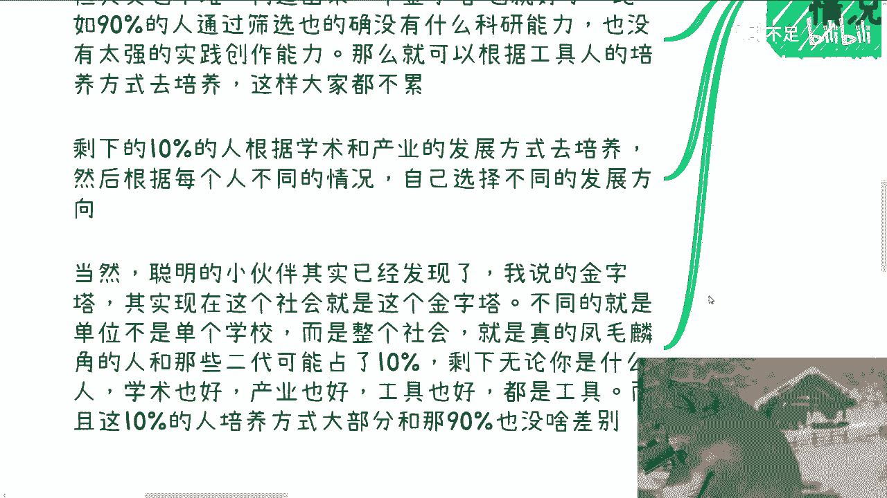
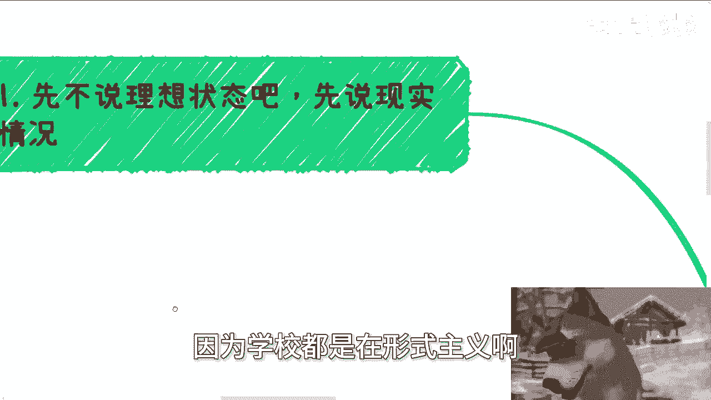
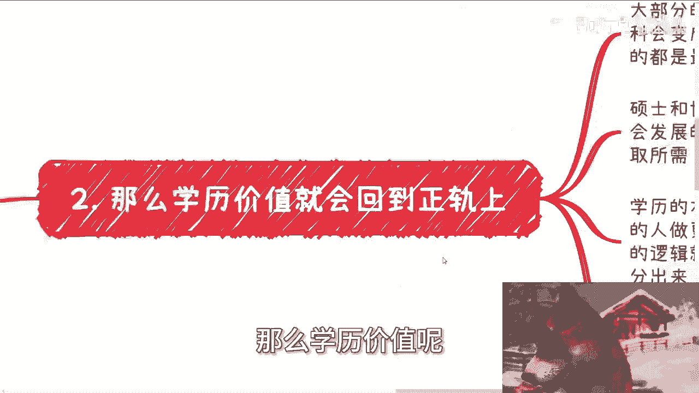
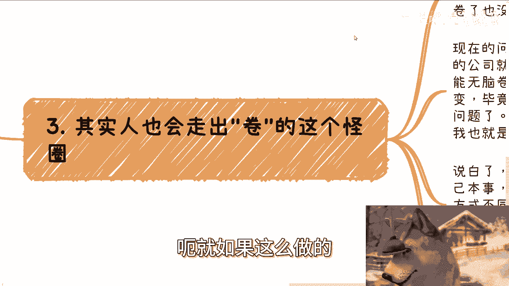
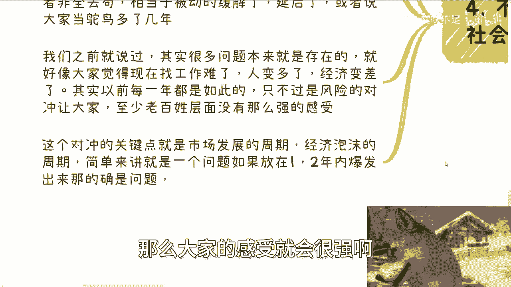

# 我理想中的高校教育，本硕博的定义 - P1 - 赏味不足 - BV1SD11YvEdE

好额，今天我们继续来讲这个高效高效的这个内容啊。

呃今天呢就随着啊，跟着我们上次那个内容来继续来往下讲啊，那么上一次呢，之前我们把这个内因外因讲了一下啊，包括这个老师目前面临的问题啊，那接下来呢就是提到了今天呢。

我就想提到这个本硕博的这个定义啊，那么首先呢先不说理想状态啊。

先说现实当中情况啊，就是说你说唯学历论有没有问题，没有问题，当然没问题，但是有个前提前提是什么，前提是学历，学历他能代表一个人的能力和认知对吧。

其实按照这个东西反推，我们就能很好的得出一个结论，那就是博士能力平均应该是大于硕士的啊，当然我们不说，我们不说，可能嗯就某一项吧，就是说综合上面吧对吧，那硕士平均能力应该是大于本科的。

当然啊这又需要另外一个前提，那就是淘汰制，因为你没有淘汰制，大家都他妈的，比如说升学率对吧啊，不要不要说升学率吧，毕业率99。99%，那你有什么差异啊，你会有差异吗对吧，你通过率很高很高。

你怎么会有差异，那么大方向上呢需要区分学术学历跟产业学历，在这个前提之下应该有对应的考核跟通过率啊，这个是都是前提条件，不过这个事儿，本身跟现在学校教育是背道而驰的，就像我跟你们讲的。

学校教育现在为的是教育出来的就是工具人，他一旦去适应了对应的考核跟通过率，那他等于自己跟自己过不去对吧，所以说这个事情说白了是对学生好，对家长好，对社会发展好的，但是对他们赚钱是不利的啊。

所以这件事情在我看来他不太会发生啊，那么你要说真的要做其实也不难，你只要构造出来一个金字塔就好了，比如说90%的人通过筛选，也的确他可能没有什么科研能力，也的确没有太强的实践创作能力。

也没有太强的商业赚钱能力，那么就完全根据工具人的培养方式去培养，也很好啊，就跟我们说高中50%分流是一样的，这样大家都不累，对不对，但是还是那句话，你说有50%分流也好，90%分流也好对吧。

你不是为了达到这个数据而达到这个数据的，就是他们应该是真正的设置到，就是我们就是要叫做呃课程啊，教育方法或者加各个方面，他得综合的设置一套体系，而不是单纯最终就满足一个啊，到5%，高中50%好一刀切。

对不对，那没有意义的啊，那么剩下10%的人呢，根据学术跟产业的发展方式再去培养，然后根据每个人不同的情况，自己选择不同的发展方向，当然啊聪明的小伙伴其实已经发现了，就是我说的金字塔呢。

其实现在这个社会已经拥有这个金字塔了，与我说的不同的，仅仅是在于说现在金字塔单位不是单个学校，而是整个社会，也就是说真的是那些通过自己努力啊，能够成为那10%的是凤毛麟角。

剩下那10%里面大部分的人是二代对吧，也就是说真正占有那变成那10%的人，可能更多的是一些别的因素，而不是单单纯的说啊，我们通过一些学校的筛选和个人能力筛选，不一样的，那么剩下无论你是什么人。

什么学术也好，产业也好，工具也好，商业也好，随便你都是工具人，这是现在你说是不是金字塔吗。

也是哎，没毛病啊，而且这个10%的培养方式，目前来看，大部分跟那90%其实也没啥太大差别。

那么第二那么学历价值呢就会回到正轨上面。

就是如果按照我说的那种，比如说学校本身或者说整个高校体制，它是一个金字塔的一个一个一个怎么说呢，培养逻辑的话，那么大部分的产业跟行业的工作，基本上本科就能胜任了啊，有一说一就能胜任了。

而且当下经2024年，这个社会企业其实也已经符合这个逻辑了啊，本科会变成中流砥柱，无论是执行层还是管理层，包括创业者都可能是中呃，都基本上中层砥柱，因为呃中流砥柱，因为他的占比比较高，他占90%对吧。

那么本科的都是最佳的选择，当然啊，我指的是本科跟硕士的这个比例当中，占90%，不是说90%的人能上本科好吧，你这个不要不要不要瞎搞啊，然后硕士和博士更多的进入一些推动国家发展，人类社会发展的产业啊。

工作单位或者这个相关的方向上面，学术跟产业各取所需啊，那么学历的本质呢是为了让更合适的人，做更合适的事情，或者说将每一个人的天赋长处发挥到极致对吧，更优秀的人做更难的事情，就就不像就像我们这边说的。

让合适的人做合适的事情，优秀的人做难的事情，而不是说像现在就大家都在做一样的，是工具的事情对吧，而不是说而不是说现在像现在一样，就非要非要去分369等，现在的逻辑就是分369，就是博士大于硕士大于本科。

大家不管你能力怎么样，反正先这么先先这么着了啊，但其实能力跟认知是没有区分开来的，你说有区分吗，有他妈蛋区分啊对吧，就好像现在无脑觉得硕士比本科好，博士比硕士好对吧，其实懂的人都懂，大部分中的大。

就是大部分中的大部分硕士都是在水的，博士也是在水的，这学校在帮忙水，学生也在帮忙水，大家就是一起浪费时间，你管你浪费时间，学生呃，学校管他在那边，就是就是就是就是该往后拖，往后拖对吧，就就这么简单啊。

你要真的从干活上面来讲，真不如本科好用，就这么简单啊。

那么第三其实人呢呃就如果这么做呢。

其实大部分人也会走出这个卷的怪圈，为什么，因为大家不会再无意义的去卷了，你比如说学校的学校对吧，高校层面已经拥有淘汰机制了，对吧就跟现在的那个高中分流是一样的，那么大家该做什么做什么。

你卷了也没有用啊对吧，你说你说你说我可能就是啊毕不了业对吧，那我可能就就是一个叫什么大专学历对吧，那我可能就是硕士毕不了业，那我就本科学历对吧，那你再去卷也没有用啊，市场跟产业也不会认可。

那么现在的问题是什么呢，就是人太多了，市场太大了，很多中下层的公司就是无脑过滤学历啊，当然啊大超市这个大公司也无脑过滤学历啊，那么导致大部分的老百姓呢就只能无脑卷学历，因为怎么办呢。

需求在那个地方对不对，那当然啊，这种在我的认知里面呢是不可能改变的，毕竟这是一个资本市场，这不是一个呵怎么说呢，叫做叫做叫做咳咳咳额读书人的市场对吧，那已经，所以说这个这个事情。

不是不在我们今天讨论的这个范围里面啊，当然我我也就是这么随便一提啊，那说白了你本科毕业能找到多好的工作，就看你自己本事，硕士博士不太可能过来跟你抢，为什么，因为培养方式不一样。

会导致产业行业会认为本科的性价比是最高的，就这么简单啊，而硕士博士自然也有，他们自己要去卷的战场和卷的赛道和卷的公司，他不会跟你来卷，因为相互培养方式不一样，大家的技能点也不一样，那么这样的时候。

大家就相当于是不同的层面，会进行一个良性竞争，当然就算不同的层面进行恶性竞争，也比现在好，而不是像现在一样，他妈的一锅粥田忌赛马对吧，那剩下什么专升本啊，本身硕这种玩意儿，当产业跟行业不认可之后。

自然而然也会也不叫消失吧，就自然而然也会减少很多，也就是说它会存在吗，还会存在的，它的存在更多的是为了比如说呃留学啊，移民啊对吧，或者其他一些硬性门槛，而不会为了卷而卷哦。

那么第四不过这个事呢真的要这么做。

他是会影响到整个社会发展的，为什么这么说，因为这样子你比如说高校也有淘汰率对吧，不包括就是说就像我们说的培养方式，本科硕士博士有不同的培养方式，那么这等于大面积的增加了高中的分流。

你想想看是不是因为他有淘汰率啊，那不就等于更多的人又又又又到了，比如说大专或者中专，对不对，那么还有停滞在本科的比例，这什么叫停滞在本科比例，就是比如说复读对吧，因为因为非全日制。

或者说其他类型的专升本，或者包括复读本身，硕基本上没有太大作用的情况下面，那么自然而然更多的人他会停留在高中毕业，这么个逻辑，或者说本科复读的这么个逻辑，那么你就会有种什么感觉呢。

就会相当于这个雪球没法往前滚了，他滚不动了，那么积在那边的，就是那种没毕业的人会越来越多，或者说低于本科的人会越来越多，那么这个时候就会出现一个问题，那就是说整体如果是高中或者大专，这么一个学历。

或者说堵在本科的这么一个比例会非常多的话，而解决这些人就业压力的，时间窗口就会变得很小，你想想看对吧，因为本来其实就这个也很好理解啊，就是说原本他可以继续读对吧，比如说我我今天没有什么通过率。

不通过率的我我就继续往硕混嘛对吧，硕士混完我就往博士混嘛对吧，那么或者说就是去那些非全日制去苟嘛，或者去那些专升本本身说去苟嘛对吧，那相当于就是说对于整个社会来讲，它相当于是被动地缓解了一定一部分。

一定程度的就业压力，延后之后对吧，延后之后，你说大家当鸵鸟当了这么多年，后面怎么样，没关系，叫什么，那句话怎么说来着，叫做智慧留给后人，对啊，就就寄希望于后人智慧对吧，那后面再说嘛啊那么我们之前就说过。

其实很多问题啊本来就是存在的，这就好像大家觉得现在工作难找啦，人变多了对吧，经济变差啦，其实以前每一年也都是工作难找，人变多了，经济变差了，只不过相对可能的确没有现在这么多啊，但是呢以前是有风险对哦。

风险对冲的，什么叫风险对冲呢，就是这个对冲的关键点主要是市场，市场啊，市场发展的周期，或者说消掉的这个速度，那么简单来讲就是说一个问题，同一个问题啊，如果放在12年内爆发出来，那的确是个问题啊。

这边我后面就不写了啊，就是同一个问题，如果放在12年内爆发出来，那的确是个问题，但是这个问题，如果你把它风险平摊到45年里面，甚至九到10年里面，那他就不是这个问题对吧。

但是现在为什么大家会感受这么强烈，就是因为现在我们面临的问题，在短期内可能比如说疫情是催化剂啊，或者其他各种原因，anyway啊，包括美国降息啊对吧，包包括美国去年各种银行啊，金融暴雷啊对吧等等等啊。

包括第三世界国家，这就各种各样的问题吧，就是综合来讲整个的问题，他在短期内一下子爆发出来，当然中国还有国内就是叫叫什么，就是内忧外患嘛对吧，内忧也有，外患也有，那么综合他在一两年内甚至两三年内爆发出来。

那么大家的感受就会很强啊。

所以说就是我们回到这个核心上面来啊，就是说你说这个事情难不难，它不难，无非就是说培养方式不一样，无非就是教育方式不一样，无非就是说要去设置一定的门槛，设置一定的通过率，通设置一定的考核。

他得综合去评定这个人的能力，而且不单单是呃学术啊，产业啊对吧，包括他的一些随机应变，包括对市场了解能力，他得是个综合能力，而不像现在仅仅是一个做题的能力，他就很不接地气对吧，但是你说有没有办法改变呢。

我觉得很难很难，几乎不可能啊，就是现在这个情况能怎么办呢，没有办法，这就好像哎，这就好像就是说就是说在一个悬崖边，每一年有1200万应届生，然后想尽办法，每个人都想尽办法把身边的人挤下，挤下悬崖。

他明知道对方挤下悬崖要摔死，或者说要摔残摔残掉，但是他不管大家就是拼了命去，然后不不仅耗费自己的精力，还得耗费父母的钱，就是这个样子的，你说他能怎么改变呢，怎么能能让这1200万。

或者让让悬崖边的人一下子停下来哦，大家不要挤啦，大家怎么样子，你觉得可能吗对吧，但是其实如果没有这种定义的话，纯粹的一刀切，从博大于硕大于本科这么一个逻辑来讲的话，说实话它本身非常不利于未来社会发展。

也不利于大家就也不利于老百姓发展啊，行吧，就话只能说到这个份儿上啊，嗯嗯好，那么那个职业规划啊，职业呃工作上面好吧，然后商业规划包括你们赚钱啦，你们跟别人做一些项目啊，做些什么相关东西啊。

你们觉得有任何问题，或者说希望通过跟我的一些呃就是咨询，就点对点的这种沟通，能够给你们一些更接地气的，或者说更适合于你们个人情况的一些发展，建议的话，你们可以整理好对应的个人问题跟个人背景。

