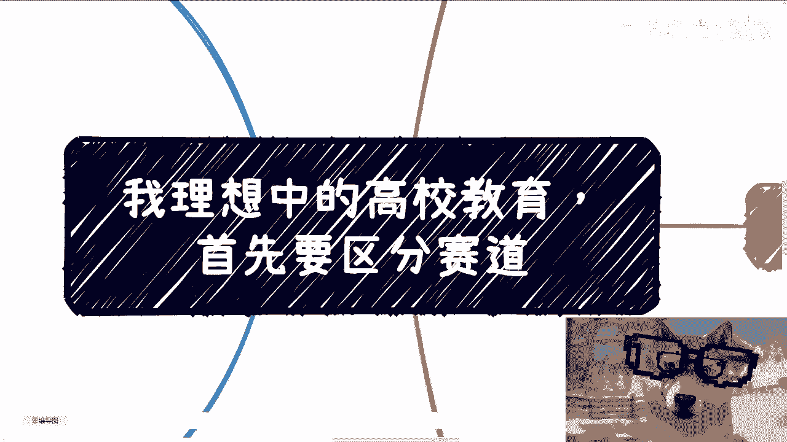
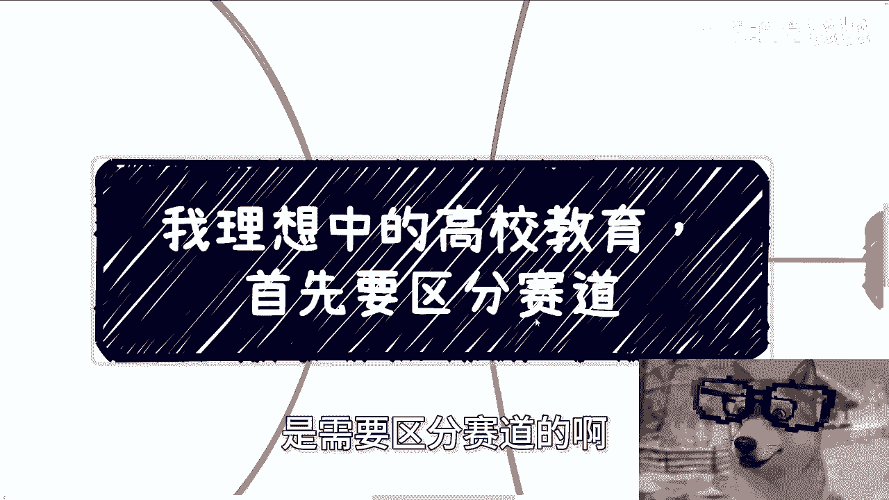
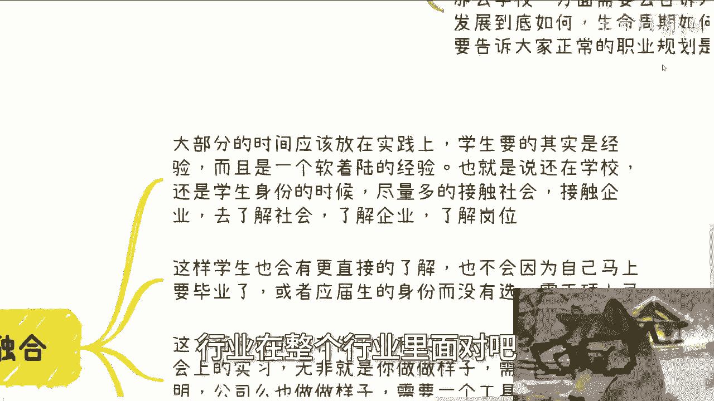
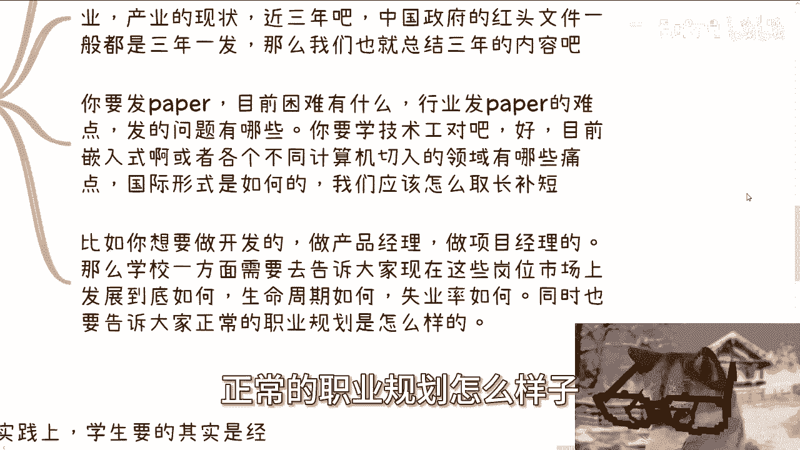
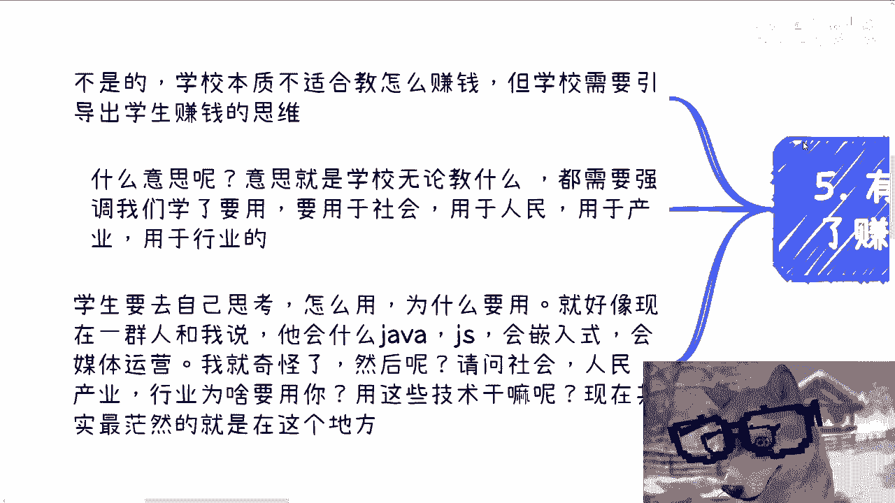
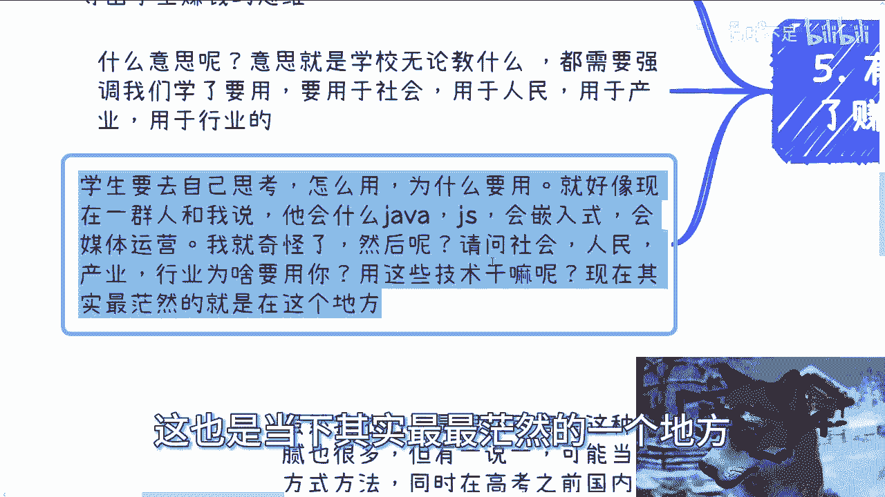
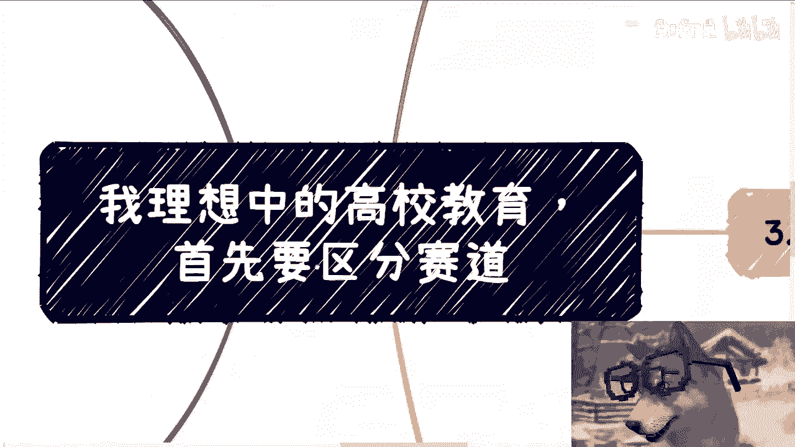
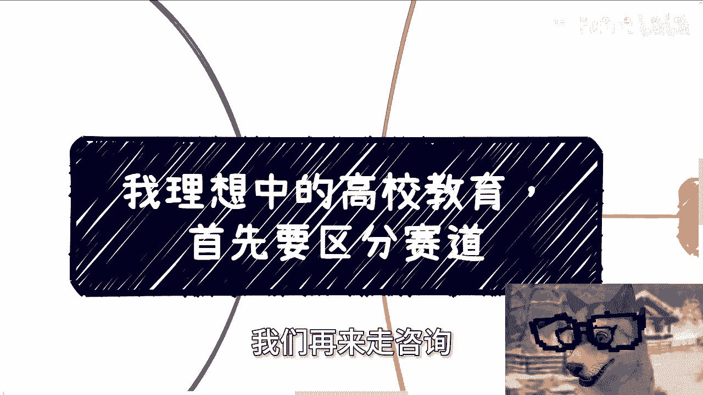

# 我理想中的高校教育，首先要区分学生适合的赛道 - P1 - 赏味不足 - BV1x71oYoE1s

哈喽大家好啊，今天我们这个继续来讲这个高校教育啊，呃我先讲第一个啊，就是我理想当中这个教育情况，首先第一个呢就是我觉得对于高校来讲啊，学生这个群体呢是需要区分赛道的啊。

那么首先我们先这么说，先从学生角度来讲啊，呃虽然我的确咱客观的说啊，我也的确不是很认可高考这种模式啊，而且呢这里面猫腻也很多啊，但是有一说一当下从模式上来讲，记住啊，我只是说模式啊。

不是说高考对你们来讲是唯一的选择啊，就是当下的确找不到更好的筛选方法啊，而且我个人也觉得筛选方法并不是整个教育，现在我们说的是教育当中最大的问题，核心矛盾不在这个地方啊，那么我觉得一方面啊是我们这。

那那就我们说的高考，并不是一个非常核心的矛盾，另外一方面是高考之前，国内大部分的人还是巨婴，其实本质上我们也改变不了什么啊，那么我们就说如果从高考之后的教育来讲，结合海内外的啊。

各个这种国家的这种教育发展啊，我觉得高校的教育核心应该在于承上启下啊，什么叫承上启下，也就是让学生在进入社会之前，他得有一个过渡，而不是说去学一些有的没的，然后他妈的你就把他把学生踢到这个社社会上。

就就就叫嘛，就是自生自灭了对吧，那现在其实就是这么个吊样子，那这个就不行啊，那么我觉得这个过渡呢它是需要这么个过程啊，第一就是要让学生找到自己的兴趣爱好，或者说是找到适合自己的方向。

第二就是聊需要让学生去了解产业，行业真正的样貌，最后一点就是在这个方向上的学习，或者是产教融合，然后是非常这个大比例的那个实习或者实战啊，那么这几天呢我看书，还有一些这个自媒体的网络平台上面。

看到一句话啊，真的他妈的废话到家了，他原话怎么说啊，他是这么说，他说赚钱呢往往都是短视啊，那么他说要长远的看问题，那什么叫长远看问题呢，他说一个人长远的发展最好的驱动力是什么，是兴趣爱好。

我他妈就笑了啊，他妈笑喷了，哎我就问啊。

在我们现在这片土地上，我们的生长环境上面只基本上在你们大部分人，我们说99。9999999的人，在出社会之前都是只在卷，而且大部分人都不知道为了什么在卷，你们只是为了卷而卷，你跟我谈兴趣驱动。

这不他妈不是笑话吗，哎我他妈不赚钱，我生活怎么喝西北风啊，啊兴趣爱好养我吗，对不对，你跟我谈兴趣爱好，另外一方面，我甚至连他妈自己兴趣爱好是什么，你跟我谈什么东西啊，啊跟我谈长远发展。

对不对，但是话又说回来，我敢打赌啊，就是什么啊，赚钱是短视的，要长远发展，兴趣爱好是最好的驱动力，我敢打赌，他妈的起码50%的人听到这句话，觉得是有道理的，但是他妈的有什么道理啊，有什么鸡儿道理啊。

啊我还是那句话啊，你们不要看到任何的语言，就是感觉有道理有道理没有用，你懂吗，就是你活着是要有一个实际落地的东西，你但凡跟我说这句话，哎听上去很有道理，有卵用啊啊有卵用啊，对不对啊。

好第二我们今天来讲这个主题啊。

首先我觉得第一点是对于学生的区分，其实很简单，就是并不是学生高考之后，就根据什么莫名其妙的这种方向，来他妈选什么专业，选他妈什么G2专业啊，对不对，我还是那句话，99。9999999%的人。

你们都不知道他妈的选这个专业，这个专业里面到底学什么，你们也不知道这专业未来做什么，你们选选什么玩意儿，是不是啊，莫名其妙哦，有以为他妈的交了两三万咨询费，就他妈的交选好啦，好个好个屁啊啊啊。

那么这个东西呢就是高校里面第一步要做的，就是说先不要着急选，而是需要通过一定的这种方式方法，让大家去寻找到自己适合什么，你比如说有的人他就适合做科研，有的人就适合做技术工，有的人就喜欢研究一些小玩意。

比如说那那像手工耿这种，有的人就喜欢做商业，你们现在呢对吧，你们现在是什么，你们现在是有的人是有的人是适合做科研，适合做技术工，但是一视同仁，反正毕业之后出来都是找工作，都是都是螺丝钉。

那这个有什么用啊，你不就是这大家就都都在说，什么叫做把自己的长处呃呃呃呃叫什么，越来越多的发展自己的长处，发挥到自己的长处，发挥什么玩意儿哦，到最后是什么，到最后是适合做科研的，适合做技术工的。

适合研究这些小玩意的，适合做商业的，全部他妈的在那边卷那些有的没的各，每一个人的天赋全部都是被扼杀掉，对吧啊，然后呢我觉得大家寻找到自己合适的点之后啊，然后开始分产业跟行业方向，而这个产业跟行业。

行业方向是从产业，行业落地的层面去推导出来的啊，那么我们打个比方，比如说计算机。

你不是就选计算机专业，这他妈没卵用，你比如说你是做科研的，那么就是比如说你接下来的这个专修课呃，这个必必修课选修课对吧，包括你的实训方向，全部就是跟发paper有关。

你你的整个课程的内容就是跟发paper有关，跟就是跟做科研有关，就这么简单对吧，你做基础功能，那就硬硬件研究对吧，这个嵌入式做营销的就是新媒体运营对吧，要创业的。

那就创业的基本理念等等等都行啊对吧，其实我觉得这就是一个选方向的过程，但不是那么死板的，就是在自己不清不楚的情况下面，就他妈开始选了，有什么好用，有什么用啊，啊现在就像我们说的啊，网络上跟你们讲啊。

选计算机好啊，然后之前跟你们说选土木好有用了，咳咳，我觉得更多的是需要给学生一定的时间，或者一定的方法，那么学校可以制定一些比如说必修课啊，选修课啊，或者说其他的一些，你说你说你说这种叫什么。

就是各种各样全方位，361度的这种评估吧对吧，你要让学生至少比如说在半学期对吧，或者说嗯叫什么1/4学期里面。

找到自己合适的方向吧，是不是啊，那么这第一第二紧接着就是行业产业的现状。

有一说一啊，我一直觉得学校是必须告诉学生这件事情的，否则就是学校就是不接地气，你不接地气，你还教育什么玩意儿，对吧啊，那么我们一直说教学相长，其实我们现在可以根据啊，这个不同的行业产业的现状。

比如说近3年，往往也都是3年一发的，就就不叫3年一方吧，就是3年一规划一方啊，那么我们也是可以总结3年内容啊，比如说你发paper目前困难，有什么行业在整个行业里面对吧。

发paper到底都有哪些难点，发的问题有哪些，整个国际上大家怎么发的，对不对，那么你要做的无非就是通过3年，通过4年通过，哪怕是硕士7年，你得攻克这些问题，这是你要去做的，不是学那些有的没的对吧。

你要学技术工对吧好，那么目前比如说圈入式啊，或者计算机相关领域的其他的一种，这种这个产业里面有哪些痛点，当下有哪些需要这个这个要去做的问题对吧，国际形势是怎么样的，我们应该怎么取长补短对吧。

比如说你想做开发，做产品经理，做项目经理，那么学校一方面得要去告诉大家，生命周期怎么样，失业率怎么样，同时也得告诉大家正常的职业规划怎么样子好。

那么你看啊，说到这有的人肯定会在想啊，他说那陈老师你这么去划的划啊，就有的人可能是属于那种呃基础知识会缺失嘛，因为我们说一跟一个人的这个技术基知识储备，他是一个怎么说呢。

一个一个一个一个一个金字塔型吧对吧，就是说他有很多是基础知识，我们叫做类似于像国家的基础建设是一样的，我跟你讲，你没毛病，你说的对，但是我们之所以这样区分，就是为了专业的人做专业的事情，很简单啊。

我打个比方，我打个比方啊，比如说我现在是个商人，我现在是个生意人，或者我现在就是对你们来讲，我可能是个资本家，对吧好，那么我打个比方啊，我今天跟那个埃隆马斯克一样，我是做这个航空的，我是做火箭的。

那我就请问了，我可能是一个非常擅长于做商业的这么一个人，怎么滴啊，你非要让我把他妈的火箭原理全部学一遍，有意义不了，明白吗，哦也就是说你专业的人做专业的事情，你要做研究，那就科研对吧，研究人员去做。

你要你要做应用层的对吧，就像我们我们在这个地方写的，你要做开发，做产品经理的，你就做应用层，你不要所有的人最后的发展嘛不一样哦，所学的东西是一样的，你觉得呢对不对啊。

第四产销融合大部分的时间应该放在实践上面，学生要的其实是经验，而且是一个软着陆的经验，就像我一开始说的，学生要的不是一个你学校他妈的毕业之后，或者毕业就最后一年就把我踢出来，你们就他妈可以自自生自灭了。

这叫什么，这叫硬着陆对吧，软着陆是什么意思，意思意思就是说你学生还在学校，还是个学生的身份，尽量让他们多去接触社会，接触企业，了解社会，了解企业，了解岗位，这样学生也会有更多的这个直接的了解。

也不会因为马上自己他妈要毕业了啊，自己或者说要失去，好像要失去这个应届生身份了，然后没得选对吧，现在很多学生是因为他没能力吗，不是啊，就是因为他妈的被被怎么说呢，被就是在自己还不不不太清楚的情况下。

不太懂的情况下，就他妈被往外推啊对吧，那这方面和你们现在做的那种实习啊，我觉得是两码事，现在社会上的实习无非是你做的样子，企业给你个实习证明，公司也做做样子，公司就是需要一个廉价劳动力。

你们双方他妈都是在做做样子，那么这个东西有卵用啊，啊对吧，一个一个一个一个没有意义的事情，为了他妈的怎么说呢，制造工具人要制造工具人对吧，我们要的是什么，要的是学生真正走到行业里面。

产业里面去参加真正的项目，当然啊你说并不是每个行业，每个产业，每个公司都有真正项目的对吧，好没问题啊，学校跟企业可以打造一个符合当下产业，产业发展的行业发展项目吧，对不对。

我们要的就是让学生能软着陆，而不是让学生一毕业就他妈的被高校踢出去，荒野求生啊，好那么第四啊，第五有的人要说了。

他说陈老师，你漏了一点赚钱，我跟你们这么讲啊，我觉得学校本质是不太适合教怎么赚钱的。

而且他没法教啊，但是学校是有义务，我个人认为啊，学校是有义务去引导学生赚钱的思维，什么意思啊，意思就是说学校无论教什么东西，都需要强调我们要学以致用，什么意要用呢，就是你学的东西你得明白怎么用于社会。

用于人民，用于产业，用于行业对吧。

但是问题是我就问你们啊，你们今天看这个视频的人，你们知道你们学的东西怎么用吗，请问你们知道吗，这就好像现在有很多人跟我说，哎呀我他妈学什么java，什么JS嵌入式，会新媒体运营对吧，我会做什么医呃。

医疗医疗器械对吧，我我我我我会什么什么金融知识，我就奇怪，然后呢，我就请问你手上的技能怎么用于社会，怎么用于人民，怎么用于产业，怎么用于行业，或者话又说回来，如何造福于社会，如何造福于人民。

如何产业用你这个东西如何赚钱，行业用你这个东西如何赚钱，行业和产业社会人民为什么要用你，你知道吗，你不知道，你只知道你学的这些东西，你知道怎么用吗，对吧，这也是当下其实最最茫然的一个地方。

对吧。

所以说所以说一样的，就是我不认为我们得要去教学别人怎么去赚钱，因为你怎么赚钱，你去教他，你又不可能全面覆盖，你只能覆盖一部分，但是学生不知道学生很容易出现，就是说你只覆盖一部分，他只了解那部分。

那到时候怎么说呢，到时候又得来说了，哎你们只说这些别的你们不说的对吧，没有意义，你明白吗，我觉得很简单，正和邪善跟恶，你是要让学生去判断，让他们去做选择，我们不要去帮他们做选择，但是现在你会发现是什么。

是整个高校，整个社会强制学生在做选择，没得选，你只有你，你只要进了这个专业，你就一条路走到黑，你有你有什么选择，你知道什么东西，你什么都不知道，对不对。

啊所以说我觉得在这里面，就是我刚刚说的这五点是很重要的。

而你说啊就是说他的这个教育形式，是不是还是必修课，选修课对吧，是不是说还是这种学期类型的，这无所谓，因为他的表现形式是怎么样，你比如说哪怕是上午上上课，下午自由活动都无所谓，因为这只是形式上的问题。

更多的是你这个3年学制，4年四年的学制，或者说硕士的3年学制，你这个学制里面的这个内容你是怎么去定义的，对吧啊，所以我觉得今天第一个我要讲的就是什么，就是其实要让本身要让该适合适的人，做适合的事情。

而不是说现在一刀切，现在他妈就是一刀切啊，当然啊我还是说我那个前提啊，就是说我只是说我的观点啊，并不是说一定一定会改，而且我也我从我的认知来讲，我觉得大概率不太会改，而至少在你们有生之年。

在我有生之年不太会改啊，所以呢我也就讲出来大家怎么说呢，讨论讨论是吧，抛砖引玉嘶好吧啊。

这个就这么着啊，回头我会再跟你们再讲别的这个方面的，因为今天只是来讲赛道，好吧行吧，那就这么着啊，那个呃职业规划就工作上面好吧，商业规划啊，你们副业啊，或者其他自己赚钱啊。

或者想要有一些业务上面的沟通啊，你们希望通过跟我的沟通呢，能够给你们一些更直白的建议，或者说让你们少走点弯路的话，你们可以整理好对应的个人问题跟个人背景啊，然后私信我，我们再来走咨询好吧啊。

