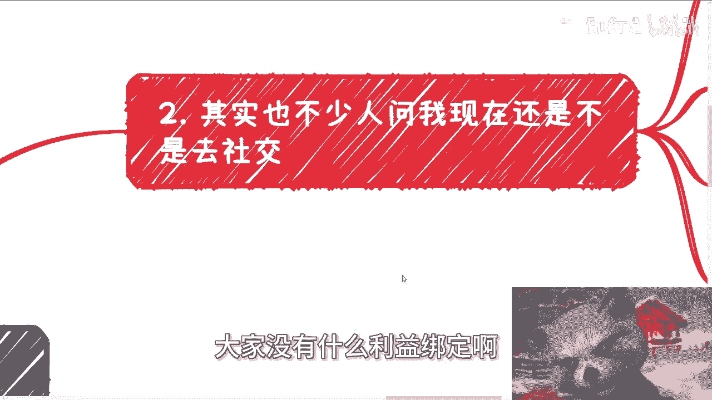
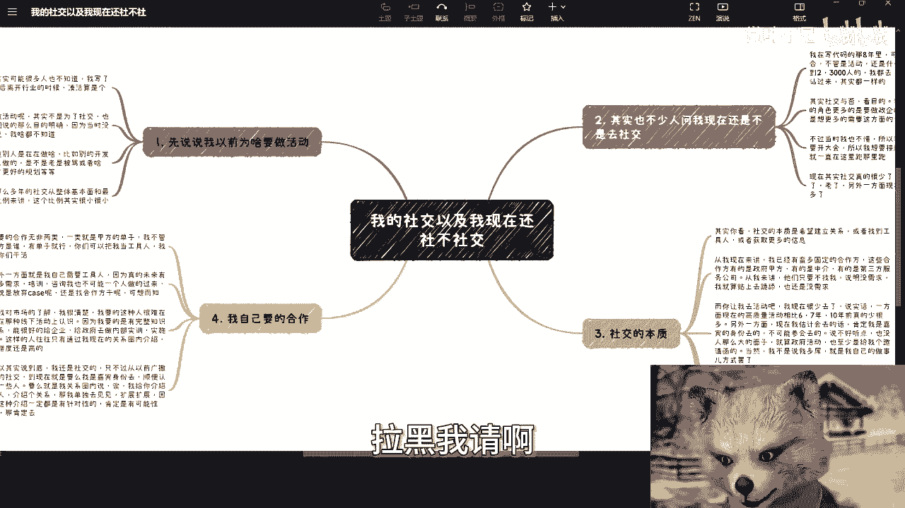

# 我的社交以及我现在还社不社交 - P1 - 赏味不足 - BV1MT421v7Zz

好大家好，今天我们来换个话题讲啊，就来讲一下我的这个社交啊，以及很多人其实也问我这个问题，他说陈老师，你现在还社不社交啊。

嗯首先啊我先说说我最早的时候，就比如说毕业的时候为什么做活动啊，众所周周知啊啊好吧，可能很多人也不知道啊，就是我写了将近8年的代码啊，最后离开行业的时候呢，就是凑合啊，凑合算个架构师啊。

呃我最早的时候为啥做活动呢，很简单，就不是为了社交，因为我当时他妈的屁都不懂啊，呃也不是说像我现在跟你们说的那么目标明确，因为当时就没有我这么一个人跟我说这些话，那么我肯定什么都不知道对吧。

我只是单纯的呢想知道，就是说哎别人做开发怎么做的，别人做开发在公司里面怎么做的对吧，别人这个自己的这个职业规划怎么做的啊，别人是不是也在公司里面老他妈被骂啊，因为当时还没有PUA这个词对吧。

还不知道什么是PUA呢对吧，是不是说怎么样怎么样，就是或者说我多想问问别人，比如说这个目前做下来感觉怎么样，反正就是反正就是说核心点是什么呢，就是我对这个社会，对除我以外的那些除公司以外的那些人。

我一无所知，我就有种就是完全未知的恐惧对吧，那我肯定就是想多去了解一些人嘛，但是问题是你想嘛，我毕业那个时候，你说呃这个网络上对吧，短视频肯定是没有的啊，呃呃网络可能也没有现在这么发达。

你说我想去了解怎么了解呢对吧，那我当时就就想了个很笨的办法，就是要么我自己去办活动，因为我办活动的话就只就能够一对多嘛对吧，因为我当时的想法很简单，就比如说我办一下午，那我一下午就哪怕只来五个人。

那我至少也一下子能认识五个人吧对吧，我都了解了解嘛，因为我的内容很直接嘛，都是就是说面向技术，面向开发，面向测试，面向运维的，那我就多了解了解，当时是这么个想法啊，但其实大部分前面呢很多年的社交啊。

从现在回过头回过头去看，放马后炮的话，就其实呃很多之前那些年的社交，从整体基本面跟最终给我带来的利益，那个比例来讲的话呢，其实前面很多年的这些社交的这个作用啊。

其实额不多啊，其实不多，其实蛮小的，那么为什么不多呢，就像我刚刚说的，就说因为我之前的很多社交目的性不强啊对吧，你说交朋友吧，也不算交朋友，你说了解吧，也就了解你妈，大家没有什么利益绑定啊。

那么第二点呢，其实也不少人问我现在还是不是去社交嘛对吧，你看啊，我在写代码的这8年里面，可以说去了无数的社交场合，不管是活动还是什么峰会啊，还是什么论坛啊，还是什么闭门会议呀呀反正什么名字都有对吧。

换汤换换汤不换药，小到十个人，大到两三千人的，我都去啊，我也一个一个跟别人搭讪，哎我跟你讲都一个都都这么过来的，没区别的，因为你没别的路啊，啊我跟你讲啊，其实社交与否呃，社交与否啊，就当下。

比如说你问我，我社交与否看目的就是我在移动互联网的时候，我的角色更多的是就是想要去做正气的咨询，内训对吧，那那我其实就想要更多这方面的这个甲方，不过当时我不懂啊，所以我认为啊我要找的是甲方。

同时呢我也我也要开大会，我想要去积累我大会上更多的嘉宾，所以我就会一天到晚到这个活动窜，那个活动窜对吧，这个这个什么闭门会议会议跑跑那边跑跑啊，呃现在其实社交真的很少了，因为一方面呢现在也没这个精力。

也不像当时就跑得动啊，老了啊，那另外一方面呢，现在想法跟逻辑会比以前清晰很多，因为你看啊，我在这边说了，我说我以前想法呢就是想找甲方，以及我想去积累更多的嘉宾，其实这些想法对不对对，但这些想法太过片面。

你知道吧，这就好像就说我认为我想去找甲方，但是事实角度是什么，就是我根本就找不到甲方，因为甲方根本就不会吊我，但是我当时不知道啊，是吧啊，你包括就是说我想积累积累，接触和更多的嘉宾对吧，也没问题。

但是核心并不在于我积累更更更多的嘉宾啊，核心是在于说开这个大会时候应该怎么营销，应该怎么让更多人付钱，应该怎么拉到更多赞助，这个是核心，但我当时也不知道对吧，所以说你们可以理解为就是说很多时候呢。

就是目的不是那么明确，或者目的跟结果不是那么匹配，那么你的很多社交就会变成一个无效的社交啊，那么第三我们就说社交的本质啊，其实你看啊社交的本质是希望建立关系，或者找到工具人，或者就是获得获取更多的信息。

无非就这三点没了对吧，因为建立关系，为了什么为了合作赚钱，找到工具人，为了什么，为了减少成本，然后获取更多信息，为了什么，为了赚到更多的钱对吧，其实无非就这三个目的没了，真的没了啊，你你别跟我说谈恋爱。

谈恋爱不在我的这个范围里面啊，那么从我现在来讲啊，你想啊，我现在已经有蛮多的固定的合作方，这些合作方有的是政府，有的是企业，有的是高校，对我来讲其实足够了，就是我也不贪对吧，对我来讲有若干个就足够了。

你说我他妈的中国各地方都有，那我也没这本事啊，那么有的是政府，有的甲方，有的是中介，有的是第三方服务公司，那么你从我来讲，说白了我心里要有逼数，什么叫我心里有逼数呢，就是他们只要不找我。

说明没有需求是没有需求的时候，就算我贴上去跪舔送茅台也没有用，为什么，因为没有需求就没有需求，你再上去送，人家还还能还能给的，天上掉出来个需求吗，那不好意思，人家也没这个本事对吧，而你让我去活动吧。

我现在也很少去了，因为说实话一方面啊，2024年，现在中国的这个高质量的活动，相比67年相比10年前真的是少了很多，这有一说一啊啊，那另外一方面呢，现在我估计会去的话呢，我肯定也得以嘉宾的身份去。

你肯定也得邀请我去，你不可能说他妈的我就参会去，那我这么吃饱了撑的嘛对吧，那说句不好听的，你要我参会去，也没有人有这么大的本事啊，有没有人有这么大的面子，因为就算政府活动也至少给我个邀请函啊，当然啊。

我不是说我多么吊，而是说我总归要有我做事件方式对吧，你就说说我自己傲慢也好，说我骄傲也好，都都行，无所谓，但是我总归得有个有个有个有个边界感吧对吧，你总不能说什么都去吧啊而且现在很多信息啊。

我可以通过朋友圈或者我定点的去问，我是能获取到的，我没有必要一定要线下去跑啊，而且真的要了解什么，我可能一个微信或者一个一个微信的电话，我也能找到对应的人啊，当然所以说啊。

大家其实明白社交的本质就是建立关系，各种关系是为了未来服务的，你就像我现在说的这些东西哪里来，这些东西不还是以前这个广撒网的社交来的吗，对吧，你说啊你出生就来，那不好意思，我没这个。

我我投胎投的不好是吧，那么第四点，你看我要的合作啊，你比如说我要的合作无非就两类，一类是甲方的单子，就是我可以去做工具人，你只要帮我找到甲方的单子，甲方的需求我不管甲方是谁对吧，有单子就行。

你们可以把我当工具工具人，我给你们干活没问题的呀对吧，那么另外一方面就是我自己需要工具人，因为真的我相信未来会有很多的需求，比如说数字经济啊，培训咨询我不可能一个人坐都贵了过来的呀，我跟你们讲啊。

昨天晚上我看了个视频，卧槽这个真的他这个逻辑啊，讲的也很搞笑的，就是说啊一个人如果有赚钱的这个想法啊，或者赚钱机会，他不会告诉别人的，噗不是我不告诉别人的，前提是我能我他妈能吃得动吗，我吃不动啊。

对不对，我做不了啊，我他妈我就摊开来说，我做不了啊，啊那么我就问嘛，你说我到底是放弃这些case呢，还是说找些工具人来做呢，你们可想而知嘛，对不对，但是据我对市场的了解，我很清楚。

我要的这种人很难在现在这种线下活动上认识，因为我要的是需要有完整知识体系，能有很好的这种台风给企业，给政府去做内部培训的，包括内部实施的，这样的人，往往也只有通过我现在的关系圈内部介绍，他才有可能。

你说我到现在去找一个他，他如果是一些阿猫阿狗，就是到一些活动上面去讲讲就算了，你说我怎么可能放心让他们到政企这边去讲呢，他们也没这个能力呀对吧，所以说到底啊我还是要社交的。

只不过我不会像以前这样广撒网的，漫无目的的去社交，因为我已经过了这个时间了对吧，你到现在要么就是我是以嘉宾嘉宾的身份去，顺便的白到位的，我认识一些人，要么就是我关系圈内。

哎我说我给我你我给你介绍个人对吧，介绍个关系，那好那我单独去见解对吧，拓展拓展对吧，因为这种介绍但凡会介绍给我的，一定是有针对性的，因为介绍给我的人也都知道我是干嘛的对吧，那么就算大家现在赚不到钱。

有可能未来赚得到钱，所以说总归是要卖个面子去的。

你明白吗，但是所有的人你们得有得有个过程啊，而且另外一方面呢，我也跟很多人说过，就是我不太就是说那个社交的，还有一点是什么呢，就是我毕竟啊是要有一个专家，或者有一个这个嘉宾的身份给政企去做咨询的。

那么我为了报出，那我也说直白一点，我为了报出更高的价，我就不能太频繁的露面，你说我跟我妈一天到晚更频繁的露面，或者在这边跑跑，那边跑跑好了，那么这人人人家甲方就觉得哇，那你这个这个价格也开不了多高对吧。

那你这个就就几几百块钱，几十块钱算了，不行的呀，对不啦，你这样不行的呀，啊所以说就是往往啊你说跟甲方去对接，我们就一直说一个唱红脸，一个唱黑脸对吧，就是我就负责讲讲东西，我就负责咨询谈价格，让别人去谈。

我不能谈的，因为我去谈就有种什么感觉，就有种老王卖瓜自卖自夸你，你你谈了甲方不买账的，谈论甲方就会觉得妈的车钥匙，你开价格，你肯定说自己好的呀对吧，你你肯定自卖自夸的呀，那不行的对吧。

你你你谈业务那种关要有技巧的嘛对吧，这就好像我们以前去政府谈合作哎，都希望找一个对吧，什么1米71米八的小姑娘对吧，穿着穿的好看一点，为什么这没有，为什么，就因为啊这样弹下来概率高哈，对不对。

你这你有技巧性的啊，所以说你说你说我现在一直会去跑吧，我是真的不跑了，因为我我去跑已经没什么效率了对吧，就是本质上我我我让你们去社交，我让你们去沟通，也是一个道理，是希望你们能够在社交过程当中。

把对应的关系链积累下来，这样的话，你们以后也也也能够，就是说享受这些关系带来的单子嘛对吧，否则你说你现在20多岁，二十五六岁，20 334岁去跑没问题，那你都三十四五岁，三十五六岁，那40多岁还跑吗。

卧槽怎么跑啊，你跑给我看看。

你说是不是啊，对吧哦行啊，那反正这个我就是也就跟你们正好就聊，唠唠嗑儿，唠唠嗑吧啊好吧，然后那个呃就这么着吧好吧，然后就是说呃职业规划，商业规划啊，然后分红啊，合同啊，丰润啊，商业计划书啊。

白皮书啊啊包括你们手上有什么牌，没有什么牌啊，你们希望通过跟我的沟通，跟我的呃咨询啊，能够这个整理出更好的一些未来的规划啊，或者一些方向，那么你们就呃可以整理好对应的个人背景，跟跟跟问题。

我们再来走咨询啊，那么同样的我也顺便提一点，就是说那个啊如果是伸手党啊，如果是自己不愿意呃，实践的啊，自己就是希望通过咨询好像什么啊，得到一大笔财富对吧，得到一些就是不劳而获的东西，那你就别来找我了。

千万不要来找我啊，拉黑我亲啊。

谢谢啊。