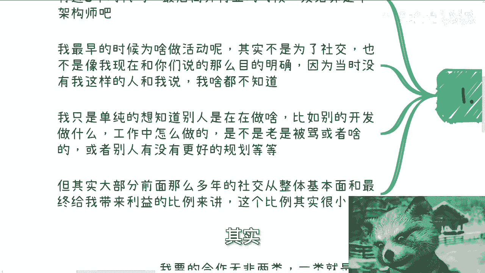

# 课程 P1：社交的本质与策略演变 🧠

在本节课中，我们将探讨社交行为的核心目的、个人社交策略的演变过程，以及如何根据自身发展阶段调整社交方式。我们将通过分析一个具体的案例，理解社交从“广撒网”到“精准聚焦”的转变逻辑。

---

## 概述：为何要讨论社交？

很多人询问我目前的社交状况。要回答这个问题，需要回溯我职业生涯不同阶段的社交动机与方式。本节将系统拆解社交的本质、我个人的实践与反思，以及策略调整背后的原因。

---

## 第一阶段：职业生涯早期的社交——源于未知与恐惧

上一节我们概述了课程主题，本节中我们来看看社交的起点。我毕业时写了近8年代码，离开行业时勉强可称为架构师。最初组织技术活动的动机并非为了社交。

当时我对行业认知有限，没有明确目标，也无人指导。我只是单纯想了解：其他开发者如何工作？他们在公司如何规划职业？是否也经常被批评（当时尚无“PUA”这个概念）？我对公司以外的世界感到未知和恐惧，因此希望接触更多人。

当时网络不发达，短视频尚未出现。我采用了一个笨办法：自己组织活动。这样能实现一对多交流。例如，组织一下午活动，哪怕只来五人，也能一次性认识五人。活动内容直接面向技术、开发、测试和运维人员，旨在增进了解。

然而，回顾早年社交，从整体收益与投入的比例来看，其作用有限。

**核心原因在于目的性不强**。既非纯粹交友，也非深度了解，彼此间缺乏利益绑定，导致许多社交成为无效投入。

---

## 第二阶段：职业生涯中期的社交——目的与现实的错位

在探讨了早期社交的低效性后，本节中我们来看看目的明确但可能方向错误的社交。我写代码的八年里，参与了无数社交场合：活动、峰会、论坛、闭门会议，规模从十人到两三千人不等。我主动与人交流，因为别无他法。

**社交与否取决于目的**。在移动互联网时期，我的角色更偏向提供咨询和内训，因此我需要寻找更多甲方客户并积累大会嘉宾资源。当时我频繁参加各类活动。

但现在我的社交大幅减少。原因有二：一是精力不如从前；二是现在的思考比过去清晰。

我过去的想法——寻找甲方和积累嘉宾——本身正确，但过于片面。例如，我想找甲方，但甲方根本不会理会我；我想积累嘉宾，但核心问题在于大会的营销、售票和拉赞助，而非嘉宾数量本身。

**当目的不明确或与结果不匹配时，社交容易变成无效社交**。

---

## 第三阶段：理解社交的本质与当前策略

认识到目的错位后，我们有必要剖析社交的本质。社交的核心目的无非三点：
1.  **建立关系**：为了未来的合作与赚钱。
2.  **找到工具人**：为了降低自身成本。
3.  **获取信息**：为了发现更多赚钱机会。

（注：恋爱目的不在此讨论范围。）

对我而言，目前已有若干固定的合作方，包括政府、企业和高校。这已足够。我清楚认识到：对方没有需求时，主动迎合毫无意义。

现在我也很少以普通参会者身份参加活动。原因如下：
*   当前高质量活动相比十年前少了很多。
*   如果参加，我通常要求以受邀嘉宾身份出席，这关乎边界感和做事方式。
*   许多信息可通过朋友圈或定向询问获取，无需线下奔波。必要时，一个微信电话也能找到对应的人。

**社交的本质是建立为未来服务的关系**。我现有的资源网络，正是过去“广撒网”式社交积累的结果。

---

## 第四阶段：精准社交与合作需求

理解了本质，本节我们聚焦于我当前具体的合作需求。我的合作需求主要分两类：

以下是两类具体需求：
1.  **甲方的单子**：我可以作为工具人，为任何找到甲方需求的人提供服务。
2.  **我需要的工具人**：随着数字经济等领域需求增长，我需要具备完整知识体系、优秀台风，能为政企提供内训或实施的人才。这类人才很难在普通线下活动中发现，通常需要通过现有关系圈内部引荐。

因此，我仍然需要社交，但方式已变：不再是广撒网，而是精准聚焦。要么以嘉宾身份参与活动，顺便结识人脉；要么通过关系圈内部有针对性的引荐。引荐方了解我的背景，即便当下无法合作，也为未来铺垫了可能性。

此外，作为需要为政企提供咨询的“专家”，为了维持身价和谈判优势，我不能过于频繁地公开露面。谈判需要技巧，有时需要他人配合“唱红脸”和“唱白脸”，由专人负责洽谈价格，而我专注于内容输出。

**社交是一个持续的过程，但方式应随个人发展阶段而演变**。二十多岁时可以广泛尝试，但到了三四十岁，精力与角色变化要求社交必须更高效、更具目的性。

---

## 总结与行动建议

本节课我们一起学习了社交行为的核心逻辑与个人策略的演变。我们从早期出于恐惧的“广撒网”，谈到中期目的与方法的错位，最终明确社交的本质是**建立关系、寻找合作伙伴、获取信息**，并应根据自身发展阶段转向**精准、高效的社交方式**。

对于希望寻求职业或商业规划咨询的朋友，请整理好个人背景与具体问题。请注意，咨询旨在梳理方向和规划，无法提供不劳而获的捷径。伸手党或不愿实践者请勿打扰。

**记住**：有效的社交是为未来的可能性播种，但收获取决于你如何培育这些关系以及你自身价值的成长。