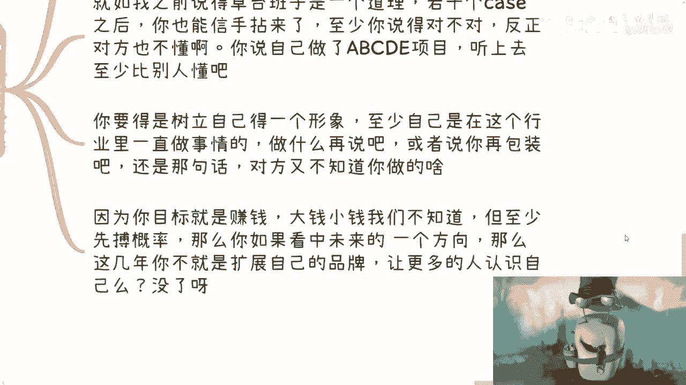

# 我看中未来一个方向-要不要去找个工作积累下---P1-我看中未来一个方向-要不要去找个工作积累---

在本节课中，我们将探讨一个常见问题：当你看到一个有潜力的未来方向时，是否应该通过找一份相关的工作来积累经验。我们将分析这种做法的利弊，并提供更直接、更有效的行动策略。


---

## 概述：关注与自己相关的目标

上一节我们介绍了课程主题，本节中我们来看看思考问题的核心前提：关注与自己相关的目标。

许多人关注宏大、遥远的事物，例如各种政策或行业大会。但关键在于，你关注的事物必须与你自己有关。否则，关注它没有意义。

你的目标必须明确。例如，你想赚钱，或者想结识专家、寻求合作。目标明确后，你的每一步行动都应服务于这个目标。

**核心公式：行动有效性 = 行动与目标的相关性**


如果行动与你的核心目标无关，那就是在浪费时间。


---

## 通过工作积累未来方向？大概率无效

上一节我们明确了目标导向的重要性，本节中我们来分析“通过工作积累”这一路径是否有效。

对于“看中未来方向，要不要找相关工作积累”这个问题，答案通常是否定的。原因如下：

1.  **积累内容与赚钱无关**：即使工作能积累经验，这些经验往往与“如何在该方向赚钱”没有直接关系。如果你的目标是赚钱，那么去积累不赚钱的经验没有意义。
2.  **当下工作机会的性质**：一个真正属于“未来”的方向，其当下的工作机会往往不是由市场真实痛点和需求产生的，而更多是由KPI或“政治正确”催生的，常见于国企、央企。这类岗位门槛极高，且日常工作（如写PPT、开会）是通用技能，无法积累到核心的行业认知和人脉。
3.  **错失真正的机会**：当未来方向真正爆发时，赚钱的项目、关键的人脉和资源都存在于产业和行业的实际圈子里，与你在相关公司打工的经历关系不大。

因此，通过打工来押注未来方向，效率很低，更多是自我感动。

---


## 正确的做法：立刻行动，建立个人品牌


既然打工积累行不通，那么正确的做法是什么？本节中我们来看看更有效的策略。

对于任何新兴方向，你完全可以在**半年到一年内**将自己打造成一个“专家”。关键在于立刻开始行动和输出。

以下是具体步骤：

1.  **立即开始研究与搜索**：从现在开始，全面搜索和学习你感兴趣的方向。
2.  **动手做项目**：无论项目大小，开始动手实践。即使最初不专业，做两三个案例后，你也能形成自己的理解和话术。
    *代码示例：你的学习路径*
    ```python
    # 1. 定义方向
    future_direction = "数字经济"
    # 2. 持续学习与搜索
    while knowledge < expert_level:
        search(future_direction)
        study()
    # 3. 启动项目
    for i in range(3):
        project = start_small_project(future_direction)
        complete(project)
        summarize(project)
    # 4. 输出与分享
    build_personal_brand(knowledge)
    ```
3.  **建立个人IP**：对外树立你正在这个领域“做事情”的形象。你做了什么比你在哪家公司打工更重要。即使是从边缘工作入手，也可以通过适当的包装，让别人知道你活跃在这个领域。
4.  **拓展人脉与品牌**：你的核心任务应该是不断拓展别人对你在这个方向的认知，建立自己的品牌。这比在一家公司内谋求晋升更能增加你未来赚钱的概率。

**核心逻辑**：在信息不对称的新兴领域，行动和输出速度比所谓的“正统积累”更重要。




---


## 心态调整：豁出去，用商人思维行动

上一节我们讨论了具体行动方法，本节中我们来看看成功所需的关键心态。

许多人在咨询最后会问还有什么建议。最重要的建议是：**你要做就好好做，要豁得出去**。

以下是需要避免的心态和必须采取的行动：

避免以下心态：
*   **拖延**：定了目标却不执行。
*   **自我怀疑**：总在想“我不懂”、“我不行”、“我没经验”。
*   **畏首畏尾**：在社交或行动时唯唯诺诺，不敢包装自己，不敢争取。

必须采取的行动：
*   **具备“商人思维”**：做任何事（A）都要明确想得到什么结果（B），并清楚如何从A到B。
    **公式：行动价值 = (目标B的明确度) × (路径A->B的清晰度)**
*   **拼软件能力**：如果硬件（学历、背景）不足，就必须全力提升软件能力（沟通、气场、话术、执行力）。
*   **敢于“野”**：如果走正规路线拼不过别人，就要在灵活、敏捷、抓住新机会方面比别人更强。最糟糕的情况是“正规拼不过，野路子也拼不过”。


赚钱是一场战斗，犹豫和准备不足只会让你错失良机。

---

## 总结

本节课中我们一起学习了如何应对“看中未来方向”的困惑。

我们首先明确了**一切行动要围绕与自己相关的明确目标**，通常是赚钱。接着，我们分析了**通过找相关工作来积累经验通常是低效的**，因为积累的内容与赚钱脱节，且容易陷入事务性工作。

我们提出了更有效的策略：**立即开始研究、动手做项目、并着力建立个人品牌和行业人脉**，这比打工更能让你快速成为“专家”。最后，我们强调了成功所需的**“豁出去”的心态和“商人思维”**，要避免空想和畏缩，清晰规划从行动到目标的路径，并坚决执行。

记住，在快速变化的领域，**行动速度和建立连接的能力，远比一份看似相关的职位头衔更重要**。