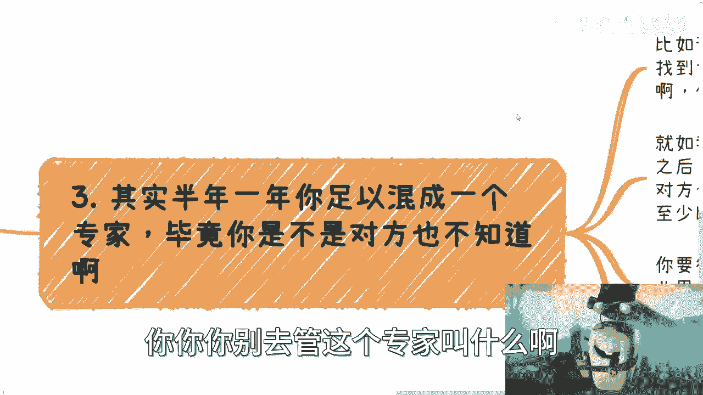

# 我看中未来一个方向，要不要去找个工作积累下 - P1：我看中未来一个方向，要不要去找个工作积累 - 赏味不足 - BV1Xp4y1d7bJ

好大家好，深圳活动继续报名啊，1月13号大家就当过来相互认识认识聊聊天，然后你们相互之间可以看看，有什么可以合作的啊，呃我们今天来讲的这个话题呢，是昨天有个小伙伴啊问我的，但是呢我后面也没回。

咳咳咳咳咳，实在是不想回啊，呃这个问题叫什么呢，叫做呃我看中一个未来的方向啊，然后呢我要不要找个工作去积累啊，首先啊我觉得是这样子的，首先呢我先强调一点，就是大家关注的东西呢。

你别老是去关注那些假大空跟啊，这个高大上的，你要关注的东西一定是要跟自己有关的。

否则你关注他干嘛呢对吧，你比如说好多小伙伴跟我说，政策跟我说这个大会那个大会，你先想好你目的是什么对吧，你想好你怎么赚钱，你比如说你想过去找专家，那你就去参加，去社交对吧，你说你想去找主办方合作。

你想去蹭这个主办方，那你就去啊，找准慢慢聊啊，请他喝咖啡喝酒吃饭对吧，你目标明确，包括就是说还有好多小伙伴跟我说，这个政策那个政策我跟你这么说啊，政策中国的政策千千万，你们但凡合作过来就会明白。

你需要的不是一个文件或者一个公章，你要这些东西有什么用呢，对吧，怕扔给我一个东西有用了，你扔给我干嘛呢，咳咳咳对吧，就是，就是你从我角度来讲，你说这个动不动扔给我一个文件，扔给我个东西。

你扔给我干嘛呢对吧，就是你扔给我，我也赚不到钱，你也赚不到钱，然后呢我们出去装逼啊，说这个文件怎么样怎么样，没有用的呀对吧，就是你要的是，你要去了解这个文件或这个公章，跟你有什么关系，你怎么赚钱。

你不知道怎么赚对吧，那你去摸啊，你去聊啊对吧，就目的就很明确啊，你不要老是就是做一些，让我觉得非常莫名其妙的事情对吧，呃呃你看这个文件哪发的，科委发的，科协发的公信发的文，人社发的国资委发的，哪里发的。

你去聊啊，他到每个省市区，每个城市，每个小地方它都有归属的部门的呀对吧，国家机关这么多对外的电话，那放着干嘛呢，看的啊，那不就是用来联系的嘛对吧，我跟你讲啊，还有很多很搞笑的，就跟我说。

他说我这个老百姓要不要什么门槛，要不要什么背书，哎我操，我只想说国家是什么机关，是什么公务员，是什么啊，为人民服务啊对吧，你要明白我们是人民啊，我的，我们不能联系谁联系啊，对不对啊，你就大家做事情啊。

我真的我就建议什么干脆一点哎，就是不要那种就是说做梦要做的，做梦还畏首畏尾，那索性别做啊，就是你先找到一个目标，哪怕目标告诉我，嗯咳咳咳，目标是赚钱，那也行对吧，你寻找A点到B点最短的路径。

然后每一步问问自己，跟这个目标有没有什么关系，对吧，你你别就是很多事情做出来，跟目标完全毫无关系啊。

啊然后我们来说这个正题啊，说这个看重未来的方向啊。

是不是要找个工作积累啊，嗯我其实就没有回复，为什么我统一展开一下，为什么，首先啊这个跟工作本身能不能积累没有关系啊，工作本身就算能积累，我也不觉得你要去上班，你我也不觉得你要去通过上班来积累这个东西。

因为什么，因为你上班积累的东西跟赚钱没有关系，那你去干嘛呢对吧，你去干嘛呢，你说我不要赚钱，那你随便找个地方打工不好了呀，对不对，你为什么一定要去管管他这个未来方向，不方向呢，咳咳咳咳。

你要做不就是为了赚钱嘛，不就是为了掌握先机吗对吧，你如果未来是一个方向，你现在有啥工作机会，我告诉你们有什么工作机会，大部分工作机会他不是因为痛点和需求产生的，如果当下的工作机会是因为痛点和需求产生的。

那他妈就不叫未来的方向对吧，那现在这些工作怎么产生呢，因为KPI跟政治正确产生的，那么KPI跟政治正确产生的往往是在国企，央企里面，我就这么说，不是我看不起大家啊，我看不起我自己，为什么。

因为大部分人不满足这个门槛，你们去看看啊，现在做数，比如说数做数字经济的，做做那个数据资产化的，资产证券化的有吗，有的呀，门槛很高很高，你去打呀，你倒是去打给我看看对吧，另外一方面。

这种企业当下这种阶段，你就算去了，他也是个通用工作，比如说写PPT，写写文案，开开会，你能积累啥啊，你能积累啥，你去这种地方说不好听点，除了浪费时间，除了自我满足，自我感动，说啊。

我在一个可能未来能发展的一个方向里面，没有蓝nothing，有什么，随着时间推移，如果真的这个未来大力发这个未来方向，大力发展了真正赚钱的项目关系，人脉也都是在行业当中的，都是在产业当中的。

都是有自己的圈子，这跟你在里面打工，就他妈更没关系了对吧，你很多时候啊我跟你们讲，你们别去听风就是雨啊，今天这个文件出来啊，冲元宇宙啊，明天那个文件哈，充数字经济，后天那个文件就是冲这个什么新能源。

有用了没有用的呀，对不啦，你要真的要做，我就告诉你要真的要做，你就从现在开始认识人，从现在开始积累关系，从现在开始做一些，哪怕是不搭边的，搭一点点边的东西，这都很有帮助。

总比你找个什么地方上班有帮助，然后我们来看第三个，我就这么说，任何一个新兴方向，半年一年你足以混成个专家了，真的啊，你你你你别去管这个专家叫什么啊。

毕竟你是不是专家，对方也不知道啊，啊比如说你要做出的经济。

你从现在开始搜索，从现在开始做项目啊，甭管他什么项目，你都往数字信息上面靠对吧，你现在不知道是什么，没关系啊，你做两三个case，你你你自然就能出口成章了，不是我说什么对吧，重要的是你做啊。

就如我之前说的草台班子，他是一个道理，你若干了case之后，你也是牛逼啊对吧，你也是张口就来啊，对吧啊，至于你说的对不对，我就问嘛，能有几个人懂的啊，反正对面也不懂，你管你说呗。

你就说我做了ABCDEFG项目，我的做了ABCDE的数字经济项目，听上去至少比别人懂吧，至少听上去牛逼吧对吧，你要真的看重你要做的当下是什么，就是你得树立自己的一个IP。

至少自己在这个行业里面是做事情的，做什么再说对吧，我早就说过了，你在里面扫地的，你在里面就算是倒茶送水的，怎么了呢，别人知道不了，别人又不知道对吧，你对外回头包装两句，这个再说一下，再再稍微美化一下。

你总有你赚钱的机会吧，总比你在那边每天打，找一个地方打工，写写PPT好吧对吧，为什么，因为你的目标是赚钱啊，我们的目标是赚钱，我们的目标不是在一家，比如说数字经济公司里面，什么什么晋升到一个主管。

晋升到一个一个一个总监，这是我们的目标，不对吧，你未来赚钱大钱小钱我不知道，但至少如果你想赚，你得先博概率啊，怎么叫博概率，就是说你看中一个方向，那么你这几年你的唯一的一件事情，就是拓展自己的品牌。

拓展别人对你的认知，没了呀，你还要做什么，没有了呀。

最后一点是什么，就是往往咨询到最后有很多人问我，他说陈老师你还有什么建议，我跟你讲建议就是你要做就好好做。

你要做就豁得出去，什么意思，就是别你定的目标你不做啊，然后开始拖对吧，然后呢别老是在那边想，哎我懂不懂哎呦这个东西我不懂，哎，我行不行，我不行对吧，然后想着就说哎这行业我也没进去过。

我也没接触过重要的啦，我就问重要的啦，世界上每一个人赚第一笔钱，他妈的他之前做过吗，啊，哦每个人都在这么想，那他妈还转个屁啊，别转了呀，对吧是不是啊，你比如说好多人都准备准备那个，拓展自己的人脉关系。

但见到人了，他还是不知道怎么说话，对吧啊，唯唯唯唯诺诺啊，不吃包装，不去让对方留下深刻的印象，那你去干嘛呢，你别去呀，去干嘛对吧，去了就是浪费时间，然后回头回来还要跟我说，哎陈老师，我参加会啦。

但是我我我我怎么没有积累，我怎么怎么怎么跟别人没有合作，怎么合作呢，对吧，你道理都懂，会哭的孩子有奶吃，你不哭，奶奶哪里奶奶呢，对不对，你你出去是赚钱啊，赚钱本身是一场战斗，你见过谁上了战场准备血拼了。

对吧啊，然后人家拿着刀过来干了啊，然后呢你在一边犹豫啊，想这个哎呀，这个刀应该怎么怎么用啊，我以前没用过，哎呦完啦你们想想看这对吧，所以说还是回到我最早说的那句话，就是如果真的要做事情。

你别到最后就是正规，你也正规不过人家对吧，人家是比如说往国家，往政府，往高校，往那种高大上的方向去走对吧，你说好，我走不过人家，你别到时候野也野不过人家对吧啊，然后人家这边比如说哎呀有这个社群啊。

那边有可能卖数字藏品啊，这边嘛可能呃什么做做做做自媒体那边做什么，你别野也野不过人家正规也正规不过人家，那他妈就惨了呀，没了呀对吧。

就是我们你像这两天我在B站上看视频啊，就我觉得有些人说的也很对，就是你每个人有硬件能力，有软件能力对吧，你的硬件能力是什么，比如说学历，比如说你的家庭背景好，你说我没有啊，OK没问题。

那么你你你接下来就是拼软件能力对吧，那软件能力就是比如说你的沟通，你的气场啊，你你的你的话术对吧，哦哦你最后说哦，我硬件拼不过，我软件也拼不过，那你凭啥，对吧，咳咳咳咳，这就像什么，这就像我一直。

就是很多人问我，你比如说啊你说陈老师我要不要考个博，我怎么回他的，我说是这样子的，你在中国这个国家的社会规则下，你懂不懂得拿博士的这个这张纸，你考完你，你读出来之后，你告诉我，你懂不懂得这张纸怎么赚钱。

我觉得这个这个问题你懂你去考，你不懂你考出来有什么用啊，啊当当当当草稿纸用啊，对不啦，就你我觉得这样子，你做所有事情就是应该是一个商人思维，就是我做A我一定要得到B的，而且我得知道我怎么得到B对吧哦。

你说你说我做A，我连得到什么东西我都不知道啊，你说我就得到一张纸，那你问我要不要考这个博，那他妈的我就觉得一个正常脑子的人，你告诉我考不会有什么用啊，剩下一群人跟你说，哎呀考博能够更好的找到工作。

能够更好的更高概率找到工作，能够找到更好更高的package的工作，然后呢，然后呢一定吗能确定吗，能找到多少呢，能持续多久呢，对吧，你不知道啊，对吧，所以就是一个道理，就是我们做所有事情。

你得把目标定清楚，你目标不知道，然后你说啊陈老师我要不要做，那你说你要不要做，我怎么知道你要不要做，所以说真的啊，你包括我现在跟别人聊微信，包括其他的，不是我5年前6年前10年前就这样啊。

我5年前6年前10年前，我不要太温柔啊对吧，我为什么现在这样子，不就是因为他妈的太多嘛对吧，所有的沟通都是无效沟通，所以我不得已到最后，我我我我微信只能跟他们说，以后只要不赚钱的话，咱都别聊，对不对。

何必呢，何必浪费时间呢，对吧，哪怕我不赚钱，你能赚钱，那我也很开心啊，这不到最后两个人都他妈不赚钱，好吧行啊，就这么着嗯，活动反正私信我报名好吧，然后那个咨询的话，你们可以整理好问题，整理好问题。

