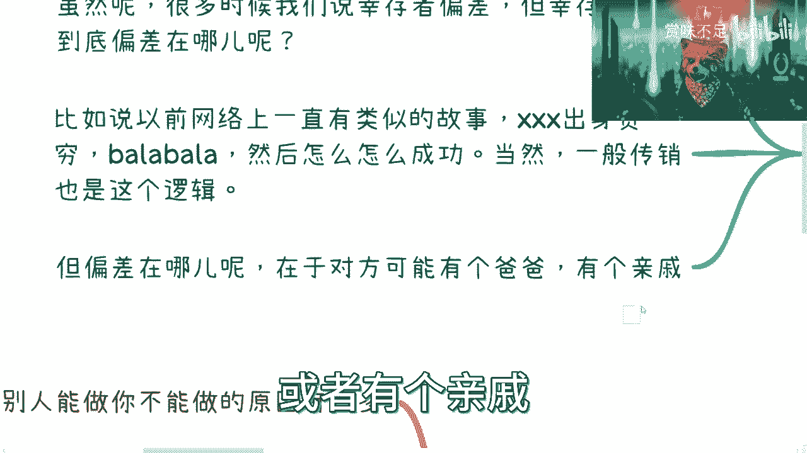
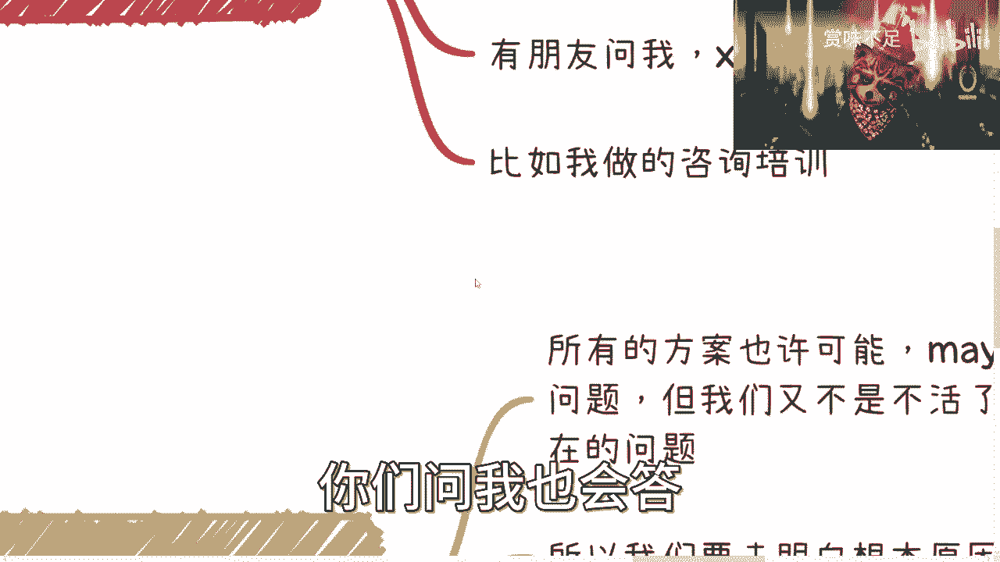
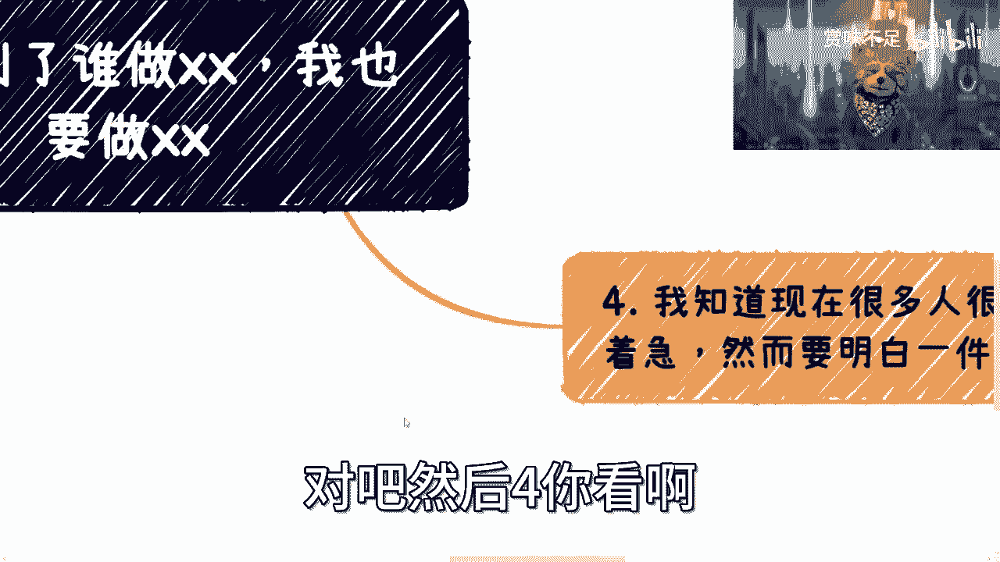
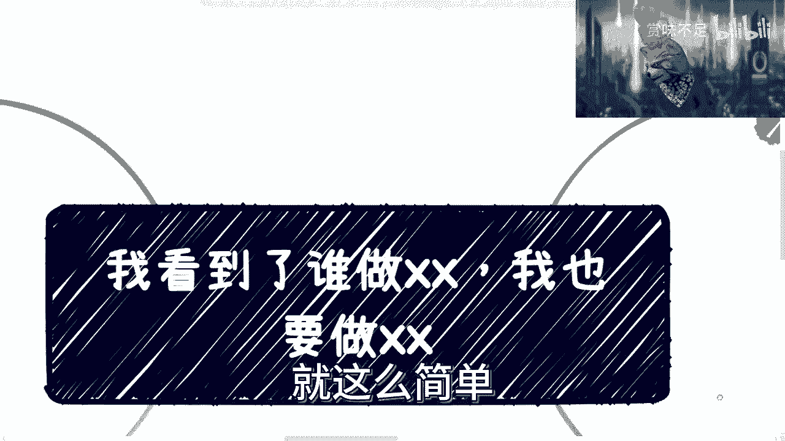

# 我看别人做了，我也要做！！这是大忌啊 - P1 - 赏味不足 - BV1Tm4y1C7iU

好啊，各位未来的这个妇人们啊，大家好啊，哈哈是吧，今天礼拜五礼拜五，我理论上我应该在打游戏是吧，但是我想了一下，我算了，我还是抽个半个小时给大家这个录个视频是吧。

说我操跳出来，首先啊7号晚上有直播对吧，大家到我首页首页上面能够看得到啊，大家可以预约一下啊，然后这个毕竟电脑到了可以直播了对吧，但是到时候直播什么东西我也没想好，但是但是按照上次的节奏啊。

这他妈一个半小时你们能刷2800条弹幕，我真的给你们跪了，真的太太吊了。

我本来还想着呢，我就直播时候说点啥，我后来发现我根本说不动啊，说说不过来。

然后你们也别到时候说我有延迟，不是我有延迟，是我看到一个东西，我得去回答，对不对，那我回答的时候你们就刷了50条了，那我肯定有延迟啊对吧，那没延迟，太怪了，哎呀我今天这个头有点秃啊。

唉让让我让我等一下我，我我要往我头上装个什么东西，还要装这个吧，我觉得哎这这这还有这个好看，这样这样呀，卡住了啊，这样这样啊。

然后呢这个今天这个主题是怎么来的呢，因为这两天不是咨询嘛，然后今天早上还有我朋友打电话给我，也在跟我聊，哎其实说白了说到底大家打电话给我了，其实都一个事情，就怎么赚钱，怎么搞钱对吧，然后呢。

我觉得这个事儿我有必要跟大家说一下，是什么呢，就是我发现啊，就现在真的太多的人呐都是什么，就是我看到谁谁谁做了什么对吧，这个谁谁谁谁，要么是我的朋友，要么是我的网友的吧，要么是什么什么，我以前同学对吧。

同事啊，然后他说我要他做什么呢，我也要做什么，不靠谱啊，真不靠谱嗯。

我来给你们看啊，首先第一点先讲故事。

我们之前说清楚点偏差是吧，你会发现说是这么说，但是我就问啊，幸存者偏差偏差在什么地方，你们有没有想过啊，就幸存者偏差是信息差吗，是信息差，但这个信息差问题出在什么地方呢，对吧。

我们我们要明白问题出在什么地方，我们就就就就可以就说识别这件事情，对不对，那这第一个啊，第二个就比如说以前网络上有类似的故事，什么故事呢，你看啊某某某对吧，出身贫穷对吧。

巴拉巴拉巴拉巴拉当中一顿一顿操作，猛如虎对吧，然后怎么怎么成功，你知道吧，然后我看了半天对吧，最后并不是V我50，而是说他爸是谁对吧，他他他他亲戚是谁是吧，他他他他怎么样怎么样怎么样。

你就会发现我花了5分钟看了一段文字，他妈的都是屁话，你知道吗，所以呢你们一定要明白哦，很多时候的信息差是什么呢，就是你问我为什么一直跟你们说冰山，水面上的冰山跟水面下的冰山。

是因为你们能看到所有的东西都是表面信息，对不对，那么他背后怎么样，你们知道吗，你们不知道，但是你们不知道的情况下，你们就说啊，我也要吃这样这样这样对吧，我看到比如说他做了一个网店对吧。

111个月赚了5000块钱，那我说不定我也能赚5000呢，不好意思没有，说不定你肯定赚不到5000，你知道吗，想都别想啊，然后呢我跟你们说，这个我穿我参加过的传销会还是很多的啊，一般传销不是这种啊。

一般传销都只有逻辑，什么逻辑呢，就是我告诉大家啊，我这个16岁财富自由啊，然后由于什么原因啊，这个比如说我我什么啊，恋爱不慎啊，结婚不慎啊，被骗钱了，然后我什么倒贴了呃，欠债几千万啊。

然后现在又由于我的这个方法论啊，理论很牛逼啊，我现在又身价几个亿了啊，听懂鼓掌对吧，那不就这样吗，啊对吧啊，然后呢我觉得是这样子的对吧，就是说你要明白这个偏差啊，不仅仅只是对方有个爸爸会有个清醒。

他偏差很多很多，这个我待会给你们列的，但是不管怎么样呢，就是说现在虽然大家很难啊。

但是千万别是非常着急的去说我要做什么，做什么对吧，我说直白一点，退1万步来说啊，就算你今天做了，你也能赚钱，他也是个短期的事情，就是说哎这个后面我们再来讲吧。

反正我后面也写了啊，然后呢我最近咨询跟打电话，视频呢也跟你们说一下，就比如说啊有人跟我说，他要做直播带货这件事情呢已经烂了，你们明白吗，就已经烂了，什么叫烂了呢，就是里面该有的模式都有了。

该参与的也参与了，该封的蛋糕也封了对吧，你要说散户去参加，能不能参加，这就跟炒股票是一样的，你能做的呀对吧，就是你一定要明白这个时间期，什么叫时间期呢，就是你今天做一件事情，你跟我说你赚钱了。

但是你今天赚钱，你不能代表着你这辈子都赚钱嘛对吧，你要明白所谓的赚钱是什么概念，什么都亏钱是什么概念，就是啊我跟你们说，你这前两天微博上有个视频二机会，真的说的很好，他说什么呢。

就是说呃你到那个拉斯维加斯对吧，去或者迪拜去这个赌场去玩，你知道吧，什么概念呢，就是你赚到的钱，他总有办法让你吐出来，什么叫什么办法呢，就比如说你过去了对吧，赢的总想呃就想继续赢，然后到亏为止。

亏的就想把钱赚回来对吧好，那么无论是前者还是后后者，它的整个游戏都是可以继续，就所有的庄家永远是赚钱的，对不对，好，那么这个时候呢，如果你亏了啊，那么你会继续赚对吧，你会继续继续去赌对吧，那如果你赚了。

那怎么办呢，你说我收手了行不行啊，行好可以，这个时候呢，这个时候呢你啊这个哦对我先说亏了，你亏了怎么办呢，会有那种高利贷对吧，贷款的人来找你对吧好然后呢跟你说好，你你这个继续玩对吧。

你会发现钱一旦变成了筹码，你就没知觉了，就是你对钱已经没有概念了，因为它只是一个筹码，对不对，好，那么如果你赢了呢，你说你说哎我就是死活不玩了，死活死活不玩了，怎么办呢，好没问题的，交税啊交税，然后呢。

他给你作为转化成一个正常的合法收入对吧，给你好，然后呢给你安排好保镖，安排好劳斯莱斯，安排好兵力对吧，去机场带走啊，就是送你回去，送你过程当中一路就是做做宣传啊，做宣传，然后你就说啊这个人很牛逼。

这个人这个人什么，比如说什么也10分钟赚了100万对吧，怎么样怎么样怎么样，那你就变成了他营销的工具，而且呢很多时候你赢了之后啊，你人生总归会总归会出现一些就是低低潮期，那到那个时候呢。

你就会怀念这个时候对吧，然后你就带着亲朋好友再来对吧，那你会发现无论怎么样子啊，就是你要说赚不赚钱，你得看你的时间周期啊，大部分的人是什么呢，他可能第一个月赚钱了，第二个月也赚钱了。

然后他就觉得卧槽很牛逼，我得投入哈，最终你算笔账，算下来，你的投入产出就是负数，你知道吗，这就叫亏钱，但是很多时候，很多时候，你会发现你自己就在给你自己做幸存者偏差。

因为你自己就会觉得卧槽他妈的脑子赚钱啊，我很牛逼，我好像很适合做这一行，但其实并不是，对不对，而且很多时候你也会给你的朋友，带来很错误的信息，就比如说你一开始赚钱，你膨胀了，你知道吧，我靠你牛逼了。

然后给你投给你那个朋友说，哎哎我这个东西做的很好的，哎这个东西很强的，我就投入2000块钱，第一个月赚了1万块钱对吧，但是问题你知道是什么，问题是你要把时间线放长远了去看。

这就好像什么你带了很多的韭菜进去，大家一开始尝了一点甜头，然后过了一段时间增加了筹码，然后你们都亏了，但是你想想最终赚的是谁，对不对，所以说你考你考虑所有的问题的时候，你都得要有这个思维去考虑。

他不要只看眼前，看眼前是没有用的，你们明白吧，因为我发现大部分人都有这个毛病啊，这毛病改不掉，你知道吗，我真的就就很焦虑啊，我我我我很焦虑啊，啊把这个小浣熊稍微弄大一点，然后呢这第一个第二个是什么呢。

就比如说今天早上还有朋友跟我说，呃那个好像招聘，他说这是个痛点，我说这是个痛点啊，嗯是不是咱先不说对吧，首先这是不是痛点，不是你说了算，也不是我说了算的对吧，但是问题是什么呢。

问题是你今天说它有没有痛点，你要去做个产品，这两者其实是没有因果关系的，因为在我现在认知里面很简单，你要去做一件事情对吧，很简单，你告诉我能不能赚钱，你告诉我谁买单，他为什么买单，就三个问题对吧。

我告诉你们，哎哎哎哎怎么怎么赚钱啊，对吧啊，怎么赚钱啊，谁谁会买单对吧好，他为什么买单对吧好，他为什么卧槽他怎么颜色都变了，诶，哥，哦拉出来，啊他为什么买你的单，对不对，我跟你讲，你做任何事情。

你就问这次这个问题有没有答案，没有别做拉倒，你知道吗，啊就我刚才讲了，我说在这四个问题里面，我就问你，我关心你产品做什么，我压根就不关心，我管你做这个蟹腿跟我都没关系，你知道吗，你只要告诉我怎么赚钱。

谁来买单，他为什么买单，为什么买你的单，你只要能说服我，OK干有什么好讲的，没什么好讲的，对不对，你还还来跟我讨论这行业有没有痛点，who care是不是，然后他也是还有朋友来问我。

他说叉叉产品是不是真的有这么多用户啊，他说他说我觉得这个产品很虚啊，这产品什么什么说有什么几10万用户，那么我不信这有没有多少用户，你信不信，然后呢就就so what，对吧，就是又怎么样呢对吧。

就是它有没有用户又怎么样，这产品到底需不需又怎么样，人家能赚钱，这就是人家核心逻辑，我们要关心的是什么，它为什么能赚钱，你非要去关心人家产品怎么做对吧，人家产品为什么都对用户根据什么关系，是不是对吧。

那我说不好听点对吧，你看到一个大V对吧，他比如说500万用户啊，500万500万韭菜对吧，然后他可能讲的东西也很有料啊，他的这个东西也很牛逼对吧，但是很有可能你并不知道，那500万用户怎么来的呀对吧。

这500万用户真的是吸为他的内容吸引的吗，哎可能不是，他可能早期是买僵尸粉的对吧，早期可能是做了一些别的营销活动对吧，来的你不知道，然后你在那边琢磨啊，他的这个内容怎么吸引这么多人呢，有有意义的。

没有意义啊，对不对，就是你不能完全的以一个点，一个节点的事情去判断它没有任何意义的，你要去追溯他的过去，或者你你觉得你追溯不了，没问题，那你就去探究这一类人，这一类业务模型，它到底内核是什么对吧。

它一定有它的核心竞争力，而不是说仅仅表面上这些东西，因为表面上这些东西太容易被抄袭了，对不对，那我跟你这么说，我讲现在所有的B站上的这些视频，对不对，你看我如此朴素对吧，没有没有什么特效，没有任何东西。

而且我也不关心别人抄不抄，为什么，因为对我来讲我不care，我根本就不关心，就是他把我的这个视频视频超过去怎么样了呢，他要有能力去变现，那也是他的本事，我觉得OK我甘拜下风对吧。

那但是问题是他有持续产出能力吗，没有呀，是不是，这我觉得无所谓啊，啊你再比如说我做咨询培训也是一样的，就是你们要来做，我也很欢迎对吧，甚至你们但凡来咨询我，我也可以，就是没有任何保留的告诉你们一些。

就是就是这种叫做什么潜规则对吧，就是可以利用的利用的一些条件，比如说政府补贴或者其他东西，我都会跟你们讲的，但问题是你们要明白我能做的，你们能不能做对吧，或者说我为什么能做，而不是你。

而不是你们去做对吧，这个当中一定有它背后的逻辑是吧，那么这个当然这个你们问我也会打。

但你们不问我可能就不会说，对不对啊，那么这个是二对吧。

三啊我跟你讲啊，你看啊，从规则上来讲其实蛮复杂的，什么叫规则上来讲呢，就是你看啊，你比如说别人能做的，你不能做的原因有很多，我们往下举例子，哎呀打字又不得，对吧，那这是一个。

然后你比如说那个你要今天做一件事情，不管你做什么，比如说营销套路，你会不会对吧，因为你产品是什么，你到底做的怎么样，其实并不重要，重要的是你能不能有获得更多的用户对吧，那么我就问你营销套路会不会。

那我觉得大概率普通人都不会的，就比如说你现在很多人跟我讲什么，我要做直播啊，我要做电商，我要做什么自媒体，我就问嘛，你营销套路会不会嘛，你不要什么什么都不知道，你就上来说啊，我就开始剪视频了啊。

我要产出内容了，有用了没有用的呀，你做个一两天没问题啊，你做个一个月做两个月，你坚持的下去了，坚持不下去的呀，对不对，那我觉得这是第一点，第二点是产业链的关系，你有多少产业链的关系，我还是那句话。

大部分普通人没有关系对吧，你拿得到更低的成本价吗，没有，那你连产业链上面都没有关系，你告诉我你拿什么跟别人竞争，你说哦我会做视频，那他妈的谁不会啊，整个的中国14亿人，这么多人做直播啊，人家还有团队。

你有啥，是不是，就我觉得这种事情随便想想就能想的出来，别别脑子一热就all in，你知道吧，那这是一个你对吧，你还有什么，你比如说别人可能跟一些大V对吧，跟跟一些账户，别人可以相互带流量，你有吗。

你也没有，对不对，那别人可能有金主爸爸或者甲方爸爸，你有吗，你也没有对吧，就是所有这些东西都不是表面你能看得出来的，但是你要去思考啊对吧，那别人为什么会成功，或者别人为什么能赚钱，你为什么赚不到对吧。

就是他今天做同样的东西，你哪怕你哪怕跟他做一模一样的事情，那为什么他就有流量，你没有流量，你要明白这件事情的呀，对不对，那如果来说我们说众生平等对吧，你说好啊，大家都这么做，都有流量，那可能了不可能。

这不符合人类社会发展，这不符合商业的逻辑，我是不是啊，那你还有是什么呢，就是在很多事情上面，你要知道在中国的规则下面啊，有很多东西它是需要有资质的啊，比如说什么ISO标准。

比如说什么呃高精尖这种评价对吧，比如说什么什么什么什么，什么什么什么专利数对吧，比如说什么呃博士的占比，硕士转笔，本科转笔对吧，他背后很多东西它都是有资质的，也就是所谓的门槛对吧，那别人有吗。

别人有你有吗，你没有，但是你并不知道别人有，你也不知道别人拿的拿的资质，是不是说呃去有某某种补贴或者某种扶持，你都不知道对吧，那那你做什么是吧，那别人还能还有背书对吧，然后你你也不知道他到底有什么。

就说比如说啊特殊的本书你也不知道对吧，就是其实你看啊，不管你今天做自媒体也好，做什么电商也好，还是做什么别的培训，教育培训也好，什么乱七八糟的东西也好，你会发现就是你要去看水下的这些东西。

你要去探究它对吧，哎我还是那句话，你你你你你你要说了对吧，我我怎么去探究还我你用我的观点，还是那句话，你要有有关系，你要有能力，你就去想办法通过这些关系去探究对吧，你要没有你可以咨询我。

我想办法跟你讲对吧，当然有很多东西我也不懂，那么你怎么办，你就想办法先去认识更多的人没了，你告诉我还有什么办法对吧，你又你把框框你框好了，你说啊，我又是个普通人，我又是个二三线城市，我又没钱对吧。

我也没有什么一技之长，然后你非要说啊，吕老师，你有没有一套方法论，如果让我一飞冲天，可能啦对啦，可能的话那就是传销了，对不可能的话，我跟你讲，我当然跟你说，可能那他妈就是骗子，是不是。

对吧，然后四。

你看啊，我跟你们讲，我知道很多人现在很焦虑，很着急，但是我跟你讲，你们要明白一件事情是什么呢，所有的方案也许可能maybe，大概可以解决当下的问题啊，能解决你们的焦虑，或能能让你们有一定的收入。

但是我们也不是过了今年就不活了，我们也不是过了今年就退休了，对不对，你当下的问题治标不治本，你但凡治标不治本，未来你终究还会碰到，现在我现在的问题你知道吧，而且随着你年龄的增长，随着整个行业的发展。

整个时间推移，你未来要去解决就是治标不治本嘛，你要解决本的问题可能更难，所以说所有本本质上的问题，你要越早的解决越好，你知道吗，我所有视频所表达出来的观点都是一样的对吧，我从来就不不跟你们说。

我有什么通用的方法论，你们就去试，没有用的，你知道吗，都是得要具体问题具体分析的啊，然后这是第一个，第二个就是说呃这个根本原因对吧，第三个就是说你别老去看别人怎么样，你要去怎么样怎么样做对吧。

你比如说别人怎么样，你就去做做，做公司也好，做副业也好，做产品也好，做什么都一样，就是你别去看表面的对吧，因为我跟你们说，在过程当中给给出来咨询我的，给我更呃，就把这种宣传片，把什么竞品的宣传。

别人给我的，把竞品产品扔给我的，我看都不看的，你知道吧，为什么，因为我对我来讲没有意义啊，这个东西就是所有表面上能看到的，我一律是不信的，没有用的对吧，因为他这些东西说难听点就是为了就是包装，就是营销。

然后呢我我跟你都是大家去解决本质问题的，你要了解他为什么能赚钱，你才能去赚钱对吧，然后你要拿着你，你既然要去探究本质问题，但是呢你又拿着很多表面形式在那边看有用吗，没有用的呀，对不对。

所以说这个还有另外一点，就是说普通人最不应该去想的就是做产品，这个东西嗯，不是一般人能做的，你但凡没有钱，没有金主爸爸，你就别去做，这是第一点，第二点是做一个产品，它里面的逻辑很复杂。

包括要探究需求等等等也很复杂对吧，这个我在做产品经理的那一节课里面，我也讲的很清楚对吧，它是一个综合性的东西对吧，所以说普通人要做的是什么，就是一切要以最高的投入产出比为主啊，而且而且是什么。

而且就是最最最最关键的就是，别什么都从自己身上先去想，你知道吧，因为我发现现在真的，几乎所有的人都是这么一个毛病，就是但凡讨论一个问题，他就会说哎吕老师，我我好像这个不行，我也不懂对吧，他说我学哎呀。

好像也要花很长时间对吧，我觉得这个方向不行，没人让你们学呀，没人让你们自己去做呀，你们想妈妈出去借力呀，对不对，出去找妈妈，找合作方找人，你只要能赚钱，大家都愿意合作的，别老什么东西从你们自己身上想。

我们就活个80年，100年，我们能学多少东西，对不对，而且你要明白，一个正常人，一个普通人，一个老百姓，你的学习的曲线最高就是那么几年，你指望你30多岁，40多岁还能学得很快嘛，你能跟人家年轻人去比吗。

你比不过的呀，你没有天赋异禀呀。

对不对，就我觉得真的就是思想上这毛病，你们要改就改不掉。

我跟你讲就废了，我跟你们说，你知道吗，啊好吧。

那反正就这么着吧，啊嗯这个事啊。

三四而后行，还是那句话，三四而后行，你们能解决燃眉之急，但你们解决不了本质问题哦，2023年今年你们碰到这些问题，2026年依然你们依然会碰到这些问题，2029年还是会碰到这些问题。

那早晚要解决的啊，时间拖得越长，解决成本越高，就这么简单好吧啊。

7号晚上有直播好吧，大家反正有什么问题到时候可以问嗯，上次说实话我最后提一点，上次直播就会回那个那个最后的这个问题，越来越敏感了，这个B站没把我掐掉，已经算是很给面子了啊，大家注意这个提问的对吧。

哈哈啊。

就这么着吧啊，有什么事，反正你们这个总结好。

