# 我看别人做了-我也要做--这是大忌啊---P1---赏味不足---BV1Tm4y1C7iU

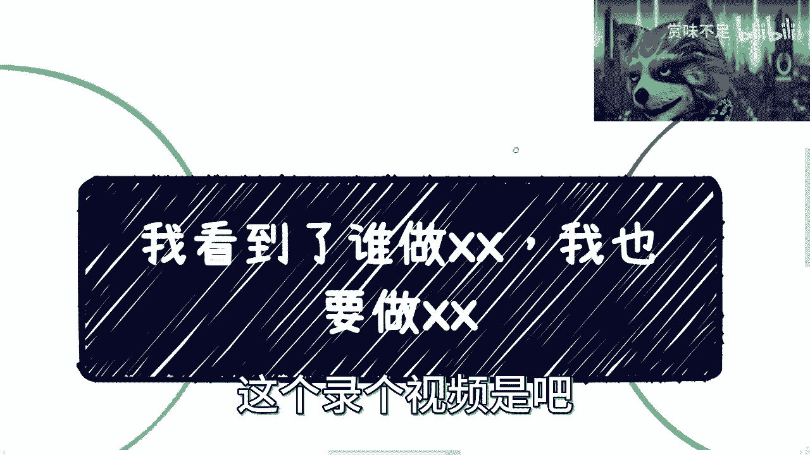

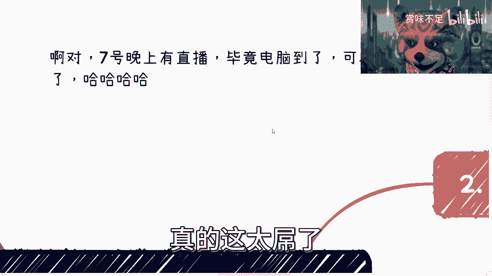

在本节课中，我们将要学习一个在商业和职业发展中至关重要的思维误区：盲目跟风。许多人看到他人成功，便不假思索地模仿，这往往导致失败。我们将深入探讨这种现象背后的原因，并学习如何通过分析问题的本质来做出明智的决策。

## 概述：问题的普遍性

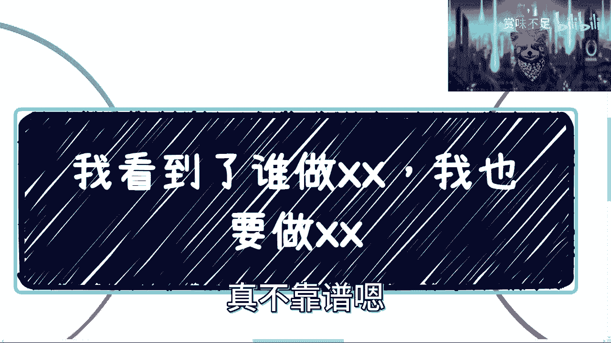

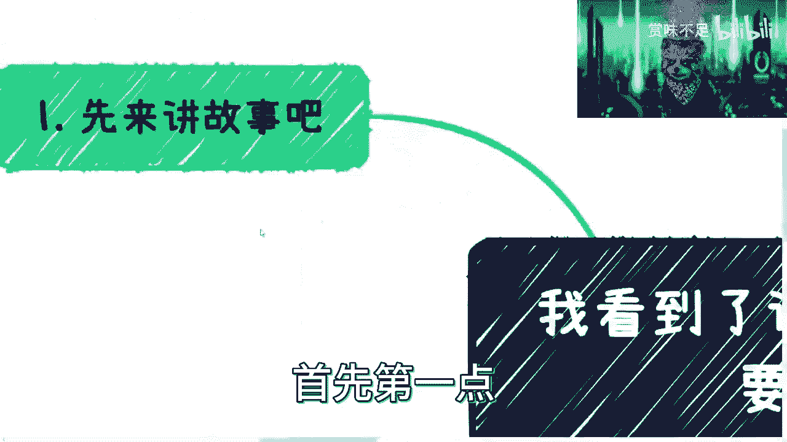

近期，许多咨询和讨论都围绕一个核心问题：如何赚钱。一个普遍的现象是，人们看到朋友、同学或网友在某个领域取得成功，便认为自己也能轻易复制。这种“别人做了，我也要做”的想法，是商业决策中的大忌。

## 第一节：理解“幸存者偏差”与信息差

上一节我们介绍了盲目跟风的普遍性，本节中我们来看看其背后的认知误区：幸存者偏差。

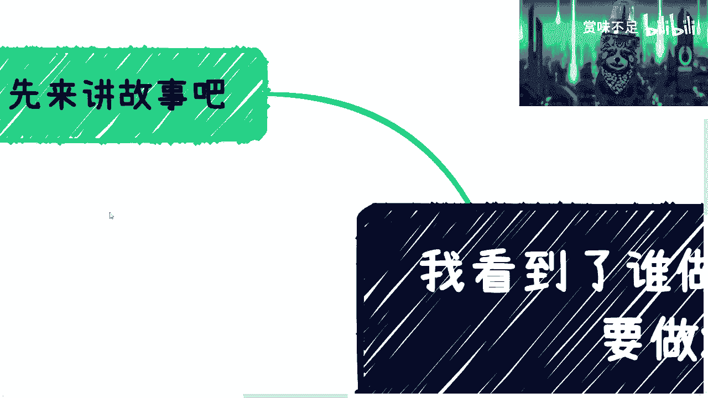

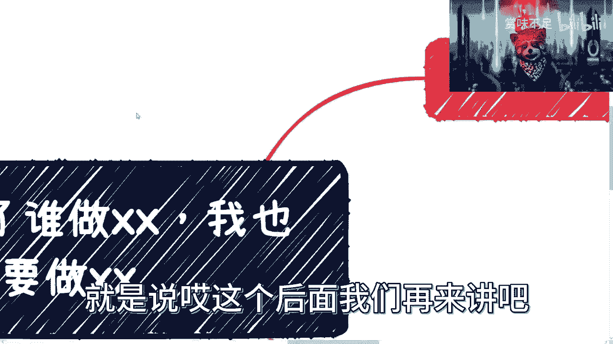

幸存者偏差是一种信息差。问题在于，我们通常只看到成功者浮在水面上的“冰山一角”，却看不到水面下支撑其成功的复杂基础。例如，一个网店月入五千的故事背后，可能隐藏着独特的资源、时机或个人背景，这些关键信息往往被忽略。

**核心公式**：`可见的成功 = 表面的努力 + 隐藏的资源/条件`

仅仅看到表面结果就盲目跟进，失败的概率极高。

## 第二节：审视“赚钱”的真实含义

理解了信息差，我们需要进一步审视“赚钱”这个概念本身。赚钱与否，必须放在一个足够长的时间周期内评估。

短期盈利不等于长期成功。这类似于赌场逻辑：庄家设计规则，确保玩家无论短期输赢，长期来看庄家总是盈利的。许多项目初期能赚钱，让人误以为找到了捷径，于是加大投入。但拉长时间线计算总账，投入产出比往往是负数。

更危险的是，短期成功会制造个人的“幸存者偏差”，让人自我感觉良好，并将错误信息传递给他人，最终可能集体受损。

**核心逻辑**：评估任何机会，都要问：`长期总收益 - 长期总投入 > 0 吗？`

## 第三节：决策前必须回答的三个核心问题

在评估长期性之后，我们需要一个具体的决策框架。做任何商业决策前，必须能清晰回答以下三个问题：

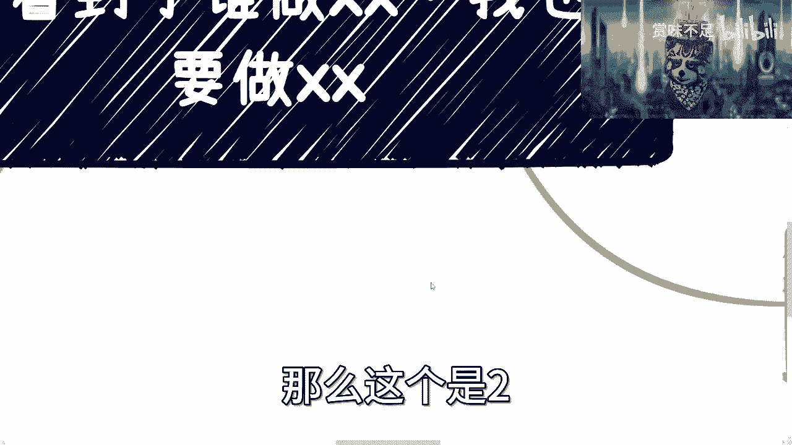

以下是三个必须回答的核心问题：
1.  **怎么赚钱？** 具体的盈利模式是什么？
2.  **谁来买单？** 你的目标客户是谁？
3.  **为什么买你的单？** 你的核心竞争力是什么？

与其纠结行业是否有“痛点”或竞品用户数是否真实，不如聚焦于这三个本质问题。如果能说服自己，就可以尝试；如果不能，就应该放弃。我们关心的是商业内核，而非表面形式。

## 第四节：探究水面下的“隐性竞争力”

回答了基本问题，我们还要意识到，表面相同的业务，其成功的关键可能在于看不见的“水下部分”。别人能做，你不能做的原因有很多。

以下是常见的隐性竞争力壁垒：
*   **营销能力**：你是否掌握获取流量的方法和渠道？
*   **产业链关系**：能否拿到有竞争力的成本或资源？
*   **合作网络**：是否有其他账号或金主进行流量互助、资源支持？
*   **资质与背书**：是否拥有必要的行业资质、认证或特殊背景？
*   **隐藏的启动资源**：初期的用户、资金是否来自非公开途径？

普通人若不具备这些隐性条件，仅模仿表面动作，很难竞争。探究本质，需要主动通过人脉、咨询或调研去了解。

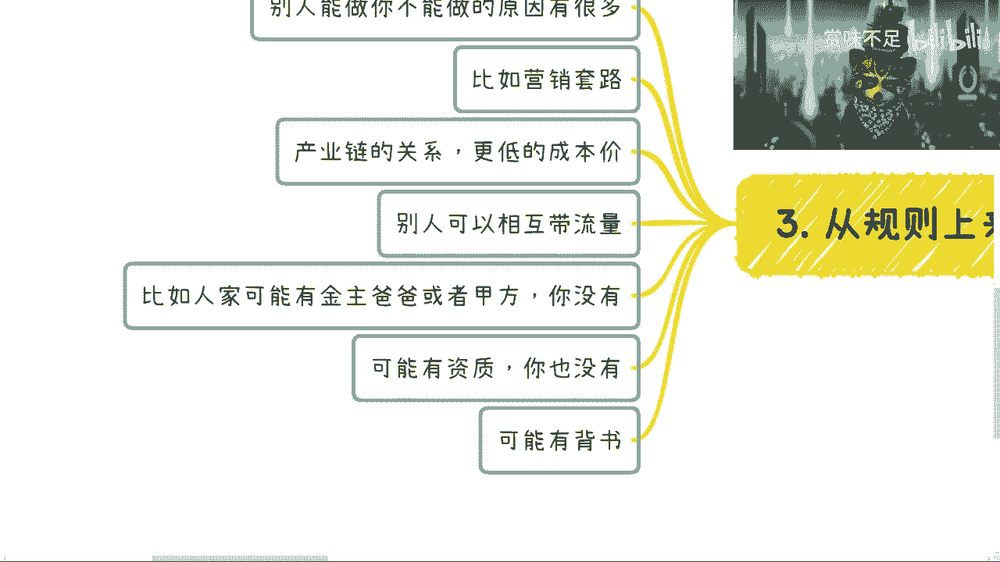

## 第五节：建立长期思维，解决根本问题

最后，我们需要建立正确的思维模式。许多方案只能缓解当下的焦虑（治标），但无法解决能力或认知的根本问题（治本）。随着时间推移，治标不治本的问题会反复出现，且解决成本越来越高。

对于普通人，最实际的建议是：
1.  **放弃“从零做产品”的执念**：产品开发综合成本高，非一般人能胜任。
2.  **追求高投入产出比**：优先考虑能利用现有资源或杠杆他人能力的模式。
3.  **学会“借力”而非“全靠自己学”**：个人的学习能力和时间有限，商业成功的关键在于整合资源与合作，而非事事亲力亲为。

思想上的毛病——急于求成、只看表面、闭门造车——如果不改，就很难突破。

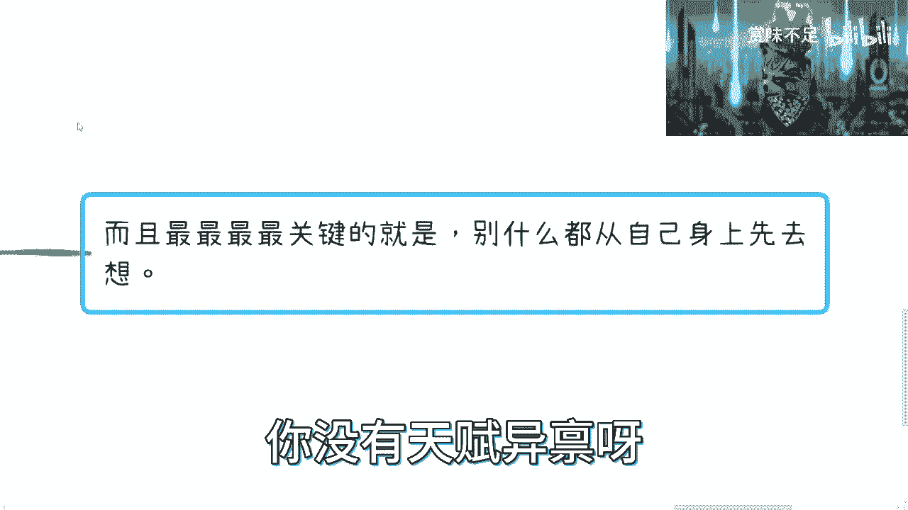

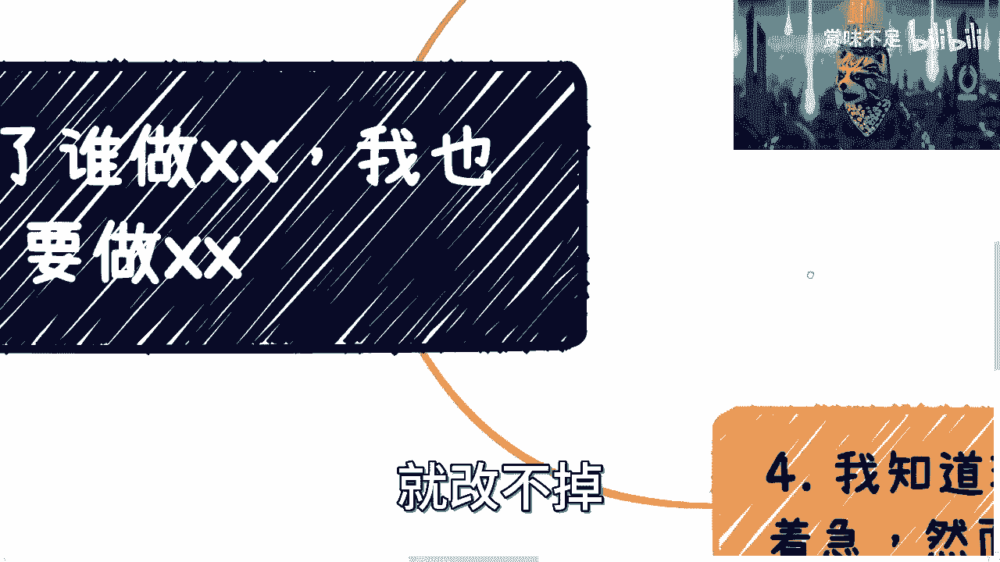

## 总结

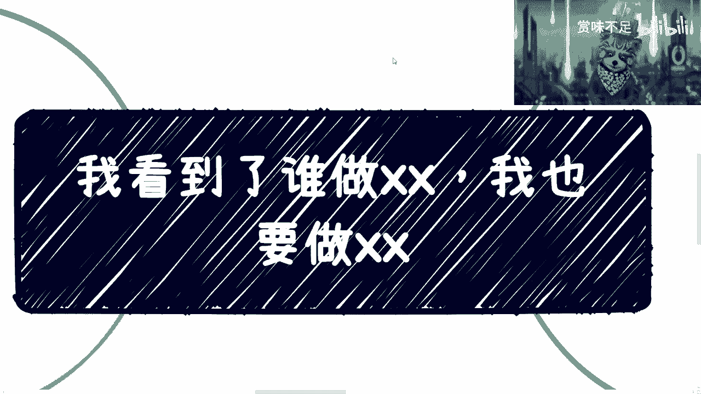

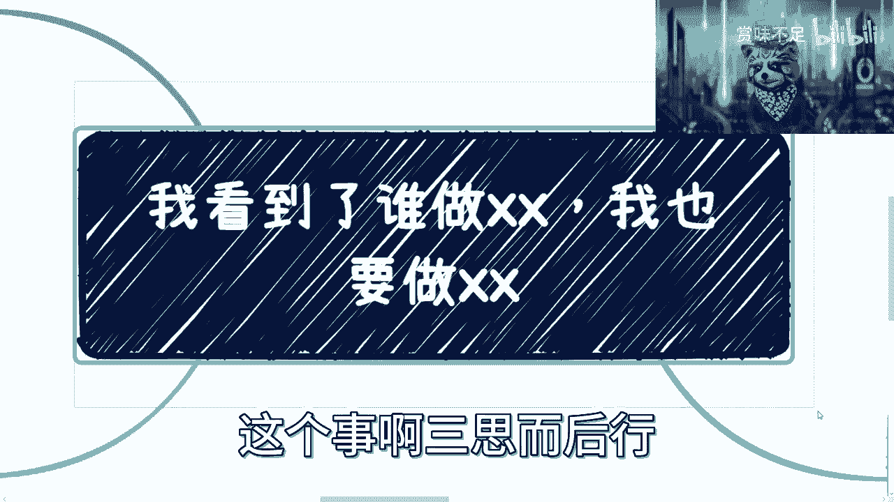

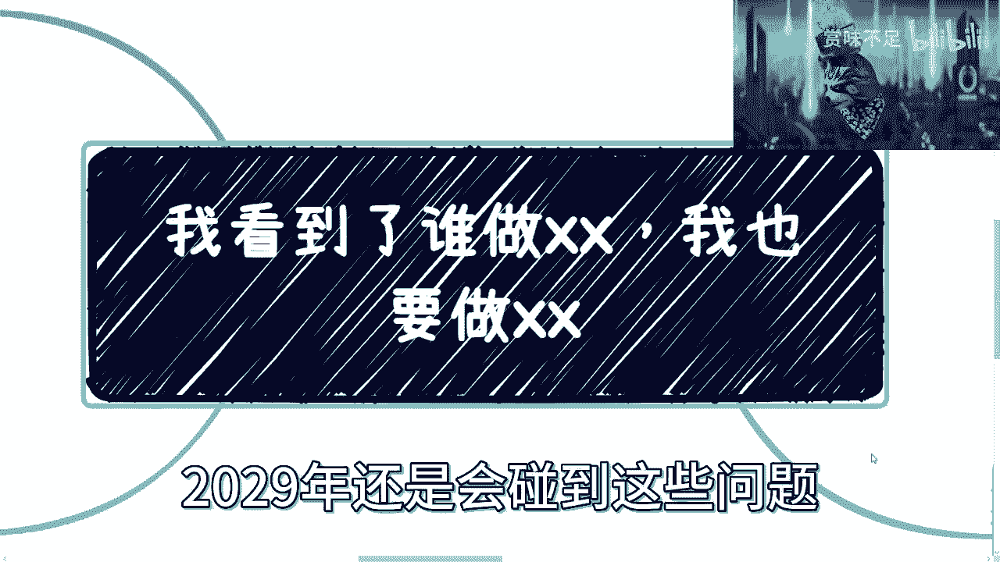

本节课中我们一起学习了避免盲目跟风的核心要点。我们认识到“幸存者偏差”让我们只看到成功的表象，而忽略了水下的复杂支撑。我们学会了用长期视角审视“赚钱”，并用三个核心问题来评估任何机会。更重要的是，我们明白了要探究商业的隐性竞争力，并建立“借力”与解决根本问题的长期思维。

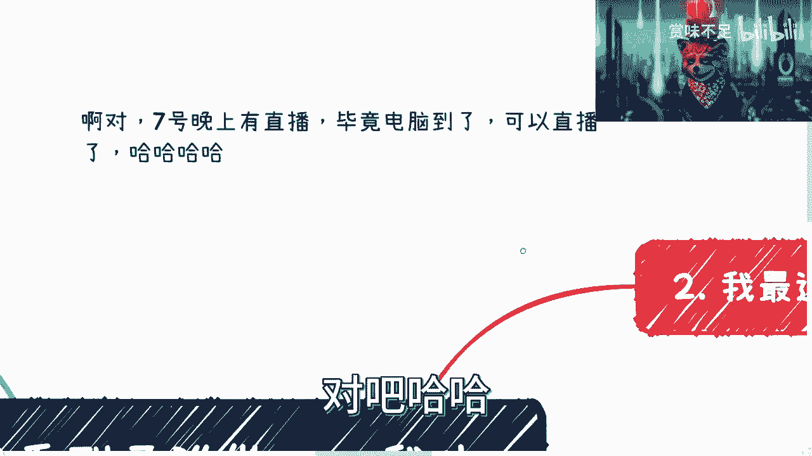

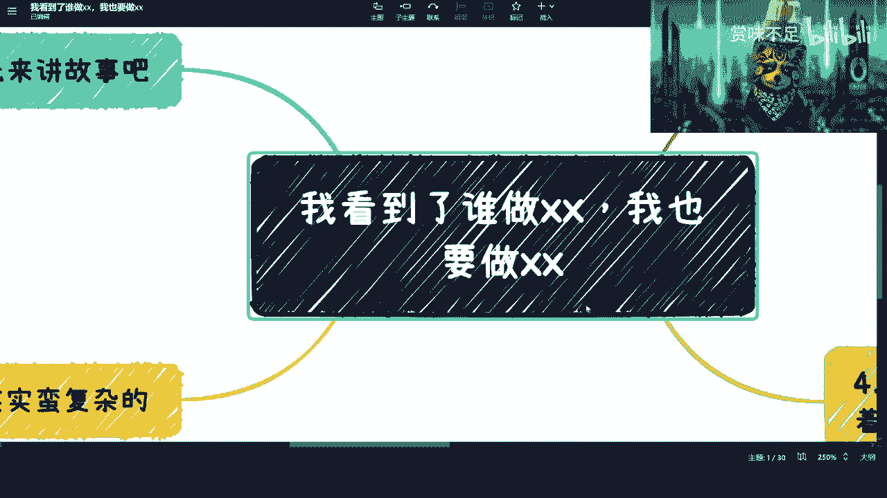

**核心要义**：**三思而后行**。解决燃眉之急是短期行为，唯有解决认知与能力的根本问题，才能应对未来的长期挑战。时间越晚，解决成本越高。