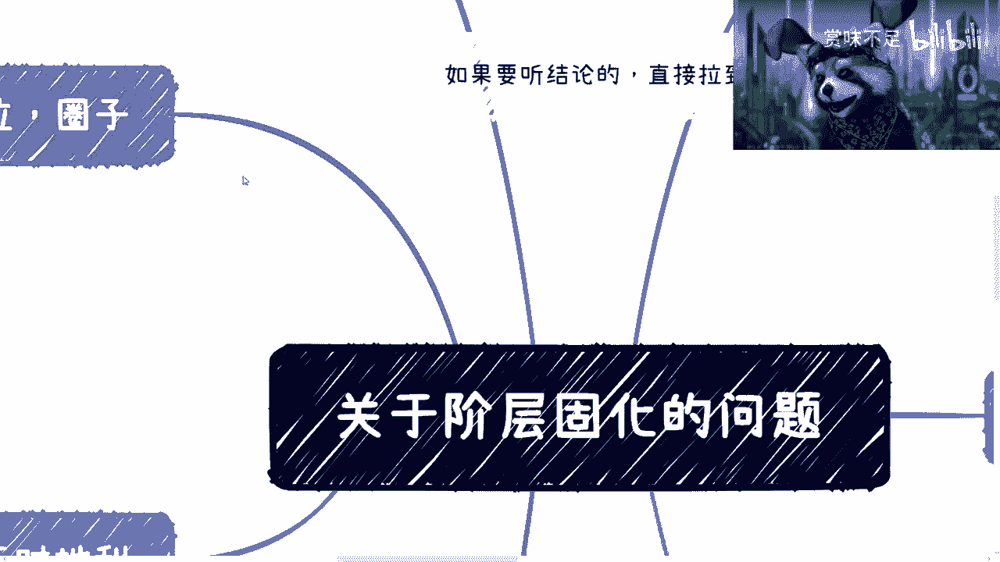
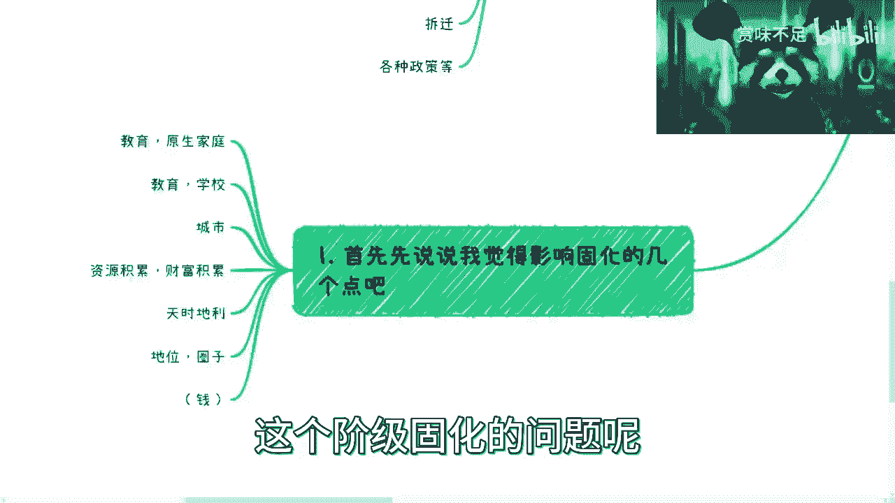
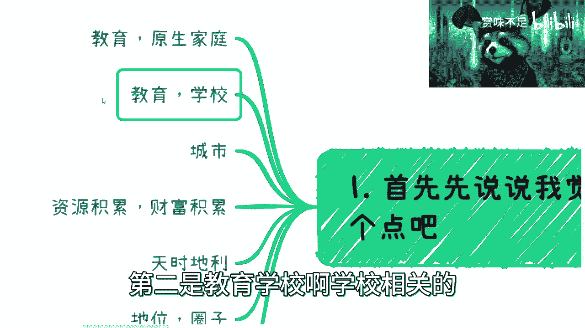
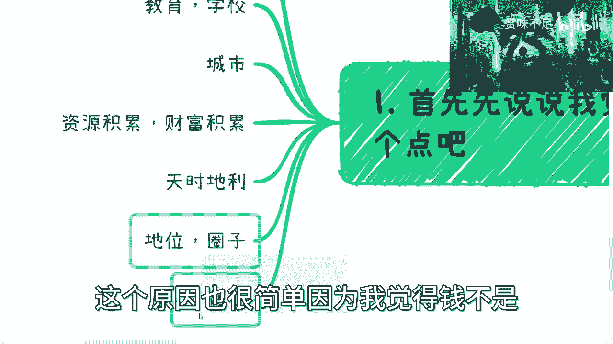
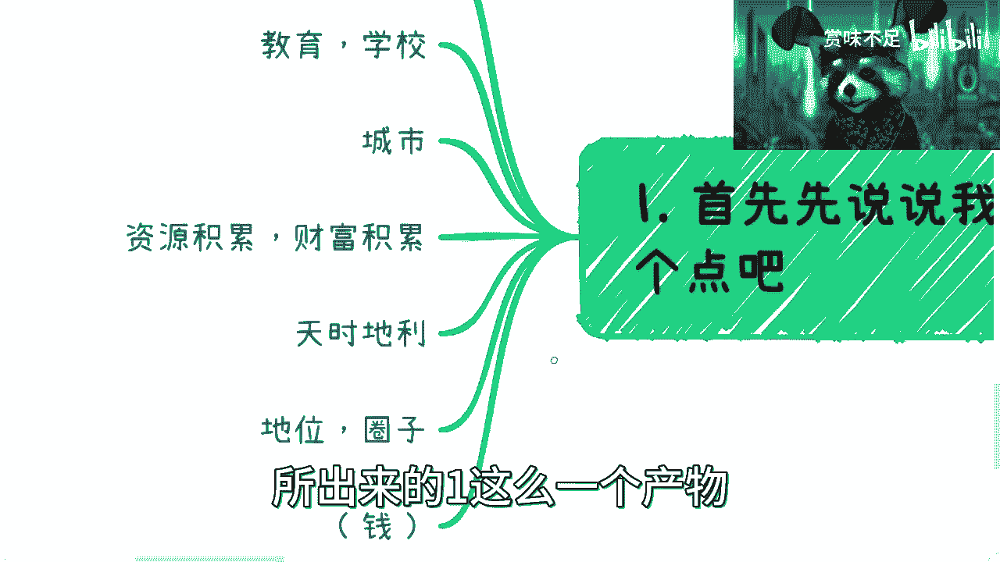
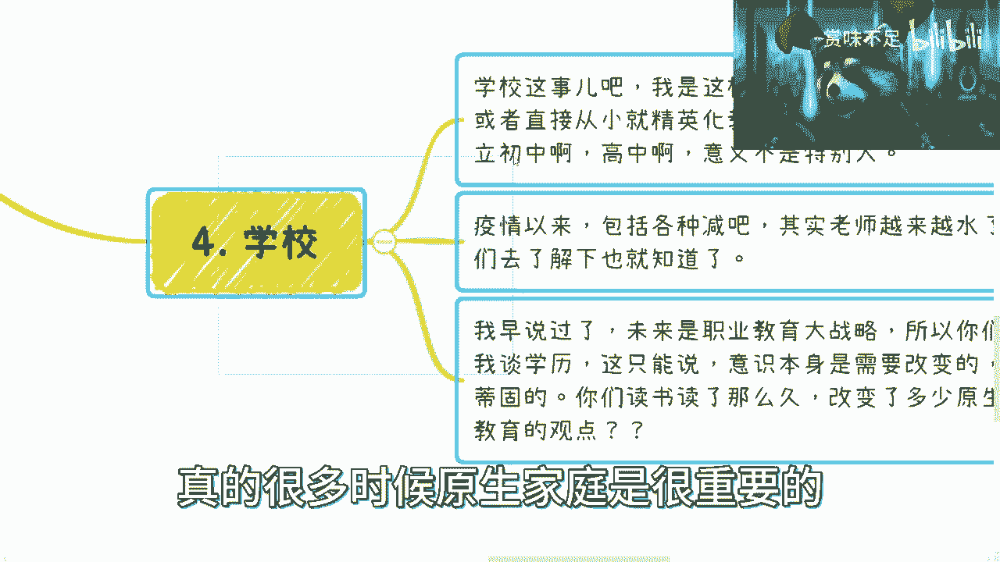
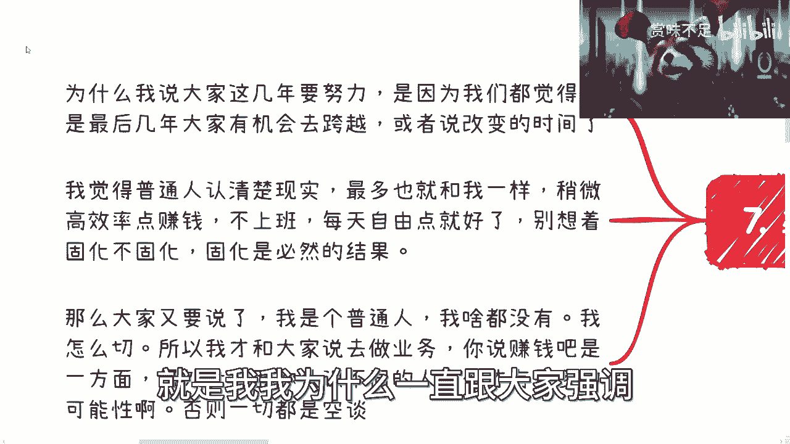
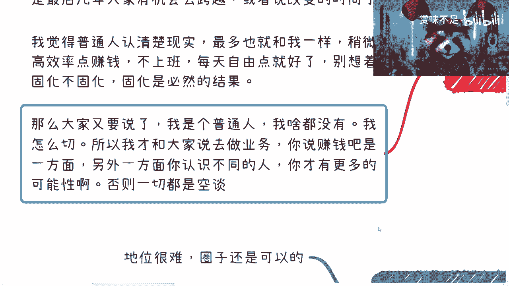

# 社会阶层分析入门 01：理解固化的现实与个体应对 🧱








在本节课中，我们将探讨社会阶层固化的现象及其背后的多重影响因素。我们将从宏观视角分析问题，并聚焦于个体在现实环境中可以采取的务实态度与行动。




---


## 概述






社会阶层固化是一个复杂的系统性议题，并非个体能够轻易改变。我们将首先分析影响固化的几个核心因素，然后探讨作为普通人应如何认识现实并采取行动。


## 影响阶层固化的核心因素

上一节我们概述了课程内容，本节中我们来看看构成阶层固化的几个关键维度。以下是几个主要的影响点：

1.  **原生家庭教育**：个人的早期成长环境、价值观和认知模式深受家庭影响。
2.  **学校教育**：教育路径和资源获取的差异。
3.  **所在城市**：地域带来的视野、机会和资源的不平等。
4.  **资源与财富积累**：历史积累形成的优势。
5.  **天时地利（时代机遇）**：能否抓住特定历史时期的红利。
6.  **社会地位与人脉圈子**：所处的社会网络和圈层。

需要特别指出的是，**金钱**本身并非直接原因，而是上述多种因素综合作用后产生的一种**结果**。单纯拥有财富并不等同于实现了阶层跨越。

## 个体认知的现实基础


理解了宏观因素后，我们需要建立清晰的个体认知。以下是基于个人观察得出的三点现实认知：

1.  **承认天赋与能力的客观差距**。在第一份工作中，我意识到自己与顶尖人才（如全球编程竞赛前20名）之间存在难以逾越的实力鸿沟。公式可以简单表示为：`个人成就 ≠ 纯粹努力`，天赋和基础是重要变量。
2.  **认清与“高净值”人群的差异，停止无意义抱怨**。通过与富二代、企业家的交往，我认识到某些差距是客观存在的。抱怨无法改变现实，关键在于认清事实并着手改变。
3.  **接受“无限接近但难以跨越”的现实**。在许多方面（如财富、关系），个人可能通过努力无限接近某个目标，但实现真正的“跨越”极为困难。例如，在房价飙升前购房是时机把握，错过之后则难以追赶。

## 对各影响因素的深入剖析

基于上述认知，我们来逐一审视各个影响因素。

### 1. 原生家庭 📍

原生家庭的影响存在代际差异。90-95年代出生的人，由于更早接触信息技术，其认知广度可能优于更早世代。然而，未来的趋势是**两极分化加剧**：家庭背景好与差的孩子的起跑线差距将越来越大。同时，部分自身尚未成熟的父母养育下一代，可能加剧“巨婴”现象，影响代际发展。

### 2. 学校教育 🏫



对于学校教育，有两种清晰的路径：一是依靠实力（财力或智力）持续获得精英教育；二是接受职业教育大方向。跟风进入普通私立学校意义有限，因为：
*   学校环境的“增益效果”遵循`正正得正`原则，它主要放大已有良好基础和自驱力学生的优势，而非从根本上改变学生。
*   教师队伍的总体水平存在波动，单纯依赖学校教育的预期需调整。


教育的本质改变有限，许多由原生家庭塑造的观念难以通过几年学校教育扭转。

### 3. 天时地利与圈子 🤝

*   **天时地利**：房地产、自媒体、直播带货等机遇具有很强的时代性。公式为：`个人成功 = 能力 + 时代机遇`。许多人的财富积累源于抓住了时代红利，而非绝对能力出众。
*   **地位与圈子**：社会地位难以快速提升，但融入圈子是可能的。关键在于**价值交换**：你需要拥有他人所需的价值（如专业知识、信息资源）。代码逻辑可类比为：
    ```python
    if 你拥有圈子需要的价值:
        融入圈子的可能性提高
    else:
        融入困难
    ```
    圈子的建立是长期行为（A→B→C）的结果，而非一蹴而就的目标。



## 结论与个体行动指南

综合以上分析，我们得到以下结论与行动建议：

1.  **时间窗口宝贵**：当前几年可能是普通人通过努力改变境遇的最后相对容易的窗口期，未来难度会倍增。
2.  **认清现实，专注自身**：普通人应认清现实，避免终日焦虑于“固化”或攀比他人（如网络上的奢华生活）。焦虑本身毫无用处。
3.  **从务实目标开始**：不要设定“跨越阶层”这类虚无目标。应从具体事务做起：
    *   **积极尝试业务**，寻找盈利机会。
    *   **广泛接触不同人群**，拓展认知和可能性。
4.  **突破职场局限**：不要将思维和机会局限于公司内部。外部有更广阔的世界和可能性。



## 总结


本节课我们一起学习了社会阶层固化的多维因素，包括原生家庭、教育、地域、机遇和圈子等。我们认识到，固化是宏观趋势，但个体并非无能为力。**核心在于放下对“跨越”的执念，停止无效抱怨，转而认清自身条件，把握当下，通过创造具体价值和拓展连接来改善自己的处境**。问题的本质不在于纠结是否固化，而在于个体如何在现实框架内积极行动。