# 我膨胀了，竟然来谈阶层固化问题了 - P1 - 赏味不足 - BV1114y1Z7hj

好啊大家好啊，这个今天上班了是吧，但是我不上班啊，这个别羡慕我对吧啊，我又装到了啊。

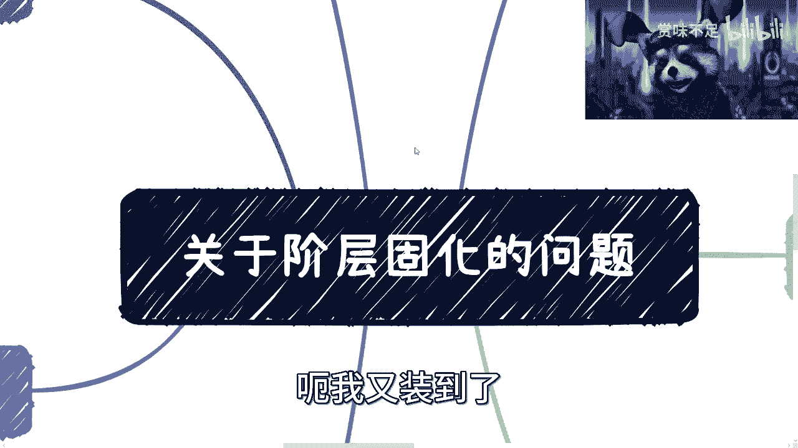

昨天有评论让我讲这玩意，我觉得我现在胆子越来越大了是吧。

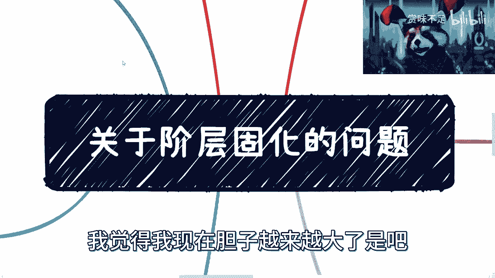

就啊越来越放得开了啊。

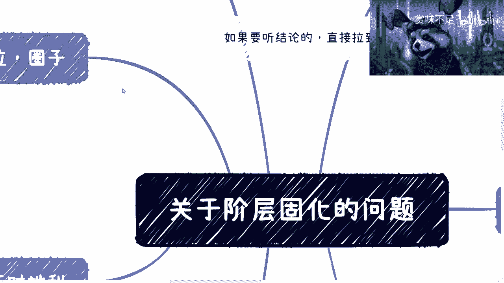

哦对这边提一下，如果你们要听结论呢，拉到最后对吧，因为我把结论写在了最后。

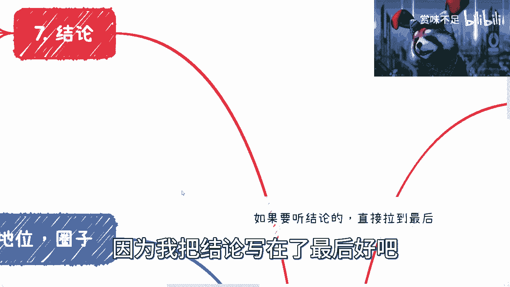

好吧啊。

我说实话啊，我觉得是这样子的，就是啊我最多也就讲讲固化对吧，你别跟我，别让我去讲说你怎么改变这个东西啊，改变这种东西我最后的确会想，但是我不觉得会改变啊，就就这么回事啊。

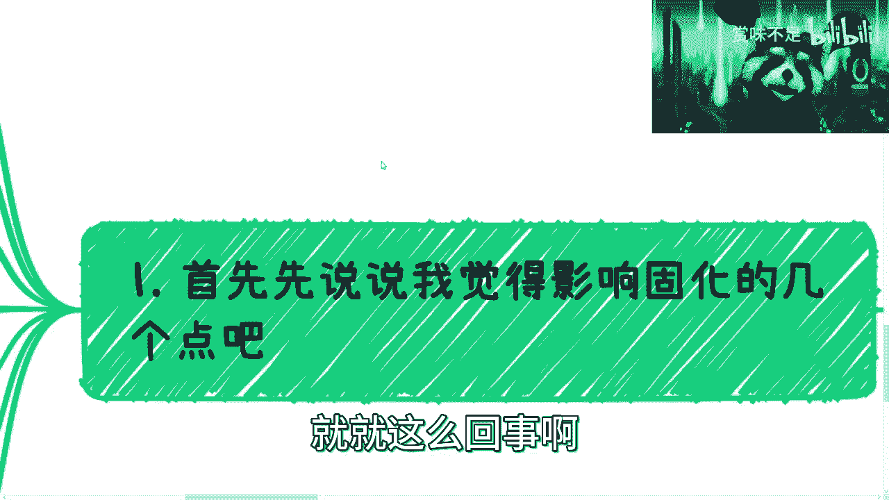

首先我觉得影响几个点啊，这个是一个大的问题的，不是你我或者这个个别个体能够解决的是吧，首当其冲的就是原生家庭教育相关的。

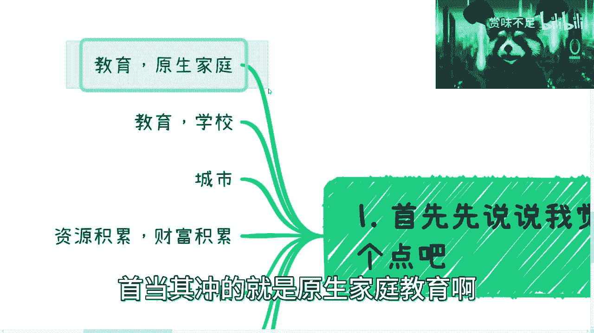

第二是教育学校啊。

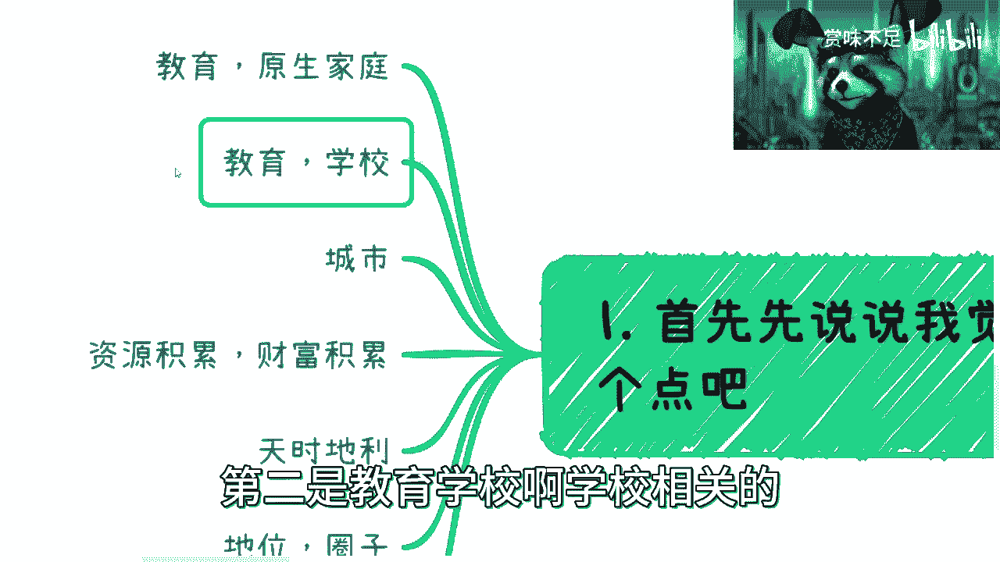

学校相关的，第三点是城市是吧，这个来了，这个我待会再讲吧，但是城市因为我这边没有练啊，我城市这边可以先讲一下城市，这里呢我觉得影响是很大的，就不管你的所见所闻啊对吧，你的一些这个这个认知啊。

各个方面还是很不一样的，嗯你就好像我随便打个比方吧，就好像我前两期的视频最早的时候，我当时不是说嘛，我说我说现在有些人对吧，可能这个赚个一两百万对吧，觉得怎么样怎么样，然后下面评论区就有人跟我说啊。

这个驴老师果然不接地气是吧，这个觉得一两百万竟然都觉得少，我我说实话我觉得是少，为什么，因为我作为一个在上海新天地的人，一两百万买个厕所差不多吧是吧，那那那你我没办法，你让我在上海这地方买。

就是你随便找个房产中介对吧，前面都是后面四个零，前面四位数的，那你这个让我怎么说呢，我没法讲了是吧，那你说这个这个价格，可能在我看来的确是就是毛毛雨啊。

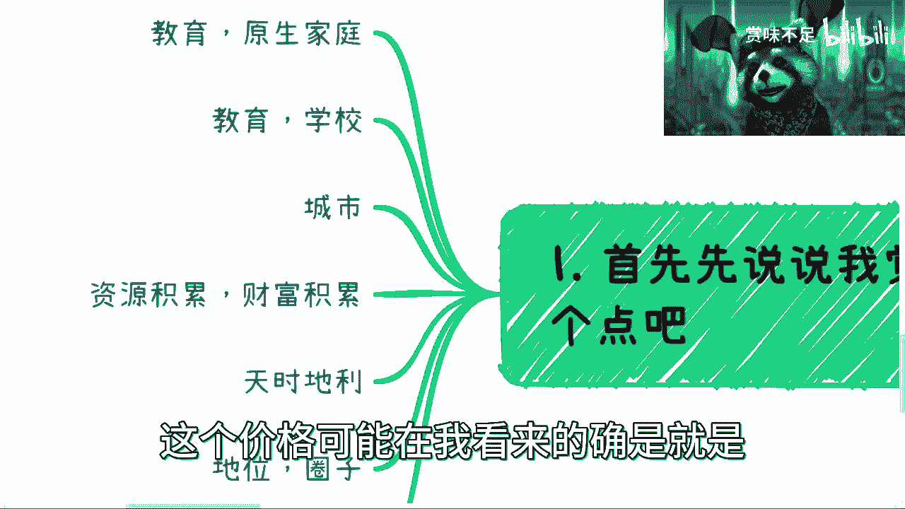

是吧啊，然后是那个资源积累对吧，财富积累，然后是天时地利啊，地位跟圈子啊，最后我把这个钱呢打了个括号啊，这个原因也很简单，因为我觉得钱不是呃。

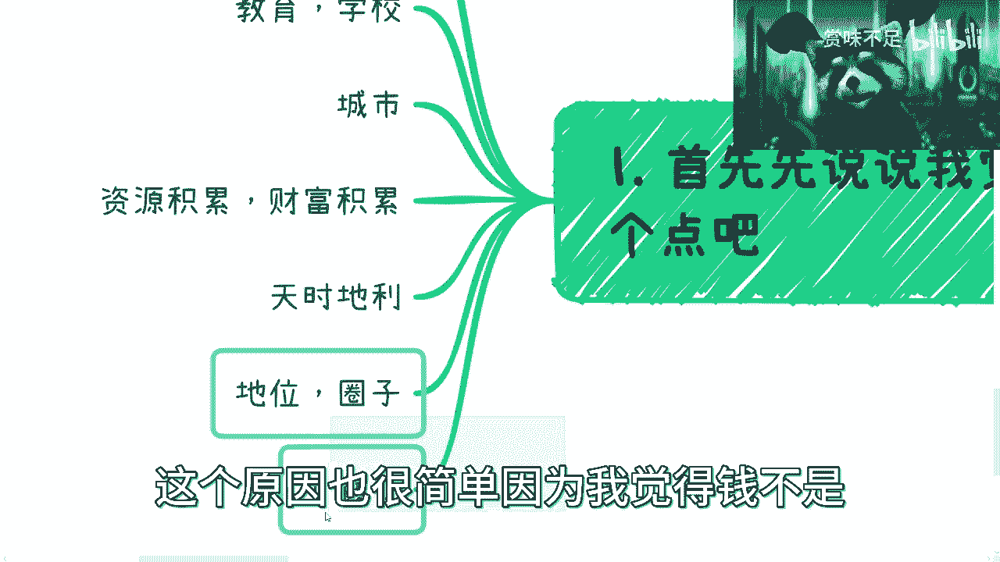

钱不是问题，就是钱不是说会影响到整个固化的这个点。

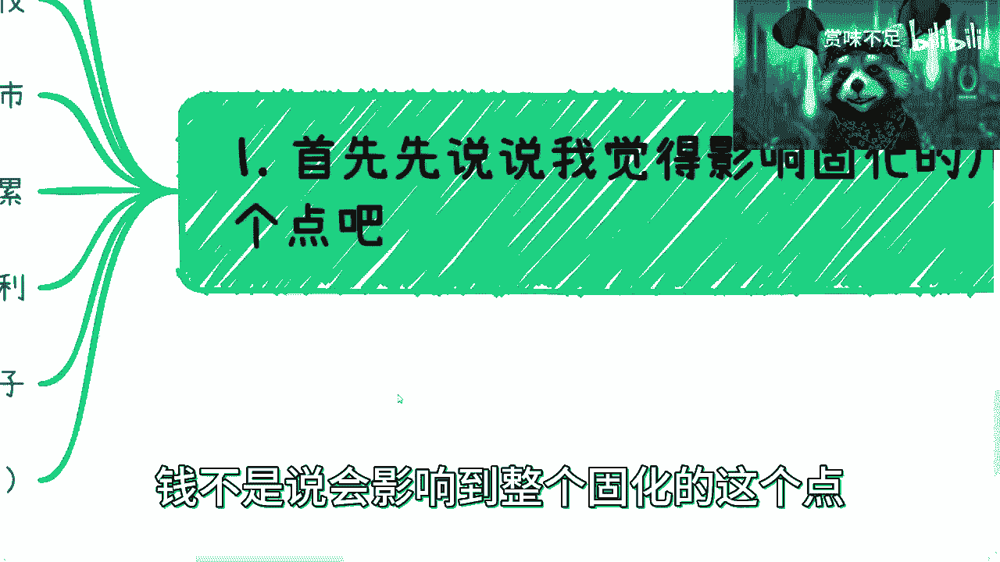

就是就是钱可以是所有的这些综合因素，最终在过程当中也好，或者最终也好，所出来的作为一个产物。

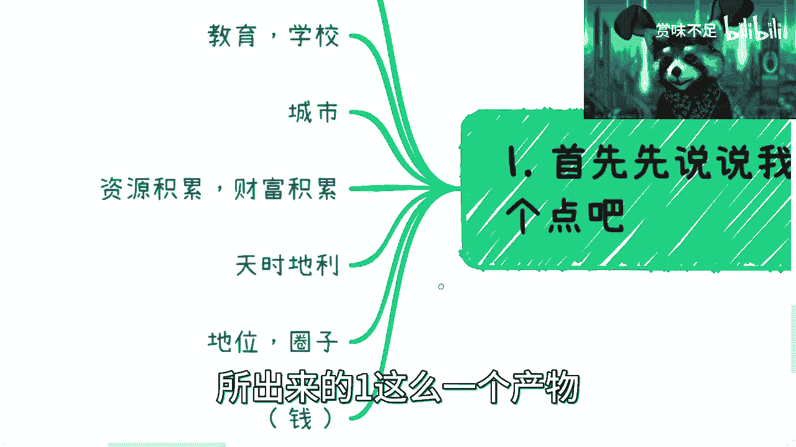

但是钱这个东西不会直接影响到这一点，也就是说今天啊，比如说你们在座各位，我扔给你们一个亿，你们说你们改变了这个阶级吗，我NO是吧啊NO好吧。

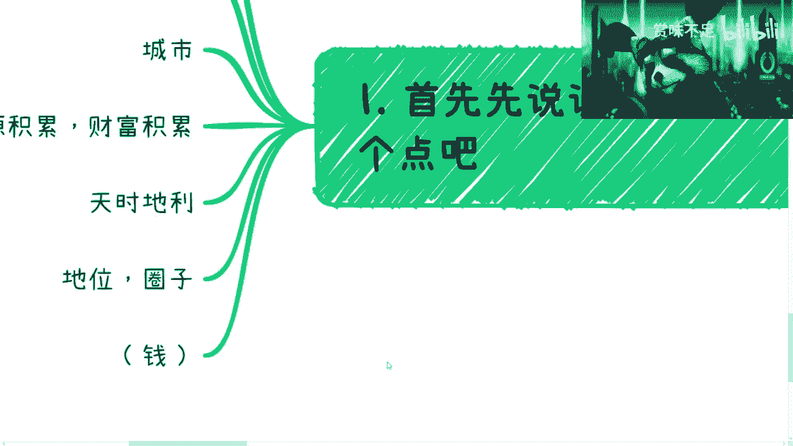

那么我觉得这点大的前提呃。

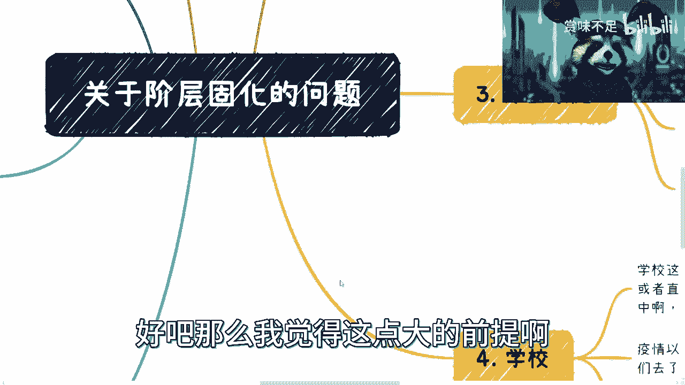

然后呢我觉得我先说一下几个我自己的认知啊，第一呢我觉得第一份工作，就我自己第一份工作嘛，在创业公司做的，我当时做个技术嘛是吧，我觉得呢，第一份工作让我意识到我是一个普通的，不能再普通的人是吧。

就是我与别人之间无法跨越的鸿沟，而且我觉得不仅这辈子下辈子我也无法跨越，为什么呢，因为我当时那个同事呢是全球的啊，就是在那个google code jam啊，叫GCJ啊，这个全球的这个竞赛里面。

我记得应该是前20名还是前40名，反正就是20名吧，应该是啊，反正就是说在清华应该是属于前无古人了啊，是不是后后有来者，这我是知道的对吧，后面就是楼教主是吧，那我觉得这个是第一个问题。

就是我觉得就是有天赋上的差别，就是这种人是属于不是我多努力的问题，也不是我战术上多么啊怎么做的问题，就是我跟他在实力上也不仅我跟他，我跟很多人在实力上是无法跨越的鸿沟对吧。

我觉得我在第一年就已经认识到了这件事情，我也不抱任何这种幻想是吧，就我是个垃圾，我很清楚是吧，这是第一点，第二点是我身边富二代跟土老板有很多啊，就是融资资金量在上十几个亿的也有。

包括就是说啊自己就是只有很有钱的也有对吧，但幸运的是呢，他们跟我关系都还比较好，为什么呢，可能因为我没钱对吧，或者在我在他们看来了，我就是个做技术和写书的啊，但大部分他们也不知道我到底是做什么的是吧。

但是呢我觉得大家还是比较和睦相处的，那么在这个过程当中，我是觉得呢就是说一样的，就是跟第一个一样，就是说我会认清楚很多东西，的确你就是有差距，你不能去抱怨，或者说你不能怨天尤人。

你不能去去去想些有的没的对，就好像比如说我我每次每天都跟别人说，哎我怎么跨越啊对吧，我我现在固化怎么办啊，有意义，不然没有意义的呀，你知道吗，就是说这些讨论这些东西没有意义，而我们得要去。

就我觉得我们只要做两件事情，第一件事情就是说认清楚事实是什么，别抱有任何的幻想是吧，二就是说当下从今天开始就开始去做出改变啊，不要每天在那边说啊，这个这个那呃那个那个说这个说那个对吧，然后呢也不做改编。

然后就是抱怨这个没有用的啊，没有任何意义的，那么第三点呢，就是说呃我觉得就是说很多东西啊，我们是可以无限接近的，但我们的确无法跨越，这点你要明白，就不管是关系还是金钱对吧，还是别的东西。

就是你会发现你接近了，但是你的确无法跨越啊，这个东西嗯，反正你们回头要是有认知的，就慢慢慢慢会明白我说的，你再比如说我买房是吧，我买房其实是14年7月份吧，还不是15年7月份，我忘了。

反正就是再过几个月我就买不起，就我就这点钱，当时啊我就早年互联网，我也承认我赚到过一点点钱是吧，那我就我就这点钱，我再你再过两个月再往上涨，我就买不起了，你到现在更买不起了是吧，我现在这房子虽然很破。

1000出头一点嘛对吧，你要我买得起啊，我他妈下辈子我也买不起啊，是吧啊，然后还有呢就是虽然我现在也不上班对吧，在大家看来，我貌似的确比我同学们要做的过得好对吧，我同学觉得看我也过得过得比他们好啊。

事实上呢我觉得谈这个啊我就过分了啊，最多也就是说过得好一点，最多我觉得也不叫过得好一点，最多叫自由一点，因为你想想看，我在这个地方你怎么算过得好呢是吧，我我这么跟你们讲吧。

我们以前日常吧三个人吃个火锅对吧，差不多要1500对吧，我请别人吃饭差不多2000对吧，然后我每个月的停车费差不多是在1600对吧，那然后包括我日常，可能请别人随便随便吃个什么饭吧。

中国人均两三百总归是要的是吧，那你说怎么过得好呢，就是唉就是好不好吧，跟你赚多少是有关系的是吧，那你说我在这个地方，我但凡叫什么消费低一点，那我肯定过得更好是吧。

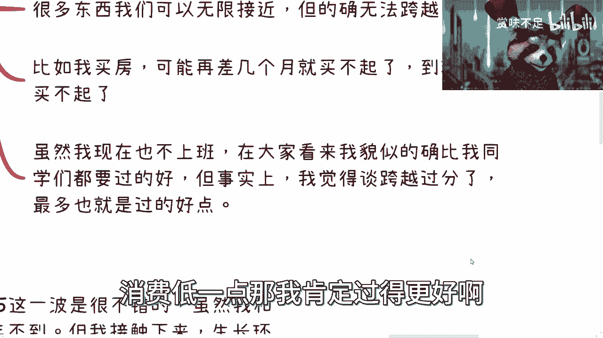

那他低不下来啊，我能怎么办呢是吧，那我觉得这个是二三呢。

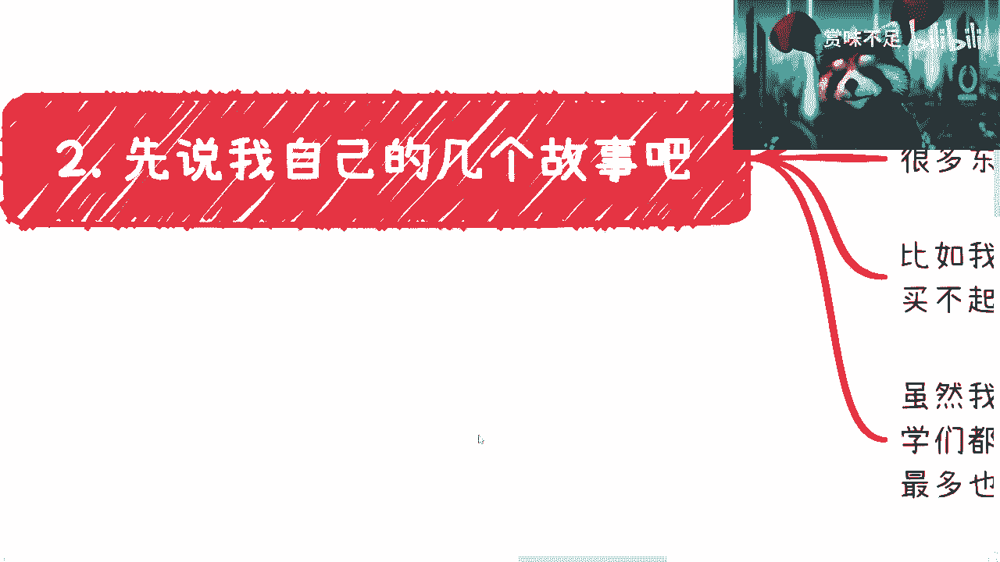

就原生家庭啊，我们开始慢慢说啊，原生家庭呢我觉得这个事啊在我看来啊，它是有个小高潮的，但是现在接下来就往往往下走了，为什么呢，因为我个人觉得我接触下来了，其实九零或者说90~95，因为我八八的嘛。

说了那九零离我差两年，我觉得可能没什么好说的，就是93~95吧，我觉得我觉得这一波还是不错的，为什么呢，因为虽然我觉得就是我和他们他们也没差多少，但是我接触下来，我是觉得大家生长生长的环境还是很不同的。

毕竟为什么，因为我有个很大的感受是什么呢，就是嗯我这一代或者我前面的一些小伙伴，大家其实接触电脑都比较晚，但是九零后不一样，九零后他接触电脑时间其实很早，你别看就差这几年，这几年差别很大哦。

接触电脑很早，那么他们对很多东西认知远远高于我们，就是就很简单嘛，就好像比如说我可能高中才认知到的东西，可能他们小学就认知到的，甚至他们没到小学，他们父母就告诉他们了对吧。

我觉得这个就是就是很大的一个一个关系，而且另外一方面，就我是觉得，我这一代以及前面这一代的这个父母呢，其实有知识，就是知识水平相对中上的比例不高，但九零后不一样，我觉得比例还是有，就相对来讲高吧对吧嗯。

然后这个就是我第二个说的，第三个呢就是说呃这就是个小号小高潮，因为往后呢，我觉得大部分原生家庭肯定是越来越不行了，或者来说其实就是两极分化，就这个东西是没有办法的，而且我可以明确告诉你们。

不单单家庭两极分化，整个未来一二线城市的就是上下级，上下层也会越来越两极分化，因为什么，因为资源越来越被垄断掉，这点我可以明确跟你们讲，别呃你们别拒绝的，前面20年怎么样怎么样，但是未来更两极分化哦。

更两极分化，之所以前面20年，你们会觉得全民创业或者怎么样，是因为全面20年的确有很多很多机会，但现在没有了啊，你们自己看吧，还有一点呢，就是现在呢我觉得巨婴越来越多，就是拥有成熟的人生观，世界观。

价值观的很多的，这就是人是没有的，然后呢他们都是被迫，或者说自己还稀里糊涂就去结了婚，生了孩子，所以我是觉得连自己都还没活明白，她去生孩子，你你还谈教育，还谈下一代有什么好谈的呢，对不对，没有意义的。

就是嗯就是可能再过甲乙时，甲乙10年吧对吧，再过很长一段时间，你们的孩子，未来在街上碰到的可能都是一些对吧，看似30多岁，心理年纪也就十几岁的这种人啊，你们想想看啊，那么这个是三学校呢。

我觉得是这样看的，学校呢我觉得就我的态度很简单，你要么就一路实力对吧，你说我从幼儿园就实力啊，老子有钱可以啊，或者呢你就直接从小就精英化教育也没问题啊，别你也别跟我谈什么国内国外啊，我不管。

反正就是精英化教育啊，否则呢我觉得本质上跟风去什么呃，比如说什么什么私立的初中啦，私立高中啦，我觉得意义不是很大，因为什么呢，因为呃这个地方我也写了，因为什么呢，因为我认为一个人的变化呢。

它不仅仅只是几年的教育能改变呢，主要还是看你自己的一个成长发展，跟自己的意识诚信，但是当然了，也有很多人会说嘛，他说啊那这个好的学校啊，很多东西啊，环境上啊，就是呃叫做氛围上还是不一样的，但我跟你们说。

我觉得这件事情是这样子的，环境上跟氛围上的确是不一样的，但是你的这个学校的Buff往往是一，就是正正得正的，你知道吗，就是说他给那些原本就有很好认知，很好习惯的人，他是一个Buff。

但是他给那些你说你希望通过环境去改变他的，改变你孩子的这些人的这么一个定位的话，那其他就是正负得负的关系，就当然不叫正负得负，就是他不会得到这个Buff的一个一个一个加成，你知道吗。

所以说本质上我觉得这个呢是一个辅助的，一个一个一个状态，更多的还是看你孩子，或者和这个人原本的这个认知啊，或者自我的驱动力到底怎么样对吧，这是第一点，第二点是疫情以来，包括各种减对吧，你们也知道。

其实你们去了解一下就知道，其实老师现在是越来越水，越来越水，而且我跟你讲，这个事情不可能触底反弹的啊，为什么为什么，那很太简单了，我就问你们嘛，你们上班什么态度吗，老师是不是也上班吗。

那你们上班什么态度嘛，老师什么态度吗，你们自己想想看嘛，对不对，是吧，扪心自问一下不就知道了，然后呢另外一方面呢，我早就在数字经济那个合集里面跟大家说过了，未来了，从20代的整个大方向。

或者前面10年的大方向就说的很清楚了，职业教育是大战略，你们别来跟我谈学历有意义吗，没有意义，就是我只能说什么呢，意识本身是需要改变的，你们的意识是由你们的父母所传达的。

你们的意识是由你们的老师所传达的对吧，那么这个时候我们就说啊，就是为什么没没法，就是可能你们已经明白了这件事情，但是你们没有办法改变，你们还是觉得啊，我现在要去卷对吧，我要我要去卷，为什么呢。

是因为你们的认知告诉你们，你们就要这个东西，但是我就问你们，如果5年后10年后没有用，或者说其实没有那么重要了，我就问你们，你们怎么办，你们是说哎我这5年时间就浪费了，还是怎么说对吧，所以你们想想看啊。

你们读了这么久的书，请问你们改变了多少，由原生家庭，原生家庭教育所带来的观点有吗，有多少其实没有，所以你们要明白，真的很多时候原生家庭是很重要的。

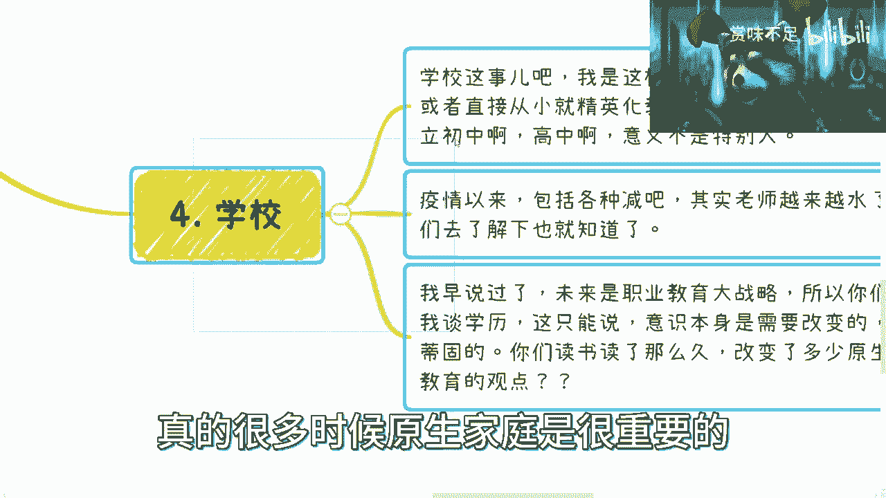

这些都是辅助的，这些都是复制的，没有太大用处的对吧。

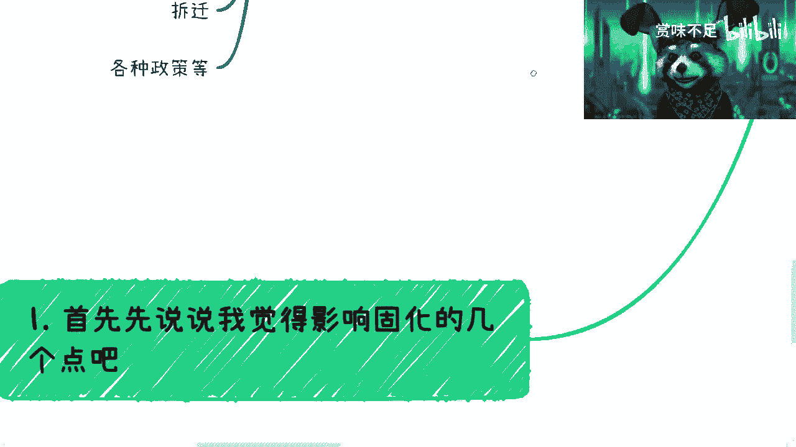

好五呢就是天时地利，天时地利，我跟你讲实在太多了啊，这个房地产啊，p two p啊对吧，这个唉我这边写了是啊，房地产对吧，自媒体啊，直播带货啊，拆迁啊，各种这种福利政策啊，很多很多对吧。

就是它是一个时代造成的，它不是一个说啊，你战略队或者战术队就是的，就是很多时候很多时候你们身边的有钱的人，你们身边有圈子的人，并不是因为他们能力很出众，很突出，而是因为他们的时代很好。

或者他们赶上那个时代，但是不管怎么样吧对吧，这个胜者往往败，败者为寇对吧，你以结果为导向，我觉得就这么简单嗯，大家就算在这个叫做客观的去评价，那么呃无论再怎么客观评价，无论别人再怎么认同你。

事实就是事实，你不可能把它的财富跟你使用大富翁的均富卡，对吧啊，所以就是就就这么简单件事，那么地位跟圈子呢，我觉得是这样子的，地位是很难的啊，圈子我觉得是可以的，但是圈子呢本质上还是要让别人觉得。

就是你有你有别人想要的东西，或者你有别人没有的东西对吧，这就好像比如说啊游艇party对吧，我大概前年吧，哎呦我差不多每周美洲哎，其实也不是你们想的那种嘛，就是游轮对吧，游艇也偶尔去游轮比较多是吧。

然后你比如这种对吧，然后还有那种什么什么高净值人群的，什么相亲会啊对吧，什么ENBA什么聚会啊，就这种时候是这样子的，就是你就像那些富二代，我跟他们的关系是一样的。

就是就是我可能有什么他们哪些没有的东西呢，那可能比如说哎，他们想了解一些这个新前沿东西啊对吧，他们想了解一些这个技术的东西啊，他们想了解一些什么什么什么，有可能有问题找我咨询啊对吧。

那可能就是我我我有的，他们没有的，那毕竟很多时候就是说他们的确比我有钱是吧，但是你说他们去找一个陌生人去咨询，或者找一个陌生的人去去了解，或者给一笔钱，肯定是不如找我来的靠谱啊对吧。

更何况我还不收他们钱是吧，那这个是第二个，第三个呢，我觉得要切入圈子呢还是容易的，但是呢就是你会发现就是整个事情啊，你会发现跟我们之前说的教育啊，家庭啊，天时地利啊，这是相辅相成的，就是就怎么说呢。

就是说不是说今天你给自己的目标，你说好，我要改变圈子，我要去切了是吧，没有这种事情的，就很多事情是你做了A你会得到B，你你吃得到B的时候，你会得到C，而不是说你说哎我A不做，我就在那边躺着对吧。

我就想着每天要得到B这个不太可能，你知道吗，这个是六啊，好那么我们来说结论，哎我讲了多久啊，15分钟也差不多了，结论结论呢我觉得是这样子的啊。

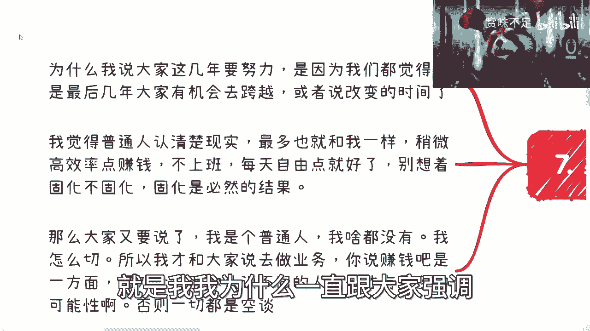

就是我我为什么一直跟大家强调，这两年要努力呢，是因为我我们都觉得不是我啊，我们都觉得这是最后几年大家有机会去跨越，或者说不能叫跨越去改变的时间窗口周期啊，就这么回事啊，当然不是说未来没有机会。

我只能说未来越来越难哦，男的比你们现在要难不知道多少倍，那么你们现在反正听不进去对吧，晃晃悠晃悠两年，两三年晃掉，那反正你们后面自己看着办吧是吧，然后呢，我觉得普通人呢就是认清楚现实。

最多也就跟我一样对吧，稍微高效率的赚点钱，你不上班，每天自己有一点对吧，你别老想着固化不固化，也别老也别把眼睛老看着别人是吧，我早就说了啊，别去看网上那些有的没的对吧，什么什么GPT啊。

什么别人别墅靠海啊，跟你有什么关系啊，我就问对吧，你每天看这么多信息，活在焦虑里面，你最终除了焦虑一事无成，你能干嘛呢，是不是没有卵用的是吧，那这第二点第三点呢，那么我相信所有人都要说了啊。

我是个普通人，我啥也没有，我怎么切是吧，所以我才跟大家讲啊，所有东西你作为普通人，我跟你们都一样，我毕业之后有啥我啥都没有，那我就请问我怎么去切嘛对吧，我要当时跟你们想法一样说啊，我要去切切什么好。

我要财务自由对吧，我要切圈子，我要切，我要这个什么切切切什么东西啊，切地位对吧，那我做个屁啊是吗，因为你给了一个很虚无的目标，你你根本就够不到，你知道吗，所以我才跟你们说，你要多去做业务，多去接触人。

你说赚钱是一方面，另一方面你要认知不同的人，三教九流，你才有更多的可能性，对不对，你你否则你来了哪里来可人性嘛是吧，我不是说你们按照我说的123456，就一定能得到ABCDE不是啊。

但是你们不按照这个123456现在去做，你们肯定是没有机会的，这已经很明确的人，你告诉我怎么弄啊，天上掉下来了，那当然你你你你你你去找个富二代，对你去找个富二代包养，可以啊，没问题，是不是。

那我说不好听的，你抱怨你还得有能力的，你你以为你说抱怨就抱怨了是吧，唉所以我是觉得就是说就说唉，我们回到这个问题上来了哦。

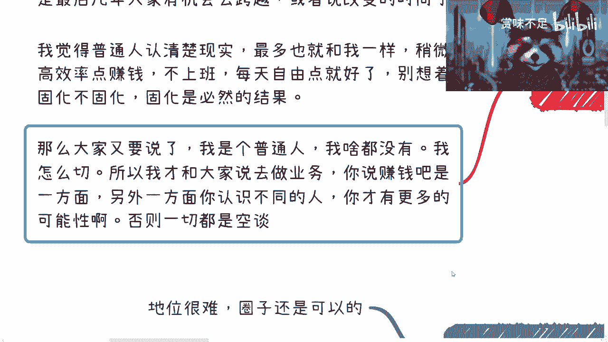

所以我是觉得啊，就是说这个本质问题呢不在于固化而过不固化，这是大环境，是你别去管他，你管跟跟我们有什么关系呢，没有关系，对吧啊，我觉得更多的是说你每个人的个体，当下我们有什么，你要没有。

那你就去想办法创造，你没有想办法去争取，没了对吧，然后然后也别老师把失业就局限在公司里面，局限公司里面没有意义的，对不对，你老师跟我说啊，公司里面这样这样这样，公司里面那样那样那样那样。

那那你这样这样那样那样那样，那那那在我看来已匿也就是个几10万的level，那我去搞搞这些，有的没的干嘛呢是吧，好吧嗯，我觉得就这么着啊啊。

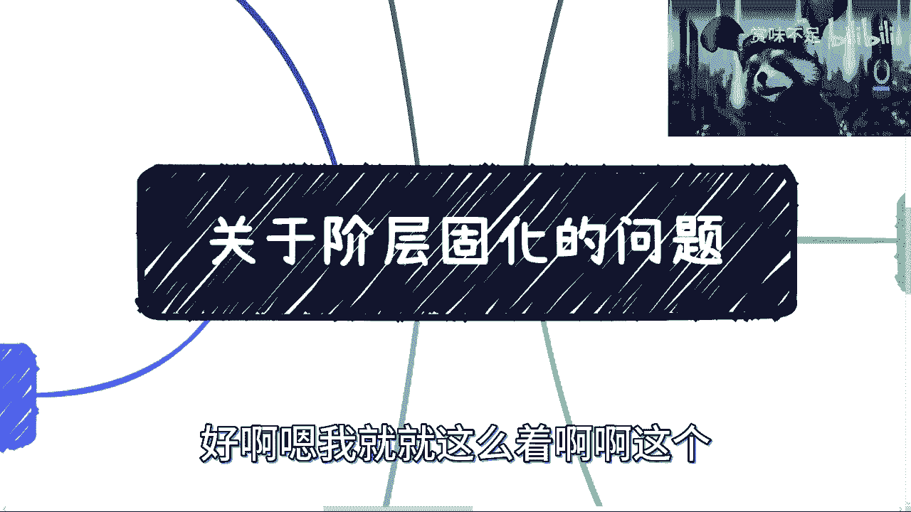

这个能懂的就懂。