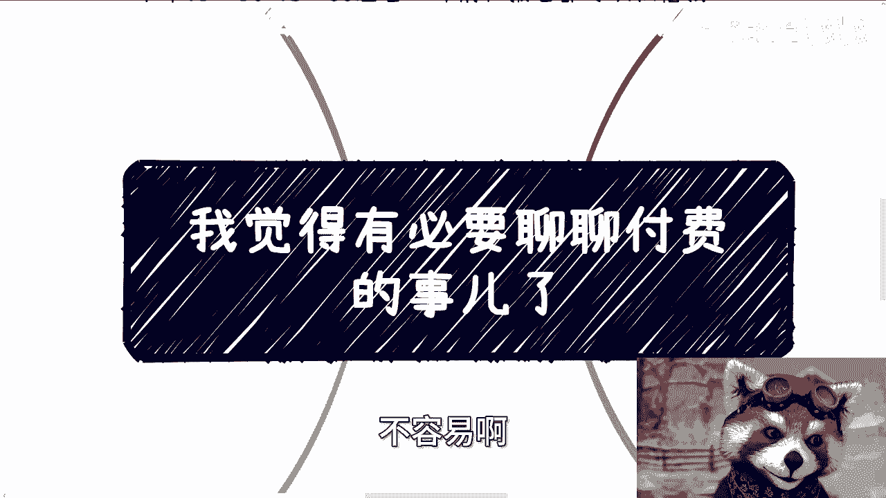
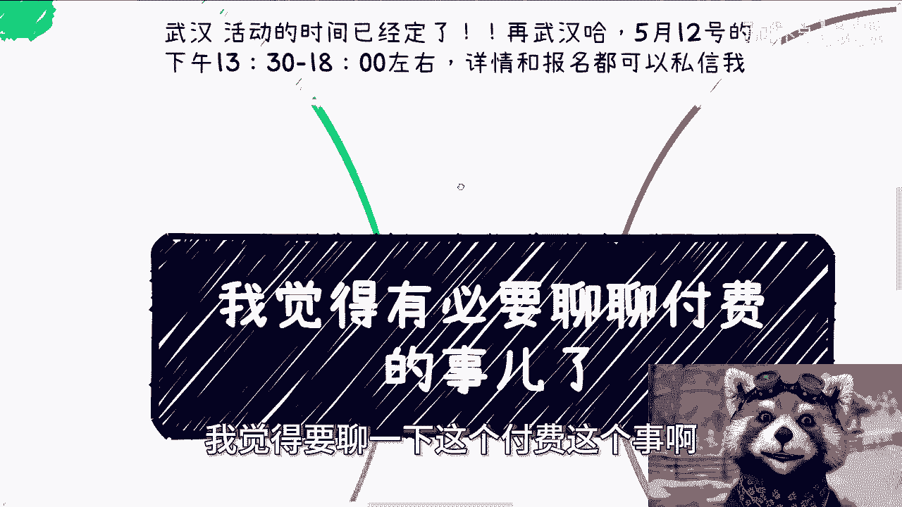
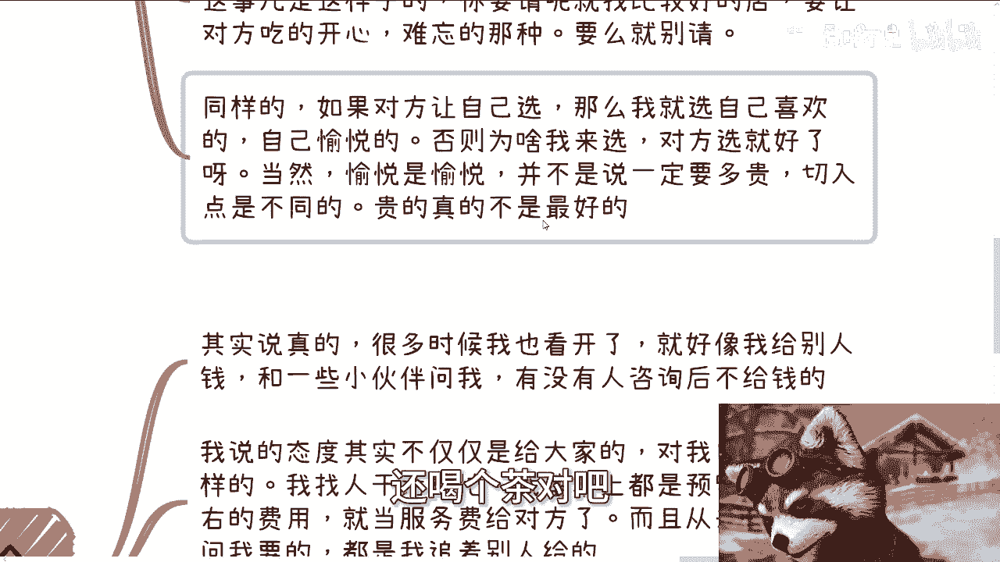
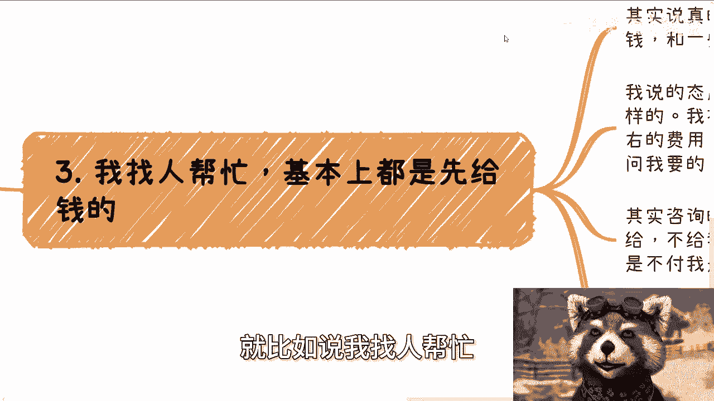
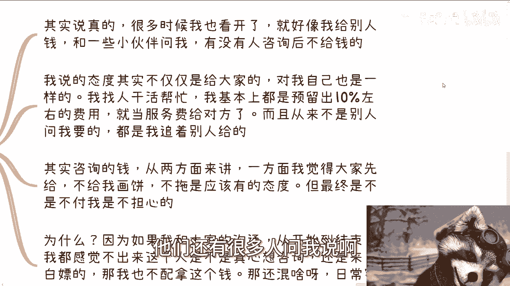
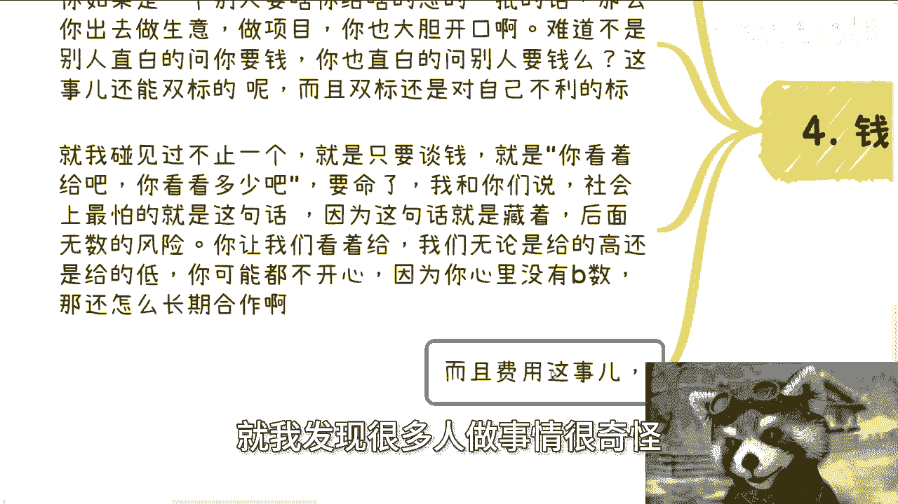
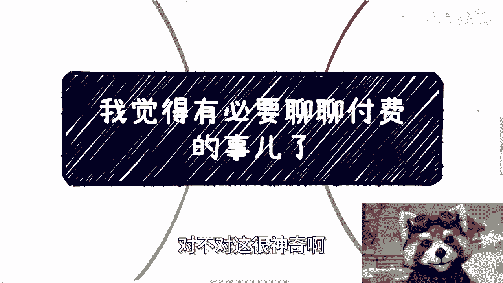
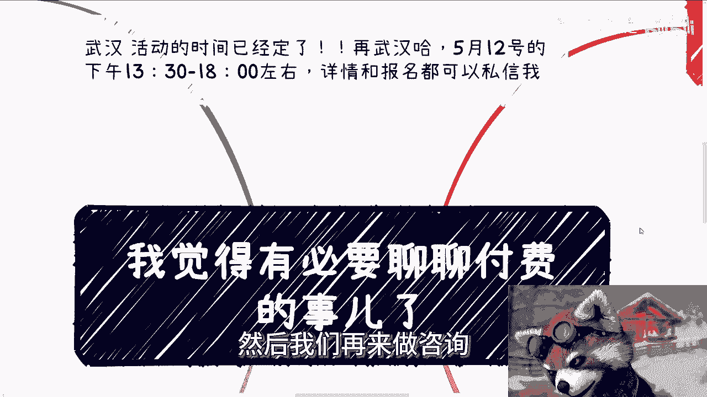

# 我觉得有必要聊聊付费的观念 - P1 - 赏味不足 - BV1MT421Q7qr

啊大家好啊，今天竟然有时间啊，能够白天来给大家录这个视频啊，不容易啊。

首先是这样子的啊，呃呵呵呵放心，不是让你们付费啊，我只是谈一下这个事的态度啊。

啊然后武汉活动呢已经定了啊，在武汉5月12号啊，5月12号下午的01：30到六点左右好吧，然后呃了解详情和报名的都可以私信我啊。

然后呢呃我觉得要聊一下这个付费这个事儿啊。

有必要，而且呢很好玩啊，我来跟你们分享一下啊，就首先呢找我咨询跟活动的大部分人呢，其实蛮正常啊，你想啊，如果来说1000个人当中都很正常的，这个若干个有不正常的，他就会非常突出啊。

然后哼哎就非常的神奇啊，然后付费这个事呢是这样子的，你比如说啊很多人加我微信啊，不付钱，当然他也不是不付啊，他就是说各种问啊，然后开始跟我绕，甚至还有给我画饼的啊，那我就我就笑了啊。

就你看啊我的逻辑是什么，我的逻辑就是你有问题，你可以B站私信我对吧，那一般我觉得不管怎么样，再差再差半天我肯定回来啊，你你说你不问啊，你加我加了呢也不付钱，然后你加我吧，然后微信上问问我就开始问。

然后我还要呃问你就说到底付不付，你说我要考虑一下，那你咋会私信不说考虑一下呢，我也不明白的，对不对啊啊我我话每次说的很清楚的，就是你确定了咨询跟活动，你再来加我，对不对。

这我就不知道有很多人确是怎么个逻辑啊对吧，然后呢就是说这种做事情态度呢，我跟你讲啊，你但凡你要是说你心里没有点小九九呢，也就算了啊，你要是做这种事情，你心里还有点小纠结，我跟你讲。

你在社会上就别赚别赚钱了啊，你也别去探索什么商业了，我就这么跟你们讲啊，你你心里有点小九九，包括给我画饼啊，我告诉你，你不管给谁画饼，未来别人都会给你们画的哦，就像你们跟我绕，别人也会跟你们绕。

你最初吃亏的是你们自己啊，你明白吗，所以说其实你要知道啊。

你做事情的态度决定了一切，任何事情果断一点啊，不要绕绕着对自己有啥好处呢，对不对，你说你说我这边这个逻辑这么简单啊，你要么就咨询，要么就活动，你要么就参加吗，不参加，对不对，哪来这么多哔哔，你哔哔。

你可以私信BB啊，对不对啊，然后这是第一，第二呢，我跟你们分享以前请客吃饭的事啊。

呃至今两个人的态度呢就是我印象蛮深的，因为其实这两个人的态度呢其实是一样的，但是呢他发生了这个环境不太一样啊，一个呢就是我请客啊，让对方选，而对方选了一个呢，可能当时明显高于我消费水平的一个点啊。

那其实人嘛都有成长的嘛对吧，那我心里面其实当时也觉得可能不太舒服啊，或者怎么样，不过后来我觉得还是我格局小了啊，那另外一个呢其实是对方请我吃的啊，然后呢也请的可能比较高大上，不过我当时想法呢。

就感觉其实没有什么太大的业务合作，就就就大家可以做朋友，但是呢你说业务上有没有太多交集吧，可能比较少，那这个饭吃的呢我也不是特别踏踏实啊，不过后来从两位的这个态度当中呢，我觉得真的也特别对。

所以我今天来分享给你们一下，就其实请客这个事是这样子的，你要请呢就找比较好的店，让对方吃得开心一点啊，难忘的那种，你要么就别请对吧，就其实我觉得这个逻辑啊，你放到，当然你们可能很多人觉得啊。

那我随意对吧，大家请客也不用这么讲究对吧，是你们要是朋友之间你随便对吧，但是如果你在社会上，大家就说是是怎么说呢，就是说嗯你你你相对来讲格局比较高一点的，或者说大家就是嗯可能做事情。

有一定也不叫没有原则吧，就做事情有一定的这种呃，这种这种这种想法对吧，那我觉得就是说你得有自己的态度，那同样的呢就是说比如说如果对方让自己选，那么我肯定就选自己喜欢的，自己要愉悦的对吧。

否则为啥我来选呢，对不对，你比如说对方就好了嘛，你让我选干嘛呢，哦你让我选，我还为你考虑对吧，那你就别让我选，那当然我觉得愉悦是愉悦，不是说一定要选多贵的切入点是不一样的啊。

贵跟你自己喜欢他不是完全划等号的对吧，所以说就是我觉得这个态度是对的啊，包括就是说你们要是社会上去请别人吃饭，或者怎么样的，其实我觉得这种态度哦是一个应该有的态度，你要么就别请你喝个茶对吧。

或者喝个咖啡也行啊，对不对啊，呃然后三呢就比如说我找人帮忙。

我找人做事情的，基本上都是先给钱，就其实说真的啊，我跟很多时候我也看开了，就好像我给别人钱和一些小伙伴问我啊，就你知道吗，他们还有很多人问我说啊。

有没有人这个到现在为止咨询后不给钱的，我跟你讲啊，我呢所有表达的态度我不仅仅是给你们的对吧，我对自己也是一样的，就是我找人干活帮忙，我基本上都是预留出10%左右的费用啊，就是就当服务费给对方的。

就是如果他这次帮我忙是1000块钱，我基本上就会给他1100啊，然后呢就说而且是从来不会别人要问我要的，都是我追着别人给的啊，我会问清楚，就说你比如差旅多少钱啊对吧，你可能这次费用多少钱啊对吧。

比如说你们以前在北京活动对吧，我有些老师对吧，叫过去的那差旅肯定是我付啊对吧，然后出场费也是我付啊对吧，我基本上都是会预留10%给他的，而且我都是追着他来说的，不用对方来问我，你让对方来问你就很。

你知道吗，那包括其实咨询的钱我给你做的，这么说啊，从两方面来讲，一方面呢我觉得大家是应该先给你，不给就是给我画饼，你比如说我时间预留好了，你不给你，到时候跟我说，陈老师我要放鸽子了，那我还做什么商业。

对不对啊，我觉得不脱是应该有的态度，但是最终呢不富呢，我说实话我是不担心的，为什么，因为如果我跟大家沟通，从一开始对吧，从我们开始预约时间到咨询结束，我都感觉不出来这个人是不是真心想来咨询的。

还是想来白嫖的，那我就不配拿这个钱对吧，哦你说你说他妈的啊，我在这个郑起啊，在其他地方混这么长时间啊，你察言观色作为基础能力啊，这我都看不出来，那我觉得骂我活该，对不对啊，就这就这么个逻辑嘛对吧。

然后呢，第四个呢就是钱这个事呢，你一定要明白，你要直面，就是我碰到过很多人啊，很奇怪的，就是别人问他要钱啊，他怂的一逼，就就明明我们打个比方，明明可能他只要给500，别人他妈的就柿子挑软的捏。

他就跟他说，你必须给1000，给给2000，然后你就会发现他还怂的一逼啊，就是没有逻辑的，别人说2000就2000，2000算了算了对吧，吃点亏的嘛，就有种那种哎呀还要PUA自己说，吃亏是福，你知道吗。

我的，我也不知道，我就不知道他脑子怎么想的对吧，然后呢，但是你反过来想看他被压榨的同时，你让他出去谈钱的时候，他反而就怂的一逼，你知道吗，他又不愿意，他又不敢跟别人谈钱，就是诶我最后没写完吗。

啊就是说你如果是一个别人要给你，就是呃比如说别人问你要钱，你怂的一逼的话，那么你出去做生意做项目，你也大胆开口啊对吧，你按我逻辑，你都已经被压榨，你压榨别人吃呗，对不对啊，难道别人直白的问你要钱。

你就不能直白的问别人要钱吗，啊卧槽，这是还能双标的，而且双标还对自己不利的标，我他妈我也没见到过对吧，那当然这种人我见到很多的，但这种逻辑我是真不理解啊，然后你就我碰到到现在真的不止一个了。

就是只要谈钱，他就会说哎你看着给吧，你看看多少吧啊你给多少都行啊，要命了，我跟你讲啊，社会上真的最怕这句话，为什么，因为你这句话说了，我怎么给对吧，我我这么说，你从一个资本家，从一个商业角度来讲。

你这么说，我不给可以不啦，白嫖啊，你都这么说了，我不白嫖嘛，对不对，但是我当时白嫖好像也说不过去对吧，那我可能给你个低一点的，但问题是你让我给看着给啊，那我无论给高还是给低，我不知道你心里怎么想的。

就有可能你还是会闹情绪对吧，因为因为什么，因为你心里没有个逼数，你对你对你要多少，也不知道，你对整个行业的均价也不知道，然后你只能跟别人说啊，那你看这个给个我操这他妈的，人家谁敢长期合作，对不对。

我后面没写完，是什么事情，是这样子的，而且费用这个事情是这样子的，你管你说对不对，就是你管你开，你还是那句话啊，你要是不知道均价，那你去了解啊，这不诶你做一个开战的人，你不去了解，你指望我给你开价吗。

对不对哦，你出去做生意啊，然后甲方问你要多少费用啊，然后你跟甲方说，你看着给吧，甲方他妈的肯定跟你说下，我我能白嫖，我不要我要你免费，你干不来，对了，就这种花特别，但是呢你要是爆出来一个非常高对吧。

非常不接地气的，同时又高于均价的，你也是，对不对，那么这个时候也要说了，哎常说我不知道均价，那他妈的你去了解，这难道不是应该你做的事情吗，哦你都不去了解，你想接单子啊啊哎奇了怪了，对不对。

就我发现很多人做事情很奇怪。

就是明明他应该去了解，他不了解唉，然后就像就像哎我是昨天晚上说的，还是哪里说的，就像我昨天说的，就是你明明没有这个命哦，也不叫这个名吧，你明明没这个能力去揽这个活，你还指望这个活给自己哇。

这个活能给自己带来个50万，带了个100万，带来个四两拨千斤的，你不太搞笑吗，对不对，什么叫你小钱靠赚大钱，靠大风吹啊，意思就是说你不管是小钱去赚业还是大风，靠大钱，靠大风吹。

你得先有能力去借这个东西啊对吧，我不管你是有执行能力，还是说对这个东西有认知对吧，哦你说我在这个当中啊，前面也不知道怎么报的啊，价格也不知道怎么要的啊，谈嘛也不知道怎么谈的啊。

那你说哎我就想赚这个钱要死了，那那他妈中国这个土地上人死光了，他妈给你赚了，对不对，这个很神奇。

对啊，所以就是说我跟你们讲，就是钱这个东西呢，你不要不要遮遮掩掩，是啥就是啥就结束了，对不对，你包括对，说到这个事情，我还有个很让我气笑的，就是很多人会上来跟我说，前提你知道吗，说哎呀我家里情况不好。

哎呀，说我我我我可能现在还在读书，说我怎么样子，然后呢，我跟你们说，我做事情的态度很简单，我又不是要你们7000，我又不是要你们7万，对不对哦，你就这点钱，你要是觉得你拮据了，那你就别找我不就好了吗。

对不对，你要觉得拮据的，你就不要找我，你找我，然后上来还要跟我打感情牌，我跟你讲啊，这就是在社会上去积累关系，去认识人之大忌，大忌中的大忌，你知道吗啊你不要到最后很多人还觉得哎呀。

陈老师陈老师这态度太强硬对吧，怎么样，大哥我不强硬，我能活到现在啊啊我不强硬，我他妈就成为尸体了啊，哥哥们哎呦，我他妈也是服了，真的是啊好吧，就这个事啊，我跟你们讲清楚了啊，就这么回事啊，你们举一反三。

真的出去聊也都是一样的。

明白吗啊行啊，就这么着啊，然后那个武汉武汉活动好吧，报名的继续报名，然后剩下的话直接规划商业规划啊，融资啊，股份啊，股权啊，合同啊，商业计划书啊啊，包括你们自己手上有什么牌啊，你们希望通过我的这个视野。

通过我的一些想法，能够给你们更好的去做规划的啊，那么你们可以整理好你们的问题，整理好你们的背景啊。

