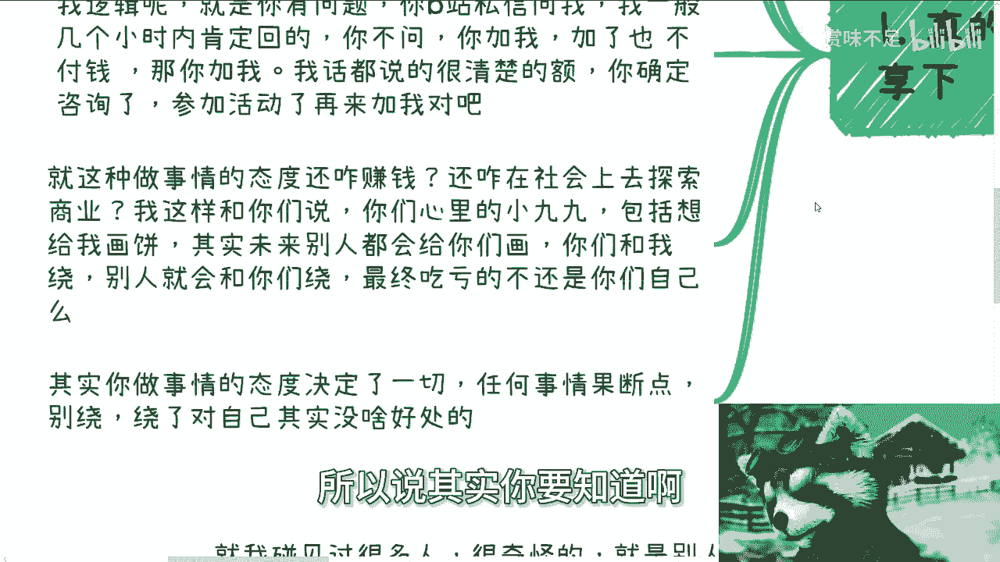

# 我觉得有必要聊聊付费的观念---P1---赏味不足---BV1MT421Q7qr


在本节课中，我们将探讨一个在商业和个人发展中至关重要的观念——如何正确看待和处理付费问题。我们将通过几个核心场景，分析常见的思维误区，并建立清晰、果断的处事原则。


---

## 1. 明确需求，果断行动 🎯

上一节我们介绍了课程主题，本节中我们来看看第一个核心原则：明确需求，避免无效沟通。

许多人存在一种矛盾行为：他们添加联系方式并非为了立即付费咨询或参与活动，而是进行漫长的前期询问甚至“画饼”。这种行为逻辑存在问题。




**核心逻辑公式**：
```
有效沟通 = 明确需求 + 直接行动
无效沟通 = 模糊需求 + 反复试探
```


以下是处理此类事务应有的态度：
*   若你已确定需要咨询或参加活动，再添加联系方式。
*   若尚未确定，应先在公开渠道（如私信）了解信息。
*   做事态度应果断。犹豫不决、绕弯子只会浪费双方时间，且这种处事方式在社会协作中对自己不利。

果断的态度是高效协作的基础。接下来，我们通过“请客吃饭”的例子，看看如何将这种态度应用到人情往来中。

---

## 2. 人情往来的态度：极致或简约 🍽️

上一节我们讨论了做事要果断，本节中我们来看看这种态度在人情往来中的体现。


请客吃饭是常见的社会交往行为，其中也反映了个人做事的格局和态度。通过两个对比案例，我们可以总结出一个原则。


**核心态度代码**：
```python
def 处理请客(是否请客, 对方选择权):
    if 是否请客 == True:
        # 要请，就让对方获得最佳体验
        return "选择让对方愉悦/难忘的场所"
    else:
        # 不请，就选择更轻量的社交方式
        return "选择喝茶或咖啡等简约方式"

    if 对方选择权 == True:
        # 若对方让你选，就选自己真正喜欢的
        return "选择自己愉悦的选项（未必是最贵的）"
```

以下是基于此逻辑的要点：
*   **请客方**：若决定请客，应选择能让对方留下良好印象的场所，要么就不请，转而选择喝茶、咖啡等更轻量的方式。
*   **被请方**：若对方让你选择地点，应选择自己真正喜欢的，不必过度为对方考虑成本。因为“喜欢”和“昂贵”并非完全等同。

这种清晰、有态度的做法，同样适用于更直接的金钱往来。下面，我们探讨找人帮忙或合作时，应如何对待“付费”这件事。

---

## 3. 为价值付费：主动与坦荡 💸

上一节我们看了人情往来中的态度，本节中我们来看看在直接的金钱合作中应有的原则。

在商业合作或请求帮助时，对待金钱的态度直接决定了你的信誉和长期发展。主动、坦荡是关键。

**核心行为准则**：
1.  **找人帮忙时，主动预付并额外奖励**：例如，若预估费用为1000元，主动支付1100元，将多出的部分视为对对方服务的尊重与感谢。费用应主动结算，而非等对方催要。
2.  **提供价值时，不担心“白嫖”**：作为服务提供方，应具备基本的识人能力。若从沟通开始到结束，都无法判断对方是诚意合作还是意图“白嫖”，那也不配收取这份费用。**公式：专业价值 = 明确报价 + 交付质量 + 风险预判**。
3.  **直面金钱谈判，拒绝模糊与双标**：社会上最忌讳的话是“你看着给吧”。这会让对方陷入两难，无法建立稳定的合作预期。你必须了解自己服务的市场均价，并给出明确报价。

许多人存在一种矛盾的双标：被人索取费用时怯懦妥协，但自己却不敢向别人开口报价。这种对自己不利的双标必须摒弃。

不敢谈钱的心态往往源于对自身价值认知不清。接下来，我们将总结如何建立健康、直率的金钱观。

---


## 4. 总结：建立健康金钱观的核心 🧭

本节课中我们一起学习了关于付费观念的多个场景。


**核心总结**：
*   **态度决定一切**：做事果断明确，避免模糊和绕弯子，这是所有高效协作的前提。
*   **格局体现在选择中**：无论是请客还是被请，都应做出有态度、让对方或自己真正愉悦的选择，而非纠结于表面成本。
*   **金钱往来需坦荡**：付费方应主动、大方；收费方应自信、明确。直面金钱谈判，了解自身价值与市场行情，拒绝“看着给”这种模糊表述。
*   **拒绝情感绑架**：在商业合作中，避免用个人困境（如经济拮据、学生身份）作为议价或拖延的筹码。如果觉得吃力，更明智的选择是暂不进行此次消费，而非消费后却试图打感情牌。

记住，在社会上建立关系和从事商业活动，清晰、直接、有原则的态度是保护自己、赢得尊重的基础。将这节课的观念举一反三，应用到各种人际和商业场景中去。

---


**附：武汉活动信息**
*   **时间**：5月12日下午 13:30 至 18:00 左右。
*   **参与方式**：了解详情或报名请通过私信联系。


**咨询服务范围**：商业规划、融资、股权架构、合同审阅、商业计划书优化及个人资源整合分析等。如有需求，请整理好你的具体问题和背景资料。