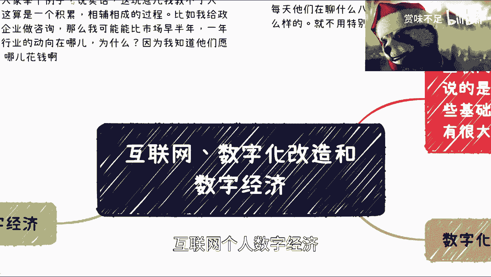
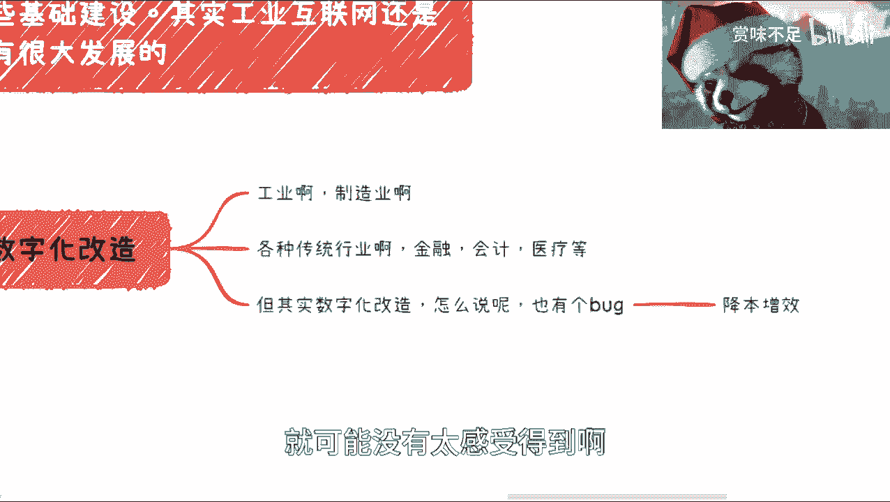
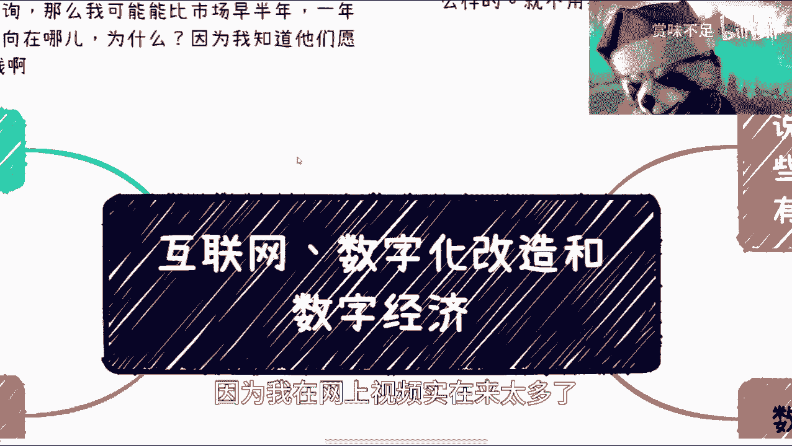
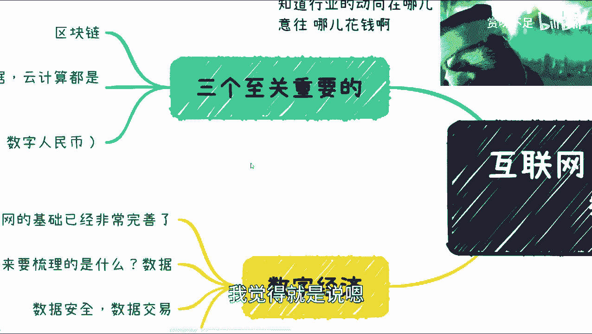
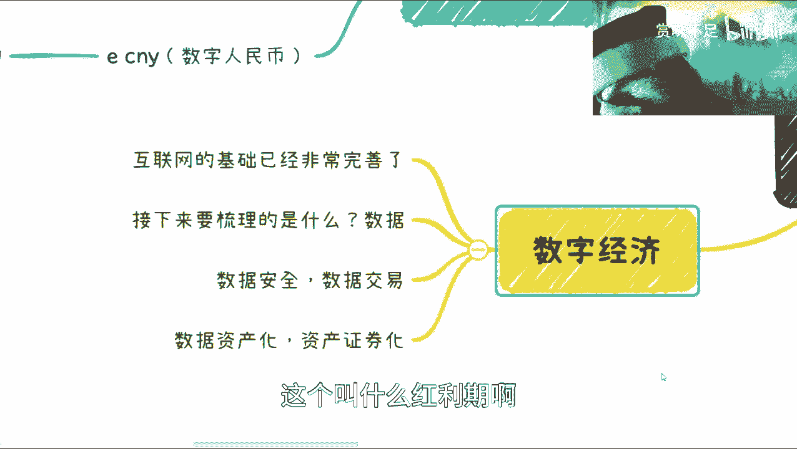
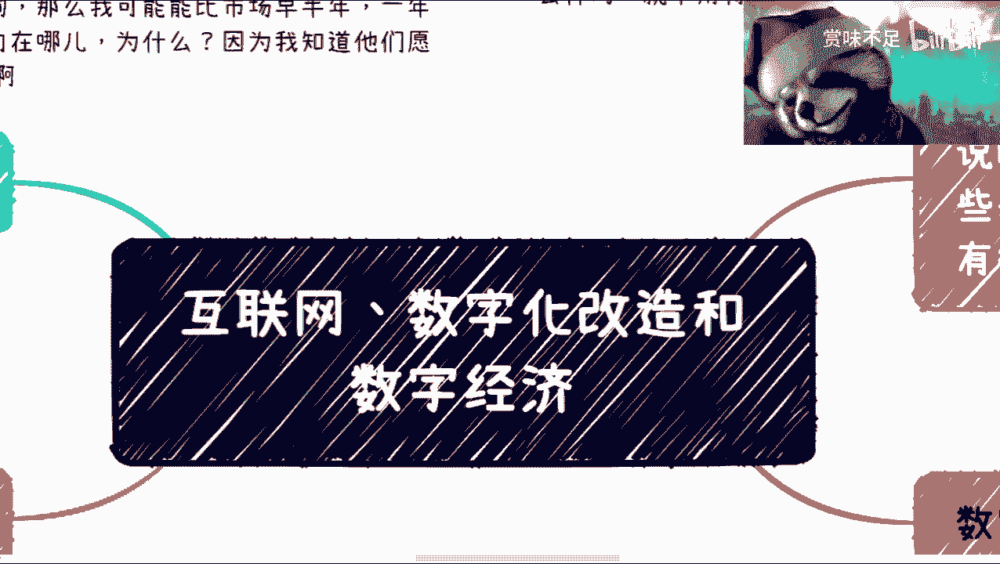

# 我讲下我理解的互联网、数字化和接下来的数字经济 - P1 - 赏味不足 - BV1cY411z7GQ

好啊，首先很感谢大家，这个最近的就跟很热烈的讨论啊，然后嗯我就很随性啊，原来有很多人吐槽我说能不能思考组织语言，我也不想组织，懒得很啊，嗯然后那个有蛮多的小伙伴呢在问web3，还有区块链相关的。

这个我会单独再说一期好吧，因为说实话这块东西水很深啊，水很深，而且国内外国情很不一样好吧，这块我也会跟大家讲的，因为毕竟就国内很多政府啊对吧，这公务员啊，这个区块链相关的还是我给他们讲的啊。

然后这是一块第二块呢，这个啊也有很多人问我，他说呃怎么看大局，我在这个地方也写了一下，我说这玩意儿呢我教不了大家，我也不知道该怎么教，为什么呢，因为你比如说啊，你说我给政府企业做咨询对吧。

因为我现在做区块链web3对吧，这个叫元宇宙对吧，包括有一些这个数字经济，那我我比如说做咨询，那么我就会比市场早半年甚至一年，知道行业的动向在哪，为什么，因为不是所有的东西的动作肯定是所谓的需求。

先行的需求，需求在哪里，钱往哪花，哪就是方向对吧，那那我怎么跟大家讲呢是吧，那我觉得这是一个另外一个呢，你比如说我现在这个微信啊有7000多人对吧，然后600多群他们每天聊什么八卦，我大概也都知道。

就是现在市场什么样的，就就我不会特地去说，就是我比如说弄什么网站什么的，而且我知道啊，就是大家可能问我这个问题，是说哎，比如说我可能日常怎么去看这个资料对吧，或者怎么样，我我我也不知道从哪看，你知道吧。

然后呢就是呃我顺便再提一点，我也那个写了一个置顶的评论啊，就关于互联网这个事情呢，我希望就是说大家还是先关注自己主页，就是不要说一开始就想着备选方案，就是说啊我们这个接下来往哪做的吧，怎么样子。

就是就是你现在做什么，你还是先想办法把自己这个业务做精对吧，你不能说哦，我主页不足了，我就立马做副业是吧，那不现实的啊，就是我觉得普通人呢是什么呢，就是想办法把主页做好对吧，苟住一份工作吧。

然后再去想这个备选方案对吧，就是就是我说的这个赚钱的，plan b CD e f g对吧，你你就别主次颠倒好吧，呃然后就是我这个地方想讲一下这个数字化呃，互联网个人数字经济。

然后感谢我们小伙伴的这个纠正啊，就是我目前到到今天为止，我所说的所有互联网其实指的还是消费互联网，就或者说互联网的这种应用啊，包括这些基础建设呃，其中工业互联网并不在我的这个讨论的，范畴当中。

因为同样的工业互联网呢，它是一个独立的啊，在这个地方呢，我觉得我可以给大家一个建议啊，就是我建议大家可以有空的时候去读读读读，国家的一些规划啊，数字经济也好，数字产业化，产业数字化对吧等等等啊。

我觉得都都都需要读啊，然后包括就是未来教育呢，我觉得我也可以回头单独开一期跟大家讲，因为未来的整个教育方向，跟我们所经历的教育肯定还是很不一样的啊，我这个地方可以先提一个，你们可以先去了解哎呀。

提前去了解叫叫什么呢，叫职教本科呃，这个这个职教职教本科对吧，你们可以先去了解好吧，这个也对你们的未来的这个孩子有所帮助啊，呃然后这是第一个，第二个呢就是说我说数字化改造。

数字化改造呢差不多从2018还是198，反正就是那几年很火，但是到现在也很火呃，这个工业制造业对吧，各种传统行业，金融会计医疗啊，然后都会做数字化改造，你们会发现不管是软件层面的还是培训层面的。

一个这个企业啊，啊连续几年都会做数字化改造的培训啊，嗯嗯我们通俗点来讲呢，数字化改造其实本质上来讲，它呃就里面细分很多，因为有些是这个系统层面的对吧，就真正就是说原本比如说没有系统的对吧。

或者系统很烂啊，我们把它改造成这种数字，那个那个互联网化的有专门的管理，比如说后台呀对吧，前端管理啊，前端这种，比如说账号管理啊等等等对吧，这种都叫数字化改造，那还有一种是什么呢。

就是说他原本也是互联网行业啊，原本也是互联网行业，但是呢他呃这个互联网里面的，比如说工作呃，就公司内部的这种工作效率啊，包括它的生态合作效率啊对吧，上下游的合作效率啊，他可能都不高，那么这种时候呢。

我们需不需要看看是不是有种，比如说这种这个这个软件平台啊，哎其实就好像什么呢，你比如说以前没有飞猪啊，不是肥猪，以前没有飞书对吧，钉钉对吧，或者其他的，其实这种都叫做数字化改造。

只不过他改造的呢是比如说啊有的是行业对吧，有的是企业，有的是啊这政务对吧，都都很多啊，但是呢在这个地方我们提一点啊，就数字化改造这件事情呢，你通俗的理解其实就是互联网加嘛对吧，但是呢他数据改造了。

其实这里面有个bug，这个bug是什么呢，就是呃有很多的这种企业老板和高管呢，他在数字改造，比如说做完之后对吧，他会去问一个问题，因为数字化改造本质上是什么，它为了降本增效对吧。

我们在这地方想降降本增效对吧，这是它的本质，但是呢为什么我们说很多老板会问呢，是因为他会发现做完之后呢，呃增效可能是有的，但你降不降本这件事情呢其实不好说啊，不好说，所以说呢这个里面呢。

我觉得就主要他肯定有个bug，这个bug在哪里呢，就是说数字化改改造啊，从我的这个视角来讲啊，我更感觉他像一个前期铺垫工程，也就是说呃，也就是说整个数字化改造应该是一个闭环，就是它是个圈，你知道吧。

但是现在的数字化改造呢更像只做了一半啊，还有一半还没有做啊，所以说呢，其实它的整个这个降本增效，就可能没有太感受得到啊。

然后这是一块，那么接下来呢就是说我们前两天呃，哎呀我那个新闻没贴出来，就前两天那个新闻大家应该也看，也看到，就是国家在呃整个上层做了一些改改变对吧，就组织架构的改变呃，建立了那个数据局对吧。

嗯然后数字经济呢，我觉得那当然啊，接下来这块我觉得就是说仁者见仁，智者见智，我完全不能就我完全没有信心告诉大家，我说的一定是真的啊，但是我只告诉大家是我看到的是什么东西，好吧。

呃没没有什么正确不正确的事情啊，首先是这样子的，我把它放大一点啊，数字经济呢当下这个情况是什么呢，就是互联网的基础建设其实已经很完善了啊，很完善了啊，当然你不能你不能说啊。

中国这个什么什么什么什么农村啊，什么地方都算进来，不是啊，我们说它铺的面大面积来讲已经很完善了，这是第一点啊，第二点呢就是说接下来梳理的是什么呢，其实是数据，数据是重中之重，你们去看不。

至少我现在得到的信息，不管是信通院啊，等各地方，他接下来要做的是什么呢，就是数据的整理，数据的安全，数据的叫做治理，数据的交易啊，这几块这个事情你说要花多久，我觉得可能要花蛮久。

但我具体我也不是很清楚啊，会花蛮久的，那么这是一块啊，那么另外一块呢，就是再往后，就是比如说我们数据已经整理的差不多了对吧，包括数据的流通啊，那么也差不多了，那么接下来1111111。

就接下来一波以及再接下来一步，其实就是数据资产化以及资产证券化啊，当然你说这个事情要花多久，我觉得咱也说不准啊，这个事情说不好的，因为你从整个趋势来讲，一切看政策对吧，要快也可以快，要慢也可以慢啊。

但是呢在这里面呢。

我觉得在数字经济里面啊，就是呃这个地方一定要提两个东西，就是有两个呃至关重要的。

怎么说呢，三个吧啊三个指纹重要的，第一个呢就是说呃，我觉得大家啊就是在跟我讨论这个东西的时候，其实对行业没有太明确的区分啊，就是我对行业的区分度是这么区分的，就是我是看这个东西能不能去要到政策。

能不能得到政策扶持，能不能得到对应的，比如说啊政策的这种这种基金啊，或者福利，那么它就属于哪哪个哪个哪个哪个这种领域啊，你比如说有很多人跟我说新能源是吧，新能源是属于新能源的。

但是新能源跟互联网有关系对吧，你比如说还有说那个那个叫什么呃，AI对吧，AI是属于人工智能的，但当跟互联网有关系，但是人工智能是往人工智能这个方向去，要政策的对吧，还有零知识证明和边缘计算。

那么很可能是比如说往那个数据方向对吧，数据治理，数据安全就是数据数据数据化对吧，数据互联网化这个方向口需要的哦，就是你他要的时候，他不可能说啊，我去要政策，我就说啊这个东西归在互联网没有的。

就没有说归在互联网这口的，你知道吧，所以说就是我去区分是这么区分的，那么这个地方呢有三个这个这个重要的，至关重要的东西啊，第一个呢就是说就数字化经济啊，和我们说的互联网对吧，就IOTAI对吧。

包括那个嗯啊大数据对吧，云计算啊都是脱不了关系的啊，这点就说我得跟大家说清楚，就是说下一代数字经济，其实就跟就互联网翻篇了，咱不说互联网了对吧，就数字经济跟这些也是有关系的。

但不是说啊你说这个东西走下坡路了，怎么样了对吧，包括AI比较湿对吧，投资都扔水里了，这不重要啊，重要的是这些东西跟他们都有关系，它都是重要的拼图之一，那么在数字经济里面还有两个至关重要的东西。

一个是什么呢，区块链啊，一个是什哎呀，一个是什么呢，那个ECNY对吧，就数字人民币啊，毫无疑问啊，你们但凡了解一下呢，你们可以去看一下，因为我是这周二吧去给苏州政府，苏州区政府吧。

两个区两个区我给他们做的培训啊，然后呢就是为什么说这两个东西很重要啊，是这样子的，首先呢从目前国家的这个落地情况来看啊，互联网上的我们称之为数据啊，区块链上的我们称之为资产，而我们称之为资产。

或者说互联网上的我们称之为数据，区块链上我们称之为可信的数据啊，那么这是第一点跟他是脱不了干系的啊，都是第一点，第二点呢，数字人民币，数字人民币为什么一定会挂钩呢，是因为第一数字人民币是一个呃大方向啊。

这个东西就在未来一定是会跟跨境贸易啊，跟跨境结算啊，数据结算啊，所有的这个交易对都会跟他挂钩，毫无疑问，第二个重要的是什么呢，它支持智能合约，我觉得你们可以去看一下ECNY的这个白皮书。

那么当然这个里面呢，我觉得可能大众啊对于智能合约也不是很了解。

对区块也不是很了解，这款呢，我觉得这这个就不在我的科普范围之内了。

好吧就我不想再单独再出一个免费视频，说区块链是什么，因为我在网上视频实在太多了。

你们可以自己去看啊，但是并不重要啊。

重要的呢，我觉得就是说嗯，就是说大家如果想要看未来的方向啊，我觉得这个就是未来方向，而这个里面他要做的东西很多很多很细很细，每一个领域其实都有很大的。

这个叫什么红利期啊，或者说机会嗯，但是具体呢我觉得就是说大家还是得要看这个，你们个人的一些一些积累，包括是什么呢，就是你们所在城市所在地区所在行业，因为这个东西它没有通用性对吧，就像我现在告诉你们。

上海现在是很看重数据的，我可以明确跟你们讲啊，但是别的城市不一定对吧，而且我也可以告诉你们，苏州是很看重数字人民币的，为什么，因为苏州是第一批的数字人民币的试点。

但别的城市不一定对吧，但是呢这并不重要啊，并不妨碍数字经济是大方大方向啊，因为这个是中央的方向好吧。

然后呢我最后还提一点啊，就是说那个呃下周我因为要去重，重庆那边有个新能源的企业呃，会做一下咨询，我可能会比较忙啊，我可能会会随性的更新一些好吧，然后这是第一个，第二个呢就是说呃啊大家就是我我也说一句啊。

就是大家别来跟我说这个都有什么什么东西，什么东西没有用对吧，什么什么东西有用对吧，怎么样怎么样，没有什么东西有没有用的用，都有用的好吧，看你怎么做啊，看你怎么说啊，看你这个这个个人怎么利用，好吧。

唉呀行，就这么着吧好吧，很感谢大家的支持啊，希望啊就是这个虽然免费的东西，但是我觉得呢我还是真的就是能讲的，我都讲了啊，这个希望对大家能有帮助，一定有意或者来起到一定的这种叫什么。

