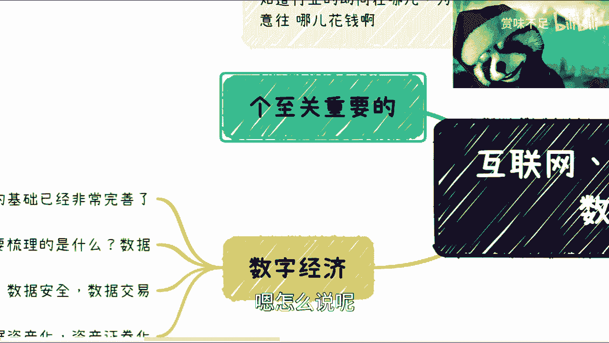
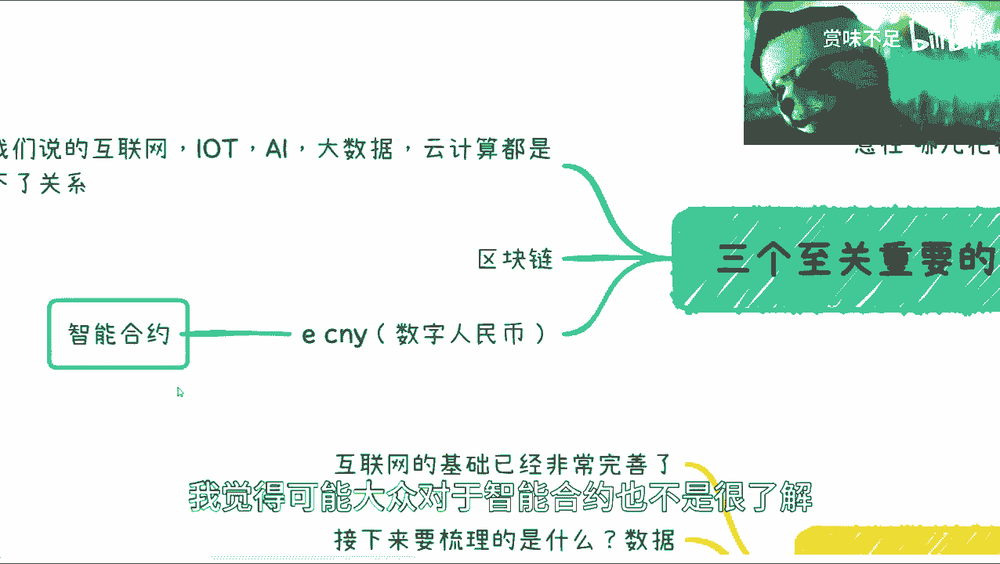
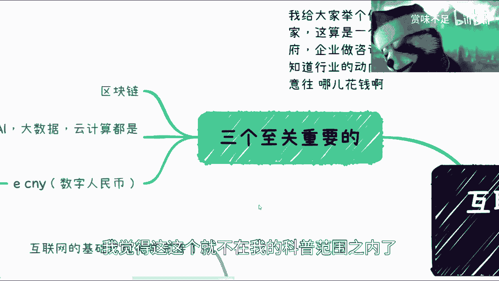
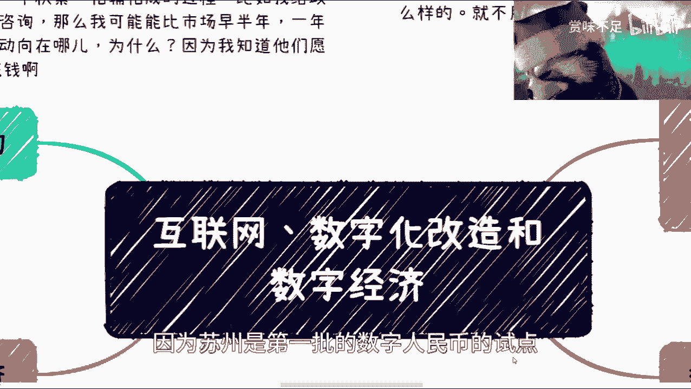
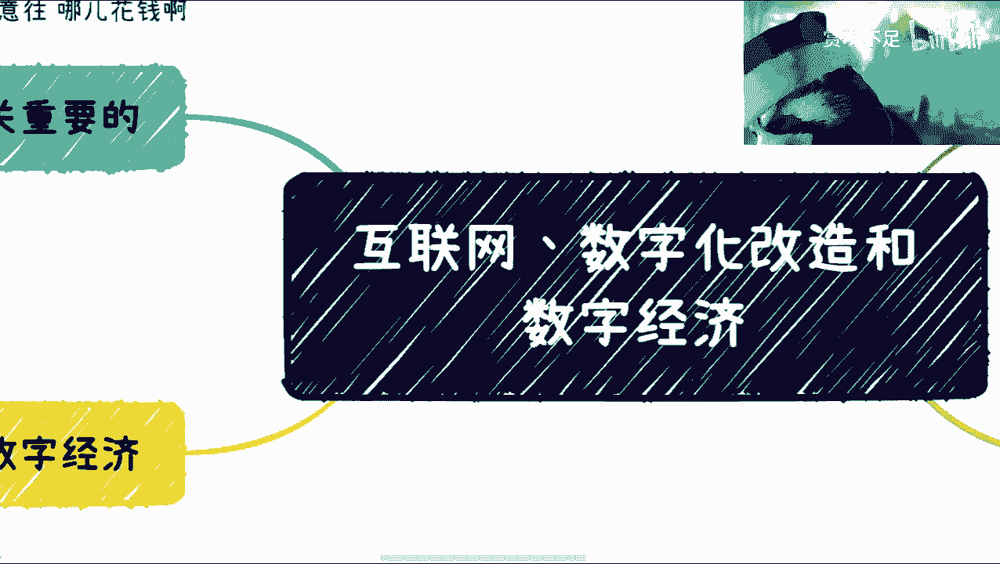

# 课程一：理解互联网、数字化与数字经济 🌐

在本节课中，我们将学习互联网、数字化改造以及数字经济的基本概念和它们之间的关系。我们将探讨这些概念的核心定义、当前的发展状况以及未来的趋势，帮助你构建一个清晰的宏观认知框架。

---

## 互联网的范畴与现状

上一节我们介绍了课程的整体目标，本节中我们来看看互联网的具体范畴。

我目前所讨论的“互联网”主要指消费互联网及其应用和基础建设。工业互联网是一个独立的领域，不在本次讨论的范畴之内。

对于希望把握宏观趋势的人，我有一个建议：可以阅读国家关于数字经济、数字产业化、产业数字化等方面的规划文件。这些文件指明了未来的发展方向。

以下是关于个人发展的两点建议：
*   首先，专注于你的主业。在考虑任何“备选方案”或转型之前，应先努力将现有业务做精、做好。
*   其次，可以提前了解“职教本科”这一未来的教育方向，这可能对个人或子女的规划有所帮助。

---

## 数字化改造的本质与挑战

上一节我们明确了互联网的讨论范围，本节中我们来深入探讨数字化改造。

数字化改造大约从2018年前后开始兴起，至今在工业、制造业、金融、医疗等传统行业依然火热。其通俗理解就是“互联网+”，旨在利用技术提升效率。

从本质上讲，数字化改造是为了实现 **降本增效**。它包含多种形式：
*   系统层面改造：为原本没有系统或系统落后的企业，搭建互联网化的管理后台、前端应用等。
*   效率层面改造：为已是互联网行业的企业，引入像飞书、钉钉这类平台，提升内部协同或生态合作效率。

然而，当前的数字化改造存在一个普遍的“Bug”：许多企业老板发现，改造后“增效”可能实现，但“降本”效果却不明显。这主要是因为目前的改造更像一个“前期铺垫工程”，只完成了闭环的一半，未能完全释放其价值。

---

## 数字经济的未来图景

上一节我们分析了数字化改造的现状，本节中我们展望下一阶段——数字经济。

当前，互联网的基础建设已大面积完善。接下来的核心任务是处理**数据**，包括数据的整理、安全、治理与交易。这项工作将持续相当长的时间。

在此之后，将逐步迈向**数据资产化**与**资产证券化**。这一进程的速度很大程度上取决于政策导向。

在数字经济的版图中，有几个至关重要的拼图。首先，数字经济与物联网(IoT)、人工智能(AI)、大数据、云计算等技术领域密不可分，它们共同构成下一代经济的基础。

其中，有两个技术尤为关键：
1.  **区块链**：其核心价值在于将互联网上的“数据”转化为“可信的数据”或“资产”。公式可以简单理解为：`互联网数据 + 区块链 = 可信资产`。
2.  **数字人民币(ECNY)**：它不仅是未来跨境贸易与结算的大方向，更因其支持**智能合约**而具备巨大的创新潜力。智能合约是一种自动执行的代码协议，例如：`if (条件满足) { then 自动支付 }`。

理解这些技术细节并非本课重点，但认识到它们的重要性是关键。未来的机会将遍布数据治理、安全、交易以及基于区块链和数字人民币的各个细分领域。这些机会具有地域和行业特性，例如上海侧重数据发展，而作为试点的苏州则更关注数字人民币应用。

---

## 总结与展望

本节课中，我们一起学习了互联网、数字化与数字经济的核心概念。

我们首先界定了讨论的互联网主要指消费互联网。接着，我们剖析了数字化改造以“降本增效”为目标，但当前常因未能形成完整闭环而效果受限。最后，我们描绘了数字经济的未来图景：其基础是完善的数据治理体系，方向是数据资产化，而**区块链**与**数字人民币**将是其中两个至关重要的技术基石。

希望本课程能帮助你建立起对这些宏观趋势的基本认知。记住，没有绝对无用或有用的技术，关键在于如何结合自身所在的城市、行业与积累，去发现和利用其中的机会。