# 我讲不来领导力-但我可以聊聊我看法---P1---赏味不足---BV1Eo4y1n7io

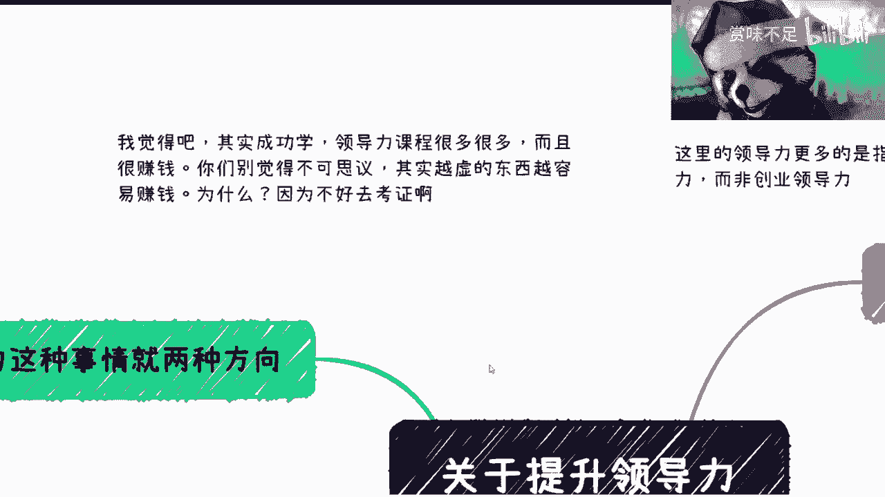

在本节课中，我们将探讨职场环境下的“领导力”概念。我们将分析其本质，并拆解两种主要的领导力实现路径：以实力与同理心为基础的“以德服人”，以及依靠信息差与认知差的“PUA”式管理。课程内容主要面向企业内的“打工人”管理者，而非创业者。

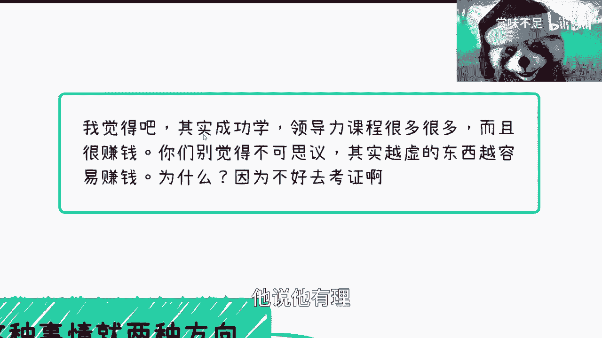

---

## 概述：什么是领导力？

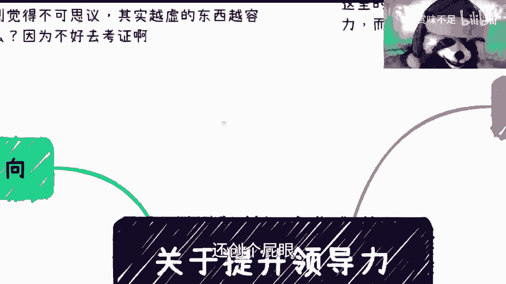

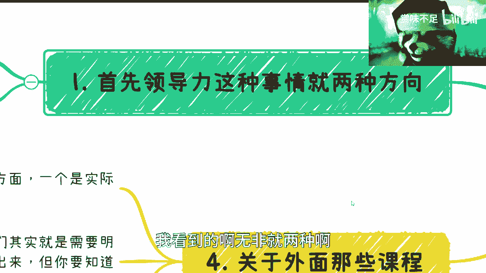

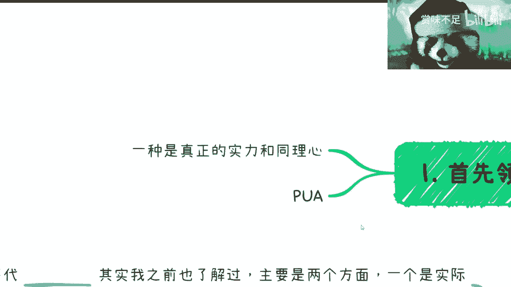

领导力是一个常被谈论但定义模糊的概念。市面上存在大量相关课程，其内容往往难以验证，这也是它们能够存在并盈利的原因。在企业环境中，我们讨论的领导力更多是指**管理（Management）**能力，其核心目标是带领团队达成业务目标。

对于打工人而言，行使领导力有时需要“忍”，这与创业者“不忍”的心态有本质区别。接下来，我们将深入探讨领导力的两种表现形式。

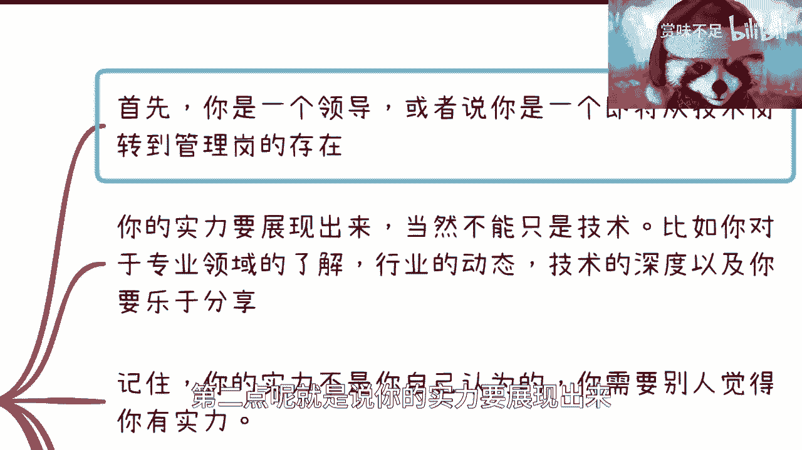

---

## 领导力的两种核心路径

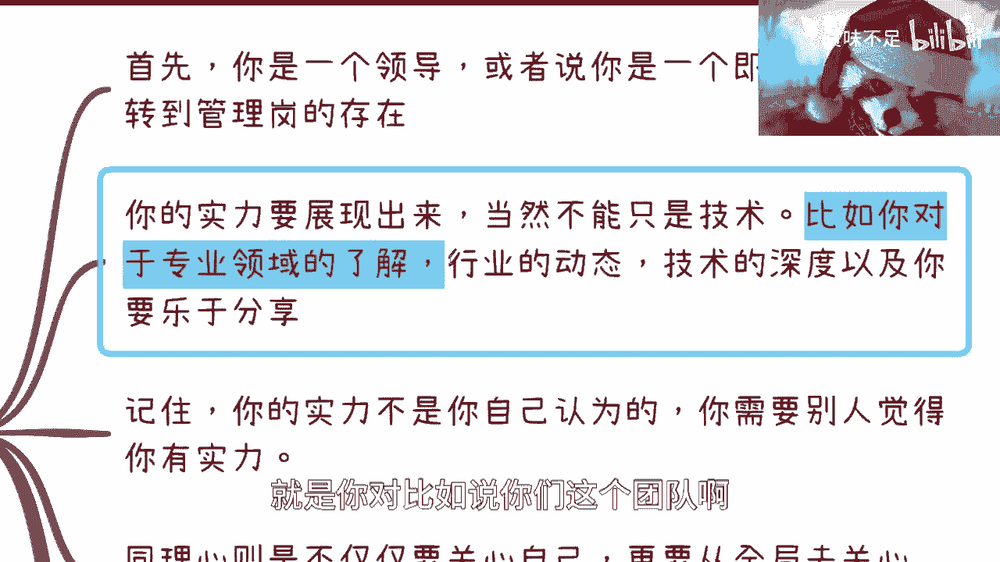

在我的职业观察中，有效的领导力呈现主要分为两种模式。

以下是这两种路径的详细拆解：

### 1. 以德服人：实力与同理心

这条路径要求管理者具备真实的专业能力和对团队成员的深刻理解。其核心在于赢得团队发自内心的认同，而非依靠职位压服。

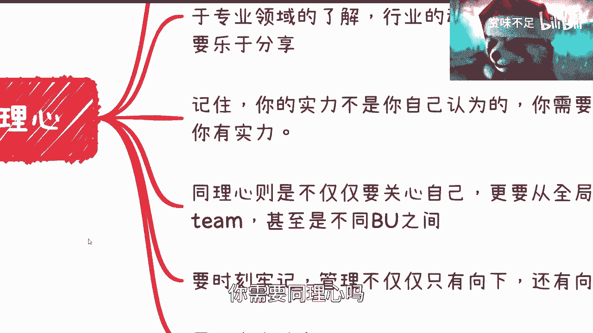

**实力展现的关键点：**
*   **能力由他人定义：** 你的实力必须被**团队成员和上级认可**，自我感觉良好没有意义。公式可以表示为：`有效实力 = 他人认可度 > 自我评估`。
*   **掌握专业领域：** 无论是技术还是业务，你必须对团队工作的专业领域有足够了解。这并非要求你事必躬亲，而是需要具备对话和理解的能力，避免出现“鸡同鸭讲”的局面。
*   **乐于并鼓励分享：** 主动分享知识、行业动态，并营造团队内部分享的氛围。这能提升你的技术威信和团队亲和力。
*   **具备团队凝聚力：** 领导力不仅是管理业务，更是管理“人”。你需要将可能松散的团队凝聚成一股力量，确保在业务方向正确的前提下，每个成员都能发挥作用。管理100人的团队与管理5人团队所需的方法截然不同。

**同理心的实践：**
*   **全局视野：** 你的技术理解深度和视野广度应优于或至少让团队成员感觉优于他们。你需要从团队、行业、公司不同事业部协作等多个层面进行思考，并能清晰阐述决策背后的逻辑。
*   **信息透明：** 在合理的范围内（不涉及核心机密），应向团队解释“为什么这么做”，减少不必要的猜疑和信息差，让大家理解全局。
*   **向上管理：** 领导力同样包括向上管理。你需要理解上级的关切点，懂得如何高效汇报。汇报时，应聚焦上级关心的核心问题，而非事无巨细地罗列。

**虚实结合的艺术：**
*   在扎实工作的基础上（“实”），必须懂得如何通过报告、沟通等方式呈现和放大团队的成绩（“虚”）。
*   例如，团队实际完成度为60分，通过有效汇报呈现为80分，可以保护团队士气并传递鼓励信号。反之，若将80分的成绩汇报成70分，则不是好领导。

上一节我们探讨了依靠真实能力的领导路径，接下来我们看看另一种截然不同的模式。

### 2. PUA式管理：信息差与画饼

当管理者缺乏上述实际能力时，可能会转向另一种模式：利用职权、信息差和认知不对等来控制团队。

**PUA的核心逻辑：**
*   **本质是操控：** 其核心在于利用你（管理者）和下属之间的**信息差**与**认知差**。
*   **手段是画饼：** 通过灌输虚假或难以实现的目标、发展路线来维系团队稳定或驱动下属。
*   **存在的土壤：** 对于初入职场、对行业和公司缺乏了解的新人，这种模式往往容易奏效。因为新人难以判断目标的真实性与可行性。

需要明确，这种方式虽然可能短期内“稳定”团队，但建立在脆弱的基础上，且不符合健康的职场价值观。

---

## 关于外部领导力课程

市面上领导力课程的价值因人、因企业环境而异。

**课程的两种导向：**
1.  **实际操作：** 教授具体的报告技巧、汇报方式等实用技能。
2.  **心理揣摩：** 侧重于换位思考、心理分析等软性技能。

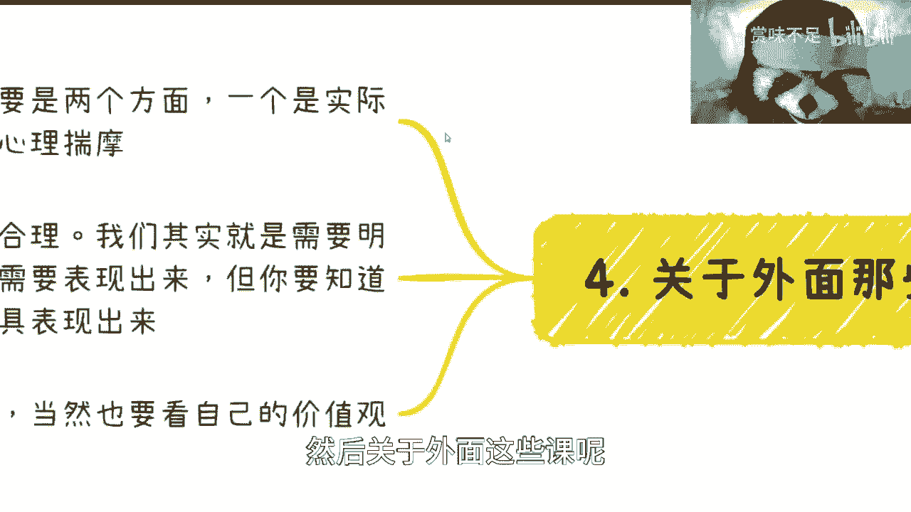

**如何理性看待：**
*   **存在即合理：** 这些课程价格昂贵且市场广阔，说明对部分人群有价值。
*   **环境适配性：** 不同企业（如小公司、互联网公司、国企）对领导力的要求和表现形式差异巨大。在某些环境中，懂得“如何表现”与“把事情做好”同样重要。
*   **个人选择：** 你可以选择学习其中的沟通与协作技巧，但不必全盘接受所有价值观。是否要深入运用“揣摩”技巧，取决于个人的职业价值观选择。

---

## 总结与核心建议 ✅

本节课我们一起学习了职场领导力的核心内涵与两种实现路径。

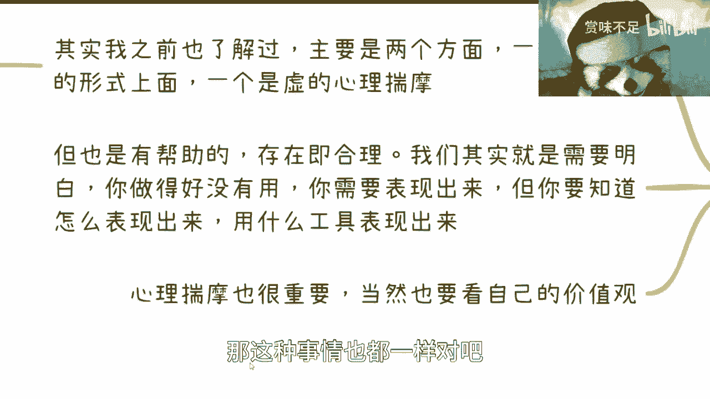

**总结如下：**
1.  **领导力的核心**是带领团队达成目标，在企业中常与“管理”能力重合。
2.  **健康的领导力路径（以德服人）** 建立在**真实实力**、**全局同理心**和**有效沟通**（包括向上和向下管理）之上。关键在于做到`虚实结合`，既要有扎实业绩，也要懂得恰当呈现。
3.  **应警惕的路径（PUA）** 依赖于**信息差**、**认知差**和**画饼**，虽可能短期有效，但非长久之计，也损害团队健康。
4.  **对于外部课程**，应取其沟通、汇报等实用精华，但需结合自身所处环境和个人价值观进行判断，无需盲从。

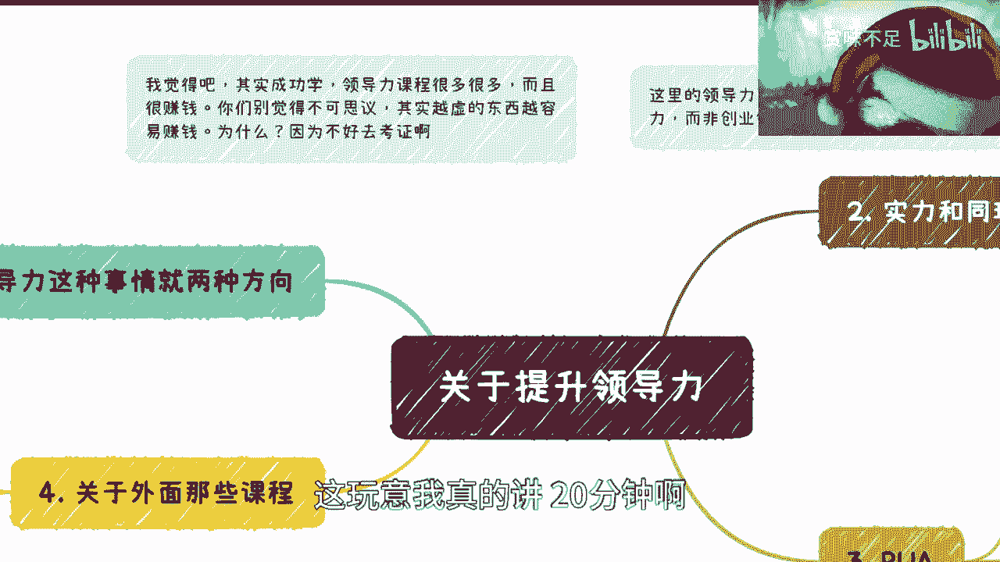

最终，我想传达的价值观是：提升领导力，应致力于提升以**德**（同理心、格局）、以**技**（专业能力）服人的方式，并精进向上与向下的管理艺术，而非依赖虚头巴脑的官话或职级压制。