# 我讲不来领导力，但我可以聊聊我看法 - P1 - 赏味不足 - BV1Eo4y1n7io

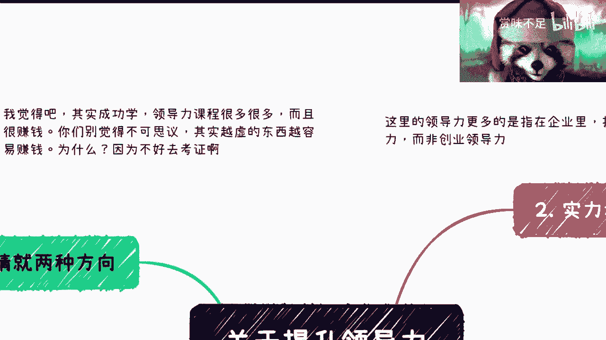

好啊大家好啊，我是吕老师是吧，很多小伙伴问我，刘老师怎么还没去香港是吧，我他妈等通行证呢，我靠这时间他妈太他妈慢了下来，我就马上过去啊，马上过去你们就看不到我更新了，就这么回事。

那个前两天呢有小伙伴对吧。

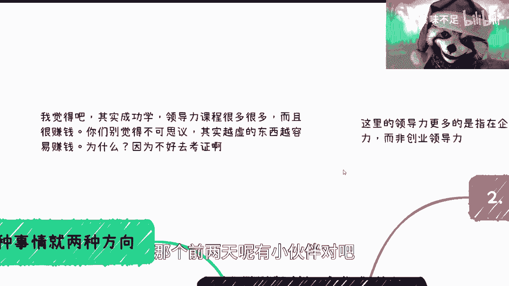

这个在评论区问我这个领导力的事情啊。

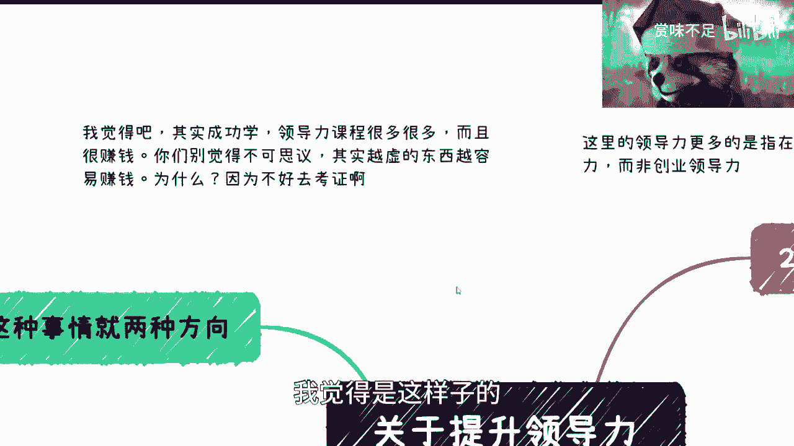

我觉得是这样子的，首先呢我我是不太会讲这玩意的啊，我只能从我的角度来分析一下这个东西，我也不想讲这个东西啊。

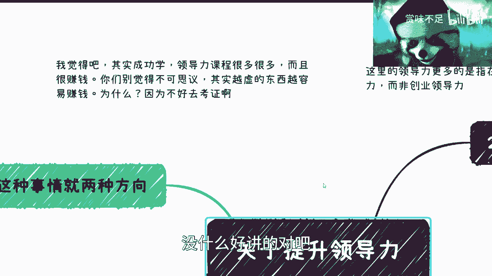

没什么好讲的对吧，依我风格我要讲的，我要想讲的话，我可以喷他妈一个小时是吧。

首先第一点呢就是你看啊，我觉得呢成功学啊，领导力课程很多很多，你们在外面可以看到很多很多是吧呀，我的耳机怎么被卡住了呀是吧，然后呢其实很赚钱啊，你们别觉得不可思议，为什么呢，因为呃很多虚的东西才能赚钱。

那为什么呢，因为不好去验证啊，不好去考证啊对吧，你你说我今天在那边讲一个克1+1=3啊，你们要喷死我，为什么，因为因为这个事情大家都知道啊对吧，而且这个信没有信息差对吧，而且就是历史上面有很多的。

就你真的要去找对吧，验证或者怎么样有很多东西可以找，我，不说什么原理上验证啊，就是就是基础的一些验证对吧，你要虚的东西不好弄啊对吧，你讲佛说佛有理。

他说他有理，那你怎么搞法呀是吧，那当然好收钱啊，第二点呢，我在这里讲的所有领导力相关的东西呢，更多是指在企业里面打工人的啊，这个management，而不是说创业者，因为创业本身所要发挥的很多的这种嗯。

怎么说呢，就是三观啊，包括很多的一些做事方式，跟你打工人还是很不一样的啊，就我觉得核心来讲，就是说打弓箭在那你肯定还需要忍的对吧，要要要有忍受啊，要要忍创业呢，我觉得这事情你不能忍，为什么。

因为你你都创业呢，你还忍个屁啊，你说是吗，你你就要按照自己想法来，成也好，败也好，这都是就是自己的成长。

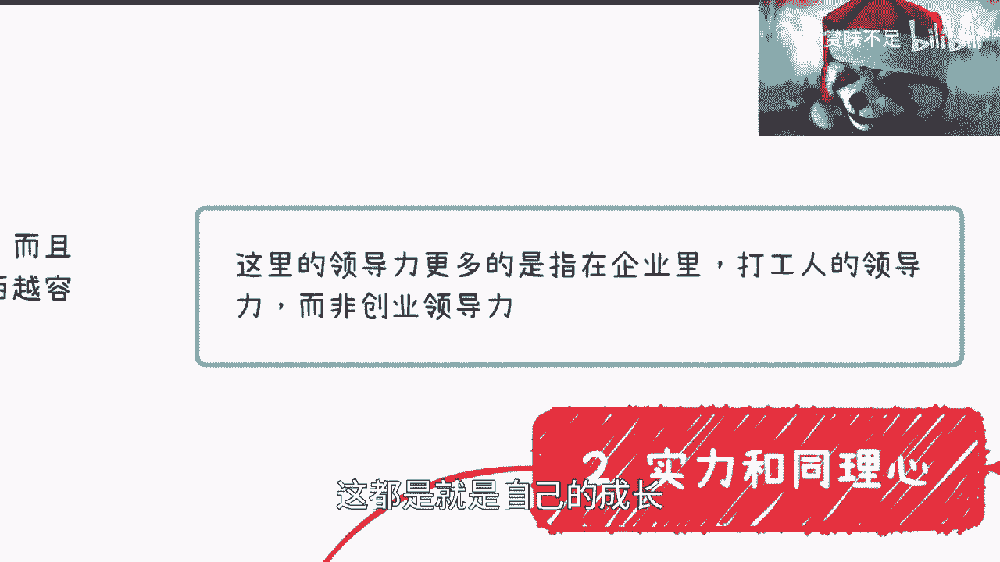

创业都忍了，还创个屁眼，你说是不是啊。

那我觉得是这样子的，首先领导力这个事情呢，在我的这个职业发展当中。

我看到的啊无非就两种啊，第一种是什么呢，就是真正的有实力的，有同理心的啊，就是以德服人对吧，拿了个板砖的上面写了个德对吧，以德服人啊，第二种是pv啊，就结束了啊。

那么分开来我们拆开来讲啊，以实力跟同理心来讲呢。

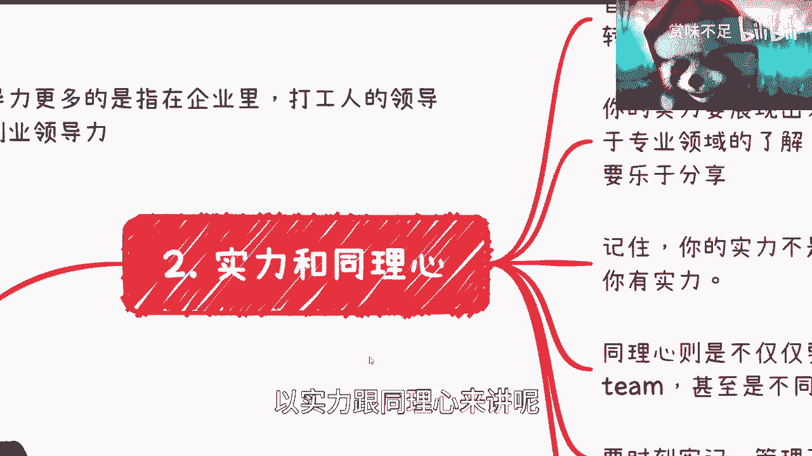

这个里面其实问其实问题蛮多的啊，首先你可能从组织架构上面，你是一个领导，又或者来说你是一个，即将从技术岗转到管理岗那边，为什么呢，因为很多的大企业他不是说你今天转到管理岗，你再去做管理岗的事情。

而是说你在晋升之前，很有可能半年或者一个季度的时候，你就已经开始做管理岗的事情了，只不过你这个时候头上还没有这个光环对吧，这个是很多的，就是在晋升之前对吧，这个企业很喜欢做的事情啊，他们美其名曰说啊。

你必须先达到这个level，我们在给你这个名，但其实就是压榨是吧啊那这个首先是第一点啊，第二点呢就是说你的实力要展现出来。

什么叫实力展现出来呢，就是我在所有的视频里面对吧，都跟你们强调过一个点，就是你的能力跟你的实力，跟你的各个方面的东西，绝对不能，你觉得怎么样，必须必须要我觉得怎么样对吧，你懂吗，就必须要别人觉得怎么样。

你觉得怎么样没有卵用，你知道吗啊我以为我碰到过太多的人，就是那种就是说就是我那天我之前不是说了嘛，就就他永远觉得地球围着他转，那我觉得就我现在一句话都不想跟这种人讲，你知道吗，没有意义啊，你吃好了对吧。

跟我有什么关系呢是吧，但是呢你们在企业里面如果真的要领导，要展现出你的领导力，那其实我觉得我我大胆地猜测一下，很多人问领导力的点呢，有两个原因，第一个原因是他的确不懂啊，这是有可能的啊，他的确不懂。

第二个原因是什么呢，他就是他已经是个管理者了，但是他的小弟们不买他账对吧，不服从啊，不他想以德服人啊，对方这个完全不买单对吧，这也是有可能的啊，而且我觉得后者的可能性高一点啊，那么在这个里面呢。

就是你一定要做到什么呢，就是你对比如说你们这个团队啊。

所在的专业领域，我不管是业务领域还是技术领域啊，专业领域都有一定了解吧是吧。

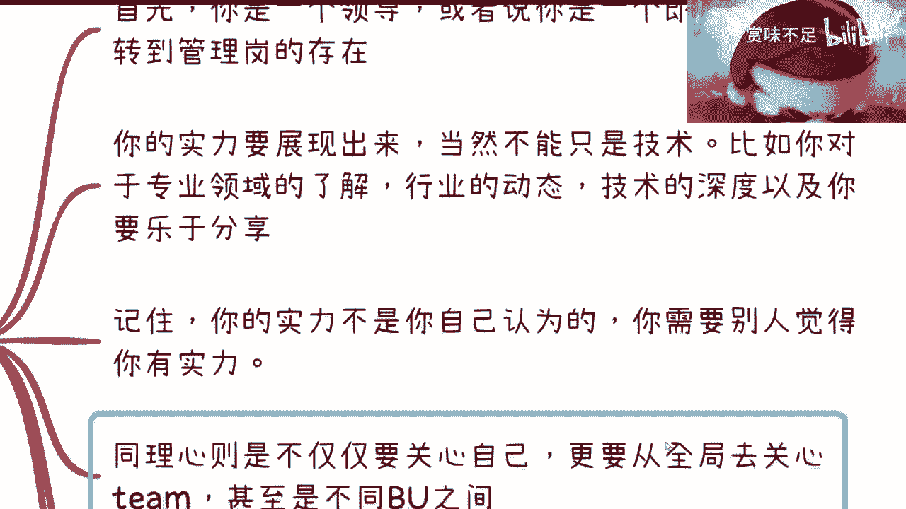

这个同样的啊，别把小浣熊卡住了，同样的对吧，行业动态啊对吧，技术深度啊对吧，你都要了解，当然啊在这个地方要说一点，就是说嗯我们就拿比如说你学python或学java来讲。

他不是说你今天要去把技术学得多深啊，不是说你今天一定要亲自全部做一遍啊，你也没这个时间对吧，我觉得就是说你得去了解，不是说你一定要实操过，但是你得了解，因为你不了解你的团队的成员。

跟你讲的时候就是鸡同鸭讲，那自然而然他会觉得你是个是吧，那你是个，你还怎么领导力呢对吧，那你只能被架空，是不是啊，那么另外一方面就是说你一定要乐于分享，当然你你要乐于分享，同时你也要鼓励大家乐于分享。

因为领导力领导力这种事情，其实你把它拆分开来，里面有很多就是不单单是以技术服人对吧，你还要有亲和力，你还真的就是把这个团队从不融洽变得融洽，就是你会发现它不单是一个呃，就是工作的技术层面。

它更像我们说为什么领导力里面要包含管理，就管理里面是什么，管理里面就是你今天有一个杂牌军对吧，你今天有一个有一个比如说军心不稳的，你怎么把它变得精心稳对吧，你怎么把它凝凝聚成一股力量。

这个也是你的能力啊对吧，就是就是很多时候是这样子的，就是很多人会觉得啊，就是我以前年轻时候，我也觉得就是啊这个东西虚的很对吧，他妈的骗人是吧，就他妈扯淡啊，但是你要这么想的呀，你如果从一个创业的角度。

或者从一个就是说我们就说啊，就是一个团队的角度，那你手上打比方，20个人团队或100个人团队对吧，你这个每一个人千人千面，你要保证整个业务大方向不偏离的情况，下，面里面的人又能够完成每一个螺丝钉。

应该完成的事情，这还是很不容易的对啊，这还是很不容易的，那你说你没有一点湿的东西可能吗，不可能的对吧，哦你说100个人，200个人甚至几千个人，你全部以十为这个来来以德服人，你怎么伏法啊。

你告诉我你每每个人就都去问问，都去review一下对吧，都都去都去，每个人都去聊聊一下，你哪里有这个空，是不是，所以说就说就是很多时候呢，就是说根据不同的团队的就是不同的，比如说不同的业务啊。

不同的这种团队规模啊，你还是要有不同的这种管理方案的啊，就是它有管理学本身存在，一定是合理的对吧，但是领导力这个东西，我觉得他妈的就有点怎么说呢，就是好像在一个比较实的东西。

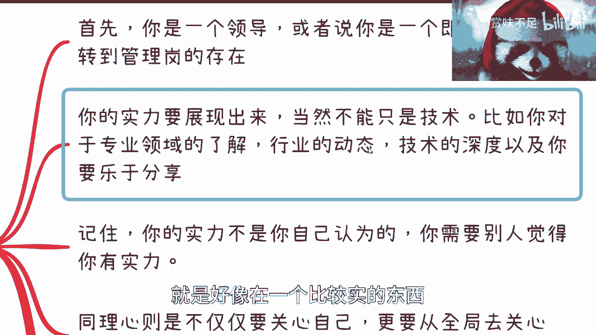

外面又包了一层虚的东西啊，那么这个是第二点，第三点是什么呢，就是就是我刚跟你们说的，就是说你的能力，你的实力一定要别人觉得怎么样，而不是你自己觉得怎么样，你要时刻记住这一点啊。

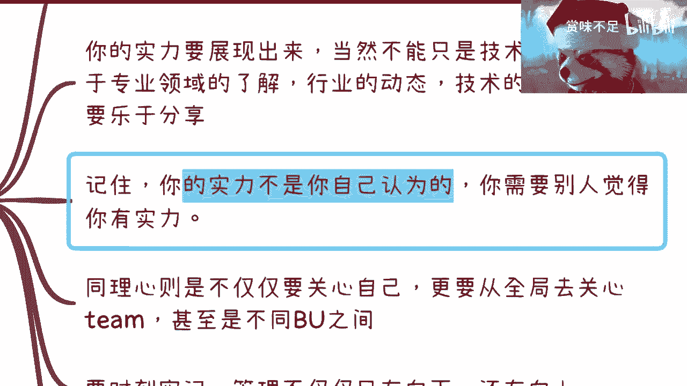

那么第四点就是说我们在这个地方还写吗，你需要同理心吗。

那什么叫同理心呢，就是说你的所有的关注点啊，就是比如说技术啊，行业啊，就乐于分享啊对吧，包括整个团队管理啊，你还你不仅仅关心到你自己，你更要去从全局，因为所谓领导，所谓管理是什么。

就是你的技术深度也不知道技术深度吧，你的技术理解深度和视野的广度，你一定是要优于这些人的对吧，或者说我们退1万步来讲，你就算不优于这些人，你要让对方觉得你是由于这些人对不对，那么你才能去管理。

否则你怎么管理呢对吧，你就好像我今天我我我上了，我给你们讲了这么多期课是吧，这个数字经济也讲了这么多节课对吧，那么我说其实我可能什么都不懂啊，然后呢你们一开始可能觉得吕老师蛮懂的对吧。

那我可能讲了两节课之后，你们就会发现哦，这个人什么都不懂对吧，他就是个搬运工对吧，那你还怎么以德服人，你服不了人啊，对不对，就说你除了啊关心自己，你要让大家觉得诶。

你对全局得要从一个面上面得要有认知的对吧，而且你要有自己的这个依据，你不能告诉大家啊，我就这么觉得，人家问你为什么我没为什么就这么觉得，那那你还搞个屁啊是吧，所以说就是说这个全局呢。

就是说一是团队层面的全局，二是行业层面的全局，三是不同，就是一个公司里面不同的业务事业部，之前的全全局，就是你得告诉大家，我们从一个团队里面应该怎么配合，我们从一个行业里面。

我们又为什么就是要比如说从这个gp里面，为什么要去切这个这个细分领域的模型训练，而不是去切，就是说啊包装一个这个新的gb t对吧等等等，那为什么我们在不同的bu之间，我们要做什么，他们要做什么。

为什么我们选择这么做，对我们的帮助是什么，你都要告诉大家，你知道吧，就是就是很多时候啊，就是说啊你不要觉得啊，就是呃就是故意的去去制造这种信息差，首先这第1年，第二点就是说你也不要觉得就是说啊。

好像有很多东西是什么什么敏感信息啊，对吧，或者怎么样子的，没有的啊，你只要不是去讲什么，就是说啊这个上层的机密对吧，我觉得上层机密你也不一定知道啊，就是在团队层面，在行业层面，在不同的事业部层面。

你是可以告诉大家你是怎么想的，否则大家怎么知道你是怎么想的，你为什么做这个决定呢，对吧，就是你就算当他是个螺丝钉，你也不能真的告诉他，你就是个螺丝钉啊，对不对，那我可以告诉你们，你们是个螺丝钉，为什么。

因为我跟你没有利益冲突啊，我不是你的manager对吧，我要跟你现在在一家公司，我是你的manager，我告诉你，就是个，你就是个你就是个螺丝钉，那你肯定不服啊，是不是你回头好的上去打我小报告是吧。

那那你还领导，哎呀，你可别领导了啊，所以呢就是说呃唉我们往下讲吧好吧，就说你还要时刻牢记什么呢，就是你你的所谓领导，你的所谓的管理不仅仅只有向向下管理，你还要向上管理对吧。

就是我们一直说就说向上管理和向下管理，都是管理哦，都是领导力，你不要觉得你只有向下向上也是一样的对吧，那向上在这个里面你更要体现出同理心，为什么呢，因为就是你作为就是你向上的时候，你要懂得。

比如说啊你要懂得怎么汇报，你要懂得怎么汇报的形式，你要懂得上面关心的是什么对吧，因为你说我跟别人合作也是一样的，就是比如说我们现在商业合作对吧，我我比如说这个我负责课程，对方负责这个渠道对吧。

就是招生啊，或者说是这个流量对吧，那么你想想看对方，我跟对方开会的时候，对方跟我讲了一大堆对吧啊，跟我说啊，最近情况怎么样，最近a b c d e f g对吧，可以讲一个小时，但是你我就问你关不关心。

我不关心，为什么，因为在我的商业逻辑里面，就是我只提供课程，你只提供流量，我们一撮合去赚钱就结束了，你跟我扯这么多干嘛呢，我不想知道呀，对不对，那当然从商业角度呢，我们就说我我不care他对吧。

我不关心他那件事情就过去了，但是你们从公司里面，你但凡在那边啪一股脑的全部往上跑，那你的领导就是你的领导，会就觉得你这个人不行，而且你这人很不行对吧，因为本质上来讲。

你在公司里面你以一个打工人的身份在里面，你更要察言观色对吧，就像我们一开始说的，就是你如果创业了对吧，你自我一点对吧，就傲傲娇一点对吧，怎么样无所谓的，你在公司里面你还是要忍的对吧。

所以说这个事情没有办法啊，那么最后一点呢，就是你一定要学会虚实结合对吧，所谓虚实结合就是说你做得好，你比如说团队管理的也很好对吧，然后下面的人也对你很买账啊，但他们大家也都觉得你是个很牛逼的领导对吧。

等等等等等啊，然后业务也做得不错，但是同样的所谓虚是什么虚就说你得懂得报告，你得懂得怎么锦上添花，你得懂得怎么把你的管理，把你的这个团队的成绩放大，这也是你要做的对吧。

你说哦我今天这个团队比如说明明做了80分，但你的汇报汇报上去80分变70分，你说你是不是好领导，不是哦，但是你这个团队如果今天做做了只有60分，你汇报上只有80分，我跟你说。

你的所有团队的人都觉得你是个好领导，为什么，因为你跟大家相当于大家的利益跟你是共同体，你你你也考虑到大家利益对吧，然后大家就会觉得哦我是不是明年更努力一点，因为因为做了60分，做了50分，我说不好听点。

大家自己心里有数的对吧，然后你拿你汇报上去80分，那么我觉得很有可能的是，你可以给到大家的一个一个信号，是说诶我更多的鼓励一下大家，那同样的你也可以旁敲侧击告诉大家，我不是不知道你们这次做的不好。

但做的不好没有关系，明年我们可以再努力吧对吧，但是反过来你想想看，如果大家做的很好啊，你会抱成一个，那你告诉我还怎么搞对吧，你难道安慰大家，哎呀大家不好意思啊，因为我是个是吧，那那算了啊。

那就就就别领导了对吧，就这样了啊，嗯然后那个pua这边呢，其实我还是那句话，因为首先呢这个pv这件事情呢，这个模式很多对吧啊，我也不懂啊，我也不想讲啊，但是呢我觉得核心啊，pua的核心是在于。

你没有以上我们所说的很多实际的能力能力啊，你只能p u a大家对吧，那而且另外一方面p u a本质上是什么呢，就是一用你的信息差跟你的认知去画饼，来灌输虚假的目标和发展路线。

因为有很多人每个人都有成长嘛，都都是这么走过来的嘛对吧，你说像我这种啊，像我这种刚毕业啊，就能够指着这个教授骂的人不多啊对吧，大部分人还是规规矩矩的啊，你们又要讲了，刘老师是牛逼，那怎么办呢。

我他妈的牛逼也没卵用啊，因为一开始毕业我再牛逼也是被人家坑啊对吧，人家就会觉得你是是吧，就你画饼以灌输虚假的目标和发展路线，所以说有很多人呢因为刚毕业对吧，人家也不知道怎么发展。

也人家也不知道你公司什么情况，那么你自然而然是可以有能力给人家画饼的啊，那么大家由于哎呀觉得哦，你可能是个领导啊对吧，你可能是个怎么样，因为很多人这种心思的对吧，像我这种这个叛逆的人不多的是吧。

那么他就可能会被你pua，那么你说这算不算领导力呢，也算有什么问题呢，就是你你稳定住了这个团队，至于你怎么稳定的，咱先不去说它是不是啊，那其实我跟你讲这种呢，在公司里面我真的看到不少真的不少了，偏多啊。

毕竟现在虚的人很多，时的人太少对吧，那其实它很核心的原因还是在于，信息差跟认知差啊，这个我觉得你们反正多怎么说呢，多多判断一下啊。

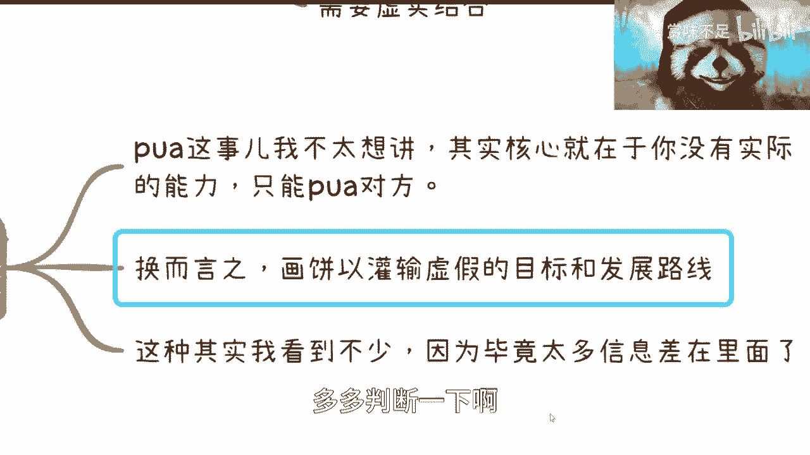

多判断一下，哎不对呀啊这个时候就有人说了。

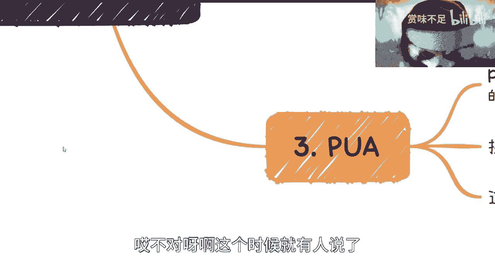

卢老师，你不是讲领导力的嘛对吧，怎么怎么怎么就变成了。

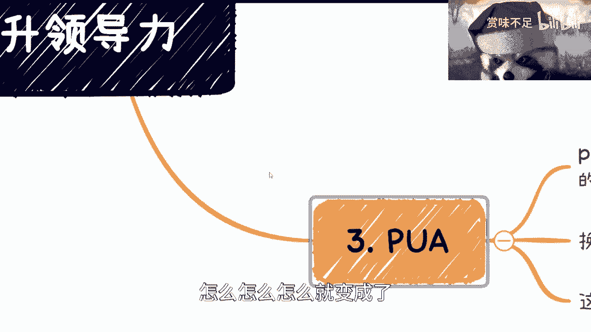

我们要去拆穿领导力的呢，是不是啊，然后关于外面这些课呢。

我觉得也要讲一下，就是首先呢之前我也了解过对吧，其实就是两方面，一个是实际层面上的操作，就告诉大家你实际的这个输出，比如说啊报告啊对吧，包括包括一些汇报方式啊等等等啊。

还有另外一个呢虚的就是心理心理上的揣测，就我们说的这个换位思考对吧，但你说呢就是说这个东西有没有价值呢，我觉得是看个人的，你不能说没有价值，因为外面领导力的课卖的特别好，我跟你们讲哦，还他妈特别贵啊。

比我出去讲课要贵得多了啊，那你说你说有没有价值吧，反正我们觉得没有价值有没有用，反正有人觉得有价值，是不是，那这第一点，第二点呢就是说也是有肯定是有帮助的，存在即合理对吧，而且存在这么长时间。

所以呢我们觉得就是说其实呢你首先要明白，因为你不同的企业，它肯定是需要不同的东西，因为你想嘛你今天加今天加小企业，你要什么领导力啊，我觉得不需要有什么好领导力的对吧，大家平起平坐啊，就把事情做好对吧。

你今天要在家互联网公司呢，哎还稍微好一点对吧，那你今天要在家国企啊，那你肯定就要了对吧，那怎么办呢，你你你做事情总归要遵守这个世界的规则吧，对吧，那你没有办法的啊，所以说你呢就是说做得好没有用。

你需要表现出来，但是你得知道怎么表现出来对吧，用什么语言啊，什么工具啊，什么技术啊，什么形式啊，对吧，呃就像我们之前说那个喝酒的逻辑是一样的，就是你说他是不是糟粕文化是啊，他是不是甚至不叫文化对啊。

你是不是说我我很反对他对，你说是不是很多人反对他也对，但是问题是依然当下还是有很多人会去follow，会去遵循这么一个规则，为什么呢，因为现在依然有很多人喜欢这种东西，那怎么办呢，对不对。

那所以我才一直说嘛，改变从我们做起嘛对吧，你不能说这个世界现在就是零和一，就是黑和白的，那也不可能对吧，那如果来说我们说慢慢变化的话，那不管怎么样，在变化的过程当中，它还是存在的。

他不可能一下子就没有是吧，那你哎呦，我靠这个写错了啊，揣摩对吧，当然心理揣摩也也很重要，嗯但这个事呢怎么说呢，就是有很多人呢我觉得是这样子的，他说我呢有这有这个能力缠言观色，我也有这个能力揣摩。

但是呢我不想去这么做，打咩对吧，我就不想这么做啊，我觉得我就过不了自己这个价值观对吧，其实我觉得也对啊，其实有很多人就说就是换句话来讲，就是说我就不想去跪舔我，干嘛去跪舔，对不对。

你要你要觉得这事这么做就这么做，不这么做就不这么做，拉倒我，为什么跪舔你是吧，当然了，就是每个人有每个人选择啊，就像我我跟大家说，这个从毕业开始就叛逆对吧，一直叛逆到现在啊。

但是有很多人也不见得就是他可能会觉得啊，这个这个我很欣赏啊，吕老师叛逆，但是我自己不能叛逆，因为我就怕我叛逆了就被摁死了是吧，那这种事情也都一样对吧。

每个人都有每个人选择啊，呃但是不管怎么样呢，反正我想传达的价值观呢就是这样子的。

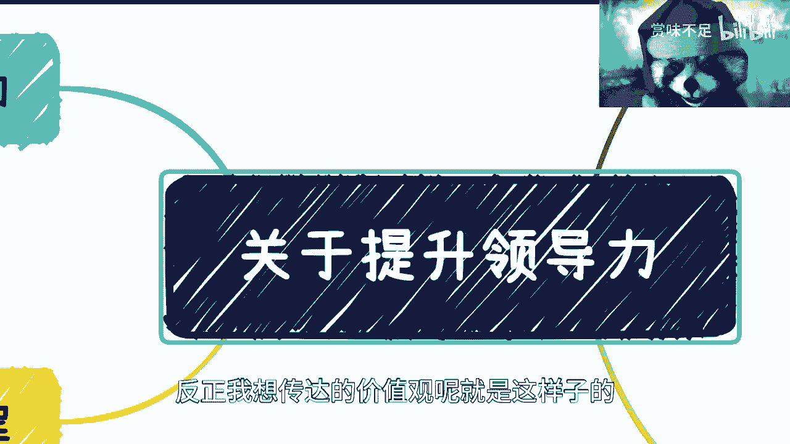

就是说如果你想提升你的领导力，那我觉得就是你得提升你的以德服人的方式，以技术服人的方式，以及以格局夫人的方式对吧，然后同时要去学习向上管理和向下管理啊，别去搞那些有的没的虚头巴脑的。

然后什么什么讲官话对吧，或者用这种职级来压别人对吧，我觉得没有必要，都已经2023年了，你还搞这个样子，有什么有什么意思呢。

什么意思好吧，嗯行吧，就这么着吧，我讲了多久了啊。

这玩意我都能讲20分钟啊，我要去反思了。