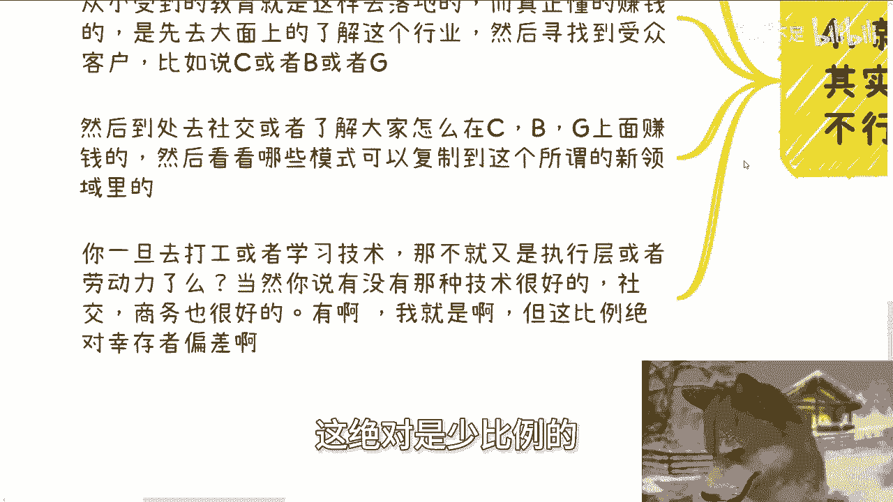
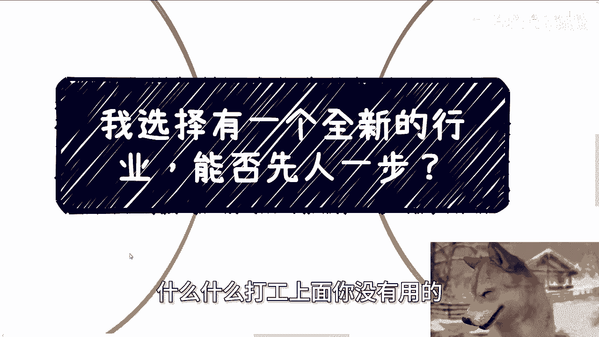

# 我选择一个全新的赛道，能否先人一步 - P1 - 赏味不足 - BV1Kx4y14725

啊大家好，这个今天我们讲的这个主题呢，叫做我选择一个全新的行业啊。

能否先人一步呃，首先我先说答案对吧，能肯定能啊啊那有啥不能的啊，问题是两个点啊，你从什么方式了解这个全新的行业。

另外一个你在里面做什么啊，嗯这是这次北京活动上面一个小伙伴问我的啊，也把我问笑了啊，这其实核心就两个问题啊，第一你怎么获取这些信息，所谓能够获取到你所谓的那些，这个全全新的行业，第二你在里面到底干嘛。

我们就拿他的问我的问题来讲啊，首先第一他说国内的国产化操作系统啊，他说有嗯，他说他并没有获取太多的信息，问我，他如果现在进去是不是能有一席之地啊，这是他的原本的问题啊，我当时是这么说的啊。

我最早给国内操作系统啊，做认证讲师跟推广的是在2019年左右，当然我获取的早不早，我并不知道啊，也有可能201415年就做了，我不知道啊，这我我的确也没了解过，但你们简单来讲，就我做的距离现在多少年了。

对吧哦，从很多人来讲，他们现在可能都还不知道，他们认为这还可能是个新新的赛道，为什么，因为他们的信息很闭塞，但并不代表这真的是个新的赛道对吧，这是第一点啊，第二点，更何况这个新的赛道你经去做什么。

你比如说当时北京活动啊，这个问我的这个人，他说他要进去做开发，那我就问嘛，能有啥前景，你进入一个行业，无论早晚，你如果要赚钱，你需要明确你的明确你的用户画像，就拿操作系统来讲，这种行业。

你但凡要做企业端或者散户，或者C端或者高效端的这种客户，说不好听的，你都需要认证的啊，作为一个什么民营企业，或者作为一个个人，你能够认你能够去做啦，啊你没有授权，你就真能做啦，做个屁。

对不对啊，而认证这个东西需要什么，需要钱，需要关系，哎我跟你讲，这不是单纯TMD你觉得你先进去，是你后进去这么简单呢。

啊如果来说这个社会谁先进去，谁谁就能赚到钱，尼玛这他妈如果这么简单的话。

那么也不至于现在这么卷了啊，第二记住啊，你是不是先人一步，其实根根本就不重要。

重要的是里面的规则啊。

具体我就不说名字了啊，免得到时候他妈节外生枝，某些部位啊，某年都会有新的证书出来啊，比如说什么机器人啦，大语言模型啦，区块链啦，元宇宙啦对吧，反正什么东西热什么东西来啊。

那么你说你先知道重要吗，我现在就算让你知道你又怎么样呢，你能怎么样对吧，它不重要啊，重要的是你得知道你怎么进去，你怎么成为白名单，你怎么成为有资质的那一方对吧，那同样的我告诉你他需要给钱。

同时也需要走正常的申报流程，给多少我就不说了，反正作为普通人肯定给不起啊，那么另外一方面就是申报流程，你需要有完整的课程，所谓的完整的讲师团队，包括一些头衔和背景案例，你有吗啊，你有吗啊。

我就算你在所谓的这个领域里面生根了。

如果按照你们理解的生根，我敢打赌你们他妈拿不出任何东西来。

有卵用啊，啊有什么用呢，对不对。

那么第三记住啊，无论什么领域，至少在中国人和关系就是第一位的，咱在这里面从两个角度来讲。

第一是钱，第二就是你未来的年龄大了之后的发展。

我就问啊，你要赚钱怎么来，一定是项目当中来，为什么，因为只有这种社会上的项目当中，它才会性价比比较高，对不对，好，那么参与到项目当中去，什么领域都无所谓，那么项目怎么来，别人不会无缘无故给你，对不对。

所以说就别去看什么，别别去只看什么新的领域或者新的行业，重要的是你要去这些新的领域，或者新的行业里面打关系对吧，关系先打下来。

另外你现在赚钱赚得动，OK等你年龄大了，我比如说30岁以后，35岁以后怎么了，你每天工作吗，你每天996007吗，我他妈能看你996007几年对吧，而且你年龄大了，你的生活需求。

家庭需求欲望一般也都很大，请问你怎么赚钱啊，难道你那时候还他妈的每天在那边工作吗，每天在那边叫什么劳动力吗，还是执行方啊对吧，我们最终的目的就是性价比高的赚钱，能让自己有更多自由的时间。

说通俗点就是你只做那个分包的，你只做那个有关系的人的对接，你只把关系握在手上，而不是说你最终把什么执行落地握在手上，执行落在执行公落地握在手上，这他妈叫什么赚钱啊。

对不对啊，那么第四就如我们之前说的。

大家很多思想其实都是别人灌输的，但是一旦落地，你就会觉得不行，你比如说你说去一个增量市场，对不对，对啊啊，去一个全新的市场，对不对，也对呀对吧，但是你真的落地时候，我就问嘛，你怎么落地，就像我刚问的。

你去你怎么了解这个新的市场，你怎么去在里面做些什么东西，你知道吗，你不知道对吧，很多人真的所谓的去一个新的领域，他今天就算运气好，比如说天时地利人和都占满了，他去一个全新的新的领域。

他去打工或者学习技术，尼玛这他妈叫什么，这叫，对不对，而我们就说啊，95%的人都是这样去落地的，因为为什么，因为他们从小受到教育就就是这样去落地的，而真正懂得赚钱的人，懂得规则的人，是他会明白他。

第一步先要大面上的了解这个行业，然后寻找受受众客户，比如说我们说的散户端，企业端或政府端，然后他到处社交和到处去了解大家，或者已经在这个行业里面的人，他们是怎么在C端，B端G端上面去赚钱的。

然后看看哪些模式，可以复制到这个所谓的新的领域里面对吧，那么你一旦去打工或者学习技术，那不就是又变成了执行层，执行层和劳动力嘛，对吧哦你说花个3年五年，那你这辈子有几个三个53年五年了啊对吧，当然啊。

你说有没有那种技术很好的对吧，或者技术相对来讲能学好的，同时社交商务也能够做好的，能啊我啊对吧，但他妈这能有多大比例啊，哦我能做，我就跟你们说，人人都能做不现实的呀，我能告诉你们。

你要是在做执行层跟又做商务这个当中，你想兼得的，我就告诉你，这绝对是少比例的对吧。

所以我一直跟你们讲，不要把关注点，老师都关注在你们的这个，这所谓的什么什么行业深耕啊对吧，什么什么技术学习啊，什么什么打工上面，你没有用的。

你知道吗，你早如果你未来想要有一定的自由度，或者你想要一定高性价比的赚钱，你早晚要走出这一步对吧，但是我还是那句话，你们两者兼得的人一定比例是少的，所以我才一直跟你们说，你们尽量一定要有个侧重点。

可能是八二开，甚至是九一开，为什么，因为没办法，社会越来越卷了，对吧，所以说你说到现在啊，就是还有你说这次北京活动上面有人这么问，我说明什么，说明就是说年轻的人里面。

他还是有很多人对这个社会一点都不了解，就觉得好像啊这个社会是一个非常透明的，公开的公平的对吧，你去做啊，做了之后我先人一步，我做一个什么东西啊，我就有更多的积累，我就能够去赚钱，问题是你有更多的积累。

你能够去赚，这这这两者有因果关系吗啊有什么因果关系啊，我就这么说，我那天跟B站沟通的时候也是的，他们的运营负责人跟我怎么讲呢，对吧，B站现在上面或或者说你们去看抖音对吧。

这种平台上面有多少内容是非常实在的，有多少这种什么啊，真材实料的人，讲内容的，讲课的，讲讲这种学术的或者讲什么东西啊，有流量的啦，有流量不啦，能赚钱的啦，你们自己去看看，搞笑嘞，真的是对吧。

我还是那句话，如果你们认为这社会是你们能够有积累，你们能够先人一步认就是学习到点东西，然后在未来就能赚到钱，如果仅仅这么简单的话，现在不会这么难的啊，不会这么难的啊，多去了解了解社会。

不要活在你们的这个想象当中，好吧行，那就这么着吧啊，然后这个职业规划，商业规划啊，你们自己现在工作，或者你们跟一些小伙伴一起做生意的，做一起做商业的，或者做一些副业的呃，你们在这里面比如说合同啊。

分红啊，丰润啊，股权啊，股期权啊对吧，股份啊，包括商业商业计划书白皮书啊，包括你们呃有些什么未来的规划，你们希望通过我的一些视角，通过跟我的一些沟通啊，我希望我能够给你们一些更好更接地气的建议。

或者还说啊能够让你们少走一些弯路的话，那么你们啊可以整理好对应的那个个人背景，跟个人问题好吧。

