# 我选择一个全新的赛道-能否先人一步---P1---赏味不足---BV1Kx4y14725

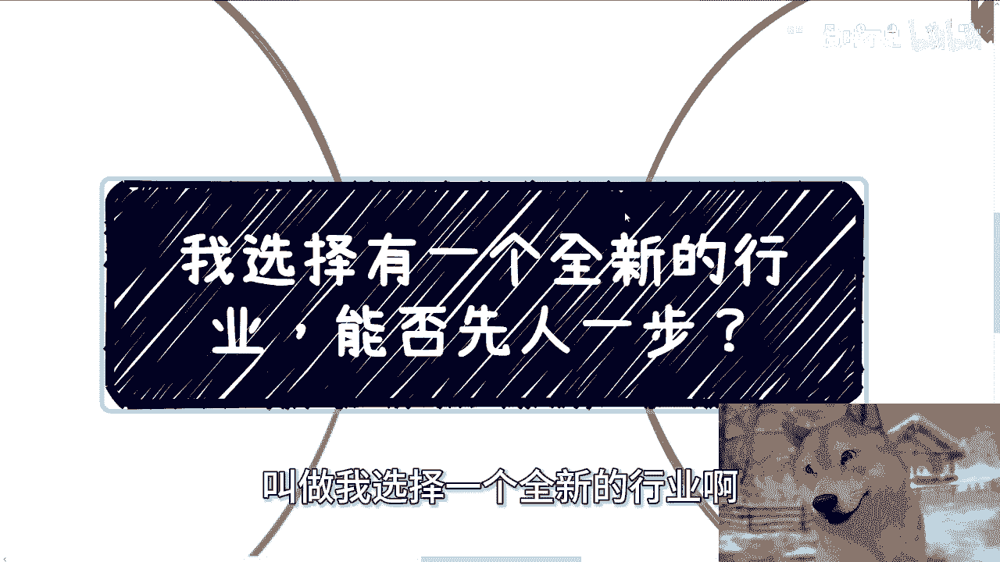

在本节课中，我们将探讨一个常见问题：进入一个全新的行业或赛道，是否能够凭借“先人一步”的优势获得成功。我们将通过一个具体案例，分析其中的核心逻辑与常见误区。

---

## 概述

很多人认为，只要比别人更早进入一个新兴领域，就能占据优势并取得成功。本节课将剖析这种想法的局限性，并指出在现实中，比“时机”更重要的是**获取信息的渠道**和**在行业中的具体定位**。

上一节我们概述了课程主题，本节中我们来看看核心问题的两个层面。

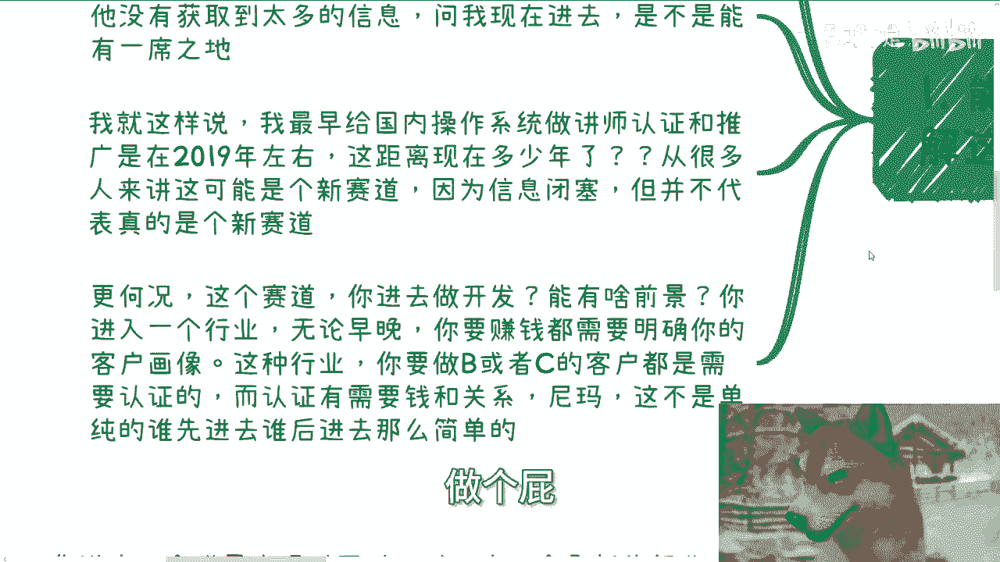

## 核心问题剖析

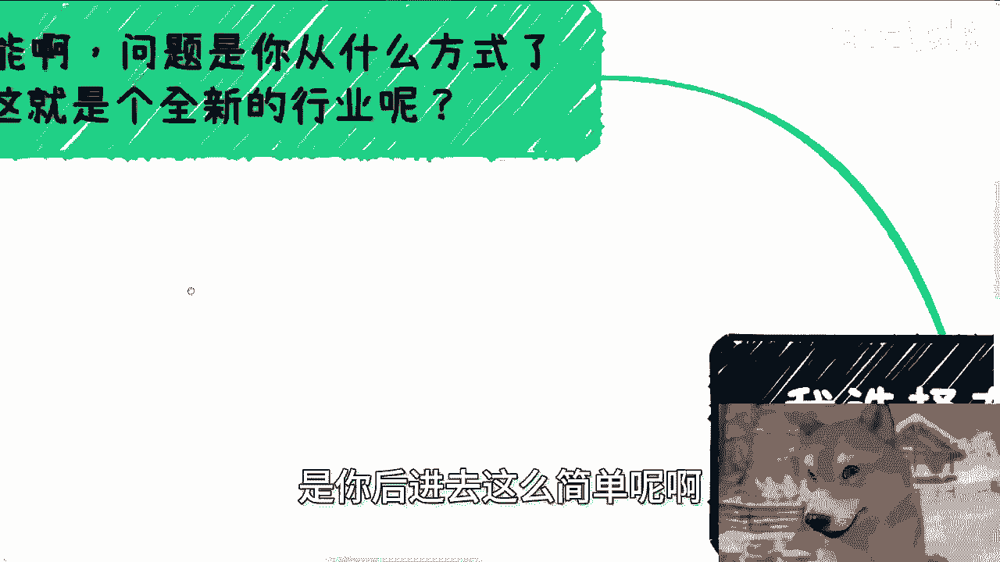

提问者的问题核心包含两点：
1.  如何获取关于全新行业的信息。
2.  进入该行业后具体做什么。

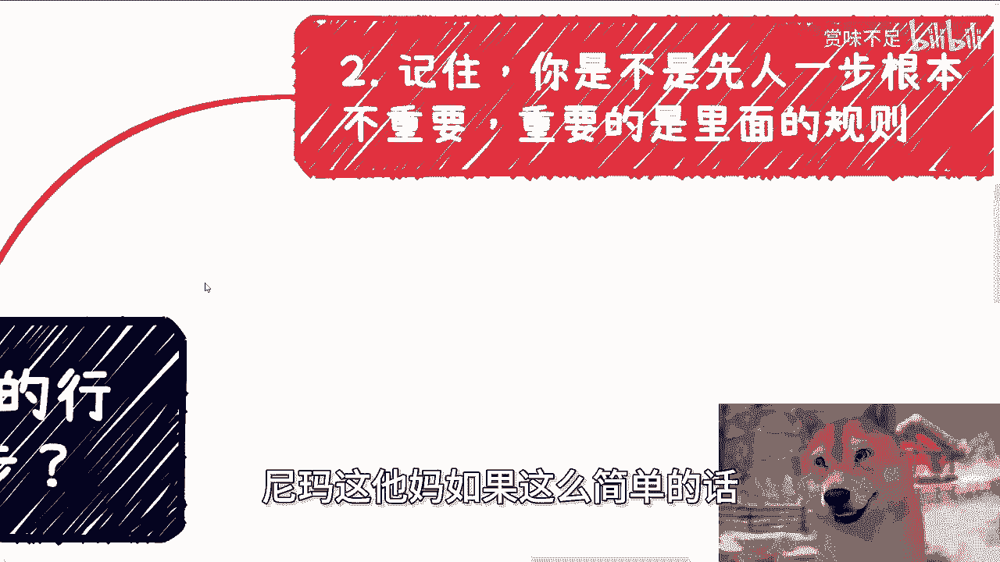

我们通过一个具体案例来展开分析。案例中，提问者关注的是“国产化操作系统”领域，他认为这是新赛道，并询问现在进入是否能有发展空间。

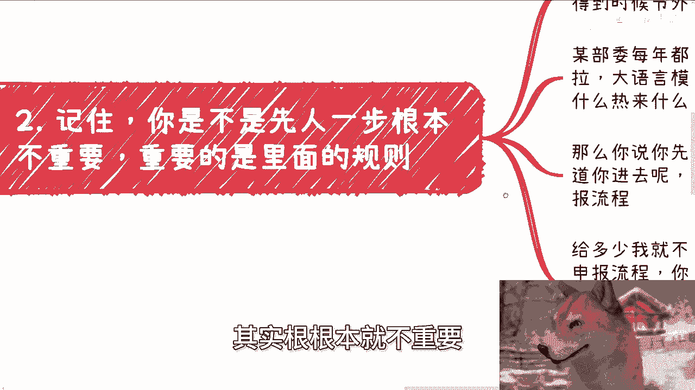

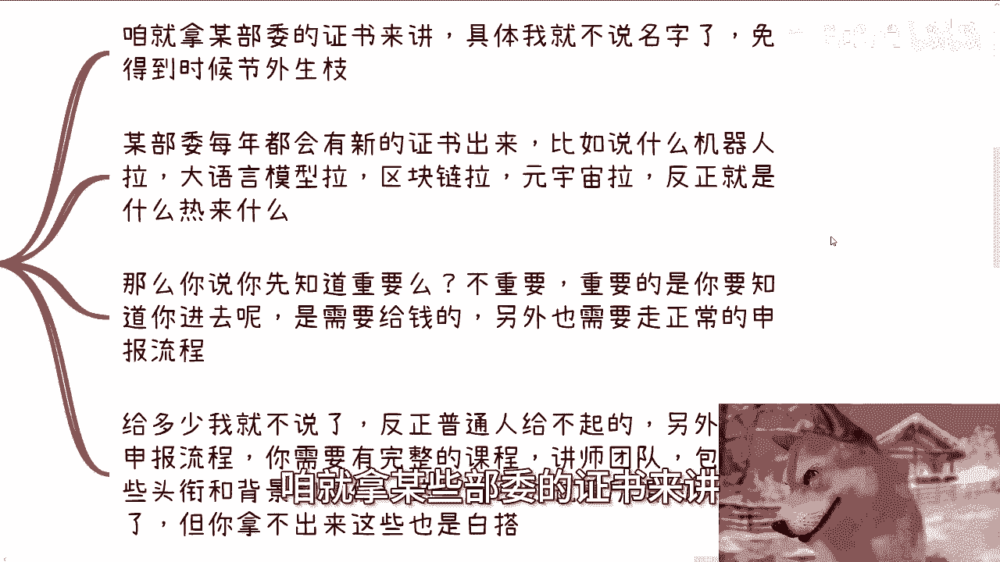

---

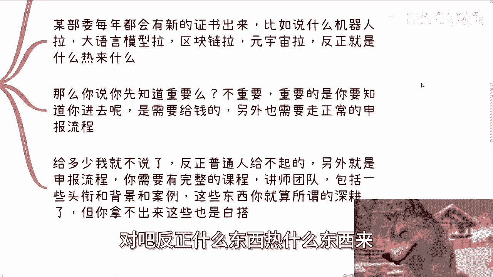

## 误区一：信息闭塞导致误判“新赛道”

我最早为国内操作系统做认证讲师与推广是在2019年左右。对我而言，这不算一个新领域。但对很多人来说，他们可能至今仍认为这是一个新赛道。

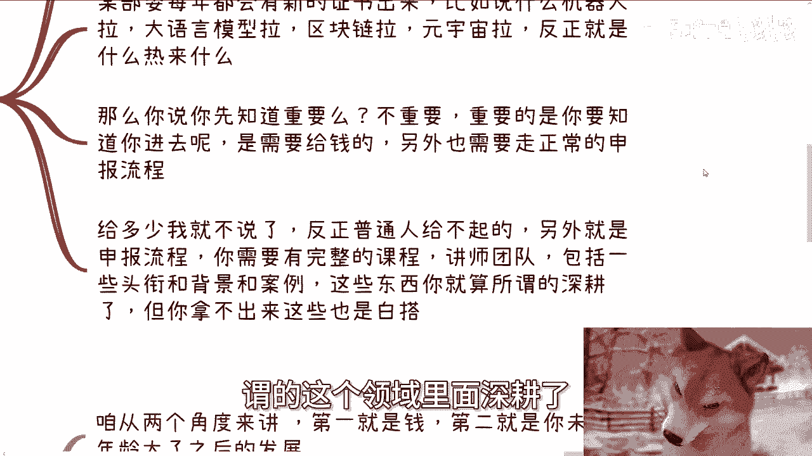

**原因在于信息闭塞**。信息获取的滞后性，会让人误将一个已经发展数年的领域当作全新的蓝海。因此，你所以为的“新赛道”，在更早的入局者看来可能已是“旧战场”。判断一个领域是否“新”，不能仅凭个人感知，而需基于广泛、深入的信息调研。

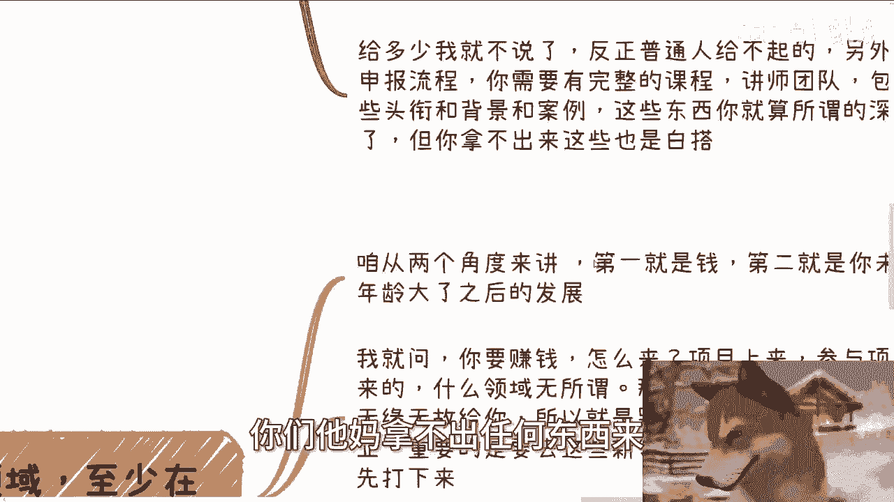

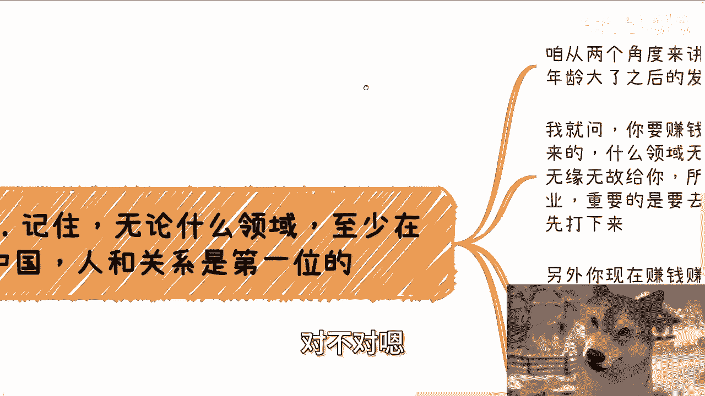

上一节我们讨论了信息差带来的误判，本节中我们来看看即使进入一个领域，关键问题是什么。

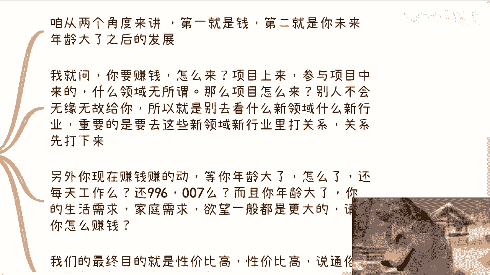

## 误区二：忽视行业规则与准入门槛

即使你进入了一个相对早期的领域，“做什么”比“进得早”更重要。以操作系统行业为例，若想面向企业、高校或政府客户提供产品或服务，通常需要官方授权或认证。

以下是进入此类受监管领域的关键要素：
*   **资金与关系**：获取认证往往需要资金投入和行业人脉。
*   **资质与背景**：需要完整的课程体系、讲师团队、头衔和成功案例作为支撑。

对于普通个人或初创团队而言，这些门槛难以跨越。因此，**了解并满足行业规则，比单纯“进入得早”重要得多**。

社会上常有新兴证书出现，例如机器人、大语言模型、区块链等。提前知道这些信息并不构成优势，关键在于你是否能成为“有资质”的参与方。

上一节我们分析了行业规则的重要性，本节中我们来看看在商业社会中更底层的逻辑。

## 核心逻辑：关系与模式重于技术与时机

在任何领域，尤其是在中国，人与关系是第一位的。我们可以从两个角度理解：

1.  **赚钱的路径**：高性价比的赚钱方式通常来自项目。项目不会凭空而来，依赖于关系网络。因此，进入新领域后，首要任务是建立关系，而非埋头钻研技术。
2.  **长期发展**：年轻时可以靠体力（如996工作制）赚钱，但随着年龄增长，家庭责任变重，需追求更高性价比的赚钱方式。理想状态是成为资源的整合与分配者（握有关系），而非纯粹的执行者（握有技术）。

很多人受到的教育是进入增量市场、学习技术、成为专家。但落地时，95%的人最终走向了“打工或学习技术”这条路径，这本质上是成为执行层和劳动力。

真正懂得商业规则的人，会采取不同的路径：
*   首先大面上了解行业。
*   寻找目标客户（C端、B端或G端）。
*   通过社交，了解该行业内已有的成功盈利模式。
*   思考哪些模式可以复制到新领域。

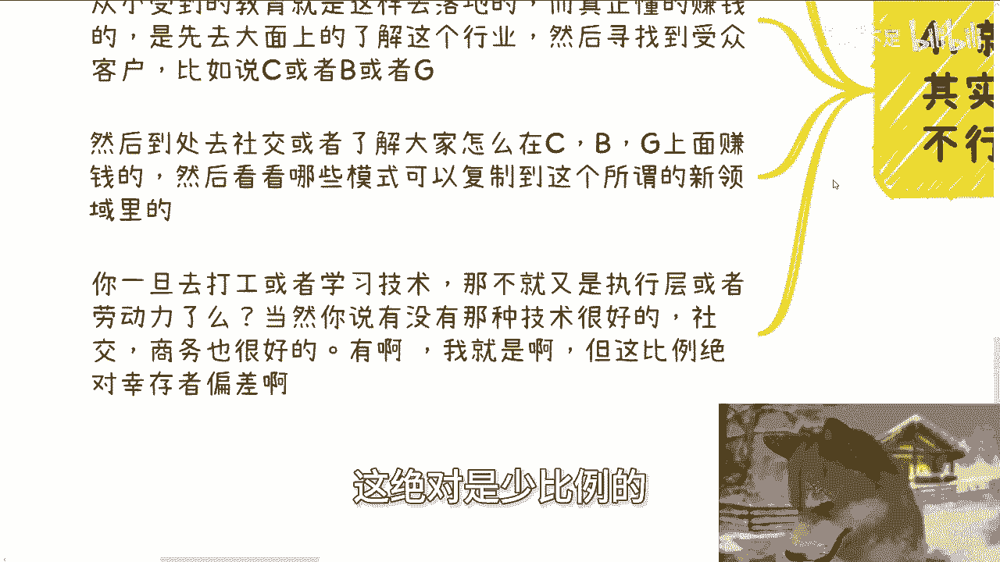

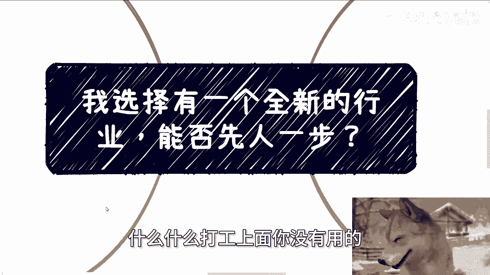

如果将大量时间花在“技术深耕”和“打工”上，未来很难获得高自由度和高性价比的收益。虽然存在技术与商务能力兼备的人，但比例极少。对于大多数人，必须有侧重点（如八二开），尽早规划向资源整合方向转型。

上一节我们探讨了商业社会的核心逻辑，本节中我们来做最后的总结与反思。

## 总结与建议

本节课我们一起学习了进入新赛道的关键思考：

1.  **“先人一步”优势有限**：信息差可能导致你对“新旧”赛道的误判。
2.  **规则重于时机**：了解并满足行业准入门槛（资质、资金、关系）比进入时机更重要。
3.  **关系与模式是核心**：在中国商业环境中，建立关系网络、复制成功商业模式，比单纯拥有技术更能带来长期、高性价比的收益。
4.  **警惕执行层陷阱**：专注于技术和执行，容易陷入“劳动力”角色，应尽早向资源整合与分配的角色转型。

社会并非完全透明、公平的竞争环境。如果仅凭“积累技术”和“进入得早”就能轻松成功，现实就不会如此复杂。建议多了解真实的社会商业规则，避免活在理想的想象中。

---

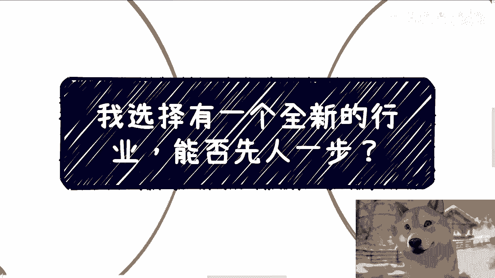

**附加说明**：如果你在职业规划、商业合作（涉及合同、股权、分红等）或副业发展中需要更接地气的建议，希望少走弯路，可以整理好个人背景与具体问题寻求进一步沟通。