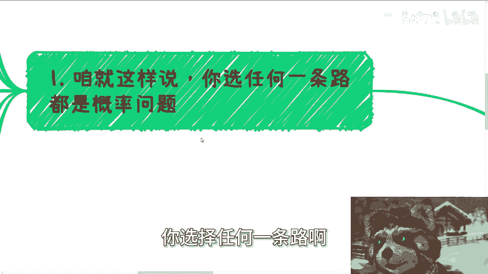
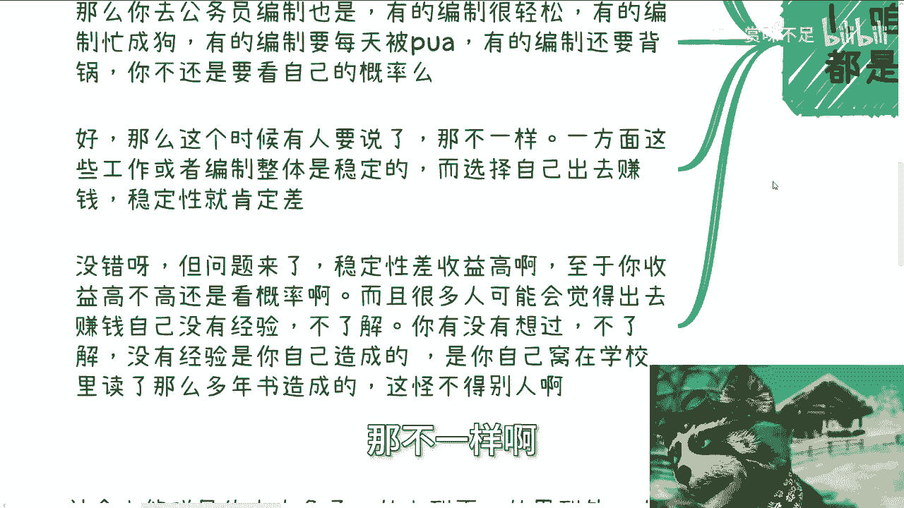
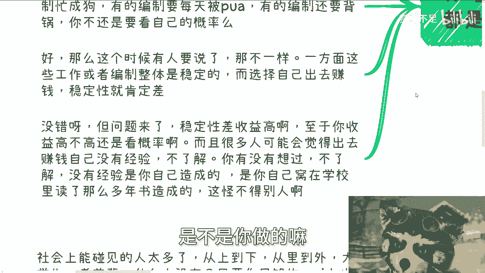
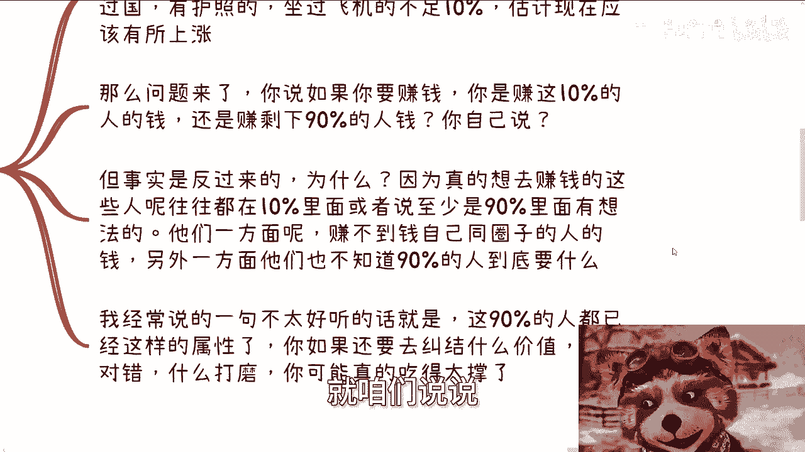
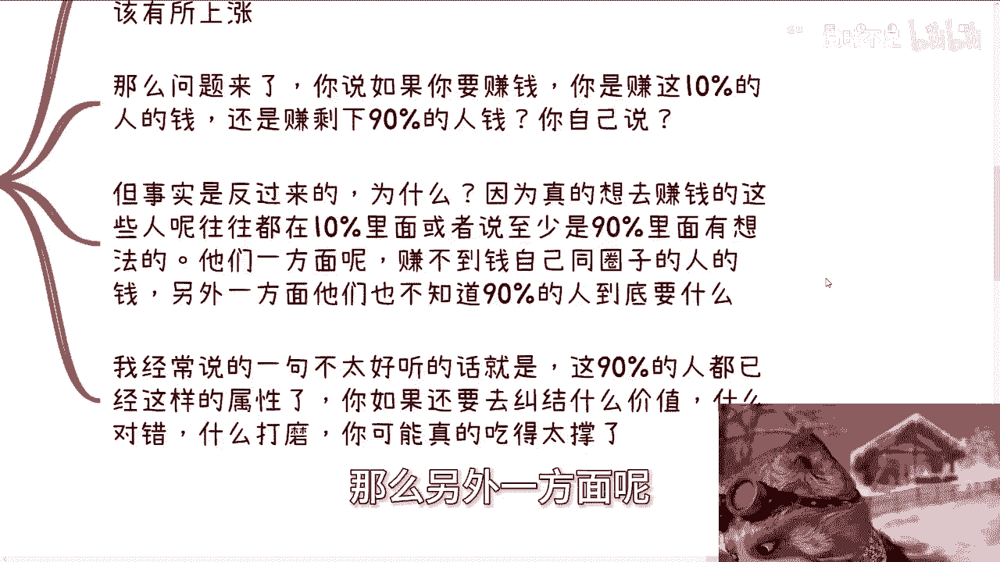
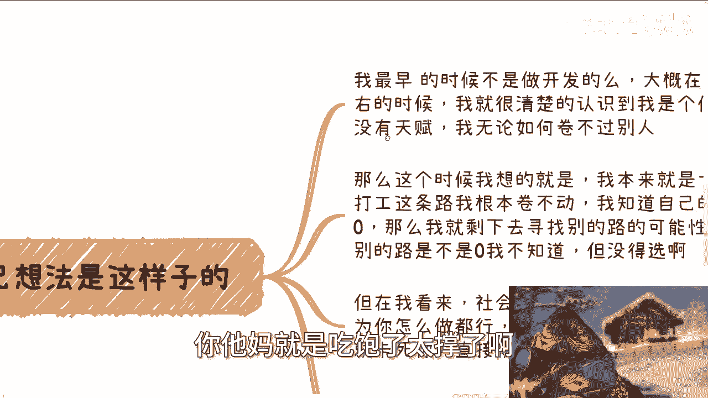
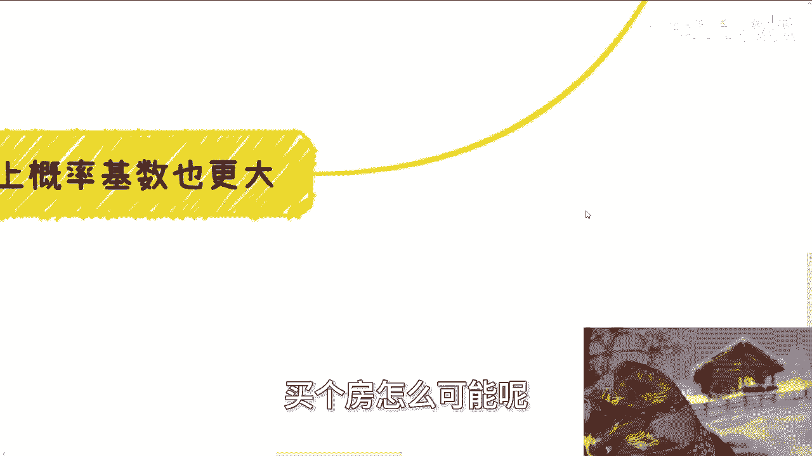

# 课程 P1：选择大基数池子以博取概率优势 🎲

## 概述

在本节课中，我们将探讨一个核心观点：人生中的许多选择本质上都是在博取概率。无论是求学、工作还是创业，都没有绝对的稳定，关键在于如何提高成功的概率。我们将重点分析为何要选择“大基数的池子”作为行动方向，并通过具体例子和逻辑推导，帮助初学者理解并应用这一思维。

---

## 主题阐述：一切皆概率

上一节我们概述了课程的核心思想，本节中我们来详细展开。

你做出的每一个重大选择，本质上都是在博取一个概率结果。选择攻读本科、硕士或博士学位，是为了博取找到更好工作的概率，但这并不能保证你一定获得好工作。

同时，考取教师编制或公务员编制，进入体系后也存在差异。并非所有编制岗位都相同，工作的持续时间、收入水平以及工作体验都有好坏之分，这同样是在博取概率。能否获得好的结果，与天时、地利、人和有关，并非单纯依靠个人努力。

正如一句歌词所言：“三分天注定，七分靠打拼”。进入编制体系后，有的岗位轻松，有的异常忙碌，有的充满职场压力，有的需要承担额外责任。这依然是在博取不同的概率。

许多人可能不深入思考，倾向于做出“一刀切”的简单判断。

---

## 反驳“稳定性”论点

上一节我们分析了选择的概率本质，本节中我们来看看关于“稳定性”的常见观点。

此时可能有人提出：体制内工作整体上更稳定，而选择自己出来赚钱，稳定性必然较差。这个观点本身没有错误。

但由此推导出的结论应该是：高风险往往对应着高收益。这取决于个人的追求和目标。

另一些人可能认为，外出创业缺乏经验和了解。需要思考的是，这种“不了解”和“没有经验”的状况，是否是个人过往选择的结果？无论是因为个人成长阶段、家庭环境还是社会观念的影响，最终做出选择并承担后果的是已经成为成年人的自己。

---

## 核心策略：选择大基数池子

理解了概率的本质和风险的属性后，我们进入本节课的核心：做事必须选择一个大基数的池子。

以下是选择大基数池子的逻辑分析：

根据国家2022年底的数据，中国居民人均年收入大约在2.8万至3.2万元人民币之间。另据一份可能已过时的数据显示，持有护照或乘坐过飞机的人口不足10%。以当时约13亿的人口基数计算，这个群体大约有1.3亿人，如今这个数字可能已有所增长。

那么，一个关键问题是：如果你要赚钱，你的目标是赚取这前10%人群的钱，还是剩下90%人群的钱？

从直觉上看，大部分人可能会选择赚取90%人群的钱，因为基数庞大。但事实往往相反。

现在许多人尝试做自媒体或其他项目，实际上并非在赚那90%人群的钱。真正有志于赚取这部分市场的人，往往自身就属于那10%的群体，或者是90%群体中前2%的佼佼者。

这些尝试者面临两个问题：一方面，他们很难赚到同圈层（相对聪明群体）的钱；另一方面，他们并不真正了解那90%大众的真实需求，这就是所谓的“不接地气”。

试想，当目标群体的属性（如上述收入水平、生活经历）已经非常明确时，如果你还纠结于“我提供什么价值”、“我的产品是否完美”、“我的方向是否正确”这类问题，或许是将简单问题复杂化了。

---

## 个人路径：在灵活社会中博概率

上一节我们讨论了市场选择，本节中我将结合自身经历，谈谈在灵活的社会中如何博取概率。

我职业生涯早期是一名开发者。在工作约一两年后，我清晰地认识到自己虽然会写代码，但并非天赋异禀，无法在技术赛道上“卷”赢那些顶尖人才。当时有些同龄人，接触计算机时间虽晚，却已在全球比赛中获奖。

我意识到，在传统的打工道路上，我的成功概率极低，近乎于零。因此，我不得不去寻找其他路径。当时我并不知道新路径的成功概率是多少，但我别无选择。

以现在的视角回顾，我仍然认为社会的灵活度远高于单一工作赛道。在社会上，只要不违法，你可以尝试各种方法，不会因为一纸学历或某个硬性门槛就被彻底否定。当然，其风险也高于打工，这是公认的。

很多人会用高风险来说服自己安于现状。但本质上，没有绝对的对错，只是选择不同。在外博概率，潜在收益也更大。若非如此，以我当年的条件和性格，不可能在毕业数年后于上海凑足首付购房。

---

## 社会基数更大，概率自己创造

我们继续深入探讨“大基数”的优势。既然人生前进常如蝴蝶效应，充满概率，那么社会能提供的人际接触面一定远大于单一校园或职场。

社会上从大学生到资深前辈，各类人群应有尽有。只要你愿意主动拓展（即使是内向者也可以通过练习提升社交能力），就能接触到更广泛的网络。

因此，社会上的概率是自己搏出来的。你每一天都是自由的，行动取决于你自己。偷懒，则成功概率小；执行力强、积极进取，则成功概率高。

我认为这种方式反而更适合普通背景的人。在当今社会环境下，“卷”学历和“卷”工作并非对所有人都公平可行。许多普通人在家庭教育和初始认知上就已落后，强行在单一赛道上竞争异常艰难。

有一种观点认为，“卷”是农村孩子改变命运的唯一方式。对此，我想说：第一，有些人可能本就愿意留在农村生活，这无可厚非；第二，即便要出来，在2024年的今天，途径也很多。读书考学、正常就业是一种方式，也可以将拼搏精神用于其他领域，例如借助发达的网络，尝试成为某个领域的KOL、参与MCN、或销售特定产品（如考研资料）等，这可能比单纯“卷”工作更有效。

因为需要明白一点：在工作上“卷”，即使成功，往往也只能获得一时一地的优势，或一个比当前薪资高10%-30%的岗位，难以形成可持续的积累。当今时代，人在一家公司能待多久？未来在社会上发展，终究要靠个人的关系与能力。你曾任职的ABC公司，未来并不会为你提供终生的保障。

所以，从一个普通人的角度思考，若要去博取概率，理应选择一个更大的“游泳池”。对于上班工作，应抱持平常心，不必执着于“拼命去卷”，否则可能陷入焦虑与抑郁，得不偿失。

---

## 总结

本节课中，我们一起学习了“选择大基数池子以博取概率优势”的核心思维。

我们首先明确了人生选择多是在博取概率，没有绝对的稳定。接着，我们分析了关于“稳定性”的争论，指出高风险常伴高收益。然后，我们深入探讨了为何要选择大基数市场，并以个人经历为例，说明了在灵活的社会中寻找机会的可能性。最后，我们强调了社会本身就是一个巨大的概率池，成功概率与个人行动力直接相关，这对于资源有限的普通人而言，可能是一条更现实的路径。

核心在于理解 **`成功概率 ≈ 个人努力 × 机会基数`** 的关系，并主动将自己置于机会基数更大的环境中去拼搏。

---
*附：线下活动通知*
*活动已定于6月16日下午1:30至6点，地点在青阳区省骨科医院站附近。活动主要目的是促进交流、结识人脉、组队探索机会，而非单向听讲。报名请私信。*
*另：欢迎就商业规划、股权、融资、合同等实际问题进行交流探讨。但期望咨询后必须立即赚到钱或 guaranteed 结果者，请另寻他处。*