# 所有事情都是博概率，那就要选一个大基数的池子 - P1 - 赏味不足 - BV1Dn4y1R7TJ

好大家好，今天这个主题有点长啊，我也没想清楚妈的这主题应该怎么写哦，就是反正我想表达的意思就是说呃，大家啊做所有的事情，你别管你们打工也好，出来赚钱也好，怎么样也好啊，就是你其实都是博博弈啊。

都是博概率啊，你不要觉得当中有什么稳定不稳定的，其实都是博概率啊，我会我后我后面会给你们展开的啊，那就是说你要选择一个大基数的池子，我跟你讲这个是最重点的啊，大基数的池子啊。

那那个首先啊那个活动已经定了，6月16号下午01：30到六点钟好吧，场地已经定了，在青阳区啊，然后省骨科医院站附近啊，然后活动的主要目的呢是为了让大家过来，相互能够认识更多的人，相互能够那个组队啊。

看看能不能搞些更多东西啊，不是主要来这个坐下来听主题的啊，坐下来听主题还没啥太大意思啊，那么第一啊我们先来说主题啊，就是咱就这么说，你选择任何一条路啊。

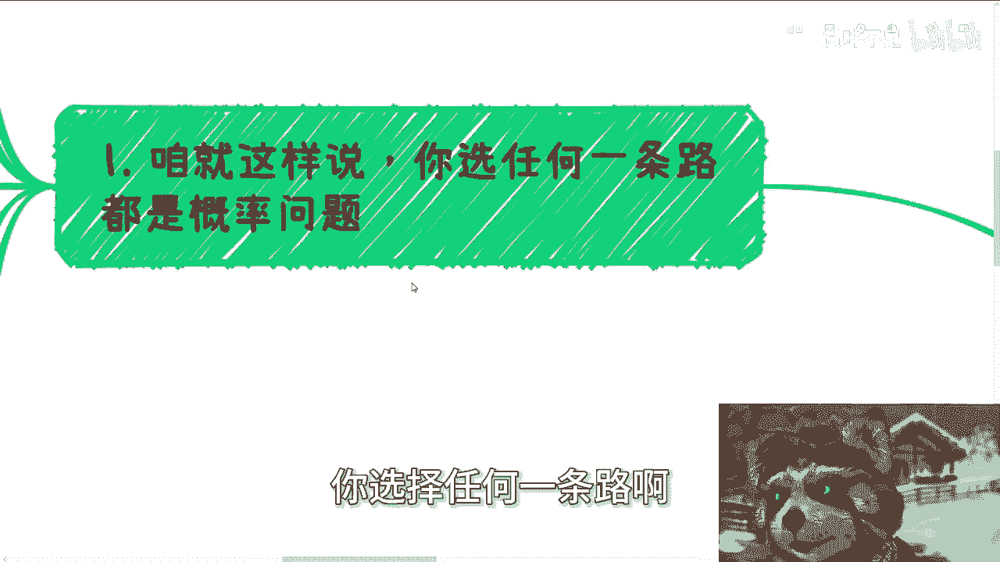

就是不概率的问题，为什么啊，你仔细想想看，你选择本硕博，那无非还是博一个概率去一个好一点的工作，因为你选择博本硕博，不能保证你一定去个好的工作对吧，这个大家都知道啊。

那么同时考一个好的教师编或者公务员编制，你进去了之后，这里面也会有区别对吧，不是所有的教师编，所有的公务员编都一样对吧好，那么这个工作能做多久，以及这个工作能给你带来多少钱，肯定也是有好坏的啊。

那么也是博概率对吧，那么你如果能有好的，那肯定也是跟天时地利人和有关啊，不是说单纯靠你的努力对吧，那就那首歌怎么唱来着的，四三分靠运气。

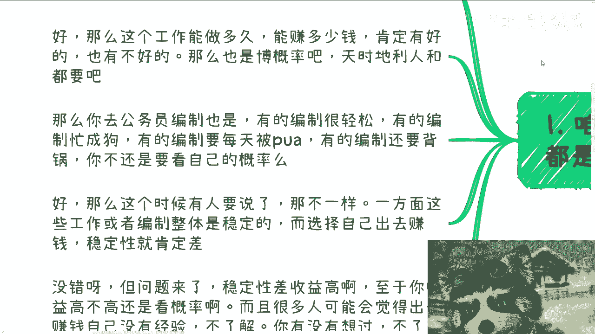

七分靠打拼啊，还是反过来的，哎呀不重要，反正就这个意思对吧，那么我就想着三分归元气了是吧哈哈，那么你去公务员编制也是有的，编制很轻松，有的编制忙成狗啊，有的编制要每天编PUA，有的编制还要背锅对吧。

你不还是博概率吗啊那当然很多人他不思考，他可能就觉得我他妈就要一刀切，对吧啊，好那也没没关系啊，好那么这个时候就有人说了，那不一样啊，他说一方面呢。

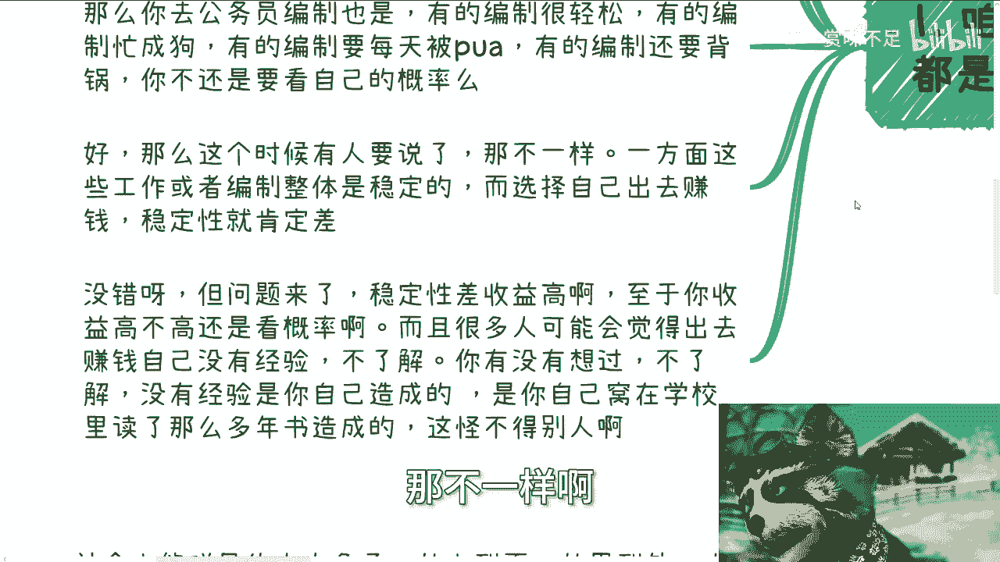

这些工作或者编制呢整体都很稳定，而选择自己出来赚钱，稳定性一定是肯定差的，没有错啊，这句话一点毛病都没有，但是问题是可问题是你反过来想啊，你这句话没有错的答案，得出的结果是什么，就是高风险高收益啊对吧。

就看你要什么呀对吧，而且很多人可能会觉得出去赚钱，自己没有经验啊，不了解，那我就问你，你有没有想过不了解没有经验，是你自己造成的对吧，虽然啊你以前未成年，你以前可能还小对吧，你说是因为你父母。

因为这个社会，因为这个国家，因为这个勾有东西PUA，你让你窝了，窝在学校读了这么多年对吧，造成的，那不管是因为谁PUA的，我就问嘛，是不是你做的吗对吧。

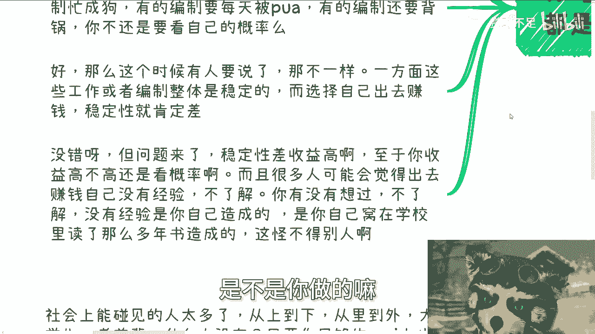

那只要是你做的，你现在是个成年人，你就别怪别人嘛，对不对啊，好然后第二我们说做事他就得选一个大池子，你比如说啊，按照国家2022年底给出来的数据，中国老百姓年收入在2万2到3000啊，3万啊。

2万8到3万2左右，然后根据我查过了啊，根据不可靠或者说过期的数据，出过国有护照，坐过飞机的不足10%啊，当时我估计应该人口在14，我估计13亿吧，当时那么13点多亿对吧，估计现在应该肯定有所上涨。

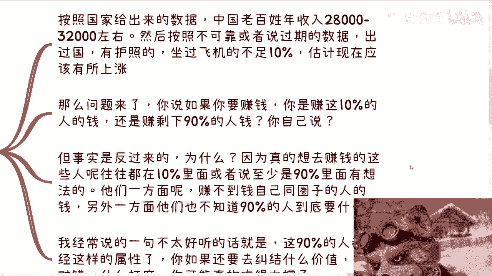

那么问题来了，我就这么问你们一个正常人，你说如果你要赚钱，你是赚这10%的人的钱，还是赚这剩下90%的人钱，你自己说对吧，我我就这么问啊，你不要就说我那句，就咱们说说说直白点啊。

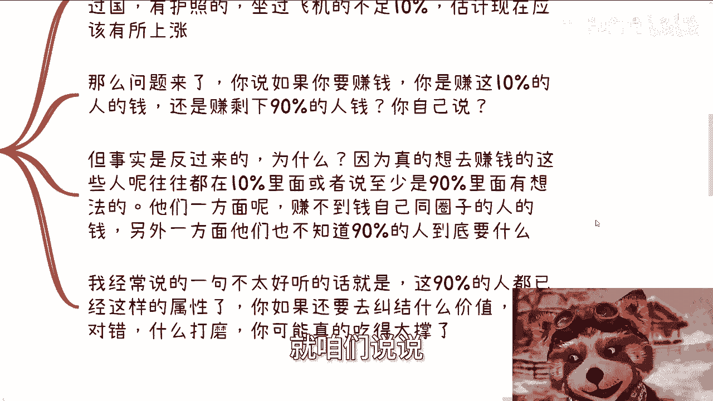

就你不要装逼啊，不要装逼，那那那英说了，最讨厌装逼的人了对吧，不要装逼啊，我敢说大部分的人，他肯定会说赚90%的钱，为什么，因为他基数大对吧，但事实是反过来的啊，事实是反过来的，你们再仔细想看。

你们现在要去做的什么自媒体啊，做的别的东西，其实你们赚的不是那90%的人钱，为什么嘛，因为真的想去赚这些钱的人啊，往往是在这10%的人里面，或者还说至少是在这90%里面的人，是遥遥领先。

或者说有想法的对吧，至少是在90%这个圈子里面，人也算是就是怎么说呢，就是前100%分之二的，那么你会发现这些人啊，一方面他赚不到自己同圈子的人的钱，为什么，因为大家都很聪明或者是相对聪明啊。

那么另外一方面呢。

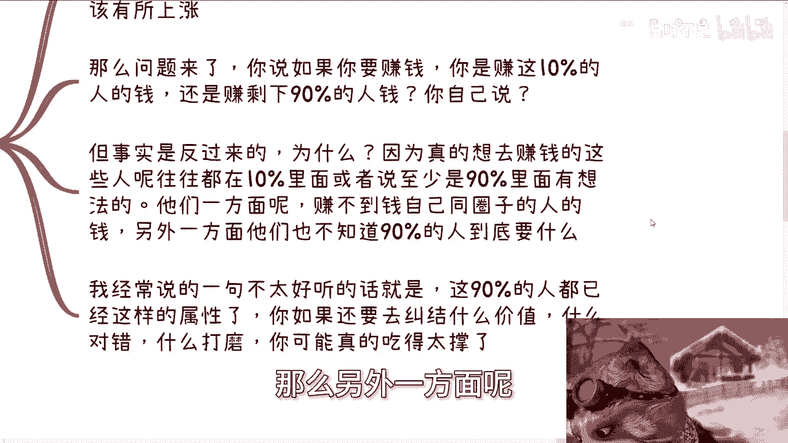

他们不知道90%的人到底要什么，这就是我说的不接地气，那么我经常说的一句话可能不太好听是什么呢，就是这90%的人都已经是这种属性了，什么属性哎你看看吧，2万8到3万2，因为这是平均嘛对吧。

然后按照不可靠数据对吧，他比如说没有出过国，没有护照，没有坐过飞机，就已经是这种属性了，你如果要去赚他们的钱，你还要来跟我纠结，或者跟你自己纠结什么，哎呀我提供什么价值，哎呀我这个东西做还对还是不对。

哎呀我要不要打磨我的产品，你觉得有必要吗，你自己扪心自问想想看有必要吗。

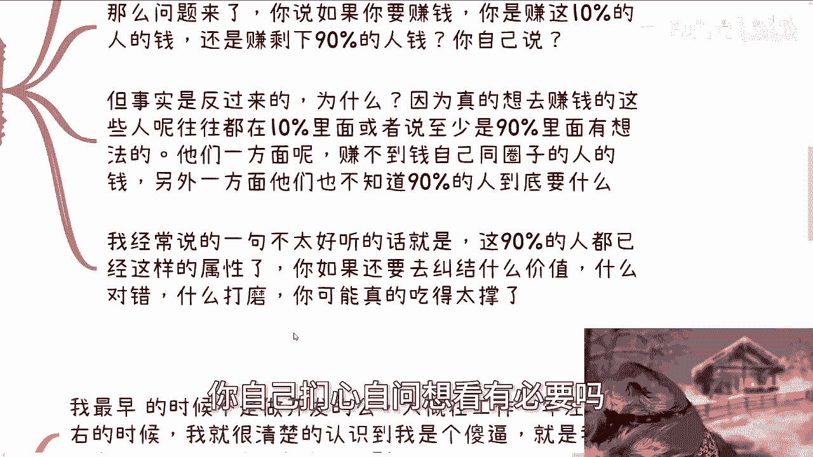

对吧，你妈你要我说就是吃饱太撑了啊。

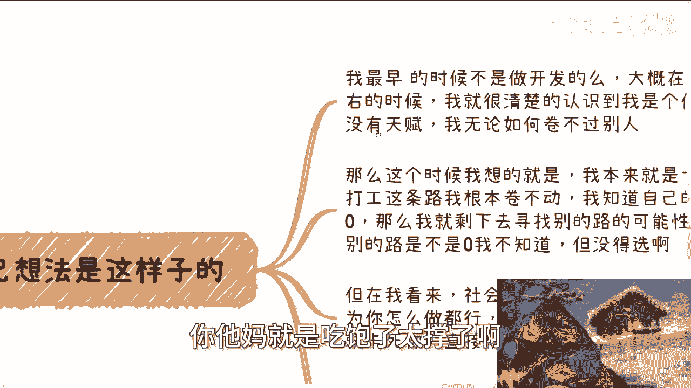

然后第三我跟你们讲，我以前啊我最早时候不是做开发吗，大概在工作一年到一年半左右，我跟你们讲啊，我因为不是也做活动嘛，我那个时候就就就很清楚的认识到，虽然我可能没接触过多少人啊。

但是我很清楚的认识到我是个，为什么，因为我没有天赋，就是你好像虽然我会写代码，但是我没有天赋呀，我我卷不过别人啊对吧，我可以告诉你们，当时有一些就是比我大两三岁的天赋极高对吧，人家什么天赋。

人家就是属于那种就是说高中对吧，才接触过计算机，大学才接触接触到计算机，然后就已经在全球的比赛里面得名次了，我他妈是什，我说那算个屁对吧，那么这个时候呢，我想就是说我本来就一无所有对吧。

我我本来就就也没钱对吧，也没什么东西，也没技能，那么在打工这条路，我肯定卷不动，我已经知道了，我他妈卷不动，你知道吗啊，然后我就知道自己的概率是零，那么我就剩下去寻找别的路，那至于你说你问我。

你说陈老师，你知你当时知不知道别的路是不是概率也是零，我不知道啊，这不是我怎么会知道呢，那没得选啊对吧，那在我看来，其实我现在啊就就马后炮啊，我们回过头来看啊，其实在我看来。

我还是认为社会的灵活度是远远高于工作的，因为你怎么做都行啊，你你只要不犯法对吧，不会因为说啊，就就不会因为说一个学历或者一个什么门槛，卡死你，直接就给你盖棺定论对吧，就就说好了，你棺材板盖好了。

不会的呀对吧，那当然你说风险嘛肯定也是高于打工的，我也认可的，那很多时候也拿很多人呢，也会拿这个东西来说事，来PUA自己来说服自己，其实我跟你讲，就如我以前说的，没有对错，你自己选唉你经常怎么选都行。

其实本质上外面就是博概率，收益也大啊，否则我也我，否则我跟你讲，我现在他妈的肯定住桥洞了。

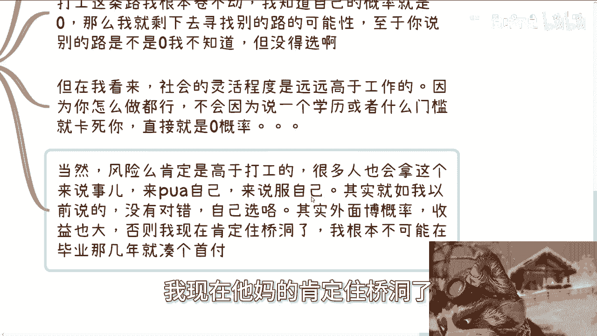

我怎么可能在当时毕业没几年时候，就在上海这边凑凑个首付，买个房。

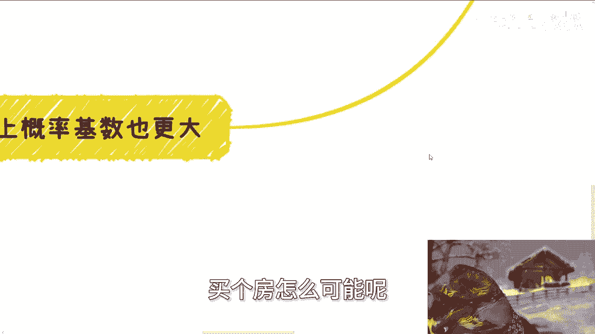

怎么可能呢，就以我当时这种性子他妈搞笑了，对不对啊，那么第四我们在社会上博概率的基数也更大。

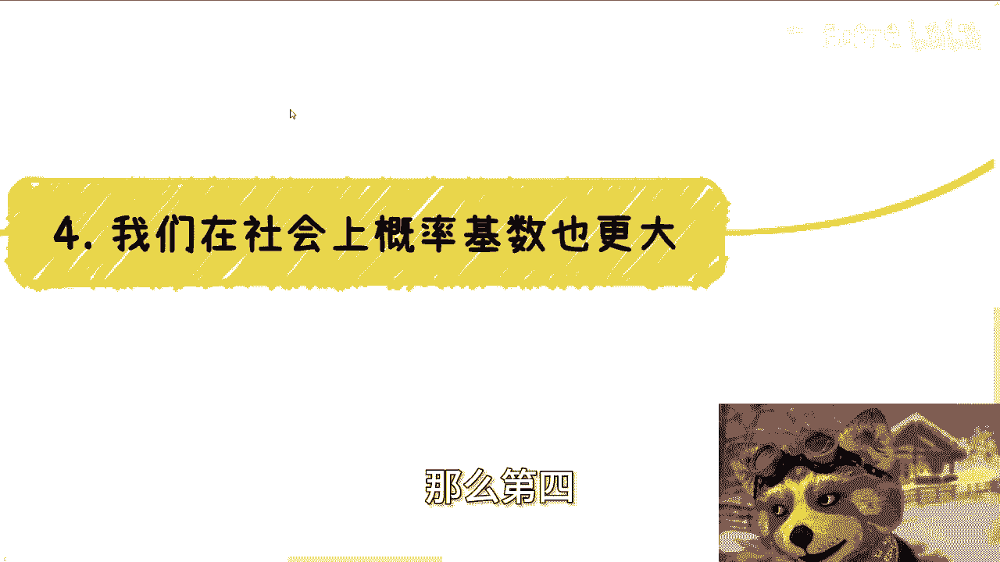

你仔细想想看，既然我们说我们人活着往前走，很多时候都是蝴蝶效应对吧，很多时候都是就博概率，那么社会上你能碰到的人一定是更多的对吧，这毫无疑问吧，啊，我我这这个没有人有有有有有有反对意见对吧，从上到下。

从里到外，大学生也好，老前辈也好，什么人没有啊对吧，只要你足够的E，我觉得爱人也是可以横溢的啊，这个取决于你们自己，我觉得这无所谓啊，不要觉得自己什么什么什么内向不内向，没没没关系的啊，所以我们才说啊。

社会上的概率是自己搏出来的，你一天比如说啊，比如说你你你现在是在博概率，你一天完全都是自由的，或者说你在社会上想干嘛都行，取决于你自己，你偷懒，那么概率就小，你要是这个这个这个很激进对吧，我执行力很强。

那概率就高，那无非就是这种情况嘛对吧，我个人就觉得这种方式反而更适合普通人，为什么呢，因为当下整个的这个社会情况，你你说卷学历卷工作，很多时候卷学历卷工作是我们能卷的吗。

啊反而你仔细去看看那些很多的普通人，他真的是在原点上，比如说家庭教育啊，在在在很多认知上面，他就落后于别人，怎么卷，你告诉我，你妈搞笑呢啊你怎么卷对吧，而且最好玩的是啊，之前还有一种论点就跟我说什么。

说卷呢是农村人这个小朋友啊出来唯一的方式，真的我我我我想了半天啊，我我我是这么个逻辑啊，我想说的是，第一有些人并不是真的想卷出来，他可能就想留在农村，怎么了呢，你非要PUA他出来干嘛呢，对不对。

首先这是第一点，第二点是他真的就算要出来，现在我说我就说2024年了，你真的要出来，你读个书，你考上个学校，你也能出来，不是一定要卷啊，不是一定要病态的去卷啊对吧，你可以正常，你说读个书对吧。

然后怎么样的呃，去去上个学或者是找个工作，然后你可以花心思花精力卷别的地方，你把你的那些那个拼搏的精神全部拿出来对吧，你说现在网络这么发达，你哪怕去卷出个自媒，也不叫自媒体吧，卷出个KOL对吧。

卷出个MCN的兼职卷，卷，卷出个，比如说哪怕我今天那个那个那个叫什么，就是另外那个视频里面说的什么，卖卖卖考研教材，卖什么东西，也比你单纯卷工作强啊，因为你要明白一点啊，在在什么在工作上卷。

你真的是只能卷，就是如果你卷的出来的话啊，在工作工作上卷，你可能真的也只能卷一时，你不可能卷一试对吧，同时呢你卷出来也只不过卷了一个新的岗位。

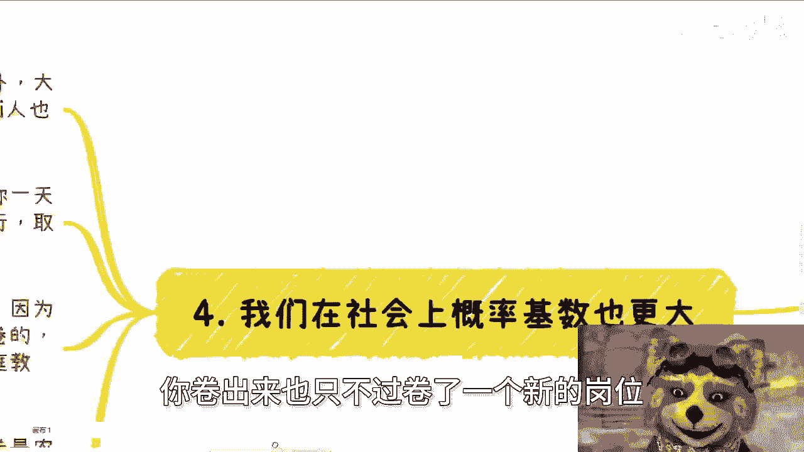

或者卷了一个所谓的更比你现在高，那么10%，20%，30%的一个package，你是没有积累的，其实因为现在这个时代跟以前不一样对吧，你说人在人活在世界上面，你在公司里面能待多久啊，你以后出来了。

在社会上不就不还是要靠关系，靠朋友吗，靠谁呀啊比如说你以前我们打个比方，你以前在ABC公司待过，怎么了，你以后后面ABC还给你擦屁股啊，还还给你提跟那个那个那个发养老金吗，还是怎么说，没有呀对吧。

所以你们仔细想看，我是觉得啊就是就是你从一个普通人来讲，你去搏概率，你肯定选择个大的游泳池去搏，对吧啊，工作上班，这就是一个常态，就平常心啊，平常心不要去想着说我我就得去卷啊，拼了命去卷啊，卷不卷不动。

我不开心，我还抑郁呢，何必呢，对吧啊行，反正就这个意思啊，那个成都好吧，报名的继续报，然后你们可以私信我报名嗯，然后剩下的话就直接规划商业规划啊，股权啊，融资啊，分红啊，合同啊，哎我跟你们讲。

最近有些小伙伴啊给出来问题真的很好，就非常实际的，你知道吗，什么什么股权怎么分对吧，合同怎么写，这种聊的就特别开心啊，然后就是说那个呃有什么牌对吧，或者没有什么牌的，你们希望跟我沟通对吧。

聊就是给自己定一些更贴近于这个社会，更贴近于地区的规划，那么我们可以聊聊啊，然后那个如果你们希望就是通过咨询啊，通过我这边直接就是伸手党啊，手把手的说啊，这个一定要呃咨询完了一定要赚到钱对吧。

咨询完了一定要有个结果，一定要怎么样子，那你们别来找我，你们找别人去啊。