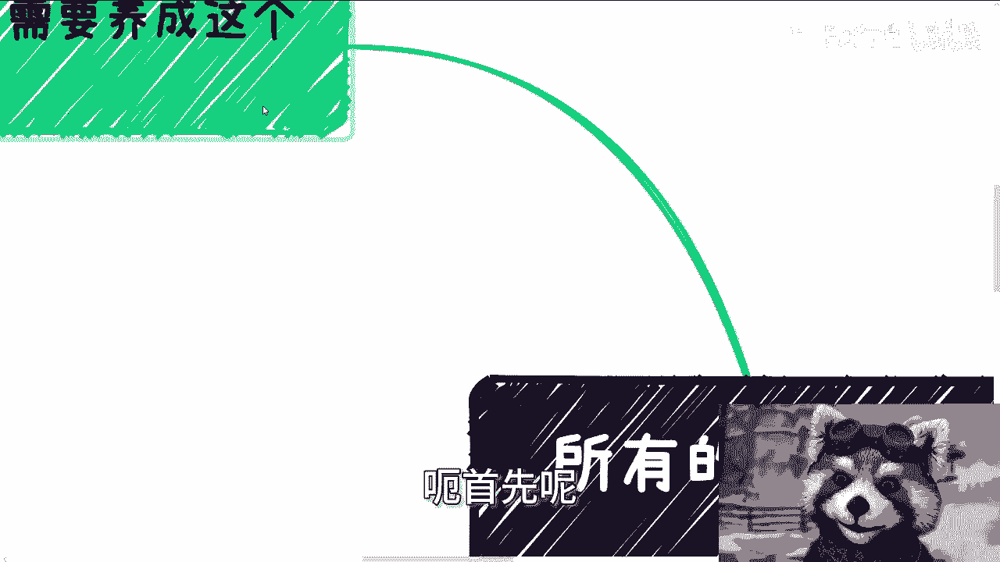
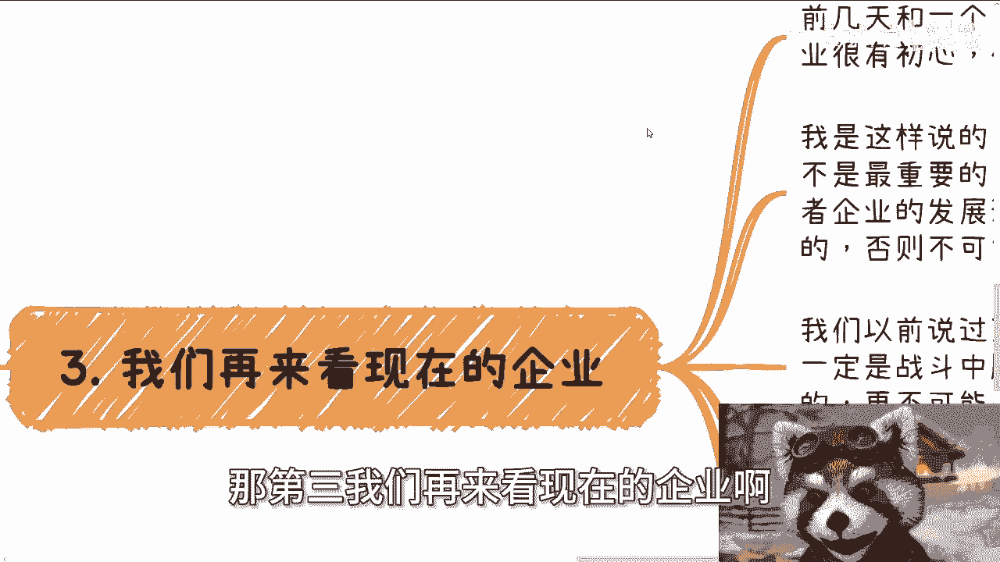
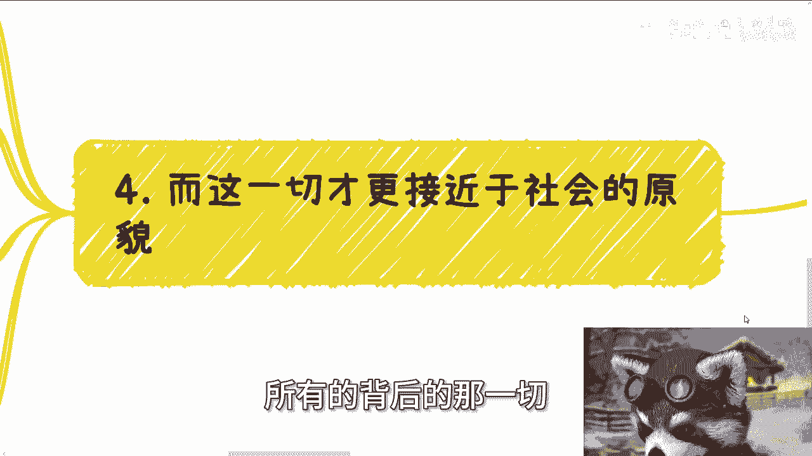
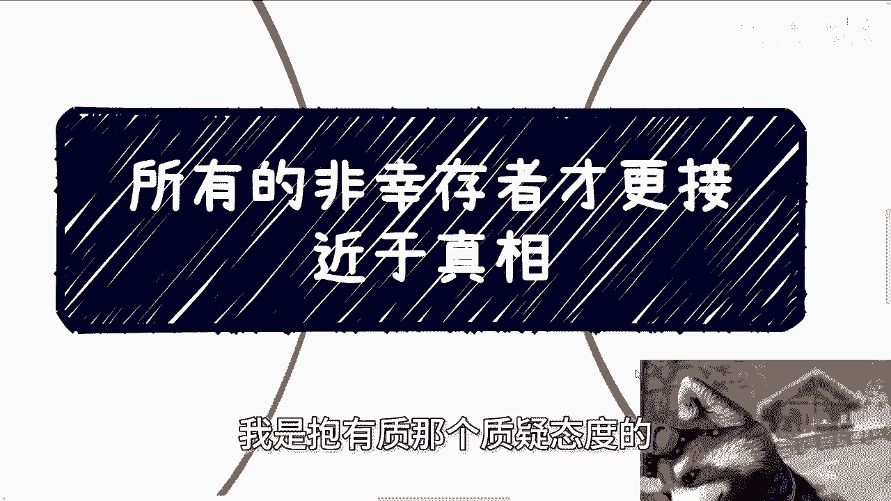

# 所有的非幸存者才更接近真相 - P1 - 赏味不足 - BV1bT421X7Pd

好大家好，那我们今天来讲这个主题呢，叫做所有的非幸存者才是更接近于真相的啊，可能有些小伙伴呢也很明白这个事情啊。

啊那就当听故事来听好吧，呃首先呢我们看问题呢。

我觉得需要养成这个习惯，就是说从宏观来讲啊，成功叫做幸存的幸存者偏差，媒体的报道也是幸存者偏差，幸存者本身也是幸存者偏差啊，也就是说他们的背面才是更接近于真相的啊，你比如说今天你跟别人聊，你和朋友聊。

你朋友圈看到了有人做跨境电商很赚钱，然后呢你自己可能就是说，如果来说你愿意去想一想，你可能理性的明白，他可能就是新生的偏差，但是大部分人他没有这个理性，你知道吗，他就很容易就说3分钟热度。

或者说被这个信息就干扰了，就觉得卧槽牛逼啊，能赚钱对吧，我他妈也要去赚对吧，那那那就完了啊，那么也就是说呃，那些失败者才是更接近于真相啊，也是更接近于我们的，比如说今天媒体报道了什么。

谁谁谁融资多少钱对吧，代表你觉得这代表所有创业者都能融资吗，不是吧对吧，就比如说你们今天看到网络上有这么多kl，这么多带货主播，这么多的企业，这么多的品牌，这么多可能风光的人。

或者说一些一些一些相关机构吧对吧，那你们想想看你们看到了什么，你们应该看到他们背后堆积如山的尸体，你们应该看到那些尸体的一些经验，然后这些人的遭遇才是更接近真相的，为什么，因为你也许看到的基数也很大。

比如说你说啊，那KO很多对吧，每个地区都有非常多的KOL啊，也有非常多的up主，也有非常多的带货主播，但是你仔细想想看，你相对中国整个基数来讲，这彩蛋占多少啊对吧，真正占基数大的是那些实体啊。

我们经历的成功可能很少，但我们经历的失败一定很多，我们的确我相信啊，所有的人都不愿意成为那些尸体，但是你们想想看，我们作为一个普通人，我们成为尸体的概率一定比成功高吧对吧。

那么也就是说我们为了避免成为实体，所以我们需要去学习他们的经验对吧，那很简单啊，哦你说我为了避免成为尸体，我不去学尸体的经验，我学习成功的经验有卵用啊，有卵用啊，是不是啊。

那就拿去年做跨境电商那个例子来讲啊。

我有个朋友去年做的很好啊，可以说非常好，之前呢他也教了我，关于就是说职业技能等级非常多的这个知识啊，也也算是我贵人之一吧，啊然后我有一天呢得知他做亚马逊独立站啊，然后呢性价比极高极高。

就人均产值差不多在一个月10万块钱，人均产值啊，我也很开心啊，我一个电话过去呢，我说我要么最近到无锡来讨教讨教对吧，那我总会放低姿态嘛对吧，人家牛逼啊啊然后他就跟我说呢，他说做呢是做的产值呢也的确很高。

流水呢流程呢也流水，流水呢也流程化了啊，但是呢就是他说我们自己人啊，他说我也告诉你，按照他的了解，他说能做出来的比例在多少呢，五3%啊，也就是差不多1%不到啊，然后他就问我。

他说他说你自己看你还要不要来啊，你还有没有必要对吧，那他跟我讲了呢，我啊对吧，那那那那懂得懂啊，自然我到现在也就没去过，对不对，那你想想看嘛，一样的嘛，对不对，但是你仔细想想。

看到今天为止还有多少人想做对吧，亚马逊也不是亚马逊独立账，就跨境电商这个东西，它是需要前期投入的，但是有多少人想做啊，有多少人想过他的比例嘛，对不对，就是我们就这么说，你今天花钱去做。

我不我不反对你花精力去做，也不反对。

但是你前期做过多少调研，做过多少，我们说这些尸体的经验你知道吗，你不知道你不知道，你就是莽撞，那有什么用呢。

对吧，那你要么你钱割的多的搁得慌，对不对啊，那第三我们再来看现在的企业啊。

前几天有小伙伴线下跟我聊，他说啊，现在企业哪些企业很有初心对吧，哪些企业家很很很很很有慈善心，巴拉巴拉啊，我是这样说的，我说我不是很关心他们现在是为了洗白，还是说他们真的有初心，这些东西不重要。

因为这些东西已经已经没有探究的必要了，但是重要的是什么，重要的是我说他们只要能活到现在，我不管是个人还是企业，他只要能活到现在，也就意味着在它的发展过程当中，他一定是从黑暗森林森林法则当中活下来的。

否则他不可能活到今天，就这么简单，什么意思，意思就是说，无论是谁，他只要能活下来，活下来，一定是战斗中获胜的那个人，而战斗中获胜的那个人，或者战斗中获胜的那若干个人呃，但无论是谁啊。

商业战斗当中是不存在什么良性的嗯，但那句话大家都知道叫做对敌人，敌人的心慈就是对自己的残忍，对不对，那么他就不可能心慈手软，那也就意味着他多多少少我不敢说完全啊，他多多少少都是带着血走过来的对吧。

那么我们看企业就一定要有这种态度，你不要今天去看什么企业牛逼呀对吧，怎么样怎么样，这都是幸存者偏差，这不是我们要去看的，我们不要去盲目的崇拜他，也不要盲目的去把别人想得太好。

因为这些人只要今天能映入你的眼帘，他能活到现在，他就不可能是个傻白甜，对不对，他本身这件事就不现实对吧，也就是说我不说这个人多恶，而是说他一定是见过这个社会的恶的对吧，那同样的背后。

那些企业家为什么失败，到底什么原因，是因为自己作死呢，还是说被甲方坑了呢，还是说是被投资人坑呢，还是说怎么样子，这些才是值得我们去探究的啊。

那么第四点，所有的背后的那一切才是更接近于社会原貌的。

因为你想想啊，因为这些失败者，他们可能经历了银行贷款，可能经历了高校合作，可能经历了政府政府合作，国家相关部门的合作，或者来说跟一些我们所谓的认为的大佬去合作，那么我们从他们身上才能看到。

就是说与这些东西，与这些比如说机关或者与这些人合作，如果合作了，为什么最后会失败，为什么最后没有赚到钱，这些原因才是更更接近于社会原本的样貌，因为他们跟我们是一类人对吧。

我们才有可能通过这些去避开很多坑，而不是说去盯着成功或者是活到现在，那些人，因为那些跟我们有一定的差距，当然我们也说过背后的商业逻辑其实都差不多，对不对，那么你们想想啊，背后的商业逻辑，再加草台班子。

这两者组合落地的时候，其实本质上大差不差的，你懂吗，你就像我今天跟一个咨询人是这么说的，你不能去当区长吗，不好意思，你能挡，你明白吗，没有谁不能当，你也可以当啊，我给你三个月，你也能熟练当，没问题的。

但你知道为什么你不能吗，是因为你没有这个资格，是因为你没有这个关系，你懂吗，是因为你不知道社会的运作逻辑，是你不知道整个的体系里面的运作逻辑，这是你的差异，但是你觉得这是你的差异吗。

你不觉得你觉得可能是你能力不够，那我就问你什么是能力呢，或者你觉得你学历不够，那你觉得学历够就有用吗，都不是，对不对，所以我们说成功是天时地利人和，那么到底问我们说天时地利人和代表着什么呢。

什么时候又是天时地利人和呢，我们需要通过更多的失败的信息，才能探究出来什么是天时地利人和，因为失败的人的基数足够大，他们的信息也足够多，你才能探究出来，你你说你今天去探究成成功的信息，你能探究出几个来。

而且我说不好听点，你能探究出几个真实的信息来对吧，而且另外一方面，同样的条件，同样的团队，同样的切入点，可能2010年做不行，到2020年做就行了，但很多时候你会发现是什么问题啊。

2021202021年的时候，你还有团队跟资金。

到了2020年，你已经被熬死了，为什么，因为很多时候做事情是看时机。

看情况的，看整个大局势的，不是说这个事情对或不对，他没有对和不对对吧，但是你为什么能明白这个时间点是你合适做的，那个时间点你不合适做，你就需要足够多的经验，足够多的那种，怎么说呢，案例才能让你明白。

那怎么会有足够多的案例，只有失败者，对不对，你我我我一开始今天这个视频的时候，我就说过，我说这个东西很多人明白，他不是不明白，因为道理很简单，但是你要让它融会贯通到你的日常的思维当中。

以及你看问题的视角当中，这就很难，我跟你讲这些，我也很奇怪这件事情，那当然可能就是说，这必须得要让你们，就是说体会到这个社会的恶，体会到就是说商业的恶，体会到资本家的恶，或者说你们吃过亏，你们才会明白。

但是这个道理我相信可能很多人一开始就懂，但是你们真正跟别人合作的时候，或者真正看别人的眼光的时候，态度的时候，你们会从这方面思考吗，我是抱怨那个质疑态度的好吧行。

那么这个内容就到这就这么着，反正你们可以再想想好吧，然后职业规划，商业规划啊，然后那个股权对吧，合同啊，融资啊，包括你们的商业计划书啊，包括你们就说啊手上有哪些牌，有哪些技能啊。

你们希望通过我的这个视角，能够更多的帮你们来做一些规划的啊，你们也可以咨询啊，就私信我，我们在做咨询啊。

