# 课程 P1：理解“幸存者偏差” 🎯

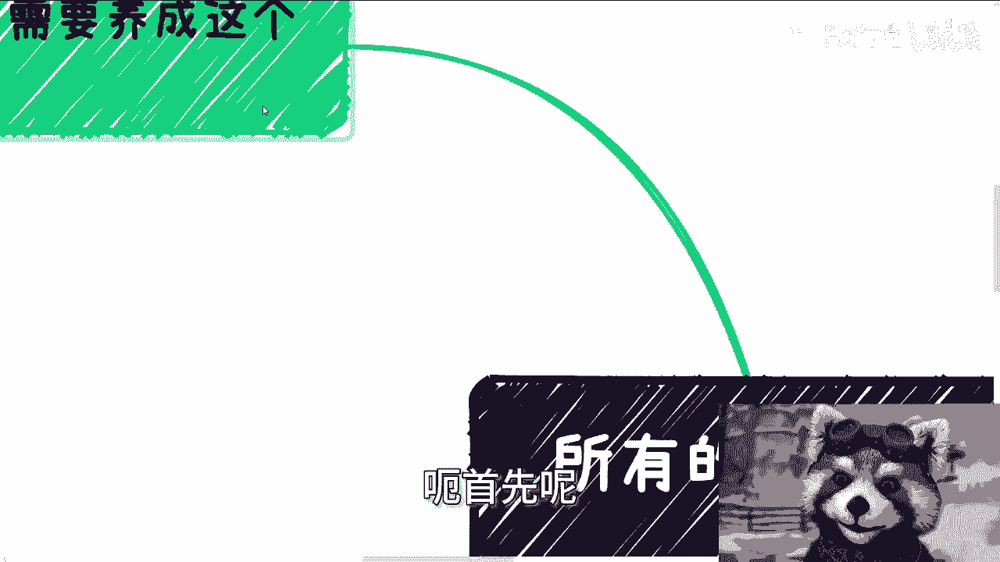

在本节课中，我们将要学习一个重要的思维模型——“幸存者偏差”。这个概念揭示了为什么我们看到的成功案例往往不能代表全部真相，而那些未被看见的失败者所蕴含的信息，反而更接近现实世界的运行规律。掌握这个视角，能帮助我们在做决策时更加理性和全面。

## 宏观视角：无处不在的“幸存者偏差” 🔍

上一节我们介绍了课程主题，本节中我们来看看“幸存者偏差”的普遍性。从宏观来看，成功本身就是一种“幸存者偏差”。媒体倾向于报道成功者，我们日常讨论的也多是成功案例，这导致我们看到的都是经过筛选的“幸存者”。他们的背面——即那些失败者——才更接近真相。

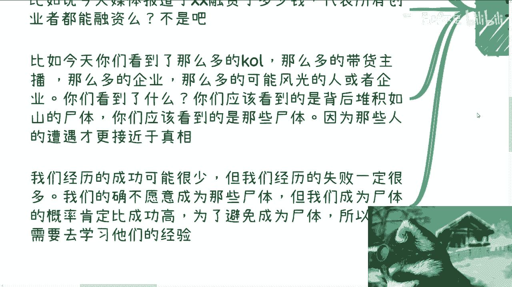

例如，当你在朋友圈看到有人做跨境电商赚了大钱，你可能会被吸引。理性上，你或许明白这只是个别成功案例，但感性上很容易被干扰，产生“我也能行”的冲动。实际上，那些没有发声的、失败的从业者才是大多数，他们的经历更能反映这个行业的真实情况。

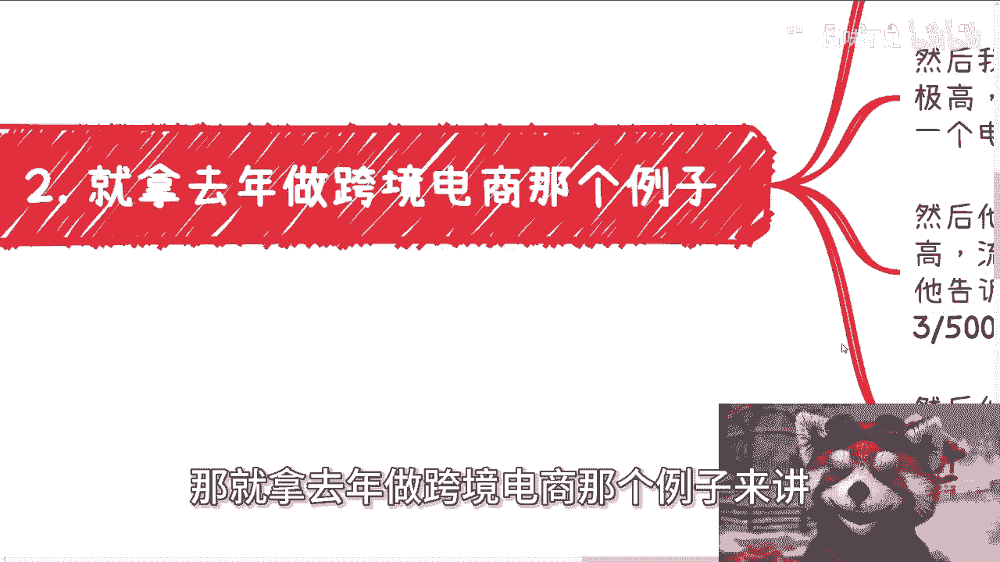

## 关注失败者：获取更接近真相的经验 💡

上一节我们提到成功案例具有误导性，本节中我们来看看为何要关注失败者。我们每个人都更可能经历失败而非成功。为了避免成为“堆积如山的尸体”中的一员，我们需要学习的恰恰是失败者的经验，而非盲目模仿成功者。

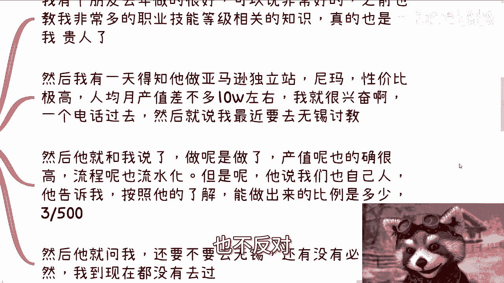

学习成功者的经验用处有限，因为他们的成功可能依赖于你无法复制的特定条件。相反，失败者的教训更具普遍性，能帮助我们避开常见的陷阱。

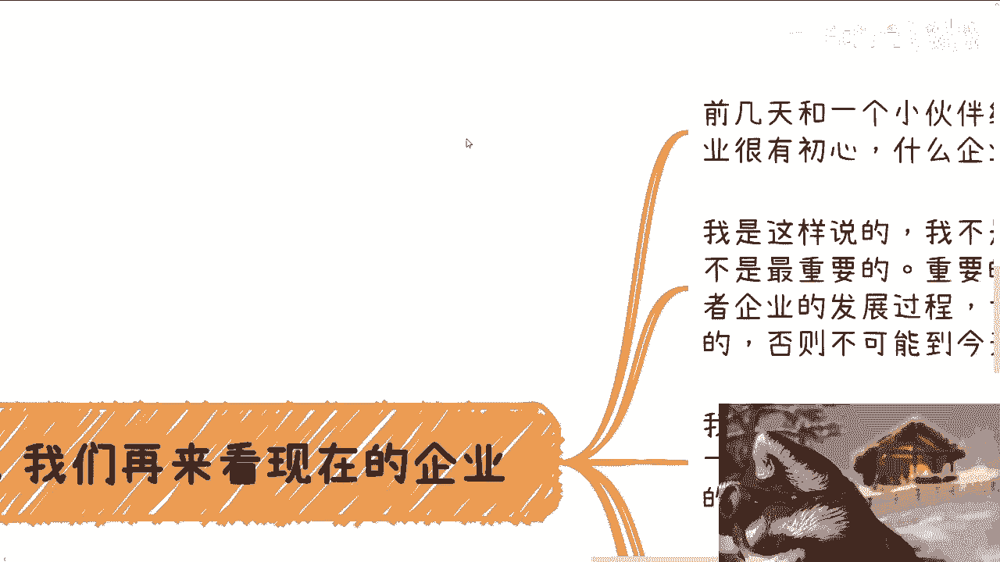

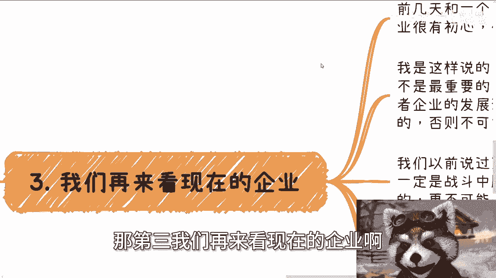

**核心公式**：
`有效决策 ≈ 了解成功路径 + **深入研究失败案例**`

例如，一位朋友在跨境电商领域取得了极高的人均产值。但当被问及时，他坦言成功率极低，**不足1%**。这个来自内部的失败率数据，远比外部的成功故事更有参考价值。然而，很多人依然只看到光鲜的表面，在没有充分调研失败风险的情况下就贸然投入。

## 审视成功者：理解其生存背后的逻辑 🏢

上一节我们讨论了向失败者学习，本节中我们来看看如何理性看待成功者。无论是个人还是企业，只要能存活至今，都意味着他们曾在某种形式的“黑暗森林”竞争中获胜。商业竞争本质上是残酷的，不存在纯粹的“傻白甜”。

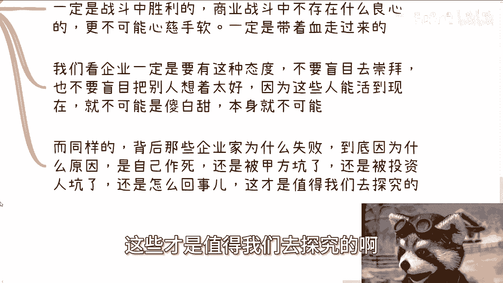

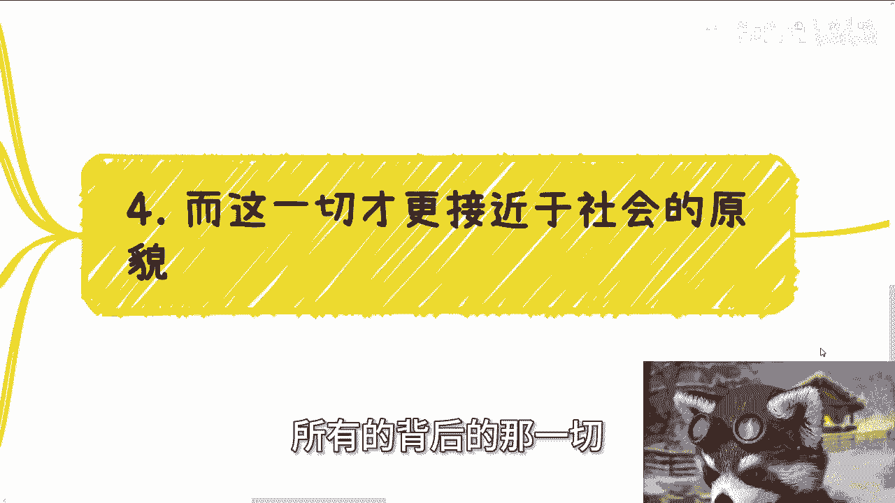

因此，我们无需盲目崇拜成功者，也不必将其想象得过于美好。重要的是探究：那些失败的企业家究竟遇到了什么问题？是战略失误、被合作伙伴所坑，还是其他原因？这些失败的原因，才是值得我们深入探究并引以为戒的。

## 探究社会原貌：从失败中洞察系统规则 🌐

上一节我们分析了成功者的生存逻辑，本节中我们来看看如何通过失败洞察社会。失败者往往与各类机构（如银行、高校、政府部门）或“大佬”有过合作。从他们失败的合作经历中，我们可以更清晰地看到与这些系统打交道的真实面貌和潜在风险。

这些失败者与我们更为相似，他们的教训能帮助我们避开许多坑。成功需要“天时、地利、人和”，但具体什么是合适的时机与条件？这需要通过分析大量**失败的案例**才能总结出规律。因为失败基数大，提供的信息更丰富、更多样。

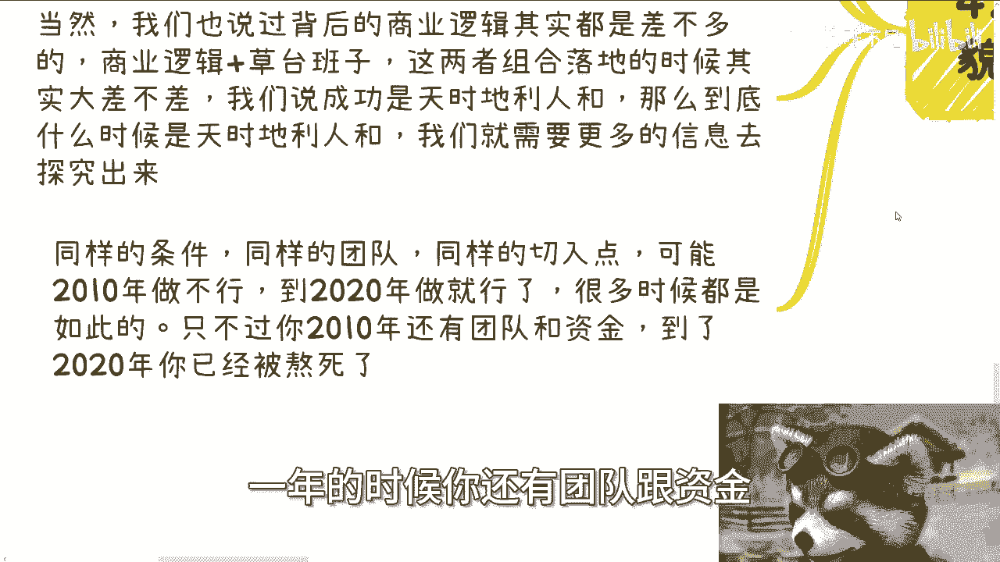

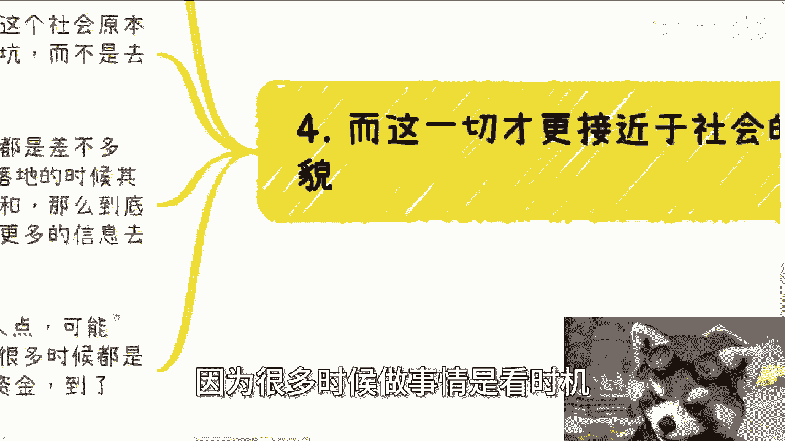

**核心洞察**：同样的项目，在2010年可能失败，到2020年却可能成功。关键往往在于**时机**与**大势**，而非项目本身绝对的对错。能否判断时机，取决于你是否拥有足够多的、来自失败案例的经验与认知。

将“关注非幸存者”的思维融入日常看问题的视角并不容易，这常常需要亲身经历一些挫折后才能深刻体会。但主动建立这种意识，是走向理性决策的第一步。

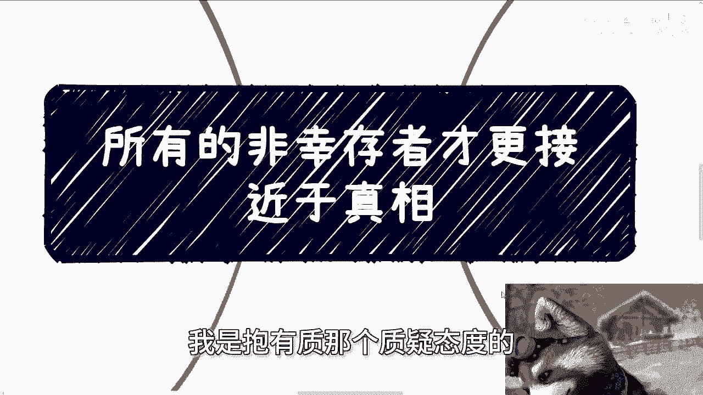

---

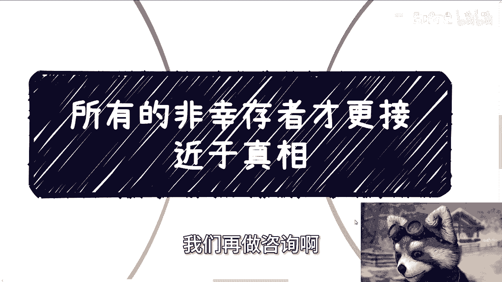

本节课中我们一起学习了“幸存者偏差”的概念及其应用。我们明白了，媒体和日常讨论中的成功案例只是冰山一角，大量失败的“非幸存者”才更接近真相。要做出明智决策，我们应**优先研究失败者的经验**，理性审视成功者的光环，并从失败案例中洞察社会与商业系统的真实运行规则。养成这个思维习惯，能帮助我们在复杂世界中更好地评估风险，避免盲目行动。