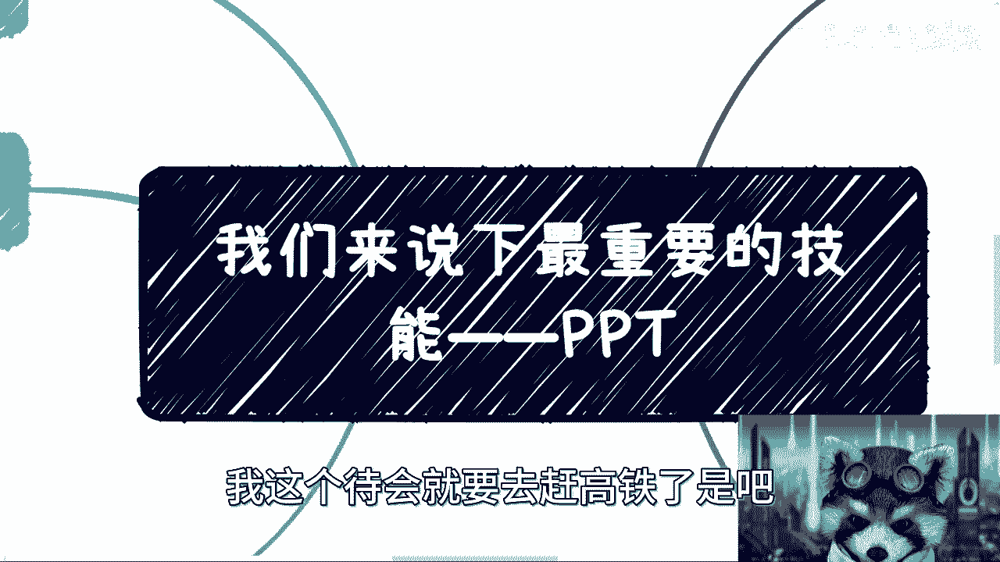
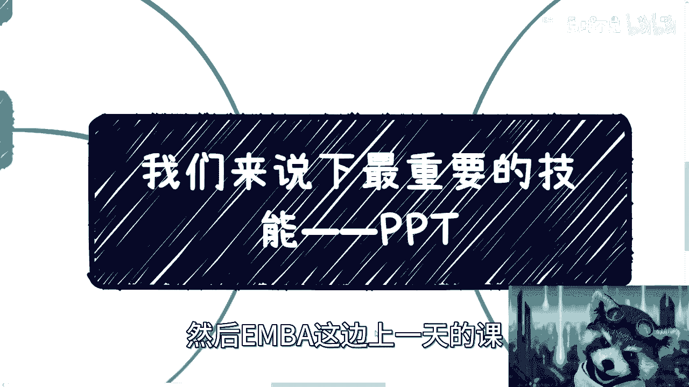
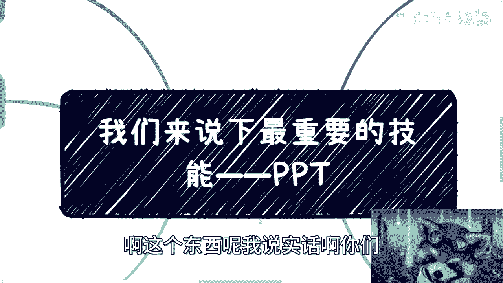
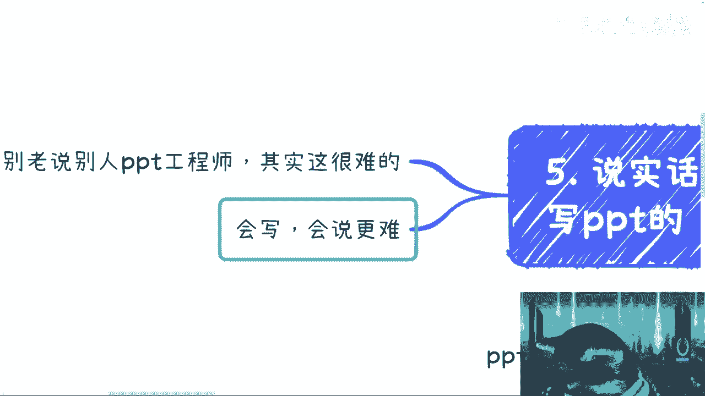
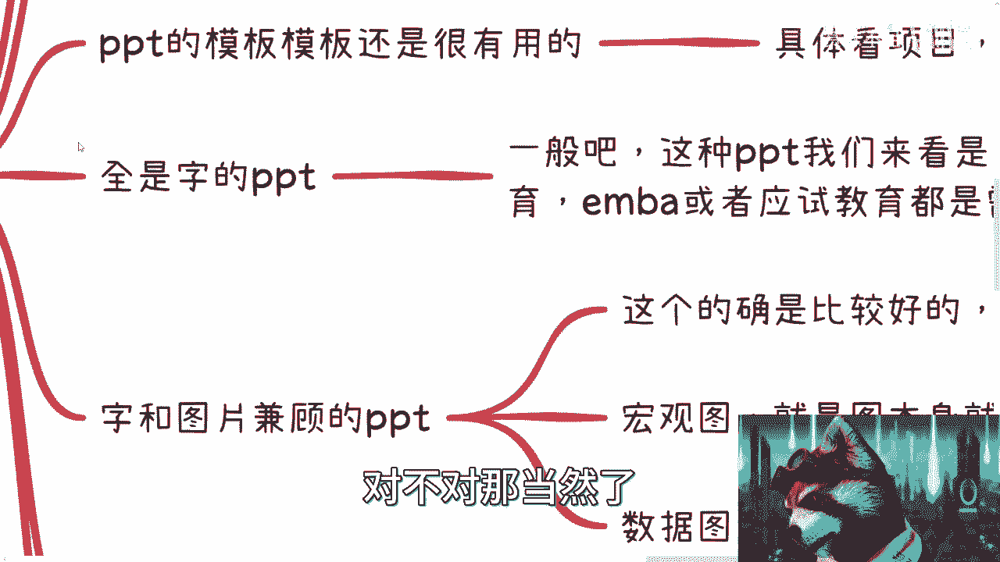
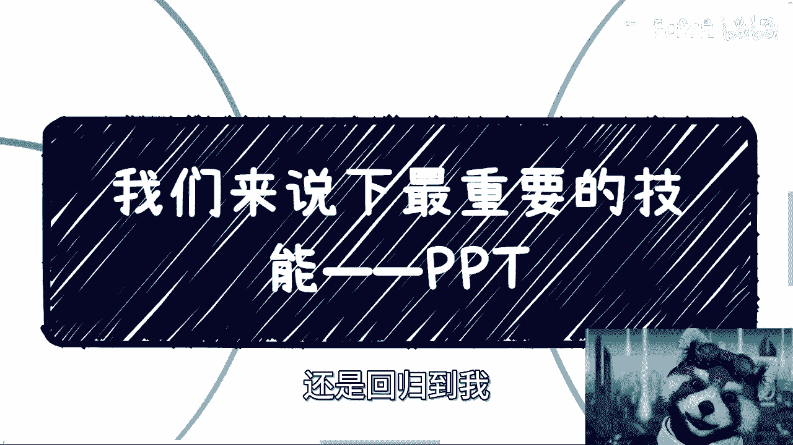
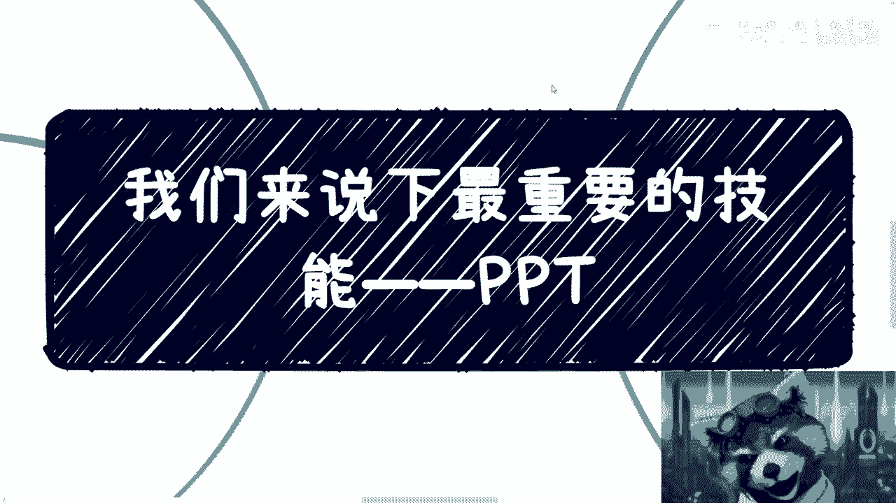
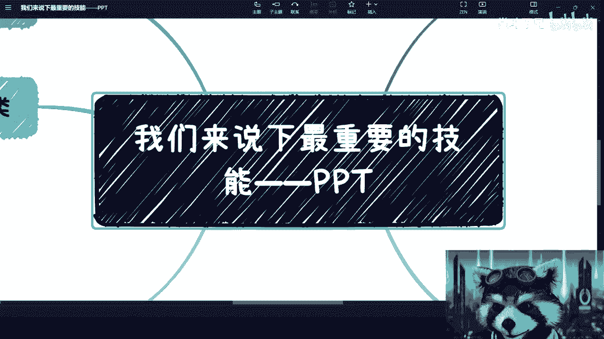

# 课程 P1：所有领域最重要的技能——PPT 📊

在本节课中，我们将要学习PPT（演示文稿）的编写与演讲技能。PPT不仅是职场和商业沟通中的必备工具，更是将想法、数据和计划清晰传达给他人的关键手段。掌握这项技能，能帮助你在述职、汇报、融资、教学等多种场景中脱颖而出。

---

## PPT的编写 📝

上一节我们概述了PPT的重要性，本节中我们来看看PPT编写的核心要点。编写PPT不仅仅是内容的堆砌，更需要考虑受众、场合和目的。

PPT的编写主要分为几个关键方面。

以下是PPT编写的几个核心考量点：

*   **场合与受众决定风格**：PPT的模板和视觉风格需根据具体项目和受众调整。例如，向政府领导汇报应使用稳重、传统的模板；向年轻学生群体分享则可选用更时尚、更具科技感的样式。
*   **内容形式的选择**：PPT内容不应全是文字，但需视情况而定。
    *   **图文结合是通用原则**：通常，图文并茂的PPT效果更好。图片可以是装饰性的宏观图，用于缓解视觉疲劳；也可以是数据图表（如趋势图、饼图），用于直观展示信息。
    *   **全文字PPT的特定场景**：在学术教育、EMBA、应试教育等场景中，全文字PPT是必要的，目的是方便听众课后复习和做笔记。
    *   **极简或纯主题式PPT**：有时PPT只需一个核心主题配一张大图，其余内容由演讲者口头阐述，这对演讲者要求较高。
*   **避免照本宣科**：通常情况下，照着PPT逐字朗读是大忌。但在高等教育、专业课程等长时间教学中，为了确保信息的准确性和体系的完整性，适当参照PPT讲解是合理且必要的。

---

## PPT的演讲与分享 🎤

了解了如何编写PPT后，本节我们来看看如何有效地演讲和分享PPT。演讲能力是将PPT内容转化为影响力的关键。

PPT的演讲与分享同样需要技巧，且需要长期练习积累。

以下是演讲与分享的几个关键点：

*   **时间把控能力**：需要根据给定的演讲时间（如30分钟、1小时），合理规划PPT页数和讲述节奏。公式可以概括为：`演讲节奏 = 总内容量 / 规定时间`。
*   **线上录播的挑战**：线上录播演讲难度很高，因为演讲者面对的是电脑而非真人，缺乏即时互动反馈。难点在于：
    1.  如何在没有观众反应的情况下保持讲述的连贯性和吸引力。
    2.  如何长时间（如1-2小时）保持专注，避免思路中断或忘记前后逻辑。
    3.  如何控制语速，避免过快或过慢，从而减少后期剪辑的工作量。
*   **线下分享的结合**：线下分享时，应结合PPT与白板书写。例如，代码演示可以是：`print(“结合白板讲解，可以更灵活地展开和互动”)`。提前询问场地是否有白板，可以决定PPT制作的详略程度。

---

## PPT的核心作用与价值 💎

上一节我们探讨了演讲技巧，本节中我们来深入理解PPT在不同场景下的核心作用与价值。PPT不仅是展示工具，更是战略沟通的载体。

PPT的作用远不止于信息呈现，它更深层次地体现了准备者的态度和能力。

以下是PPT的几个核心作用：

*   **高效展示核心价值**：在面向投资人、政府领导等时间有限的场合，PPT的目标是在短时间内（如关键的5分钟）“秀肌肉”，清晰展示自身优势、独特之处以及具体需求（如需要资金或资源）。核心是`高效传达价值主张`。
*   **辅助多元信息接收**：在一对多的分享场景中，听众的信息接收偏好不同（有人善听，有人善看）。PPT能通过图文并茂的形式，照顾不同受众的接收习惯，确保信息传达的基线效果。
*   **呈现复杂信息**：对于专业的报表、数据趋势、可视化结构等，用语言难以描述清楚，PPT可以直观呈现，降低理解门槛。
*   **体现重视程度与专业能力**：一份精心准备的PPT，反映了你对当前事项的重视程度和解决问题的诚意与能力。即使某些内容不擅长，通过外部资源（如购买模板美化服务）完成一份得体的PPT，也体现了你的投入和解决问题的思路。

---

## 总结与心态 🧠

本节课中我们一起学习了PPT编写与演讲的核心要点。我们了解到，PPT技能的关键在于**根据受众和场合灵活调整内容与形式**，没有放之四海而皆准的模板。

真正的难点不在于PPT软件操作，而在于**深度理解沟通场景**，并选择最有效的策略进行信息组织和传达。保持**空杯心态**，在深入了解不同领域PPT的差异之前，不轻易否定其价值。这项技能具有强大的变现潜力，是连接想法与现实、个人与机会的重要桥梁。

无论你是要进行述职晋升、项目融资，还是知识分享，精进你的PPT技能，都将为你带来巨大的优势。