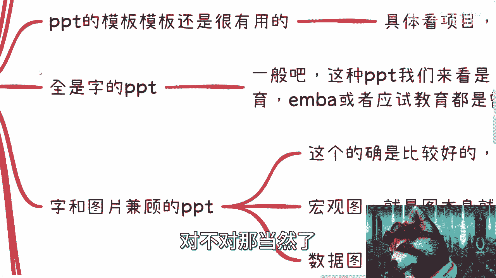
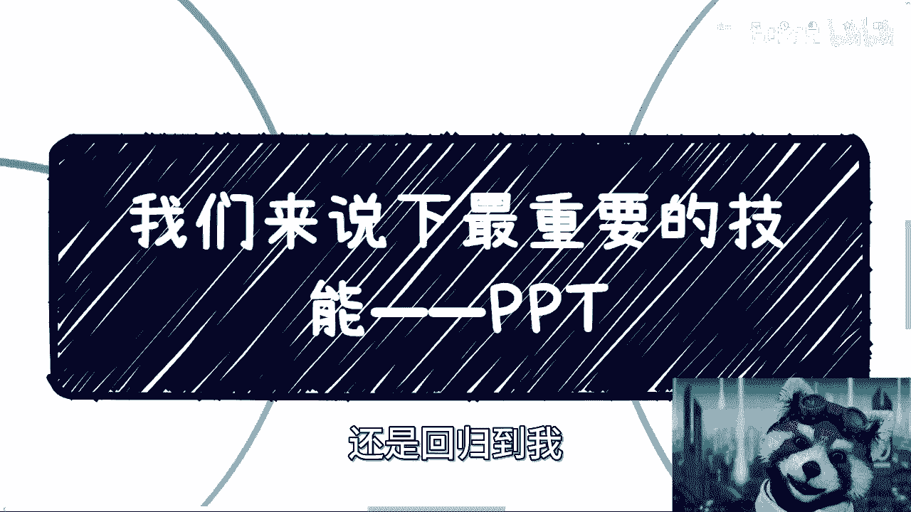
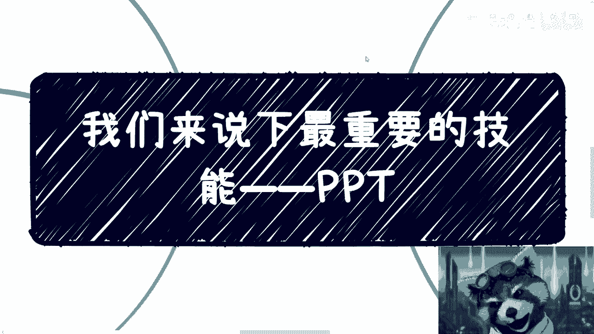

# 所有领域最重要的技能——PPT - P1 - 赏味不足 - BV1tL411B7jF

好啊大家礼拜六好啊，我这个待会就要去赶高铁了是吧。

呃明天在那个南大，然后e ba这边上一天的课。

嗯对那我来说一下最重要的技能啊，没有之一啊，ppt啊这个东西呢我说实话啊。

你们我先在这个地方先说第五个吧，就是说实话呢我就没见到几个会写ppt的啊，我更没见到几个会讲ppt的，你呢大家呢也别老说别人ppt工程师对吧，其实我跟你讲这个东西真的很难的，就是为什么。

因为写ppt本身你说有一定技巧吧，有的讲ppt本身也有一定技巧吧，也有的，但是为什么说这个东西很难呢，其实ppt本身并不是问题，难是难在你要知道什么场合说什么样的话，你要知道什么样的场合写什么样的东西。

也就是说真正的我会觉得啊，你做一个业务当中，你要会写ppt，会讲ppt更难，另外呢我也可以告诉你们，就是从商业角度来讲啊，最近咨询啊，包括跟别人聊天，我也跟大家都说。

就是说啊你会任何技能其实是不能变现对吧，那么你会ppt啊，我反而觉得你是能赚得到钱的，为什么呢，因为p p t是能够让你赚得到钱，就是p p t是有变现能力啊。

好那么我们来看啊。

首先ppt其实分成两类啊，第一第一类是ppt的编写对吧，第二类是ppt的演讲和分享啊，这个我们反正后面再来说，我把它细分了很多很多呃，先说ppt的编写啊，是这样子，首先呢你会发现啊。

我们一直在说ppt工程师是有道理的，因为的确任何地方你都需要ppt，你逃不掉的，你知道吗，你随便做什么啊，你比如说你说吕老师，我们今天合作一下对吧，怎么样子，因为p p t啊对吧，你说政府请我去对吧。

做一些什么东西没关系啊，p p t对吧，你你给他个解决方案嗯，好ppt对吧，就是任何东西第一步，反正p p t啊，然后呢你我跟你们说，你们也要明白，就是第一步，如果你们ppt都做不出来，我跟你说啊。

你商业是很难往下走的啊，真的我跟你们讲很难往下走的，那你比如说你比如说数值晋升啊，产品介绍啊，会议介绍啊，公开演讲啊，教育培训啊，项目申报啊，商务谈判啊，投资融资啊，很多很多很多对吧，那都要ppt啊。

那这个呢是没有办法的，我跟你们说啊，首先呃你们但凡就接触过，你们也会明白，就是哪怕你们在整个产业链里面，是一个很小的一个环节，你们都需要ppt啊，没有办法的，这个事我后来再跟你们解释啊。

呃ppt模板呢也是很有用的，你们可以在网上查到很多，就是免费收费的东西啊，呃但是呢具体要看项目，看受众什么意思呢，就是说你很简单嘛，我们举个例子啊，比如说你就是给这个省区省政府。

市政府区政府这个领导汇报的，那你肯定不能弄些花里胡哨的那个模板，你知道吗，就是花里胡哨的模板，就就你要这么想嘛，有些领导呢他是能接受的，有些领导呢就会觉得你很轻浮对吧，你试图用这种华丽的行为。

来掩盖自己的是吧，那你为了安全起见对吧，我们说为了求稳，那你肯定还是用一些稍微old fashion一点的东西嘛，对不对，那同样的你要你像我，我有时候会专门去这种学校对吧，给这种零零后零五后对。

所以其实真的我发现我受众是真的真的广啊，我跟你们讲啊，我最近在日常沟通的对吧，这个下到我想想啊，下呃下到15岁对吧，上到50岁，卧槽真牛逼对吧，就是你给学生去讲，那学生肯定是比较fashion的是吧。

那你肯定需要有更更更好玩的，更好看的对吧，更更这种精致化的叫做科技感的东西给到他们，那你肯定也需要一些很好的模板嘛对吧，那当然了，同样的你说你今天弄一个传统行业的项目对吧，那你这个p p t相对来讲。

就要有有传统行业的意思对吧，你弄一个科技项目，弄一个互联网的对吧，你就得有科技范儿对吧，就我跟你们讲，真的有很多人找我来看项目计划书，项目bp嘛对吧，要叫叫项目计划书对吧啊。

然后你比如说他们的bp就是的，就是一看这个创始人年纪都很小啊，一看吧，这个项目呢也都是互联网或者是相关的对吧，但是这个模板一看吧，就像那种六七十年代写出来的，就非常的违和，你知道吗。

哎呀就就很很不行很不行，那这个这个这个上面讲完了对吧，那第二个呢就是全是字的ppt，一般来讲这种p p t呢我们就正常而言啊，就是啊大忌啊，就是肯定不能全字的，但是呢你们但凡接触过一些东西。

你会发现呢有些地方是要的什么地方呢，你比如说学术教育啊对吧，e n b a啊，应试教育啊都是要的呃，我跟你们讲，为什么是因为是因为啊整个的这个这叫什么，就是ppt的这个教学过程，为什么他要全字呢。

就是为了让这些人啊，这些来看的人，他以后呢是能够去复习的对吧，就是说你但凡一张图啊，你说我们这个东西，比如说我这个要应试教育的，或者要大家未来要考试的，要去做笔记的，那回头别人还把你那个那个视频看一遍。

效率高呢，还是把你ppt看一遍效率高呢，那肯定是把ppt看一遍，效率高啊，对不对，那你就得把字码满啊，你知道吗，这没办法拿这个事情啊，那同样的呢就是说啊这个ppt还有一个大g呢。

就是叫做照p p t读啊，也不行的，但是啊又话的话就说到这里了，就是你的学术教育啊，高等教育啊，烟别啊应试教育啊，你还真就应该照着他读，为什么呢，因为你要知道啊，就是真正的这种高等教育啊。

专业教育他的一门课程是很长的，你比如说我最近在给那个中国值班几百所，三四百所高校吧，做这个课程对吧，你比如说太一门课对吧，40小时啊，40课时，60课时，你就想嘛对吧，那学生啊盯着你这门课啊。

数字经济对吧，区块链啊，40个课时，60课时啊，你这个这个你不跟他读这个东西讲，你怎么讲讲相声啊，我这再牛逼，我他妈讲60小时相声啊，那也不不科学吧，你说是吧，所以说呢有很多时候没办法哦。

这个是看各种情况对吧，那这第一个第二个呢就是自横图片的坚固啊，这个呢我觉得就是一般来讲比较好啊，但是你要看什么图，你比如说有的图呢是宏观的，也就是说本身这个图呢就是为了装装饰用的啊。

你比如说你像我现在录录你们这个视频对吧，你说为什么右下角有个小浣小熊猫呢，对不对，那不就是为了让大家不要太枯燥嘛，你说是吧，你说没有这个小熊猫对吧，很多人就看看这个图啊，看这个字啊，看两分钟后好睡着了。

你说是吧啊，那那那这个图就这个作用，你说是吧，那那这个数据图呢，还有一些呢就是数据对，数据也就是说来自于各种年报，因为这种图相对来讲就是用数据来说话，比如趋势图啊对吧，这个饼图啊对吧，各种图啊。

那这种图就是为了让别人能够一目了然的，能够知道啊，你比如说现在这个就业率啊，是这样子的，对你们能看到我鼠标吗吧，这样子的对吧，那那你这个图就能够比较直观，那我现在给你们讲，可能不见得这么直观，对不对。

那比如说除了主题以外呢，还有一种除了主题以外都是图对吧，我就喜欢做这种，就是就上面一个主题啊，这个什么什么区块链，数字经济，下面这张图啊，剩下的就我来干啊，我不管他，我就讲啊，干讲对吧，就我跟你们说吧。

我讲这个数字经济，讲区块链，你不给我ppt，反正我闭着眼睛，你就算让我喝到断片，我也可以讲六天啊，基本上最现在最长的记录我应该讲了八天吧，线下无所谓啊，反正都他妈刻进dna了。

都已经是那还有一种就没有ppt对吧，我跟你们说，要但凡不是领导要求，要不然但凡不是企业高校要求，我才不想做ppt，就是二作对吧，一群鸡是吧，那这个是二啊，三呢就是分享者。

分享者呢我觉得这个当中呢嗯也比较重要，而且这个东西不是一蹴而就的，它必须是那个积累的啊，你比如说啊对于时间这个把控对吧，你说你比如说让我分享半个小时，45分钟对吧，一个小时，那你得一开始有概念哦。

我大概写多少p p t对吧，我大概怎么个讲法，我大概是怎么个节奏对吧，我我能够去讲，你说是吧，那这是第一个，第二个呢我跟你们讲啊，这个难度就高了啊，线上直播还好说，因为线上直播呢对大部分来讲呢。

它是有这个互动对吧，你比如说我在线上直播，那下面有人骂啊，吕老师是吧啊，那我就很开心，你知道吧啊这个不知道什么抖m体质是吧啊，那那你不管怎么样，你如果有反馈嘛是吧，那你要是线上录播。

我跟你讲这个东西是真的很难啊，因为这种呢我也的确啊，就是从面上面我都很难找到这种人，就是就是像我这样的啊，就是录一个内容，比如说录直接录一个小时两个小时，然后呢甚至就是说啊一次性啊。

我们就说一次性都录一个小时，两个小时，录完之后呢，你能够不剪辑，直接成型的很少的啊，因为你会发现录播有什么难点啊，第一点是你并不知道应该怎么讲，因为你面对的不是人啊，你面对的是台电脑啊。

就像现在我跟你们讲是一样的对吧，为什么呢，现在这样子，是因为我已经是不知道多少年了对吧，这锻炼到现在对吧，我刚毕业的时候，我我连面试别人这个手都抖了对吧，然后讲不出一句话来，是不是就这没办法的。

都被逼无奈，我跟你们说啊，然后就是那个一个第二个呢，就是说线上呢你讲着讲着就很多人很容易啊，很多人容易就只比如说讲十分钟没问题，你让他但凡讲这一个小时的课，你会发现他讲到个什么20分钟啊。

他就在那边想诶呀，突然之间我这个怎么讲，接下来对吧，我前面讲了什么，哎我好像忘记了，你知道吧，就他们对着电脑讲的，很多人是一呢，他讲不了一个小时，你知道吗，他要么就过快，要么过慢。

那还有些人呢就讲着讲着自己断片了，你知道吧，就好像以前讲过这个东西，哎呀我好像忘了，你知道吧，就很很多这种，然后呢这种呢就是要么就是说自己浪费时间，要么呢就浪费剪辑的时间，反正就是效率不高哦。

所以你说你像我这种吧，就是所有课程，所有内容一次性过的很少很少很少啊，真的很少很少，这我不是自夸啊，你们真的，你们但凡这个做过或者以后接触到，你们就知道就很少很少啊，然后还有呢就是这个线上线下的分享。

线下分享呢我觉得就是白板啊对吧，ppt的结合，因为你看我一般啊，如果去给这种联通啊，移动啊，银行啊对吧，政府啊做线下分享啊，我一般都是会问他们，我说有白板吗对吧，你要没有白板啊。

那我可能ppt得做个两三百页是吧，要有白板，那我就做个二三十页就够了，剩下我就写白板是吧，这就简单的很啊，而且而且可能你们真的想象不到，我他妈去给政府企业做培训，我都属于那种可以一边做一边喝酒的啊。

叼也是叼嗯，那第四个呢就p p t的作用啊，p t作用呢是这样子的，首先啊啊比如你面对这个投资人啊啊，政府领导对吧，你时间是有限啊，很有可能啊，你可能真的啊，就比如说你能讲20分钟啊。

但是对方比较集中式的，想要听的也就那么五分钟对吧，那么ppt呢其实不用太长，你需要的目的是什么，秀肌肉啊，别在那边秀你的ppt能力，没什么好秀的对吧，你就秀，你就就你ppt要告诉对方是什么。

就是对方告诉对方你有多牛逼啊，你与别人有什么不同啊，你要什么对吧，你说我要钱要资源，讲清楚，五分钟就结束了，哎呀我跟你们讲，别逼逼那么多啊，别绕这么多圈子，真的就是真正的商业的上面逻辑，很多人没这么空。

听你逼逼，哪他妈这么多空啊，是不是你们我跟你们说，你们这种私信我，你们但凡私信过的也知道，你知道吗，就第一次你们跟我讲话对吧，我会很礼貌的回复的，如果两句话里面你们没有点到点子上面，我就不回复了。

没什么好回复，有什么好回复的，是不是我吃饱了撑的，我还得教你们怎么提问是吧，我我赚钱吗，我又不赚钱啊，那那那这第一个第二个就是说，如果是单纯的分享的p p t，其实是为了让受众更好的去了解。

你想表达的东西啊，因为你要明白，你当你一对多的时候，有的人对音频的接受能力是很强的，有的人对视觉文字接受能力是很强的，有的人对你的颜值接受能力是很强的，就你会发现你讲完一个小时啊。

有的人是对某一些你讲的东西唉，他记得很牢的对吧，有些人呢他是对你ppt上面某些图记得很牢的，有些人呢他对你讲的东西一概不知啊，他对你这个人哎，我觉得嗯刘老师这个颜值不行对吧，垃圾是吧。

哎有些人就这样子的啊，所以说呢就是说很多时候呢你你你当你一对多，尤其是你像我以前在大会上面，可能下面1500个人，我觉得我最多一次可能2000个人吧对吧，你得给他们讲，那你得你。

你不是说你得让每个人都满意，但是你得做到一个60分啊，这个就很考验能力了啊，那么还有另外一方面呢，就辅助啊，就是很多东西啊，比如说专业的报表啊，专业的走势啊，可视化的东西啊，用语言很难啊，就等等等。

用语言是很难描述的啊，当然啊我这个地方呢也要跟你们在在在什么，就是重点提一句啊，就是什么呢，就是就是这个地方啊，什么意思呢，就是说ppt这个东西呢，你说它重要吧，是重要的，你说它不重要吧，也不重要。

那重要在什么地方呢，就是我们打个比方，你今天述职晋升对吧，或者你去商业谈判，或者你比如说你要跟我合作合作，或者你去投融资对吧，就是你会让别人觉得，你对这件事情的重视程度是多少对吧，或者来说一是重视程度。

二是你的能力有多少，因为很简单嘛，很多事情你不懂没有关系，但是你要动脑子去想解决方案，比如说有些东西你不会没关系啊，淘宝买啊，你花点钱不行吗，哦难道你来跟我合作，你做个这数值净身啊，你你说你说你投融资。

花点钱，让把淘宝那边人给你上面美化一下都不行吗，哦我这这点价值我都没有嘛对吧，那别人会想的呀对吧，那说白了别人虽然不会说，但是大家都会觉得，你可能对我们这个东西不上心，那你既然不上心，我有什么好心的呢。

对不对啊，而且啊就是说啊就我们刚在这里面也说了，就它里面很多变量对吧，就比如比如说你p p t到底写的长还是短呢，对吧，你ppt到底都是字还是图呢，你b b d里面到底是一些干货，还是一些宏观的东西呢。

对吧你bb就比如说你今天弄学术，你到底是说啊，我里面到底是发展趋势多一点，还是这个这个数据或数理化公式多一点，对不对，还是推导过程多一点的，就真的很不一样啊，你们可以多去看看，比如说有的是年报。

有的是专门给工程师写的，有的专门给管理者写的，有的是专门写领导力的，有的是电商的，有的是啊传销的，有的是不同的各种领域的，你们多去看看，就都是不一样的逻辑，为什么，因为他们的受众是不一样的。

但是你会发现，如果只要受众很不一样，哪怕在某个受众面广受好评的ppt，你比如说你把一个广受技术人员好评的ppt，你拿给我，我看都不用看，我就可以他妈的一就就100样。

100种不带重复的喷法来喷他写的垃圾，为什么没有价值，有什么价值就没有价值，我因为对我来讲，赚钱就有价值，别的就没有，对不对啊，利益就是有价值，别的就没用，你要写这些东西有什么用啊，这个东西只有你会写。

那么世界上没人会写啊，我随便花点钱找个人不会写吗，对不对。

那当然了，就是说每个人看法不一样啊，但是呢就是说看大家到底要什么啊。

但是不管怎么样呢，就是我回到那个核心点，就是说啊还是回归到我。

我一直跟大家讲的，就是大家要保持一个空杯心态啊，别就是说对任何一件东西没有了解之前，你就去喷它不好对吧，就像你们说ppt一样的对吧，很多人说p p t不好啊，p p t有什么好做的来。

这些都是p p t工程师虚得很不好意思，真不虚啊，我觉得虚，你觉得虚只是因为你的label不够好吧啊，然后技术这个层面呢，我觉得你们可能大部分人跟我也没啥可比性，因为毕竟我写代码也写了78年了对吧。

我最高的话也是做架构对吧，然后再到现在哎呀。

反正就这么个情况吧，就是所谓虚所谓实，所谓好，所谓不好，我也都看过啊，但是不管怎么样，我得告诉你们这个技能很重要，好吧啊，有任何啊这个全职职业规划啊，或者有这种副业对吧，想赚钱的或者其他的这种。

如果大家内心焦虑或者困惑或者迷茫的问题啊，你们可以总结好自己的背景，总结好自己详细的信息，然后私信我，然后来走咨询好吧，行就这么着吧，哎呀我明天去今天晚上就去南大了。

