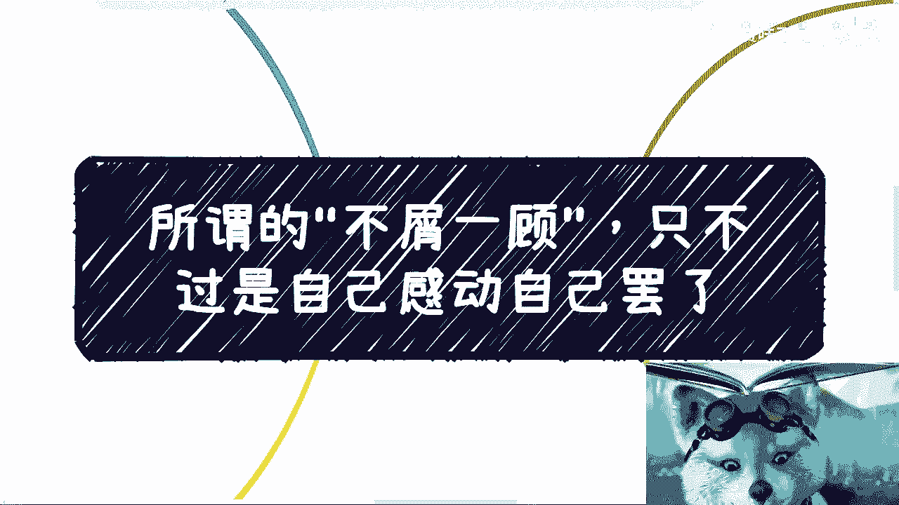
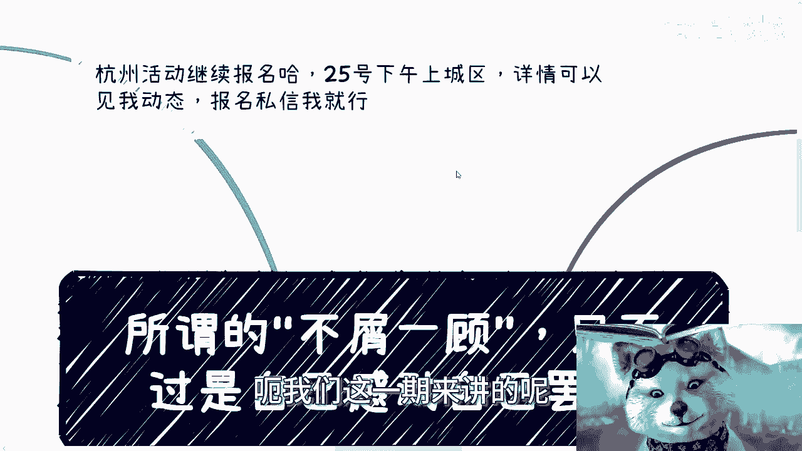
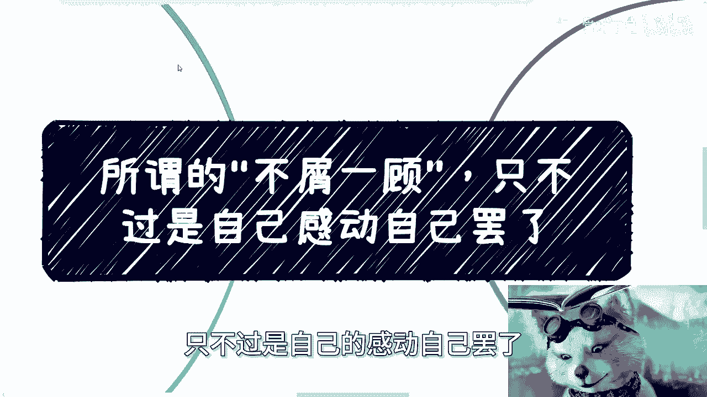
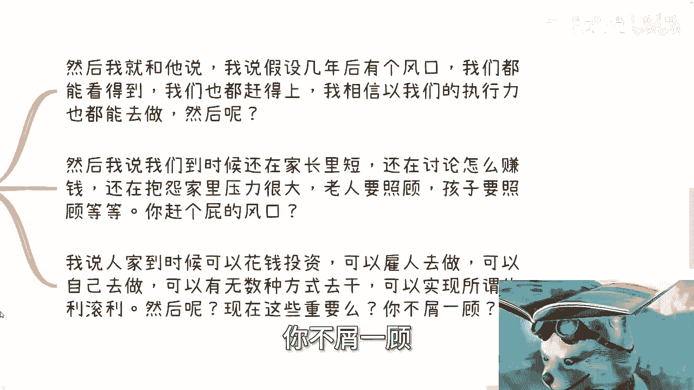
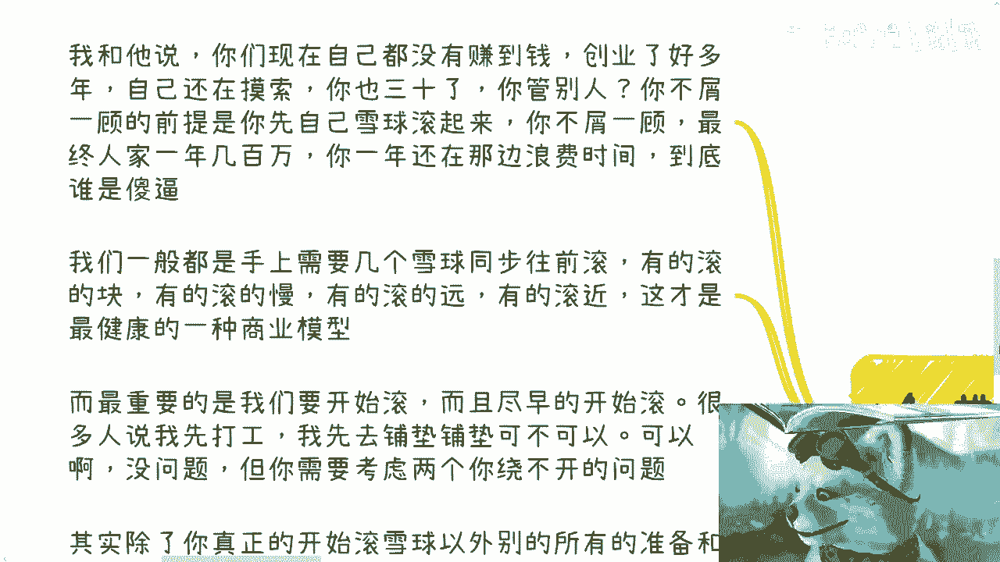
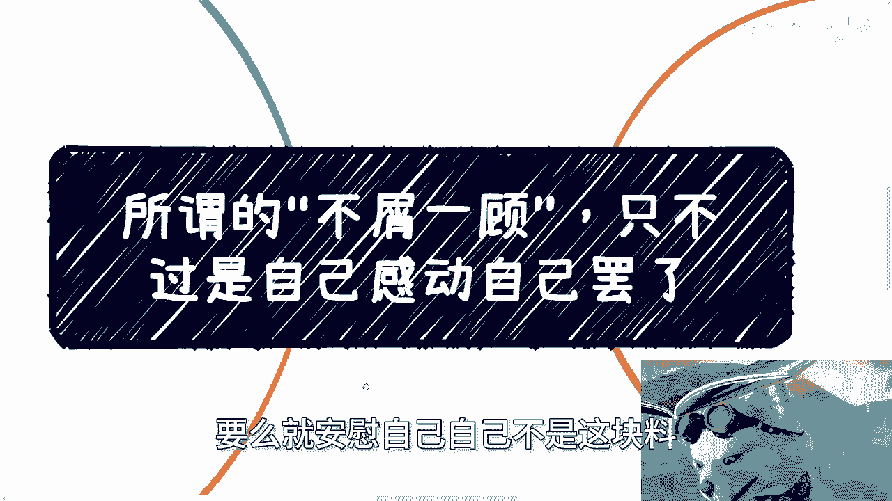
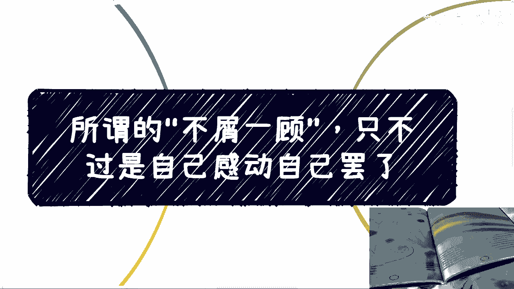

# 创业思维课 01：警惕“不屑一顾”的陷阱 🚫

在本节课中，我们将通过一个真实的创业对话案例，探讨一个常见的思维误区——“不屑一顾”。我们将分析这种心态如何阻碍个人成长与商业成功，并学习如何建立更务实、更有效的行动框架。

---

上一节我们提到了“不屑一顾”这个主题，本节中我们来看看这个观点是如何在一个具体的创业案例中体现的。

一位创业四五年的朋友来到上海，他从事的是实体文创业务。在讨论其商业模式时，我向他提出了一个核心问题：在当下的市场环境中，他的产品如何实现销售？

以下是两种可行的市场路径：
1.  **走高端联名路线**：例如与奢侈品牌（法拉利、TIFFANY）或知名IP合作。
2.  **借力渠道合作**：与大型商超、酒店或商业地产（如龙湖天街）洽谈合作，利用对方的流量和渠道。

然而，这位朋友两者均未采用。他的业务缺乏清晰的变现手段。这引出了第一个核心观点：**产品与服务本身并非关键，关键在于 `变现模式`**。没有有效的变现模式，再好的产品也难以创造持续收入。

---

在讨论了业务模式后，话题转向了更广阔的市场机会。我提到，在抖音、快手等平台，许多人通过抓住下沉市场的热点和焦虑，即使产品门槛不高，也能凭借强大的执行力获得可观收益。

当我建议朋友可以关注这些机会时，他转述了其合伙人的态度：对此类行为“很不屑一顾”。这引出了本节课的核心批判。

我当即指出这种“不屑一顾”的心态毫无意义。我们都不是世界的中心，个人的“屑”与“不屑”对市场毫无影响。对于一位三十四五岁、上有老下有小的创业者而言，首要目标是 **`生存`** 和 **`积累抗风险能力`**。

我们做了一个思想实验：假设三五年后出现一个风口，我们都能看见并参与。但如果届时我们依然没有完成原始积累，结果会怎样？我们可能依然坐在原地抱怨生活压力，讨论如何赚钱，而那时，就该轮到别人对我们“不屑一顾”了。

真正的“利滚利”（`复利效应`）意味着，当机会出现时，你拥有多种方式去把握（如自有资金投资、组建团队等），而不是空有想法却无资本。因此，**在拥有“不屑一顾”的资格前，必须先让自己的雪球滚动起来**。

---

上一节我们批判了空泛的“不屑一顾”，本节我们来探讨什么是更健康的行动逻辑。

核心在于：**世界是发展的，应尽可能快地完成 `从0到1` 的学习与积累**。这个“1”代表你第一个真正跑通的商业模型或获得的初始资本。只有先完成这一步，你才有资格去选择做或不做某事。

一个健康的商业模型，通常不是单一业务。以下是两个关键的行动原则：

1.  **多线程滚动雪球**：手上应同时推动几个不同的商业项目（雪球）。有的滚得快，有的滚得慢，有的方向远，有的方向近。这构成了一个抗风险的投资组合。
2.  **尽早开始行动**：很多人陷入“永远准备，永不开始”的陷阱。就像学跳水，如果永远在岸上摆姿势，却从不跳入水中，就永远学不会。除了真正开始“滚雪球”，其他所有的“准备”本质上都可能是在原地踏步。

此外，你必须考虑两个无法回避的问题：
*   社会在变化，你的年龄在增长，未来的烦恼只会更多。
*   拖延的最终结果往往是妥协，并自我安慰“心有余而力不足”或“我不是这块料”。

---

每个人一生中总会遇到风口和机会。能否把握，取决于自己。空想和准备永远无法替代实践。

以我自身为例，毕业两年左右我开始涉足政企培训和咨询。当时若问自己“懂不懂”、“能不能成”，答案都是否定的。但如果因为“感觉不行”而永远不去尝试，几年后我什么也得不到，只会成为一个后悔的旁观者。

**只有跳进“浑水”，亲身实践，才能知道水有多深，路该怎么走。** 这与和“厉害的人”打交道的道理相通。所谓“厉害”，往往只是信息差和经历不同，并无本质区别。在年轻或当下阶段，应只关心两件事：`能否赚钱` 和 `能否积累`。

这里没有“清高”的位置。你可以选择清高，但前提是 **`先赚到钱，获得立足之本`**。如果赚不到钱，又不愿尝试各种可能的方式，那么困境将难以改变。

---

本节课中我们一起学习了“不屑一顾”心态的危害。我们认识到：
1.  在创业和成长中，**有效的 `变现模式` 比产品或服务本身更重要**。
2.  **无资本的“不屑一顾”是自我感动**，在完成原始积累（`从0到1`）之前，这种心态有害无益。
3.  应采取 **`多雪球`** 策略，并**尽早开始实践**，避免陷入“永远准备”的陷阱。
4.  核心是关注 **`生存`**、**`积累`** 和 **`执行`**，减少无谓的情绪评判，聚焦于如何让雪球滚动起来。

记住，机会永远存在，但只属于那些敢于跳下水、开始滚动第一个雪球的人。