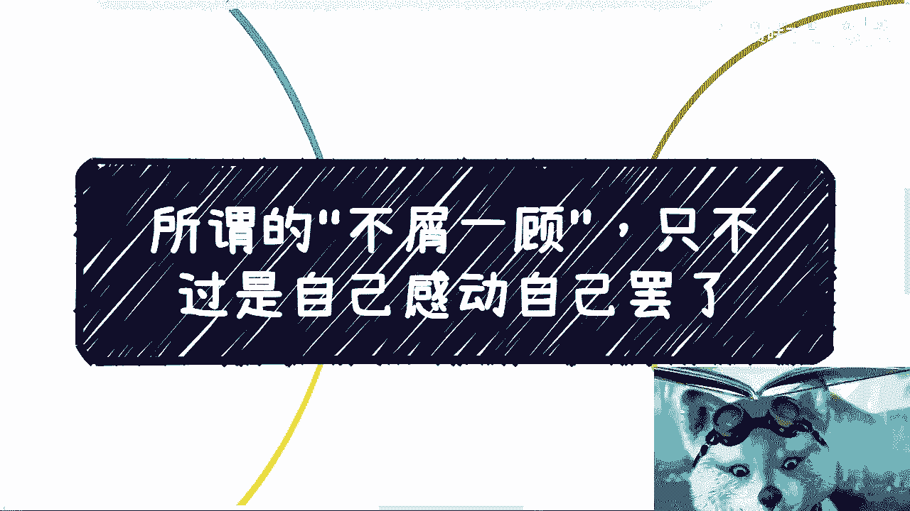
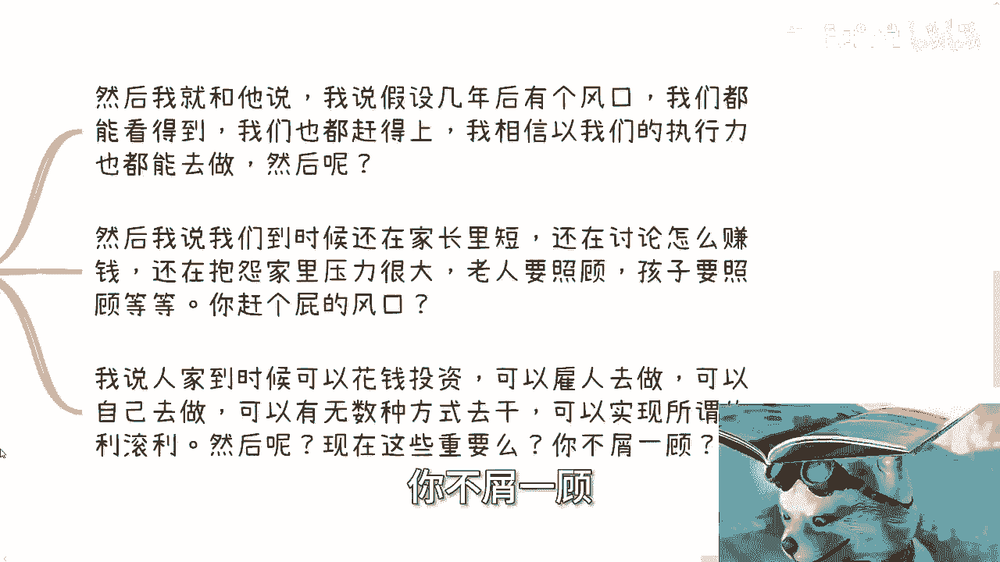
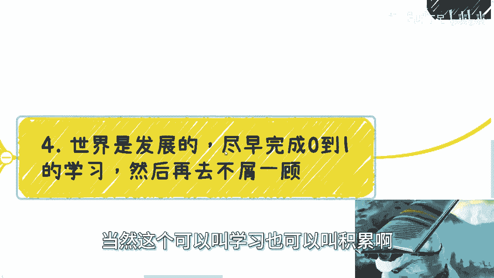
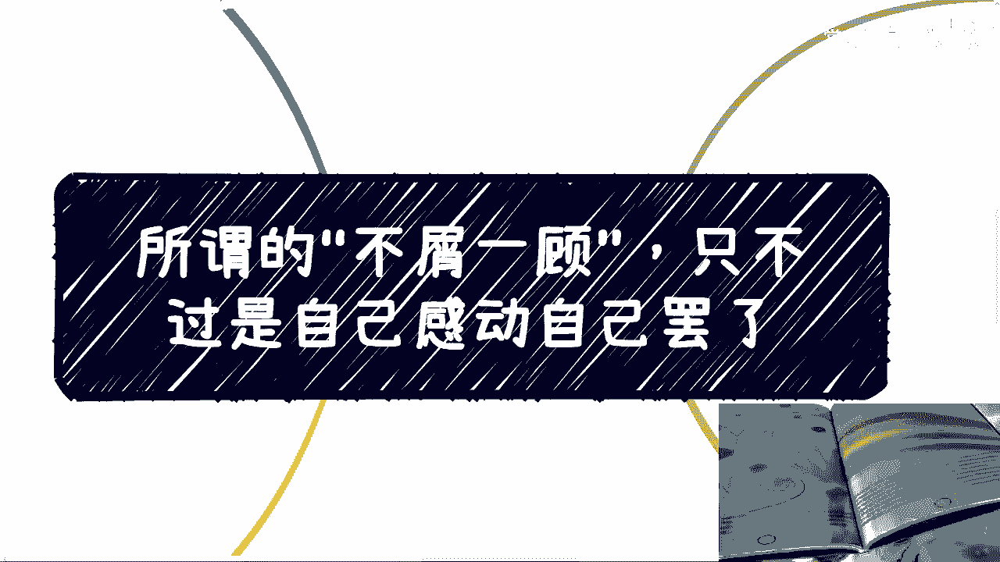

# 所谓的“不屑一顾”，只不过是自己感动自己罢了 - P1 - 赏味不足 - BV1Hy421z786

大家好啊，那个杭州活动继续报名啊，25号下午在那个杭州上城区好吧，详情的话进我动态啊，报名私信我就行啊，呃我们这一期来讲的呢。

是因为前两天有一个我我朋友吧啊，也算创业了45年了，到上海来这边找我玩，然后就晚上两个人在那边酒店里在聊嘛，啊我当初跟他得出的结论啊，叫做所谓的不屑一顾啊，只不过是自己在感动自己罢了。

没什么卵用啊，我来跟大家分享一下这个故事啊，就前两天我跟我一个创业的朋友聊对吧，青岛过来的，然后就聊一下最近的发展，首先啊我们先聊聊他做的业务啊，他现在做的呢是叫做文创文创。

那么文创呢他还做的呢是实体文创啊，我就跟他讲，我说那我就问你这个问题，我说我不关心你做什么东西的文创啊，我说这个东西你要在当下的中国，你想卖得出去对吧好，你要么就是走，比如说法拉利啊。

走什么TIFFANY啊，走什么高端的联名啊，你要么就是说说跟华硕会啊，或者跟其他的酒店啊，或者商超啊，什么什么龙湖天街啊，这种你去谈合作，你既不走高端联名，你不去谈合作，你怎么卖啊，我就问你怎么卖啊。

你开个电商直播去卖吗，啊谁来买啊，对不对，你要么就各个地摊去摆是吗，哦你单纯跟我说啊，那个那个陈总，对我这个东西我放到直播上面去卖，挂在什么地方卖，谁来买啊，中国当下什么情况，老百姓饭都吃不上对吧。

工作都找不到，我他妈来买你这个玩意儿啊，我说你又不是哆啦A梦，又不是七龙珠，又不是死神，买，买个屁买个屁啊，啊又不是咒术回战，对不对啊，然后一个逻辑呢就是说你要走高端市场，一个逻辑就是你要借力打力对吧。

就是借别的有市场的东西去合作，我说你两个都不做啊，你你你怎么卖，哎我奇了怪了，然后他跟我说，我半年卖了多少钱多少钱，我说你卖半年卖这钱啊，你明年后年就他妈饿死了，还卖卖呢，卖个屁对啊。

然后呢我就给大家讲，我说你现在那当然啊，当然我后来跟他聊呢也也这么说啊，就是说对他来讲呢，现在这是一个唯一的有现金流的业务，我总不能把他一个唯一的有限理论业务打死吧，对吧，那就我之前说的。

我说产品跟服务其实都不重要，重要的是变现手段跟变现模式，这个你没把握好，你就赚不到钱啊，你不要再跟我说什么产品服务有卵用啊，啊没卵用的呀，啊第二嗯，接着呢就提到这个主题啊，不屑一顾，我跟他说啊。

我说抖音跟快手其实现在很赚钱，而且尤其是下下沉3~5线市场啊，尤其是现在比较迎合的那个那个当下市场领域，就是有些热点的市场领域啊，我就不方便多讲啊，就很多人我了解过也是没有多高的学历。

产品也没有多大的深度，就说难听点，大部分没什么门槛，大部分人能做的都做啊，但是他们执行力强，而且又迎合了一波热点跟焦虑，自然就能赚很多钱，我当时就跟他说，我说不比你跟你合伙人现在舒服啊。

啊不比你们妈的在那边折腾，折腾个35年舒服吗，啊不比你们现在做的有爽感吗，有成就感吗，你知道吗，他就跟我讲什么，他说是二闪，你千万别别把这个事当做我合伙人，因为他合伙人我也认识了啊。

他说你千万别当着我合伙人说这个事啊，他很不屑一顾这种行为，你知道吗，我当时听到这句话，我马上就跟他讲，我说他妈屁话啊，我说你以为我很屑一顾吗，哎妈奇了怪了，但我说重要的啦啊啊我说我们都是尘埃哦。

你不屑一顾，我不屑一顾，怎么滴呀，妈太把你当个人了，也太把我当个人了啊，我们他妈的看什么问题，重要的啦，有屁关系啊，是不懒，我，我跟他说，我说你30岁嗯，不止30了，他三十四五了，我说你三十四五了。

你现在最重要的是生存啊，上有老，下有小，你你现在创业为了什么，不就是为了你以后沉淀积累，沉淀你的抗风险能力吗，哦你现在钱还没赚到，跟我说，不屑一顾啊，奇了怪了对吧，然后我就跟他说，我说我们假设啊。

假设3年后，5年后有个风口，我说我们假设几年后有个风口，我们都看得见，我们也都赶得上，我也相信以我们创业的执行力，我们也都能去做对吧，但是然后呢唉我就问，然后呢，我说然后到上海来找我，对不对。

我说我们到时候还是坐在这家长里短，然后还是在讨论怎么赚钱，还是在抱怨大家家里压力多么大，还是在抱怨老人要照顾孩子，要照顾上上有老，下有小，还是要抱怨现在市场不好，然后呢，然后呢。

然后我们就是一个loser，我们就是个对吧，然后就轮到人家对我们不屑一顾了，有卵用啊，我说对不对，你活活在这世界上，你不活的明白一点吗，我说人家到时候可以花钱去投资，可以雇人去做，可以自己去做。

你可以有五种种方式，就是它可以有无数种方式去干，可以实现所谓的利滚利，什么叫利滚利啊，就是你看到个红利，你得去干他对吧，但是你干的话，你有很多种办法，有的是你自己不懂，你可以就是说咳咳自己年轻对吧。

你说我年轻，我有时间我自己去看，要么就是你之前赚到钱，他可以投入钱去干对吧，但然后呢，我说现在这些重要吗，啊所以你想想你现在这些重要吗，你不屑一顾。

那么最后就是什么叫做世界是发展的，尽可能快的完成0~1的学习，当然这个可以叫学习。

也可以叫积累啊，无所谓啊，然后再去不屑一顾，就是你干嘛，我跟他说，我说我说你们现在自己都没赚到钱，创业好多年了，然后你年纪也不小了，自己还在摸索啊，35这边写错35啊，你别管别人对吧。

我说你不屑一顾的前提是你自己先雪球滚起来，你不屑一顾，你最终人家一年值班吗，你一年还在那边浪费时间，他妈到底谁啊。

然后第二，我们一般呢手上都是有几个雪球同步往前滚的，这个我之前也跟你们说过，有的滚的快，有的滚得慢，有的滚的远，有的滚得近，你手上必须有不同的这种商业业务，商业模型才是一个健康的商业模型啊。

而且最重要的是我们要开始滚，而且我们要尽可能的早的开始滚，很多人说我先打工，我先去做铺垫，铺铺垫可不可以，可以没问题，但你需要考虑你两个你永远绕不开的问题，其一就是除了你真正开始滚这个雪球以外。

别的你所有做准备和做铺垫，本质上对你是没有帮助的，就是你所谓在准备和在铺垫，你以为是有帮助的，但其实你都在原地踏步，就像你就像你前面有个泳池，你必须跳进去滚两圈，你前面有个泥潭，你必须你必须进去滚两圈。

你才能学习，你不能说哦，来啊，陈老师，我要学跳跳水对吧，我在这边练这个跳水姿势就好，摆这pose，摆pose永远不跳下去，那练个屁啊，对不对啊，然后另外一点就是说社会是发展的嗯，你年龄也是在增长的。

未来你烦恼的操心的事情，永远会比你年轻的时候要多，那么你准备什么时候开始0~1呢，你说你准备什么时候来滚雪球呢，很多人永远都在准备，从来不真正开始，就像我刚刚说的，永远都在摆pose。

不不他妈跳进去有什么用，我这个写错了是吧对吧，然后等到你年纪大了对吧，然后就是这个时间往后推移了，你最终就是妥协啊，怎么办呢，没有办法，要么就安慰自己心有余力不足，要么就安慰自己自己不是这块料。

但其实哎但其实我这么说，我觉得每个人一生当中总都有机会去碰到风口，也都有机会去把握的，但但你把不把握是你自己说了算的啊，你永远在那边，就像我说的，永远摆pose，永远摆pose，永远准备有什么用啊。

没用啊，你就像我以前我在你们这个年龄，我毕业差不多两年半，两年左右时间，我就开始做政企的培训对吧，正经的咨询那一样的呀，你要不当时问我陈老师，你懂不懂，懂个屁啊，你要当时问我陈老师周年能不能赚钱。

我怎么知道啊，车老师，你心里有没有底啊，有个底个屁啊，对了，那怎么办呢，你不做怎么办呢，就是我永远跟我自己说，哎呀我感觉我不行，哎我感觉我好像做不了这个东西，哎呀我感觉我好像比如说讲了。

别人是不是不相信我要命了，那我永远就在那边想，222年3年四年五年过去，那最后我能得到什么呢，我现在就是个，我就是个loser，我就是什么都不懂的人，有用了没有用的呀，然后我只能在这边跟你们说。

曾经有个机会放在我的面前，我以为我自己搞不成的，但其实我能搞的有什么用呢，这都是马后炮啊，师傅了，你只有去趟了这趟浑水，你只有跳进去，你才能知道是什么样子的，你就像你就像刚刚现在是下午嘛，就刚刚就行了。

那个小姑娘跟我说的，他说我不知道怎么跟厉害的人聊天，我说有什么厉害不厉害的，我说我就告诉你下到传销上，我说就我聊下来，他们就有一个共同的特点，就是不要脸诶，厉害不厉害，不好意思。

这词我没有在任何人身上看到过，没有的啊，除非除非你跟我说啊，你比如说什么什么什么像以前刘翔啊对吧，像像那个啊这那个叫什么得诺贝尔奖的对吧，那我承认的那剩下的人有什么区别呢，你也是个人，我也是个人。

怎么啦，你比我厉害，还说我比你厉害，我没看出来，我只看出来的是背后有信息差，没有了，就每个人的经历不同，仅仅此而已，有什么厉害不厉害的啊，啊你说他手上有什么技能是我不会的啊，我手上有什么他不会的。

我没有看出来，我一点都没看出来，仅此而已对吧，你非要说啊，他有比如说他会编程，我不会，那我就问问你会编程哦，你能赚钱吗啦不能有卵用啊，对不对啊，然后你跟我说，哎他他那个什么啊，那个量化做的很好。

量化做的很好哦，你一年多少百分比啊，对不对，你一年就10%几20%几，你本金就他妈10万20万，你跟我说他妈你会量化有卵用啊，who care啊对吧，所以我没有看出来有什么厉害不厉害的。

就是就是所有的人我就做事情一样的，就是在年轻的时候或者在当下，只关心当下，你能不能赚钱，你能不能积累，不要去管别人，你管别人干嘛呢，然后你也而且在这里面也没有什么清高，不清高的，你清高可以，你先赚到钱。

你先有立足之本，你清高对吧，哦你又赚不到钱，就像我跟我跟我朋友说的，对我说你又赚不到钱，你还要站着赚钱，你怎么赚，你又不愿意跪是吧，那行就这么着好吧，然后嗯对，然后活动反正要来的。

你们可以再看一下我动态好吧，然后就报名，然后职业规划，商业规划合同啊，啊包括你们有什么项目啊，你们觉得吃不准的等等等等，你们也可以整理好好吧，我们再约啊。

